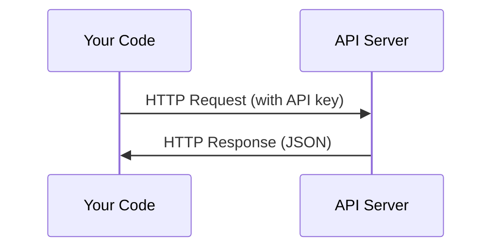

# API 与密钥

> 每个 AI API（应用程序编程接口）的工作方式都一样：发送请求，接收响应。细节各有不同，基本模式始终不变。

**Type:** Build
**Languages:** Python, TypeScript
**Prerequisites:** 阶段 0，第 01 课
**Time:** ~30 分钟

## 学习目标

- 使用环境变量和 `.env` 文件安全地保存 API 密钥
- 分别通过 Anthropic Python SDK（软件开发工具包）和直接发送 HTTP 请求的方式调用大语言模型（LLM）API
- 对比使用 SDK 与直接发送 HTTP 请求时的请求/响应格式，辅助调试
- 识别并处理身份验证、速率限制（rate limit）等常见 API 错误

## 要解决的问题

从阶段 11 开始，你将调用 LLM 的 API，包括 Anthropic、OpenAI 和 Google 提供的接口。在阶段 13-16，你将构建循环调用这些 API 的智能体（agent）。因此，你需要了解 API 密钥的工作方式、如何安全保存密钥，以及如何完成第一次 API 调用。

## 核心概念



每次 API 调用都包含：
1. 一个端点（endpoint，以 URL 表示）
2. 一个 API 密钥（用于身份验证）
3. 一个请求体（你希望执行的操作）
4. 一个响应体（返回给你的内容）

```figure
s0-secret-inject
```

## 动手实现

### 步骤 1：安全保存 API 密钥

绝不要把 API 密钥写进代码。请使用环境变量。

```bash
export ANTHROPIC_API_KEY="sk-ant-..."
export OPENAI_API_KEY="sk-..."
```

也可以使用 `.env` 文件（记得将它加入 `.gitignore`）：

```text
ANTHROPIC_API_KEY=sk-ant-...
OPENAI_API_KEY=sk-...
```

### 步骤 2：第一次 API 调用（Python）

```python
import os

import anthropic

client = anthropic.Anthropic()

MODEL = os.environ.get("LLM_MODEL", "claude-sonnet-5")

response = client.messages.create(
    model=MODEL,
    max_tokens=256,
    messages=[{"role": "user", "content": "What is a neural network in one sentence?"}]
)

print(response.content[0].text)
```

`LLM_MODEL` 用于选择 Anthropic 模型 ID，默认值是不带日期的 Sonnet 别名。其他提供商（OpenAI、Google 等）也采用“密钥加模型 ID”的模式，但各自的 SDK、端点和请求/响应 schema（结构定义）不同。

### 步骤 3：第一次 API 调用（TypeScript）

```typescript
import Anthropic from "@anthropic-ai/sdk";

const client = new Anthropic();

const MODEL = process.env.LLM_MODEL ?? "claude-sonnet-5";

const response = await client.messages.create({
  model: MODEL,
  max_tokens: 256,
  messages: [{ role: "user", content: "What is a neural network in one sentence?" }],
});

console.log(response.content[0].text);
```

### 步骤 4：直接发送 HTTP 请求（不使用 SDK）

```python
import os
import urllib.request
import json

url = "https://api.anthropic.com/v1/messages"
headers = {
    "Content-Type": "application/json",
    "x-api-key": os.environ["ANTHROPIC_API_KEY"],
    "anthropic-version": "2023-06-01",
}
body = json.dumps({
    "model": os.environ.get("LLM_MODEL", "claude-sonnet-5"),
    "max_tokens": 256,
    "messages": [{"role": "user", "content": "What is a neural network in one sentence?"}],
}).encode()

req = urllib.request.Request(url, data=body, headers=headers, method="POST")
with urllib.request.urlopen(req) as resp:
    result = json.loads(resp.read())
    print(result["content"][0]["text"])
```

这就是 SDK 在内部执行的操作。理解直接发送 HTTP 请求的方式有助于调试。

## 实际使用

本课程会用到以下 API：

| API | 何时需要 | 免费额度 |
|-----|-----------------|-----------|
| Anthropic (Claude) | 阶段 11-16（智能体、工具） | 注册可获 $5 额度 |
| OpenAI | 阶段 11（对比） | 注册可获 $5 额度 |
| Hugging Face | 阶段 4-10（模型、数据集） | 免费 |

你现在不必全部配置好。等课程需要时再设置即可。

## 交付成果

本课产出：
- `outputs/prompt-api-troubleshooter.md`：诊断常见 API 错误

## 练习

1. 获取 Anthropic API 密钥，并完成第一次 API 调用
2. 尝试直接发送 HTTP 请求的版本，并将响应格式与 SDK 版本进行对比
3. 故意使用错误的 API 密钥，阅读返回的错误消息

## 关键术语

| 术语 | 常见说法 | 实际含义 |
|------|----------------|----------------------|
| API 密钥 | “API 的密码” | 用于识别账户并授权请求的唯一字符串 |
| 速率限制 | “他们在限制我的请求速率” | 每分钟/每小时允许的最大请求数，用于防止滥用并保障公平使用 |
| token（词元） | “一个单词”（在 API 语境中） | 一种计费单位：输入 token 和输出 token 分别统计、分别计费 |
| 流式输出（streaming） | “实时响应” | 逐词接收响应，而不必等待完整响应 |
