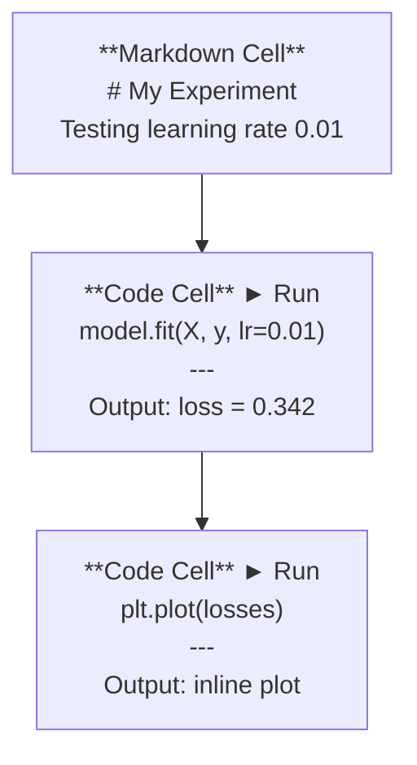
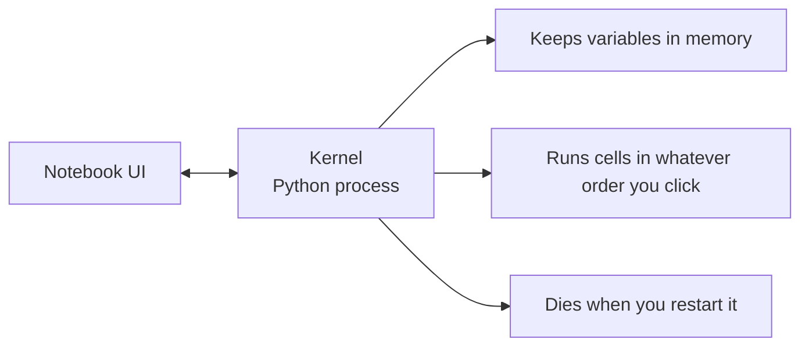

# Jupyter 笔记本

> 笔记本（notebook）是 AI 工程的实验台。你在这里搭建原型，再将验证可行的成果投入生产。

**Type:** Build
**Languages:** Python
**Prerequisites:** 第 0 阶段，第 01 课
**Time:** ~30 分钟

## 学习目标

- 安装并启动 JupyterLab、Jupyter Notebook，或装有 Jupyter 扩展的 VS Code
- 使用魔法命令（magic command），如 `%timeit`、`%%time` 和 `%matplotlib inline`，进行基准测试，并在笔记本内直接显示可视化结果
- 区分笔记本和脚本各自适用的场景，采用“用笔记本探索，用脚本交付”的工作流
- 识别并避免笔记本的常见陷阱：乱序执行、隐式状态（hidden state）和内存泄漏

## 要解决的问题

每篇 AI 论文、每份教程、每场 Kaggle 竞赛都会用到 Jupyter 笔记本。它让你能够分段运行代码，就地查看输出，将代码与说明文字放在一起，并快速迭代。学习 AI 却不用笔记本，就像做数学作业却不用草稿纸。

不过，笔记本也确实有陷阱。人们常常什么都用笔记本来做，连它非常不擅长的任务也不例外。学会判断什么时候该用笔记本、什么时候该用脚本，能让你以后少遇到难以排查的问题。

## 核心概念

笔记本由一系列单元格（cell）构成。每个单元格包含的要么是代码，要么是文本。



内核（kernel，即 Jupyter 的代码执行进程）是一个在后台运行的 Python 进程。运行单元格时，代码会被发送给内核，由内核执行并返回结果。所有单元格共享同一个内核，因此变量会在单元格之间保留下来。



这种“按你点击的任意顺序运行”的能力，既是强大之处，也很容易让你给自己挖坑。

```figure
s0-cell-order
```

## 动手实现

### 第 1 步：选择操作界面

三种选择，同一种文件格式：

| 界面 | 安装方法 | 适用场景 |
|-----------|---------|----------|
| JupyterLab | 先运行 `pip install jupyterlab`，再运行 `jupyter lab` | 需要完整的 IDE（集成开发环境）体验、多标签页、文件浏览器和终端 |
| Jupyter Notebook | 先运行 `pip install notebook`，再运行 `jupyter notebook` | 追求简单、轻量，每次只操作一个笔记本 |
| VS Code | 安装“Jupyter”扩展 | 直接在已有编辑器中操作，并使用 git 集成和调试功能 |

这三种界面读写的都是同一种 `.ipynb` 文件，按自己的喜好选择即可。JupyterLab 是 AI 工作中最常见的选择。

```bash
pip install jupyterlab
jupyter lab
```

### 第 2 步：掌握常用快捷键

操作时有两种模式。按 `Escape` 进入命令模式，左侧显示蓝色竖条；按 `Enter` 进入编辑模式，竖条变为绿色。

**命令模式（最常用）：**

| 按键 | 操作 |
|-----|--------|
| `Shift+Enter` | 运行当前单元格，移至下一个单元格 |
| `A` | 在上方插入单元格 |
| `B` | 在下方插入单元格 |
| `DD` | 删除单元格 |
| `M` | 转换为 Markdown 单元格 |
| `Y` | 转换为代码单元格（code cell） |
| `Z` | 撤销单元格操作 |
| `Ctrl+Shift+H` | 显示所有快捷键 |

**编辑模式：**

| 按键 | 操作 |
|-----|--------|
| `Tab` | 自动补全 |
| `Shift+Tab` | 显示函数签名 |
| `Ctrl+/` | 添加或取消注释 |

`Shift+Enter` 是你每天会用上千次的快捷键，先把它学会。

### 第 3 步：单元格类型

**代码单元格**用于运行 Python 并显示输出：

```python
import numpy as np
data = np.random.randn(1000)
data.mean(), data.std()
```

输出：`(0.0032, 0.9987)`

**Markdown 单元格**用于渲染带格式的文本。用它记录你在做什么，以及为什么这样做。它支持标题、粗体、斜体、LaTeX 数学公式（`$E = mc^2$`）、表格和图片。

### 第 4 步：魔法命令

这些命令不是 Python 语法，而是 Jupyter 特有的命令，以 `%` 开头的是行魔法命令（line magic），以 `%%` 开头的是单元格魔法命令（cell magic）。

**测量代码运行时间：**

```python
%timeit np.random.randn(10000)
```

输出：`45.2 us +/- 1.3 us per loop`

```python
%%time
model.fit(X_train, y_train, epochs=10)
```

输出：`Wall time: 2.34 s`

`%timeit` 会多次运行代码并取平均值，`%%time` 则只运行一次。对小段代码做微基准测试时用 `%timeit`，测量训练耗时时用 `%%time`。

**在单元格中显示图形：**

```python
%matplotlib inline
```

现在，每次调用 `plt.plot()` 或 `plt.show()`，图形都会直接在笔记本中渲染。

**不离开笔记本就能安装包：**

```python
!pip install scikit-learn
```

加上 `!` 前缀，就可以运行任意 Shell（命令解释器）命令。

**查看环境变量：**

```python
%env CUDA_VISIBLE_DEVICES
```

### 第 5 步：直接显示富格式输出

笔记本会自动显示单元格中最后一个表达式的结果，不过你也可以控制输出方式：

```python
import pandas as pd

df = pd.DataFrame({
    "model": ["Linear", "Random Forest", "Neural Net"],
    "accuracy": [0.72, 0.89, 0.94],
    "training_time": [0.1, 2.3, 45.6]
})
df
```

这会渲染出带格式的 HTML 表格，而不是一段纯文本输出。图形也一样：

```python
import matplotlib.pyplot as plt

plt.figure(figsize=(8, 4))
plt.plot([1, 2, 3, 4], [1, 4, 2, 3])
plt.title("Inline Plot")
plt.show()
```

图形会显示在单元格正下方。这就是笔记本在 AI 工作中占据主导地位的原因：数据、图形和代码可以放在一起查看。

显示图片：

```python
from IPython.display import Image, display
display(Image(filename="architecture.png"))
```

### 第 6 步：Google Colab

Colab 是免费的云端 Jupyter 笔记本。它提供 GPU、预装的库，以及 Google Drive 集成功能，无需配置即可使用。

1. 访问 [colab.research.google.com](https://colab.research.google.com)
2. 上传本课程中的任意 `.ipynb` 文件
3. 选择 Runtime > Change runtime type > T4 GPU（免费）

Colab 与本地 Jupyter 的区别：
- 不同会话之间不会保留文件，请保存到 Drive 或下载到本地
- 预装的库包括 numpy、pandas、matplotlib、torch、tensorflow、sklearn
- 使用 `from google.colab import files` 上传或下载文件
- 使用 `from google.colab import drive; drive.mount('/content/drive')` 获得持久化存储
- 免费版在闲置 90 分钟后会因超时而结束会话

## 实际使用

### 笔记本与脚本：分别适用于什么场景

| 适合用笔记本的任务 | 适合用脚本的任务 |
|-------------------|-----------------|
| 探索数据集 | 训练流水线 |
| 搭建模型原型 | 可复用的工具函数或程序 |
| 可视化结果 | 任何包含 `if __name__` 的代码 |
| 解释自己的工作 | 定时运行的代码 |
| 快速实验 | 生产代码 |
| 课程练习 | 包和库 |

原则是：**用笔记本探索，用脚本交付**。

AI 工作中常见的流程是：
1. 在笔记本中探索数据
2. 在笔记本中搭建模型原型
3. 验证可行后，将代码移到 `.py` 文件中
4. 再把这些 `.py` 文件导入笔记本，继续实验

### 常见陷阱

**乱序执行。** 你先运行单元格 5，再运行单元格 2，然后运行单元格 7。笔记本在你的机器上正常运行，别人从上到下运行时却出了问题。解决办法：分享前先执行 Kernel > Restart & Run All。

**隐式状态。** 你删除了一个单元格，但它创建的变量还留在内存中。笔记本表面上很干净，实际却依赖一个已经消失的单元格。解决办法：定期重启内核。

**内存泄漏。** 加载一个 4GB 数据集，训练模型，再加载另一个数据集，却没有释放任何内存。解决办法：使用 `del variable_name` 和 `gc.collect()`，或重启内核。

## 交付成果

本课产出：
- `outputs/prompt-notebook-helper.md`，用于排查笔记本问题

## 练习

1. 打开 JupyterLab，创建一个笔记本，用 `%timeit` 比较列表推导式与 numpy 创建含有 100,000 个随机数的数组时的性能
2. 创建一个同时包含 Markdown 单元格和代码单元格的笔记本，用它加载 CSV 文件、显示数据框（dataframe）并绘制图表。然后执行 Kernel > Restart & Run All，验证它能否从上到下正常运行
3. 将 `code/notebook_tips.py` 中的代码复制到 Colab 笔记本中，使用免费 GPU 运行

## 关键术语

| 术语 | 常见说法 | 实际含义 |
|------|----------------|----------------------|
| 内核 | “运行我代码的那个东西” | 一个独立的 Python 进程，负责执行单元格，并在内存中保留变量 |
| 单元格 | “一个代码块” | 笔记本中可以独立运行的单元，内容可以是代码，也可以是 Markdown |
| 魔法命令 | “Jupyter 小技巧” | 以 `%` 或 `%%` 为前缀、用于控制笔记本环境的特殊命令 |
| `.ipynb` | “笔记本文件” | 包含单元格、输出和元数据的 JSON 文件，名称源自 IPython Notebook |

## 延伸阅读

- [JupyterLab 文档](https://jupyterlab.readthedocs.io/)，介绍完整功能
- [Google Colab 常见问题](https://research.google.com/colaboratory/faq.html)，介绍 Colab 特有的限制和功能
- [28 条 Jupyter Notebook 技巧](https://www.dataquest.io/blog/jupyter-notebook-tips-tricks-shortcuts/)，介绍面向熟练用户的快捷操作
