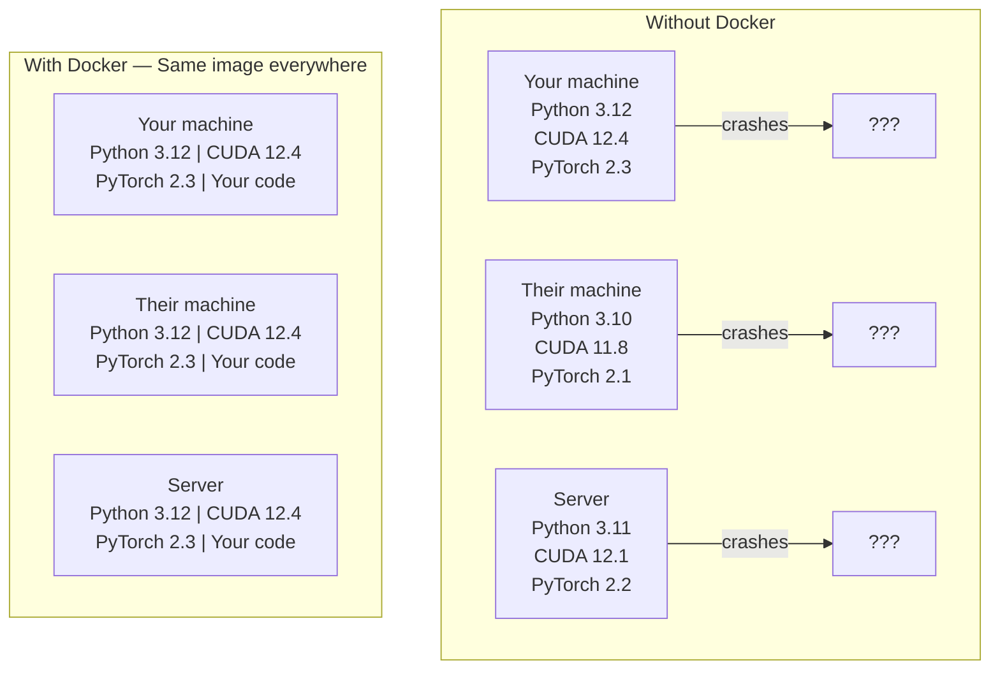

# 面向 AI 的 Docker

> 容器（container）让“在我的机器上能跑”成为过去式。

**Type:** Build
**Languages:** Docker
**Prerequisites:** 阶段 0，第 01 和 03 课
**Time:** ~60 分钟

## 学习目标

- 通过 Dockerfile 构建支持 GPU（图形处理器）的 Docker 镜像（image），其中包含 CUDA（NVIDIA 并行计算平台）、PyTorch 和 AI 库
- 将宿主机（host）目录挂载为卷（volume），使模型、数据集和代码在容器重建后仍能保留
- 配置 NVIDIA Container Toolkit，让容器能够访问 GPU
- 使用 Docker Compose 编排多服务 AI 应用（推理服务器 + 向量数据库）

## 要解决的问题

你在笔记本电脑上使用 PyTorch 2.3、CUDA 12.4 和 Python 3.12 训练了一个模型。同事使用的却是 PyTorch 2.1、CUDA 11.8 和 Python 3.10。你的模型在同事的机器上会崩溃，而你的 Dockerfile 在两台机器上都能正常使用。

AI 项目的依赖项管理常常令人头疼。典型的技术栈包括 Python、PyTorch、CUDA 驱动、cuDNN（NVIDIA 深度神经网络库）、系统级 C 库，以及 flash-attn 这类要求特定编译器版本的专用软件包。Docker 将这些内容打包成一个镜像，让它在任何地方都以相同的方式运行。

## 核心概念

Docker 将代码、运行时（runtime）、库和系统工具封装成一个隔离的单元，称为容器。你可以把它理解成轻量级虚拟机，但它共享宿主机的操作系统内核（kernel），而不是运行自己的内核，因此启动只需数秒，而非数分钟。



### 为什么 AI 项目比大多数项目更需要 Docker

1. **GPU 驱动很容易出兼容性问题。** CUDA 12.4 代码无法在 CUDA 11.8 上运行。Docker 将 CUDA 工具包隔离在容器内，同时通过 NVIDIA Container Toolkit 共享宿主机的 GPU 驱动。

2. **模型权重体积很大。** 一个参数量为 7B 的模型以 fp16（半精度）存储时占用 14 GB。你不会希望每次重建都重新下载它。Docker 卷让你可以挂载宿主机上的模型目录。

3. **多服务架构很常见。** 实际的 AI 应用并不只有一个 Python 脚本，还包括推理服务器、用于检索增强生成（RAG）的向量数据库，可能还有 Web 前端。Docker Compose 用一条命令就能编排这些服务。

### 核心词汇

| 术语 | 含义 |
|------|---------------|
| 镜像（image） | 只读模板，相当于你的菜谱，由 Dockerfile 构建而成。 |
| 容器（container） | 镜像的一个运行实例，相当于你的厨房。 |
| Dockerfile | 构建镜像的指令；按镜像层（layer）逐层构建。 |
| 卷（volume） | 容器重启后依然保留的持久化存储。 |
| docker-compose | 用 YAML 定义多容器应用的工具。 |

### AI 中常见的容器模式

```text
Dev Container
  Full toolkit. Editor support. Jupyter. Debugging tools.
  Used during development and experimentation.

Training Container
  Minimal. Just the training script and dependencies.
  Runs on GPU clusters. No editor, no Jupyter.

Inference Container
  Optimized for serving. Small image. Fast cold start.
  Runs behind a load balancer in production.
```

```figure
s0-image-layers
```

## 动手实现

### 步骤 1：安装 Docker

```bash
# macOS
brew install --cask docker
open /Applications/Docker.app

# Ubuntu
curl -fsSL https://get.docker.com | sh
sudo usermod -aG docker $USER
# Log out and back in for group change to take effect
```

验证安装：

```bash
docker --version
docker run hello-world
```

### 步骤 2：安装 NVIDIA Container Toolkit（配备 NVIDIA GPU 的 Linux 系统）

这能让 Docker 容器访问你的 GPU。macOS 和 Windows（WSL2）用户可以跳过这一步；Docker Desktop 在这些平台上采用不同的方式处理 GPU 直通。

```bash
distribution=$(. /etc/os-release;echo $ID$VERSION_ID)
curl -fsSL https://nvidia.github.io/libnvidia-container/gpgkey | sudo gpg --dearmor -o /usr/share/keyrings/nvidia-container-toolkit-keyring.gpg
curl -s -L https://nvidia.github.io/libnvidia-container/$distribution/libnvidia-container.list | \
    sed 's#deb https://#deb [signed-by=/usr/share/keyrings/nvidia-container-toolkit-keyring.gpg] https://#g' | \
    sudo tee /etc/apt/sources.list.d/nvidia-container-toolkit.list

sudo apt-get update
sudo apt-get install -y nvidia-container-toolkit
sudo nvidia-ctk runtime configure --runtime=docker
sudo systemctl restart docker
```

在容器内测试 GPU 访问：

```bash
docker run --rm --gpus all nvidia/cuda:12.4.1-base-ubuntu22.04 nvidia-smi
```

如果能看到 GPU 信息，就说明工具包工作正常。

### 步骤 3：了解基础镜像

选对基础镜像（base image），能省下数小时的调试时间。

```text
nvidia/cuda:12.4.1-devel-ubuntu22.04
  Full CUDA toolkit. Compilers included.
  Use for: building packages that need nvcc (flash-attn, bitsandbytes)
  Size: ~4 GB

nvidia/cuda:12.4.1-runtime-ubuntu22.04
  CUDA runtime only. No compilers.
  Use for: running pre-built code
  Size: ~1.5 GB

pytorch/pytorch:2.6.0-cuda12.4-cudnn9-runtime
  PyTorch pre-installed on top of CUDA.
  Use for: skipping the PyTorch install step
  Size: ~6 GB

python:3.12-slim
  No CUDA. CPU only.
  Use for: inference on CPU, lightweight tools
  Size: ~150 MB
```

### 步骤 4：编写用于 AI 开发的 Dockerfile

下面是 `code/Dockerfile` 中的 Dockerfile，请逐步阅读：

```dockerfile
FROM --platform=linux/amd64 nvidia/cuda:12.4.1-devel-ubuntu22.04

ENV DEBIAN_FRONTEND=noninteractive
ENV PYTHONUNBUFFERED=1

RUN apt-get update && apt-get install -y --no-install-recommends \
    software-properties-common \
    git \
    curl \
    build-essential \
    && add-apt-repository -y ppa:deadsnakes/ppa \
    && apt-get update && apt-get install -y --no-install-recommends \
    python3.12 \
    python3.12-venv \
    python3.12-dev \
    && rm -rf /var/lib/apt/lists/*

RUN update-alternatives --install /usr/bin/python python /usr/bin/python3.12 1

RUN curl -sSL https://raw.githubusercontent.com/pypa/get-pip/3b73145063be545b649ad9ca83ea8da5fc915a4f/public/get-pip.py -o /tmp/get-pip.py \
    && echo "a341e1a43e38001c551a1508a73ff23636a11970b61d901d9a1cad2a18f57055  /tmp/get-pip.py" | sha256sum -c - \
    && python /tmp/get-pip.py \
    && rm /tmp/get-pip.py \
    && update-alternatives --install /usr/bin/pip pip /usr/local/bin/pip3.12 1

RUN python -m pip install --no-cache-dir --upgrade pip setuptools wheel

RUN python -m pip install --no-cache-dir \
    torch==2.6.0+cu124 \
    torchvision==0.21.0+cu124 \
    torchaudio==2.6.0+cu124 \
    --index-url https://download.pytorch.org/whl/cu124

RUN python -m pip install --no-cache-dir \
    numpy \
    pandas \
    scikit-learn \
    matplotlib \
    jupyter \
    transformers \
    datasets \
    accelerate \
    safetensors

WORKDIR /workspace

VOLUME ["/workspace", "/models"]

EXPOSE 8888

CMD ["python"]
```

构建镜像：

```bash
docker build -t ai-dev -f phases/00-setup-and-tooling/07-docker-for-ai/code/Dockerfile .
```

首次构建需要一些时间（要下载 CUDA 基础镜像 + PyTorch）。之后的构建会使用缓存的镜像层。

**macOS / Apple Silicon (M1/M2/M3/M4)：** `FROM` 行中的 `--platform=linux/amd64` 是这次构建能在 Mac 上成功的关键。CUDA 基础镜像也提供 arm64 变体，Docker Desktop 在 Apple Silicon 上会自动选择它，但 PyTorch 的 `cu124` wheel 包只面向 x86_64 发布，因此 `pip install torch==2.6.0+cu124` 这一镜像层会构建失败，并报错 `No matching distribution found for torch==2.6.0+cu124`。锁定平台后，会拉取 x86_64 镜像并通过仿真运行：构建速度会变慢，而且容器无法使用 GPU（无论选择哪种方式，Mac 上都没有 CUDA）。在 Mac 上运行下方的 `docker run` 命令时，请去掉 `--gpus all`。如果要在 Apple Silicon 上使用 GPU，请使用第 01 课中支持 MPS（Apple GPU 加速后端）的构建版本，以原生方式运行课程示例；本镜像则留给配备 NVIDIA GPU 的 x86_64 Linux 宿主机使用。

运行容器：

```bash
docker run --rm -it --gpus all \
    -v $(pwd):/workspace \
    -v ~/models:/models \
    ai-dev python -c "import torch; print(f'PyTorch {torch.__version__}, CUDA: {torch.cuda.is_available()}')"
```

在容器内运行 Jupyter：

```bash
docker run --rm -it --gpus all \
    -v $(pwd):/workspace \
    -v ~/models:/models \
    -p 8888:8888 \
    ai-dev jupyter notebook --ip=0.0.0.0 --port=8888 --no-browser --allow-root
```

### 步骤 5：为数据和模型挂载卷

卷挂载（volume mount）对 AI 工作至关重要。没有它们，下载的 14 GB 模型就会在容器停止时消失。

```bash
# Mount your code
-v $(pwd):/workspace

# Mount a shared models directory
-v ~/models:/models

# Mount datasets
-v ~/datasets:/data
```

在训练脚本中，从挂载的路径加载模型：

```python
from transformers import AutoModel

model = AutoModel.from_pretrained("/models/llama-7b")
```

模型保存在宿主机的文件系统上。你可以按需反复重建容器，无须重新下载模型。

### 步骤 6：使用 Docker Compose 运行多服务 AI 应用

实际的 RAG 应用需要推理服务器和向量数据库。Docker Compose 用一条命令就能同时运行两者。

参见 `code/docker-compose.yml`：

```yaml
services:
  ai-dev:
    build:
      context: .
      dockerfile: Dockerfile
    deploy:
      resources:
        reservations:
          devices:
            - driver: nvidia
              count: all
              capabilities: [gpu]
    volumes:
      - ../../../:/workspace
      - ~/models:/models
      - ~/datasets:/data
    ports:
      - "8888:8888"
    stdin_open: true
    tty: true
    command: jupyter notebook --ip=0.0.0.0 --port=8888 --no-browser --allow-root

  qdrant:
    image: qdrant/qdrant:v1.12.5
    ports:
      - "6333:6333"
      - "6334:6334"
    volumes:
      - qdrant_data:/qdrant/storage

volumes:
  qdrant_data:
```

启动所有服务：

```bash
cd phases/00-setup-and-tooling/07-docker-for-ai/code
docker compose up -d
```

现在，AI 开发容器可以通过服务名，在 `http://qdrant:6333` 访问向量数据库。Docker Compose 会自动创建共享网络。

在 AI 容器内测试连接：

```python
from qdrant_client import QdrantClient

client = QdrantClient(host="qdrant", port=6333)
print(client.get_collections())
```

停止所有服务：

```bash
docker compose down
```

加上 `-v` 还会删除 qdrant 卷：

```bash
docker compose down -v
```

### 步骤 7：AI 工作中实用的 Docker 命令

```bash
# List running containers
docker ps

# List all images and their sizes
docker images

# Remove unused images (reclaim disk space)
docker system prune -a

# Check GPU usage inside a running container
docker exec -it <container_id> nvidia-smi

# Copy a file from container to host
docker cp <container_id>:/workspace/results.csv ./results.csv

# View container logs
docker logs -f <container_id>
```

## 实际使用

现在你已经拥有一个具备可复现性（reproducibility）的 AI 开发环境。在本课程后续的学习中：

- 使用 `docker compose up`，同时启动开发环境和向量数据库
- 将代码、模型和数据挂载为卷，避免重建时丢失内容
- 某节课需要新的 Python 软件包时，将它添加到 Dockerfile 中，然后重新构建
- 将 Dockerfile 分享给队友，让他们获得完全相同的环境。

### 没有 GPU？

移除 `--gpus all` 标志以及 NVIDIA deploy 配置块。容器依然可以用于基于 CPU（中央处理器）的课程。PyTorch 会检测到 CUDA 不可用，并自动回退到 CPU。

## 练习

1. 使用 Dockerfile 构建镜像，并在容器内运行 `python -c "import torch; print(torch.__version__)"`
2. 启动 docker-compose 服务栈，确认能从 AI 容器通过 `http://qdrant:6333/collections` 访问 Qdrant
3. 在 Dockerfile 中添加 `flask`，重新构建，并在端口 5000 上运行一个简单的 API（应用程序编程接口）服务器。使用 `-p 5000:5000` 映射端口
4. 使用 `docker images` 查看镜像大小。尝试将基础镜像从 `devel` 切换为 `runtime`，并比较大小

## 关键术语

| 术语 | 常见说法 | 实际含义 |
|------|----------------|----------------------|
| 容器 | “轻量级虚拟机” | 使用宿主机内核的隔离进程，拥有自己的文件系统和网络 |
| 镜像层 | “缓存的步骤” | 每条 Dockerfile 指令都会创建一个镜像层。未发生变化的镜像层会被缓存，因此重建很快。 |
| NVIDIA Container Toolkit | “在 Docker 中使用 GPU” | 一种运行时钩子，通过 `--gpus` 标志让容器能够访问宿主机的 GPU |
| 卷挂载 | “共享文件夹” | 将宿主机上的目录映射到容器中。容器停止后，更改仍会保留。 |
| 基础镜像 | “起点” | Dockerfile 在 `FROM` 指定的镜像基础上继续构建。它决定了预装哪些内容。 |
