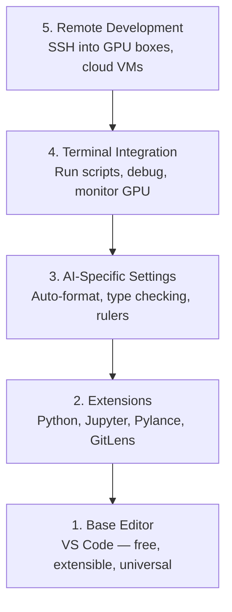

# 编辑器配置

> 编辑器是你的搭档。配置好一次，它就能少添麻烦、多帮你干活。

**Type:** Build
**Languages:** --
**Prerequisites:** 阶段 0，第 01 课
**Time:** ~20 分钟

## 学习目标

- 安装 VS Code，以及 Python、Jupyter、代码检查和远程 SSH 所需的扩展
- 为 AI 工作流配置保存时格式化、类型检查和 Notebook 输出滚动
- 配置 Remote SSH，像操作本地机器一样编辑和调试远程 GPU 机器上的代码
- 评估其他编辑器（Cursor、Windsurf、Neovim）及其用于 AI 工作时的取舍

## 要解决的问题

你会花上数千小时在编辑器里写 Python、运行 Notebook、调试训练循环，以及通过 SSH 连接 GPU 机器。如果编辑器配置不当，每次工作都会遇到阻碍：没有自动补全、没有类型提示、不在代码旁显示错误、需要手动格式化，终端操作也不顺手。

正确配置只需 20 分钟。跳过它，每天都会多花 20 分钟。

## 核心概念

AI 工程的编辑器环境需要五个部分：



```figure
s0-lsp-roundtrip
```

## 动手实现

### 步骤 1：安装 VS Code

推荐使用 VS Code。它免费、能在各种操作系统上运行，对 Jupyter Notebook 的支持完善，扩展生态也覆盖了 AI 工作所需的功能。

从 [code.visualstudio.com](https://code.visualstudio.com/) 下载。

在终端中验证：

```bash
code --version
```

如果 macOS 找不到 `code`，打开 VS Code，按 `Cmd+Shift+P`，输入“Shell Command”，然后选择“Install 'code' command in PATH”。

### 步骤 2：安装必需的扩展

打开 VS Code 的集成终端（各平台均使用 `` Ctrl+` ``），安装 AI 工作所需的扩展：

```bash
code --install-extension ms-python.python
code --install-extension ms-python.vscode-pylance
code --install-extension ms-toolsai.jupyter
code --install-extension eamodio.gitlens
code --install-extension ms-vscode-remote.remote-ssh
code --install-extension ms-python.debugpy
code --install-extension ms-python.black-formatter
code --install-extension charliermarsh.ruff
```

各扩展的作用如下：

| 扩展 | 用途 |
|-----------|-----|
| Python | 语言支持、虚拟环境检测、运行/调试 |
| Pylance | 快速类型检查、自动补全、导入解析 |
| Jupyter | 在 VS Code 中运行 Notebook、查看变量 |
| GitLens | 查看谁修改了哪些内容，在代码旁显示 git blame 信息 |
| Remote SSH | 像打开本地目录一样，打开远程 GPU 机器上的目录 |
| Debugpy | 对 Python 代码进行单步调试 |
| Black Formatter | 保存时自动格式化，保持风格一致 |
| Ruff | 快速执行代码检查，发现常见错误 |

本课的 `code/.vscode/extensions.json` 文件包含完整的推荐扩展列表。打开项目目录时，VS Code 会提示你安装这些扩展。

### 步骤 3：配置设置

复制本课 `code/.vscode/settings.json` 中的设置，或通过 `Settings > Open Settings (JSON)` 手动配置。

AI 工作所需的关键设置：

```jsonc
{
    "python.analysis.typeCheckingMode": "basic",
    "editor.formatOnSave": true,
    "editor.rulers": [88, 120],
    "notebook.output.scrolling": true,
    "files.autoSave": "afterDelay"
}
```

这些设置为什么重要：

- **将类型检查设为 basic**：在运行前发现参数类型错误，减少排查张量形状不匹配和 API（应用程序编程接口）参数错误的时间。
- **保存时格式化**：格式问题交给 Black 处理，不必再操心。
- **在 88 和 120 列显示标尺**：Black 在 88 列处换行；120 列标尺帮助你发现过长的文档字符串和注释。
- **Notebook 输出滚动**：训练循环会打印数千行内容；不启用滚动，输出面板就会不断膨胀。
- **自动保存**：你可能忘记保存，导致训练脚本运行旧代码。自动保存可以避免这个问题。

### 步骤 4：集成终端

你会在 VS Code 的集成终端中运行训练脚本、监控 GPU 和管理环境。

合理配置：

```jsonc
{
    "terminal.integrated.defaultProfile.osx": "zsh",
    "terminal.integrated.defaultProfile.linux": "bash",
    "terminal.integrated.fontSize": 13,
    "terminal.integrated.scrollback": 10000
}
```

实用快捷键：

| 操作 | macOS | Linux/Windows |
|--------|-------|---------------|
| 切换终端显示 | `` Ctrl+` `` | `` Ctrl+` `` |
| 新建终端 | `` Ctrl+Shift+` `` | `` Ctrl+Shift+` `` |
| 拆分终端 | `Cmd+\` | `Ctrl+Shift+5` |

拆分终端很实用：一个终端运行脚本，另一个用 `nvidia-smi -l 1` 或 `watch -n 1 nvidia-smi` 监控 GPU。

### 步骤 5：远程开发（通过 SSH 连接 GPU 机器）

这是 AI 工作最重要的扩展。你会在远程机器上训练模型，例如云虚拟机、实验室服务器、Lambda 或 Vast.ai。Remote SSH 让你能打开远程文件系统、编辑文件、使用终端和调试代码，就像所有内容都在本地一样。

配置步骤：

1. 安装 Remote SSH 扩展（步骤 2 中已完成）。
2. 按 `Ctrl+Shift+P`（或 `Cmd+Shift+P`），输入“Remote-SSH: Connect to Host”。
3. 输入 `user@your-gpu-box-ip`。
4. VS Code 自动在远程机器上安装服务端组件。

如需免密码访问，请配置 SSH 密钥：

```bash
ssh-keygen -t ed25519 -C "your-email@example.com"
ssh-copy-id user@your-gpu-box-ip
```

为方便使用，将主机加入 `~/.ssh/config`：

```text
Host gpu-box
    HostName 203.0.113.50
    User ubuntu
    IdentityFile ~/.ssh/id_ed25519
    ForwardAgent yes
```

现在执行 `Remote-SSH: Connect to Host > gpu-box` 即可快速连接。

## 其他选择

### Cursor

[cursor.com](https://cursor.com) 是内置 AI 代码生成功能的 VS Code 派生版本（fork）。它使用相同的扩展生态和设置格式。如果你使用 Cursor，本课内容仍然适用，导入相同的 `settings.json` 和 `extensions.json` 即可。

### Windsurf

[windsurf.com](https://windsurf.com) 是另一个以 AI 为核心的 VS Code fork。情况类似：扩展相同，设置格式相同，也支持 Remote SSH。

### Vim/Neovim

如果你已经使用 Vim 或 Neovim，并且用得很熟练，就继续使用。AI Python 工作所需的最小配置如下：

- 用 **pyright** 或 **pylsp** 进行类型检查（通过 Mason 或手动安装）
- 用 **nvim-lspconfig** 集成语言服务器
- 用 **jupyter-vim** 或 **molten-nvim** 实现类似 Notebook 的执行方式
- 用 **telescope.nvim** 搜索文件/符号
- 将 **none-ls.nvim** 与 black、ruff 配合，用于格式化/代码检查

如果你还没用过 Vim，先别在这时入门。学习它会分散学习 AI 工程的精力，使用 VS Code 即可。

## 实际使用

配置完成后，你的日常工作流如下：

1. 在 VS Code 中打开项目目录，或通过 Remote SSH 连接 GPU 机器。
2. 借助自动补全、类型提示和行内错误提示，在编辑器中编写 Python。
3. 使用 Jupyter 扩展，直接在编辑器中运行 Jupyter Notebook。
4. 在集成终端中运行训练脚本、执行 `uv pip install`，以及监控 GPU。
5. 提交前用 GitLens 检查改动。

## 练习

1. 安装 VS Code 和步骤 2 列出的所有扩展
2. 将本课的 `settings.json` 复制到你的 VS Code 配置中
3. 打开一个 Python 文件，验证 Pylance 会显示类型提示，且 Black 会在保存时格式化
4. 如果你可以访问远程机器，配置 Remote SSH 并打开其中的一个目录

## 关键术语

| 术语 | 常见说法 | 实际含义 |
|------|----------------|----------------------|
| LSP | “自动补全引擎” | Language Server Protocol（语言服务器协议）：编辑器从特定语言的服务器获取类型信息、补全和诊断结果的标准 |
| Pylance | “Python 插件” | Microsoft 的 Python 语言服务器，使用 Pyright 进行类型检查并提供 IntelliSense |
| Remote SSH | “在服务器上工作” | VS Code 扩展，在远程机器上运行轻量级服务器，将界面传送到本地编辑器 |
| 保存时格式化 | “自动美化” | 每次保存时，编辑器都会运行格式化工具（Black、Ruff），让代码风格保持一致 |
