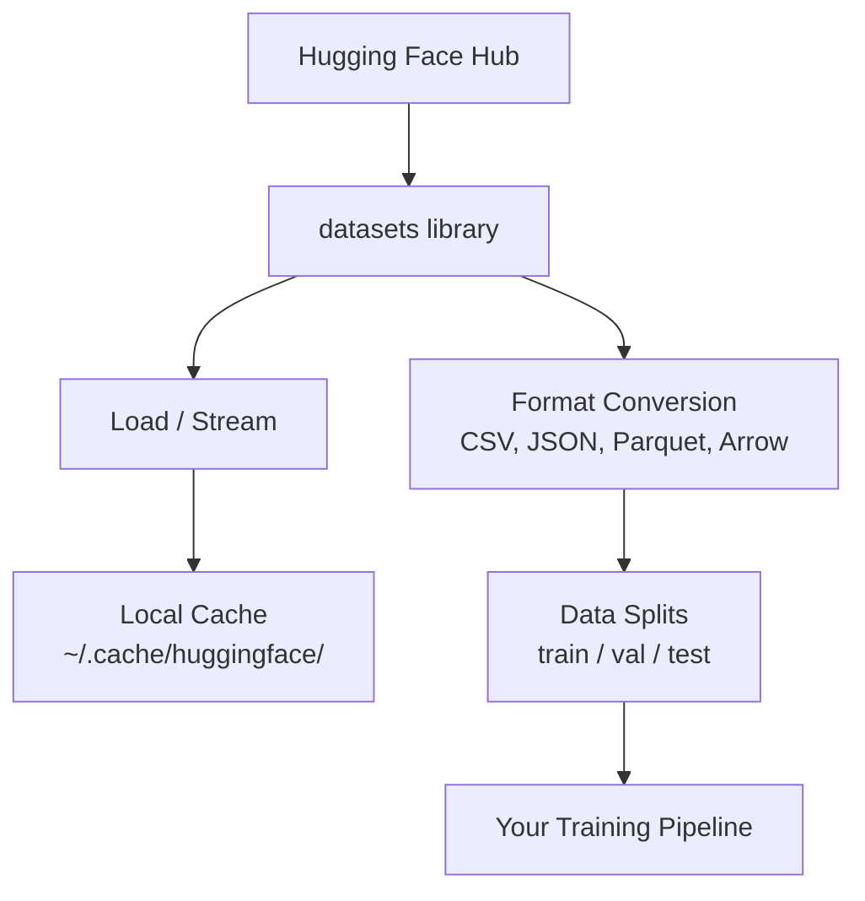

# 数据管理

> 数据是燃料。如何管理数据，决定了你能走多快。

**Type:** Build
**Language:** Python
**Prerequisites:** 第 0 阶段，第 01 课
**Time:** ~45 分钟

## 学习目标

- 使用 Hugging Face 的 `datasets` 库加载、流式读取（streaming）和缓存（cache）数据集（dataset）
- 在 CSV、JSON、Parquet 和 Arrow 格式之间转换，并解释它们各自的取舍
- 使用固定的随机种子（seed），创建可复现的训练集/验证集/测试集划分
- 使用 `.gitignore`、Git LFS（Git 大文件存储扩展）或 DVC（数据版本控制）管理大型模型文件和数据集文件

## 要解决的问题

每个人工智能（AI）项目都从数据开始。你需要寻找和下载数据集，在不同格式之间转换，为训练和评估划分数据集，并对数据集进行版本管理，以确保实验可复现。每次都手动完成这些工作，既慢又容易出错。你需要一套可重复执行的工作流程。

## 核心概念



Hugging Face 的 `datasets` 库是 AI 工作中加载数据的标准工具。它开箱即用，能够处理下载、缓存、格式转换和流式读取。

```figure
s0-data-pipeline
```

## 动手实现

### 步骤 1：安装 datasets 库

```bash
pip install datasets huggingface_hub
```

### 步骤 2：加载数据集

```python
from datasets import load_dataset

dataset = load_dataset("stanfordnlp/imdb")
print(dataset)
print(dataset["train"][0])
```

这会下载 IMDB 影评数据集。首次下载后，就会从 `~/.cache/huggingface/datasets/` 中的缓存加载。

### 步骤 3：流式读取大型数据集

有些数据集太大，磁盘放不下。流式读取会逐行加载数据，无须下载完整的数据集。

```python
dataset = load_dataset("wikimedia/wikipedia", "20231101.en", split="train", streaming=True)

for i, example in enumerate(dataset):
    print(example["title"])
    if i >= 4:
        break
```

流式读取会返回一个 `IterableDataset`（可迭代数据集）。数据逐行到达，你也逐行处理。无论数据集有多大，内存占用都保持恒定。

### 步骤 4：数据集格式

`datasets` 库的底层使用 Apache Arrow。你可以根据数据处理流水线的需要，将数据转换为其他格式。

```python
dataset = load_dataset("stanfordnlp/imdb", split="train")

dataset.to_csv("imdb_train.csv")
dataset.to_json("imdb_train.json")
dataset.to_parquet("imdb_train.parquet")
```

格式对比：

| 格式 | 体积 | 读取速度 | 最适合的场景 |
|--------|------|-----------|----------|
| CSV | 大 | 慢 | 便于人工阅读、电子表格 |
| JSON | 大 | 慢 | API（应用程序编程接口）、嵌套数据 |
| Parquet | 小 | 快 | 数据分析、列式（columnar）查询 |
| Arrow | 小 | 最快 | 内存中处理（`datasets` 内部采用的方式） |

对于 AI 工作，Parquet 是最佳存储格式。内存中处理数据时使用的是 Arrow。CSV 和 JSON 则用于数据交换。

### 步骤 5：数据集划分

每个机器学习（ML）项目都需要将数据集划分为三个子集：

- **训练集（Train）**：模型从中学习（通常占 80%）
- **验证集（Validation）**：用于在训练期间检查进展（通常占 10%）
- **测试集（Test）**：用于训练完成后的最终评估（通常占 10%）

有些数据集已经划分好了。如果没有，就自己划分：

```python
dataset = load_dataset("stanfordnlp/imdb", split="train")

split = dataset.train_test_split(test_size=0.2, seed=42)
train_val = split["train"].train_test_split(test_size=0.125, seed=42)

train_ds = train_val["train"]
val_ds = train_val["test"]
test_ds = split["test"]

print(f"Train: {len(train_ds)}, Val: {len(val_ds)}, Test: {len(test_ds)}")
```

始终设置随机种子，以保证可复现性。同一个种子每次都会得到相同的划分。

### 步骤 6：下载和缓存模型

模型文件很大。`huggingface_hub` 库负责处理下载和缓存。

```python
from huggingface_hub import hf_hub_download, snapshot_download

model_path = hf_hub_download(
    repo_id="sentence-transformers/all-MiniLM-L6-v2",
    filename="config.json"
)
print(f"Cached at: {model_path}")

model_dir = snapshot_download("sentence-transformers/all-MiniLM-L6-v2")
print(f"Full model at: {model_dir}")
```

模型会缓存到 `~/.cache/huggingface/hub/`。一旦下载完成，后续运行时就能立即加载。

### 步骤 7：处理大文件

模型权重和大型数据集不应直接放进 git。你有三种选择：

**方案 A：.gitignore（最简单）**

```text
*.bin
*.safetensors
*.pt
*.onnx
data/*.parquet
data/*.csv
models/
```

**方案 B：Git LFS（在 git 中跟踪大文件）**

```bash
git lfs install
git lfs track "*.bin"
git lfs track "*.safetensors"
git add .gitattributes
```

Git LFS 在仓库中存储指针，将实际文件存放在单独的服务器上。GitHub 提供 1 GB 的免费额度。

**方案 C：DVC（数据版本控制）**

```bash
pip install dvc
dvc init
dvc add data/training_set.parquet
git add data/training_set.parquet.dvc data/.gitignore
git commit -m "Track training data with DVC"
```

DVC 会创建小型 `.dvc` 文件，用来指向你的数据。数据本身存放在 S3、GCS 或其他远程存储后端。

| 方案 | 复杂度 | 最适合的场景 |
|----------|-----------|----------|
| .gitignore | 低 | 个人项目、可重新获取的已下载数据 |
| Git LFS | 中 | 通过 git 共享模型权重的团队 |
| DVC | 高 | 可复现实验、大型数据集、团队协作 |

本课程使用 `.gitignore` 就够了。当你需要在不同机器上精确复现实验时，再使用 DVC。

### 步骤 8：存储方式

**本地存储**适用于小于 ~10 GB 的数据集。Hugging Face（HF）的缓存机制会自动处理这些数据。

**云存储**适用于更大的数据，或需要跨机器共享的数据：

```python
import os

local_path = os.path.expanduser("~/.cache/huggingface/datasets/")

# s3_path = "s3://my-bucket/datasets/"
# gcs_path = "gs://my-bucket/datasets/"
```

DVC 可以直接与 S3 和 GCS 集成：

```bash
dvc remote add -d myremote s3://my-bucket/dvc-store
dvc push
```

对本课程而言，本地存储已足够。当你在远程 GPU（图形处理器）实例上进行微调（fine-tuning）时，云存储就派上用场了。

## 本课程使用的数据集

| 数据集 | 课程主题 | 大小 | 教学内容 |
|---------|---------|------|----------------|
| IMDB | 分词、分类 | 84 MB | 文本分类基础 |
| WikiText | 语言建模 | 181 MB | 下一个 token（词元）的预测 |
| SQuAD | 问答（QA）系统 | 35 MB | 问答、文本片段 |
| Common Crawl（子集） | 嵌入（embedding） | 不固定 | 大规模文本处理 |
| MNIST | 视觉基础 | 21 MB | 图像分类基础 |
| COCO（子集） | 多模态 | 不固定 | 图文对 |

你现在不需要下载所有这些数据集。每一课都会说明需要用到哪些数据集。

## 实际使用

运行工具脚本，确认一切正常：

```bash
python code/data_utils.py
```

它会下载一个小型数据集，进行格式转换和划分，并打印摘要。

## 交付成果

本课会产出：
- `code/data_utils.py` - 可复用的数据加载和缓存工具
- `outputs/prompt-data-helper.md` - 用于寻找适合特定任务的数据集的提示词（prompt）

## 练习

1. 使用 `mrpc` 配置加载 `glue` 数据集，并查看前 5 个样本
2. 流式读取 `c4` 数据集，统计你能在 10 seconds（秒）内处理多少个样本
3. 将一个数据集转换为 Parquet，并将文件大小与 CSV 格式的文件进行比较
4. 使用固定的种子，将数据集按 70/15/15 的比例划分为训练集/验证集/测试集，并核对各子集的大小

## 关键术语

| 术语 | 常见说法 | 实际含义 |
|------|----------------|----------------------|
| 数据集划分（Dataset split） | “训练数据” | 在机器学习生命周期的不同阶段使用的具名子集（train/val/test） |
| 流式读取（Streaming） | “按需加载” | 逐行处理来自远程数据源的数据，无须下载完整的数据集 |
| Parquet | “压缩版 CSV” | 一种列式文件格式，针对分析查询和存储效率进行优化 |
| Arrow | “快速数据框（dataframe）” | 一种内存列式格式，datasets 库内部使用它来实现零拷贝（zero-copy）读取 |
| Git LFS | “用于大文件的 Git” | 一种扩展，将大文件存储在 git 仓库外，同时在版本控制中保留指向它们的指针 |
| DVC | “用于数据的 Git” | 一种与云存储集成的数据集和模型版本控制系统 |
| 缓存（Cache） | “已经下载过了” | 先前获取的数据在本地的副本，默认存放在 ~/.cache/huggingface/ |
