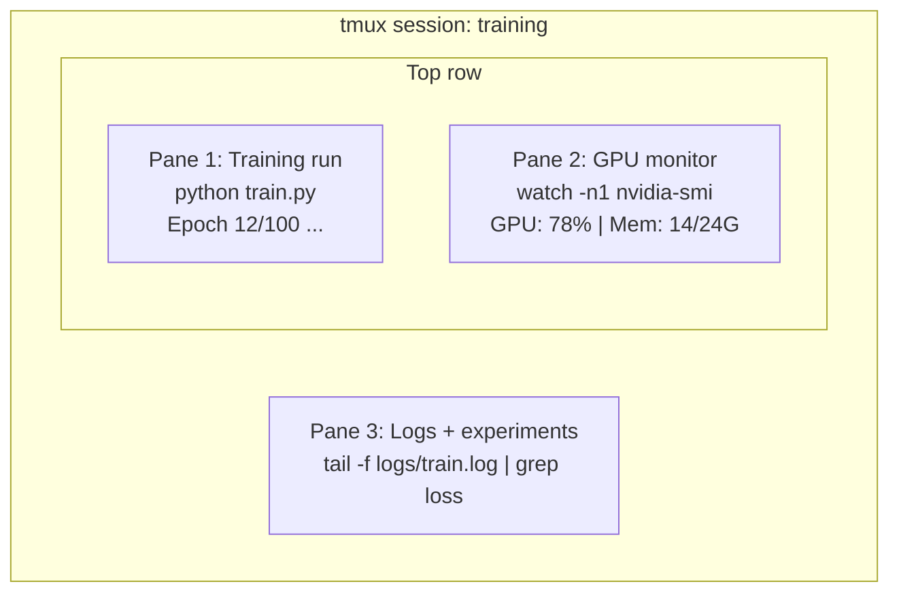

# 终端与 Shell

> 终端（terminal）是 AI 工程师的日常工作场所。先在这里练到得心应手。

**Type:** Learn
**Languages:** --
**Prerequisites:** 阶段 0，第 01 课
**Time:** ~35 分钟

## 学习目标

- 使用管道（pipe）、重定向和 `grep`，在命令行中过滤和处理训练日志
- 创建含有多个窗格（pane）、可持续运行的 tmux 会话，同时进行训练和 GPU 监控
- 使用 `htop`、`nvtop` 和 `nvidia-smi` 监控系统及 GPU 资源
- 使用 SSH（安全 Shell）、`scp` 和 `rsync` 在本地与远程机器之间传输文件

## 要解决的问题

你花在终端里的时间，会比花在任何编辑器里的时间都多：运行训练、监控 GPU、跟踪日志末尾的更新、建立远程 SSH 会话、管理环境。每一种 AI 工作流都会用到 Shell（命令解释器）。在这里操作慢，处处都会慢。

本课介绍 AI 工作中真正用得上的终端技能。不讲 Unix 历史，也不深入讲解 Bash 脚本编写，只讲你需要的内容。

## 核心概念



一个终端，同时运行三项任务。你可以分离会话，回家后通过 SSH 重新连入，再重新连接会话。训练会一直运行。

```figure
s0-shell-pipeline
```

## 动手实现

### 步骤 1：了解你使用的 Shell

检查你正在运行哪一种 Shell：

```bash
echo $SHELL
```

大多数系统使用 `bash` 或 `zsh`。两者都很好用。本课程中的命令在这两种 Shell 中都能运行。

需要掌握的基本操作：

```bash
# Move around
cd ~/projects/ai-engineering-from-scratch
pwd
ls -la

# History search (most useful shortcut you'll learn)
# Ctrl+R then type part of a previous command
# Press Ctrl+R again to cycle through matches

# Clear terminal
clear   # or Ctrl+L

# Cancel a running command
# Ctrl+C

# Suspend a running command (resume with fg)
# Ctrl+Z
```

### 步骤 2：管道与重定向

管道把多个命令连接起来。你可以借此处理日志、过滤输出、串联工具。这些操作会经常用到。

```bash
# Count how many times "loss" appears in a log
cat train.log | grep "loss" | wc -l

# Extract just the loss values from training output
grep "loss:" train.log | awk '{print $NF}' > losses.txt

# Watch a log file update in real time, filtering for errors
tail -f train.log | grep --line-buffered "ERROR"

# Sort experiments by final accuracy
grep "final_accuracy" results/*.log | sort -t= -k2 -n -r

# Redirect stdout and stderr to separate files
python train.py > output.log 2> errors.log

# Redirect both to the same file
python train.py > train_full.log 2>&1
```

你需要掌握的三种重定向：

| 符号 | 作用 |
|--------|-------------|
| `>` | 将标准输出（stdout）写入文件（覆盖原内容） |
| `>>` | 将标准输出追加到文件末尾 |
| `2>` | 将标准错误（stderr）写入文件 |
| `2>&1` | 将标准错误发送到与标准输出相同的目的地 |
| `\|` | 将一个命令的标准输出作为下一个命令的标准输入（stdin） |

### 步骤 3：后台进程

训练往往要运行数小时。你不会想在这段时间里一直开着终端。

```bash
# Run in background (output still goes to terminal)
python train.py &

# Run in background, immune to hangup (closing terminal won't kill it)
nohup python train.py > train.log 2>&1 &

# Check what's running in background
jobs
ps aux | grep train.py

# Bring a background job to foreground
fg %1

# Kill a background process
kill %1
# or find its PID and kill that
kill $(pgrep -f "train.py")
```

`&`、`nohup` 与 `screen`/`tmux` 的区别：

| 方法 | 关闭终端后仍能运行？ | 可以重新连接？ |
|--------|-------------------------|---------------|
| `command &` | 否 | 否 |
| `nohup command &` | 是 | 否（查看日志文件） |
| `screen` / `tmux` | 是 | 是 |

只要任务需要运行几分钟以上，就使用 tmux。

### 步骤 4：tmux

tmux 让你能够创建含有多个窗格、可持续运行的终端会话。在管理训练任务时，它是最有用的工具。

```bash
# Install
# macOS
brew install tmux
# Ubuntu
sudo apt install tmux

# Start a named session
tmux new -s training

# Split horizontally
# Ctrl+B then "

# Split vertically
# Ctrl+B then %

# Navigate between panes
# Ctrl+B then arrow keys

# Detach (session keeps running)
# Ctrl+B then d

# Reattach
tmux attach -t training

# List sessions
tmux ls

# Kill a session
tmux kill-session -t training
```

一个典型的 AI 工作流会话：

```bash
tmux new -s train

# Pane 1: start training
python train.py --epochs 100 --lr 1e-4

# Ctrl+B, " to split, then run GPU monitor
watch -n1 nvidia-smi

# Ctrl+B, % to split vertically, tail the logs
tail -f logs/experiment.log

# Now detach with Ctrl+B, d
# SSH out, go get coffee, come back
# tmux attach -t train
```

### 步骤 5：使用 htop 和 nvtop 进行监控

```bash
# System processes (better than top)
htop

# GPU processes (if you have NVIDIA GPU)
# Install: sudo apt install nvtop (Ubuntu) or brew install nvtop (macOS)
nvtop

# Quick GPU check without nvtop
nvidia-smi

# Watch GPU usage update every second
watch -n1 nvidia-smi

# See which processes are using the GPU
nvidia-smi --query-compute-apps=pid,name,used_memory --format=csv
```

你会用到的 `htop` 快捷键：
- `F6` 或 `>`：按列排序（按内存排序可查找内存泄漏）
- `F5`：切换树状视图（查看子进程）
- `F9`：终止进程
- `/`：搜索进程名

### 步骤 6：通过 SSH 连接远程 GPU 机器

租用云端 GPU（Lambda、RunPod、Vast.ai）时，你会通过 SSH 连接。

```bash
# Basic connection
ssh user@gpu-box-ip

# With a specific key
ssh -i ~/.ssh/my_gpu_key user@gpu-box-ip

# Copy files to remote
scp model.pt user@gpu-box-ip:~/models/

# Copy files from remote
scp user@gpu-box-ip:~/results/metrics.json ./

# Sync a whole directory (faster for many files)
rsync -avz ./data/ user@gpu-box-ip:~/data/

# Port forward (access remote Jupyter/TensorBoard locally)
ssh -L 8888:localhost:8888 user@gpu-box-ip
# Now open localhost:8888 in your browser

# SSH config for convenience
# Add to ~/.ssh/config:
# Host gpu
#     HostName 192.168.1.100
#     User ubuntu
#     IdentityFile ~/.ssh/gpu_key
#
# Then just:
# ssh gpu
```

### 步骤 7：AI 工作中实用的别名

将以下内容添加到你的 `~/.bashrc` 或 `~/.zshrc` 中：

```bash
source phases/00-setup-and-tooling/10-terminal-and-shell/code/shell_aliases.sh
```

也可以只复制你需要的别名（alias）。主要别名如下：

```bash
# GPU status at a glance
alias gpu='nvidia-smi --query-gpu=index,name,utilization.gpu,memory.used,memory.total,temperature.gpu --format=csv,noheader'

# Kill all Python training processes
alias killtraining='pkill -f "python.*train"'

# Quick virtual environment activate
alias ae='source .venv/bin/activate'

# Watch training loss
alias watchloss='tail -f logs/*.log | grep --line-buffered "loss"'
```

完整的别名集合见 `code/shell_aliases.sh`。

### 步骤 8：AI 工作中常见的终端用法

以下用法在实践中会反复出现：

```bash
# Run training, log everything, notify when done
python train.py 2>&1 | tee train.log; echo "DONE" | mail -s "Training complete" you@email.com

# Compare two experiment logs side by side
diff <(grep "accuracy" exp1.log) <(grep "accuracy" exp2.log)

# Find the largest model files (clean up disk space)
find . -name "*.pt" -o -name "*.safetensors" | xargs du -h | sort -rh | head -20

# Download a model from Hugging Face
wget https://huggingface.co/model/resolve/main/model.safetensors

# Untar a dataset
tar xzf dataset.tar.gz -C ./data/

# Count lines in all Python files (see how big your project is)
find . -name "*.py" | xargs wc -l | tail -1

# Check disk space (training data fills disks fast)
df -h
du -sh ./data/*

# Environment variable check before training
env | grep -i cuda
env | grep -i torch
```

## 实际使用

本课程中，各工具的使用场景如下：

| 工具 | 使用场景 |
|------|----------------|
| tmux | 每次训练运行（阶段 3+） |
| `tail -f` + `grep` | 监控训练日志 |
| `nohup` / `&` | 快速执行后台任务 |
| `htop` / `nvtop` | 排查训练缓慢和 OOM（内存不足）错误 |
| SSH + `rsync` | 使用云端 GPU 开展工作 |
| 管道 + 重定向 | 处理实验结果 |
| 别名 | 为重复执行的命令节省时间 |

## 练习

1. 安装 tmux，创建一个含有三个窗格的会话，在其中一个窗格运行 `htop`，另一个运行 `watch -n1 date`，第三个运行 Python 脚本。分离会话，再重新连接。
2. 将 `code/shell_aliases.sh` 中的别名添加到你的 Shell 配置中，并使用 `source ~/.zshrc`（或 `~/.bashrc`）重新加载。
3. 使用 `for i in $(seq 1 100); do echo "epoch $i loss: $(echo "scale=4; 1/$i" | bc)"; sleep 0.1; done > fake_train.log` 生成一份模拟训练日志，再用 `grep`、`tail` 和 `awk` 仅提取损失值。
4. 为你有权访问的服务器设置一条 SSH 配置（也可以使用 `localhost` 练习语法）。

## 关键术语

| 术语 | 常见说法 | 实际含义 |
|------|----------------|----------------------|
| Shell | “终端” | 解释你所输入命令的程序（bash、zsh、fish） |
| tmux | “终端复用器” | 让你在一个窗口中运行多个终端会话，并可分离或重新连接会话的程序 |
| 管道 | “那根竖线” | 将一个命令的输出作为另一个命令输入的 `\|` 运算符 |
| PID | “进程 ID” | 分配给每个运行中进程的唯一编号，用于监控或终止该进程 |
| nohup | “不挂断” | 让命令不受挂断信号影响地运行，因此关闭终端不会终止它 |
| SSH | “连接服务器” | Secure Shell，一种用于在远程机器上运行命令的加密协议 |
