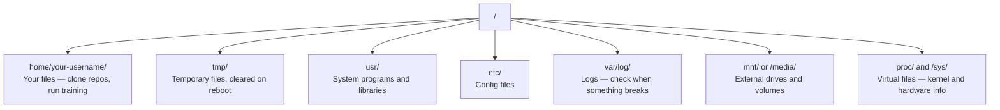

# AI 工作中的 Linux

> 大多数 AI 任务都在 Linux 上运行。你需要掌握足够的知识，才不会卡住。

**Type:** Learn
**Languages:** --
**Prerequisites:** 第 0 阶段，第 01 课
**Time:** ~30 分钟

## 学习目标

- 通过命令行浏览 Linux 文件系统，并执行基本的文件操作
- 使用 `chmod` 和 `chown` 管理文件权限（permission），解决 "Permission denied" 错误
- 使用 `apt` 安装系统软件包，为一台全新的 GPU 机器配置 AI 工作环境
- 识别 macOS 与 Linux 之间的差异，避免在远程机器上开发时被常见问题绊住

## 要解决的问题

你在 macOS 或 Windows 上开发。但只要通过 SSH 登录云端 GPU 机器、租用 Lambda 实例，或者启动 EC2 机器，面对的就是 Ubuntu。终端（terminal）是你唯一的操作界面。这里没有 Finder，没有 Explorer，也没有图形用户界面（GUI）。如果你不会通过命令行浏览文件系统、安装软件包、管理进程（process），就只能一边为闲置的 GPU 时长付费，一边搜索“如何在 Linux 中解压文件”。

这是一份生存指南。它只涵盖在远程 Linux 机器上开展 AI 工作所需的操作知识，不多讲其他内容。

## 文件系统布局

Linux 将所有内容组织在同一个根目录 `/` 下，没有 `C:\` 或 `/Volumes`。你实际会用到的目录如下：



你的主目录（home directory）是 `~` 或 `/home/your-username`。几乎所有操作都会在这里进行。

## 必备命令

下面这 15 个命令涵盖了你在远程 GPU 机器上 95% 的操作。

### 切换和查看目录

```bash
pwd                         # Where am I?
ls                          # What's here?
ls -la                      # What's here, including hidden files with details?
cd /path/to/dir             # Go there
cd ~                        # Go home
cd ..                       # Go up one level
```

### 文件与目录

```bash
mkdir my-project            # Create a directory
mkdir -p a/b/c              # Create nested directories in one shot

cp file.txt backup.txt      # Copy a file
cp -r src/ src-backup/      # Copy a directory (recursive)

mv old.txt new.txt          # Rename a file
mv file.txt /tmp/           # Move a file

rm file.txt                 # Delete a file (no trash, it's gone)
rm -rf my-dir/              # Delete a directory and everything inside
```

`rm -rf` 的删除操作是永久性的，无法撤销。按下回车前，务必再次检查路径。

### 读取文件

```bash
cat file.txt                # Print entire file
head -20 file.txt           # First 20 lines
tail -20 file.txt           # Last 20 lines
tail -f log.txt             # Follow a log file in real time (Ctrl+C to stop)
less file.txt               # Scroll through a file (q to quit)
```

### 搜索

```bash
grep "error" training.log           # Find lines containing "error"
grep -r "learning_rate" .           # Search all files in current directory
grep -i "cuda" config.yaml          # Case-insensitive search

find . -name "*.py"                 # Find all Python files under current dir
find . -name "*.ckpt" -size +1G     # Find checkpoint files larger than 1GB
```

## 权限

Linux 中的每个文件都有所有者（owner）和权限位。脚本无法执行，或者无法向某个目录写入内容时，你就会碰到权限问题。

```bash
ls -l train.py
# -rwxr-xr-- 1 user group 2048 Mar 19 10:00 train.py
#  ^^^             owner permissions: read, write, execute
#     ^^^          group permissions: read, execute
#        ^^        everyone else: read only
```

常见的解决方法：

```bash
chmod +x train.sh           # Make a script executable
chmod 755 deploy.sh         # Owner: full, others: read+execute
chmod 644 config.yaml       # Owner: read+write, others: read only

chown user:group file.txt   # Change who owns a file (needs sudo)
```

出现 "Permission denied" 提示时，几乎总是权限问题。`chmod +x` 或 `sudo` 能解决大多数情况。

## 软件包管理（apt）

Ubuntu 使用 `apt`。你可以用它安装系统级软件。

```bash
sudo apt update             # Refresh the package list (always do this first)
sudo apt install -y htop    # Install a package (-y skips confirmation)
sudo apt install -y build-essential  # C compiler, make, etc. Needed by many Python packages
sudo apt install -y tmux    # Terminal multiplexer (keep sessions alive after disconnect)

apt list --installed        # What's installed?
sudo apt remove htop        # Uninstall
```

配置一台全新的 GPU 机器时，常用的软件包包括：

```bash
sudo apt update && sudo apt install -y \
    build-essential \
    git \
    curl \
    wget \
    tmux \
    htop \
    unzip \
    python3-venv
```

## 用户与 sudo

你通常以普通用户身份登录。有些操作需要 root（管理员）权限。

```bash
whoami                      # What user am I?
sudo command                # Run a single command as root
sudo su                     # Become root (exit to go back, use sparingly)
```

在云端 GPU 实例上，你通常是唯一的用户，并且已经拥有 sudo 权限。不要以 root 身份运行所有命令，只在必要时使用 sudo。

## 进程与 systemd

训练卡住，或者你想检查当前运行了哪些程序时，可以使用以下命令：

```bash
htop                        # Interactive process viewer (q to quit)
ps aux | grep python        # Find running Python processes
kill 12345                  # Gracefully stop process with PID 12345
kill -9 12345               # Force kill (use when graceful doesn't work)
nvidia-smi                  # GPU processes and memory usage
```

systemd 管理服务，也就是在后台运行的守护进程（daemon）。运行推理服务器时，你会用到它：

```bash
sudo systemctl start nginx          # Start a service
sudo systemctl stop nginx           # Stop it
sudo systemctl restart nginx        # Restart it
sudo systemctl status nginx         # Check if it's running
sudo systemctl enable nginx         # Start automatically on boot
```

## 磁盘空间

GPU 机器的磁盘空间通常有限，模型和数据集很快就会把它占满。

```bash
df -h                       # Disk usage for all mounted drives
df -h /home                 # Disk usage for /home specifically

du -sh *                    # Size of each item in current directory
du -sh ~/.cache             # Size of your cache (pip, huggingface models land here)
du -sh /data/checkpoints/   # Check how big your checkpoints are

# Find the biggest space hogs
du -h --max-depth=1 / 2>/dev/null | sort -hr | head -20
```

常用的空间清理方法：

```bash
# Clear pip cache
pip cache purge

# Clear apt cache
sudo apt clean

# Remove old checkpoints you don't need
rm -rf checkpoints/epoch_01/ checkpoints/epoch_02/
```

## 网络操作

你会通过命令行下载模型、传输文件，以及调用 API（应用程序编程接口）。

```bash
# Download files
wget https://example.com/model.bin                   # Download a file
curl -O https://example.com/data.tar.gz              # Same thing with curl
curl -s https://api.example.com/health | python3 -m json.tool  # Hit an API, pretty-print JSON

# Transfer files between machines
scp model.bin user@remote:/data/                     # Copy file to remote machine
scp user@remote:/data/results.csv .                  # Copy file from remote to local
scp -r user@remote:/data/checkpoints/ ./local-dir/   # Copy directory

# Sync directories (faster than scp for large transfers, resumes on failure)
rsync -avz --progress ./data/ user@remote:/data/
rsync -avz --progress user@remote:/results/ ./results/
```

传输大文件或大量数据时，优先使用 `rsync`，而不是 `scp`。它只传输发生变化的字节，并且能够处理连接中断的情况。

## tmux：保持会话运行

通过 SSH 登录远程机器后，合上笔记本电脑会终止正在运行的训练。tmux 可以避免这种情况。

```bash
tmux new -s train           # Start a new session named "train"
# ... start your training, then:
# Ctrl+B, then D            # Detach (training keeps running)

tmux ls                     # List sessions
tmux attach -t train        # Reattach to session

# Inside tmux:
# Ctrl+B, then %            # Split pane vertically
# Ctrl+B, then "            # Split pane horizontally
# Ctrl+B, then arrow keys   # Switch between panes
```

耗时较长的训练作业一定要在 tmux 中运行。务必如此。

## Windows 用户的 WSL2

如果你使用 Windows，WSL2 能提供真正的 Linux 环境，无需安装双系统。

```bash
# In PowerShell (admin)
wsl --install -d Ubuntu-24.04

# After restart, open Ubuntu from Start menu
sudo apt update && sudo apt upgrade -y
```

WSL2 运行的是真正的 Linux 操作系统内核（kernel）。本课的所有操作都能在其中完成。在 WSL 内部，可以通过 `/mnt/c/Users/YourName/` 访问你的 Windows 文件。

在 Windows 端安装 NVIDIA 驱动后，就能使用 GPU 直通（GPU passthrough）。安装 Windows 版 NVIDIA 驱动（不是 Linux 版），就能在 WSL2 中使用 CUDA。

## 常见陷阱：从 macOS 转向 Linux

如果你之前使用 macOS，以下差异很容易让你踩坑：

| macOS | Linux | 说明 |
|-------|-------|-------|
| `brew install` | `sudo apt install` | 软件包名称有时不同。`brew install htop` 与 `sudo apt install htop` 的效果相同，但 `brew install readline` 与 `sudo apt install libreadline-dev` 并不相同。 |
| `open file.txt` | `xdg-open file.txt` | 不过，远程机器上没有图形用户界面。请使用 `cat` 或 `less`。 |
| `pbcopy` / `pbpaste` | 不可用 | 通过 SSH 无法使用管道（pipe）向剪贴板写入内容或从中读取内容。 |
| `~/.zshrc` | `~/.bashrc` | macOS 默认使用 zsh。大多数 Linux 服务器使用 bash。 |
| `/opt/homebrew/` | `/usr/bin/`, `/usr/local/bin/` | 二进制可执行文件存放的位置不同。 |
| `sed -i '' 's/a/b/' file` | `sed -i 's/a/b/' file` | macOS 的 sed 要求在 `-i` 后加一个空字符串。Linux 不需要。 |
| 不区分大小写的文件系统 | 区分大小写的文件系统 | 在 Linux 上，`Model.py` 和 `model.py` 是两个不同的文件。 |
| 换行符 `\n` | 换行符 `\n` | 两者相同。但 Windows 使用 `\r\n`，这会导致 bash 脚本出错。运行 `dos2unix` 即可修复。 |

## 速查表

```text
Navigation:     pwd, ls, cd, find
Files:          cp, mv, rm, mkdir, cat, head, tail, less
Search:         grep, find
Permissions:    chmod, chown, sudo
Packages:       apt update, apt install
Processes:      htop, ps, kill, nvidia-smi
Services:       systemctl start/stop/restart/status
Disk:           df -h, du -sh
Network:        curl, wget, scp, rsync
Sessions:       tmux new/attach/detach
```

```figure
s0-process-fork
```

## 练习

1. 通过 SSH 登录任意一台 Linux 机器（或打开 WSL2），进入你的主目录。创建一个项目文件夹，用 `touch` 在其中创建三个空文件，然后用 `ls -la` 列出它们。
2. 使用 apt 安装 `htop`，运行它，找出占用内存最多的进程。
3. 启动一个 tmux 会话，在其中运行 `sleep 300`，分离会话，列出会话，再重新连接。
4. 使用 `df -h` 检查可用磁盘空间，再用 `du -sh ~/.cache/*` 找出缓存中占用空间的内容。
5. 使用 `scp` 将一个文件从本地机器传输到远程机器，再用 `rsync` 传输同一个文件，比较两者的使用体验。
