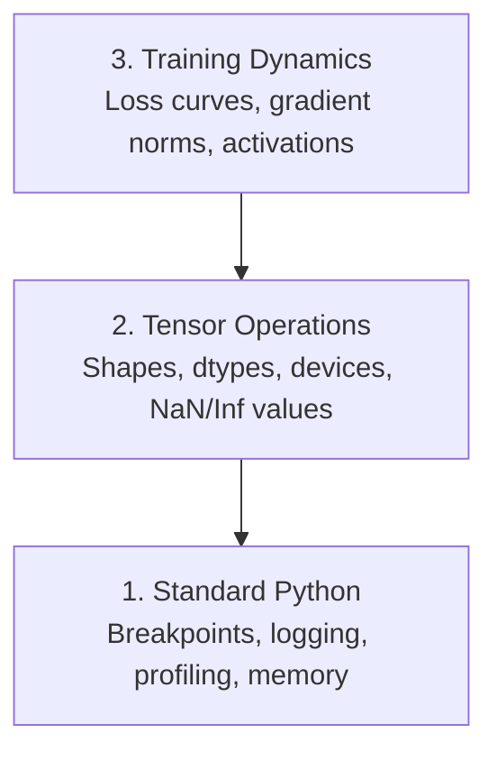

# 调试与性能剖析

> 最糟糕的 AI 缺陷不会让程序崩溃。模型会悄无声息地在垃圾数据上训练，还给出一条漂亮的损失曲线。

**Type:** Build
**Language:** Python
**Prerequisites:** 第 1 课（开发环境），具备 PyTorch 基础知识
**Time:** ~60 分钟

## 学习目标

- 使用带条件的 `breakpoint()` 和 `debug_print`，在训练过程中检查张量（tensor）的形状（shape）、数据类型（dtype）和 NaN（非数）值
- 使用 `cProfile`、`line_profiler` 和 `tracemalloc` 对训练循环进行性能剖析（profiling），找出瓶颈
- 检测常见的 AI 缺陷：形状不匹配、NaN 损失、数据泄漏，以及位于错误设备上的张量
- 配置 TensorBoard，将损失曲线、权重直方图和梯度分布可视化

## 要解决的问题

AI 代码的出错方式与普通代码不同。Web 应用崩溃时会给出调用栈信息（stack trace）。配置错误的训练循环却会运行 8 小时，花掉价值 $200 的 GPU 时间，最后得到一个对每个输入都只预测均值的模型。代码始终没有报错。缺陷的原因是张量放在了错误的设备（device）上、忘记调用 `.detach()`，或者标签泄漏到了特征中。

你需要调试工具，在这些静默故障浪费你的时间和算力之前就把它们找出来。

## 核心概念

AI 调试分为三个层次：



大多数人直接跳到第 3 层（盯着 TensorBoard 看）。但 80% 的 AI 缺陷位于第 1 层和第 2 层。

```figure
s0-flame-hot
```

## 动手实现

### 第 1 部分：打印调试（没错，它确实管用）

打印调试常被轻视，但它不该受到这样的待遇。对于张量代码，一条有针对性的打印语句比在调试器中单步执行更有效，因为你需要同时看到形状、数据类型和值的范围。

```python
def debug_print(name, tensor):
    print(f"{name}: shape={tensor.shape}, dtype={tensor.dtype}, "
          f"device={tensor.device}, "
          f"min={tensor.min().item():.4f}, max={tensor.max().item():.4f}, "
          f"mean={tensor.mean().item():.4f}, "
          f"has_nan={tensor.isnan().any().item()}")
```

在每个可疑操作之后调用这个函数。找到缺陷后，删除这些打印语句。就这么简单。

### 第 2 部分：Python 调试器（pdb 和 breakpoint）

在 AI 开发中，内置调试器的价值被低估了。在训练循环中插入 `breakpoint()`，就能交互式地检查张量。

```python
def training_step(model, batch, criterion, optimizer):
    inputs, labels = batch
    outputs = model(inputs)
    loss = criterion(outputs, labels)

    if loss.item() > 100 or torch.isnan(loss):
        breakpoint()

    loss.backward()
    optimizer.step()
```

进入调试器后，以下命令很有用：

- 用 `p outputs.shape` 检查形状
- 用 `p loss.item()` 查看损失值
- 用 `p torch.isnan(outputs).sum()` 统计 NaN 的数量
- 用 `p model.fc1.weight.grad` 检查梯度
- 用 `c` 继续执行，用 `q` 退出

这就是条件调试。只有看起来不对劲时才暂停。对于一次有 10,000 步的训练运行，这一点很重要。

### 第 3 部分：Python 日志记录

当调试不再只是快速检查一下时，用日志记录替代打印语句。

```python
import logging

logging.basicConfig(
    level=logging.INFO,
    format="%(asctime)s [%(levelname)s] %(message)s",
    handlers=[
        logging.FileHandler("training.log"),
        logging.StreamHandler()
    ]
)
logger = logging.getLogger(__name__)

logger.info("Starting training: lr=%.4f, batch_size=%d", lr, batch_size)
logger.warning("Loss spike detected: %.4f at step %d", loss.item(), step)
logger.error("NaN loss at step %d, stopping", step)
```

日志记录提供时间戳、严重级别和文件输出。训练在凌晨 3 点出错时，你需要的是日志文件，而不是早已滚出屏幕的终端输出。

### 第 4 部分：为代码段计时

知道时间花在哪里，是优化的第一步。

```python
import time

class Timer:
    def __init__(self, name=""):
        self.name = name

    def __enter__(self):
        self.start = time.perf_counter()
        return self

    def __exit__(self, *args):
        elapsed = time.perf_counter() - self.start
        print(f"[{self.name}] {elapsed:.4f}s")

with Timer("data loading"):
    batch = next(dataloader_iter)

with Timer("forward pass"):
    outputs = model(batch)

with Timer("backward pass"):
    loss.backward()
```

常见的发现是：数据加载占用了 60% 的训练时间。解决办法是在 DataLoader（数据加载器）中设置 `num_workers > 0`，而不是换一块更快的 GPU。

### 第 5 部分：cProfile 和 line_profiler

当手动计时已经不够用时：

```bash
python -m cProfile -s cumtime train.py
```

这会显示每次函数调用，并按累计耗时排序。要进行逐行性能剖析：

```bash
pip install line_profiler
```

```python
@profile
def train_step(model, data, target):
    output = model(data)
    loss = F.cross_entropy(output, target)
    loss.backward()
    return loss

# Run with: kernprof -l -v train.py
```

### 第 6 部分：内存剖析

#### 使用 tracemalloc 检查 CPU 内存

```python
import tracemalloc

tracemalloc.start()

# your code here
model = build_model()
data = load_dataset()

snapshot = tracemalloc.take_snapshot()
top_stats = snapshot.statistics("lineno")
for stat in top_stats[:10]:
    print(stat)
```

#### 使用 memory_profiler 检查 CPU 内存

```bash
pip install memory_profiler
```

```python
from memory_profiler import profile

@profile
def load_data():
    raw = read_csv("data.csv")       # watch memory jump here
    processed = preprocess(raw)       # and here
    return processed
```

运行 `python -m memory_profiler your_script.py`，查看每一行的内存使用情况。

#### 使用 PyTorch 检查 GPU 显存

```python
import torch

if torch.cuda.is_available():
    print(torch.cuda.memory_summary())

    print(f"Allocated: {torch.cuda.memory_allocated() / 1e9:.2f} GB")
    print(f"Cached: {torch.cuda.memory_reserved() / 1e9:.2f} GB")
```

遇到 OOM（Out of Memory，内存不足）时：

1. 减小批量大小（始终先尝试这一项）
2. 使用 `torch.cuda.empty_cache()` 释放缓存内存
3. 对于较大的中间张量，先使用 `del tensor`，再调用 `torch.cuda.empty_cache()`
4. 使用混合精度（`torch.cuda.amp`），将内存用量减半
5. 对于非常深的模型，使用梯度检查点（gradient checkpointing）

### 第 7 部分：常见的 AI 缺陷及其检测方法

#### 形状不匹配

这是最常见的缺陷。张量的形状是 `[batch, features]`，而模型预期的是 `[batch, channels, height, width]`。

```python
def check_shapes(model, sample_input):
    print(f"Input: {sample_input.shape}")
    hooks = []

    def make_hook(name):
        def hook(module, inp, out):
            in_shape = inp[0].shape if isinstance(inp, tuple) else inp.shape
            out_shape = out.shape if hasattr(out, "shape") else type(out)
            print(f"  {name}: {in_shape} -> {out_shape}")
        return hook

    for name, module in model.named_modules():
        hooks.append(module.register_forward_hook(make_hook(name)))

    with torch.no_grad():
        model(sample_input)

    for h in hooks:
        h.remove()
```

用一个样本批次运行一次这个函数。它会列出模型中的每一次形状变换。

#### NaN 损失

出现 NaN 损失，说明某处发生了数值爆炸。常见原因包括：

- 学习率过高
- 自定义损失中出现除以零的运算
- 对零或负数取对数
- RNN（循环神经网络）中发生梯度爆炸

```python
def detect_nan(model, loss, step):
    if torch.isnan(loss):
        print(f"NaN loss at step {step}")
        for name, param in model.named_parameters():
            if param.grad is not None:
                if torch.isnan(param.grad).any():
                    print(f"  NaN gradient in {name}")
                if torch.isinf(param.grad).any():
                    print(f"  Inf gradient in {name}")
        return True
    return False
```

#### 数据泄漏

你的模型在测试集上达到了 99% 的准确率。听起来很棒，但这是一个缺陷。

```python
def check_data_leakage(train_set, test_set, id_column="id"):
    train_ids = set(train_set[id_column].tolist())
    test_ids = set(test_set[id_column].tolist())
    overlap = train_ids & test_ids
    if overlap:
        print(f"DATA LEAKAGE: {len(overlap)} samples in both train and test")
        return True
    return False
```

还要检查时间泄漏（temporal leakage）：用未来的数据预测过去。划分数据之前，先按时间戳排序。

#### 设备错误

位于不同设备（CPU 和 GPU）上的张量会引发运行时错误。但有时，一个张量会悄无声息地留在 CPU 上，其他所有内容都在 GPU 上，结果只是训练运行得很慢。

```python
def check_devices(model, *tensors):
    model_device = next(model.parameters()).device
    print(f"Model device: {model_device}")
    for i, t in enumerate(tensors):
        if t.device != model_device:
            print(f"  WARNING: tensor {i} on {t.device}, model on {model_device}")
```

### 第 8 部分：TensorBoard 基础

TensorBoard 能让你看到训练过程中内部情况随时间的变化。

```bash
pip install tensorboard
```

```python
from torch.utils.tensorboard import SummaryWriter

writer = SummaryWriter("runs/experiment_1")

for step in range(num_steps):
    loss = train_step(model, batch)

    writer.add_scalar("loss/train", loss.item(), step)
    writer.add_scalar("lr", optimizer.param_groups[0]["lr"], step)

    if step % 100 == 0:
        for name, param in model.named_parameters():
            writer.add_histogram(f"weights/{name}", param, step)
            if param.grad is not None:
                writer.add_histogram(f"grads/{name}", param.grad, step)

writer.close()
```

启动它：

```bash
tensorboard --logdir=runs
```

需要关注的现象：

- **损失没有下降**：学习率过低，或模型架构有问题
- **损失剧烈振荡**：学习率过高
- **损失变成 NaN**：数值不稳定（见上面的 NaN 一节）
- **训练损失下降，验证损失上升**：过拟合
- **权重直方图收缩到零**：梯度消失
- **梯度直方图中的数值急剧增大**：需要梯度裁剪

### 第 9 部分：VS Code 调试器

要进行交互式调试，请通过 `launch.json` 配置 VS Code：

```json
{
    "version": "0.2.0",
    "configurations": [
        {
            "name": "Debug Training",
            "type": "debugpy",
            "request": "launch",
            "program": "${file}",
            "console": "integratedTerminal",
            "justMyCode": false
        }
    ]
}
```

点击行号旁的区域来设置断点。使用 Variables 窗格检查张量属性。Debug Console（调试控制台）可让你在程序执行过程中运行任意 Python 表达式。

如果你想查看数据预处理管线中的每一次变换，单步执行会很有帮助。

## 实际使用

以下调试工作流能发现大多数 AI 缺陷：

1. **训练之前**：用一个样本批次运行 `check_shapes`。确认输入和输出的维度符合预期。
2. **前 10 步**：对损失、输出和梯度使用 `debug_print`。确认没有 NaN，且数值处于合理范围内。
3. **训练过程中**：记录损失、学习率和梯度范数。使用 TensorBoard 进行可视化。
4. **出错时**：在出错位置插入 `breakpoint()`。交互式地检查张量。
5. **检查性能时**：分别测量数据加载、前向传播和反向传播的耗时。接近 OOM 时，对内存进行剖析。

## 交付成果

运行调试工具包脚本：

```bash
python phases/00-setup-and-tooling/12-debugging-and-profiling/code/debug_tools.py
```

参见 `outputs/prompt-debug-ai-code.md`，其中的提示词（prompt）可以帮助诊断 AI 特有的缺陷。

## 练习

1. 运行 `debug_tools.py`，通读每个部分的输出。修改示例模型以引入 NaN（提示：在前向传播中除以零），观察检测器如何发现它。
2. 使用 `cProfile` 对训练循环进行性能剖析，找出最慢的函数。
3. 使用 `tracemalloc`，找出数据加载管线中分配内存最多的那一行。
4. 为一次简单的训练运行配置 TensorBoard，并判断模型是否过拟合。
5. 在训练循环中使用 `breakpoint()`。练习在调试器提示符下检查张量形状、设备和梯度值。
