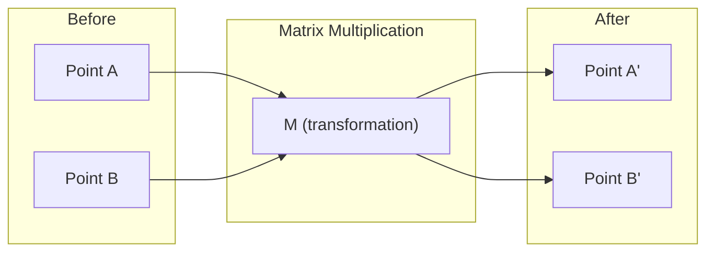
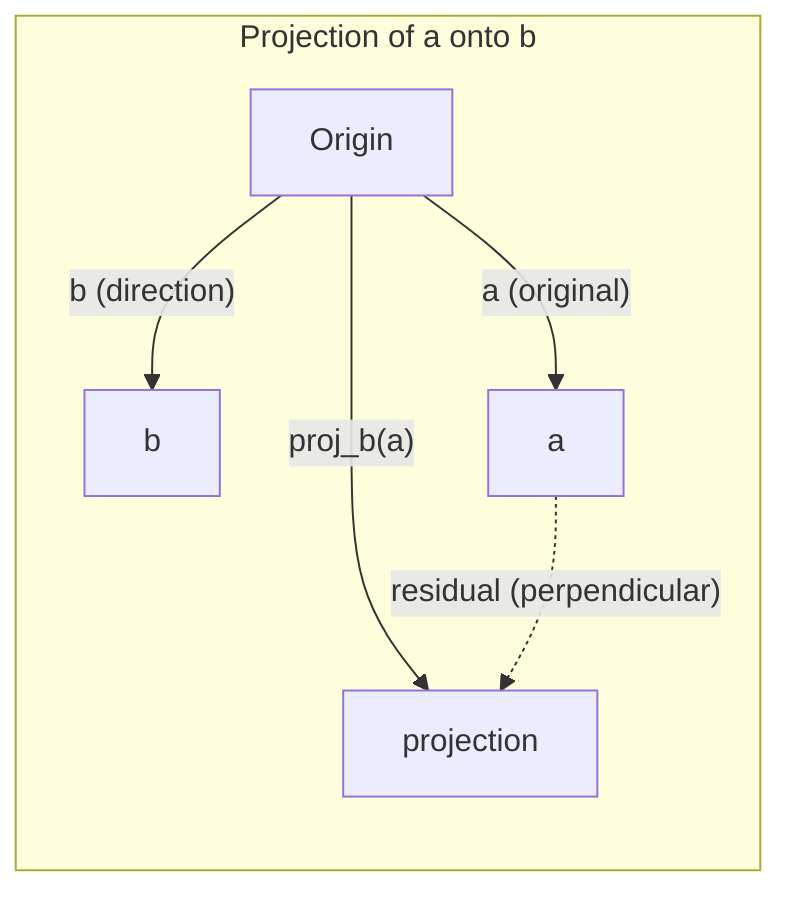

# 线性代数直觉

> 每个 AI 模型，说到底都是披着华丽外衣的矩阵运算。

**Type:** Learn
**Languages:** Python, Julia
**Prerequisites:** 第 0 阶段
**Time:** ~60 分钟

## 学习目标

- 用 Python 从零实现向量（vector）和矩阵（matrix）运算，包括加法、点积（dot product）和矩阵乘法（matrix multiplication）
- 从几何角度解释点积、投影（projection）和 Gram-Schmidt 正交化过程的作用
- 通过行化简（row reduction）判断一组向量的线性无关性（linear independence），确定其秩（rank）和基（basis）
- 将线性代数概念与其在 AI 中的应用联系起来：嵌入（embedding）、注意力（attention）分数和 LoRA（低秩适配）

## 要解决的问题

随便打开一篇机器学习（ML）论文，第一页就会出现向量、矩阵、点积和变换。没有线性代数直觉，这些只是符号；有了这种直觉，你就能看见神经网络究竟在做什么：在空间中移动点。

你不需要成为数学家。你需要看懂这些运算的几何意义，再亲手用代码实现它们。

## 核心概念

### 向量是点，也是方向

向量就是一个数值列表，但这些数有具体含义：它们是空间中的坐标。

**2D 向量 [3, 2]：**

| x | y | 点 |
|---|---|-------|
| 3 | 2 | 该向量从原点 (0,0) 指向平面上的 (3, 2) |

这个向量的模（magnitude）为 sqrt(3^2 + 2^2) = sqrt(13)，方向指向右上方。

在 AI 中，各种事物都可以用向量表示：
- 一个词 → 由 768 个数组成的向量，表示它在嵌入空间中的“含义”
- 一张图像 → 由 millions（百万量级）个像素值组成的向量
- 一位用户 → 表示其偏好的向量

### 矩阵是变换

矩阵把一个向量变换成另一个向量。它可以进行旋转、缩放、拉伸或投影。



在 AI 中，矩阵就是模型本身：
- 神经网络权重 → 将输入变换为输出的矩阵
- 注意力分数 → 决定关注哪些内容的矩阵
- 嵌入 → 将词映射为向量的矩阵

### 点积衡量相似程度

两个向量的点积告诉你它们有多相似。

```text
a · b = a₁×b₁ + a₂×b₂ + ... + aₙ×bₙ

Same direction:      a · b > 0  (similar)
Perpendicular:       a · b = 0  (unrelated)
Opposite direction:  a · b < 0  (dissimilar)
```

搜索引擎、推荐系统和 RAG（检索增强生成）的工作方式正是如此：找出点积较大的向量。

### 线性无关性

如果一组向量中的任何一个都不能表示为其余向量的线性组合，这组向量就线性无关。如果 v1, v2, v3 线性无关，它们就张成一个 3D 空间。如果其中一个是其余向量的线性组合，它们就只能张成一个平面。

这对 AI 为什么重要？特征矩阵的各列应当线性无关。如果两个特征完全相关，也就是线性相关，模型就无法区分它们各自的影响。这会导致回归中的多重共线性（multicollinearity）：权重矩阵变得不稳定，输入稍有变化，输出就会剧烈波动。

**具体例子：**

```text
v1 = [1, 0, 0]
v2 = [0, 1, 0]
v3 = [2, 1, 0]   # v3 = 2*v1 + v2
```

v1 和 v2 线性无关：其中任意一个都不是另一个的标量（scalar）倍数或线性组合。但 v3 = 2*v1 + v2，因此 {v1, v2, v3} 是一个线性相关的向量组。这三个向量都位于 xy 平面内，无论怎样组合，都无法到达 [0, 0, 1]。虽然有三个向量，但只有两个自由度。

放到数据集中来看：如果 feature_3 = 2*feature_1 + feature_2，那么加入 feature_3 不会给模型带来任何新信息。更糟的是，它会使正规方程（normal equations）变得奇异，权重不再有唯一解。

### 基与秩

基是能够张成整个空间的最小线性无关向量组。基向量的个数就是空间的维数。

3D 空间的标准基是 {[1,0,0], [0,1,0], [0,0,1]}。不过，3D 空间中任意三个线性无关的向量都可以构成一组基。选择基，就是选择坐标系。

矩阵的秩 = 线性无关列的数量 = 线性无关行的数量。如果 rank < min(rows, cols)，这个矩阵就是秩亏的（rank-deficient）。这意味着：
- 方程组有无穷多个解，或者无解
- 变换过程中会丢失信息
- 矩阵不可逆

| 情形 | 秩 | 对 ML 的意义 |
|-----------|------|---------------------|
| 满秩（rank = min(m, n)） | 达到可能的最大值 | 存在唯一的最小二乘解。模型是良态的。 |
| 秩亏（rank < min(m, n)） | 低于最大值 | 特征存在冗余。权重有无穷多个解。需要正则化。 |
| 秩为 1 | 1 | 每一列都是同一个向量缩放后的结果。所有数据都落在一条直线上。 |
| 接近秩亏（存在很小的奇异值） | 数值意义上的秩较低 | 矩阵是病态的。输入中的微小噪声会引起输出的大幅变化。可使用奇异值分解（SVD）截断或岭回归。 |

### 投影

将向量 **a** 投影到向量 **b** 上，得到的就是 **a** 在 **b** 方向上的分量：

```text
proj_b(a) = (a dot b / b dot b) * b
```

残差（residual）(a - proj_b(a)) 与 b 垂直。这种正交分解是最小二乘拟合的基础。

投影在 ML 中随处可见：
- 线性回归最小化观测值到列空间的距离，解本身就是一个投影
- PCA（主成分分析）将数据投影到方差最大的方向上
- Transformer 中的注意力机制计算查询在键上的投影



**例子：** a = [3, 4], b = [1, 0]

proj_b(a) = (3\*1 + 4\*0) / (1\*1 + 0\*0) \* [1, 0] = 3 \* [1, 0] = [3, 0]

这个投影去掉了 y 分量。这就是最简单的降维：舍去你不关心的方向。

### Gram-Schmidt 正交化过程

这一过程将任意一组线性无关向量转化为标准正交基（orthonormal basis）。标准正交意味着每个向量的长度都为 1，而且任意两个向量都相互垂直。

算法如下：
1. 取第一个向量，将其归一化
2. 取第二个向量，减去它在第一个向量上的投影，再归一化
3. 取第三个向量，减去它在前面所有向量上的投影，再归一化
4. 对其余向量重复这个过程

```text
Input:  v1, v2, v3, ... (linearly independent)

u1 = v1 / |v1|

w2 = v2 - (v2 dot u1) * u1
u2 = w2 / |w2|

w3 = v3 - (v3 dot u1) * u1 - (v3 dot u2) * u2
u3 = w3 / |w3|

Output: u1, u2, u3, ... (orthonormal basis)
```

这就是 QR 分解（QR decomposition）的内部原理。Q 给出标准正交基，R 记录投影系数。QR 分解可用于：
- 求解线性方程组，比高斯消元更稳定
- 计算特征值，即 QR 算法
- 最小二乘回归，这是求解此类问题的标准数值方法

```figure
eigen-directions
```

## 动手实现

### 第 1 步：从零实现向量（Python）

```python
class Vector:
    def __init__(self, components):
        self.components = list(components)
        self.dim = len(self.components)

    def __add__(self, other):
        return Vector([a + b for a, b in zip(self.components, other.components)])

    def __sub__(self, other):
        return Vector([a - b for a, b in zip(self.components, other.components)])

    def dot(self, other):
        return sum(a * b for a, b in zip(self.components, other.components))

    def magnitude(self):
        return sum(x**2 for x in self.components) ** 0.5

    def normalize(self):
        mag = self.magnitude()
        return Vector([x / mag for x in self.components])

    def cosine_similarity(self, other):
        return self.dot(other) / (self.magnitude() * other.magnitude())

    def __repr__(self):
        return f"Vector({self.components})"


a = Vector([1, 2, 3])
b = Vector([4, 5, 6])

print(f"a + b = {a + b}")
print(f"a · b = {a.dot(b)}")
print(f"|a| = {a.magnitude():.4f}")
print(f"cosine similarity = {a.cosine_similarity(b):.4f}")
```

### 第 2 步：从零实现矩阵（Python）

```python
class Matrix:
    def __init__(self, rows):
        self.rows = [list(row) for row in rows]
        self.shape = (len(self.rows), len(self.rows[0]))

    def __matmul__(self, other):
        if isinstance(other, Vector):
            return Vector([
                sum(self.rows[i][j] * other.components[j] for j in range(self.shape[1]))
                for i in range(self.shape[0])
            ])
        rows = []
        for i in range(self.shape[0]):
            row = []
            for j in range(other.shape[1]):
                row.append(sum(
                    self.rows[i][k] * other.rows[k][j]
                    for k in range(self.shape[1])
                ))
            rows.append(row)
        return Matrix(rows)

    def transpose(self):
        return Matrix([
            [self.rows[j][i] for j in range(self.shape[0])]
            for i in range(self.shape[1])
        ])

    def __repr__(self):
        return f"Matrix({self.rows})"


rotation_90 = Matrix([[0, -1], [1, 0]])
point = Vector([3, 1])

rotated = rotation_90 @ point
print(f"Original: {point}")
print(f"Rotated 90°: {rotated}")
```

### 第 3 步：这对 AI 为什么重要

```python
import random

random.seed(42)
weights = Matrix([[random.gauss(0, 0.1) for _ in range(3)] for _ in range(2)])
input_vector = Vector([1.0, 0.5, -0.3])

output = weights @ input_vector
print(f"Input (3D): {input_vector}")
print(f"Output (2D): {output}")
print("This is what a neural network layer does -- matrix multiplication.")
```

### 第 4 步：Julia 版本

```julia
a = [1.0, 2.0, 3.0]
b = [4.0, 5.0, 6.0]

println("a + b = ", a + b)
println("a · b = ", a ⋅ b)       # Julia supports unicode operators
println("|a| = ", √(a ⋅ a))
println("cosine = ", (a ⋅ b) / (√(a ⋅ a) * √(b ⋅ b)))

# Matrix-vector multiplication
W = [0.1 -0.2 0.3; 0.4 0.5 -0.1]
x = [1.0, 0.5, -0.3]
println("Wx = ", W * x)
println("This is a neural network layer.")
```

### 第 5 步：从零实现线性无关性判断和投影（Python）

```python
def is_linearly_independent(vectors):
    n = len(vectors)
    dim = len(vectors[0].components)
    mat = Matrix([v.components[:] for v in vectors])
    rows = [row[:] for row in mat.rows]
    rank = 0
    for col in range(dim):
        pivot = None
        for row in range(rank, len(rows)):
            if abs(rows[row][col]) > 1e-10:
                pivot = row
                break
        if pivot is None:
            continue
        rows[rank], rows[pivot] = rows[pivot], rows[rank]
        scale = rows[rank][col]
        rows[rank] = [x / scale for x in rows[rank]]
        for row in range(len(rows)):
            if row != rank and abs(rows[row][col]) > 1e-10:
                factor = rows[row][col]
                rows[row] = [rows[row][j] - factor * rows[rank][j] for j in range(dim)]
        rank += 1
    return rank == n


def project(a, b):
    scalar = a.dot(b) / b.dot(b)
    return Vector([scalar * x for x in b.components])


def gram_schmidt(vectors):
    orthonormal = []
    for v in vectors:
        w = v
        for u in orthonormal:
            proj = project(w, u)
            w = w - proj
        if w.magnitude() < 1e-10:
            continue
        orthonormal.append(w.normalize())
    return orthonormal


v1 = Vector([1, 0, 0])
v2 = Vector([1, 1, 0])
v3 = Vector([1, 1, 1])
basis = gram_schmidt([v1, v2, v3])
for i, u in enumerate(basis):
    print(f"u{i+1} = {u}")
    print(f"  |u{i+1}| = {u.magnitude():.6f}")

print(f"u1 · u2 = {basis[0].dot(basis[1]):.6f}")
print(f"u1 · u3 = {basis[0].dot(basis[2]):.6f}")
print(f"u2 · u3 = {basis[1].dot(basis[2]):.6f}")
```

## 实际使用

现在用 NumPy 完成同样的操作，这也是你在实际工作中会采用的方式：

```python
import numpy as np

a = np.array([1, 2, 3], dtype=float)
b = np.array([4, 5, 6], dtype=float)

print(f"a + b = {a + b}")
print(f"a · b = {np.dot(a, b)}")
print(f"|a| = {np.linalg.norm(a):.4f}")
print(f"cosine = {np.dot(a, b) / (np.linalg.norm(a) * np.linalg.norm(b)):.4f}")

W = np.random.randn(2, 3) * 0.1
x = np.array([1.0, 0.5, -0.3])
print(f"Wx = {W @ x}")
```

### 用 NumPy 计算秩、投影和 QR 分解

```python
import numpy as np

A = np.array([[1, 2], [2, 4]])
print(f"Rank: {np.linalg.matrix_rank(A)}")

a = np.array([3, 4])
b = np.array([1, 0])
proj = (np.dot(a, b) / np.dot(b, b)) * b
print(f"Projection of {a} onto {b}: {proj}")

Q, R = np.linalg.qr(np.random.randn(3, 3))
print(f"Q is orthogonal: {np.allclose(Q @ Q.T, np.eye(3))}")
print(f"R is upper triangular: {np.allclose(R, np.triu(R))}")
```

### PyTorch：张量（tensor）是带自动微分的向量

```python
import torch

x = torch.randn(3, requires_grad=True)
y = torch.tensor([1.0, 0.0, 0.0])

similarity = torch.dot(x, y)
similarity.backward()

print(f"x = {x.data}")
print(f"y = {y.data}")
print(f"dot product = {similarity.item():.4f}")
print(f"d(dot)/dx = {x.grad}")
```

点积对 x 的梯度就是 y，PyTorch 自动完成了这项计算。神经网络中的每一种运算，都是由矩阵乘法、点积、投影等这类运算构成的，而自动微分（autodiff）会跟踪梯度在所有这些运算中的传递。

你刚刚从零实现了 NumPy 用一行代码就能完成的功能。现在你知道它背后是如何工作的了。

## 交付成果

本课产出：
- `outputs/prompt-linear-algebra-tutor.md`：一份提示词（prompt），供 AI 助手通过几何直觉教授线性代数

## 与其他知识的联系

本课的每个概念都与现代 AI 的具体应用相连：

| 概念 | 应用场景 |
|---------|------------------|
| 点积 | Transformer 中的注意力分数、RAG 中的余弦相似度 |
| 矩阵乘法 | 每一个神经网络层、每一种线性变换 |
| 线性无关性 | 特征选择（feature selection）、避免多重共线性 |
| 秩 | 判断方程组是否可解、LoRA（低秩适配） |
| 投影 | 线性回归（投影到列空间）、PCA |
| Gram-Schmidt / QR | 数值求解器、特征值计算 |
| 标准正交基 | 稳定的数值计算、白化变换 |

LoRA 值得单独一提。它把权重更新分解为低秩矩阵，从而微调（fine-tuning）大语言模型（LLM）。LoRA 不去更新一个 4096x4096 的权重矩阵（16M 个参数），而是更新两个大小分别为 4096x16 和 16x4096 的矩阵（131K 个参数）。秩为 16 的约束意味着，LoRA 假设权重更新位于完整的 4096 维空间中的一个 16 维子空间里。这就是线性代数在实际问题中发挥作用的例子。

## 练习

1. 实现 `Vector.angle_between(other)`，返回两个向量之间的夹角，单位为 degrees（度）
2. 创建一个 2D 缩放矩阵，将 x 坐标变为原来的两倍、y 坐标变为原来的三倍，然后将它作用于向量 [1, 1]
3. 给定 5 个类似词向量的随机向量（维数为 50），用余弦相似度找出最相似的两个
4. 验证 Gram-Schmidt 的输出确实标准正交：检查任意两个不同向量的点积是否为 0，以及每个向量的模是否为 1
5. 创建一个秩为 2 的 3x3 矩阵。用 `rank()` 方法验证，然后解释它的各列张成了什么几何对象。
6. 将向量 [1, 2, 3] 投影到 [1, 1, 1] 上。结果在几何上代表什么？

## 关键术语

| 术语 | 常见说法 | 实际含义 |
|------|----------------|----------------------|
| 向量 | “一个箭头” | 用来表示 n 维空间中的点或方向的数值列表 |
| 矩阵 | “一张数字表格” | 将向量从一个空间映射到另一个空间的变换 |
| 点积 | “相乘再求和” | 衡量两个向量方向的一致程度，是相似度搜索的核心 |
| 嵌入 | “某种 AI 魔法” | 表示某个事物（词、图像、用户）含义的向量 |
| 线性无关性 | “它们不重叠” | 向量组中的任何一个向量都不能表示为其余向量的线性组合 |
| 秩 | “有多少个维度” | 矩阵中线性无关列（或行）的数量 |
| 投影 | “影子” | 一个向量在另一个向量方向上的分量 |
| 基 | “坐标轴” | 能够张成空间的最小线性无关向量组 |
| 标准正交 | “相互垂直的单位向量” | 各向量两两垂直，且每个向量的长度都为 1 |
