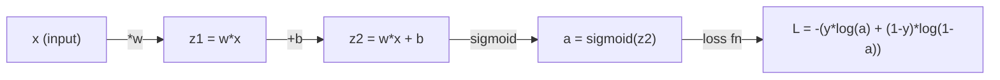
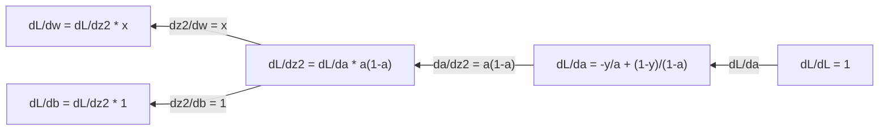
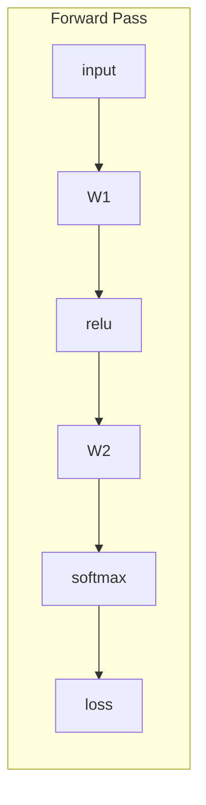
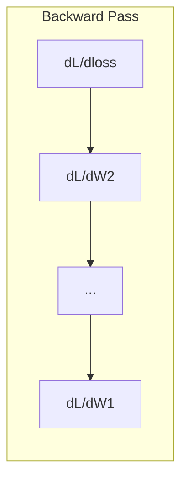

# 机器学习微积分

> 导数（derivative）告诉你哪个方向是下坡。神经网络只需知道这一点就能学习。

**Type:** Learn
**Language:** Python
**Prerequisites:** 第 1 阶段，第 01-03 课
**Time:** ~60 分钟

## 学习目标

- 计算机器学习中常见函数（x^2、sigmoid、交叉熵）的数值导数和解析导数
- 从零实现梯度下降，在 1D 和 2D 中最小化损失函数
- 推导线性回归模型的梯度（gradient），并通过手动更新权重来训练模型
- 解释 Hessian矩阵（海森矩阵）、Taylor级数（泰勒级数）近似，以及它们与优化方法的联系

## 要解决的问题

假设你有一个包含 millions（数百万）个权重的神经网络。每个权重都像一个旋钮。你需要弄清楚每个旋钮该往哪个方向转，才能让模型的误差小一点。微积分会告诉你这个方向。

没有微积分，训练神经网络就意味着随机尝试各种调整，寄希望于好运。有了导数，你就能准确知道每个权重如何影响误差。每一次，你都能把每个旋钮转向正确的方向。

## 核心概念

### 什么是导数？

导数衡量变化率。对于函数 y = f(x)，导数 f'(x) 告诉你：如果让 x 发生一点微小变化，y 会变化多少？

从几何上看，导数就是曲线在某一点处的切线斜率。

**f(x) = x^2:**

| x | f(x) | f'(x)（斜率） |
|---|------|---------------|
| 0 | 0    | 0（平坦，位于底部） |
| 1 | 1    | 2 |
| 2 | 4    | 4（该点处的切线斜率） |
| 3 | 9    | 6 |

在 x=2 处，斜率为 4。如果让 x 向右移动一小段距离，y 的增加量大约是这段距离的 4 倍。在 x=0 处，斜率为 0。此时你就在碗底。

形式化定义如下：

```text
f'(x) = lim   f(x + h) - f(x)
        h->0  -----------------
                     h
```

在代码中，可以跳过取极限，直接使用一个很小的 h。这就是数值导数。

### 偏导数：一次只改变一个变量

实际的函数往往有多个输入。神经网络的损失取决于 thousands（数千）个权重。求偏导数（partial derivative）时，除一个变量外，其余变量都保持不变，然后对这个变量求导。

```text
f(x, y) = x^2 + 3xy + y^2

df/dx = 2x + 3y     (treat y as a constant)
df/dy = 3x + 2y     (treat x as a constant)
```

每个偏导数都回答了这样一个问题：如果只微调这一个权重，损失会如何变化？

### 梯度：由所有偏导数组成的向量

梯度把所有偏导数汇集成一个向量。对于函数 f(x, y, z)，梯度为：

```text
grad f = [ df/dx, df/dy, df/dz ]
```

梯度指向最速上升方向。要最小化函数，就朝相反的方向走。

**f(x,y) = x^2 + y^2 的等高线图：**

这个函数呈碗状，其等高线是一组同心圆。极小值位于 (0, 0)。

| 点 | grad f | -grad f（下降方向） |
|-------|--------|----------------------------|
| (1, 1) | [2, 2]（指向上坡，远离极小值点） | [-2, -2]（指向下坡，朝向极小值点） |
| (0, 0) | [0, 0]（平坦，位于极小值点） | [0, 0] |

这就是梯度下降的直观图景：计算梯度，取反，再迈出一步。

### 与优化的联系

训练神经网络就是做优化。损失函数 L(w1, w2, ..., wn) 衡量模型的误差有多大。你的目标是最小化它。

```text
Gradient descent update rule:

  w_new = w_old - learning_rate * dL/dw

For every weight:
  1. Compute the partial derivative of loss with respect to that weight
  2. Subtract a small multiple of it from the weight
  3. Repeat
```

学习率控制步长。太大就会越过目标，太小则只能缓慢前进。

**损失曲面（1D 切片）：**

随着权重 w 变化，损失函数 L(w) 形成一条有峰有谷的曲线。

| 特征 | 说明 |
|---------|-------------|
| 全局极小值 | 整条曲线上的最低点，也就是最优解 |
| 局部极小值 | 低于邻近位置，但并非整体最低的谷底 |
| 斜率 | 梯度下降从任意起点沿着斜坡向下走 |

梯度下降沿着斜坡向下走。它可能困在局部极小值处，但在高维空间中（有 millions（数百万）个权重），这在实践中很少成为问题。

### 数值导数与解析导数

计算导数有两种方法。

解析求导：手动应用微积分法则。对于 f(x) = x^2，导数为 f'(x) = 2x。结果精确，计算速度快。

数值求导：利用定义来近似。取一个很小的 h，计算 f(x+h) 和 f(x-h)，再利用两者的差。

```text
Numerical (central difference):

f'(x) ~= f(x + h) - f(x - h)
          -----------------------
                  2h

h = 0.0001 works well in practice
```

数值导数的计算较慢，但适用于任何函数。解析导数的计算很快，但需要你推导公式。神经网络框架采用第三种方法：自动微分（automatic differentiation），它以机械化的方式计算精确导数。你将在第 3 阶段学到它。

### 手动求简单函数的导数

下面这些导数会在机器学习中反复出现。

```text
Function        Derivative       Used in
--------        ----------       -------
f(x) = x^2     f'(x) = 2x      Loss functions (MSE)
f(x) = wx + b  f'(w) = x        Linear layer (gradient w.r.t. weight)
                f'(b) = 1        Linear layer (gradient w.r.t. bias)
                f'(x) = w        Linear layer (gradient w.r.t. input)
f(x) = e^x     f'(x) = e^x     Softmax, attention
f(x) = ln(x)   f'(x) = 1/x     Cross-entropy loss
f(x) = 1/(1+e^-x)  f'(x) = f(x)(1-f(x))   Sigmoid activation
```

对于 f(x) = x^2：

```text
f(x) = x^2    f'(x) = 2x

  x    f(x)   f'(x)   meaning
  -2    4      -4      slope tilts left (decreasing)
  -1    1      -2      slope tilts left (decreasing)
   0    0       0      flat (minimum!)
   1    1       2      slope tilts right (increasing)
   2    4       4      slope tilts right (increasing)
```

对于 f(w) = wx + b，其中 x=3、b=1：

```text
f(w) = 3w + 1    f'(w) = 3

The derivative with respect to w is just x.
If x is big, a small change in w causes a big change in output.
```

### 链式法则

当函数复合在一起时，链式法则（chain rule）告诉你如何求导。

```text
If y = f(g(x)), then dy/dx = f'(g(x)) * g'(x)

Example: y = (3x + 1)^2
  outer: f(u) = u^2       f'(u) = 2u
  inner: g(x) = 3x + 1    g'(x) = 3
  dy/dx = 2(3x + 1) * 3 = 6(3x + 1)
```

神经网络是由函数串联而成的：输入 -> 线性变换 -> 激活 -> 线性变换 -> 激活 -> 损失。反向传播（backpropagation）就是从输出到输入反复应用链式法则。整个算法就是这样。

### Hessian矩阵

梯度告诉你斜率，Hessian矩阵告诉你曲率。

Hessian矩阵是由二阶偏导数组成的矩阵。对于函数 f(x1, x2, ..., xn)，Hessian矩阵的 (i, j) 元素为：

```text
H[i][j] = d^2f / (dx_i * dx_j)
```

对于有 2 个变量的函数 f(x, y)：

```text
H = | d^2f/dx^2    d^2f/dxdy |
    | d^2f/dydx    d^2f/dy^2 |
```

**在临界点（梯度 = 0 的位置），Hessian矩阵能告诉你什么：**

| Hessian矩阵的性质 | 含义 | 曲面示例 |
|-----------------|---------|-----------------|
| 正定（所有特征值 > 0） | 局部极小值 | 开口向上的碗 |
| 负定（所有特征值 < 0） | 局部极大值 | 开口向下的碗 |
| 不定（特征值有正有负） | 鞍点（saddle point） | 马鞍形 |

**示例：** f(x, y) = x^2 - y^2（一个鞍形函数）

```text
df/dx = 2x       df/dy = -2y
d^2f/dx^2 = 2    d^2f/dy^2 = -2    d^2f/dxdy = 0

H = | 2   0 |
    | 0  -2 |

Eigenvalues: 2 and -2 (one positive, one negative)
--> Saddle point at (0, 0)
```

与 f(x, y) = x^2 + y^2（碗状函数）比较：

```text
H = | 2  0 |
    | 0  2 |

Eigenvalues: 2 and 2 (both positive)
--> Local minimum at (0, 0)
```

**Hessian矩阵为什么对机器学习很重要：**

Newton法（牛顿法）利用 Hessian矩阵，采取比梯度下降更好的优化步。它不只是沿着斜坡走，还会考虑曲率：

```text
Newton's update:    w_new = w_old - H^(-1) * gradient
Gradient descent:   w_new = w_old - lr * gradient
```

Newton法收敛得更快，因为 Hessian矩阵会“重新缩放”梯度：陡峭方向上的步长更小，平坦方向上的步长更大。

问题在于：对于有 N 个参数的神经网络，Hessian矩阵的大小是 N x N。一个有 1 million（百万）个参数的模型，需要一个包含 1 trillion（万亿）个元素的矩阵。这就是我们使用近似的原因。

| 方法 | 使用的信息 | 计算成本 | 收敛速度 |
|--------|-------------|------|-------------|
| 梯度下降 | 仅一阶导数 | 每步 O(N) | 慢（线性收敛） |
| Newton法 | 完整 Hessian矩阵 | 每步 O(N^3) | 快（二次收敛） |
| L-BFGS | 根据历史梯度近似 Hessian矩阵 | 每步 O(N) | 中等（超线性收敛） |
| Adam | 每个参数自适应的学习率（对角 Hessian矩阵近似） | 每步 O(N) | 中等 |
| 自然梯度 | Fisher信息矩阵（统计意义上的 Hessian矩阵） | 每步 O(N^2) | 快 |

在实践中，Adam 是深度学习的默认优化器。它跟踪每个参数梯度的滑动均值和方差，以较低成本近似二阶信息。

### Taylor级数近似

任何光滑函数都可以在局部用多项式近似：

```text
f(x + h) = f(x) + f'(x)*h + (1/2)*f''(x)*h^2 + (1/6)*f'''(x)*h^3 + ...
```

包含的项越多，近似效果越好，但这只在点 x 附近成立。

**Taylor级数为什么对机器学习很重要：**

- **一阶 Taylor近似 = 梯度下降。** 使用 f(x + h) ~ f(x) + f'(x)*h 时，你是在做线性近似。梯度下降通过最小化这个线性模型，选择 h = -lr * f'(x)。

- **二阶 Taylor近似 = Newton法。** 使用 f(x + h) ~ f(x) + f'(x)*h + (1/2)*f''(x)*h^2 时，你得到的是一个二次模型。最小化它可得 h = -f'(x)/f''(x)，这就是 Newton法的更新步。

- **损失函数设计。** 均方误差（MSE）和交叉熵是光滑的，这意味着它们的 Taylor展开表现良好。这并非偶然：光滑的损失函数让优化过程变得可预测。

```text
Approximation order    What it captures    Optimization method
-------------------    -----------------   -------------------
0th order (constant)   Just the value      Random search
1st order (linear)     Slope               Gradient descent
2nd order (quadratic)  Curvature           Newton's method
Higher orders          Finer structure     Rarely used in ML
```

关键认识是：所有基于梯度的优化，本质上都是在局部近似损失函数，再走向这个近似模型的极小值点。

### 机器学习中的积分

导数告诉你变化率，积分计算累积量，也就是曲线下的面积。

在机器学习中，你很少手动计算积分，但这个概念无处不在：

**概率。** 对于概率密度为 p(x) 的连续随机变量：
```text
P(a < X < b) = integral from a to b of p(x) dx
```
概率密度曲线在 a 与 b 之间的曲线下面积，就是取值落在这个区间内的概率。

**期望。** 按概率加权的平均结果：
```text
E[f(X)] = integral of f(x) * p(x) dx
```
在一个数据分布上的期望损失是一个积分。训练最小化的是它的经验近似。

**KL散度。** 衡量两个分布之间的差异：
```text
KL(p || q) = integral of p(x) * log(p(x) / q(x)) dx
```
用于变分自编码器（VAEs）、知识蒸馏和贝叶斯推断。

**归一化常数。** 在贝叶斯推断中：
```text
p(w | data) = p(data | w) * p(w) / integral of p(data | w) * p(w) dw
```
分母是对所有可能的参数值求积分。它通常难以计算，这就是我们使用马尔可夫链蒙特卡洛（MCMC）、变分推断等近似方法的原因。

| 积分概念 | 在机器学习中的应用 |
|-----------------|----------------------|
| 曲线下面积 | 根据密度函数计算概率 |
| 期望 | 损失函数、风险最小化 |
| KL散度 | VAEs、策略优化、蒸馏 |
| 归一化 | 贝叶斯后验、softmax 的分母 |
| 边际似然 | 模型比较、证据下界（ELBO） |

### 计算图中的多变量链式法则

链式法则不只适用于串成一条线的标量函数。在神经网络中，变量会分支，也会汇合。下面展示了导数如何沿着一次简单的前向传播流动：



反向传播从右向左计算梯度：



每经过一个箭头，就乘以相应的局部导数。任意参数的梯度，都是从损失到该参数的路径上所有局部导数的乘积。当路径分支和汇合时，要把各条路径的贡献相加，这就是多变量链式法则。

反向传播就是这样：在计算图中，从输出到输入系统地应用链式法则。

### Jacobian矩阵

当函数把向量映射为向量时（例如神经网络层），它的导数就是一个矩阵。Jacobian矩阵（雅可比矩阵）包含每个输出对每个输入的全部偏导数。

对于 f: R^n -> R^m，Jacobian矩阵 J 是一个 m x n 矩阵：

| | x1 | x2 | ... | xn |
|---|---|---|---|---|
| f1 | df1/dx1 | df1/dx2 | ... | df1/dxn |
| f2 | df2/dx1 | df2/dx2 | ... | df2/dxn |
| ... | ... | ... | ... | ... |
| fm | dfm/dx1 | dfm/dx2 | ... | dfm/dxn |

你不需要手动计算神经网络的 Jacobian矩阵，PyTorch 会处理这些计算。但知道它的存在，有助于理解反向传播中的形状（shape）：如果某一层将 R^n 映射到 R^m，其 Jacobian矩阵的大小就是 m x n。梯度通过这个矩阵的转置反向流动。

### 这为什么对神经网络很重要

神经网络中的每个权重都会得到一个梯度。梯度告诉你如何调整这个权重来降低损失。





每个权重的更新如下：
- `W1 = W1 - lr * dL/dW1`
- `W2 = W2 - lr * dL/dW2`

前向传播计算预测值和损失，反向传播计算损失对每个权重的梯度。然后，每个权重都朝下坡方向迈出一小步。重复 millions（数百万）步。这就是深度学习。

```figure
derivative-tangent
```

## 动手实现

### 第 1 步：从零实现数值求导

```python
def numerical_derivative(f, x, h=1e-7):
    return (f(x + h) - f(x - h)) / (2 * h)

def f(x):
    return x ** 2

for x in [-2, -1, 0, 1, 2]:
    numerical = numerical_derivative(f, x)
    analytical = 2 * x
    print(f"x={x:2d}  f'(x) numerical={numerical:.6f}  analytical={analytical:.1f}")
```

数值导数与解析导数在小数点后多位上都一致。

### 第 2 步：偏导数和梯度

```python
def numerical_gradient(f, point, h=1e-7):
    gradient = []
    for i in range(len(point)):
        point_plus = list(point)
        point_minus = list(point)
        point_plus[i] += h
        point_minus[i] -= h
        partial = (f(point_plus) - f(point_minus)) / (2 * h)
        gradient.append(partial)
    return gradient

def f_multi(point):
    x, y = point
    return x**2 + 3*x*y + y**2

grad = numerical_gradient(f_multi, [1.0, 2.0])
print(f"Numerical gradient at (1,2): {[f'{g:.4f}' for g in grad]}")
print(f"Analytical gradient at (1,2): [2*1+3*2, 3*1+2*2] = [{2*1+3*2}, {3*1+2*2}]")
```

### 第 3 步：用梯度下降求 f(x) = x^2 的极小值

```python
x = 5.0
lr = 0.1
for step in range(20):
    grad = 2 * x
    x = x - lr * grad
    print(f"step {step:2d}  x={x:8.4f}  f(x)={x**2:10.6f}")
```

从 x=5 出发，每一步都会更接近 x=0（极小值点）。

### 第 4 步：对 2D 函数做梯度下降

```python
def f_2d(point):
    x, y = point
    return x**2 + y**2

point = [4.0, 3.0]
lr = 0.1
for step in range(30):
    grad = numerical_gradient(f_2d, point)
    point = [p - lr * g for p, g in zip(point, grad)]
    loss = f_2d(point)
    if step % 5 == 0 or step == 29:
        print(f"step {step:2d}  point=({point[0]:7.4f}, {point[1]:7.4f})  f={loss:.6f}")
```

### 第 5 步：比较数值导数和解析导数

```python
import math

test_functions = [
    ("x^2",      lambda x: x**2,          lambda x: 2*x),
    ("x^3",      lambda x: x**3,          lambda x: 3*x**2),
    ("sin(x)",   lambda x: math.sin(x),   lambda x: math.cos(x)),
    ("e^x",      lambda x: math.exp(x),   lambda x: math.exp(x)),
    ("1/x",      lambda x: 1/x,           lambda x: -1/x**2),
]

x = 2.0
print(f"{'Function':<12} {'Numerical':>12} {'Analytical':>12} {'Error':>12}")
print("-" * 50)
for name, f, df in test_functions:
    num = numerical_derivative(f, x)
    ana = df(x)
    err = abs(num - ana)
    print(f"{name:<12} {num:12.6f} {ana:12.6f} {err:12.2e}")
```

### 第 6 步：用数值方法计算 Hessian矩阵

```python
def hessian_2d(f, x, y, h=1e-5):
    fxx = (f(x + h, y) - 2 * f(x, y) + f(x - h, y)) / (h ** 2)
    fyy = (f(x, y + h) - 2 * f(x, y) + f(x, y - h)) / (h ** 2)
    fxy = (f(x + h, y + h) - f(x + h, y - h) - f(x - h, y + h) + f(x - h, y - h)) / (4 * h ** 2)
    return [[fxx, fxy], [fxy, fyy]]

def saddle(x, y):
    return x ** 2 - y ** 2

def bowl(x, y):
    return x ** 2 + y ** 2

H_saddle = hessian_2d(saddle, 0.0, 0.0)
H_bowl = hessian_2d(bowl, 0.0, 0.0)
print(f"Saddle Hessian: {H_saddle}")  # [[2, 0], [0, -2]] -- mixed signs
print(f"Bowl Hessian:   {H_bowl}")    # [[2, 0], [0, 2]]  -- both positive
```

鞍形函数的 Hessian矩阵具有特征值 2 和 -2（有正有负，确认该点是鞍点）。碗状函数的 Hessian矩阵具有特征值 2 和 2（均为正，确认该点是极小值点）。

### 第 7 步：实践 Taylor近似

```python
import math

def taylor_approx(f, f_prime, f_double_prime, x0, h, order=2):
    result = f(x0)
    if order >= 1:
        result += f_prime(x0) * h
    if order >= 2:
        result += 0.5 * f_double_prime(x0) * h ** 2
    return result

x0 = 0.0
for h in [0.1, 0.5, 1.0, 2.0]:
    true_val = math.sin(h)
    t1 = taylor_approx(math.sin, math.cos, lambda x: -math.sin(x), x0, h, order=1)
    t2 = taylor_approx(math.sin, math.cos, lambda x: -math.sin(x), x0, h, order=2)
    print(f"h={h:.1f}  sin(h)={true_val:.4f}  order1={t1:.4f}  order2={t2:.4f}")
```

在 x0=0 附近，sin(x) ~ x（一阶 Taylor近似）。当 h 很小时，近似效果非常好；但 h 很大时，近似就会失效。这就是梯度下降在学习率较小时效果最好的原因：每一步都假设线性近似足够准确。

### 第 8 步：这为什么对神经网络很重要

```python
import random

random.seed(42)

w = random.gauss(0, 1)
b = random.gauss(0, 1)
lr = 0.01

xs = [1.0, 2.0, 3.0, 4.0, 5.0]
ys = [3.0, 5.0, 7.0, 9.0, 11.0]

for epoch in range(200):
    total_loss = 0
    dw = 0
    db = 0
    for x, y in zip(xs, ys):
        pred = w * x + b
        error = pred - y
        total_loss += error ** 2
        dw += 2 * error * x
        db += 2 * error
    dw /= len(xs)
    db /= len(xs)
    total_loss /= len(xs)
    w -= lr * dw
    b -= lr * db
    if epoch % 40 == 0 or epoch == 199:
        print(f"epoch {epoch:3d}  w={w:.4f}  b={b:.4f}  loss={total_loss:.6f}")

print(f"\nLearned: y = {w:.2f}x + {b:.2f}")
print(f"Actual:  y = 2x + 1")
```

所有基于梯度的训练循环都遵循这个模式：预测、计算损失、计算梯度、更新权重。

## 实际使用

使用 NumPy，同样的操作会更快，写法也更简洁：

```python
import numpy as np

x = np.array([1, 2, 3, 4, 5], dtype=float)
y = np.array([3, 5, 7, 9, 11], dtype=float)

w, b = np.random.randn(), np.random.randn()
lr = 0.01

for epoch in range(200):
    pred = w * x + b
    error = pred - y
    loss = np.mean(error ** 2)
    dw = np.mean(2 * error * x)
    db = np.mean(2 * error)
    w -= lr * dw
    b -= lr * db

print(f"Learned: y = {w:.2f}x + {b:.2f}")
```

你刚刚从零实现了梯度下降。PyTorch 会自动完成梯度计算，但更新循环完全相同。

## 练习

1. 通过调用两次 `numerical_derivative`，实现 `numerical_second_derivative(f, x)`。验证 x^3 在 x=2 处的二阶导数为 12。
2. 使用梯度下降求 f(x, y) = (x - 3)^2 + (y + 1)^2 的极小值。从 (0, 0) 出发，结果应该收敛到 (3, -1)。
3. 在梯度下降循环中加入动量：维护一个速度向量，用它累积过去的梯度。在 f(x) = x^4 - 3x^2 上，比较有无动量时的收敛速度。

## 关键术语

| 术语 | 常见说法 | 实际含义 |
|------|----------------|----------------------|
| 导数 | “斜率” | 函数在某一点处的变化率。告诉你输入每变化一个单位，输出会变化多少。 |
| 偏导数 | “对一个变量求导” | 其余变量都保持不变时，对某一个变量求得的导数。 |
| 梯度 | “最速上升方向” | 由所有偏导数组成的向量，指向函数值增长最快的方向。 |
| 梯度下降 | “往下坡走” | 从参数中减去梯度乘以学习率，以降低损失。这是神经网络训练的核心。 |
| 学习率 | “步长” | 控制梯度下降每一步大小的标量。太大：发散。太小：收敛缓慢。 |
| 链式法则 | “把导数乘起来” | 对复合函数求导的法则：df/dx = df/dg * dg/dx。这是反向传播的数学基础。 |
| Jacobian矩阵 | “导数组成的矩阵” | 当函数把向量映射为向量时，Jacobian矩阵就是由输出对输入的全部偏导数组成的矩阵。 |
| 数值导数 | “有限差分” | 在邻近的两点上计算函数值，再求两点之间的斜率，以此近似导数。 |
| 反向传播 | “反向模式自动微分” | 运用链式法则，从输出到输入逐层计算梯度。这就是神经网络学习的方式。 |
| Hessian矩阵 | “二阶导数组成的矩阵” | 由所有二阶偏导数组成的矩阵，描述函数的曲率。临界点处的 Hessian矩阵正定，意味着该点是局部极小值点。 |
| Taylor级数 | “多项式近似” | 利用函数的导数，在某一点附近近似该函数：f(x+h) ~ f(x) + f'(x)h + (1/2)f''(x)h^2 + ... 这是理解梯度下降和 Newton法为什么有效的基础。 |
| 积分 | “曲线下面积” | 一个量在某个范围内的累积。在机器学习中，积分用于定义概率、期望和 KL散度。 |

## 延伸阅读

- [3Blue1Brown：微积分的本质](https://www.3blue1brown.com/topics/calculus) - 直观理解导数、积分和链式法则
- [Stanford CS231n：反向传播](https://cs231n.github.io/optimization-2/) - 梯度如何流经神经网络的各层
