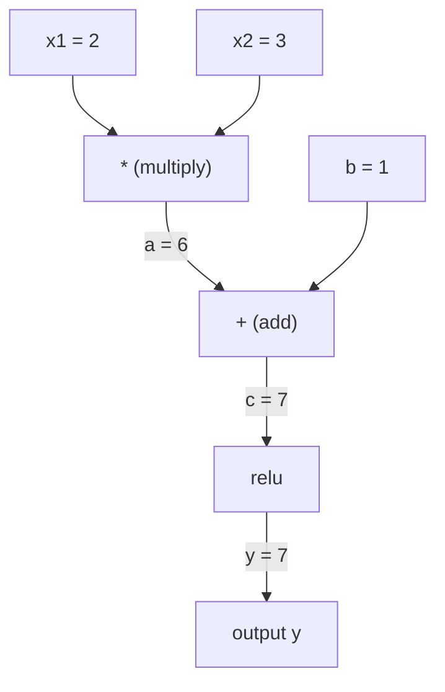
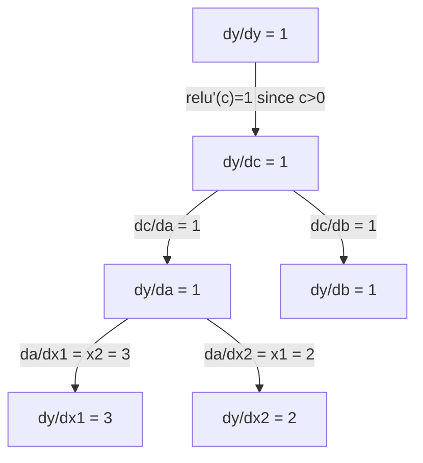

# 链式法则与自动微分

> 链式法则（chain rule）是每个能够学习的神经网络背后的动力。

**Type:** Build
**Language:** Python
**Prerequisites:** 阶段 1，第 04 课（导数与梯度）
**Time:** ~90 分钟

## 学习目标

- 构建一个最小的自动微分引擎（autograd engine，即 Value 类），记录运算并通过反向模式自动微分计算梯度（gradient）
- 使用拓扑排序（topological sort），实现计算图（computation graph）上的前向传播（forward pass）和反向传播（backward pass）
- 仅使用从零实现的自动微分引擎，构建多层感知机（MLP，multi-layer perceptron）并在异或（XOR）任务上训练
- 使用梯度检查（gradient checking），将自动微分结果与数值有限差分结果进行对照，验证其正确性

## 要解决的问题

你已经能计算简单函数的导数（derivative）。但神经网络不是一个简单函数，而是由数百个函数复合而成：矩阵乘法、加上偏置、应用激活函数、再次做矩阵乘法、softmax、交叉熵损失。输出是函数一层层嵌套的结果。

要训练网络，就需要计算损失对每个权重的梯度。面对 millions（数百万）个参数，手工计算不可能完成，而数值计算（有限差分）又太慢。

链式法则提供数学依据，自动微分提供算法。两者结合，就能对任意复合函数计算精确梯度，所需时间与一次前向传播的耗时成正比。

PyTorch、TensorFlow 和 JAX 就是这样工作的。你将从零构建一个微型版本。

## 核心概念

### 链式法则

若 `y = f(g(x))`，则 `y` 对 `x` 的导数为：

```text
dy/dx = dy/dg * dg/dx = f'(g(x)) * g'(x)
```

沿着这条链将导数相乘。每一环都贡献自己的局部导数。

例如：`y = sin(x^2)`

```text
g(x) = x^2       g'(x) = 2x
f(g) = sin(g)     f'(g) = cos(g)

dy/dx = cos(x^2) * 2x
```

对于嵌套更深的复合函数，这条链会继续延伸：

```text
y = f(g(h(x)))

dy/dx = f'(g(h(x))) * g'(h(x)) * h'(x)
```

神经网络中的每一层，都是这条链上的一环。

### 计算图

计算图让链式法则变得直观。每次运算对应一个节点，数据沿图向前流动，梯度则反向流动。

**前向传播（计算数值）：**



**反向传播（计算梯度）：**



反向传播在每个节点处应用链式法则，将梯度从输出传向输入。

### 前向模式与反向模式

在图中应用链式法则，有两种方式。

**前向模式（forward mode）**从输入出发，向前传播导数。它先计算 `dx/dx = 1`，再经过每次运算逐步传播。适合输入少、输出多的情况。

```text
Forward mode: seed dx/dx = 1, propagate forward

  x = 2       (dx/dx = 1)
  a = x^2     (da/dx = 2x = 4)
  y = sin(a)  (dy/dx = cos(a) * da/dx = cos(4) * 4 = -2.615)
```

**反向模式（reverse mode）**从输出出发，反向传播梯度。它先计算 `dy/dy = 1`，再按相反顺序经过每次运算逐步传播。适合输入多、输出少的情况。

```text
Reverse mode: seed dy/dy = 1, propagate backward

  y = sin(a)  (dy/dy = 1)
  a = x^2     (dy/da = cos(a) = cos(4) = -0.654)
  x = 2       (dy/dx = dy/da * da/dx = -0.654 * 4 = -2.615)
```

神经网络有 millions（数百万）个输入（权重），却只有一个输出（损失）。反向模式只需一次反向传播，就能计算所有梯度。这就是反向传播采用反向模式的原因。

| 模式 | 初始值（seed） | 方向 | 最适用的情况 |
|------|------|-----------|-----------|
| 前向模式 | `dx_i/dx_i = 1` | 从输入到输出 | 输入少、输出多 |
| 反向模式 | `dy/dy = 1` | 从输出到输入 | 输入多、输出少（神经网络） |

### 用对偶数实现前向模式

对偶数（dual number）能让前向模式的实现简洁优雅。对偶数的形式为 `a + b*epsilon`，其中 `epsilon^2 = 0`。

```text
Dual number: (value, derivative)

(2, 1) means: value is 2, derivative w.r.t. x is 1

Arithmetic rules:
  (a, a') + (b, b') = (a+b, a'+b')
  (a, a') * (b, b') = (a*b, a'*b + a*b')
  sin(a, a')         = (sin(a), cos(a)*a')
```

将输入变量的导数初始值设为 1，导数就会自动经过每次运算逐步传播。

### 构建自动微分引擎

自动微分引擎需要三个部分：

1. **数值封装。** 将每个数封装在一个对象中，由对象存储其数值和梯度。
2. **计算图记录。** 每次运算都记录其输入和局部梯度函数。
3. **反向传播。** 对图进行拓扑排序，然后按逆序遍历，在每个节点处应用链式法则。

这正是 PyTorch 的 `autograd` 所做的事。`torch.Tensor` 类封装数值，在 `requires_grad=True` 时记录运算，并在调用 `.backward()` 时计算梯度。

### PyTorch Autograd 的内部工作原理

当你编写下面的 PyTorch 代码时：

```python
x = torch.tensor(2.0, requires_grad=True)
y = x ** 2 + 3 * x + 1
y.backward()
print(x.grad)  # 7.0 = 2*x + 3 = 2*2 + 3
```

PyTorch 会在内部执行以下步骤：

1. 为 `x` 创建一个 `requires_grad=True` 的 `Tensor` 节点
2. 每次运算（`**`、`*`、`+`）都创建新节点，并记录反向传播函数
3. `y.backward()` 触发沿已记录计算图进行的反向模式自动微分
4. 每个节点的 `grad_fn` 计算局部梯度，并将其传给父节点
5. 梯度以相加的方式累积到 `.grad` 属性中，而不是替换原值

这个图是动态的，采用运行时定义（define-by-run）的方式。每次前向传播都会构建一张新图。这就是 PyTorch 支持在模型内部使用控制流（if/else、循环）的原因。

```figure
chain-rule
```

## 动手实现

### 步骤 1：Value 类

```python
class Value:
    def __init__(self, data, children=(), op=''):
        self.data = data
        self.grad = 0.0
        self._backward = lambda: None
        self._prev = set(children)
        self._op = op

    def __repr__(self):
        return f"Value(data={self.data:.4f}, grad={self.grad:.4f})"
```

每个 `Value` 都存储自身的数值数据、梯度（初始为零）、反向传播函数，以及指向产生该值的子节点的引用。

### 步骤 2：带梯度跟踪的算术运算

```python
    def __add__(self, other):
        other = other if isinstance(other, Value) else Value(other)
        out = Value(self.data + other.data, (self, other), '+')
        def _backward():
            self.grad += out.grad
            other.grad += out.grad
        out._backward = _backward
        return out

    def __mul__(self, other):
        other = other if isinstance(other, Value) else Value(other)
        out = Value(self.data * other.data, (self, other), '*')
        def _backward():
            self.grad += other.data * out.grad
            other.grad += self.data * out.grad
        out._backward = _backward
        return out

    def relu(self):
        out = Value(max(0, self.data), (self,), 'relu')
        def _backward():
            self.grad += (1.0 if out.data > 0 else 0.0) * out.grad
        out._backward = _backward
        return out
```

每次运算都会创建一个闭包（closure），用于计算局部梯度，再乘以上游梯度（来自输出侧的 `out.grad`）。`+=` 用于处理同一个值参与多次运算的情况。

### 步骤 3：反向传播

```python
    def backward(self):
        topo = []
        visited = set()
        def build_topo(v):
            if v not in visited:
                visited.add(v)
                for child in v._prev:
                    build_topo(child)
                topo.append(v)
        build_topo(self)

        self.grad = 1.0
        for v in reversed(topo):
            v._backward()
```

拓扑排序确保每个节点的梯度在传给其子节点之前，都已计算完整。种子梯度为 1.0 (dy/dy = 1)。

### 步骤 4：补充运算，完善引擎

基础的 Value 类支持加法、乘法和 relu。真正的自动微分引擎还需要更多运算。下面是构建神经网络所需的运算：

```python
    def __neg__(self):
        return self * -1

    def __sub__(self, other):
        return self + (-other)

    def __radd__(self, other):
        return self + other

    def __rmul__(self, other):
        return self * other

    def __rsub__(self, other):
        return other + (-self)

    def __pow__(self, n):
        out = Value(self.data ** n, (self,), f'**{n}')
        def _backward():
            self.grad += n * (self.data ** (n - 1)) * out.grad
        out._backward = _backward
        return out

    def __truediv__(self, other):
        return self * (other ** -1) if isinstance(other, Value) else self * (Value(other) ** -1)

    def exp(self):
        import math
        e = math.exp(self.data)
        out = Value(e, (self,), 'exp')
        def _backward():
            self.grad += e * out.grad
        out._backward = _backward
        return out

    def log(self):
        import math
        out = Value(math.log(self.data), (self,), 'log')
        def _backward():
            self.grad += (1.0 / self.data) * out.grad
        out._backward = _backward
        return out

    def tanh(self):
        import math
        t = math.tanh(self.data)
        out = Value(t, (self,), 'tanh')
        def _backward():
            self.grad += (1 - t ** 2) * out.grad
        out._backward = _backward
        return out
```

**各项运算为什么重要：**

| 运算 | 反向传播规则（upstream 表示上游梯度） | 用途 |
|-----------|--------------|---------|
| `__sub__` | 复用 add + neg | 损失计算 (pred - target) |
| `__pow__` | n * x^(n-1) | 多项式激活函数、均方误差 MSE (error^2) |
| `__truediv__` | 复用 mul + pow(-1) | 归一化、学习率缩放 |
| `exp` | exp(x) * upstream | Softmax、对数似然 |
| `log` | (1/x) * upstream | 交叉熵损失、对数概率 |
| `tanh` | (1 - tanh^2) * upstream | 经典激活函数 |

巧妙之处在于：`__sub__` 和 `__truediv__` 都是用已有运算定义的。链式法则会沿底层的 add/mul/pow 运算逐步复合，因此无需额外编写求导规则，就能得到正确的梯度。

### 步骤 5：从零实现微型 MLP

有了完整的 Value 类，就可以构建神经网络。不需要 PyTorch，也不需要 NumPy，只需要 Value 对象和链式法则。

```python
import random

class Neuron:
    def __init__(self, n_inputs):
        self.w = [Value(random.uniform(-1, 1)) for _ in range(n_inputs)]
        self.b = Value(0.0)

    def __call__(self, x):
        act = sum((wi * xi for wi, xi in zip(self.w, x)), self.b)
        return act.tanh()

    def parameters(self):
        return self.w + [self.b]

class Layer:
    def __init__(self, n_inputs, n_outputs):
        self.neurons = [Neuron(n_inputs) for _ in range(n_outputs)]

    def __call__(self, x):
        return [n(x) for n in self.neurons]

    def parameters(self):
        return [p for n in self.neurons for p in n.parameters()]

class MLP:
    def __init__(self, sizes):
        self.layers = [Layer(sizes[i], sizes[i+1]) for i in range(len(sizes)-1)]

    def __call__(self, x):
        for layer in self.layers:
            x = layer(x)
        return x[0] if len(x) == 1 else x

    def parameters(self):
        return [p for layer in self.layers for p in layer.parameters()]
```

`Neuron` 计算 `tanh(w1*x1 + w2*x2 + ... + b)`。`Layer` 是一个神经元列表，`MLP` 则将多层堆叠起来。每个权重都是一个 `Value`，因此调用 `loss.backward()` 就会将梯度传播到每个参数。

**在 XOR 任务上训练：**

```python
random.seed(42)
model = MLP([2, 4, 1])  # 2 inputs, 4 hidden neurons, 1 output

xs = [[0, 0], [0, 1], [1, 0], [1, 1]]
ys = [-1, 1, 1, -1]  # XOR pattern (using -1/1 for tanh)

for step in range(100):
    preds = [model(x) for x in xs]
    loss = sum((p - y) ** 2 for p, y in zip(preds, ys))

    for p in model.parameters():
        p.grad = 0.0
    loss.backward()

    lr = 0.05
    for p in model.parameters():
        p.data -= lr * p.grad

    if step % 20 == 0:
        print(f"step {step:3d}  loss = {loss.data:.4f}")

print("\nPredictions after training:")
for x, y in zip(xs, ys):
    print(f"  input={x}  target={y:2d}  pred={model(x).data:6.3f}")
```

这就是 micrograd：一个使用纯 Python 和自动微分实现的完整神经网络训练循环。每个商业深度学习框架，都在大得多的规模上做着同样的事。

### 步骤 6：梯度检查

如何知道你的自动微分实现是否正确？将结果与数值导数进行比较。这就是梯度检查。

```python
def gradient_check(build_expr, x_val, h=1e-7):
    x = Value(x_val)
    y = build_expr(x)
    y.backward()
    autodiff_grad = x.grad

    y_plus = build_expr(Value(x_val + h)).data
    y_minus = build_expr(Value(x_val - h)).data
    numerical_grad = (y_plus - y_minus) / (2 * h)

    diff = abs(autodiff_grad - numerical_grad)
    return autodiff_grad, numerical_grad, diff
```

用一个复杂表达式来测试：

```python
def expr(x):
    return (x ** 3 + x * 2 + 1).tanh()

ad, num, diff = gradient_check(expr, 0.5)
print(f"Autodiff:  {ad:.8f}")
print(f"Numerical: {num:.8f}")
print(f"Difference: {diff:.2e}")
# Difference should be < 1e-5
```

实现新运算时，梯度检查必不可少。如果反向传播存在错误，数值检查就能发现它。每个严谨的深度学习实现都会在开发期间进行梯度检查。

**何时使用梯度检查：**

| 场景 | 是否进行梯度检查？ |
|-----------|-------------------|
| 为自动微分引擎添加新运算 | 是，每次都应检查 |
| 调试无法收敛的训练循环 | 是，先检查梯度 |
| 生产环境中的训练 | 否，太慢（每个参数需做两次前向传播，即 2x） |
| 自动微分代码的单元测试 | 是，并将检查自动化 |

### 步骤 7：与手工计算结果核对

```python
x1 = Value(2.0)
x2 = Value(3.0)
a = x1 * x2          # a = 6.0
b = a + Value(1.0)    # b = 7.0
y = b.relu()          # y = 7.0

y.backward()

print(f"y = {y.data}")          # 7.0
print(f"dy/dx1 = {x1.grad}")   # 3.0 (= x2)
print(f"dy/dx2 = {x2.grad}")   # 2.0 (= x1)
```

手工核对：`y = relu(x1*x2 + 1)`。由于 `x1*x2 + 1 = 7 > 0`，此时 relu 是恒等映射。
`dy/dx1 = x2 = 3`。`dy/dx2 = x1 = 2`。引擎给出的结果与之相符。

## 实际使用

### 与 PyTorch 的结果核对

```python
import torch

x1 = torch.tensor(2.0, requires_grad=True)
x2 = torch.tensor(3.0, requires_grad=True)
a = x1 * x2
b = a + 1.0
y = torch.relu(b)
y.backward()

print(f"PyTorch dy/dx1 = {x1.grad.item()}")  # 3.0
print(f"PyTorch dy/dx2 = {x2.grad.item()}")  # 2.0
```

梯度完全相同。你的引擎与 PyTorch 算出的结果一致，因为两者使用相同的数学原理：通过链式法则进行反向模式自动微分。

### 一个更复杂的表达式

```python
a = Value(2.0)
b = Value(-3.0)
c = Value(10.0)
f = (a * b + c).relu()  # relu(2*(-3) + 10) = relu(4) = 4

f.backward()
print(f"df/da = {a.grad}")  # -3.0 (= b)
print(f"df/db = {b.grad}")  #  2.0 (= a)
print(f"df/dc = {c.grad}")  #  1.0
```

## 交付成果

本课将产出：
- `outputs/skill-autodiff.md` -- 用于构建和调试自动微分系统的技能文件
- `code/autodiff.py` -- 可进一步扩展的最小自动微分引擎

这里构建的 Value 类，是阶段 3 中神经网络训练循环的基础。

## 练习

1. 为 Value 类添加 `__pow__`，使其能计算 `x ** n`。验证 `d/dx(x^3)` 在 `x=2` 处等于 `12.0`。

2. 添加 `tanh` 作为激活函数。验证 `tanh'(0) = 1`，以及 `tanh'(2) = 0.0707`（近似值）。

3. 为单个神经元构建计算图：`y = relu(w1*x1 + w2*x2 + b)`。计算全部五个梯度，并与 PyTorch 的结果核对。

4. 使用对偶数实现前向模式自动微分。创建一个 `Dual` 类，并验证它得到的导数与反向模式引擎相同。

## 关键术语

| 术语 | 常见说法 | 实际含义 |
|------|----------------|----------------------|
| 链式法则 | “将导数相乘” | 复合函数的导数等于各函数在对应点处的局部导数之积 |
| 计算图 | “网络示意图” | 有向无环图（DAG），其中节点表示运算，边传递数值（前向）或梯度（反向） |
| 前向模式 | “向前传播导数” | 将导数从输入传播到输出的自动微分。每个输入变量需要一次传播。 |
| 反向模式 | “反向传播” | 将梯度从输出传播到输入的自动微分。每个输出变量需要一次传播。 |
| Autograd | “自动计算梯度” | 记录数值上的运算、构建计算图，并通过链式法则计算精确梯度的系统 |
| 对偶数 | “数值加导数” | 形式为 a + b*epsilon (epsilon^2 = 0) 的数，可在算术运算中携带导数信息 |
| 拓扑排序 | “依赖顺序” | 将图中的节点排序，使每个节点都位于其所有依赖节点之后。这是正确传播梯度所必需的。 |
| 梯度累积 | “相加，而不是替换” | 同一个值作为多个运算的输入时，其梯度是所有传入梯度贡献之和 |
| 动态图 | “运行时定义” | 每次前向传播都会重新构建的计算图，允许在模型内使用 Python 控制流（PyTorch 风格） |
| 梯度检查 | “数值验证” | 将自动微分梯度与数值有限差分梯度进行比较，以验证正确性。是调试的重要手段。 |
| MLP | “多层感知机” | 具有一个或多个隐藏层的神经网络，隐藏层由神经元构成。每个神经元先计算加权和并加上偏置，再应用激活函数。 |
| 神经元 | “加权和 + 激活函数” | 基本单元：output = activation(w1\*x1 + w2\*x2 + ... + b)。权重和偏置都是可学习参数。 |

## 延伸阅读

- [3Blue1Brown：反向传播中的微积分](https://www.youtube.com/watch?v=tIeHLnjs5U8) -- 直观讲解神经网络中的链式法则
- [PyTorch Autograd 的工作机制](https://pytorch.org/docs/stable/notes/autograd.html) -- 真实系统如何工作
- [Baydin 等人：机器学习中的自动微分综述](https://arxiv.org/abs/1502.05767) -- 全面参考资料
