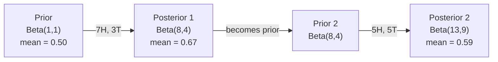

# Bayes定理

> 概率关乎你的预期，Bayes定理关乎你从新信息中学到了什么。

**Type:** Build
**Language:** Python
**Prerequisites:** 阶段 1，第 06 课（概率基础）
**Time:** ~75 分钟

## 学习目标

- 应用Bayes定理（贝叶斯定理），根据先验（prior）、似然（likelihood）和证据（evidence）计算后验（posterior）概率
- 从零实现朴素Bayes（Naive Bayes）文本分类器，使用Laplace平滑（拉普拉斯平滑）和对数空间计算
- 比较最大似然估计（MLE）与最大后验估计（MAP），解释MAP如何对应于L2正则化
- 使用Beta-Binomial（Beta-二项）共轭先验（conjugate prior）实现顺序贝叶斯更新，用于A/B测试

## 要解决的问题

某项医学检测的准确率为99%。你的检测结果是阳性。你实际患病的概率是多少？

大多数人会说99%。真正的答案取决于这种疾病有多罕见。如果每10,000人中只有1人患病，那么即使检测结果为阳性，你患病的概率也只有约1%。其余99%的阳性结果都是健康人被误报为阳性。

这不是脑筋急转弯，而是Bayes定理。每个垃圾邮件过滤器、每项医学诊断，以及每个量化不确定性的机器学习模型，都使用同样的推理方式：先有一个判断，再看到证据，然后更新判断。

如果你在不了解这一点的情况下构建机器学习（ML）系统，就会误读模型输出、设置不当的阈值，并交付过度自信的预测。

## 核心概念

### 从联合概率到Bayes定理

在第06课中，你已经学过条件概率：

```text
P(A|B) = P(A and B) / P(B)
```

对称地：

```text
P(B|A) = P(A and B) / P(A)
```

这两个表达式的分子相同，都是P(A and B)。将两式改写为这个量的表达式，令它们相等，再整理：

```text
P(A and B) = P(A|B) * P(B) = P(B|A) * P(A)

Therefore:

P(A|B) = P(B|A) * P(A) / P(B)
```

这就是Bayes定理：四个量，一个等式。

### 四个组成部分

| 组成部分 | 名称 | 含义 |
|------|------|---------------|
| P(A\|B) | 后验 | 看到证据B后，你对A更新后的判断 |
| P(B\|A) | 似然 | 如果A为真，出现证据B的可能性有多大 |
| P(A) | 先验 | 看到任何证据之前，你对A的判断 |
| P(B) | 证据 | 考虑所有可能情形时，出现B的总概率 |

证据项P(B)起归一化因子的作用。可以用全概率公式将它展开：

```text
P(B) = P(B|A) * P(A) + P(B|not A) * P(not A)
```

### 医学检测示例

某种疾病的患病率是每10,000人中有1人。检测准确率为99%（能检出99%的患者，假阳性率为1%）。

```text
P(sick)          = 0.0001     (prior: disease is rare)
P(positive|sick) = 0.99       (likelihood: test catches it)
P(positive|healthy) = 0.01    (false positive rate)

P(positive) = P(positive|sick) * P(sick) + P(positive|healthy) * P(healthy)
            = 0.99 * 0.0001 + 0.01 * 0.9999
            = 0.000099 + 0.009999
            = 0.010098

P(sick|positive) = P(positive|sick) * P(sick) / P(positive)
                 = 0.99 * 0.0001 / 0.010098
                 = 0.0098
                 = 0.98%
```

不到1%。先验占了主导。当一种疾病很罕见时，即使检测准确，阳性结果也大多是假阳性。这就是医生会安排确认检测的原因。

### 垃圾邮件过滤示例

你收到一封包含“lottery”这个词的邮件。它是垃圾邮件吗？

```text
P(spam)                = 0.3      (30% of email is spam)
P("lottery"|spam)      = 0.05     (5% of spam emails contain "lottery")
P("lottery"|not spam)  = 0.001    (0.1% of legitimate emails contain "lottery")

P("lottery") = 0.05 * 0.3 + 0.001 * 0.7
             = 0.015 + 0.0007
             = 0.0157

P(spam|"lottery") = 0.05 * 0.3 / 0.0157
                  = 0.955
                  = 95.5%
```

一个词就把概率从30%推到了95.5%。真正的垃圾邮件过滤器会同时对数百个词应用Bayes定理。

### 朴素Bayes：独立性假设

朴素Bayes将这一方法扩展到多个特征，所作的假设是：给定类别后，所有特征都条件独立：

```text
P(class | feature_1, feature_2, ..., feature_n)
  = P(class) * P(feature_1|class) * P(feature_2|class) * ... * P(feature_n|class)
    / P(feature_1, feature_2, ..., feature_n)
```

“朴素”指的就是独立性假设。在文本中，词的出现并不独立（“New”和“York”是相关的）。但这个假设在实践中效果出奇地好，因为分类器只需要对类别排序，不需要给出校准的概率。

由于所有类别的分母相同，可以省略分母，只比较分子：

```text
score(class) = P(class) * product of P(feature_i | class)
```

选择得分最高的类别。

### 最大似然估计（MLE）

如何从训练数据中得到P(feature|class)？计数即可。

```text
P("free"|spam) = (number of spam emails containing "free") / (total spam emails)
```

这就是MLE：选择让已观测数据最有可能出现的参数值。你要最大化的是似然函数；对于离散计数，这就归结为相对频率。

问题在于：如果训练时某个词从未在垃圾邮件中出现，MLE就会将其概率设为零。只要有一个未见过的词，整个乘积就会变成零。用Laplace平滑可以解决这个问题：

```text
P(word|class) = (count(word, class) + 1) / (total_words_in_class + vocabulary_size)
```

给每个计数加1，确保所有概率都不会为零。

### 最大后验估计（MAP）

MLE问的是：什么参数能让P(data|parameters)最大？

MAP问的是：什么参数能让P(parameters|data)最大？

根据Bayes定理：

```text
P(parameters|data) proportional to P(data|parameters) * P(parameters)
```

MAP给参数本身加上了先验。如果你认为参数应该较小，就用一个惩罚较大取值的先验来表达这一判断。这与ML中的L2正则化完全相同。岭回归中的“岭”惩罚，其实就是权重上的Gaussian先验（高斯先验）。

| 估计方法 | 优化目标 | ML中的对应做法 |
|------------|-----------|---------------|
| MLE | P(data\|params) | 不带正则化的训练 |
| MAP | P(data\|params) * P(params) | L2 / L1正则化 |

### 贝叶斯学派与频率学派：实践中的区别

频率学派把参数视为固定的未知量。他们问：“如果我把这个实验重复很多次，会发生什么？”

贝叶斯学派把参数视为分布。他们问：“根据已有的观测，我对参数有什么判断？”

在构建ML系统时，两者的实际区别如下：

| 方面 | 频率学派 | 贝叶斯学派 |
|--------|-------------|----------|
| 输出 | 点估计 | 取值的分布 |
| 不确定性 | 置信区间（关于推断程序） | 可信区间（关于参数） |
| 少量数据 | 可能过拟合 | 先验起到正则化作用 |
| 计算 | 通常更快 | 往往需要抽样（MCMC） |

生产环境中的ML大多采用频率学派的方法（SGD、点估计）。当你需要经过校准的不确定性（医学决策、安全关键系统），或者数据稀缺（少样本学习、冷启动）时，贝叶斯方法尤其有用。

### 为什么贝叶斯思维对ML很重要

这种联系不只是类比：

**先验就是正则化。** 权重上的Gaussian先验就是L2正则化，Laplace先验就是L1正则化。每次添加正则化项，你都在用贝叶斯的方式表达自己对参数取值的预期。

**后验体现不确定性。** 单个预测概率无法告诉你，模型对这个估计有多大把握。贝叶斯方法给出的是一个分布：“我认为P(spam)在0.8到0.95之间。”

**Bayes更新就是在线学习。** 今天的后验会成为明天的先验。当模型看到新数据时，它会逐步更新自己的判断，而不必从头重新训练。

**模型比较也运用贝叶斯思维。** 贝叶斯信息准则（BIC）、边际似然和Bayes因子都使用贝叶斯推理，在模型之间作选择而不产生过拟合。

```figure
bayes-update
```

## 动手实现

### 第1步：Bayes定理函数

```python
def bayes(prior, likelihood, false_positive_rate):
    evidence = likelihood * prior + false_positive_rate * (1 - prior)
    posterior = likelihood * prior / evidence
    return posterior

result = bayes(prior=0.0001, likelihood=0.99, false_positive_rate=0.01)
print(f"P(sick|positive) = {result:.4f}")
```

### 第2步：朴素Bayes分类器

```python
import math
from collections import defaultdict

class NaiveBayes:
    def __init__(self, smoothing=1.0):
        self.smoothing = smoothing
        self.class_counts = defaultdict(int)
        self.word_counts = defaultdict(lambda: defaultdict(int))
        self.class_word_totals = defaultdict(int)
        self.vocab = set()

    def train(self, documents, labels):
        for doc, label in zip(documents, labels):
            self.class_counts[label] += 1
            words = doc.lower().split()
            for word in words:
                self.word_counts[label][word] += 1
                self.class_word_totals[label] += 1
                self.vocab.add(word)

    def predict(self, document):
        words = document.lower().split()
        total_docs = sum(self.class_counts.values())
        vocab_size = len(self.vocab)
        best_class = None
        best_score = float("-inf")
        for cls in self.class_counts:
            score = math.log(self.class_counts[cls] / total_docs)
            for word in words:
                count = self.word_counts[cls].get(word, 0)
                total = self.class_word_totals[cls]
                score += math.log((count + self.smoothing) / (total + self.smoothing * vocab_size))
            if score > best_score:
                best_score = score
                best_class = cls
        return best_class
```

对数概率可防止下溢。将许多很小的概率相乘，会得到小到浮点数无法表示的数值。对数概率求和在数值上稳定，而且在数学上等价。

### 第3步：用垃圾邮件数据训练

```python
train_docs = [
    "win free money now",
    "free lottery ticket winner",
    "claim your prize today free",
    "urgent offer free cash",
    "congratulations you won free",
    "meeting tomorrow at noon",
    "project update attached",
    "can we schedule a call",
    "quarterly report review",
    "lunch on thursday sounds good",
    "team standup notes attached",
    "please review the pull request",
]

train_labels = [
    "spam", "spam", "spam", "spam", "spam",
    "ham", "ham", "ham", "ham", "ham", "ham", "ham",
]

classifier = NaiveBayes()
classifier.train(train_docs, train_labels)

test_messages = [
    "free money waiting for you",
    "meeting rescheduled to friday",
    "you won a free prize",
    "please review the attached report",
]

for msg in test_messages:
    print(f"  '{msg}' -> {classifier.predict(msg)}")
```

### 第4步：查看学到的概率

```python
def show_top_words(classifier, cls, n=5):
    vocab_size = len(classifier.vocab)
    total = classifier.class_word_totals[cls]
    probs = {}
    for word in classifier.vocab:
        count = classifier.word_counts[cls].get(word, 0)
        probs[word] = (count + classifier.smoothing) / (total + classifier.smoothing * vocab_size)
    sorted_words = sorted(probs.items(), key=lambda x: x[1], reverse=True)
    for word, prob in sorted_words[:n]:
        print(f"    {word}: {prob:.4f}")

print("\nTop spam words:")
show_top_words(classifier, "spam")
print("\nTop ham words:")
show_top_words(classifier, "ham")
```

## 实际使用

Scikit-learn提供可用于生产环境的朴素Bayes实现：

```python
from sklearn.feature_extraction.text import CountVectorizer
from sklearn.naive_bayes import MultinomialNB
from sklearn.metrics import classification_report

vectorizer = CountVectorizer()
X_train = vectorizer.fit_transform(train_docs)
clf = MultinomialNB()
clf.fit(X_train, train_labels)

X_test = vectorizer.transform(test_messages)
predictions = clf.predict(X_test)
for msg, pred in zip(test_messages, predictions):
    print(f"  '{msg}' -> {pred}")
```

算法相同。CountVectorizer负责分词和构建词表，MultinomialNB在内部处理平滑和对数概率。你从零编写的版本用40行代码做到了同样的事情。

## 交付成果

这里构建的NaiveBayes类展示了完整流程：分词、使用Laplace平滑估计概率，以及在对数空间中预测。`code/bayes.py`中的代码只依赖Python标准库，就能端到端运行。

### 共轭先验

当先验和后验属于同一分布族时，这样的先验就称为“共轭”先验。这让贝叶斯更新的代数计算变得简洁：无需数值积分，就能得到闭式后验。

| 似然 | 共轭先验 | 后验 | 示例 |
|-----------|----------------|-----------|---------|
| Bernoulli（伯努利分布） | Beta(a, b) | Beta(a + successes, b + failures) | 估计硬币正反面概率的偏向 |
| Normal（正态分布，方差已知） | Normal(mu_0, sigma_0) | Normal(weighted mean, smaller variance) | 传感器校准 |
| Poisson（泊松分布） | Gamma(a, b) | Gamma(a + sum of counts, b + n) | 对到达率建模 |
| Multinomial（多项分布） | Dirichlet(alpha) | Dirichlet(alpha + counts) | 主题建模、语言模型 |

这一点为何重要？没有共轭先验时，你需要用Monte Carlo（蒙特卡洛）抽样或变分推断来近似后验。有了共轭先验，只需更新两个数。

Beta分布是实践中最常用的共轭先验。Beta(a, b)表示你对某个概率参数的判断。均值为a/(a+b)。a+b越大，分布越集中（越有把握）。

Beta先验的几个特殊情形：
- Beta(1, 1) = 均匀分布。你对参数没有倾向。
- Beta(10, 10) = 在0.5处达到峰值。你强烈认为参数接近0.5。
- Beta(1, 10) = 偏向0。你认为参数较小。

更新规则非常简单：

```text
Prior:     Beta(a, b)
Data:      s successes, f failures
Posterior: Beta(a + s, b + f)
```

不用积分，不用抽样，只做加法。

### 顺序贝叶斯更新

贝叶斯推断天然适合按顺序进行。今天的后验会成为明天的先验。实际系统就是这样逐步学习的，无需重新处理全部历史数据。

来看一个具体例子：估计一枚硬币是否均匀。

**第1天：尚无数据。**
从Beta(1, 1)开始，也就是均匀先验。你没有倾向。
- 先验均值：0.5
- 先验在[0, 1]上是平坦的

**第2天：观察到7次正面、3次反面。**
后验 = Beta(1 + 7, 1 + 3) = Beta(8, 4)
- 后验均值：8/12 = 0.667
- 证据提示硬币偏向正面

**第3天：又观察到5次正面、5次反面。**
将昨天的后验作为今天的先验。
后验 = Beta(8 + 5, 4 + 5) = Beta(13, 9)
- 后验均值：13/22 = 0.591
- 正反面次数均衡的新数据把估计值拉回了更接近0.5的位置



观测的顺序并不重要。用全部12次正面和8次反面的数据一次性更新Beta(1,1)，也会得到Beta(13, 9)，结果相同。顺序更新与批量更新在数学上等价，但顺序更新让你无需存储原始数据，就能在每一步作出决策。

这是生产ML系统中在线学习的基础。多臂老虎机问题中的Thompson抽样、增量推荐系统和流式异常检测器都采用这种模式。

### 与A/B测试的联系

A/B测试其实就是换了种形式的贝叶斯推断。

设定如下：你正在测试两种按钮颜色，即变体A（蓝色）和变体B（绿色），想知道哪一种能获得更多点击。

贝叶斯A/B测试的流程：

1. **先验。** 两个变体都从Beta(1, 1)开始，没有先验偏好。
2. **数据。** 变体A：1000次浏览中有50次点击。变体B：1000次浏览中有65次点击。
3. **后验。**
   - A: Beta(1 + 50, 1 + 950) = Beta(51, 951). 均值 = 0.051
   - B: Beta(1 + 65, 1 + 935) = Beta(66, 936). 均值 = 0.066
4. **决策。** 计算P(B > A)，即B的真实转化率高于A的概率。

用解析方法计算P(B > A)很难，但用Monte Carlo就很简单：

```text
1. Draw 100,000 samples from Beta(51, 951)  -> samples_A
2. Draw 100,000 samples from Beta(66, 936)  -> samples_B
3. P(B > A) = fraction of samples where B > A
```

如果P(B > A) > 0.95，就上线变体B。如果它介于0.05和0.95之间，就继续收集数据。如果P(B > A) < 0.05，就上线变体A。

相较于频率学派A/B测试的优势：
- 能得到直接的概率陈述：“B更好的概率是97%”
- 不会被p值弄糊涂，也不必使用“未能拒绝原假设”这样的迂回措辞
- 可以随时查看结果，而不会抬高误报率（没有“中途查看问题”）
- 可以纳入先验知识（例如，之前的测试提示转化率通常为3-8%）

| 方面 | 频率学派A/B测试 | 贝叶斯A/B测试 |
|--------|----------------|--------------|
| 输出 | p值 | P(B > A) |
| 解释 | “如果A=B，这些数据有多出乎意料？” | “B优于A的可能性有多大？” |
| 提前停止 | 会抬高误报率 | 任何时候都可以安全停止（前提是先验选择恰当、模型设定正确） |
| 先验知识 | 不使用 | 编码为Beta先验 |
| 决策规则 | p < 0.05 | P(B > A) > threshold |

## 练习

1. **多次检测。** 一位患者在两次独立检测中都呈阳性（两次检测的准确率均为99%，患病率为每10,000人中有1人）。两次检测后的P(sick)是多少？用第一次检测的后验作为第二次检测的先验。

2. **平滑的影响。** 分别将平滑参数设为0.01、0.1、1.0和10.0，运行垃圾邮件分类器。概率最高的那些词，其概率会如何变化？当smoothing=0，并遇到只在正常邮件（ham）中出现过的词时，会发生什么？

3. **添加特征。** 扩展NaiveBayes类，让它除了词项计数外，还将邮件长度（短/长，short/long）作为特征。从训练数据中估计P(short|spam)和P(short|ham)，并将其计入预测得分。

4. **手算MAP。** 给定观测数据（抛硬币10次，其中7次为正面），使用Beta(2,2)先验计算正面概率的MAP估计。将结果与MLE估计（7/10）比较。

## 关键术语

| 术语 | 通俗说法 | 实际含义 |
|------|----------------|----------------------|
| 先验 | “我最初的猜测” | 观察证据之前的P(hypothesis)。在ML中，就是正则化项。 |
| 似然 | “数据有多吻合” | P(evidence\|hypothesis)。在特定假设下，已观测数据出现的可能性有多大。 |
| 后验 | “我更新后的判断” | P(hypothesis\|evidence)。先验乘以似然，再进行归一化。 |
| 证据 | “归一化常数” | 考虑所有假设时的P(data)。确保后验概率之和为1。 |
| 朴素Bayes | “那个简单的文本分类器” | 假设给定类别后特征相互独立的分类器。尽管这个假设不成立，效果仍然很好。 |
| Laplace平滑 | “加一平滑” | 给每个特征加上一个小计数，防止未见数据导致零概率。 |
| MLE | “直接用频率” | 选择让P(data\|parameters)最大的参数。不使用先验。数据量小时可能过拟合。 |
| MAP | “带先验的MLE” | 选择让P(data\|parameters) * P(parameters)最大的参数。等价于带正则化的MLE。 |
| 对数概率 | “在对数空间中运算” | 用log(P)代替P，避免许多小数相乘时发生浮点下溢。 |
| 假阳性 | “一次误报” | 检测结果为阳性，但真实状态为阴性。由此引出基率谬误（base rate fallacy）。 |

## 延伸阅读

- [3Blue1Brown：Bayes定理](https://www.youtube.com/watch?v=HZGCoVF3YvM) - 以医学检测为例进行可视化讲解
- [Stanford CS229：生成式学习算法](https://cs229.stanford.edu/main_notes.pdf) - 朴素Bayes及其与判别模型的联系
- [Think Bayes](https://greenteapress.com/wp/think-bayes/) - 免费书籍，通过Python代码讲解贝叶斯统计
- [scikit-learn朴素Bayes](https://scikit-learn.org/stable/modules/naive_bayes.html) - 生产实现以及各个变体的适用场景
