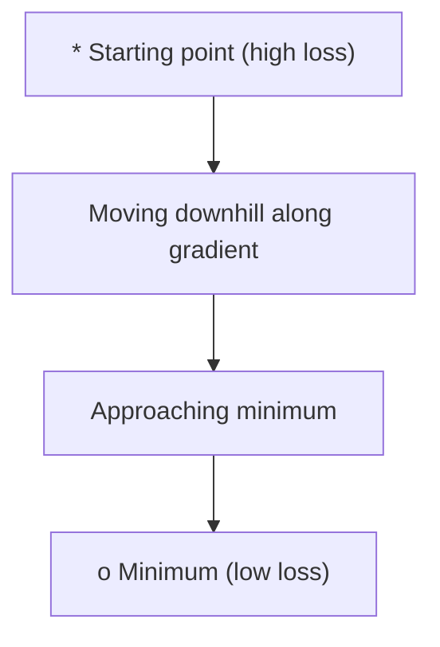
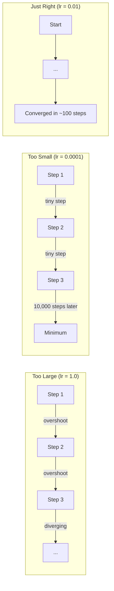
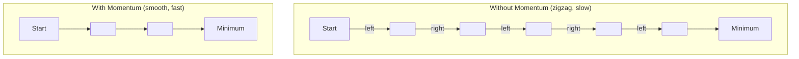
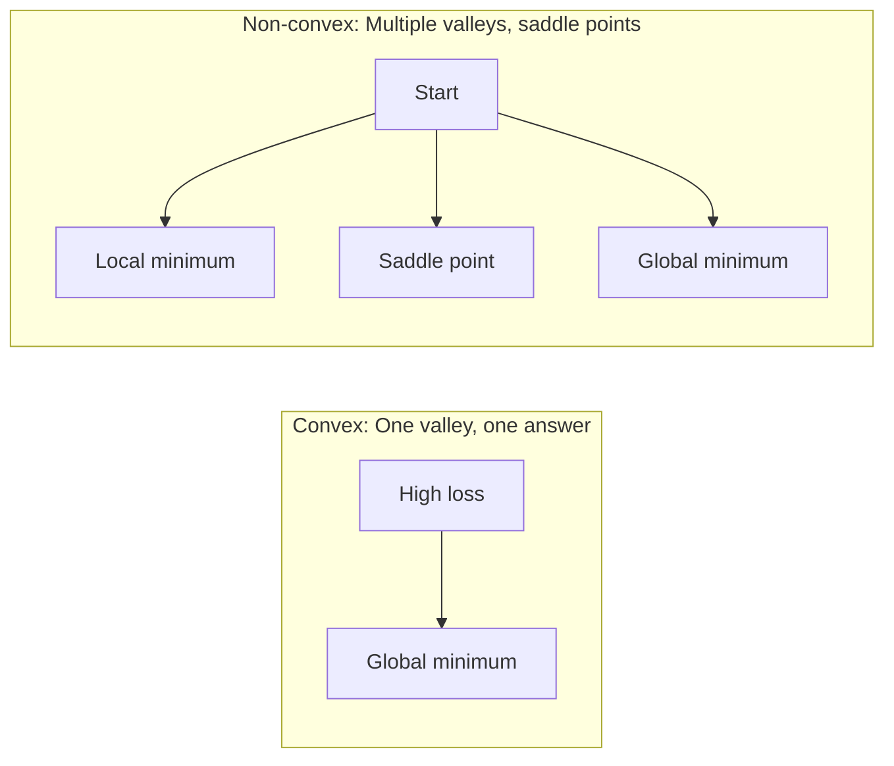
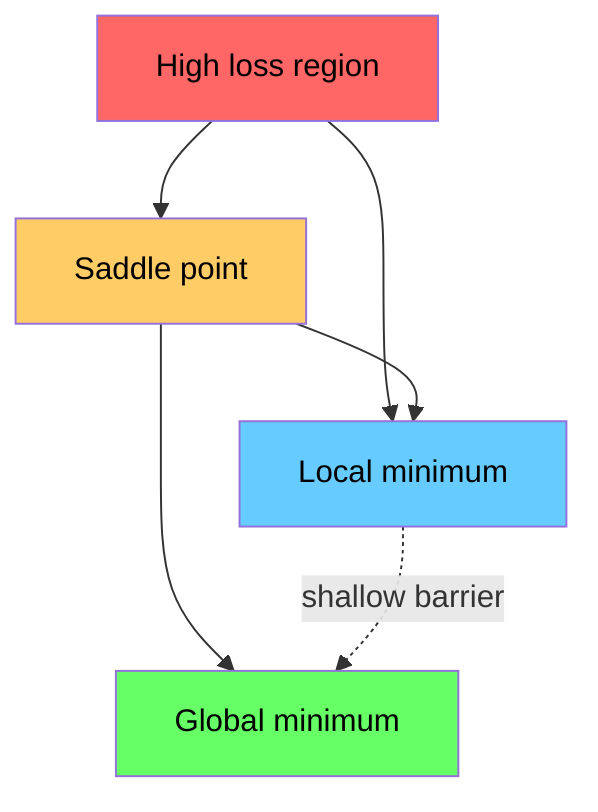

# 优化

> 训练神经网络，说到底就是找到谷底。

**Type:** Build
**Language:** Python
**Prerequisites:** 阶段 1，第 04-05 课（导数、梯度）
**Time:** ~75 分钟

## 学习目标

- 从零实现基础梯度下降（vanilla gradient descent）、带动量（momentum）的随机梯度下降（SGD）和 Adam
- 比较各优化器在 Rosenbrock 函数上的收敛情况，并解释 Adam 为什么要为每个权重自适应调整学习率
- 区分凸与非凸的损失曲面（loss landscape），并解释鞍点（saddle point）在高维空间中的作用
- 配置学习率调度（learning rate schedule），包括阶梯衰减、余弦退火（cosine annealing）和预热（warmup），以提高训练稳定性

## 要解决的问题

你有一个损失函数，它告诉你模型错得有多严重。你也有梯度（gradient），它告诉你朝哪个方向会让损失变大。现在，你需要一套下坡的策略。

最直接的方法很简单：沿梯度的反方向移动，用一个叫作学习率（learning rate）的数来缩放步长，然后重复。这个方法就是梯度下降，而且确实有效。不过，“有效”也有需要注意的地方。学习率太大，你会直接越过整个山谷，在两侧谷壁之间来回弹跳；学习率太小，你只能慢慢挪向答案，多走数千个本不必要的步骤。遇到鞍点时，即使还没找到极小值，你也会停下来。

深度学习中的每一种优化器，都在回答同一个问题：怎样才能更快、更可靠地到达谷底？

## 核心概念

### 优化是什么意思

优化就是寻找能让函数值最小（或最大）的输入值。在机器学习中，这个函数是损失函数，输入是模型的权重。训练就是优化。

```text
minimize L(w) where:
  L = loss function
  w = model weights (could be millions of parameters)
```

### 基础梯度下降

这是最简单的优化器。计算损失对每个权重的梯度，让每个权重沿其梯度的反方向移动，并用学习率缩放步长。

```text
w = w - lr * gradient
```

整个算法就是这样，只有一行。



### 学习率：最重要的超参数

学习率控制步长。它决定了收敛的方方面面。



没有一个公式能算出合适的学习率，你需要通过实验来寻找。常见的起始值是：Adam 用 0.001，带动量的 SGD 用 0.01。

### SGD、批量与小批量的比较

基础梯度下降在每次更新之前，都会用整个数据集计算梯度。这称为批量梯度下降，稳定，但速度慢。

随机梯度下降（SGD）只用一个随机样本计算梯度，然后立即更新。噪声大，但速度快。

小批量（mini-batch）梯度下降则在两者之间折中：先用一小批样本（32、64、128、256 个）计算梯度，再更新。实际中大家用的都是这种方法。

| 变体 | 批量大小 | 梯度质量 | 每步速度 | 噪声 |
|---------|-----------|-----------------|---------------|-------|
| 批量 GD | 整个数据集 | 精确 | 慢 | 无 |
| SGD | 1 个样本 | 噪声很大 | 快 | 高 |
| 小批量 | 32-256 | 估计较好 | 均衡 | 中等 |

SGD 和小批量方法中的噪声并不是缺陷。它有助于逃离较浅的局部极小值和鞍点。

### 动量：向山下滚动的小球

基础梯度下降只看当前的梯度。如果梯度方向来回摆动（在狭窄山谷中很常见），前进就会很慢。动量通过将过去的梯度累积到一个速度（velocity）项中，解决这个问题。

```text
v = beta * v + gradient
w = w - lr * v
```

可以把它想象成一个向山下滚动的小球：它不会每遇到一点起伏就停下再重新出发，而是会在方向一致时不断加速，并减弱振荡。



`beta`（通常为 0.9）控制保留多少历史信息。beta 越大，动量越大，路径越平滑，但对方向变化的反应也越慢。

### Adam：自适应学习率

不同的权重需要不同的学习率。一个很少出现大梯度的权重，在终于出现大梯度时应该迈出更大的步子；一个总是出现巨大梯度的权重，则应该迈小一些的步子。

Adam（自适应矩估计，Adaptive Moment Estimation）为每个权重跟踪两个量：

1. 一阶矩（m）：梯度的滑动平均（类似动量）
2. 二阶矩（v）：梯度平方的滑动平均（反映梯度大小）

```text
m = beta1 * m + (1 - beta1) * gradient
v = beta2 * v + (1 - beta2) * gradient^2

m_hat = m / (1 - beta1^t)    bias correction
v_hat = v / (1 - beta2^t)    bias correction

w = w - lr * m_hat / (sqrt(v_hat) + epsilon)
```

关键在于除以 `sqrt(v_hat)`。梯度大的权重要除以一个较大的数（有效更新步较小），梯度小的权重要除以一个较小的数（有效更新步较大）。每个权重都有自己的自适应学习率。

默认超参数为：`lr=0.001, beta1=0.9, beta2=0.999, epsilon=1e-8`。这些默认值在大多数问题上都表现良好。

### 学习率调度

固定学习率是一种折中。训练初期，你希望步子大一些，以便快速前进；训练后期，你希望步子小一些，以便在极小值附近做精细调整。

常见调度方式：

| 调度方式 | 公式 | 使用场景 |
|----------|---------|----------|
| 阶梯衰减 | 每 N 个 epoch（训练轮次）执行 lr = lr \* factor | 简单，手动控制 |
| 指数衰减 | lr = lr_0 \* decay^t | 平滑减小学习率 |
| 余弦退火 | lr = lr_min + 0.5 \* (lr_max - lr_min) \* (1 + cos(pi \* t / T)) | Transformer、现代训练 |
| 预热 + 衰减 | 先线性增大，再衰减 | 大模型，防止训练初期不稳定 |

### 凸与非凸的比较

凸函数只有一个极小值，梯度下降总能找到它。像 `f(x) = x^2` 这样的二次函数就是凸函数。

神经网络的损失函数是非凸的，有许多局部极小值、鞍点和平坦区域。



在实践中，高维神经网络的局部极小值很少成为问题。大多数局部极小值处的损失都接近全局极小值处的损失。真正的障碍是鞍点（在某些方向上平坦，在另一些方向上弯曲）。动量和小批量带来的噪声有助于逃离鞍点。

### 损失曲面可视化

损失是所有权重的函数。对于有 1 million（百万）个权重的模型，损失曲面位于 1,000,001 维空间中。可视化时，我们在权重空间中随机选取两个方向，绘制沿这两个方向变化的损失，得到一个 2D 曲面。



尖锐极小值的泛化表现差，平坦极小值的泛化表现好。这也是带动量的 SGD 在最终测试准确率上往往优于 Adam 的原因之一：它的噪声会阻止优化过程停在尖锐极小值处。

```figure
gradient-descent
```

## 动手实现

### 步骤 1：定义测试函数

Rosenbrock 函数是经典的优化基准函数。它的极小值点位于一条狭窄、弯曲山谷中的 (1, 1)；这条山谷容易找到，却很难沿着它前进。

```text
f(x, y) = (1 - x)^2 + 100 * (y - x^2)^2
```

```python
def rosenbrock(params):
    x, y = params
    return (1 - x) ** 2 + 100 * (y - x ** 2) ** 2

def rosenbrock_gradient(params):
    x, y = params
    df_dx = -2 * (1 - x) + 200 * (y - x ** 2) * (-2 * x)
    df_dy = 200 * (y - x ** 2)
    return [df_dx, df_dy]
```

### 步骤 2：基础梯度下降

```python
class GradientDescent:
    def __init__(self, lr=0.001):
        self.lr = lr

    def step(self, params, grads):
        return [p - self.lr * g for p, g in zip(params, grads)]
```

### 步骤 3：带动量的 SGD

```python
class SGDMomentum:
    def __init__(self, lr=0.001, momentum=0.9):
        self.lr = lr
        self.momentum = momentum
        self.velocity = None

    def step(self, params, grads):
        if self.velocity is None:
            self.velocity = [0.0] * len(params)
        self.velocity = [
            self.momentum * v + g
            for v, g in zip(self.velocity, grads)
        ]
        return [p - self.lr * v for p, v in zip(params, self.velocity)]
```

### 步骤 4：Adam

```python
class Adam:
    def __init__(self, lr=0.001, beta1=0.9, beta2=0.999, epsilon=1e-8):
        self.lr = lr
        self.beta1 = beta1
        self.beta2 = beta2
        self.epsilon = epsilon
        self.m = None
        self.v = None
        self.t = 0

    def step(self, params, grads):
        if self.m is None:
            self.m = [0.0] * len(params)
            self.v = [0.0] * len(params)

        self.t += 1

        self.m = [
            self.beta1 * m + (1 - self.beta1) * g
            for m, g in zip(self.m, grads)
        ]
        self.v = [
            self.beta2 * v + (1 - self.beta2) * g ** 2
            for v, g in zip(self.v, grads)
        ]

        m_hat = [m / (1 - self.beta1 ** self.t) for m in self.m]
        v_hat = [v / (1 - self.beta2 ** self.t) for v in self.v]

        return [
            p - self.lr * mh / (vh ** 0.5 + self.epsilon)
            for p, mh, vh in zip(params, m_hat, v_hat)
        ]
```

### 步骤 5：运行并比较

```python
def optimize(optimizer, func, grad_func, start, steps=5000):
    params = list(start)
    history = [params[:]]
    for _ in range(steps):
        grads = grad_func(params)
        params = optimizer.step(params, grads)
        history.append(params[:])
    return history

start = [-1.0, 1.0]

gd_history = optimize(GradientDescent(lr=0.0005), rosenbrock, rosenbrock_gradient, start)
sgd_history = optimize(SGDMomentum(lr=0.0001, momentum=0.9), rosenbrock, rosenbrock_gradient, start)
adam_history = optimize(Adam(lr=0.01), rosenbrock, rosenbrock_gradient, start)

for name, history in [("GD", gd_history), ("SGD+M", sgd_history), ("Adam", adam_history)]:
    final = history[-1]
    loss = rosenbrock(final)
    print(f"{name:6s} -> x={final[0]:.6f}, y={final[1]:.6f}, loss={loss:.8f}")
```

预期输出：Adam 收敛最快，带动量的 SGD 路径更平滑，基础 GD 则沿着狭窄的山谷缓慢前进。

## 实际使用

实际中可以使用 PyTorch 或 JAX 的优化器。它们会处理参数组、权重衰减、梯度裁剪和 GPU 加速。

```python
import torch

model = torch.nn.Linear(784, 10)

sgd = torch.optim.SGD(model.parameters(), lr=0.01, momentum=0.9)
adam = torch.optim.Adam(model.parameters(), lr=0.001)
adamw = torch.optim.AdamW(model.parameters(), lr=0.001, weight_decay=0.01)

scheduler = torch.optim.lr_scheduler.CosineAnnealingLR(adam, T_max=100)
```

经验法则：

- 先用 Adam（lr=0.001）。它对大多数问题都有效，无需调参。
- 如果你需要最好的最终准确率，而且能投入更多精力调参，就改用带动量的 SGD（lr=0.01, momentum=0.9）。
- 训练 Transformer 时，使用 AdamW（采用解耦权重衰减的 Adam）。
- 只要训练超过几个 epoch，就始终使用学习率调度。
- 如果训练不稳定，就降低学习率；如果训练太慢，就提高学习率。

## 交付成果

本课会产出一份用于选择合适优化器的提示词（prompt），见 `outputs/prompt-optimizer-guide.md`。

阶段 3 从零训练神经网络时，还会再次用到本课实现的优化器类。

## 练习

1. **扫描学习率。** 在 Rosenbrock 函数上运行基础梯度下降，学习率分别取 [0.0001, 0.0005, 0.001, 0.005, 0.01]。绘制或打印每种学习率运行 5000 步后的最终损失，找出仍能收敛的最大学习率。

2. **比较动量。** 在 Rosenbrock 函数上运行 SGD，动量值分别取 [0.0, 0.5, 0.9, 0.99]，记录每一步的损失。哪个动量值收敛最快？哪个会越过目标？

3. **逃离鞍点。** 定义函数 `f(x, y) = x^2 - y^2`（原点是一个鞍点），从 (0.01, 0.01) 出发，比较基础 GD、带动量的 SGD 和 Adam 的表现。哪个能逃离鞍点？

4. **实现学习率衰减。** 为 GradientDescent 类添加指数衰减调度：`lr = lr_0 * 0.999^step`。在 Rosenbrock 函数上比较使用与不使用衰减时的收敛情况。

## 关键术语

| 术语 | 常见说法 | 实际含义 |
|------|----------------|----------------------|
| 梯度下降 | “下坡” | 从权重中减去学习率乘以梯度来更新权重，是最基础的优化器。 |
| 学习率 | “步长” | 控制每次更新让权重移动多远的标量。太大会导致发散，太小会浪费计算资源。 |
| 动量 | “继续滚动” | 将过去的梯度累积到速度向量中，减弱振荡，并在方向一致时加速前进。 |
| SGD | “随机抽样” | 随机梯度下降。用随机子集而非完整数据集计算梯度，在实际中几乎总是指小批量 SGD。 |
| 小批量 | “一小块数据” | 用于估计梯度的一小部分训练数据（32-256 个样本），在速度与梯度准确性之间取得平衡。 |
| Adam | “默认优化器” | 自适应矩估计。为每个权重跟踪梯度及梯度平方的滑动平均，让每个权重拥有自己的学习率。 |
| 偏差校正（bias correction） | “修正冷启动” | Adam 的一阶矩和二阶矩都初始化为零。偏差校正在最初几步中通过除以 (1 - beta^t) 来补偿这一影响。 |
| 学习率调度 | “随时间改变 lr” | 在训练过程中调整学习率的函数。前期迈大步，后期迈小步。 |
| 凸函数 | “一条山谷” | 任何局部极小值都是全局极小值的函数。梯度下降总能找到它。神经网络的损失函数不是凸函数。 |
| 鞍点 | “平坦，但不是极小值” | 梯度为零、在某些方向上是极小值而在另一些方向上是极大值的点，在高维空间中很常见。 |
| 损失曲面 | “地形” | 在权重空间中绘制出的损失函数，可沿两个随机方向取切片来可视化。 |
| 收敛 | “到地方了” | 优化器已经到达一个继续迭代也无法显著降低损失的位置。 |

## 延伸阅读

- [Sebastian Ruder：梯度下降优化算法概览](https://ruder.io/optimizing-gradient-descent/) - 对所有主要优化器的全面综述
- [动量为什么有效（Distill）](https://distill.pub/2017/momentum/) - 动量动力学的交互式可视化
- [Adam：一种随机优化方法（Kingma & Ba，2014）](https://arxiv.org/abs/1412.6980) - Adam 的原始论文，简短易读
- [神经网络损失曲面的可视化（Li 等，2018）](https://arxiv.org/abs/1712.09913) - 展示尖锐与平坦极小值的论文
