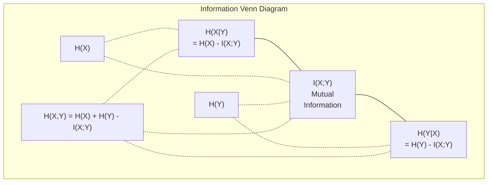

# 信息论

> 信息论衡量惊讶程度，损失函数就建立在它的基础之上。

**Type:** Learn
**Language:** Python
**Prerequisites:** 阶段 1，第 06 课（概率）
**Time:** ~60 分钟

## 学习目标

- 从零计算熵、交叉熵和 KL 散度，并解释它们之间的关系
- 推导最小化交叉熵损失为何等价于最大化对数似然
- 计算特征与目标之间的互信息，用于对特征重要性排序
- 将困惑度解释为语言模型进行选择时的有效词表大小

## 要解决的问题

你训练的每个分类模型都会调用 `CrossEntropyLoss()`。每篇语言模型论文里都能看到“困惑度（perplexity）”。在变分自编码器（VAEs）、蒸馏和基于人类反馈的强化学习（RLHF）中，你又会读到 KL 散度（Kullback–Leibler divergence）。这些概念并非互不相干，而是同一个思想的不同表现形式。

信息论为你提供了一套讨论不确定性、压缩和预测的语言。Claude Shannon 在 1948 年创立了信息论，用来解决通信问题。事实表明，训练神经网络也是一个通信问题：模型试图通过由学得的权重构成的含噪信道，传递正确的标签。

本课将从头构建每一个公式，让你理解它们从何而来，以及为什么有效。

## 核心概念

### 信息量（惊讶程度）

不太可能发生的事情一旦发生，就会带来更多信息。抛硬币得到正面？不足为奇。买彩票中奖？那就很令人惊讶了。

概率为 p 的事件，其信息量（information content）为：

```text
I(x) = -log(p(x))
```

使用以 2 为底的对数，得到的单位是比特（bits）；使用自然对数，得到的单位是奈特（nats）。概念相同，只是单位不同。

```text
Event              Probability    Surprise (bits)
Fair coin heads    0.5            1.0
Rolling a 6        0.167          2.58
1-in-1000 event    0.001          9.97
Certain event      1.0            0.0
```

必然发生的事件不携带信息，因为你早就知道它会发生。

### 熵（平均惊讶程度）

熵（entropy）是一个分布所有可能结果的惊讶程度的期望。

```text
H(P) = -sum( p(x) * log(p(x)) )  for all x
```

对于二元变量，公平硬币的熵最大，为 1 bit。有偏硬币（正面概率为 99%）的熵很低，为 0.08 bits。你已经知道接下来会发生什么，因此每次抛掷几乎都不会带来新的信息。

```text
Fair coin:    H = -(0.5 * log2(0.5) + 0.5 * log2(0.5)) = 1.0 bit
Biased coin:  H = -(0.99 * log2(0.99) + 0.01 * log2(0.01)) = 0.08 bits
```

熵衡量一个分布中无法消除的不确定性。压缩无法突破这个下限。

### 交叉熵（你每天都在用的损失函数）

交叉熵（cross-entropy）衡量的是：当事件实际来自分布 P，而你用分布 Q 来编码时，平均会有多大程度的惊讶。

```text
H(P, Q) = -sum( p(x) * log(q(x)) )  for all x
```

P 是真实分布（标签），Q 是模型的预测。如果 Q 与 P 完全一致，交叉熵就等于熵。只要两者不一致，交叉熵就会更大。

在分类中，P 是 one-hot（独热）向量：真实类别的概率为 1，其余类别均为 0。这样，交叉熵就简化为：

```text
H(P, Q) = -log(q(true_class))
```

这就是分类任务中交叉熵损失的完整公式：让模型对正确类别给出的预测概率尽可能大。

### KL 散度（分布之间的距离）

KL 散度衡量的是：用 Q 代替 P 时，会额外带来多少惊讶。

```text
D_KL(P || Q) = sum( p(x) * log(p(x) / q(x)) )  for all x
             = H(P, Q) - H(P)
```

交叉熵等于熵加上 KL 散度。由于真实分布的熵在训练期间保持不变，最小化交叉熵就等同于最小化 KL 散度。你是在推动模型分布靠近真实分布。

KL 散度不对称：D_KL(P || Q) != D_KL(Q || P)。它并不是真正的距离度量。

### 互信息

互信息（mutual information，MI）衡量的是：知道一个变量，能让你对另一个变量多了解多少。

```text
I(X; Y) = H(X) - H(X|Y)
        = H(X) + H(Y) - H(X, Y)
```

如果 X 和 Y 相互独立，互信息就为零。知道其中一个变量，并不能让你了解另一个变量。如果两者完全相关，互信息就等于任一变量的熵。

在特征选择中，特征与目标之间的互信息高，意味着这个特征有用；互信息低，则意味着它是噪声。

### 条件熵

H(Y|X) 衡量的是：观测 X 之后，Y 还剩下多少不确定性。

```text
H(Y|X) = H(X,Y) - H(X)
```

有两种极端情况：
- 如果 X 完全决定 Y，那么 H(Y|X) = 0。知道 X 就消除了关于 Y 的全部不确定性。例如，X = 摄氏温度，Y = 华氏温度。
- 如果 X 没有提供任何关于 Y 的信息，那么 H(Y|X) = H(Y)。知道 X 并不会减少你对 Y 的不确定性。例如，X = 抛硬币的结果，Y = 明天的天气。

条件熵总是非负的，并且不会超过 H(Y)：

```text
0 <= H(Y|X) <= H(Y)
```

在机器学习中，决策树会用到条件熵。每次分裂时，算法都选择使 H(Y|X) 最小的特征 X，也就是能够最大程度消除标签 Y 的不确定性的特征。

### 联合熵

H(X,Y) 是 X 和 Y 的联合分布的熵。

```text
H(X,Y) = -sum sum p(x,y) * log(p(x,y))   for all x, y
```

一个重要性质：

```text
H(X,Y) <= H(X) + H(Y)
```

当 X 和 Y 相互独立时，等号成立。如果它们共享信息，联合熵就小于各自熵的总和。“少掉”的那部分熵，恰好就是互信息。



这些量之间的关系如下：
- H(X,Y) = H(X) + H(Y|X) = H(Y) + H(X|Y)
- I(X;Y) = H(X) - H(X|Y) = H(Y) - H(Y|X)
- H(X,Y) = H(X) + H(Y) - I(X;Y)

### 互信息（深入理解）

互信息 I(X;Y) 量化了知道一个变量后，另一个变量的不确定性减少了多少。

```text
I(X;Y) = H(X) - H(X|Y)
       = H(Y) - H(Y|X)
       = H(X) + H(Y) - H(X,Y)
       = sum sum p(x,y) * log(p(x,y) / (p(x) * p(y)))
```

性质：
- I(X;Y) >= 0 总是成立。观测某个事物不会让你损失信息。
- I(X;Y) = 0 当且仅当 X 和 Y 相互独立。
- I(X;Y) = I(Y;X)。它具有对称性，这一点与 KL 散度不同。
- I(X;X) = H(X)。一个变量与自身共享全部信息。

**用互信息进行特征选择。** 在机器学习（ML）中，你希望特征能够提供有关目标的信息。互信息提供了一种有理论依据的特征排序方法：

1. 对每个特征 X_i，计算 I(X_i; Y)，其中 Y 是目标变量。
2. 按 MI 得分对特征排序。
3. 保留排名前 k 的特征。

这种方法适用于特征与目标之间的任何关系，无论是线性、非线性、单调还是非单调。相关系数只能捕捉线性关系，而 MI 能捕捉所有关系。

| 方法 | 能检测的关系 | 计算成本 | 能处理类别变量吗？ |
|--------|---------|-------------------|---------------------|
| Pearson 相关系数 | 线性关系 | O(n) | 不能 |
| Spearman 相关系数 | 单调关系 | O(n log n) | 不能 |
| 互信息 | 任意统计依赖关系 | 使用分箱（binning）时为 O(n log n) | 能 |

### 标签平滑与交叉熵

标准分类使用硬目标：[0, 0, 1, 0]。真实类别的概率为 1，其余类别均为 0。标签平滑（label smoothing）将它们替换为软目标：

```text
soft_target = (1 - epsilon) * hard_target + epsilon / num_classes
```

当 epsilon = 0.1 且有 4 个类别时：
- 硬目标：[0, 0, 1, 0]
- 软目标：[0.025, 0.025, 0.925, 0.025]

从信息论的角度看，标签平滑增加了目标分布的熵。硬 one-hot 目标的熵为 0，没有任何不确定性；软目标的熵则为正。

这样做为什么有帮助：
- 防止模型将 logits（未归一化分数）推向极端值：在交叉熵下，要完美匹配 one-hot 目标，需要无穷大的 logits
- 起到正则化作用：模型无法达到 100% 的置信度
- 改善校准（calibration）：预测概率能更好地反映真实的不确定性
- 缩小训练与推理时的行为差距

使用标签平滑后，交叉熵损失变为：

```text
L = (1 - epsilon) * CE(hard_target, prediction) + epsilon * H_uniform(prediction)
```

第二项惩罚偏离均匀分布较远的预测，直接对置信度施加正则化。

### 为什么交叉熵是分类损失的首选

从三个角度看，会得到同一个结论。

**信息论视角。** 交叉熵衡量的是：使用模型分布而非真实分布时，会浪费多少 bits。最小化交叉熵，会让模型成为对现实最有效率的编码器。

**最大似然视角。** 对于 N 个训练样本，其真实类别为 y_i：

```text
Likelihood     = product( q(y_i) )
Log-likelihood = sum( log(q(y_i)) )
Negative log-likelihood = -sum( log(q(y_i)) )
```

最后一行就是交叉熵损失。最小化交叉熵 = 最大化训练数据在模型下的似然。

**梯度视角。** 交叉熵对 logits 的梯度就是 (predicted - true)，即预测值减去真实值。它简洁、稳定，而且计算速度快，这就是交叉熵与 softmax 配合得如此好的原因。

### 比特与奈特（bits 与 nats）

两者唯一的区别是对数的底。

```text
log base 2   -> bits      (information theory tradition)
log base e   -> nats      (machine learning convention)
log base 10  -> hartleys  (rarely used)
```

1 nat = 1/ln(2) bits = 1.4427 bits。PyTorch 和 TensorFlow 默认使用自然对数，单位是 nats。

### 困惑度

困惑度是对交叉熵取指数所得的值。它表示模型拿不准该选哪一个时，所面对的等概率选项的有效数量。

```text
Perplexity = 2^H(P,Q)   (if using bits)
Perplexity = e^H(P,Q)   (if using nats)
```

困惑度为 50 的语言模型，其平均困惑程度，相当于必须从 50 个可能的下一个 token（词元）中均匀选择。困惑度越低越好。

GPT-2 在常见基准测试中的困惑度为 ~30。对于训练数据充分覆盖的领域，现代模型的困惑度已降到个位数。

```figure
entropy-kl
```

## 动手实现

### 第 1 步：信息量与熵

```python
import math

def information_content(p, base=2):
    if p <= 0 or p > 1:
        return float('inf') if p <= 0 else 0.0
    return -math.log(p) / math.log(base)

def entropy(probs, base=2):
    return sum(
        p * information_content(p, base)
        for p in probs if p > 0
    )

fair_coin = [0.5, 0.5]
biased_coin = [0.99, 0.01]
fair_die = [1/6] * 6

print(f"Fair coin entropy:   {entropy(fair_coin):.4f} bits")
print(f"Biased coin entropy: {entropy(biased_coin):.4f} bits")
print(f"Fair die entropy:    {entropy(fair_die):.4f} bits")
```

### 第 2 步：交叉熵与 KL 散度

```python
def cross_entropy(p, q, base=2):
    total = 0.0
    for pi, qi in zip(p, q):
        if pi > 0:
            if qi <= 0:
                return float('inf')
            total += pi * (-math.log(qi) / math.log(base))
    return total

def kl_divergence(p, q, base=2):
    return cross_entropy(p, q, base) - entropy(p, base)

true_dist = [0.7, 0.2, 0.1]
good_model = [0.6, 0.25, 0.15]
bad_model = [0.1, 0.1, 0.8]

print(f"Entropy of true dist:     {entropy(true_dist):.4f} bits")
print(f"CE (good model):          {cross_entropy(true_dist, good_model):.4f} bits")
print(f"CE (bad model):           {cross_entropy(true_dist, bad_model):.4f} bits")
print(f"KL divergence (good):     {kl_divergence(true_dist, good_model):.4f} bits")
print(f"KL divergence (bad):      {kl_divergence(true_dist, bad_model):.4f} bits")
```

### 第 3 步：用交叉熵作为分类损失

```python
def softmax(logits):
    max_logit = max(logits)
    exps = [math.exp(z - max_logit) for z in logits]
    total = sum(exps)
    return [e / total for e in exps]

def cross_entropy_loss(true_class, logits):
    probs = softmax(logits)
    return -math.log(probs[true_class])

logits = [2.0, 1.0, 0.1]
true_class = 0

probs = softmax(logits)
loss = cross_entropy_loss(true_class, logits)

print(f"Logits:      {logits}")
print(f"Softmax:     {[f'{p:.4f}' for p in probs]}")
print(f"True class:  {true_class}")
print(f"Loss:        {loss:.4f} nats")
print(f"Perplexity:  {math.exp(loss):.2f}")
```

### 第 4 步：交叉熵等于负对数似然

```python
import random

random.seed(42)

n_samples = 1000
n_classes = 3
true_labels = [random.randint(0, n_classes - 1) for _ in range(n_samples)]
model_logits = [[random.gauss(0, 1) for _ in range(n_classes)] for _ in range(n_samples)]

ce_loss = sum(
    cross_entropy_loss(label, logits)
    for label, logits in zip(true_labels, model_logits)
) / n_samples

nll = -sum(
    math.log(softmax(logits)[label])
    for label, logits in zip(true_labels, model_logits)
) / n_samples

print(f"Cross-entropy loss:      {ce_loss:.6f}")
print(f"Negative log-likelihood: {nll:.6f}")
print(f"Difference:              {abs(ce_loss - nll):.2e}")
```

### 第 5 步：互信息

```python
def mutual_information(joint_probs, base=2):
    rows = len(joint_probs)
    cols = len(joint_probs[0])

    margin_x = [sum(joint_probs[i][j] for j in range(cols)) for i in range(rows)]
    margin_y = [sum(joint_probs[i][j] for i in range(rows)) for j in range(cols)]

    mi = 0.0
    for i in range(rows):
        for j in range(cols):
            pxy = joint_probs[i][j]
            if pxy > 0:
                mi += pxy * math.log(pxy / (margin_x[i] * margin_y[j])) / math.log(base)
    return mi

independent = [[0.25, 0.25], [0.25, 0.25]]
dependent = [[0.45, 0.05], [0.05, 0.45]]

print(f"MI (independent): {mutual_information(independent):.4f} bits")
print(f"MI (dependent):   {mutual_information(dependent):.4f} bits")
```

## 实际使用

用 NumPy 实现相同的概念，这也是你在实际工作中会采用的方式：

```python
import numpy as np

def np_entropy(p):
    p = np.asarray(p, dtype=float)
    mask = p > 0
    result = np.zeros_like(p)
    result[mask] = p[mask] * np.log(p[mask])
    return -result.sum()

def np_cross_entropy(p, q):
    p, q = np.asarray(p, dtype=float), np.asarray(q, dtype=float)
    mask = p > 0
    return -(p[mask] * np.log(q[mask])).sum()

def np_kl_divergence(p, q):
    return np_cross_entropy(p, q) - np_entropy(p)

true = np.array([0.7, 0.2, 0.1])
pred = np.array([0.6, 0.25, 0.15])
print(f"Entropy:    {np_entropy(true):.4f} nats")
print(f"Cross-ent:  {np_cross_entropy(true, pred):.4f} nats")
print(f"KL div:     {np_kl_divergence(true, pred):.4f} nats")
```

你已经从零实现了 `torch.nn.CrossEntropyLoss()` 内部所做的计算。现在，你知道训练时损失为什么会下降了：模型的预测分布正在靠近真实分布，这种差异用浪费的信息量来衡量，单位是 nats。

## 练习

1. 假设英文字母服从均匀分布（26 个字母），计算其熵。然后用实际字母频率估计熵。哪一个更高？为什么？

2. 对于真实类别为 1 的样本，模型输出的 logits 为 [5.0, 2.0, 0.5]。手算交叉熵损失，然后用你的 `cross_entropy_loss` 函数验证。什么样的 logits 会使损失为零？

3. 说明 KL 散度不对称。选取两个分布 P 和 Q，计算 D_KL(P || Q) 与 D_KL(Q || P)，并解释两者为什么不同。

4. 编写一个函数，计算一串 token 预测的困惑度。给定由 (true_token_index, predicted_logits) 对组成的列表，返回该序列的困惑度。

## 关键术语

| 术语 | 常见说法 | 实际含义 |
|------|----------------|----------------------|
| 信息量 | “惊讶程度” | 编码一个事件所需的 bits（或 nats）数：-log(p) |
| 熵 | “随机性” | 一个分布所有结果的平均惊讶程度，衡量无法消除的不确定性。 |
| 交叉熵 | “损失函数” | 用模型分布 Q 对来自真实分布 P 的事件进行编码时的平均惊讶程度。 |
| KL 散度 | “分布之间的距离” | 用 Q 代替 P 时额外浪费的 bits 数，等于交叉熵减去熵，不对称。 |
| 互信息 | “X 和 Y 有多大关联” | 知道 Y 后，X 的不确定性减少的量。为零意味着相互独立。 |
| Softmax | “把 logits 变成概率” | 先取指数，再归一化，将任意实数向量映射为有效的概率分布。 |
| 困惑度 | “模型有多困惑” | 对交叉熵取指数所得的值，表示模型在每一步进行选择时的有效词表大小。 |
| 比特（Bits） | “Shannon 的单位” | 使用以 2 为底的对数衡量的信息量。一个 bit 能消除抛掷一次公平硬币的不确定性。 |
| 奈特（Nats） | “ML 的单位” | 使用自然对数衡量的信息量，是 PyTorch 和 TensorFlow 默认使用的单位。 |
| 负对数似然（NLL） | “NLL 损失” | 对于 one-hot 标签，与交叉熵损失相同。将其最小化，就能最大化正确预测的概率。 |

## 延伸阅读

- [Shannon 1948：《通信的数学理论》](https://people.math.harvard.edu/~ctm/home/text/others/shannon/entropy/entropy.pdf) - 开创信息论的原始论文，至今读来仍不难理解
- [信息论图解（Chris Olah）](https://colah.github.io/posts/2015-09-Visual-Information/) - 关于熵和 KL 散度的最佳可视化讲解
- [PyTorch CrossEntropyLoss 文档](https://pytorch.org/docs/stable/generated/torch.nn.CrossEntropyLoss.html) - 了解框架如何实现你刚刚手写的计算
