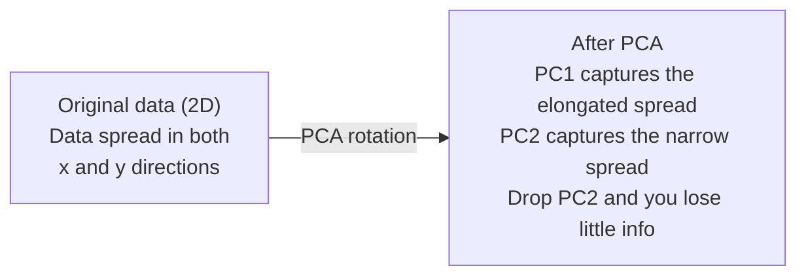

# 降维

> 高维数据自有其结构。找对观察角度，就能发现它。

**Type:** Build
**Language:** Python
**Prerequisites:** 阶段 1，第 01 课（线性代数直觉）、02 课（向量、矩阵与运算）、03 课（特征值与特征向量）、06 课（概率与分布）
**Time:** ~90 分钟

## 学习目标

- 从零实现主成分分析（PCA）：对数据进行中心化、计算协方差矩阵（covariance matrix）、进行特征分解（eigendecomposition），再做投影（projection）
- 运用方差解释率（explained variance ratio）和肘部法（elbow method）选择主成分的数量
- 比较 PCA、t-SNE 和 UMAP 在 MNIST 手写数字 2D 可视化中的表现，并解释各自的取舍
- 使用径向基函数（RBF）核的核 PCA，分离标准 PCA 无法处理的非线性数据结构

## 要解决的问题

你有一个数据集，每个样本有 784 个特征。这些特征可能是手写数字的像素值，也可能是基因表达水平，或是用户行为信号。你无法将 784 维可视化，无法画出来，你甚至无法在脑海中想象。

但这 784 个特征大多是冗余的。真正的信息位于一个小得多的曲面上。描述一个手写的“7”，并不需要 784 个相互独立的数，只需要几个：笔画的角度、横线的长度，以及倾斜程度。其余都是噪声。

降维（dimensionality reduction）就是寻找这个更小的曲面。它将你的 784 维数据压缩到 2、10 或 50 维，同时保留重要的结构。

## 核心概念

### 维数灾难（curse of dimensionality）

高维空间不符合直觉。随着维数增加，以下三个方面会出现问题。

**距离变得没有意义。** 在高维空间中，任意两个随机点之间的距离都会趋向同一个值。如果每个点到其他各点的距离都差不多，最近邻搜索就失去了作用。

```text
Dimension    Avg distance ratio (max/min between random points)
2            ~5.0
10           ~1.8
100          ~1.2
1000         ~1.02
```

**体积集中在角落。** d 维单位超立方体有 2^d 个顶点。在 100 维空间中，几乎全部体积都集中在远离中心的角落。数据点散布到边缘，模型在内部区域却缺乏数据。

**所需数据量呈指数增长。** 为了在空间中维持相同的样本密度，从 2D 增加到 20D 意味着所需数据量变为原来的 10^18 倍。数据永远不够用。降低维数可以让数据密度回到可用的水平。

### PCA：找到重要的方向

主成分分析（Principal Component Analysis，PCA）寻找数据变化最大的坐标轴方向。它旋转坐标系，使第一条轴捕获最多的方差，第二条轴捕获次多的方差，以此类推。

算法步骤：

```text
1. Center the data        (subtract the mean from each feature)
2. Compute covariance     (how features move together)
3. Eigendecomposition     (find the principal directions)
4. Sort by eigenvalue     (biggest variance first)
5. Project               (keep top k eigenvectors, drop the rest)
```

为什么要做特征分解？因为协方差矩阵是对称且半正定（positive semi-definite）的。它的特征向量（eigenvector）对应特征空间中的正交方向。特征值（eigenvalue）告诉你每个方向捕获了多少方差。最大特征值对应的特征向量，指向方差最大的方向。



- **PCA 之前：** 数据点云沿斜向展开，同时跨越 x 轴和 y 轴方向
- **PCA 之后：** 旋转坐标系，使 PC1 与方差最大的方向（延展较长的方向）对齐，PC2 与方差最小的方向（延展较窄的方向）对齐
- **降维：** 舍弃 PC2，把数据投影到 PC1 上，只损失很少的信息

### 方差解释率

每个主成分都捕获了总方差的一部分。方差解释率告诉你这一部分占多大比例。

```text
Component    Eigenvalue    Explained ratio    Cumulative
PC1          4.73          0.473              0.473
PC2          2.51          0.251              0.724
PC3          1.12          0.112              0.836
PC4          0.89          0.089              0.925
...
```

当累计解释方差达到 0.95 时，你就知道，保留到这里的这些主成分捕获了 95% 的信息。再往后的成分大多是噪声。

### 选择主成分的数量

有三种策略：

1. **阈值法。** 保留足够多的主成分，使其能解释 90-95% 的方差。
2. **肘部法。** 绘制各主成分解释的方差，寻找曲线急剧下降的位置。
3. **下游任务表现。** 将 PCA 用作预处理。遍历不同的 k 值，并测量模型的准确率。准确率进入平台期时对应的 k，就是最佳选择。

### t-SNE：保留邻域关系

t-SNE（t 分布随机邻域嵌入，t-Distributed Stochastic Neighbor Embedding）专为可视化而设计。它将高维数据映射到 2D（或 3D），同时保留哪些点彼此相近的关系。

其直觉是：在原始空间中，根据点与点之间的距离，计算点对上的概率分布。相近的点对概率高，相距较远的点对概率低。然后寻找一种 2D 排布，使同样的概率分布在其中成立。在 784 维空间中互为邻居的点，在 2D 中仍然互为邻居。

t-SNE 的主要特性：
- 非线性。它能展开 PCA 无法展开的复杂流形（manifold）。
- 随机性。不同次运行会产生不同的布局。
- 困惑度（perplexity）参数控制要考虑多少个邻居（典型范围：5-50）。
- 输出中各簇之间的距离没有意义，只有簇本身有意义。
- 处理大型数据集较慢。默认复杂度为 O(n^2)。

### UMAP：速度更快，更好地保留全局结构

UMAP（均匀流形近似与投影，Uniform Manifold Approximation and Projection）的工作方式与 t-SNE 类似，但有两个优势：
- 速度更快。它使用近似最近邻图，而不计算所有点对之间的距离。
- 全局结构保留得更好。与 t-SNE 相比，输出中各簇的相对位置往往更有意义。

UMAP 在高维空间中构建一个加权图（即“模糊拓扑表示”），然后寻找尽可能保留这个图的低维布局。

关键参数：
- `n_neighbors`：用多少个邻居来定义局部结构（类似于困惑度）。取值越大，保留的全局结构越多。
- `min_dist`：输出中点聚集得有多紧密。取值越小，生成的簇越密集。

### 何时选择哪种方法

| 方法 | 使用场景 | 保留的内容 | 速度 |
|--------|----------|-----------|-------|
| PCA | 训练前的预处理 | 全局方差 | 快（精确计算），适用于 millions（百万级）样本 |
| PCA | 快速探索性可视化 | 线性结构 | 快 |
| t-SNE | 达到发表质量的 2D 图 | 局部邻域 | 慢（样本数 < 10k 较理想） |
| UMAP | 大规模 2D 可视化 | 局部 + 部分全局结构 | 中等（可处理 millions（百万级）样本） |
| PCA | 为模型减少特征 | 按方差排序的特征 | 快 |
| t-SNE / UMAP | 理解簇结构 | 簇的分离关系 | 中等到慢 |

经验法则：预处理和数据压缩用 PCA。需要在 2D 中可视化数据结构时，用 t-SNE 或 UMAP。

### 核 PCA

标准 PCA 寻找线性子空间。它旋转坐标系，再舍弃一些坐标轴。但如果数据位于非线性流形上呢？2D 中的圆无法用任何一条直线分开。标准 PCA 对此无能为力。

核 PCA（kernel PCA）在核函数诱导的高维特征空间中进行 PCA，无需显式计算该空间中的坐标。这就是核技巧（kernel trick），也是 SVM（支持向量机）背后的同一种思想。

算法步骤：
1. 计算核矩阵 K，其中 K_ij = k(x_i, x_j)
2. 在特征空间中对核矩阵进行中心化
3. 对中心化后的核矩阵进行特征分解
4. 排在前面的特征向量（按 1/sqrt(eigenvalue) 缩放）就是投影结果

常见核函数：

| 核函数 | 公式 | 适用场景 |
|--------|---------|----------|
| RBF（Gaussian，高斯核） | exp(-gamma * \|\|x - y\|\|^2) | 大多数非线性数据、光滑流形 |
| 多项式核 | (x . y + c)^d | 多项式关系 |
| Sigmoid 核 | tanh(alpha * x . y + c) | 类似神经网络的映射 |

核 PCA 与标准 PCA 的选择：

| 比较维度 | 标准 PCA | 核 PCA |
|-----------|-------------|------------|
| 数据结构 | 线性子空间 | 非线性流形 |
| 速度 | O(min(n^2 d, d^2 n)) | O(n^2 d + n^3) |
| 可解释性 | 主成分是特征的线性组合 | 主成分无法直接用原始特征来解释 |
| 可扩展性 | 适用于 millions（百万级）样本 | 核矩阵为 n x n，受内存限制 |
| 重构 | 可直接进行逆变换 | 需要对原像（pre-image）进行近似 |

经典例子是 2D 中的同心圆：两圈点，一圈在内，一圈在外。标准 PCA 把它们都投影到同一条直线上，对分类毫无帮助。采用 RBF 核的核 PCA 将内圈和外圈映射到不同区域，使它们线性可分。

### 重构误差

你的降维效果如何？将 784 维压缩到 50 维后，丢失了什么？

测量重构误差：
1. 将数据投影到 k 维：X_reduced = X @ W_k
2. 重构：X_hat = X_reduced @ W_k^T
3. 计算均方误差（MSE）：mean((X - X_hat)^2)

对 PCA 而言，重构误差与解释方差之间有一个简洁的关系：

```text
Reconstruction error = sum of eigenvalues NOT included
Total variance = sum of ALL eigenvalues
Fraction lost = (sum of dropped eigenvalues) / (sum of all eigenvalues)
```

每个主成分的方差解释率为：

```text
explained_ratio_k = eigenvalue_k / sum(all eigenvalues)
```

以主成分数量为横轴、累计解释方差为纵轴绘图，就能得到“肘部”曲线。合适的主成分数量对应以下位置：
- 曲线趋于平缓（收益递减）
- 累计方差越过你设定的阈值（通常为 0.90 或 0.95）
- 下游任务表现进入平台期

重构误差的用途不止是选择 k。你还可以用它检测异常：重构误差大的样本是离群点，不符合已经学到的子空间。这就是生产系统中基于 PCA 的异常检测的基础。

```figure
pca-axes
```

## 动手实现

### 步骤 1：从零实现 PCA

```python
import numpy as np

class PCA:
    def __init__(self, n_components):
        self.n_components = n_components
        self.components = None
        self.mean = None
        self.eigenvalues = None
        self.explained_variance_ratio_ = None

    def fit(self, X):
        self.mean = np.mean(X, axis=0)
        X_centered = X - self.mean

        cov_matrix = np.cov(X_centered, rowvar=False)

        eigenvalues, eigenvectors = np.linalg.eigh(cov_matrix)

        sorted_idx = np.argsort(eigenvalues)[::-1]
        eigenvalues = eigenvalues[sorted_idx]
        eigenvectors = eigenvectors[:, sorted_idx]

        self.components = eigenvectors[:, :self.n_components].T
        self.eigenvalues = eigenvalues[:self.n_components]
        total_var = np.sum(eigenvalues)
        self.explained_variance_ratio_ = self.eigenvalues / total_var

        return self

    def transform(self, X):
        X_centered = X - self.mean
        return X_centered @ self.components.T

    def fit_transform(self, X):
        self.fit(X)
        return self.transform(X)
```

### 步骤 2：在合成数据上测试

```python
np.random.seed(42)
n_samples = 500

t = np.random.uniform(0, 2 * np.pi, n_samples)
x1 = 3 * np.cos(t) + np.random.normal(0, 0.2, n_samples)
x2 = 3 * np.sin(t) + np.random.normal(0, 0.2, n_samples)
x3 = 0.5 * x1 + 0.3 * x2 + np.random.normal(0, 0.1, n_samples)

X_synthetic = np.column_stack([x1, x2, x3])

pca = PCA(n_components=2)
X_reduced = pca.fit_transform(X_synthetic)

print(f"Original shape: {X_synthetic.shape}")
print(f"Reduced shape:  {X_reduced.shape}")
print(f"Explained variance ratios: {pca.explained_variance_ratio_}")
print(f"Total variance captured: {sum(pca.explained_variance_ratio_):.4f}")
```

### 步骤 3：将 MNIST 手写数字降到 2D

```python
from sklearn.datasets import fetch_openml

mnist = fetch_openml("mnist_784", version=1, as_frame=False, parser="auto")
X_mnist = mnist.data[:5000].astype(float)
y_mnist = mnist.target[:5000].astype(int)

pca_mnist = PCA(n_components=50)
X_pca50 = pca_mnist.fit_transform(X_mnist)
print(f"50 components capture {sum(pca_mnist.explained_variance_ratio_):.2%} of variance")

pca_2d = PCA(n_components=2)
X_pca2d = pca_2d.fit_transform(X_mnist)
print(f"2 components capture {sum(pca_2d.explained_variance_ratio_):.2%} of variance")
```

### 步骤 4：与 sklearn 比较

```python
from sklearn.decomposition import PCA as SklearnPCA
from sklearn.manifold import TSNE

sklearn_pca = SklearnPCA(n_components=2)
X_sklearn_pca = sklearn_pca.fit_transform(X_mnist)

print(f"\nOur PCA explained variance:     {pca_2d.explained_variance_ratio_}")
print(f"Sklearn PCA explained variance: {sklearn_pca.explained_variance_ratio_}")

diff = np.abs(np.abs(X_pca2d) - np.abs(X_sklearn_pca))
print(f"Max absolute difference: {diff.max():.10f}")

tsne = TSNE(n_components=2, perplexity=30, random_state=42)
X_tsne = tsne.fit_transform(X_mnist)
print(f"\nt-SNE output shape: {X_tsne.shape}")
```

### 步骤 5：与 UMAP 比较

```python
try:
    from umap import UMAP

    reducer = UMAP(n_components=2, n_neighbors=15, min_dist=0.1, random_state=42)
    X_umap = reducer.fit_transform(X_mnist)
    print(f"UMAP output shape: {X_umap.shape}")
except ImportError:
    print("Install umap-learn: pip install umap-learn")
```

## 实际使用

在分类器之前使用 PCA 进行预处理：

```python
from sklearn.decomposition import PCA as SklearnPCA
from sklearn.linear_model import LogisticRegression
from sklearn.model_selection import train_test_split
from sklearn.metrics import accuracy_score

X_train, X_test, y_train, y_test = train_test_split(
    X_mnist, y_mnist, test_size=0.2, random_state=42
)

results = {}
for k in [10, 30, 50, 100, 200]:
    pca_k = SklearnPCA(n_components=k)
    X_tr = pca_k.fit_transform(X_train)
    X_te = pca_k.transform(X_test)

    clf = LogisticRegression(max_iter=1000, random_state=42)
    clf.fit(X_tr, y_train)
    acc = accuracy_score(y_test, clf.predict(X_te))
    var_captured = sum(pca_k.explained_variance_ratio_)
    results[k] = (acc, var_captured)
    print(f"k={k:>3d}  accuracy={acc:.4f}  variance={var_captured:.4f}")
```

维数还远未达到 784 时，模型表现就会进入平台期。这个平台期就是你选择维数的依据。

## 交付成果

本课产出：
- `outputs/skill-dimensionality-reduction.md` - 一个根据具体任务选择合适降维技术的技能

## 练习

1. 修改 PCA 类，使其支持 `inverse_transform`。分别用 10、50 和 200 个主成分重构 MNIST 手写数字，并打印各自的重构误差（与原始数据之差的平方的均值）。

2. 在同一个 MNIST 子集上运行 t-SNE，将困惑度分别设为 5、30 和 100。描述输出如何变化。为什么困惑度会影响簇的紧密程度？

3. 准备一个包含 50 个特征、其中只有 5 个特征提供有效信息的数据集（用 `sklearn.datasets.make_classification` 生成）。应用 PCA，检查解释方差曲线能否正确识别出该数据实际上是 5 维的。

## 关键术语

| 术语 | 常见说法 | 实际含义 |
|------|----------------|----------------------|
| 维数灾难 | “特征太多” | 随着维数增加，距离、体积和数据密度的表现都与直觉相悖。模型需要呈指数增长的数据量来弥补。 |
| PCA | “减少维数” | 旋转坐标系，使坐标轴与方差最大的方向对齐，再舍弃方差较小的轴。 |
| 主成分 | “一个重要的方向” | 协方差矩阵的一个特征向量。特征空间中数据变化最大的方向。 |
| 方差解释率 | “这个主成分含有多少信息” | 单个主成分捕获的方差占总方差的比例。将前 k 个比例相加，就能知道 k 个主成分保留了多少方差。 |
| 协方差矩阵 | “特征之间如何相关” | 一个对称矩阵，其中元素 (i,j) 衡量特征 i 与特征 j 如何共同变化。对角线上的元素是各特征自身的方差。 |
| t-SNE | “那种聚类图” | 一种通过保留点对邻域概率，将高维数据映射到 2D 的非线性方法。适合可视化，不适合预处理。 |
| UMAP | “更快的 t-SNE” | 一种基于拓扑数据分析的非线性方法，同时保留局部结构和部分全局结构。处理大规模数据的能力优于 t-SNE。 |
| 困惑度 | “t-SNE 的一个调节旋钮” | 控制每个点所考虑的有效邻居数量。低困惑度关注非常局部的结构，高困惑度捕获更大范围的模式。 |
| 流形 | “数据所在的曲面” | 嵌入高维空间中的低维曲面。在 3D 空间中揉皱的一张纸，就是一个 2D 流形。 |

## 延伸阅读

- [A Tutorial on Principal Component Analysis](https://arxiv.org/abs/1404.1100)（Shlens）- 从基础出发，清晰推导 PCA
- [How to Use t-SNE Effectively](https://distill.pub/2016/misread-tsne/)（Wattenberg 等）- 介绍 t-SNE 常见误区与参数选择的交互式指南
- [UMAP 文档](https://umap-learn.readthedocs.io/) - UMAP 作者提供的理论与实践指导
