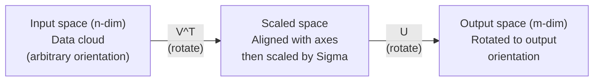
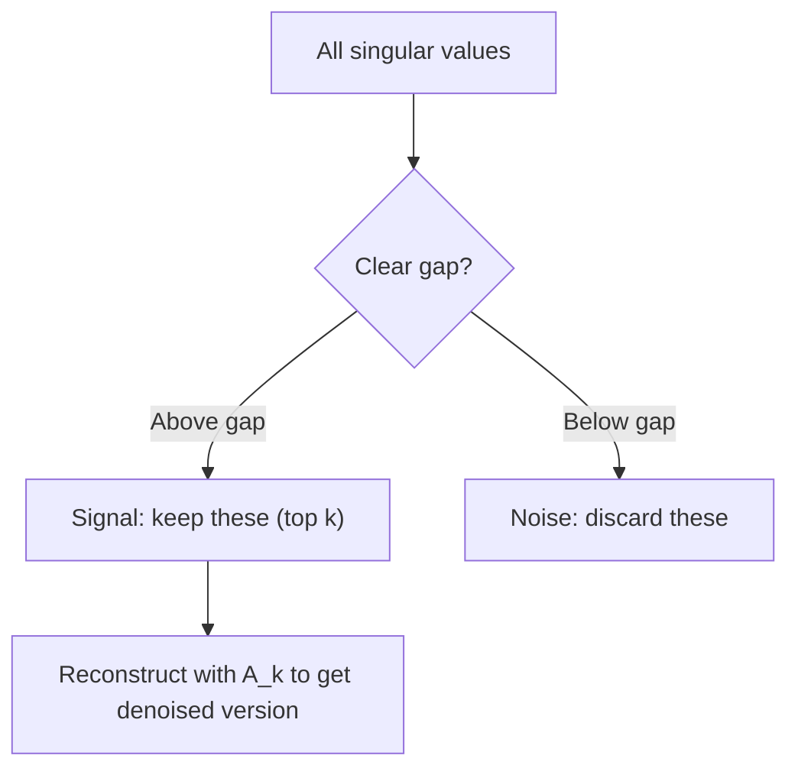

# 奇异值分解

> 奇异值分解（SVD）是线性代数中的瑞士军刀。每个矩阵都有 SVD，每位数据科学家都需要掌握它。

**Type:** Build
**Languages:** Python, Julia
**Prerequisites:** 阶段 1，第 01 课（线性代数直觉）、第 02 课（向量与矩阵运算）、第 03 课（矩阵变换）
**Time:** ~120 分钟

## 学习目标

- 通过幂迭代实现 SVD，并解释 U、Sigma 和 V^T 的几何意义
- 将截断 SVD 用于图像压缩，并衡量压缩比与重建误差之间的关系
- 通过 SVD 计算 Moore-Penrose 伪逆，以求解超定最小二乘系统
- 将 SVD 与主成分分析（PCA）、推荐系统（潜在因子）以及自然语言处理（NLP）中的潜在语义分析联系起来

## 要解决的问题

你有一个 1000x2000 的矩阵。它可能是用户对电影的评分，也可能是文档与词语的频次表，或者一幅图像的像素值。你需要压缩它、去除噪声、发现隐藏结构，或者用它求解最小二乘系统。特征分解只适用于方阵。即便如此，它也要求矩阵具有一组完整的线性无关特征向量。

SVD 适用于任意矩阵，不限形状、不限秩，无须附加条件。它将矩阵分解为三个因子，揭示矩阵如何变换空间的几何本质。它是整个线性代数中最通用、最有用的分解方式。

## 核心概念

### SVD 的几何作用

每个矩阵，无论形状如何，都依次执行三种操作：旋转、缩放、旋转。SVD 将这种分解明确地表示出来。

```text
A = U * Sigma * V^T

      m x n     m x m    m x n    n x n
     (any)    (rotate)  (scale)  (rotate)
```

给定任意矩阵 A，SVD 将其分解为：
- V^T 旋转输入空间（n 维）中的向量
- Sigma 沿各条轴缩放（拉伸或压缩）
- U 将结果旋转到输出空间（m 维）中



可以这样理解：你把一个矩阵交给 SVD，它告诉你：“这个矩阵对一个球面上的输入，先通过 V^T 进行旋转，再通过 Sigma 将其拉伸为椭球面，最后通过 U 旋转这个椭球面。”奇异值就是椭球各轴的长度。

### 完整分解

对于形状为 m x n 的矩阵 A：

```text
A = U * Sigma * V^T

where:
  U     is m x m, orthogonal (U^T U = I)
  Sigma is m x n, diagonal (singular values on the diagonal)
  V     is n x n, orthogonal (V^T V = I)

The singular values sigma_1 >= sigma_2 >= ... >= sigma_r > 0
where r = rank(A)
```

U 的列称为左奇异向量，V 的列称为右奇异向量，Sigma 的对角元素称为奇异值。奇异值始终非负，通常按降序排列。

### 左奇异向量、奇异值与右奇异向量

SVD 的每个组成部分都有各自明确的几何意义。

**右奇异向量（V 的列）：** 它们构成输入空间 (R^n) 的一组标准正交基。矩阵会将输入空间中的这些方向映射为输出空间中的正交方向。可以把它们看作定义域的自然坐标系。

**奇异值（Sigma 的对角元素）：** 它们是缩放系数。第 i 个奇异值表示，矩阵会将沿第 i 个右奇异向量方向的向量拉伸多少。奇异值为零，意味着矩阵将该方向完全压扁。

**左奇异向量（U 的列）：** 它们构成输出空间 (R^m) 的一组标准正交基。第 i 个左奇异向量是第 i 个右奇异向量在缩放后映射到的输出空间方向。

它们之间的关系为：

```text
A * v_i = sigma_i * u_i

The matrix A takes the i-th right singular vector v_i,
scales it by sigma_i, and maps it to the i-th left singular vector u_i.
```

这样，你就能逐个坐标方向地理解任意矩阵的作用。

### 外积形式

SVD 可以写成若干个秩为 1 的矩阵之和：

```text
A = sigma_1 * u_1 * v_1^T + sigma_2 * u_2 * v_2^T + ... + sigma_r * u_r * v_r^T

Each term sigma_i * u_i * v_i^T is a rank-1 matrix (an outer product).
The full matrix is the sum of r such matrices, where r is the rank.
```

这种形式是低秩近似的基础。每一项都增加一层结构。第一项捕捉最重要的单个模式，第二项捕捉次重要的模式，以此类推。截断这个和式，就能得到任意给定秩下的最佳近似。

```text
Rank-1 approx:    A_1 = sigma_1 * u_1 * v_1^T
                  (captures the dominant pattern)

Rank-2 approx:    A_2 = sigma_1 * u_1 * v_1^T + sigma_2 * u_2 * v_2^T
                  (captures the two most important patterns)

Rank-k approx:    A_k = sum of top k terms
                  (optimal by the Eckart-Young theorem)
```

### 与特征分解的关系

SVD 与特征分解有着深刻的联系。A 的奇异值和奇异向量直接来自 A^T A 与 A A^T 的特征值和特征向量。

```text
A^T A = V * Sigma^T * U^T * U * Sigma * V^T
      = V * Sigma^T * Sigma * V^T
      = V * D * V^T

where D = Sigma^T * Sigma is a diagonal matrix with sigma_i^2 on the diagonal.

So:
- The right singular vectors (V) are eigenvectors of A^T A
- The singular values squared (sigma_i^2) are eigenvalues of A^T A

Similarly:
A A^T = U * Sigma * V^T * V * Sigma^T * U^T
      = U * Sigma * Sigma^T * U^T

So:
- The left singular vectors (U) are eigenvectors of A A^T
- The eigenvalues of A A^T are also sigma_i^2
```

这种联系说明了三点：
1. 奇异值始终是非负实数，因为它们是半正定矩阵特征值的平方根。
2. 你可以通过对 A^T A 做特征分解来计算 SVD，但这会使条件数平方，损失数值精度。专门的 SVD 算法可以避免这个问题。
3. 当 A 是对称半正定方阵时，SVD 与特征分解就是同一回事。

### 截断 SVD：低秩近似

Eckart-Young-Mirsky 定理指出，只保留最大的 k 个奇异值及其对应向量，就能得到 A 的最佳秩 k 近似，对 Frobenius 范数和谱范数都成立：

```text
A_k = U_k * Sigma_k * V_k^T

where:
  U_k     is m x k  (first k columns of U)
  Sigma_k is k x k  (top-left k x k block of Sigma)
  V_k     is n x k  (first k columns of V)

Approximation error = sigma_{k+1}  (in spectral norm)
                    = sqrt(sigma_{k+1}^2 + ... + sigma_r^2)  (in Frobenius norm)
```

这不仅是一个“不错的”近似，而是可以证明的最佳秩 k 近似。没有其他秩为 k 的矩阵能比它更接近 A。

| 分量 | 相对大小 | 是否保留在秩 3 近似中？ |
|-----------|-------------------|------------------------|
| sigma_1 | 最大 | 是 |
| sigma_2 | 大 | 是 |
| sigma_3 | 中等偏大 | 是 |
| sigma_4 | 中等 | 否（计入误差） |
| sigma_5 | 中等偏小 | 否（计入误差） |
| sigma_6 | 小 | 否（计入误差） |
| sigma_7 | 很小 | 否（计入误差） |
| sigma_8 | 极小 | 否（计入误差） |

保留最大的 3 个：A_3 捕捉三个最大的奇异值。误差 = 剩余的值（从 sigma_4 到 sigma_8）。

如果奇异值衰减很快，较小的 k 就能捕捉矩阵的大部分信息。如果它们衰减缓慢，矩阵就不具有低秩结构。

### 用 SVD 压缩图像

灰度图像是由像素强度组成的矩阵。一幅 800x600 的图像包含 480,000 个值。SVD 能让你用少得多的值来近似表示它。

```text
Original image: 800 x 600 = 480,000 values

SVD with rank k:
  U_k:      800 x k values
  Sigma_k:  k values
  V_k:      600 x k values
  Total:    k * (800 + 600 + 1) = k * 1401 values

  k=10:   14,010 values   (2.9% of original)
  k=50:   70,050 values  (14.6% of original)
  k=100: 140,100 values  (29.2% of original)

  The compression ratio improves as k gets smaller,
  but visual quality degrades.
```

关键在于：自然图像的奇异值会迅速衰减。最前面的几个奇异值捕捉整体结构（形状、渐变），后面的奇异值捕捉精细细节和噪声。截断到秩 50，往往就能生成一幅看起来与原图几乎相同的图像，同时减少 85% 的存储量。

### SVD 在推荐系统中的应用

Netflix Prize 让这种方法广为人知。你有一个用户与电影的评分矩阵，其中大多数元素缺失。

```text
             Movie1  Movie2  Movie3  Movie4  Movie5
  User1      [  5      ?       3       ?       1  ]
  User2      [  ?      4       ?       2       ?  ]
  User3      [  3      ?       5       ?       ?  ]
  User4      [  ?      ?       ?       4       3  ]

  ? = unknown rating
```

思路是：这个评分矩阵具有低秩结构。用户的喜好并非完全独立。少量潜在因子（latent factor），例如偏好动作片还是剧情片、老片还是新片、烧脑体验还是感官刺激，就能解释大多数偏好。

对填补后的评分矩阵做 SVD，会将其分解为：
- U：潜在因子空间中的用户画像
- Sigma：每个潜在因子的重要性
- V^T：潜在因子空间中的电影画像

用户对某部电影的预测评分，就是其用户画像与电影画像的点积，并由奇异值加权。低秩近似会填补缺失的元素。

实践中，你会使用 Simon Funk 的增量式 SVD 或 ALS（交替最小二乘）等变体，直接处理缺失数据。但核心思路相同：通过 SVD 进行潜在因子分解。

### SVD 在 NLP 中的应用：潜在语义分析

潜在语义分析（Latent Semantic Analysis，LSA），也称潜在语义索引（Latent Semantic Indexing，LSI），将 SVD 应用于词语与文档构成的矩阵。

```text
             Doc1   Doc2   Doc3   Doc4
  "cat"      [  3      0      1      0  ]
  "dog"      [  2      0      0      1  ]
  "fish"     [  0      4      1      0  ]
  "pet"      [  1      1      1      1  ]
  "ocean"    [  0      3      0      0  ]

After SVD with rank k=2:

  Each document becomes a point in 2D "concept space."
  Each term becomes a point in the same 2D space.
  Documents about similar topics cluster together.
  Terms with similar meanings cluster together.

  "cat" and "dog" end up near each other (land pets).
  "fish" and "ocean" end up near each other (water concepts).
  Doc1 and Doc3 cluster if they share similar topics.
```

LSA 是最早成功从原始文本中捕捉语义相似性的方法之一。它之所以有效，是因为同义词往往出现在相似的文档中，因此 SVD 会将它们归入相同的潜在维度。现代词嵌入（embedding）方法（Word2Vec、GloVe）可以看作这一思路的后继者。

### 用 SVD 降噪

在含噪数据中，信号集中在最大的奇异值中，而噪声分散在所有奇异值中。截断可以去除噪声底。

**无噪声信号的奇异值：**

| 分量 | 大小 | 类型 |
|-----------|-----------|------|
| sigma_1 | 很大 | 信号 |
| sigma_2 | 大 | 信号 |
| sigma_3 | 中等 | 信号 |
| sigma_4 | 接近零 | 可忽略 |
| sigma_5 | 接近零 | 可忽略 |

**含噪信号的奇异值（噪声会影响所有奇异值）：**

| 分量 | 大小 | 类型 |
|-----------|-----------|------|
| sigma_1 | 很大 | 信号 |
| sigma_2 | 大 | 信号 |
| sigma_3 | 中等 | 信号 |
| sigma_4 | 小 | 噪声 |
| sigma_5 | 小 | 噪声 |
| sigma_6 | 小 | 噪声 |
| sigma_7 | 小 | 噪声 |



这种方法用于信号处理、科学测量和数据清洗。只要矩阵受到加性噪声干扰，截断 SVD 就是一种有理论依据的信噪分离方法。

### 通过 SVD 求伪逆

Moore-Penrose 伪逆 A+ 将矩阵求逆推广到非方阵和奇异矩阵。SVD 让它的计算变得非常简单。

```text
If A = U * Sigma * V^T, then:

A+ = V * Sigma+ * U^T

where Sigma+ is formed by:
  1. Transpose Sigma (swap rows and columns)
  2. Replace each non-zero diagonal entry sigma_i with 1/sigma_i
  3. Leave zeros as zeros

For A (m x n):      A+ is (n x m)
For Sigma (m x n):  Sigma+ is (n x m)
```

伪逆可以求解最小二乘问题。如果 Ax = b 没有精确解（超定系统），那么 x = A+ b 就是最小二乘解（使 ||Ax - b|| 最小）。

```text
Overdetermined system (more equations than unknowns):

  [1  1]         [3]
  [2  1] x   =   [5]       No exact solution exists.
  [3  1]         [6]

  x_ls = A+ b = V * Sigma+ * U^T * b

  This gives the x that minimizes the sum of squared residuals.
  Same result as the normal equations (A^T A)^(-1) A^T b,
  but numerically more stable.
```

### 数值稳定性优势

对 A^T A 做特征分解，会将奇异值平方（A^T A 的特征值为 sigma_i^2）。这会使条件数平方，从而放大数值误差。

```text
Example:
  A has singular values [1000, 1, 0.001]
  Condition number of A: 1000 / 0.001 = 10^6

  A^T A has eigenvalues [10^6, 1, 10^{-6}]
  Condition number of A^T A: 10^6 / 10^{-6} = 10^{12}

  Computing SVD directly: works with condition number 10^6
  Computing via A^T A:     works with condition number 10^{12}
                           (6 extra digits of precision lost)
```

现代 SVD 算法（Golub-Kahan 双对角化）直接作用于 A，完全不构造 A^T A。因此，你应当始终优先使用 `np.linalg.svd(A)`，而不是 `np.linalg.eig(A.T @ A)`。

### 与 PCA 的联系

PCA 就是对中心化数据进行 SVD。这不是类比，而是完全相同的计算。

```text
Given data matrix X (n_samples x n_features), centered (mean subtracted):

Covariance matrix: C = (1/(n-1)) * X^T X

PCA finds eigenvectors of C. But:

  X = U * Sigma * V^T    (SVD of X)

  X^T X = V * Sigma^2 * V^T

  C = (1/(n-1)) * V * Sigma^2 * V^T

So the principal components are exactly the right singular vectors V.
The explained variance for each component is sigma_i^2 / (n-1).

In sklearn, PCA is implemented using SVD, not eigendecomposition.
It is faster and more numerically stable.
```

这意味着，你在第 10 课学到的所有降维内容，底层都是 SVD。PCA 是 SVD 在机器学习中最常见的应用。

```figure
svd-rank-reconstruction
```

## 动手实现

### 步骤 1：用幂迭代从零实现 SVD

思路是：对 A^T A（或 A A^T）进行幂迭代，求出最大的奇异值及其向量。然后从矩阵中减去对应分量，再重复这一过程，求下一个奇异值。

```python
import numpy as np

def power_iteration(M, num_iters=100):
    n = M.shape[1]
    v = np.random.randn(n)
    v = v / np.linalg.norm(v)

    for _ in range(num_iters):
        Mv = M @ v
        v = Mv / np.linalg.norm(Mv)

    eigenvalue = v @ M @ v
    return eigenvalue, v

def svd_from_scratch(A, k=None):
    m, n = A.shape
    if k is None:
        k = min(m, n)

    sigmas = []
    us = []
    vs = []

    A_residual = A.copy().astype(float)

    for _ in range(k):
        AtA = A_residual.T @ A_residual
        eigenvalue, v = power_iteration(AtA, num_iters=200)

        if eigenvalue < 1e-10:
            break

        sigma = np.sqrt(eigenvalue)
        u = A_residual @ v / sigma

        sigmas.append(sigma)
        us.append(u)
        vs.append(v)

        A_residual = A_residual - sigma * np.outer(u, v)

    U = np.column_stack(us) if us else np.empty((m, 0))
    S = np.array(sigmas)
    V = np.column_stack(vs) if vs else np.empty((n, 0))

    return U, S, V
```

### 步骤 2：测试并与 NumPy 比较

```python
np.random.seed(42)
A = np.random.randn(5, 4)

U_ours, S_ours, V_ours = svd_from_scratch(A)
U_np, S_np, Vt_np = np.linalg.svd(A, full_matrices=False)

print("Our singular values:", np.round(S_ours, 4))
print("NumPy singular values:", np.round(S_np, 4))

A_reconstructed = U_ours @ np.diag(S_ours) @ V_ours.T
print(f"Reconstruction error: {np.linalg.norm(A - A_reconstructed):.8f}")
```

### 步骤 3：图像压缩演示

```python
def compress_image_svd(image_matrix, k):
    U, S, Vt = np.linalg.svd(image_matrix, full_matrices=False)
    compressed = U[:, :k] @ np.diag(S[:k]) @ Vt[:k, :]
    return compressed

image = np.random.seed(42)
rows, cols = 200, 300
image = np.random.randn(rows, cols)

for k in [1, 5, 10, 20, 50]:
    compressed = compress_image_svd(image, k)
    error = np.linalg.norm(image - compressed) / np.linalg.norm(image)
    original_size = rows * cols
    compressed_size = k * (rows + cols + 1)
    ratio = compressed_size / original_size
    print(f"k={k:>3d}  error={error:.4f}  storage={ratio:.1%}")
```

### 步骤 4：降噪

```python
np.random.seed(42)
clean = np.outer(np.sin(np.linspace(0, 4*np.pi, 100)),
                 np.cos(np.linspace(0, 2*np.pi, 80)))
noise = 0.3 * np.random.randn(100, 80)
noisy = clean + noise

U, S, Vt = np.linalg.svd(noisy, full_matrices=False)
denoised = U[:, :5] @ np.diag(S[:5]) @ Vt[:5, :]

print(f"Noisy error:    {np.linalg.norm(noisy - clean):.4f}")
print(f"Denoised error: {np.linalg.norm(denoised - clean):.4f}")
print(f"Improvement:    {(1 - np.linalg.norm(denoised - clean) / np.linalg.norm(noisy - clean)):.1%}")
```

### 步骤 5：伪逆

```python
A = np.array([[1, 1], [2, 1], [3, 1]], dtype=float)
b = np.array([3, 5, 6], dtype=float)

U, S, Vt = np.linalg.svd(A, full_matrices=False)
S_inv = np.diag(1.0 / S)
A_pinv = Vt.T @ S_inv @ U.T

x_svd = A_pinv @ b
x_lstsq = np.linalg.lstsq(A, b, rcond=None)[0]
x_pinv = np.linalg.pinv(A) @ b

print(f"SVD pseudoinverse solution:  {x_svd}")
print(f"np.linalg.lstsq solution:   {x_lstsq}")
print(f"np.linalg.pinv solution:    {x_pinv}")
```

## 实际使用

完整可运行的演示位于 `code/svd.py`。运行它，查看 SVD 在图像压缩、推荐系统、潜在语义分析和降噪中的应用。

```bash
python svd.py
```

`code/svd.jl` 中的 Julia 版本使用 Julia 原生的 `svd()` 函数和 `LinearAlgebra` 包，演示相同的概念。

```bash
julia svd.jl
```

## 交付成果

本课会生成：
- `outputs/skill-svd.md` - 一个帮助你判断何时以及如何在实际项目中应用 SVD 的技能文件

## 练习

1. 不使用幂迭代，从零实现完整的 SVD。改为对 A^T A 做特征分解，得到 V 和奇异值，再计算 U = A V Sigma^{-1}。将其数值精度与你的幂迭代版本和 NumPy 进行比较。

2. 加载一幅真实的灰度图像（或将图像转换为灰度图）。分别以秩 1、5、10、25、50、100 进行压缩。对每个秩计算压缩比和相对误差，找出图像在视觉上变得可接受时的秩。

3. 构建一个小型推荐系统。创建一个 10x8 的用户与电影评分矩阵，其中部分元素已知。用行均值填补缺失元素。计算 SVD 并重建秩 3 近似。用重建后的矩阵预测缺失评分，验证预测是否合理。

4. 创建一个包含 3 个合成主题的 100x50 文档与词语矩阵。每个主题有 5 个相关词语。添加噪声，应用 SVD，并验证最大的 3 个奇异值远大于其他奇异值。将文档投影到 3D 潜在空间，检查同一主题的文档是否聚集在一起。

5. 生成一个无噪声的低秩矩阵（秩 3，大小为 50x40），并添加不同强度的高斯噪声（sigma = 0.1, 0.5, 1.0, 2.0）。对于每种噪声强度，将 k 从 1 遍历到 40，并测量相对于无噪声矩阵的重建误差，以找出最优截断秩。绘制最优 k 随噪声强度变化的图。

## 关键术语

| 术语 | 常见说法 | 实际含义 |
|------|----------------|----------------------|
| SVD | “分解任意矩阵” | 将 A 分解为 U Sigma V^T，其中 U 和 V 为正交矩阵，Sigma 为对角元素非负的对角矩阵。适用于任意形状的任意矩阵。 |
| 奇异值 | “这个分量有多重要” | Sigma 的第 i 个对角元素，衡量矩阵沿第 i 个主方向的拉伸程度。始终非负，按降序排列。 |
| 左奇异向量 | “输出方向” | U 的一列。第 i 个右奇异向量经 sigma_i 缩放后映射到的输出空间方向。 |
| 右奇异向量 | “输入方向” | V 的一列。矩阵将这个输入空间方向经 sigma_i 缩放后，映射到第 i 个左奇异向量。 |
| 截断 SVD | “低秩近似” | 只保留最大的 k 个奇异值及其向量。它产生原矩阵的最佳秩 k 近似，这一点可由 Eckart-Young 定理证明。 |
| 秩 | “真正的维数” | 非零奇异值的数量，说明矩阵实际使用了多少个独立方向。 |
| 伪逆 | “广义逆” | V Sigma+ U^T。对非零奇异值取倒数，零仍保持为零。用于求解非方阵或奇异矩阵的最小二乘问题。 |
| 条件数 | “对误差有多敏感” | sigma_max / sigma_min。条件数较大意味着输入的微小变化会导致输出的巨大变化。SVD 能直接揭示这一点。 |
| 潜在因子 | “隐藏变量” | SVD 发现的低秩空间中的一个维度。在推荐系统中，潜在因子可能对应某种类型偏好；在 NLP 中，它可能对应一个主题。 |
| Frobenius 范数 | “矩阵的整体大小” | 所有元素的平方和再开平方根，等于所有奇异值的平方和再开平方根。用于度量近似误差。 |
| Eckart-Young 定理 | “SVD 给出最佳压缩” | 对于任意目标秩 k，截断 SVD 在所有可能的秩 k 矩阵中使近似误差最小。 |
| 幂迭代 | “找最大的特征向量” | 反复将一个随机向量乘以矩阵并归一化，收敛到最大特征值对应的特征向量。它是许多 SVD 算法的基础组成部分。 |

## 延伸阅读

- [Gilbert Strang：线性代数及其应用，第 7 章](https://math.mit.edu/~gs/linearalgebra/) - 全面介绍 SVD 及其应用
- [3Blue1Brown：SVD 究竟是什么？](https://www.youtube.com/watch?v=vSczTbgc8Rc) - SVD 的几何直觉
- [我们推荐奇异值分解](https://www.ams.org/publicoutreach/feature-column/fcarc-svd) - 美国数学学会提供的通俗概述
- [Netflix Prize 与矩阵分解](https://sifter.org/~simon/journal/20061211.html) - Simon Funk 关于将 SVD 用于推荐的原始博客文章
- [潜在语义分析](https://en.wikipedia.org/wiki/Latent_semantic_analysis) - SVD 最初在 NLP 中的应用
- [Trefethen 与 Bau 的《数值线性代数》](https://people.maths.ox.ac.uk/trefethen/text.html) - 理解 SVD 算法及其数值性质的权威教材
