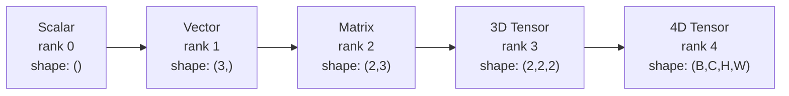
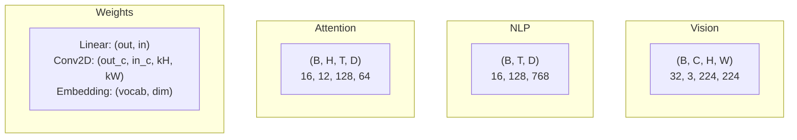
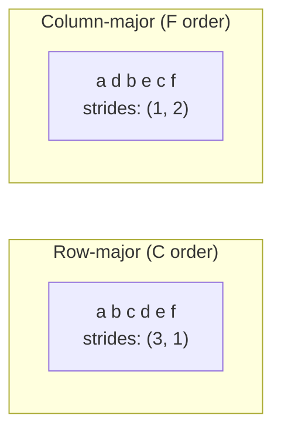
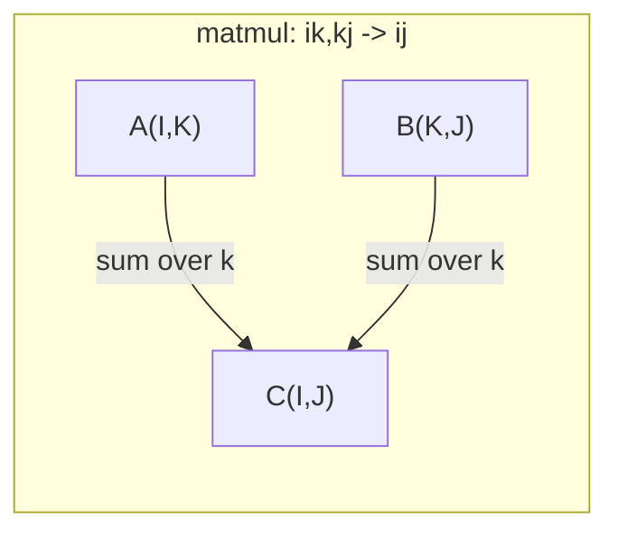

# 张量操作

> 张量（tensor）是数据与深度学习之间的共同语言。每张图像、每个句子、每份梯度都通过张量传递。

**Type:** Build
**Language:** Python
**Prerequisites:** 阶段 1，第 01 课（线性代数直觉）、第 02 课（向量、矩阵与运算）
**Time:** ~90 分钟

## 学习目标

- 从零实现一个张量类，支持形状（shape）、步幅（stride）、形状重塑、转置和逐元素运算
- 应用广播（broadcasting）规则，在不复制数据的情况下对不同形状的张量进行运算
- 为点积（dot product）、矩阵乘法、外积（outer product）和批量运算编写 einsum 表达式
- 逐步追踪多头注意力中每一步的准确张量形状

## 要解决的问题

你搭建了一个 Transformer。前向传播的代码看起来很清楚，一运行却报错：`RuntimeError: mat1 and mat2 shapes cannot be multiplied (32x768 and 512x768)`。你盯着这些形状，试着做了一次转置。这次又提示 `Expected 4D input (got 3D input)`。于是你加了一个 unsqueeze 操作，结果别的地方又出问题了。

形状错误是深度学习代码中最常见的错误。从概念上说，它们并不难理解：每种运算都有自己的形状约定（shape contract），但这些错误很容易越积越多。一个 Transformer 中串联着几十次形状重塑、转置和广播。只要有一个轴弄错，错误就会接连出现。更糟的是，有些形状错误根本不会触发报错：沿错误的维度广播，或沿错误的轴求和，都可能悄无声息地产生毫无意义的结果。

矩阵可以处理两组事物之间的两两关系，但真实数据并不局限于二维。一批 32 张大小为 224x224 的 RGB 图像就是一个 4D 张量：`(32, 3, 224, 224)`。有 12 个注意力头的自注意力也是 4D：`(batch, heads, seq_len, head_dim)`。你需要一种能推广到任意维度数量的数据结构，而且它的运算要能跨这些维度顺畅组合。这种结构就是张量。掌握张量操作之后，形状错误就很容易调试了。

## 核心概念

### 什么是张量

张量是一个数据类型统一的多维数值数组。维度的数量称为 **阶（rank）**（也称 **order**）。每个维度都是一个 **轴（axis）**。**形状（shape）** 是一个元组，按顺序列出各轴的大小。



元素总数 = 各轴大小的乘积。形状为 `(2, 3, 4)` 的张量包含 `2 * 3 * 4 = 24` 个元素。

### 深度学习中的张量形状

按照惯例，不同类型的数据会对应特定的张量形状。



PyTorch 使用 NCHW（通道优先）布局。TensorFlow 默认使用 NHWC（通道后置）布局。布局不匹配会导致不易察觉的性能下降或错误。

### 内存布局如何工作

2D 数组在内存中是一段 1D 字节序列。**步幅（stride）** 表示沿每个轴前进一步时，需要跨过多少个元素。



转置不会移动数据，而是交换步幅，使张量变为 **非连续（non-contiguous）**：同一行的元素在内存中不再相邻。

### 广播规则

广播让你能够在不复制数据的情况下，对不同形状的张量进行运算。先将形状从右侧对齐。两个维度大小相等，或者其中一个为 1 时，它们就是兼容的。对于维度数量较少的形状，在左侧补上大小为 1 的维度。

```text
Tensor A:     (8, 1, 6, 1)
Tensor B:        (7, 1, 5)
Padded B:     (1, 7, 1, 5)
Result:       (8, 7, 6, 5)
```

### einsum：通用张量运算

爱因斯坦求和（Einstein summation）用字母标记每个轴。出现在输入中、却不出现在输出中的轴会被求和；同时出现在输入和输出中的轴则会保留。



关键模式：`i,i->`（点积）、`i,j->ij`（外积）、`ii->`（迹）、`ij->ji`（转置）、`bij,bjk->bik`（批量矩阵乘法）、`bhtd,bhsd->bhts`（注意力分数）。

```figure
tensor-broadcast
```

## 动手实现

代码位于 `code/tensors.py`。每一步都对应其中的实现。

### 第 1 步：张量存储与步幅

张量存储一个扁平的数值列表，以及形状元数据。步幅用于指导索引逻辑，将多维索引映射到扁平列表中的位置。

```python
class Tensor:
    def __init__(self, data, shape=None):
        if isinstance(data, (list, tuple)):
            self._data, self._shape = self._flatten_nested(data)
        elif isinstance(data, np.ndarray):
            self._data = data.flatten().tolist()
            self._shape = tuple(data.shape)
        else:
            self._data = [data]
            self._shape = ()

        if shape is not None:
            total = reduce(lambda a, b: a * b, shape, 1)
            if total != len(self._data):
                raise ValueError(
                    f"Cannot reshape {len(self._data)} elements into shape {shape}"
                )
            self._shape = tuple(shape)

        self._strides = self._compute_strides(self._shape)

    @staticmethod
    def _compute_strides(shape):
        if len(shape) == 0:
            return ()
        strides = [1] * len(shape)
        for i in range(len(shape) - 2, -1, -1):
            strides[i] = strides[i + 1] * shape[i + 1]
        return tuple(strides)
```

对于形状 `(3, 4)`，步幅为 `(4, 1)`：移到下一行需要跨过 4 个元素，移到下一列需要跨过 1 个元素。

### 第 2 步：重塑形状、压缩单例轴与插入单例轴

重塑形状（reshape）会改变形状，但不会改变元素顺序。元素总数必须保持不变。可以将某个维度设为 `-1`，让程序推断它的大小。

```python
t = Tensor(list(range(12)), shape=(2, 6))
r = t.reshape((3, 4))
r = t.reshape((-1, 3))
```

压缩单例轴（squeeze）会移除大小为 1 的轴；插入单例轴（unsqueeze）则会插入这样的轴。插入单例轴对广播至关重要：将偏置向量 `(D,)` 加到一批形状为 `(B, T, D)` 的数据上时，需要先插入单例轴，使偏置形状变为 `(1, 1, D)`。

```python
t = Tensor(list(range(6)), shape=(1, 3, 1, 2))
s = t.squeeze()
v = Tensor([1, 2, 3])
u = v.unsqueeze(0)
```

### 第 3 步：转置与轴置换

转置（transpose）交换两个轴；轴置换（permute）重新排列所有轴。NCHW 与 NHWC 之间的转换就是这样实现的。

```python
mat = Tensor(list(range(6)), shape=(2, 3))
tr = mat.transpose(0, 1)

t4d = Tensor(list(range(24)), shape=(1, 2, 3, 4))
perm = t4d.permute((0, 2, 3, 1))
```

转置或轴置换之后，张量在内存中是非连续的。在 PyTorch 中，对非连续张量调用 `view` 会失败：请使用 `reshape`，或先调用 `.contiguous()`。

### 第 4 步：逐元素运算与归约

逐元素运算（加法、乘法、减法）独立作用于每个元素，并保持形状不变。归约（reduction）运算（求和、求均值、取最大值）则会将一个或多个轴聚合掉。

```python
a = Tensor([[1, 2], [3, 4]])
b = Tensor([[10, 20], [30, 40]])
c = a + b
d = a * 2
s = a.sum(axis=0)
```

在卷积神经网络（CNN）中，全局平均池化通过 `(B, C, H, W).mean(axis=[2, 3])` 得到 `(B, C)`。在自然语言处理（NLP）中，序列平均池化通过 `(B, T, D).mean(axis=1)` 得到 `(B, D)`。

### 第 5 步：使用 NumPy 广播

`tensors.py` 中的 `demo_broadcasting_numpy()` 函数展示了核心模式。

```python
activations = np.random.randn(4, 3)
bias = np.array([0.1, 0.2, 0.3])
result = activations + bias

images = np.random.randn(2, 3, 4, 4)
scale = np.array([0.5, 1.0, 1.5]).reshape(1, 3, 1, 1)
result = images * scale

a = np.array([1, 2, 3]).reshape(-1, 1)
b = np.array([10, 20, 30, 40]).reshape(1, -1)
outer = a * b
```

通过广播计算两两距离：将 `(M, 2)` 重塑为 `(M, 1, 2)`，将 `(N, 2)` 重塑为 `(1, N, 2)`，然后相减、平方、沿最后一个轴求和，再开平方。结果形状为 `(M, N)`。

### 第 6 步：einsum 运算

`demo_einsum()` 和 `demo_einsum_gallery()` 函数逐一演示了所有常见模式。

```python
a = np.array([1.0, 2.0, 3.0])
b = np.array([4.0, 5.0, 6.0])
dot = np.einsum("i,i->", a, b)

A = np.array([[1, 2], [3, 4], [5, 6]], dtype=float)
B = np.array([[7, 8, 9], [10, 11, 12]], dtype=float)
matmul = np.einsum("ik,kj->ij", A, B)

batch_A = np.random.randn(4, 3, 5)
batch_B = np.random.randn(4, 5, 2)
batch_mm = np.einsum("bij,bjk->bik", batch_A, batch_B)
```

一次缩并（contraction）的计算成本是所有下标大小的乘积，包括保留的下标和求和的下标。对于 `bij,bjk->bik`，若 B=32、I=128、J=64、K=128，则需要 `32 * 128 * 64 * 128 = 33,554,432` 次乘加运算。

### 第 7 步：用 einsum 实现注意力机制

`demo_attention_einsum()` 函数完整实现了多头注意力。

```python
B, H, T, D = 2, 4, 8, 16
E = H * D

X = np.random.randn(B, T, E)
W_q = np.random.randn(E, E) * 0.02

Q = np.einsum("bte,ek->btk", X, W_q)
Q = Q.reshape(B, T, H, D).transpose(0, 2, 1, 3)

scores = np.einsum("bhtd,bhsd->bhts", Q, K) / np.sqrt(D)
weights = softmax(scores, axis=-1)
attn_output = np.einsum("bhts,bhsd->bhtd", weights, V)

concat = attn_output.transpose(0, 2, 1, 3).reshape(B, T, E)
output = np.einsum("bte,ek->btk", concat, W_o)
```

每一步都是张量操作：投影（通过 einsum 做矩阵乘法）、拆分注意力头（reshape + transpose）、计算注意力分数（通过 einsum 做批量矩阵乘法）、加权求和（通过 einsum 做批量矩阵乘法）、合并注意力头（transpose + reshape）、输出投影（通过 einsum 做矩阵乘法）。

## 实际使用

### 从零实现与 NumPy 对照

| 操作 | 从零实现（Tensor 类） | NumPy |
|---|---|---|
| 创建 | `Tensor([[1,2],[3,4]])` | `np.array([[1,2],[3,4]])` |
| 重塑形状 | `t.reshape((3,4))` | `a.reshape(3,4)` |
| 转置 | `t.transpose(0,1)` | `a.T` 或 `a.transpose(0,1)` |
| 压缩单例轴 | `t.squeeze(0)` | `np.squeeze(a, 0)` |
| 求和 | `t.sum(axis=0)` | `a.sum(axis=0)` |
| einsum | 不适用 | `np.einsum("ij,jk->ik", a, b)` |

### 从零实现与 PyTorch 对照

```python
import torch

t = torch.tensor([[1, 2, 3], [4, 5, 6]], dtype=torch.float32)
t.shape
t.stride()
t.is_contiguous()

t.reshape(3, 2)
t.unsqueeze(0)
t.transpose(0, 1)
t.transpose(0, 1).contiguous()

torch.einsum("ik,kj->ij", A, B)
```

PyTorch 还提供了 autograd（自动求导）、GPU 支持和经过优化的 BLAS 计算内核。形状语义完全相同。理解了从零实现的版本，就能看懂 PyTorch 的形状错误。

### 用张量操作表示每一种神经网络层

| 操作 | 张量形式 | einsum |
|---|---|---|
| 线性层 | `Y = X @ W.T + b` | `"bd,od->bo"` + 偏置 |
| 注意力 QKV | `Q = X @ W_q` | `"btd,dh->bth"` |
| 注意力分数 | `Q @ K.T / sqrt(d)` | `"bhtd,bhsd->bhts"` |
| 注意力输出 | `softmax(scores) @ V` | `"bhts,bhsd->bhtd"` |
| 批量归一化 | `(X - mu) / sigma * gamma` | 逐元素运算 + 广播 |
| softmax | `exp(x) / sum(exp(x))` | 逐元素运算 + 归约 |

## 交付成果

本课产出两个可复用的提示词（prompt）：

1. **`outputs/prompt-tensor-shapes.md`**：用于系统化调试张量形状不匹配问题的提示词。其中包含每种常见操作（matmul、broadcast、cat、Linear、Conv2d、BatchNorm、softmax）的决策表，以及修复方法速查表。

2. **`outputs/prompt-tensor-debugger.md`**：当形状错误让你无法继续时，可将这个逐步调试提示词粘贴到任意 AI 助手中。提供错误消息和张量形状，就能得到准确的修复方法。

## 练习

1. **简单：重塑形状后还原。** 取一个形状为 `(2, 3, 4)` 的张量，将它重塑为 `(6, 4)`，再重塑为 `(24,)`，最后还原为 `(2, 3, 4)`。每一步都打印扁平数据，验证元素顺序保持不变。

2. **中等：实现广播。** 为 `Tensor` 类添加 `broadcast_to(shape)` 方法，将大小为 1 的维度扩展到与目标形状匹配。然后修改 `_elementwise_op`，让它在运算前自动广播。用形状 `(3, 1)` 和 `(1, 4)` 进行测试，得到 `(3, 4)`。

3. **困难：从零实现 einsum。** 实现一个基础的 `einsum(subscripts, *tensors)` 函数，至少支持点积（`i,i->`）、矩阵乘法（`ij,jk->ik`）、外积（`i,j->ij`）和转置（`ij->ji`）。解析下标字符串，识别需要缩并的下标，再遍历所有下标组合。将结果与 `np.einsum` 对照。

4. **困难：注意力形状追踪器。** 编写一个函数，以 `batch_size`、`seq_len`、`embed_dim` 和 `num_heads` 为输入，打印多头注意力每一步的准确形状：输入、Q/K/V 投影、拆分注意力头、注意力分数、softmax 权重、加权求和、合并注意力头、输出投影。对照 `demo_attention_einsum()` 的输出进行验证。

## 关键术语

| 术语 | 常见说法 | 实际含义 |
|---|---|---|
| 张量（Tensor） | “维度更多的矩阵” | 数据类型统一，并具有明确定义的形状、步幅和运算的多维数组 |
| 阶（Rank） | “维度的数量” | 轴的数量。矩阵的张量阶为 2，不能用它的矩阵秩来代替 |
| 形状（Shape） | “张量的大小” | 按顺序列出各轴大小的元组。`(2, 3)` 表示 2 行、3 列 |
| 步幅（Stride） | “内存的排列方式” | 沿每个轴前进一个位置时，需要跨过的元素数量 |
| 广播（Broadcasting） | “形状不同也能直接算” | 一组严格的规则：从右侧对齐，各对应维度必须相等，或者其中一个为 1 |
| 连续（Contiguous） | “张量是正常的” | 元素按逻辑布局的顺序存储在内存中，没有间隔，也没有重排 |
| einsum | “矩阵乘法的一种花哨写法” | 一种通用记法，可在一行中表达任意张量缩并、外积、求迹或转置 |
| 视图（View） | “和 reshape 一样” | 共享同一内存缓冲区、但形状或步幅元数据不同的张量。对非连续数据会失败 |
| 缩并（Contraction） | “沿某个下标求和” | 对张量间的公共下标进行相乘并求和的一般运算，得到阶数更低的结果 |
| NCHW / NHWC | “PyTorch 与 TensorFlow 的格式” | 图像张量的内存布局约定。NCHW 将通道维放在空间维之前，NHWC 则放在空间维之后 |

## 延伸阅读

- [NumPy 广播](https://numpy.org/doc/stable/user/basics.broadcasting.html)：配有可视化示例的标准规则
- [PyTorch 张量视图](https://pytorch.org/docs/stable/tensor_view.html)：视图何时可用，何时会复制数据
- [einops](https://github.com/arogozhnikov/einops)：让张量形状重塑更易读、更安全的库
- [图解 Transformer](https://jalammar.github.io/illustrated-transformer/)：直观展示注意力计算过程中张量形状的变化
- [NumPy 中的爱因斯坦求和](https://numpy.org/doc/stable/reference/generated/numpy.einsum.html)：完整的 einsum 文档及示例
