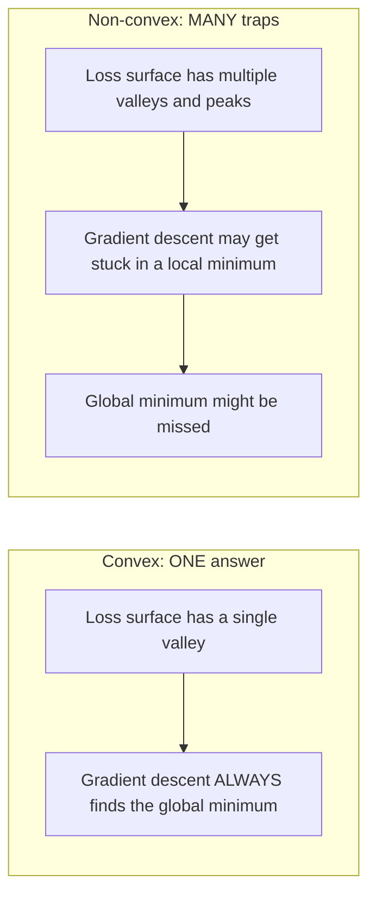
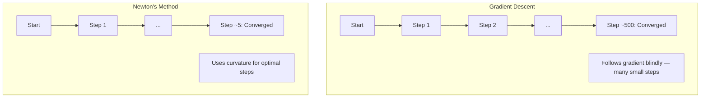
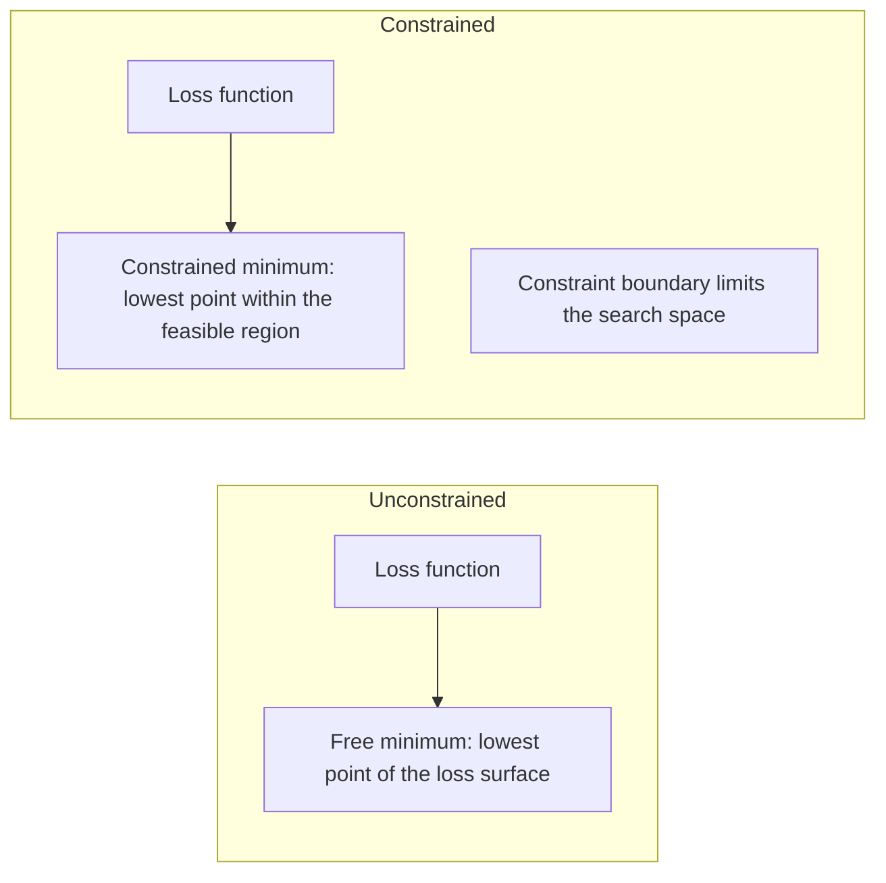
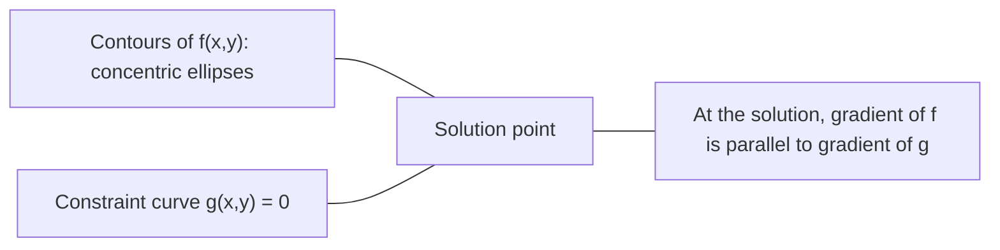

# 凸优化

> 凸问题只有一个谷底，神经网络却有 millions（数百万）个。理解两者的区别很重要。

**Type:** Build
**Language:** Python
**Prerequisites:** 阶段 1，第 04 课（机器学习微积分）、第 08 课（优化）
**Time:** ~90 分钟

## 学习目标

- 使用定义、二阶导数和 Hessian 判据检验函数是否为凸函数
- 实现 Newton 法，并将它的二次收敛特性与梯度下降进行比较
- 使用 Lagrange 乘子求解约束优化问题，并解释 KKT 条件
- 解释为什么神经网络的损失曲面是非凸的，而 SGD 仍能找到好的解

## 要解决的问题

第 08 课介绍了梯度下降、动量和 Adam。这些优化器会沿着任意曲面向下走，但不提供保证。在非凸曲面上，梯度下降可能落入较差的局部极小值，停在鞍点，或者永远振荡下去。你仍然使用它，因为神经网络是非凸的，别无选择。

但机器学习中的许多问题是凸的，例如线性回归、逻辑回归、SVM、LASSO 和岭回归。对这些问题，有一种更强的工具：具备数学保证的优化。一个凸问题恰好只有一个谷底。任何沿着下坡走的算法都会到达全局极小值，不需要重新启动，不需要学习率调度，也不需要祈祷。

理解凸性有三个作用。首先，它能告诉你，问题是容易的凸问题，还是困难的非凸问题。其次，它为凸问题提供了 Newton 法这样的更快工具。最后，它能解释贯穿机器学习（ML）的概念：作为约束的正则化、SVM 中的对偶性，以及深度学习为什么在不具备凸性带来的那些良好性质时仍然有效。

## 核心概念

### 凸集

如果集合 S 内任意两点之间的线段也完全位于 S 内，那么 S 就是凸集（convex set）。

| 凸集 | 非凸集 |
|---|---|
| **矩形**：任意两个内部点之间的线段都留在集合内部 | **星形或月牙形**：两个内部点之间的线段可能经过集合外部 |
| **三角形**：所有内部点都满足同样的性质 | **甜甜圈形或圆环**：中间的孔洞会使某些线段离开集合 |
| 任意两点之间的线段都留在集合内部 | 某些点对之间的线段会离开集合 |

形式化判据：对于 S 内任意两点 x、y，以及 [0, 1] 内任意 t，点 tx + (1-t)y 也属于 S。

凸集的例子：
- 一条直线、一个平面、整个 R^n
- 一个球（圆、球体、超球体）
- 一个半空间：{x : a^T x <= b}
- 任意多个凸集的交集

非凸集的例子：
- 甜甜圈形区域（圆环）
- 两个不相交圆的并集
- 任何带有“凹陷”或“孔洞”的集合

### 凸函数

如果函数 f 的定义域是凸集，并且对于定义域内任意两点 x、y，以及 [0, 1] 内任意 t，都满足下式，那么 f 就是凸函数（convex function）：

```text
f(tx + (1-t)y) <= t*f(x) + (1-t)*f(y)
```

从几何上看，函数图像上任意两点之间的线段，都位于图像上方或图像上。

| 性质 | 凸函数 | 非凸函数 |
|---|---|---|
| **线段判据** | 图像上任意两点之间的线段都位于曲线 **上方或曲线上** | 图像上某些点之间的线段会降到曲线 **下方** |
| **形状** | 向上弯曲的单个碗状或谷状曲面 | 多个峰谷混杂，曲率有正有负 |
| **局部极小值** | 每个局部极小值都是全局极小值 | 可能存在多个高度不同的局部极小值 |

常见的凸函数：
- f(x) = x^2（抛物线）
- f(x) = |x|（绝对值）
- f(x) = e^x（指数函数）
- f(x) = max(0, x)（ReLU，虽然它是分段线性的）
- x > 0 时的 f(x) = -log(x)（负对数）
- 任意线性函数 f(x) = a^T x + b（既凸又凹）

### 检验凸性

下面是三种实用判据，依次从最容易使用到最严谨。

**判据 1：二阶导数判据（1D）。** 如果对所有 x 都有 f''(x) >= 0，那么 f 就是凸函数。

- f(x) = x^2：f''(x) = 2 >= 0，是凸函数
- f(x) = x^3：f''(x) = 6x，在 x < 0 时为负，因此不是凸函数
- f(x) = e^x：f''(x) = e^x > 0，是凸函数

**判据 2：Hessian 判据（多变量）。** 如果对所有 x，Hessian 矩阵 H(x) 都是半正定的，那么 f 就是凸函数。Hessian 矩阵是由二阶偏导数组成的矩阵。

**判据 3：定义判据。** 直接检查不等式 f(tx + (1-t)y) <= t*f(x) + (1-t)*f(y)。对于导数难以计算的函数，这种方法很有用。

### 为什么凸性很重要

凸优化的核心定理是：

**对于凸函数，每个局部极小值都是全局极小值。**

这意味着梯度下降不会陷入困境。任何下坡路径都通向同一个答案，算法保证会收敛到最优解。



由此可得：
- 不需要随机重新启动
- 不需要复杂的学习率调度
- 可以证明收敛性，收敛速度取决于函数的性质
- 解是唯一的，平坦区域中的等价解除外

### ML 中的凸问题与非凸问题

| 问题 | 是否为凸问题？ | 原因 |
|---------|---------|-----|
| 线性回归（MSE） | 是 | 损失是权重的二次函数 |
| 逻辑回归 | 是 | 对数损失是权重的凸函数 |
| SVM（合页损失） | 是 | 线性函数的最大值 |
| LASSO（L1 回归） | 是 | 凸函数之和仍为凸函数 |
| 岭回归（L2） | 是 | 二次函数 + 二次函数 = 凸函数 |
| 神经网络（任意损失） | 否 | 非线性激活构成非凸曲面 |
| k-means 聚类 | 否 | 包含离散的分配步骤 |
| 矩阵分解 | 否 | 包含未知量的乘积 |

使用凸损失的线性模型是凸的。一旦加入带非线性激活的隐藏层，凸性就被破坏了。

### Hessian 矩阵

函数 f: R^n -> R 的 Hessian 矩阵 H，是由二阶偏导数组成的 n x n 矩阵。

```text
H[i][j] = d^2 f / (dx_i dx_j)
```

对于 f(x, y) = x^2 + 3xy + y^2：

```text
df/dx = 2x + 3y       d^2f/dx^2 = 2      d^2f/dxdy = 3
df/dy = 3x + 2y       d^2f/dydx = 3      d^2f/dy^2 = 2

H = [ 2  3 ]
    [ 3  2 ]
```

Hessian 矩阵反映曲率信息：
- 特征值全部为正：函数沿每个方向都向上弯曲，即在该点是凸的
- 特征值全部为负：沿每个方向都向下弯曲，即为凹，对应局部极大值
- 特征值有正有负：鞍点，某些方向向上弯曲，另一些方向向下弯曲
- 存在零特征值：对应方向是平坦的，也就是退化的

要保证凸性，Hessian 矩阵必须处处半正定，即所有特征值都 >= 0，而不能只在某个点满足条件。

### Newton 法

梯度下降使用一阶信息，也就是梯度；Newton 法（牛顿法）使用二阶信息，也就是 Hessian 矩阵。它在当前点拟合一个二次近似，然后直接跳到这个二次模型的极小值点。

```text
Update rule:
  x_new = x - H^(-1) * gradient

Compare to gradient descent:
  x_new = x - lr * gradient
```

Newton 法用逆 Hessian 矩阵代替标量学习率，从而根据局部曲率自动调整步长和方向。



优点：
- 在极小值附近二次收敛，即每一步的误差都会变成上一步误差的平方
- 没有需要调节的学习率
- 具有尺度不变性，不受问题参数化方式的影响

缺点：
- 计算 Hessian 矩阵需要 O(n^2) 内存，求逆需要 O(n^3) 运算
- 对于含 1 million（百万）个权重的神经网络，需要存储 10^12 个元素并进行 10^18 次运算
- 不适合实际用于深度学习

### 约束优化

无约束优化：在所有 x 中最小化 f(x)。
约束优化：在满足约束的前提下最小化 f(x)。

实际问题通常有约束。例如，你希望降低成本，但预算有限；或者希望减小误差，但模型复杂度有上限。



### Lagrange 乘子

Lagrange 乘子法（拉格朗日乘子法）将约束问题转化为无约束问题。

问题：在满足 g(x) = 0 的条件下最小化 f(x)。

解决办法：引入一个新变量，也就是 Lagrange 乘子 lambda，并求解下面的无约束问题：

```text
L(x, lambda) = f(x) + lambda * g(x)
```

在解处，L 的梯度为零：

```text
dL/dx = df/dx + lambda * dg/dx = 0
dL/dlambda = g(x) = 0
```

几何直觉是：在约束极小值点，f 的梯度必须与约束函数 g 的梯度平行。否则，你就可以沿着约束曲面移动，让 f 进一步减小。



例如，在满足 x + y = 1 的条件下，最小化 f(x,y) = x^2 + y^2。

```text
L = x^2 + y^2 + lambda(x + y - 1)

dL/dx = 2x + lambda = 0  =>  x = -lambda/2
dL/dy = 2y + lambda = 0  =>  y = -lambda/2
dL/dlambda = x + y - 1 = 0

From first two: x = y
Substituting: 2x = 1, so x = y = 0.5, lambda = -1
```

直线 x + y = 1 上距离原点最近的点是 (0.5, 0.5)。

### KKT 条件

Karush-Kuhn-Tucker（KKT）条件将 Lagrange 乘子法扩展到不等式约束。

问题：在满足 g_i(x) <= 0（i = 1, ..., m）的条件下最小化 f(x)。

KKT 条件，也就是最优性的必要条件，如下：

```text
1. Stationarity:    df/dx + sum(lambda_i * dg_i/dx) = 0
2. Primal feasibility:  g_i(x) <= 0  for all i
3. Dual feasibility:    lambda_i >= 0  for all i
4. Complementary slackness:  lambda_i * g_i(x) = 0  for all i
```

关键在于互补松弛（complementary slackness）：约束是活跃的（g_i = 0，解位于边界上），或者乘子为零（约束不起作用）。不影响解的约束，其 lambda = 0。

KKT 条件是 SVM 的核心。支持向量就是约束处于活跃状态的数据点（lambda > 0）。其他数据点的 lambda = 0，不会影响决策边界。

### 将正则化看作约束优化

L1 和 L2 正则化并不是随意想出的技巧，它们实际上是换了一种形式的约束优化问题。

**L2 正则化（Ridge）：**

```text
minimize  Loss(w)  subject to  ||w||^2 <= t

Equivalent unconstrained form:
minimize  Loss(w) + lambda * ||w||^2
```

约束 ||w||^2 <= t 定义了一个球，2D 中为圆，3D 中为球体。解位于损失等高线最先接触这个球的位置。

**L1 正则化（LASSO）：**

```text
minimize  Loss(w)  subject to  ||w||_1 <= t

Equivalent unconstrained form:
minimize  Loss(w) + lambda * ||w||_1
```

约束 ||w||_1 <= t 定义了一个菱形，也就是 2D 中旋转后的正方形。

| 性质 | L2 约束（圆形） | L1 约束（菱形） |
|---|---|---|
| **约束形状** | 圆形，高维中为球体 | 菱形，2D 中旋转后的正方形 |
| **损失等高线接触的位置** | 光滑边界，即圆上的任意点 | 与坐标轴对齐的顶点 |
| **解的表现** | 权重较小，但不为零 | 部分权重精确为零，即具有稀疏性 |
| **结果** | 权重收缩 | 特征选择 |

这解释了为什么 L1 会产生稀疏模型，即进行特征选择，而 L2 只会收缩权重。菱形的顶点与坐标轴对齐，损失等高线更容易接触顶点，从而使一个或多个权重精确为零。

### 对偶性

每个约束优化问题，也就是原始问题（primal），都有一个与之对应的对偶问题（dual）。对于凸问题，原始问题与对偶问题具有相同的最优值，这就是强对偶（strong duality）。

Lagrange 对偶函数如下：

```text
Primal: minimize f(x) subject to g(x) <= 0
Lagrangian: L(x, lambda) = f(x) + lambda * g(x)
Dual function: d(lambda) = min_x L(x, lambda)
Dual problem: maximize d(lambda) subject to lambda >= 0
```

对偶性的重要性：
- 对偶问题有时比原始问题更容易求解
- SVM 使用对偶形式求解，此时问题依赖于数据点之间的点积，因此可以使用核技巧
- 对偶问题为原始问题的最优值提供了下界，可用于检查解的质量

具体到 SVM：

```text
Primal: find w, b that maximize the margin 2/||w|| subject to
        y_i(w^T x_i + b) >= 1 for all i

Dual:   maximize sum(alpha_i) - 0.5 * sum_ij(alpha_i * alpha_j * y_i * y_j * x_i^T x_j)
        subject to alpha_i >= 0 and sum(alpha_i * y_i) = 0

The dual only involves dot products x_i^T x_j.
Replace x_i^T x_j with K(x_i, x_j) to get the kernel trick.
```

### 为什么深度学习在非凸情况下仍然有效

神经网络的损失函数高度非凸。按照各种经典衡量标准，对它们进行优化都应当失败。然而，随机梯度下降却能可靠地找到好的解。下面几个因素可以解释这一点。

**大多数局部极小值已经足够好。** 在高维空间中，随机临界点，也就是梯度为零的点，绝大多数是鞍点，而不是局部极小值点。数量不多的局部极小值，其损失值往往接近全局极小值。当参数空间具有 millions（数百万）个维度时，陷入非常差的局部极小值的可能性极低。

**真正的障碍是鞍点，而非局部极小值。** 对于含 n 个参数的函数，鞍点处既有正曲率方向，也有负曲率方向。在高维空间的随机临界点处，全部 n 个特征值都为正，也就是局部极小值的概率，大约为 2^(-n)。几乎所有临界点都是鞍点，SGD 的噪声有助于逃离它们。

**过参数化（overparameterization）使曲面更平滑。** 参数数量多于训练样本的网络，其损失曲面更平滑，连通性也更好。更宽的网络具有更少的差局部极小值。这看似违反直觉，却与经验观察一致。

**损失曲面的结构：**

| 性质 | 低维空间 | 高维空间 |
|---|---|---|
| **曲面形态** | 许多相互分离的峰与谷 | 平滑连通的谷地 |
| **极小值** | 许多相互分离的局部极小值 | 差的局部极小值很少，大多数都接近最优 |
| **寻优过程** | 难以找到全局极小值 | 许多路径都能通向好的解 |
| **临界点** | 局部极小值点与鞍点混合存在 | 绝大多数是鞍点，而不是局部极小值点 |

**随机噪声起到隐式正则化的作用。** 小批量 SGD 引入的噪声会防止优化过程停留在尖锐极小值处。尖锐极小值导致过拟合，平坦极小值则具有泛化能力。噪声使优化更倾向于损失曲面中的平坦区域。

### 二阶方法的实际使用

直接使用 Newton 法不适合大型模型。有几种近似方法，可以让二阶信息变得可用。

**L-BFGS（Limited-memory BFGS，有限内存 BFGS）：** 使用最近 m 次梯度差来近似逆 Hessian 矩阵，只需要 O(mn) 内存，而不是 O(n^2)。对于参数量不超过 ~10,000 的问题，它表现良好。它用于传统 ML，例如逻辑回归和 CRF，但不用于深度学习。

**自然梯度（natural gradient）：** 用 Fisher 信息矩阵，也就是对数似然的期望 Hessian 矩阵，代替通常的 Hessian 矩阵，从而考虑概率分布的几何结构。K-FAC（Kronecker-Factored Approximate Curvature）用 Kronecker 积近似 Fisher 矩阵，使其可以实际用于神经网络。

**无 Hessian 优化（Hessian-free optimization）：** 使用共轭梯度求解 Hx = g，而不显式构造 H。它只需要 Hessian 与向量的乘积，这可以通过自动微分在 O(n) 时间内计算。

**对角近似：** Adam 的二阶矩是 Hessian 对角线的对角近似。AdaHessian 在此基础上，利用 Hutchinson 估计器获得实际的 Hessian 对角元素。

| 方法 | 内存 | 每步开销 | 适用场景 |
|--------|--------|--------------|-------------|
| 梯度下降 | O(n) | O(n) | 基线、大型模型 |
| Newton 法 | O(n^2) | O(n^3) | 小型凸问题 |
| L-BFGS | O(mn) | O(mn) | 中型凸问题 |
| Adam | O(n) | O(n) | 深度学习的默认选择 |
| K-FAC | O(n) | 每层 O(n) | 研究、大批量训练 |

```figure
convex-vs-nonconvex
```

## 动手实现

### 步骤 1：凸性检查器

编写一个函数，通过抽取点并检查定义，以经验方式检验凸性。

```python
import random
import math

def check_convexity(f, dim, bounds=(-5, 5), samples=1000):
    violations = 0
    for _ in range(samples):
        x = [random.uniform(*bounds) for _ in range(dim)]
        y = [random.uniform(*bounds) for _ in range(dim)]
        t = random.uniform(0, 1)
        mid = [t * xi + (1 - t) * yi for xi, yi in zip(x, y)]
        lhs = f(mid)
        rhs = t * f(x) + (1 - t) * f(y)
        if lhs > rhs + 1e-10:
            violations += 1
    return violations == 0, violations
```

### 步骤 2：用于 2D 的 Newton 法

使用显式 Hessian 矩阵实现 Newton 法，并与梯度下降比较收敛速度。

```python
def newtons_method(f, grad_f, hessian_f, x0, steps=50, tol=1e-12):
    x = list(x0)
    history = [x[:]]
    for _ in range(steps):
        g = grad_f(x)
        H = hessian_f(x)
        det = H[0][0] * H[1][1] - H[0][1] * H[1][0]
        if abs(det) < 1e-15:
            break
        H_inv = [
            [H[1][1] / det, -H[0][1] / det],
            [-H[1][0] / det, H[0][0] / det],
        ]
        dx = [
            H_inv[0][0] * g[0] + H_inv[0][1] * g[1],
            H_inv[1][0] * g[0] + H_inv[1][1] * g[1],
        ]
        x = [x[0] - dx[0], x[1] - dx[1]]
        history.append(x[:])
        if sum(gi ** 2 for gi in g) < tol:
            break
    return history
```

### 步骤 3：Lagrange 乘子求解器

对 Lagrange 函数进行梯度下降，求解约束优化问题。

```python
def lagrange_solve(f_grad, g_val, g_grad, x0, lr=0.01,
                   lr_lambda=0.01, steps=5000):
    x = list(x0)
    lam = 0.0
    history = []
    for _ in range(steps):
        fg = f_grad(x)
        gv = g_val(x)
        gg = g_grad(x)
        x = [
            xi - lr * (fgi + lam * ggi)
            for xi, fgi, ggi in zip(x, fg, gg)
        ]
        lam = lam + lr_lambda * gv
        history.append((x[:], lam, gv))
    return history
```

### 步骤 4：比较一阶方法与二阶方法

在同一个二次函数上运行梯度下降和 Newton 法，统计达到收敛所需的步数。

```python
def quadratic(x):
    return 5 * x[0] ** 2 + x[1] ** 2

def quadratic_grad(x):
    return [10 * x[0], 2 * x[1]]

def quadratic_hessian(x):
    return [[10, 0], [0, 2]]
```

Newton 法会在 1 步内收敛，因为它对二次函数是精确的。梯度下降则需要数百步，因为 Hessian 矩阵的特征值相差 5 倍，形成了一个狭长的谷地。

## 实际使用

选择 ML 模型和求解器时，可以直接应用凸性分析。

对于凸问题，例如逻辑回归、SVM 和 LASSO：
- 使用专门的求解器，例如 liblinear、CVXPY，以及采用 method='L-BFGS-B' 的 scipy.optimize.minimize
- 预期得到唯一的全局解
- 二阶方法既实用又快速

对于非凸问题，例如神经网络：
- 使用一阶方法，例如 SGD、Adam
- 接受解会依赖初始化和随机性这一事实
- 将过参数化、噪声和学习率调度用作隐式正则化
- 不要浪费时间寻找全局极小值，一个好的局部极小值就足够了

```python
from scipy.optimize import minimize

result = minimize(
    fun=lambda w: sum((y - X @ w) ** 2) + 0.1 * sum(w ** 2),
    x0=np.zeros(d),
    method='L-BFGS-B',
    jac=lambda w: -2 * X.T @ (y - X @ w) + 0.2 * w,
)
```

对于 SVM，对偶形式可以让你使用核技巧：

```python
from sklearn.svm import SVC

svm = SVC(kernel='rbf', C=1.0)
svm.fit(X_train, y_train)
print(f"Support vectors: {svm.n_support_}")
```

## 练习

1. **凸性示例集。** 使用检查器检验以下函数的凸性：f(x) = x^4、f(x) = sin(x)、f(x,y) = x^2 + y^2、f(x,y) = x*y、f(x) = max(x, 0)。解释为什么每个结果都合理。

2. **Newton 法与梯度下降竞速。** 从起点 (10, 10) 出发，在 f(x,y) = 50*x^2 + y^2 上运行两种方法。各需要多少步才能达到 loss < 1e-10？当条件数（Hessian 最大特征值与最小特征值的比值）增大时，梯度下降会怎样？

3. **Lagrange 乘子的几何意义。** 在满足 x + 2y = 4 的条件下，最小化 f(x,y) = (x-3)^2 + (y-3)^2。检查解处 f 的梯度是否与 g 的梯度平行，以此验证结果。

4. **正则化约束。** 实现带 L1 约束的优化：在满足 |x| + |y| <= 1 的条件下，最小化 (x-3)^2 + (y-2)^2。展示解的某个坐标等于零，也就是菱形约束带来的稀疏性。

5. **Hessian 特征值分析。** 计算 Rosenbrock 函数在 (1,1) 和 (-1,1) 处的 Hessian 矩阵，再计算这两点处的特征值。它们分别说明了极小值点与远离极小值的位置处，曲率有何特点？

## 关键术语

| 术语 | 含义 |
|------|---------------|
| 凸集 | 集合内任意两点之间的线段都留在集合内部。 |
| 凸函数 | 图像上任意两点之间的线段都位于图像上方或图像上的函数。等价地说，Hessian 矩阵处处半正定。 |
| 局部极小值 | 低于附近所有点的点。对于凸函数，每个局部极小值都是全局极小值。 |
| 全局极小值 | 函数在整个定义域上的最低点。 |
| Hessian 矩阵 | 由所有二阶偏导数组成的矩阵，包含曲率信息。 |
| 半正定 | 矩阵的所有特征值都非负，是“二阶导数 >= 0”在多维情形下的对应概念。 |
| 条件数 | Hessian 最大特征值与最小特征值的比值。条件数高意味着谷地狭长，梯度下降缓慢。 |
| Newton 法 | 使用逆 Hessian 矩阵确定更新方向与步长的二阶优化器，在极小值附近二次收敛。 |
| Lagrange 乘子 | 为将约束优化问题转化为无约束问题而引入的变量。 |
| KKT 条件 | 带不等式约束的最优性必要条件，是 Lagrange 乘子法的推广。 |
| 互补松弛 | 在解处，约束是活跃的，或者其乘子为零；约束值与乘子不可能同时非零。 |
| 对偶性 | 每个约束问题都有相应的对偶问题。对于凸问题，两者具有相同的最优值。 |
| 强对偶 | 原始问题与对偶问题的最优值相等，对满足 Slater 条件的凸问题成立。 |
| L-BFGS | 近似二阶方法，存储最近 m 次梯度差，而不存储完整 Hessian 矩阵。 |
| 鞍点 | 梯度为零，但在某些方向是极小值、在另一些方向是极大值的点。 |
| 过参数化 | 参数数量多于训练样本数量，会使损失曲面更平滑，并减少差的局部极小值。 |

## 延伸阅读

- [Boyd 与 Vandenberghe：Convex Optimization](https://web.stanford.edu/~boyd/cvxbook/) - 标准教材，可免费在线阅读
- [Bottou、Curtis、Nocedal：Optimization Methods for Large-Scale Machine Learning（2018）](https://arxiv.org/abs/1606.04838) - 连接凸优化理论与深度学习实践
- [Choromanska 等：The Loss Surfaces of Multilayer Networks（2015）](https://arxiv.org/abs/1412.0233) - 为什么非凸神经网络的损失曲面没有看起来那么糟
- [Nocedal 与 Wright：Numerical Optimization](https://link.springer.com/book/10.1007/978-0-387-40065-5) - 全面介绍 Newton 法、L-BFGS 和约束优化的参考书
