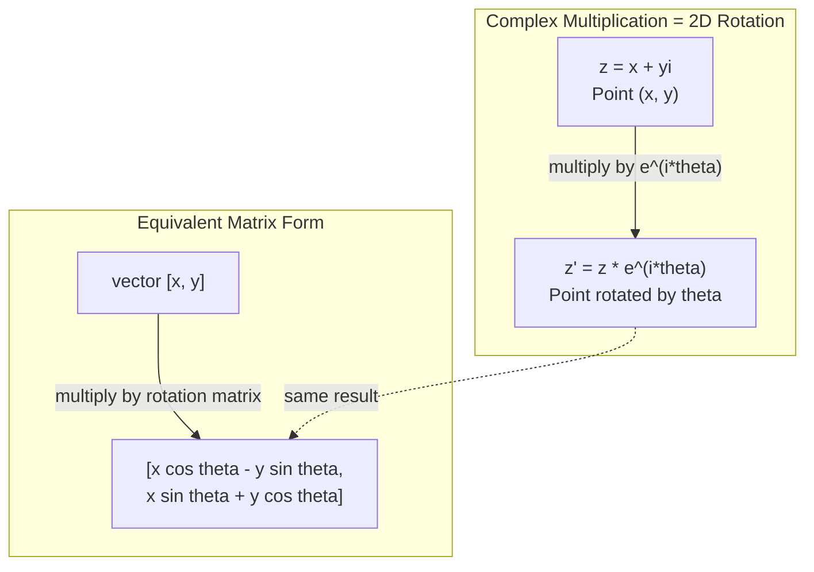
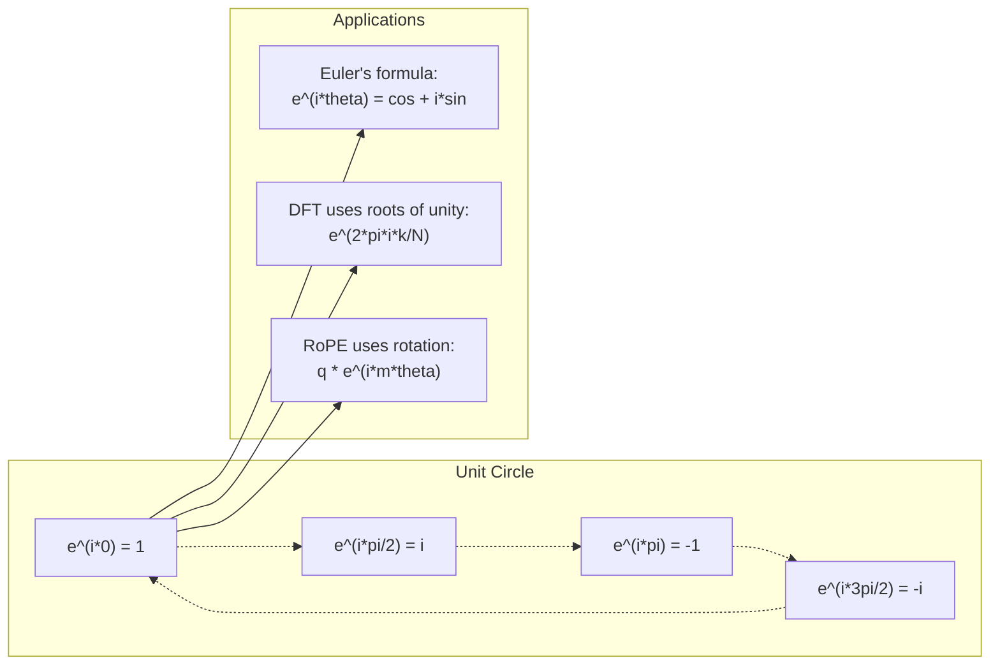

# 面向 AI 的复数

> -1 的平方根并非虚幻之物。它是理解旋转、频率乃至半个信号处理领域的关键。

**Type:** Learn
**Language:** Python
**Prerequisites:** 阶段 1，第 01-04 课（线性代数、微积分）
**Time:** ~60 分钟

## 学习目标

- 使用直角坐标形式和极坐标形式进行复数运算（加法、乘法、除法、取共轭）
- 运用欧拉公式，在复指数函数与三角函数之间转换
- 使用复数单位根实现离散傅里叶变换
- 解释复数旋转如何构成 Transformer 中 RoPE 和正弦位置编码的基础

## 要解决的问题

打开一篇关于傅里叶变换的论文，你会发现到处都是 `i`。查看 Transformer 的位置编码，你会看到不同频率的 `sin` 和 `cos`，它们正是复指数函数的实部和虚部。阅读量子计算相关内容时，你又会发现所有内容都用复向量空间来表示。

复数看起来很抽象。一个建立在 -1 的平方根之上的数系，似乎只是数学技巧。但它并非技巧，而是描述旋转和振荡的自然语言。每当某个东西旋转、振动或振荡时，复数都是合适的工具。

不理解复数，就无法理解离散傅里叶变换（Discrete Fourier Transform，DFT），也无法理解快速傅里叶变换（FFT）。你无法理解现代语言模型中的 RoPE（Rotary Position Embedding，旋转位置嵌入）如何工作，也无法理解原始 Transformer 论文中的正弦位置编码为何采用那些频率。

本课将从零构建复数运算，将其与几何联系起来，并具体展示复数在机器学习中出现的位置。

## 核心概念

### 什么是复数？

复数由两部分组成：实部和虚部。

```text
z = a + bi

where:
  a is the real part
  b is the imaginary part
  i is the imaginary unit, defined by i^2 = -1
```

就这么简单：将数轴扩展为一个平面。实数位于一条轴上，虚数位于另一条轴上。每个复数都是这个平面上的一个点。

### 复数运算

**加法。** 实部相加，虚部相加。

```text
(a + bi) + (c + di) = (a + c) + (b + d)i

Example: (3 + 2i) + (1 + 4i) = 4 + 6i
```

**乘法。** 使用分配律，并记住 i^2 = -1。

```text
(a + bi)(c + di) = ac + adi + bci + bdi^2
                 = ac + adi + bci - bd
                 = (ac - bd) + (ad + bc)i

Example: (3 + 2i)(1 + 4i) = 3 + 12i + 2i + 8i^2
                            = 3 + 14i - 8
                            = -5 + 14i
```

**共轭。** 将虚部的符号取反。

```text
conjugate of (a + bi) = a - bi
```

复数与其共轭的乘积总是实数：

```text
(a + bi)(a - bi) = a^2 + b^2
```

**除法。** 分子和分母同时乘以分母的共轭。

```text
(a + bi) / (c + di) = (a + bi)(c - di) / (c^2 + d^2)
```

这样就消除了分母中的虚部，得到一个简洁的复数表达式。

### 复平面

复平面将每个复数映射到一个 2D 点。横轴是实轴，纵轴是虚轴。

```text
z = 3 + 2i  corresponds to the point (3, 2)
z = -1 + 0i corresponds to the point (-1, 0) on the real axis
z = 0 + 4i  corresponds to the point (0, 4) on the imaginary axis
```

复数既可以看作一个点，也可以看作从原点出发的向量。正是这种双重解释，使复数成为有用的几何工具。

### 极坐标形式

平面上的任意一点，都可以用它到原点的距离，以及它与实轴正方向的夹角来描述。

```text
z = r * (cos(theta) + i*sin(theta))

where:
  r = |z| = sqrt(a^2 + b^2)     (magnitude, or modulus)
  theta = atan2(b, a)             (phase, or argument)
```

直角坐标形式 (a + bi) 适合加法。极坐标形式 (r, theta) 适合乘法。

**极坐标形式的乘法。** 模相乘，角度相加。

```text
z1 = r1 * e^(i*theta1)
z2 = r2 * e^(i*theta2)

z1 * z2 = (r1 * r2) * e^(i*(theta1 + theta2))
```

这就是复数非常适合描述旋转的原因。乘以一个模为 1 的复数，就是纯粹的旋转。

### 欧拉公式

连接复指数函数与三角函数的桥梁：

```text
e^(i*theta) = cos(theta) + i*sin(theta)
```

这是本课最重要的公式。当 theta = pi 时：

```text
e^(i*pi) = cos(pi) + i*sin(pi) = -1 + 0i = -1

Therefore: e^(i*pi) + 1 = 0
```

五个基本常数 (e, i, pi, 1, 0) 由一个等式联系在一起。

### 为什么欧拉公式对机器学习很重要

欧拉公式表明，随着 theta 变化，`e^(i*theta)` 会描出单位圆。在 theta = 0 时，你位于 (1, 0)；在 theta = pi/2 时，位于 (0, 1)；在 theta = pi 时，位于 (-1, 0)；在 theta = 3\*pi/2 时，位于 (0, -1)。转完一整圈对应 theta = 2\*pi。

这意味着复指数函数就是旋转。而旋转在信号处理和机器学习中无处不在。

### 与 2D 旋转的联系

将复数 (x + yi) 乘以 e^(i\*theta)，就会让点 (x, y) 绕原点旋转 theta 角。

```text
Rotation via complex multiplication:
  (x + yi) * (cos(theta) + i*sin(theta))
  = (x*cos(theta) - y*sin(theta)) + (x*sin(theta) + y*cos(theta))i

Rotation via matrix multiplication:
  [cos(theta)  -sin(theta)] [x]   [x*cos(theta) - y*sin(theta)]
  [sin(theta)   cos(theta)] [y] = [x*sin(theta) + y*cos(theta)]
```

两者产生完全相同的结果。复数乘法就是 2D 旋转。旋转矩阵只是用矩阵记法写出的复数乘法。



### 相量与旋转信号

复指数函数 e^(i\*omega\*t) 表示一个以角频率 omega 绕单位圆旋转的点。随着 t 增大，这个点会描出圆周。

这个旋转点的实部是 cos(omega\*t)，虚部是 sin(omega\*t)。正弦信号就是旋转复数的投影。

```text
e^(i*omega*t) = cos(omega*t) + i*sin(omega*t)

Real part:      cos(omega*t)    -- a cosine wave
Imaginary part: sin(omega*t)    -- a sine wave
```

这就是相量表示（phasor representation）。你不再追踪一条上下起伏的正弦波，而是追踪一支平稳旋转的箭头。相位偏移变成角度偏移，振幅变化变成模的变化，信号相加变成向量相加。

### 单位根

N 次单位根是单位圆上等间距分布的 N 个点：

```text
w_k = e^(2*pi*i*k/N)    for k = 0, 1, 2, ..., N-1
```

当 N = 4 时，单位根为：1, i, -1, -i（对应四个正方向）。
当 N = 8 时，除了这四个正方向，还会加上四个对角方向。

单位根是离散傅里叶变换的基础。DFT 将信号分解为这 N 个等间隔频率上的分量。

### 与 DFT 的联系

信号 x[0], x[1], ..., x[N-1] 的离散傅里叶变换为：

```text
X[k] = sum_{n=0}^{N-1} x[n] * e^(-2*pi*i*k*n/N)
```

每个 X[k] 衡量信号与第 k 个单位根的相关程度，该单位根对应频率为 k 的复正弦波。DFT 将信号分解为 N 个旋转相量，并给出每个相量的振幅和相位。

### 为什么 i 并非虚幻之物

“虚数”这个名称源于一段历史偶然。笛卡尔曾带着轻蔑使用这个词。但 i 并不比当初遭到人们排斥的负数更加虚幻。负数回答的是“从 3 中减去 5 会得到什么？”虚数单位回答的则是“什么数的平方等于 -1？”

更实用的理解是：i 是一个 90 度旋转算子。将实数乘以一次 i，就会旋转 90 度，到达虚轴。再乘以一次 i（i^2），就会再旋转 90 度，此时指向实轴负方向。这就是 i^2 = -1 的原因。它并不神秘，不过是两个四分之一圈组成了半圈。

这就是复数在工程领域无处不在的原因。任何旋转的东西，包括电磁波、量子态、信号振荡和位置编码，都可以用复数自然地描述。

### 复指数函数与三角函数

在欧拉公式出现之前，工程师将信号写作 A\*cos(omega\*t + phi)，其中振幅为 A、频率为 omega、相位为 phi。这种写法可行，但运算很麻烦。两个相位不同的余弦函数相加，需要使用三角恒等式。

使用复指数函数时，同一个信号写作 A\*e^(i\*(omega\*t + phi))。两个信号相加，就是两个复数相加。相乘（调制）就是模相乘、角度相加。相位偏移变成角度相加，频率偏移变成与相量相乘。

整个信号处理领域转向了复指数记法，因为这样计算更简洁。“实信号”始终只是复数表示的实部。虚部作为辅助信息一起保留，让所有代数运算自然成立。

### 与 Transformer 的联系

**正弦位置编码**（原始 Transformer 论文）：

```text
PE(pos, 2i) = sin(pos / 10000^(2i/d))
PE(pos, 2i+1) = cos(pos / 10000^(2i/d))
```

成对的 sin 和 cos 是不同频率复指数函数的实部和虚部。每个频率为位置编码提供不同的“分辨率”。低频变化缓慢，提供粗粒度的位置信息；高频变化迅速，提供细粒度的位置信息。它们共同为每个位置赋予独特的频率指纹。

**RoPE（Rotary Position Embedding，旋转位置嵌入）** 更进一步：它显式地将查询向量和键向量乘以复数旋转矩阵。两个 token（词元）之间的相对位置变成旋转角度。注意力使用这些旋转后的向量计算，使模型通过复数乘法感知相对位置。

| 运算 | 代数形式 | 几何意义 |
|-----------|---------------|-------------------|
| 加法 | (a+c) + (b+d)i | 平面内的向量加法 |
| 乘法 | (ac-bd) + (ad+bc)i | 旋转与缩放 |
| 共轭 | a - bi | 关于实轴的反射 |
| 模 | sqrt(a^2 + b^2) | 到原点的距离 |
| 相位 | atan2(b, a) | 与实轴正方向的夹角 |
| 除法 | 乘以共轭 | 反向旋转并重新缩放 |
| 乘方 | r^n \* e^(i\*n\*theta) | 旋转 n 次，按 r^n 缩放 |



```figure
roots-of-unity
```

## 动手实现

### 步骤 1：Complex 类

构建一个复数类 Complex，支持算术运算、求模、求相位，以及直角坐标形式与极坐标形式之间的转换。

```python
import math

class Complex:
    def __init__(self, real, imag=0.0):
        self.real = real
        self.imag = imag

    def __add__(self, other):
        return Complex(self.real + other.real, self.imag + other.imag)

    def __mul__(self, other):
        r = self.real * other.real - self.imag * other.imag
        i = self.real * other.imag + self.imag * other.real
        return Complex(r, i)

    def __truediv__(self, other):
        denom = other.real ** 2 + other.imag ** 2
        r = (self.real * other.real + self.imag * other.imag) / denom
        i = (self.imag * other.real - self.real * other.imag) / denom
        return Complex(r, i)

    def magnitude(self):
        return math.sqrt(self.real ** 2 + self.imag ** 2)

    def phase(self):
        return math.atan2(self.imag, self.real)

    def conjugate(self):
        return Complex(self.real, -self.imag)
```

### 步骤 2：极坐标转换与欧拉公式

```python
def to_polar(z):
    return z.magnitude(), z.phase()

def from_polar(r, theta):
    return Complex(r * math.cos(theta), r * math.sin(theta))

def euler(theta):
    return Complex(math.cos(theta), math.sin(theta))
```

验证：`euler(theta).magnitude()` 应始终为 1.0。`euler(0)` 应得到 (1, 0)。`euler(pi)` 应得到 (-1, 0)。

### 步骤 3：旋转

将点 (x, y) 旋转 theta 角，只需要一次复数乘法：

```python
point = Complex(3, 4)
rotated = point * euler(math.pi / 4)
```

模保持不变，只有角度发生变化。

### 步骤 4：用复数运算实现 DFT

```python
def dft(signal):
    N = len(signal)
    result = []
    for k in range(N):
        total = Complex(0, 0)
        for n in range(N):
            angle = -2 * math.pi * k * n / N
            total = total + Complex(signal[n], 0) * euler(angle)
        result.append(total)
    return result
```

这就是 O(N^2) 的 DFT。每个输出 X[k] 都是信号采样点与单位根相乘后求和的结果。

### 步骤 5：逆 DFT

逆 DFT 从频谱中重建原始信号。与正向 DFT 相比，仅有两处变化：将指数中的符号取反，并除以 N。

```python
def idft(spectrum):
    N = len(spectrum)
    result = []
    for n in range(N):
        total = Complex(0, 0)
        for k in range(N):
            angle = 2 * math.pi * k * n / N
            total = total + spectrum[k] * euler(angle)
        result.append(Complex(total.real / N, total.imag / N))
    return result
```

这样就能实现完美重建。先做 DFT，再做 IDFT，就能在机器精度范围内恢复原始信号，不丢失任何信息。

### 步骤 6：单位根

```python
def roots_of_unity(N):
    return [euler(2 * math.pi * k / N) for k in range(N)]
```

验证两个性质：
- 每个单位根的模都恰好为 1。
- 所有 N 个单位根之和为零（它们因对称性而相互抵消）。

正是这些性质使 DFT 可逆。单位根构成了频域的一组正交基。

## 实际使用

Python 内置了复数支持。字面量 `j` 表示虚数单位。

```python
z = 3 + 2j
w = 1 + 4j

print(z + w)
print(z * w)
print(abs(z))

import cmath
print(cmath.phase(z))
print(cmath.exp(1j * cmath.pi))
```

对于数组，numpy 原生支持复数：

```python
import numpy as np

z = np.array([1+2j, 3+4j, 5+6j])
print(np.abs(z))
print(np.angle(z))
print(np.conj(z))
print(np.real(z))
print(np.imag(z))

signal = np.sin(2 * np.pi * 5 * np.linspace(0, 1, 128))
spectrum = np.fft.fft(signal)
freqs = np.fft.fftfreq(128, d=1/128)
```

## 交付成果

运行 `code/complex_numbers.py`，生成 `outputs/skill-complex-arithmetic.md`。

## 练习

1. **手算复数运算。** 计算 (2 + 3i) \* (4 - i)，并用代码验证。然后计算 (5 + 2i) / (1 - 3i)。在复平面上画出两个结果，检查乘法是否使第一个数发生了旋转和缩放。

2. **连续旋转。** 从点 (1, 0) 出发，连续十二次乘以 e^(i\*pi/6)。验证在 12 次乘法后回到 (1, 0)。打印每一步的坐标，确认它们描出一个正 12 边形。

3. **已知信号的 DFT。** 创建一个由 sin(2\*pi\*3\*t) 和 0.5\*sin(2\*pi\*7\*t) 相加而成、在 32 个点上采样的信号。运行你的 DFT。验证幅度谱在频率 3 和 7 处存在峰值，且频率 7 处的峰高是频率 3 处的一半。

4. **单位根可视化。** 计算 8 次单位根。验证它们的和为零。验证任意一个单位根乘以本原单位根 e^(2\*pi\*i/8)，都会得到下一个单位根。

5. **旋转矩阵的等价性。** 对 10 个随机角度和 10 个随机点，验证复数乘法与使用 2x2 旋转矩阵进行矩阵向量乘法得到的结果相同。打印最大的数值差异。

## 关键术语

| 术语 | 含义 |
|------|---------------|
| 复数 | 形如 a + bi 的数，其中 a 为实部，b 为虚部，且 i^2 = -1 |
| 虚数单位 | 数 i，定义为满足 i^2 = -1 的数。它并非哲学意义上的虚幻之物，而是一个旋转算子 |
| 复平面 | x 轴为实轴、y 轴为虚轴的 2D 平面，也称 Argand 平面 |
| 模（模长） | 到原点的距离：sqrt(a^2 + b^2)。记作 \|z\| |
| 相位（辐角） | 与实轴正方向的夹角：atan2(b, a)。记作 arg(z) |
| 共轭 | 关于实轴的镜像：a + bi 的共轭为 a - bi |
| 极坐标形式 | 将 z 表示为 r \* e^(i\*theta)，而不是 a + bi。这使乘法更简单 |
| 欧拉公式 | e^(i\*theta) = cos(theta) + i\*sin(theta)。将指数函数与三角函数联系起来 |
| 相量 | 表示正弦信号的旋转复数 e^(i\*omega\*t) |
| 单位根 | 从 k = 0 到 N-1 的 N 个复数 e^(2\*pi\*i\*k/N)，即单位圆上等间距分布的 N 个点 |
| DFT | 离散傅里叶变换。利用单位根将信号分解为复正弦分量 |
| RoPE | 旋转位置嵌入。利用复数乘法，在 Transformer 的注意力中编码相对位置 |

## 延伸阅读

- [欧拉公式的直观入门](https://betterexplained.com/articles/intuitive-understanding-of-eulers-formula/) - 不依赖繁复记号，建立几何直觉
- [Su 等：RoFormer（2021）](https://arxiv.org/abs/2104.09864) - 提出利用复数旋转实现旋转位置嵌入的论文
- [Vaswani 等：Attention Is All You Need（2017）](https://arxiv.org/abs/1706.03762) - 采用正弦位置编码的原始 Transformer 论文
- [3Blue1Brown：欧拉公式与群论入门](https://www.youtube.com/watch?v=mvmuCPvRoWQ) - 直观解释为什么 e^(i\*pi) = -1
- [Needham：复分析的直观解读](https://global.oup.com/academic/product/visual-complex-analysis-9780198534464) - 对复数最出色的直观讲解，充满几何洞见
- [Strang：线性代数导论，第 10 章](https://math.mit.edu/~gs/linearalgebra/) - 在线性代数与特征值的背景下讨论复数
