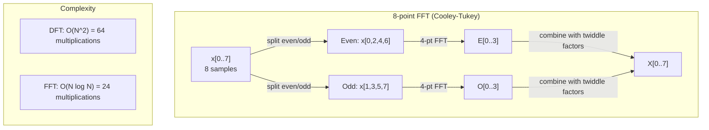
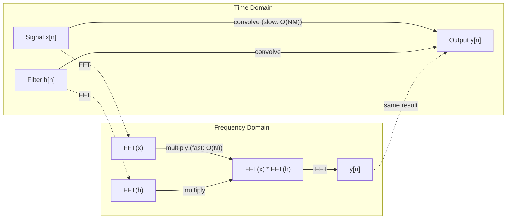

# Fourier 变换

> 每个信号都是正弦波之和。Fourier 变换会告诉你，其中有哪些正弦波。

**Type:** Build
**Language:** Python
**Prerequisites:** 阶段 1，第 01-04 课、第 19 课（复数）
**Time:** ~90 分钟

## 学习目标

- 从零实现 DFT，并用复杂度为 O(N log N) 的 Cooley-Tukey FFT 验证结果
- 解释频率系数：从信号中提取幅度、相位和功率谱
- 应用卷积定理，通过 FFT 结果相乘来完成卷积
- 将 Fourier 频率分解与 Transformer 位置编码、CNN 卷积层联系起来

## 要解决的问题

音频录音是一串随时间变化的声压测量值。股票价格是一串随日期变化的数值。图像则是空间中像素强度构成的网格。它们都是时域（或空域）数据，你看到的是数值随某个索引变化。

但许多模式在时域中看不出来。这段音频是纯音，还是和弦？这支股票的价格是否存在一周的周期？这张图像是否有重复纹理？这些问题关注的是频率成分，而时域把这些信息隐藏了起来。

Fourier 变换（傅里叶变换）将数据从时域转换到频域。它把信号分解成频率不同的正弦波。每个正弦波都有幅度（amplitude，表示有多强）和相位（phase，表示从哪里开始），Fourier 变换能告诉你这两者。

这对机器学习（ML）很重要，因为频域思维无处不在。卷积神经网络进行卷积，而卷积在频域中对应乘法。Transformer 位置编码用频率分解来表示位置。音频模型，例如语音识别和音乐生成模型，处理的是频谱图，也就是声音的频率表示。时间序列模型寻找周期性模式。理解 Fourier 变换，能让你掌握处理这些问题所需的基本概念。

## 核心概念

### DFT 的定义

给定 N 个采样点 x[0], x[1], ..., x[N-1]，离散 Fourier 变换（Discrete Fourier Transform，DFT）会得到 N 个频率系数 X[0], X[1], ..., X[N-1]：

```text
X[k] = sum_{n=0}^{N-1} x[n] * e^(-2*pi*i*k*n/N)

for k = 0, 1, ..., N-1
```

每个 X[k] 都是复数。它的模（magnitude）|X[k]| 告诉你频率 k 的幅度，相位 angle(X[k]) 则告诉你该频率的相位偏移。

关键认识是：`e^(-2*pi*i*k*n/N)` 是一个以频率 k 旋转的相量。DFT 计算信号与 N 个等间隔频率各自的相关性。如果信号在频率 k 处包含能量，相关性就大；否则就接近零。

### 各个系数的含义

**X[0]：直流分量（DC）。** 它是所有采样值之和，与均值成正比，表示信号的恒定偏移，也就是零频率偏移。

```text
X[0] = sum_{n=0}^{N-1} x[n] * e^0 = sum of all samples
```

**当 1 <= k <= N/2 时，X[k] 对应正频率。** X[k] 表示每 N 个采样点中有 k 个周期的频率。k 越大，频率越高，振荡也越快。

**X[N/2]：Nyquist 频率。** 这是用 N 个采样点能够表示的最高频率。超过这个频率，就会发生混叠（aliasing），也就是高频伪装成低频。

**当 N/2 < k < N 时，X[k] 对应负频率。** 对于实值信号，X[N-k] = conj(X[k])。负频率是正频率的镜像，因此有用的信息位于前 N/2 + 1 个系数中。

### 逆 DFT

逆 DFT 根据频率系数重构原始信号：

```text
x[n] = (1/N) * sum_{k=0}^{N-1} X[k] * e^(2*pi*i*k*n/N)

for n = 0, 1, ..., N-1
```

与正向 DFT 的区别只有两点：指数中的符号为正，而不是负；此外还有一个 1/N 归一化因子。

逆 DFT 能够完美重构，不会丢失任何信息。你可以从时域转换到频域，再转换回来，而不产生任何误差。DFT 本质上是换基：用另一套坐标系重新表达同样的信息。

### FFT：让计算更快

按上述定义计算 DFT，复杂度为 O(N^2)：对于 N 个输出系数中的每一个，都需要对 N 个输入采样点求和。当 N = 1 million（百万）时，就需要 10^12 次运算。

快速 Fourier 变换（Fast Fourier Transform，FFT）只需 O(N log N) 就能计算出相同结果。当 N = 1 million（百万）时，需要的运算次数约为 20 million（百万），而不是 trillion（万亿）次。这让频率分析变得实用。

Cooley-Tukey 算法是最常见的 FFT 算法，它采用分治策略：

1. 将信号拆成偶数索引采样点和奇数索引采样点。
2. 递归计算每一半的 DFT。
3. 使用“旋转因子”（twiddle factors）e^(-2*pi*i*k/N)，合并两个长度减半的 DFT。

```text
X[k] = E[k] + e^(-2*pi*i*k/N) * O[k]          for k = 0, ..., N/2 - 1
X[k + N/2] = E[k] - e^(-2*pi*i*k/N) * O[k]    for k = 0, ..., N/2 - 1

where E = DFT of even-indexed samples
      O = DFT of odd-indexed samples
```

这种对称性意味着每层递归只需要 O(N) 的工作量，而递归一共有 log2(N) 层，因此总复杂度为 O(N log N)。



FFT 要求信号长度为 2 的幂。实际使用时，会通过补零，将信号长度补到下一个 2 的幂。

### 频谱分析

**功率谱（power spectrum）** 为 |X[k]|^2，即每个频率系数的模的平方。它显示各个频率处有多少能量。

**相位谱（phase spectrum）** 为 angle(X[k])，即各个频率的相位偏移。大多数分析任务关心的是功率谱，而忽略相位。

```text
Power at frequency k:  P[k] = |X[k]|^2 = X[k].real^2 + X[k].imag^2
Phase at frequency k:  phi[k] = atan2(X[k].imag, X[k].real)
```

### 频率分辨率

DFT 的频率分辨率取决于采样点数 N 和采样率 fs。

```text
Frequency of bin k:      f_k = k * fs / N
Frequency resolution:    delta_f = fs / N
Maximum frequency:       f_max = fs / 2  (Nyquist)
```

要分辨两个彼此接近的频率，需要更多采样点；要捕获高频，则需要更高的采样率。

### 卷积定理

这是信号处理中最重要的结论之一，与 CNN 也直接相关。

**时域中的卷积，等于频域中的逐点相乘。**

```text
x * h = IFFT(FFT(x) . FFT(h))

where * is convolution and . is element-wise multiplication
```

它的重要性在于：

- 直接对长度分别为 N、M 的两个信号做卷积，需要 O(N*M) 次运算。
- 基于 FFT 的卷积只需要 O(N log N)：分别变换、相乘，再逆变换。
- 对于大卷积核，FFT 卷积的速度快得多。
- 感受野较大的卷积层中执行的正是这个过程。

注意：DFT 计算的是循环卷积，信号会首尾回绕相接。要得到不发生回绕的线性卷积，需要先将两个信号都补零至长度 N + M - 1，再进行计算。



### 加窗

DFT 假定信号是周期性的，将 N 个采样点视为无限重复信号的一个周期。如果信号起点和终点的值不同，周期边界处就会不连续，从而表现为额外的高频成分，这称为频谱泄漏（spectral leakage）。

加窗（windowing）在计算 DFT 之前，将信号两端逐渐压低至零，以减少泄漏。

常见的窗函数：

| 窗函数 | 形状 | 主瓣宽度 | 旁瓣电平 | 适用场景 |
|--------|-------|----------------|-----------------|----------|
| 矩形窗 | 平坦（不加窗） | 最窄 | 最高（-13 dB） | 信号在 N 个采样点内恰好具有周期性时 |
| Hann | 升余弦 | 中等 | 低（-31 dB） | 通用频谱分析 |
| Hamming | 修正余弦 | 中等 | 更低（-42 dB） | 音频处理、语音分析 |
| Blackman | 三项余弦 | 宽 | 很低（-58 dB） | 旁瓣抑制至关重要时 |

```text
Hann window:    w[n] = 0.5 * (1 - cos(2*pi*n / (N-1)))
Hamming window: w[n] = 0.54 - 0.46 * cos(2*pi*n / (N-1))
```

在 DFT 之前，将窗函数与信号逐元素相乘来完成加窗：`X = DFT(x * w)`。

### DFT 的性质

| 性质 | 时域 | 频域 |
|----------|-------------|-----------------|
| 线性性 | a*x + b*y | a*X + b*Y |
| 时移 | x[n - k] | X[f] * e^(-2*pi*i*f*k/N) |
| 频移 | x[n] * e^(2*pi*i*f0*n/N) | X[f - f0] |
| 卷积 | x * h | X * H（逐点相乘） |
| 乘法 | x * h（逐点相乘） | X * H（循环卷积，乘以缩放因子 1/N） |
| Parseval 定理 | sum \|x[n]\|^2 | (1/N) * sum \|X[k]\|^2 |
| 共轭对称性（实数输入） | x[n] 为实数 | X[k] = conj(X[N-k]) |

Parseval 定理表明，两个域中的总能量相同。能量在变换过程中守恒。

### 与位置编码的联系

最初的 Transformer 使用正弦位置编码：

```text
PE(pos, 2i)   = sin(pos / 10000^(2i/d_model))
PE(pos, 2i+1) = cos(pos / 10000^(2i/d_model))
```

每对维度 (2i, 2i+1) 都以不同的频率振荡。频率按几何级数间隔排列，从高频（维度 0,1）逐渐变为低频（最后几个维度）。这让每个位置都在所有频带上形成一种独特模式，类似于 Fourier 系数能够唯一确定一个信号。

这带来了以下关键性质：

- **唯一性：** 不存在编码相同的两个位置。
- **有界值：** sin 和 cos 的取值始终在 [-1, 1] 内。
- **相对位置：** 位置 p+k 的编码可以表示为位置 p 编码的线性函数，因此模型可以学习关注相对位置。

### 与 CNN 的联系

卷积层将学习得到的滤波器（卷积核）在信号或图像上滑动，从而应用于输入。从数学上说，这就是卷积运算。

根据卷积定理，这等价于：
1. 对输入做 FFT
2. 对卷积核做 FFT
3. 在频域中相乘
4. 对结果做 IFFT

标准 CNN 实现使用直接卷积，因为它对较小的 3x3 卷积核更快。但对于大卷积核或全局卷积，基于 FFT 的方法明显更快。一些架构，例如 FNet，用 FFT 完全替代注意力，将复杂度从 O(N^2) 降为 O(N log N)，同时取得有竞争力的准确率。

### 频谱图与短时 Fourier 变换

一次 FFT 可以给出整个信号的频率成分，却无法告诉你这些频率出现在什么时间。啁啾信号（chirp，频率随时间升高的信号）与和弦（所有频率同时出现）可以具有相同的幅度谱。

短时 Fourier 变换（Short-Time Fourier Transform，STFT）对信号的重叠窗口分别计算 FFT，从而解决这个问题。结果就是频谱图：一个 2D（二维）表示，一个轴是时间，另一个轴是频率，每个点的强度显示相应时刻、相应频率处的能量。

```text
STFT procedure:
1. Choose a window size (e.g., 1024 samples)
2. Choose a hop size (e.g., 256 samples -- 75% overlap)
3. For each window position:
   a. Extract the windowed segment
   b. Apply a Hann/Hamming window
   c. Compute FFT
   d. Store the magnitude spectrum as one column of the spectrogram
```

频谱图是音频 ML 模型的标准输入表示。语音识别模型（Whisper、DeepSpeech）处理 mel 频谱图，其中频率被映射到 mel 尺度（梅尔频率尺度），以更好地匹配人类的音高感知。

### 混叠

如果信号包含高于 fs/2（Nyquist 频率）的频率，以 fs 采样就会产生混叠副本。一个以 100 Hz 采样的 90 Hz 信号，看起来与 10 Hz 信号完全相同。仅凭这些采样值，无法区分两者。

```text
Example:
  True signal: 90 Hz sine wave
  Sampling rate: 100 Hz
  Apparent frequency: 100 - 90 = 10 Hz

  The samples from the 90 Hz signal at 100 Hz sampling rate
  are identical to the samples from a 10 Hz signal.
  No amount of math can recover the original 90 Hz.
```

因此，模数转换器会配备抗混叠滤波器，在采样前滤除高于 Nyquist 频率的成分。在 ML 中，如果对特征图下采样时没有进行适当的低通滤波，就会发生混叠；一些架构通过抗混叠池化层来处理这一问题。

### 补零不会提高分辨率

一个常见误解是，在 FFT 前给信号补零可以提高频率分辨率。事实并非如此。补零只是在已有频点（frequency bin）之间进行插值，让频谱看起来更平滑，但无法揭示原始采样值中不存在的频率细节。

真正的频率分辨率只取决于观测时长 T = N / fs。要分辨相差 delta_f 的两个频率，至少需要 T = 1 / delta_f 秒的数据。补再多零，也无法改变这个基本限制。

```figure
fourier-synthesis
```

## 动手实现

### 步骤 1：从零实现 DFT

复杂度为 O(N^2) 的 DFT 可以直接按定义实现。

```python
import math

class Complex:
    ...

def dft(x):
    N = len(x)
    result = []
    for k in range(N):
        total = Complex(0, 0)
        for n in range(N):
            angle = -2 * math.pi * k * n / N
            w = Complex(math.cos(angle), math.sin(angle))
            xn = x[n] if isinstance(x[n], Complex) else Complex(x[n])
            total = total + xn * w
        result.append(total)
    return result
```

### 步骤 2：逆 DFT

结构相同，将指数中的符号改为正，再除以 N。

```python
def idft(X):
    N = len(X)
    result = []
    for n in range(N):
        total = Complex(0, 0)
        for k in range(N):
            angle = 2 * math.pi * k * n / N
            w = Complex(math.cos(angle), math.sin(angle))
            total = total + X[k] * w
        result.append(Complex(total.real / N, total.imag / N))
    return result
```

### 步骤 3：FFT（Cooley-Tukey）

递归 FFT 要求长度为 2 的幂。先拆分奇偶索引，再递归计算，最后用旋转因子合并。

```python
def fft(x):
    N = len(x)
    if N <= 1:
        return [x[0] if isinstance(x[0], Complex) else Complex(x[0])]
    if N % 2 != 0:
        return dft(x)

    even = fft([x[i] for i in range(0, N, 2)])
    odd = fft([x[i] for i in range(1, N, 2)])

    result = [Complex(0)] * N
    for k in range(N // 2):
        angle = -2 * math.pi * k / N
        twiddle = Complex(math.cos(angle), math.sin(angle))
        t = twiddle * odd[k]
        result[k] = even[k] + t
        result[k + N // 2] = even[k] - t
    return result
```

### 步骤 4：频谱分析辅助函数

```python
def power_spectrum(X):
    return [xk.real ** 2 + xk.imag ** 2 for xk in X]

def convolve_fft(x, h):
    N = len(x) + len(h) - 1
    padded_N = 1
    while padded_N < N:
        padded_N *= 2

    x_padded = x + [0.0] * (padded_N - len(x))
    h_padded = h + [0.0] * (padded_N - len(h))

    X = fft(x_padded)
    H = fft(h_padded)

    Y = [xk * hk for xk, hk in zip(X, H)]

    y = idft(Y)
    return [y[n].real for n in range(N)]
```

## 实际使用

实际工作中，使用 numpy 的 FFT，它底层依托高度优化的 C 库。

```python
import numpy as np

signal = np.sin(2 * np.pi * 5 * np.arange(256) / 256)
spectrum = np.fft.fft(signal)
freqs = np.fft.fftfreq(256, d=1/256)

power = np.abs(spectrum) ** 2

positive_freqs = freqs[:len(freqs)//2]
positive_power = power[:len(power)//2]
```

用于加窗与更高级的频谱分析：

```python
from scipy.signal import windows, stft

window = windows.hann(256)
windowed = signal * window
spectrum = np.fft.fft(windowed)
```

用于卷积：

```python
from scipy.signal import fftconvolve

result = fftconvolve(signal, kernel, mode='full')
```

用于频谱图：

```python
from scipy.signal import stft

frequencies, times, Zxx = stft(signal, fs=sample_rate, nperseg=256)
spectrogram = np.abs(Zxx) ** 2
```

频谱图矩阵的形状为 (n_frequencies, n_time_frames)。每一列对应一个时间窗口的功率谱，这正是音频 ML 模型使用的输入。

## 交付成果

运行 `code/fourier.py`，生成 `outputs/prompt-spectral-analyzer.md`。

## 练习

1. **识别纯音。** 创建一个仅包含单个正弦波的信号，频率未知，介于 1 到 50 Hz 之间，以 128 Hz 采样 1 秒。用 DFT 识别频率，并验证结果是否一致。然后加入标准差为 0.5 的 Gaussian 噪声，再做一次。噪声如何影响频谱？

2. **FFT 与 DFT 验证。** 生成长度为 64 的随机信号，分别计算 DFT（O(N^2)）和 FFT，验证所有系数的差异都在 1e-10 以内。分别测量两种函数处理长度为 256、512、1024、2048 的信号所需的时间，并绘制 DFT 耗时与 FFT 耗时之比。

3. **用实例验证卷积定理。** 创建信号 x = [1, 2, 3, 4, 0, 0, 0, 0] 和滤波器 h = [1, 1, 1, 0, 0, 0, 0, 0]。先通过嵌套循环直接计算它们的循环卷积，再通过 FFT 计算（变换、相乘、逆变换），验证结果一致。然后适当补零，计算线性卷积。

4. **加窗的影响。** 创建一个信号，由频率非常接近的 10 Hz 和 12 Hz 两个正弦波相加而成，以 128 Hz 采样 1 秒。分别在不加窗、加 Hann 窗和加 Hamming 窗时计算功率谱。哪一种窗最容易区分两个峰？为什么？

5. **位置编码分析。** 生成 d_model = 128、max_pos = 512 的正弦位置编码。对每一对位置 (p1, p2)，计算编码的点积，展示点积只依赖 |p1 - p2|，而不依赖绝对位置。随着距离增加，点积会发生什么变化？

## 关键术语

| 术语 | 含义 |
|------|---------------|
| DFT（离散 Fourier 变换） | 将 N 个时域采样点转换为 N 个频域系数。每个系数都是信号与相应频率复正弦波的相关值 |
| FFT（快速 Fourier 变换） | 以 O(N log N) 复杂度计算 DFT 的算法。Cooley-Tukey 算法递归拆分奇偶索引 |
| 逆 DFT | 根据频率系数重构时域信号。公式与 DFT 相同，但指数符号相反，且乘以 1/N |
| 频点 | DFT 输出中的每个索引 k 都表示频率 k*fs/N Hz。“频点”就是离散的频率位置 |
| 直流分量 | X[0]，零频率系数，与信号均值成正比 |
| Nyquist 频率 | fs/2，在采样率 fs 下能表示的最高频率；高于此值的频率会发生混叠 |
| 功率谱 | \|X[k]\|^2，即每个频率系数的模的平方，表示能量在各个频率上的分布 |
| 相位谱 | angle(X[k])，每个频率分量的相位偏移，在分析中经常被忽略 |
| 频谱泄漏 | 将非周期信号视为周期信号而产生的额外频率成分，可通过加窗减少 |
| 窗函数 | 在 DFT 之前应用的渐变函数（Hann、Hamming、Blackman），用于减少频谱泄漏 |
| 旋转因子 | 复指数 e^(-2*pi*i*k/N)，用于 FFT 蝶形运算中合并子 DFT |
| 卷积定理 | 时域中的卷积等于频域中的逐点相乘，是信号处理与 CNN 的基础 |
| 循环卷积 | 信号首尾回绕相接的卷积，是 DFT 自然计算出的卷积形式 |
| 线性卷积 | 不发生回绕的标准卷积，可以在 DFT 之前补零来实现 |
| Parseval 定理 | Fourier 变换保持总能量不变，sum \|x[n]\|^2 = (1/N) sum \|X[k]\|^2 |
| 混叠 | 采样率不足时，高于 Nyquist 的频率表现为较低频率的现象 |

## 延伸阅读

- [Cooley 与 Tukey：复 Fourier 级数的机器计算算法（1965）](https://www.ams.org/journals/mcom/1965-19-090/S0025-5718-1965-0178586-1/) - 改变计算领域的 FFT 原始论文
- [3Blue1Brown：Fourier 变换到底是什么？](https://www.youtube.com/watch?v=spUNpyF58BY) - Fourier 变换的最佳可视化入门
- [Lee-Thorp 等：FNet：用 Fourier 变换混合 token（2021）](https://arxiv.org/abs/2105.03824) - 在 Transformer 中用 FFT 替代自注意力
- [Smith：科学家与工程师的数字信号处理指南](http://www.dspguide.com/) - 免费在线教材，深入介绍 FFT、加窗与频谱分析
- [Vaswani 等：Attention Is All You Need（2017）](https://arxiv.org/abs/1706.03762) - 由 Fourier 频率分解导出的正弦位置编码
- [Radford 等：Whisper（2022）](https://arxiv.org/abs/2212.04356) - 以 mel 频谱图为输入表示的语音识别
