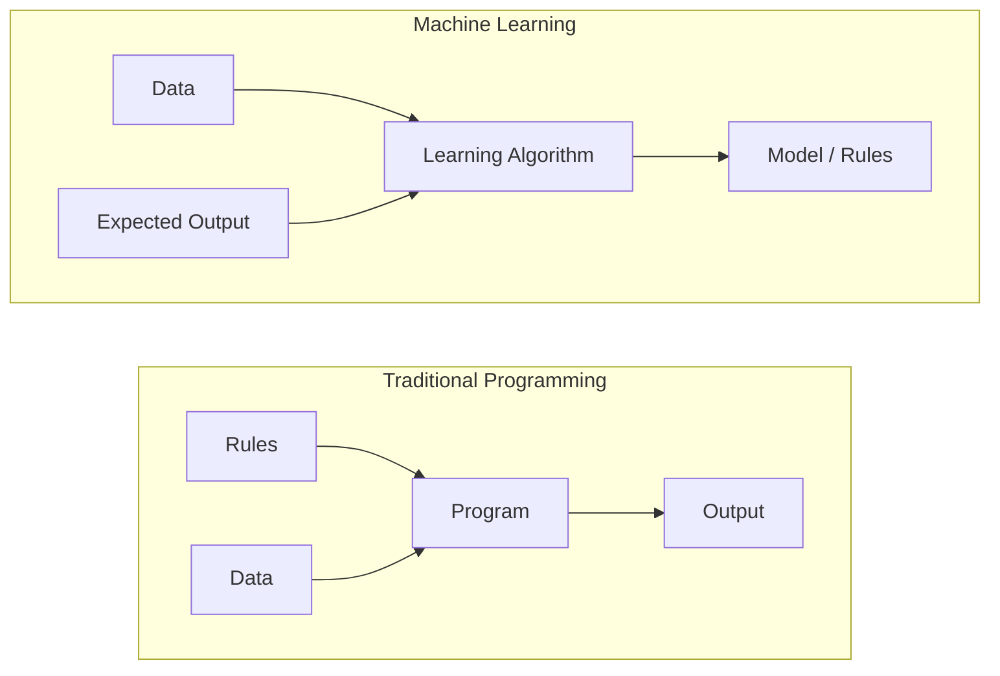
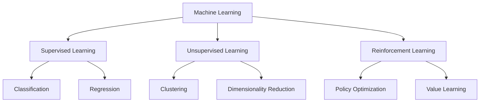
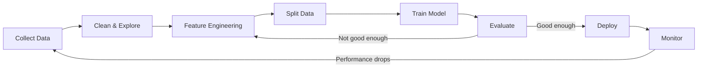
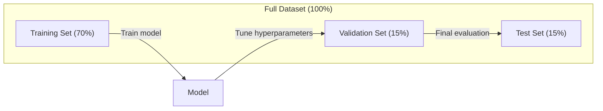
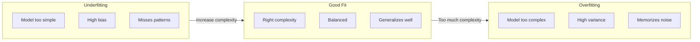
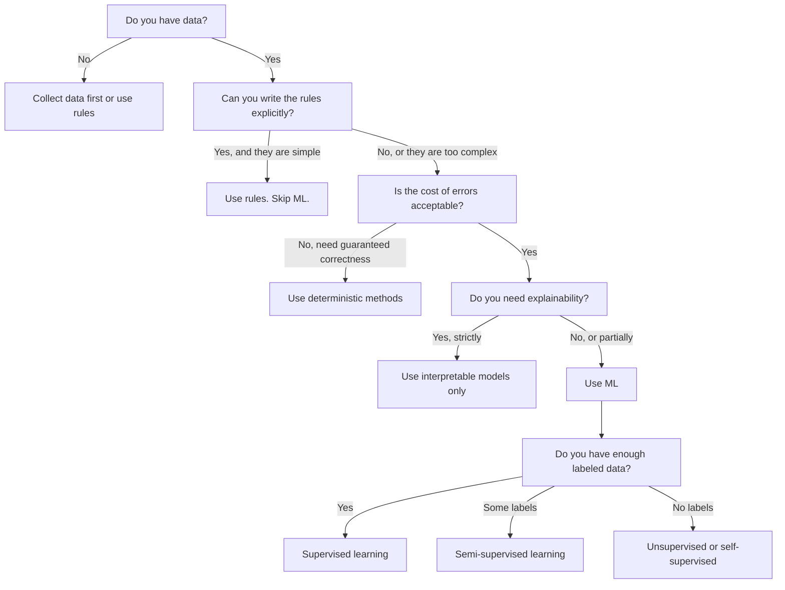

# 什么是机器学习

> 机器学习让计算机从数据中发现模式，而不是由人手工编写规则。

**Type:** Learn
**Languages:** Python
**Prerequisites:** 阶段 1（数学基础）
**Time:** ~45 分钟

## 学习目标

- 解释监督学习、无监督学习和强化学习的区别，并判断给定问题适合哪一种
- 从零实现最近质心分类器，并将它与随机基线比较评估
- 区分分类任务和回归任务，并分别选择合适的损失函数
- 判断一个业务问题是否适合机器学习（ML），还是用确定性规则更好

## 要解决的问题

你想做一个垃圾邮件过滤器。传统做法是坐下来编写几百条规则：“如果邮件包含‘FREE MONEY’，就标记为垃圾邮件；如果感叹号超过 3 个，就标记为垃圾邮件。”你花了数周编写规则，随后垃圾邮件发送者换了措辞，规则便失效了。你再写更多规则，如此循环，永无止境。

机器学习把这个过程反过来。你不再编写规则，而是给计算机几千封已标注的邮件（“垃圾邮件”或“非垃圾邮件”），让它自行找出规则。计算机会发现你从未想到的模式。当垃圾邮件发送者改变手法时，你用新数据重新训练，而不必重写代码。

从“编写规则”转向“从数据中学习”，就是机器学习的核心。推荐引擎、语音助手、自动驾驶汽车和语言模型都以这种方式工作。

## 核心概念

### 从数据中学习，而不是编写规则

传统编程和机器学习以相反的方向解决问题。



传统编程：你编写规则，程序把规则应用于数据，产生输出。

机器学习：你提供数据和预期输出，由算法发现规则。

训练产生的“模型”本身就是规则，只是以数值（权重、参数）的形式编码。它从见过的示例中泛化，对从未见过的数据作出预测。

### 机器学习的三种类型



**监督学习**：你拥有输入与输出的配对数据，模型学习从输入到输出的映射。
- “这里有 10,000 张标注为猫或狗的照片，学会区分它们。”
- “这里有房屋的特征和价格，学会预测价格。”

**无监督学习**：你只有输入，没有标签，模型自行发现结构。
- “这里有 10,000 份客户购买记录，找出自然形成的分组。”
- “这里有 1,000 维的数据点，在保留结构的同时降到 2 维。”

**强化学习**：智能体（agent）在环境中采取动作，获得奖励或惩罚。它学习一种策略（policy），使总奖励最大化。
- “玩这个游戏，获胜得 +1，失败得 -1，找出一种策略。”
- “控制这个机械臂，拿起物体得 +1，每浪费一秒得 -0.01。”

实际工作中，你构建的大多数系统都使用监督学习。无监督学习常用于预处理和探索。强化学习支撑着游戏 AI、机器人技术，以及语言模型的 RLHF。

### 三大类型之外

上面的三类划分很清晰，但实际机器学习中的界线往往没有这么分明。

**半监督学习**使用少量有标签数据和大量无标签数据。例如，你可能有 100 张已标注的医学图像，以及 100,000 张未标注的图像。相关方法包括：

- **标签传播：** 构建连接相似数据点的图，标签沿着图从已标注节点传播到未标注的相邻节点。
- **伪标签：** 用有标签数据训练模型，再用它预测无标签数据的标签，然后用全部数据重新训练。模型借助自身预测扩充自己的训练集。
- **一致性正则化：** 模型对一个输入及其轻微扰动版本应给出相同预测。即使没有标签，这种方法也能奏效。

**自监督学习**从数据自身构造监督信号，完全不需要人工标签。模型利用数据结构构造自己的预测任务。

- **掩码语言建模（BERT）：** 隐藏句子中 15% 的词，训练模型预测缺失的词。“标签”来自原始文本。
- **对比学习（SimCLR）：** 取一张图像，生成两个数据增强版本。训练模型识别它们来自同一张图像，同时把它们与其他图像的增强版本区分开。
- **下一 token（词元）预测（GPT）：** 根据前面的所有词预测下一个词。每篇文本文档都能成为训练示例。

这些并不是独立于三大类型的新类别，而是结合监督与无监督思想的策略。自监督学习在技术上属于监督学习（模型要预测某个目标），只是标签是自动生成的，而非人工提供。

### 分类与回归

这是两种主要的监督学习任务。

| 方面 | 分类 | 回归 |
|--------|---------------|------------|
| 输出 | 离散类别 | 连续数值 |
| 示例 | “这封邮件是垃圾邮件吗？” | “这所房子的价格会是多少？” |
| 输出空间 | {cat, dog, bird} | 任意实数 |
| 损失函数 | 交叉熵（cross-entropy）、准确率 | 均方误差、平均绝对误差（MAE） |
| 决策 | 类别之间的边界 | 拟合数据的曲线 |

分类回答“属于哪一类？”，回归回答“有多少？”。

有些问题可以用这两种方式中的任意一种来表述。预测股票上涨还是下跌是分类，预测具体价格则是回归。

### ML 工作流程

无论使用哪种算法，每个机器学习项目都遵循同一套流水线。



**收集数据**：获取原始数据。更多的数据几乎总是更好，但质量比数量更重要。

**清洗与探索**：处理缺失值、删除重复项、可视化分布并发现异常。这一步通常占项目总时间的 60-80%。

**特征工程**：将原始数据转换为模型可用的特征。例如，将日期转换成星期几，对数值列做归一化，对类别变量做编码。好的特征比花哨的算法更重要。

**划分数据**：分为训练集、验证集和测试集。模型在训练数据上训练，你在验证数据上调整超参数，并在测试数据上报告最终性能。

**训练模型**：将训练数据输入算法。算法调整内部参数，使损失函数最小化。

**评估**：在验证/测试数据上衡量性能。如果性能不能接受，就返回前面的步骤，尝试不同的特征、算法或超参数。

**部署**：将模型投入生产环境，让它对新数据作出预测。

**监控**：持续跟踪性能。数据分布会改变（数据漂移），模型性能会下降。性能下降时就重新训练。

### 训练集、验证集与测试集的划分

这是初学者最容易理解错、也最重要的概念。必须用模型在训练时从未见过的数据来评估它，否则衡量的是记忆，而不是学习。



| 数据划分 | 用途 | 使用时间 | 典型占比 |
|-------|---------|-----------|-------------|
| 训练集 | 模型从这些数据中学习 | 训练期间 | 60-80% |
| 验证集 | 调整超参数、比较模型 | 每次训练完成后 | 10-20% |
| 测试集 | 最终的无偏性能估计 | 最后只用一次 | 10-20% |

测试集必须严格保留，只查看一次。如果你不断根据测试性能调整模型，实际上就是在测试集上训练，报告的数字也就失去了意义。

小数据集可使用 k 折交叉验证：将数据分成 k 份，用 k-1 份训练，在剩余一份上验证，轮换各份并对结果取平均。

### 过拟合与欠拟合



**欠拟合**：模型过于简单，无法捕捉数据中的模式，就像试图用直线拟合曲线关系。训练误差高，测试误差也高。

**过拟合**：模型过于复杂，记住了训练数据，连其中的噪声也一起记住了。就像一条穿过所有训练点的弯曲曲线，却无法处理新数据。训练误差低，测试误差高。

**良好拟合**：模型捕捉真实模式，而不记忆噪声。训练误差和测试误差都比较低。

过拟合的迹象：
- 训练准确率远高于验证准确率
- 模型在训练数据上表现良好，在新数据上却很差
- 增加训练数据可以改善性能（模型此前是在记忆，而不是学习）

缓解过拟合的方法：
- 获取更多训练数据
- 降低模型复杂度（减少参数、简化架构）
- 正则化（为较大的权重增加惩罚）
- Dropout（在训练时随机将神经元置零）
- 早停（验证误差开始上升时停止训练）

缓解欠拟合的方法：
- 使用更复杂的模型
- 增加特征
- 减弱正则化
- 延长训练时间

### 偏差与方差的权衡

这是过拟合与欠拟合背后的数学框架。

**偏差**：由模型中的错误假设带来的误差。当真实关系非线性时，线性模型的偏差较高。高偏差导致欠拟合。

**方差**：由模型对训练数据微小波动的敏感性带来的误差。高方差模型在不同数据子集上训练时，预测结果会很不相同。高方差导致过拟合。

| 模型复杂度 | 偏差 | 方差 | 结果 |
|-----------------|------|----------|--------|
| 过低（用线性模型拟合曲线数据） | 高 | 低 | 欠拟合 |
| 恰到好处 | 中 | 中 | 泛化良好 |
| 过高（用20次多项式拟合10个点） | 低 | 高 | 过拟合 |

总误差分解：Total error = Bias^2 + Variance + Irreducible noise

不可约噪声无法减少，因为它就是数据本身的随机性。你要找到使 bias^2 + variance 最小的最佳平衡点。

### 没有免费午餐定理

没有哪一种算法对所有问题都最好。在一类问题上表现良好的算法，会在另一类问题上表现不佳。这就是数据科学家会尝试多种算法并比较结果的原因。

实际选择取决于：
- 你有多少数据
- 有多少特征
- 关系是线性的还是非线性的
- 是否需要可解释性
- 你能承担多少计算开销

### 哪些情况下不应使用机器学习

机器学习很强大，但不一定总是合适的工具。在着手使用模型之前，先问自己是否真的需要它。

**以下情况不要使用 ML：**

- **规则简单而明确。** 例如税额计算、排序算法、单位换算。如果用几条 if 语句就能写清逻辑，模型只会增加复杂度，并无收益。
- **没有数据，或数据非常少。** 机器学习需要从示例中学习。只有 10 个数据点时，训练不出任何有意义的东西，应先收集数据。
- **错误的代价是灾难性的，而且必须保证正确。** 例如药物剂量计算、核反应堆控制、密码学校验。ML 模型具有概率性，有时会出错。如果无法接受“有时出错”，就使用确定性方法。
- **查找表或启发式方法已经能解决问题。** 如果一个简单阈值或表格能覆盖 99% 的情况，增加 ML 只会提高维护成本，而没有实质改善。
- **无法解释决策，而任务要求可解释性。** 贷款、保险、刑事司法等受监管领域有时要求每个决策都能得到完整解释。有些 ML 模型是可解释的（线性回归、小型决策树），但大多数不是。
- **问题变化的速度比重新训练更快。** 如果规则每天都变，而重新训练需要一周，模型就始终处于过时状态。

可使用下面的决策流程图：



```figure
f3-learning-boundary
```

## 动手实现

`code/ml_intro.py` 中的代码从零实现最近质心分类器，这是最简单的 ML 算法。它展示了核心思想：先从数据中学习，再对新数据作出预测。

### 步骤 1：从零实现最近质心分类器

最近质心分类器计算训练数据中每个类别的中心（均值）。预测时，它把每个新数据点分到中心离它最近的类别。

```python
class NearestCentroid:
    def fit(self, X, y):
        self.classes = np.unique(y)
        self.centroids = np.array([
            X[y == c].mean(axis=0) for c in self.classes
        ])

    def predict(self, X):
        distances = np.array([
            np.sqrt(((X - c) ** 2).sum(axis=1))
            for c in self.centroids
        ])
        return self.classes[distances.argmin(axis=0)]
```

这就是整个算法。拟合计算两个均值，预测计算距离。没有梯度下降，没有迭代，也没有超参数。

### 步骤 2：用合成数据训练

我们生成一个 2D 分类数据集，其中两个类别稍有重叠。质心分类器在类别中心之间划出线性决策边界。

```python
rng = np.random.RandomState(42)
X_class0 = rng.randn(100, 2) + np.array([1.0, 1.0])
X_class1 = rng.randn(100, 2) + np.array([-1.0, -1.0])
X = np.vstack([X_class0, X_class1])
y = np.array([0] * 100 + [1] * 100)
```

### 步骤 3：与基线比较

每个 ML 模型都应该与一个简单基线比较。这里的基线随机预测一个类别。如果 ML 模型连随机猜测都比不过，就说明某处出了问题。

```python
baseline_preds = rng.choice([0, 1], size=len(y_test))
baseline_acc = np.mean(baseline_preds == y_test)
```

在这个干净的数据集上，质心分类器的准确率应达到约 90%+，随机基线则约为 50%。

### 为什么这很重要

最近质心分类器极其简单，没有超参数、迭代或梯度下降，却体现了 ML 的基本模式：

1. 从训练数据中**学习**一种表示（质心）
2. 用这种表示对新数据进行**预测**（最近距离）
3. 对照基线进行**评估**（随机猜测）

从逻辑回归到 Transformer，每种 ML 算法都遵循这三个步骤。表示会变得更复杂，但工作流程不变。

### 步骤 4：质心分类器做不到什么

最近质心分类器假设每个类别形成单个点团，并划出线性决策边界。以下情况会使它失效：

- 类别包含多个簇（例如，数字“1”有好几种不同写法）
- 决策边界是非线性的（例如，一个类别包围另一个类别）
- 特征的尺度差异很大（距离由尺度最大的特征主导）

这些局限引出了后面要学的其他算法。K 近邻处理多个簇，决策树处理非线性边界，特征缩放解决尺度问题。每一课都以前一课的局限为起点。

## 实际使用

sklearn 提供了 `NearestCentroid` 和合成数据生成器：

```python
from sklearn.neighbors import NearestCentroid
from sklearn.datasets import make_classification
from sklearn.model_selection import train_test_split

X, y = make_classification(
    n_samples=500, n_features=2, n_redundant=0,
    n_clusters_per_class=1, random_state=42
)
X_train, X_test, y_train, y_test = train_test_split(X, y, test_size=0.3)

clf = NearestCentroid()
clf.fit(X_train, y_train)
print(f"Accuracy: {clf.score(X_test, y_test):.3f}")
```

## 交付成果

本课产出 `outputs/prompt-ml-problem-framer.md`，这是一个把模糊业务问题转化为具体 ML 任务的提示词（prompt）。给它一个问题描述（例如“我们想降低客户流失率”或“预测下个季度的需求”），它会识别学习类型、定义预测目标、列出候选特征、选择成功指标、建立基线，并指出数据泄漏或类别不平衡等隐患。在任何 ML 项目开始时使用它，避免做出不符合需求的东西。

## 关键术语

| 术语 | 常见说法 | 实际含义 |
|------|----------------|----------------------|
| 模型 | “那个 AI” | 具有可学习参数、把输入映射为输出的数学函数 |
| 训练 | “教 AI” | 运行优化算法以调整模型参数，使预测与已知输出相符 |
| 特征 | “一个输入列” | 模型用来预测的数据可测量属性 |
| 标签 | “答案” | 训练示例的已知输出，用来计算误差信号 |
| 超参数 | “你调整的一个设置” | 训练前设定、控制学习过程的参数（学习率、层数） |
| 损失函数 | “模型错得有多严重” | 衡量预测输出与实际输出之间差距的函数，训练试图使它最小化 |
| 过拟合 | “它把考试背下来了” | 模型学到了训练数据特有的噪声，而不是一般模式，因此在新数据上失效 |
| 欠拟合 | “它什么也没学会” | 模型过于简单，无法捕捉数据中的真实模式 |
| 泛化 | “在新数据上也能用” | 模型对未参与训练的数据作出准确预测的能力 |
| 交叉验证 | “换着数据块测试” | 反复将数据划分为训练/测试折并对结果取平均，从而得到更稳健的性能估计 |
| 正则化 | “让权重小一点” | 在损失函数中增加惩罚项，抑制过于复杂的模型 |
| 数据漂移 | “世界变了” | 输入数据的统计分布随时间发生变化，使模型性能下降 |

## 练习

1. 选取任意数据集（例如 Iris、Titanic），按 70/15/15 划分训练集/验证集/测试集。解释为什么不应在测试集上调整超参数。
2. 列出三个实际问题。对每个问题，判断它属于分类、回归还是聚类，以及监督学习还是无监督学习。
3. 一个模型在训练数据上的准确率为 99%，在测试数据上却只有 60%。诊断问题，并列出三种你会尝试的解决办法。

## 延伸阅读

- [An Introduction to Statistical Learning](https://www.statlearning.com/) - 免费教材，用实用示例覆盖所有经典 ML 方法
- [Google 机器学习速成课程](https://developers.google.com/machine-learning/crash-course) - 简明、直观的 ML 概念入门
- [Scikit-learn 用户指南](https://scikit-learn.org/stable/user_guide.html) - 用 Python 实现 ML 的实用参考
