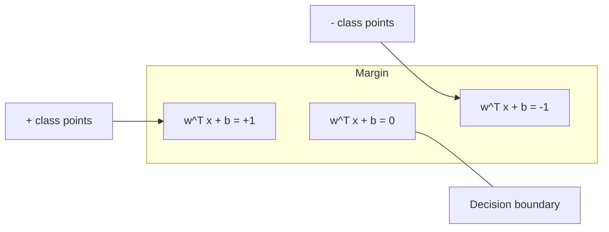
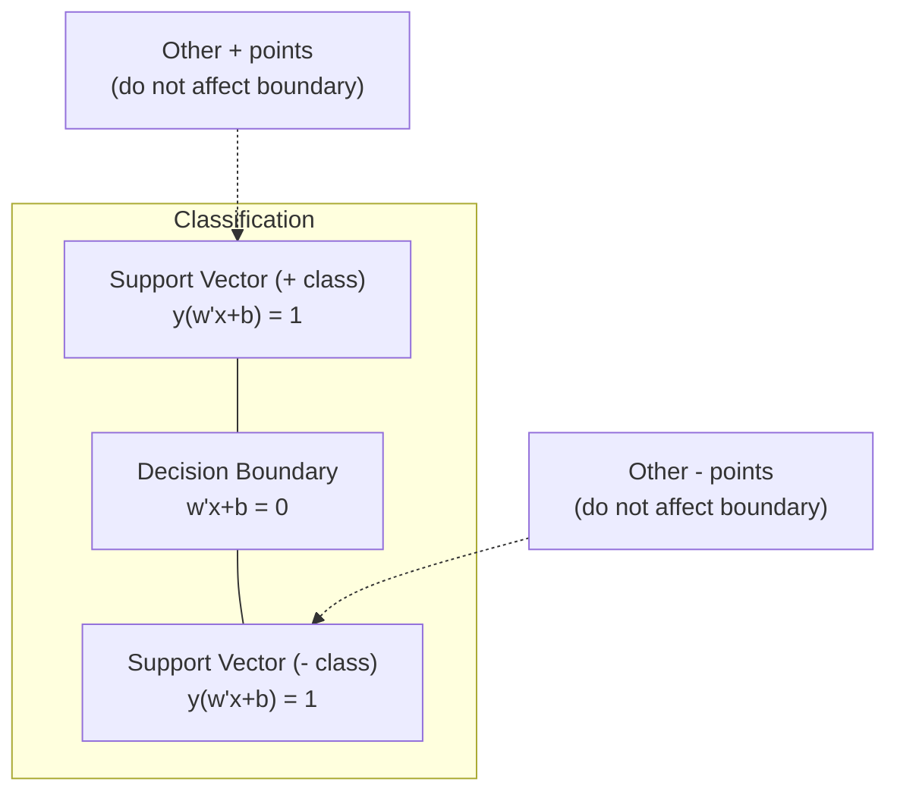
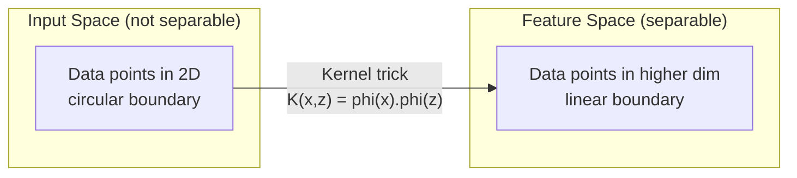

# 支持向量机

> 找出两个类别之间最宽的街道。全部思路就是这么简单。

**Type:** Build
**Language:** Python
**Prerequisites:** 阶段 1（课程 08 优化、14 范数与距离、18 凸优化）
**Time:** ~90 分钟

## 学习目标

- 使用合页损失（hinge loss），在原始形式上进行梯度下降，从零实现线性 SVM
- 解释最大间隔原理，并从训练好的模型中识别支持向量
- 比较线性核、多项式核和 RBF 核，解释核技巧如何避免显式映射到高维空间
- 评估参数 C 所控制的间隔宽度与分类错误之间的权衡

## 要解决的问题

你有两个类别的数据点，需要画一条直线（或一个超平面）将它们分开。可能有无穷多条直线都能做到。你该选哪一条？

选择间隔最大的那一条。间隔（margin）是决策边界与两侧最近数据点之间的距离。间隔越宽，意味着分类器越有把握，对未见数据的泛化也越好。

这一直觉引出了支持向量机（Support Vector Machines，SVM），它是机器学习（ML）中数学形式最优美的算法之一。在深度学习出现之前，SVM 曾是占主导地位的分类方法。对于小数据集、高维数据，以及需要原理清晰、理解充分且具有理论保证的模型的问题，SVM 至今仍是最佳选择。

SVM 与阶段 1 的内容直接相连：它的优化问题是凸的（课程 18），间隔用范数衡量（课程 14），核技巧（kernel trick）则利用点积来处理非线性边界，全程无需在高维空间中直接计算。

## 核心概念

### 最大间隔分类器

给定线性可分的数据，其标签 y_i 属于 {-1, +1}，特征向量为 x_i。我们希望找到一个将两个类别分开的超平面 w^T x + b = 0。

点 x_i 到超平面的距离为：

```text
distance = |w^T x_i + b| / ||w||
```

对于分类正确的点，y_i * (w^T x_i + b) > 0。间隔是超平面到任一侧最近点的距离的两倍。



优化问题如下：

```text
maximize    2 / ||w||     (the margin width)
subject to  y_i * (w^T x_i + b) >= 1  for all i
```

等价地（最小化 ||w||^2 更容易求解）：

```text
minimize    (1/2) ||w||^2
subject to  y_i * (w^T x_i + b) >= 1  for all i
```

这是一个凸二次规划（convex quadratic program，QP）问题，具有唯一的全局解。恰好位于间隔边界上的数据点（即 y_i * (w^T x_i + b) = 1 的点）称为支持向量（support vectors）。只有这些点决定决策边界。移动或移除任何非支持向量的数据点，边界都不会改变。

### 支持向量：关键的少数点



大多数训练点都无关紧要，只有支持向量起作用。这就是 SVM 在预测时节省内存的原因：只需存储支持向量，而不必保存整个训练集。

支持向量的数量还能给出泛化误差的界。相对于数据集大小，支持向量越少，泛化就越好。

### 软间隔：用参数 C 处理噪声

真实数据很少能完美分开。有些点可能落在边界的错误一侧，或者落在间隔内部。软间隔（soft margin）形式通过引入松弛变量（slack variables），允许违反间隔约束。

```text
minimize    (1/2) ||w||^2 + C * sum(xi_i)
subject to  y_i * (w^T x_i + b) >= 1 - xi_i
            xi_i >= 0  for all i
```

松弛变量 xi_i 衡量点 i 违反间隔约束的程度。C 控制如下权衡：

| C 的取值 | 行为 |
|---------|----------|
| 较大的 C | 对违反约束的惩罚很重。间隔窄，误分类少。过拟合 |
| 较小的 C | 允许更多违反约束的情况。间隔宽，误分类多。欠拟合 |

C 与正则化强度呈反向关系。较大的 C = 较弱的正则化。较小的 C = 较强的正则化。

### 合页损失：SVM 的损失函数

软间隔 SVM 可以改写成无约束优化问题：

```text
minimize    (1/2) ||w||^2 + C * sum(max(0, 1 - y_i * (w^T x_i + b)))
```

max(0, 1 - y_i * f(x_i)) 这一项就是合页损失。当一个点分类正确且位于间隔之外时，损失为零；当点位于间隔内部或被错误分类时，损失呈线性变化。

```text
Hinge loss for a single point:

loss
  |
  | \
  |  \
  |   \
  |    \
  |     \_______________
  |
  +-----|-----|-------->  y * f(x)
       0     1

Zero loss when y*f(x) >= 1 (correctly classified, outside margin).
Linear penalty when y*f(x) < 1.
```

与 logistic 损失（logistic 回归所用的损失）比较：

```text
Hinge:     max(0, 1 - y*f(x))          Hard cutoff at margin
Logistic:  log(1 + exp(-y*f(x)))        Smooth, never exactly zero
```

合页损失会产生稀疏解（只有支持向量有非零贡献），而 logistic 损失会使用所有数据点。因此，SVM 在预测时更节省内存。

### 用梯度下降训练线性 SVM

可以对合页损失加 L2 正则化后的目标进行梯度下降，训练线性 SVM，而无需求解带约束的 QP：

```text
L(w, b) = (lambda/2) * ||w||^2 + (1/n) * sum(max(0, 1 - y_i * (w^T x_i + b)))

Gradient with respect to w:
  If y_i * (w^T x_i + b) >= 1:  dL/dw = lambda * w
  If y_i * (w^T x_i + b) < 1:   dL/dw = lambda * w - y_i * x_i

Gradient with respect to b:
  If y_i * (w^T x_i + b) >= 1:  dL/db = 0
  If y_i * (w^T x_i + b) < 1:   dL/db = -y_i
```

这称为原始形式（primal formulation）。每个训练轮次（epoch）的运行成本是 O(n * d)，其中 n 为样本数，d 为特征数。对于大规模、稀疏、高维的数据（例如文本分类数据），这种方法很快。

### 对偶形式与核技巧

SVM 问题的 Lagrange 对偶形式（来自阶段 1 课程 18 的 KKT 条件）为：

```text
maximize    sum(alpha_i) - (1/2) * sum_ij(alpha_i * alpha_j * y_i * y_j * (x_i . x_j))
subject to  0 <= alpha_i <= C
            sum(alpha_i * y_i) = 0
```

对偶形式只涉及数据点之间的点积 x_i . x_j。这是关键所在。将每个点积替换为核函数 K(x_i, x_j)，SVM 就能学习非线性边界，而无需显式计算变换。

```text
Linear kernel:      K(x, z) = x . z
Polynomial kernel:  K(x, z) = (x . z + c)^d
RBF (Gaussian):     K(x, z) = exp(-gamma * ||x - z||^2)
```

径向基函数（RBF）核将数据映射到无限维空间。在输入空间中相近的点，其核值接近 1；相距较远的点，其核值接近 0。它能学习任意平滑的决策边界。



核技巧无需真正进入高维空间，就能计算其中的点积。对于 D 维输入上的 d 次多项式核，显式特征空间有 O(D^d) 个维度，但计算 K(x, z) 只需 O(D) 时间。

### 用于回归的 SVM（SVR）

支持向量回归（Support Vector Regression，SVR）在数据周围拟合一条宽度为 epsilon 的管。管内的点损失为零，管外的点则受到线性惩罚。

```text
minimize    (1/2) ||w||^2 + C * sum(xi_i + xi_i*)
subject to  y_i - (w^T x_i + b) <= epsilon + xi_i
            (w^T x_i + b) - y_i <= epsilon + xi_i*
            xi_i, xi_i* >= 0
```

参数 epsilon 控制管的宽度。管越宽 = 支持向量越少 = 拟合越平滑。管越窄 = 支持向量越多 = 拟合越贴近数据。

### SVM 为何输给深度学习（以及它何时仍能胜出）

从 1990 年代末到 2010 年代初，SVM 曾主导机器学习。深度学习后来超越了它，原因有以下几项：

| 因素 | SVM | 深度学习 |
|--------|------|---------------|
| 特征工程 | 需要 | 自行学习特征 |
| 可扩展性 | 核方法为 O(n^2) 到 O(n^3) | 使用 SGD 时每个训练轮次为 O(n) |
| 图像/文本/音频 | 需要手工设计特征 | 从原始数据学习 |
| 大数据集（>100k） | 慢 | 扩展性好 |
| GPU 加速 | 收益有限 | 大幅提速 |

在以下情况下，SVM 仍能胜出：
- 小数据集（几百到数千个样本）
- 高维稀疏数据（使用 TF-IDF 特征的文本）
- 需要数学保证（间隔界）
- 训练时间必须尽量短（线性 SVM 非常快）
- 间隔结构清晰的二分类问题
- 异常检测（单类 SVM，即 one-class SVM）

```figure
svm-margin
```

## 动手实现

### 步骤 1：合页损失与梯度

先打好基础：计算一个批次的合页损失及其梯度。

```python
def hinge_loss(X, y, w, b):
    n = len(X)
    total_loss = 0.0
    for i in range(n):
        margin = y[i] * (dot(w, X[i]) + b)
        total_loss += max(0.0, 1.0 - margin)
    return total_loss / n
```

### 步骤 2：通过梯度下降训练线性 SVM

通过最小化正则化后的合页损失来训练，无需 QP 求解器。

```python
class LinearSVM:
    def __init__(self, lr=0.001, lambda_param=0.01, n_epochs=1000):
        self.lr = lr
        self.lambda_param = lambda_param
        self.n_epochs = n_epochs
        self.w = None
        self.b = 0.0

    def fit(self, X, y):
        n_features = len(X[0])
        self.w = [0.0] * n_features
        self.b = 0.0

        for epoch in range(self.n_epochs):
            for i in range(len(X)):
                margin = y[i] * (dot(self.w, X[i]) + self.b)
                if margin >= 1:
                    self.w = [wj - self.lr * self.lambda_param * wj
                              for wj in self.w]
                else:
                    self.w = [wj - self.lr * (self.lambda_param * wj - y[i] * X[i][j])
                              for j, wj in enumerate(self.w)]
                    self.b -= self.lr * (-y[i])

    def predict(self, X):
        return [1 if dot(self.w, x) + self.b >= 0 else -1 for x in X]
```

### 步骤 3：核函数

实现线性核、多项式核和 RBF 核。

```python
def linear_kernel(x, z):
    return dot(x, z)

def polynomial_kernel(x, z, degree=3, c=1.0):
    return (dot(x, z) + c) ** degree

def rbf_kernel(x, z, gamma=0.5):
    diff = [xi - zi for xi, zi in zip(x, z)]
    return math.exp(-gamma * dot(diff, diff))
```

### 步骤 4：间隔与支持向量识别

训练后，识别哪些点是支持向量，并计算间隔宽度。

```python
def find_support_vectors(X, y, w, b, tol=1e-3):
    support_vectors = []
    for i in range(len(X)):
        margin = y[i] * (dot(w, X[i]) + b)
        if abs(margin - 1.0) < tol:
            support_vectors.append(i)
    return support_vectors
```

完整实现及全部演示见 `code/svm.py`。

## 实际使用

使用 scikit-learn：

```python
from sklearn.svm import SVC, LinearSVC, SVR
from sklearn.preprocessing import StandardScaler
from sklearn.pipeline import Pipeline

clf = Pipeline([
    ("scaler", StandardScaler()),
    ("svm", SVC(kernel="rbf", C=1.0, gamma="scale")),
])
clf.fit(X_train, y_train)
print(f"Accuracy: {clf.score(X_test, y_test):.4f}")
print(f"Support vectors: {clf['svm'].n_support_}")
```

注意：训练 SVM 前，始终要先缩放特征。SVM 对特征的数值大小敏感，因为间隔取决于 ||w||，未经缩放的特征会扭曲几何结构。

对于大型数据集，使用 `LinearSVC`（原始形式，每个训练轮次 O(n)），而不是 `SVC`（对偶形式，O(n^2) 到 O(n^3)）：

```python
from sklearn.svm import LinearSVC

clf = Pipeline([
    ("scaler", StandardScaler()),
    ("svm", LinearSVC(C=1.0, max_iter=10000)),
])
```

## 练习

1. 生成一个 2D 线性可分数据集。训练你的 LinearSVM 并识别支持向量。验证支持向量就是离决策边界最近的点。

2. 在一个带噪声的数据集上，让 C 从 0.001 变化到 1000。绘制每个 C 值对应的决策边界。观察从宽间隔（欠拟合）到窄间隔（过拟合）的变化。

3. 创建一个类别边界为圆形（非线性）的数据集，展示线性 SVM 会失败。计算 RBF 核矩阵，并展示两个类别在核诱导的特征空间中变得可分。

4. 在同一个数据集上比较合页损失与 logistic 损失。训练一个线性 SVM 和一个 logistic 回归模型。统计各有多少个训练点对模型的决策边界作出贡献（支持向量与全部数据点）。

5. 实现 SVR（epsilon 不敏感损失）。用它拟合 y = sin(x) + noise。画出预测曲线周围的 epsilon 管，并突出显示支持向量（管外的点）。

## 关键术语

| 术语 | 实际含义 |
|------|----------------------|
| 支持向量 | 距离决策边界最近的训练点。只有它们决定超平面 |
| 间隔 | 决策边界到最近支持向量的距离。SVM 将其最大化 |
| 合页损失 | max(0, 1 - y*f(x))。分类正确且位于间隔之外时为零，否则施加线性惩罚 |
| 参数 C | 控制间隔宽度与分类错误之间的权衡。较大的 C = 窄间隔，较小的 C = 宽间隔 |
| 软间隔 | 通过松弛变量允许违反间隔约束的 SVM 形式，用于处理不可分数据 |
| 核技巧 | 无需显式映射到高维特征空间，即可计算该空间中的点积 |
| 线性核 | K(x, z) = x . z。等价于标准点积，用于线性可分数据 |
| RBF 核 | K(x, z) = exp(-gamma * \|\|x-z\|\|^2)。映射到无限维空间，能学习任意平滑边界 |
| 多项式核 | K(x, z) = (x . z + c)^d。映射到由多项式组合构成的特征空间 |
| 对偶形式 | 将 SVM 问题改写为仅依赖数据点间点积的形式，从而能够使用核函数 |
| SVR | 支持向量回归。在数据周围拟合一条 epsilon 管，管内点的损失为零 |
| 松弛变量 | xi_i：衡量一个点违反间隔约束的程度。对于分类正确且位于间隔之外的点，其值为零 |
| 最大间隔 | 选择使超平面到各类别最近点的距离最大的超平面的原则 |

## 延伸阅读

- [Vapnik: The Nature of Statistical Learning Theory (1995)](https://link.springer.com/book/10.1007/978-1-4757-3264-1) - 关于 SVM 和统计学习的奠基著作
- [Cortes & Vapnik: Support-vector networks (1995)](https://link.springer.com/article/10.1007/BF00994018) - SVM 的原始论文
- [Platt: Sequential Minimal Optimization (1998)](https://www.microsoft.com/en-us/research/publication/sequential-minimal-optimization-a-fast-algorithm-for-training-support-vector-machines/) - 让 SVM 训练变得实用的 SMO 算法
- [scikit-learn SVM 文档](https://scikit-learn.org/stable/modules/svm.html) - 包含实现细节的实用指南
- [LIBSVM: A Library for Support Vector Machines](https://www.csie.ntu.edu.tw/~cjlin/libsvm/) - 多数 SVM 实现底层使用的 C++ 库
