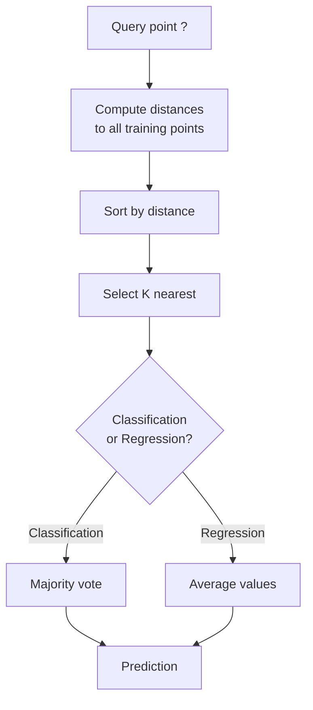
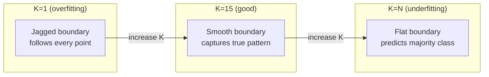
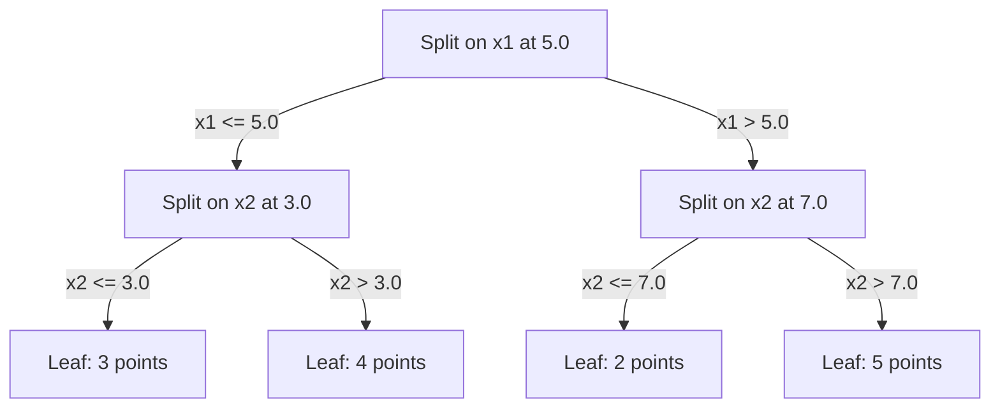

# K近邻与距离

> 存下所有数据，参照邻居做预测。这是最简单、却确实有效的算法。

**Type:** Build
**Language:** Python
**Prerequisites:** 阶段 1（第 14 课：范数与距离）
**Time:** ~90 分钟

## 学习目标

- 从零实现 KNN 分类与回归，支持配置 K 和按距离加权投票
- 比较 L1、L2、余弦和 Minkowski 距离度量，并为给定的数据类型选择合适的度量
- 解释维数灾难，并演示 KNN 为何会在高维空间中表现退化
- 构建 KD树以高效搜索最近邻，并分析它在什么情况下优于暴力搜索

## 要解决的问题

你有一个数据集。现在来了一个新数据点，你需要判断它的类别或预测它的值。你无需像线性回归或支持向量机（SVM）那样从数据中学习参数，只要找到离新点最近的 K 个训练点，让它们投票即可。

这就是 K近邻（K-nearest neighbors，KNN）。它没有训练阶段，没有要学习的参数，也没有要最小化的损失函数。你存储整个训练集，在预测时计算距离。

这听起来简单得不像能奏效。但对于许多问题，尤其是中小型数据集，KNN 的竞争力出人意料。深入理解它，还能揭示几个基本概念：距离度量的选择（衔接阶段 1 第 14 课）、维数灾难（curse of dimensionality），以及按训练时机区分的惰性学习（lazy learning）与急切学习（eager learning）之间的区别。

KNN 也遍布现代 AI，只是换了不同的名字。向量数据库对嵌入（embedding）执行 KNN 搜索；检索增强生成（RAG）寻找最近的 K 个文档块；推荐系统寻找相似的用户或物品。算法相同，区别在于规模和数据结构。

## 核心概念

### KNN 如何工作

给定一个由带标签的数据点组成的数据集，以及一个新的查询点：

1. 计算查询点到数据集中每个点的距离
2. 按距离排序
3. 取最近的 K 个点
4. 对于分类：由 K 个邻居进行多数投票
5. 对于回归：对 K 个邻居的值求平均（或加权平均）



这就是完整算法。无需拟合，无需梯度下降，也无需训练轮次（epoch）。

### 选择 K

K 是唯一的超参数（hyperparameter）。它控制着偏差与方差之间的权衡：

| K | 行为 |
|---|----------|
| K = 1 | 决策边界紧随每个点。训练误差为零。方差高。过拟合 |
| 较小的 K（3-5） | 对局部结构敏感。可以捕捉复杂边界 |
| 较大的 K | 边界更平滑。对噪声更鲁棒。可能欠拟合 |
| K = N | 对每个点都预测为多数类。偏差最大 |

对于包含 N 个点的数据集，常见的初始选择是 K = sqrt(N)。二分类时使用奇数 K，以避免平票。



### 距离度量

距离函数定义了什么叫“近”。不同的度量（metric）会找出不同的邻居，从而产生不同的预测。

**L2（欧氏距离，Euclidean）** 是默认选择，即直线距离。

```text
d(a, b) = sqrt(sum((a_i - b_i)^2))
```

它对特征尺度敏感。在 KNN 中使用 L2 之前，始终要先对特征做标准化。

**L1（Manhattan）** 将各分量差的绝对值相加。由于不对差值平方，它比 L2 更能抵抗离群值的影响。

```text
d(a, b) = sum(|a_i - b_i|)
```

**余弦距离（cosine distance）** 衡量向量之间的夹角，忽略模长。它对文本和嵌入数据至关重要。

```text
d(a, b) = 1 - (a . b) / (||a|| * ||b||)
```

**Minkowski** 通过参数 p 将 L1 和 L2 推广为统一形式。

```text
d(a, b) = (sum(|a_i - b_i|^p))^(1/p)

p=1: Manhattan
p=2: Euclidean
p->inf: Chebyshev (max absolute difference)
```

使用哪种度量取决于数据：

| 数据类型 | 最佳度量 | 原因 |
|-----------|------------|-----|
| 尺度相近的数值特征 | L2（欧氏距离，Euclidean） | 默认选择，适用于空间数据 |
| 含离群值的数值特征 | L1（Manhattan） | 鲁棒，不会放大较大的差值 |
| 文本嵌入 | 余弦 | 模长是噪声，方向代表含义 |
| 高维稀疏数据 | 余弦或 L1 | L2 受到维数灾难的影响 |
| 混合类型 | 自定义距离 | 按特征类型组合不同度量 |

### 加权 KNN

标准 KNN 给所有 K 个邻居相同的权重。但距离为 0.1 的邻居应当比距离为 5.0 的邻居更重要。

**按距离加权的 KNN（distance-weighted KNN）** 让每个邻居的权重与距离成反比：

```text
weight_i = 1 / (distance_i + epsilon)

For classification: weighted vote
For regression:     weighted average = sum(w_i * y_i) / sum(w_i)
```

当查询点与某个训练点完全重合时，epsilon 可以防止除以零。

加权 KNN 对 K 的选择不那么敏感，因为无论如何，远处邻居的贡献都很小。

### 维数灾难

KNN 在高维空间中的表现会退化。这不是模糊的担忧，而是一个数学事实。

**问题 1：距离趋同。** 随着维数增加，最大距离与最小距离的比值趋近于 1。所有点到查询点都变得同样“远”。

```text
In d dimensions, for random uniform points:

d=2:    max_dist / min_dist = varies widely
d=100:  max_dist / min_dist ~ 1.01
d=1000: max_dist / min_dist ~ 1.001

When all distances are nearly equal, "nearest" is meaningless.
```

**问题 2：体积急剧增大。** 要在数据中一个固定比例的范围内找到 K 个邻居，就需要扩大搜索半径，覆盖特征空间中大得多的比例。高维空间中的“邻域”包含了空间的大部分。

**问题 3：角部占据主导。** 在 d 维单位超立方体中，大部分体积集中在角部附近，而不是中心。随着 d 增大，立方体内接球所占的体积比例趋近于零。

实际影响是：特征数在大约 20-50 以内时，KNN 表现良好。超过这一范围，就需要先降维（PCA、UMAP、t-SNE），再使用 KNN；或者使用能利用数据较低内在维数的树形搜索结构。

### KD树：快速搜索最近邻

暴力 KNN 会计算查询点到每个训练点的距离，每次查询的成本为 O(n * d)。对于大型数据集，这太慢了。

KD树（KD-tree）沿着特征轴递归划分空间。每一层都选择一个维度，在其中位数处划分。



要寻找最近邻，先沿树遍历到包含查询点的叶节点，再回溯；只有相邻分区可能包含更近的点时，才检查这些分区。

低维情况下，平均查询时间为 O(log n)。但在高维（d > 20）时，KD树会退化为 O(n)，因为回溯时能够排除的分支越来越少。

### 球树：更适合中等维数

球树（ball tree）将数据划分为嵌套的超球，而不是与坐标轴对齐的盒子。每个节点定义一个球（中心 + 半径），其中包含该子树内的所有点。

相对于 KD树的优势：
- 在中等维数下表现更好（最高 ~50）
- 能处理不与坐标轴对齐的结构
- 更紧的包围体意味着搜索时可以剪去更多分支

KD树和球树都是精确算法。对于真正的大规模搜索（millions，即数百万个点，以及数百维），则使用近似最近邻（approximate nearest neighbor）方法，例如 HNSW、IVF 和乘积量化（product quantization）。阶段 1 第 14 课介绍了这些方法。

### 惰性学习与急切学习

KNN 属于惰性学习（lazy learning）：训练时不做计算，所有工作都在预测时完成。大多数其他算法，例如线性回归、SVM 和神经网络，则属于急切学习（eager learning）：训练时进行大量计算，构建紧凑的模型，之后便能快速预测。

| 方面 | 惰性学习（KNN） | 急切学习（SVM、神经网络） |
|--------|------------|------------------------|
| 训练时间 | O(1)，只需存储数据 | O(n * epochs) |
| 预测时间 | 每次查询 O(n * d) | O(d) 或 O(parameters) |
| 预测时的内存需求 | 存储整个训练集 | 仅存储模型参数 |
| 适应新数据 | 立即添加数据点 | 重新训练模型 |
| 决策边界 | 隐式，在预测时即时计算 | 显式，训练后固定 |

以下情形适合使用惰性学习：
- 数据集频繁变化（无需重新训练即可添加或移除数据点）
- 只需要为极少量查询做预测
- 希望训练时间为零
- 数据集足够小，暴力搜索也很快

### 用 KNN 做回归

KNN 回归不进行多数投票，而是对 K 个邻居的目标值求平均。

```text
prediction = (1/K) * sum(y_i for i in K nearest neighbors)

Or with distance weighting:
prediction = sum(w_i * y_i) / sum(w_i)
where w_i = 1 / distance_i
```

KNN 回归产生分段常数预测（加权时则为分段平滑预测）。它无法外推到训练数据的取值范围之外。如果训练目标都在 0 到 100 之间，KNN 就绝不会预测出 200。

```figure
knn-smoothness
```

## 动手实现

### 第 1 步：距离函数

实现 L1、L2、余弦和 Minkowski 距离。这些内容直接衔接阶段 1 第 14 课。

```python
import math

def l2_distance(a, b):
    return math.sqrt(sum((ai - bi) ** 2 for ai, bi in zip(a, b)))

def l1_distance(a, b):
    return sum(abs(ai - bi) for ai, bi in zip(a, b))

def cosine_distance(a, b):
    dot_val = sum(ai * bi for ai, bi in zip(a, b))
    norm_a = math.sqrt(sum(ai ** 2 for ai in a))
    norm_b = math.sqrt(sum(bi ** 2 for bi in b))
    if norm_a == 0 or norm_b == 0:
        return 1.0
    return 1.0 - dot_val / (norm_a * norm_b)

def minkowski_distance(a, b, p=2):
    if p == float('inf'):
        return max(abs(ai - bi) for ai, bi in zip(a, b))
    return sum(abs(ai - bi) ** p for ai, bi in zip(a, b)) ** (1 / p)
```

### 第 2 步：KNN 分类器与回归器

构建完整的 KNN，支持配置 K、距离度量，并可选择按距离加权。

```python
class KNN:
    def __init__(self, k=5, distance_fn=l2_distance, weighted=False,
                 task="classification"):
        self.k = k
        self.distance_fn = distance_fn
        self.weighted = weighted
        self.task = task
        self.X_train = None
        self.y_train = None

    def fit(self, X, y):
        self.X_train = X
        self.y_train = y

    def predict(self, X):
        return [self._predict_one(x) for x in X]
```

### 第 3 步：用 KD树高效搜索

从零构建 KD树，递归地在各维度的中位数处划分。

```python
class KDTree:
    def __init__(self, X, indices=None, depth=0):
        # Recursively partition the data
        self.axis = depth % len(X[0])
        # Split on median of the current axis
        ...

    def query(self, point, k=1):
        # Traverse to leaf, then backtrack
        ...
```

完整实现，包括所有辅助方法和演示，见 `code/knn.py`。

### 第 4 步：特征缩放

KNN 需要特征缩放（feature scaling），因为距离对特征的数值大小敏感。取值范围为 0 到 1000 的特征会主导取值范围为 0 到 1 的特征。

```python
def standardize(X):
    n = len(X)
    d = len(X[0])
    means = [sum(X[i][j] for i in range(n)) / n for j in range(d)]
    stds = [
        max(1e-10, (sum((X[i][j] - means[j]) ** 2 for i in range(n)) / n) ** 0.5)
        for j in range(d)
    ]
    return [[((X[i][j] - means[j]) / stds[j]) for j in range(d)] for i in range(n)], means, stds
```

## 实际使用

使用 scikit-learn：

```python
from sklearn.neighbors import KNeighborsClassifier
from sklearn.preprocessing import StandardScaler
from sklearn.pipeline import Pipeline

clf = Pipeline([
    ("scaler", StandardScaler()),
    ("knn", KNeighborsClassifier(n_neighbors=5, metric="euclidean")),
])
clf.fit(X_train, y_train)
print(f"Accuracy: {clf.score(X_test, y_test):.4f}")
```

当数据集足够大、维数足够低时，Scikit-learn 会自动使用 KD树或球树。对于高维数据，它会退回到暴力搜索。你可以通过 `algorithm` 参数控制这一行为。

对于大规模最近邻搜索（millions，即数百万个向量），可以使用 FAISS、Annoy 或向量数据库：

```python
import faiss

index = faiss.IndexFlatL2(dimension)
index.add(embeddings)
distances, indices = index.search(query_vectors, k=5)
```

## 练习

1. 在包含 3 个类别的 2D（二维）数据集上实现 KNN 分类。分别绘制 K=1、K=5、K=15 和 K=N 时的决策边界，观察从过拟合到欠拟合的变化。

2. 分别在 2、5、10、50、100 和 500 维空间中生成 1000 个随机点。对每种维数，计算最大成对距离与最小成对距离的比值。绘制该比值随维数变化的图像，将维数灾难可视化。

3. 在文本分类问题上比较使用 L1、L2 和余弦距离的 KNN（使用 TF-IDF 向量）。哪种度量的准确率最高？为什么余弦距离往往在文本上胜出？

4. 实现 KD树，并在包含 1k、10k 和 100k 个点、维数为 2D、10D 和 50D 的数据集上，比较它与暴力搜索的查询时间。维数达到多少时，KD树不再比暴力搜索快？

5. 为 y = sin(x) + noise 构建加权 KNN 回归器。在 K=3、10、30 时，将它与不加权的 KNN 比较。展示加权如何产生更平滑的预测，尤其是在 K 较大时。

## 关键术语

| 术语 | 实际含义 |
|------|----------------------|
| K近邻 | 非参数算法，通过找到离查询点最近的 K 个训练点来预测 |
| 惰性学习 | 训练时不做计算，所有工作都在预测时完成。KNN 是典型例子 |
| 急切学习 | 训练时进行大量计算，以构建紧凑的模型。大多数 ML 算法属于急切学习 |
| 维数灾难 | 高维空间中，距离趋同，邻域扩大到覆盖空间的大部分，使 KNN 失效 |
| KD树 | 沿特征轴递归划分空间的二叉树。低维情况下查询成本为 O(log n) |
| 球树 | 由嵌套超球组成的树。在中等维数下（最高 ~50）比 KD树表现更好 |
| 加权 KNN | 邻居的权重与距离成反比。较近的邻居对预测的影响更大 |
| 特征缩放 | 将特征归一化到可比较的范围。KNN 等基于距离的方法需要这一步 |
| 多数投票 | 统计 K 个邻居中哪个类别最多，以此进行分类 |
| 暴力搜索 | 计算到每个训练点的距离。每次查询成本为 O(n*d)。结果精确，但 n 较大时很慢 |
| 近似最近邻 | HNSW、LSH、IVF 等算法，以远快于精确搜索的速度找到近似最近的点 |
| Voronoi图 | 对空间的划分：每个区域包含的所有点，到某个训练点的距离都比到其他任意训练点更近。K=1 的 KNN 会产生 Voronoi 边界 |

## 延伸阅读

- [Cover & Hart: Nearest Neighbor Pattern Classification (1967)](https://ieeexplore.ieee.org/document/1053964) - KNN 的奠基论文，证明其错误率最多是 Bayes 最优错误率的两倍
- [Friedman, Bentley, Finkel: An Algorithm for Finding Best Matches in Logarithmic Expected Time (1977)](https://dl.acm.org/doi/10.1145/355744.355745) - 最早的 KD树论文
- [Beyer et al.: When Is "Nearest Neighbor" Meaningful? (1999)](https://link.springer.com/chapter/10.1007/3-540-49257-7_15) - 对最近邻问题中维数灾难的形式化分析
- [scikit-learn Nearest Neighbors documentation](https://scikit-learn.org/stable/modules/neighbors.html) - 包含算法选择说明的实用指南
- [FAISS: A Library for Efficient Similarity Search](https://github.com/facebookresearch/faiss) - Meta 面向 billion（十亿）规模近似最近邻搜索的库
