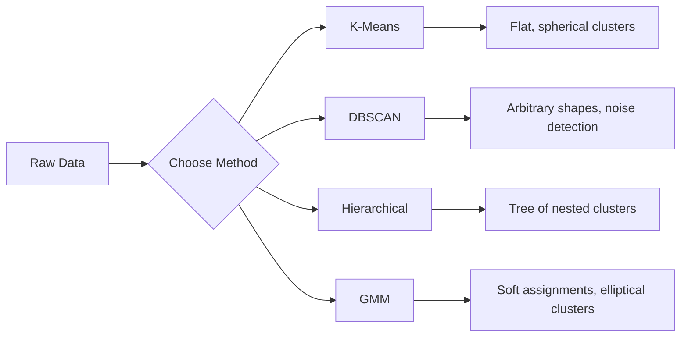

# 无监督学习

> 没有标签，也没有老师。算法自行发现结构。

**Type:** Build
**Languages:** Python
**Prerequisites:** 阶段 1（范数与距离、概率与分布），阶段 2 第 1-6 课
**Time:** ~90 分钟

## 学习目标

- 从零实现 K-Means、DBSCAN 和高斯混合模型，并比较它们的聚类行为
- 使用轮廓系数和肘部法评估聚类质量，选择最优的 K
- 解释 DBSCAN 在什么情况下优于 K-Means，并识别哪种算法能够处理非球形簇与离群点
- 使用聚类方法构建异常检测流水线，标记偏离正常模式的数据点

## 要解决的问题

此前每一节机器学习课都假定数据带有标签：“这是输入，这是正确的输出。”而在现实世界中，获取标签成本很高。医院有数百万份患者记录，却没有人为每份记录手工标注疾病类别。电商网站有数百万次用户会话，却没有人手工标注客户群体。安全团队有网络日志，却没有人为每一个异常打上标记。

无监督学习（unsupervised learning）无需别人告诉它要寻找什么，就能发现模式。它将相似的数据点分组，发现隐藏的结构，并找出异常。如果说监督学习是对照附有答案的教材学习，那么无监督学习就是盯着原始数据，直到模式浮现出来。

难点在于：没有标签，就无法直接衡量“对”或“错”。你需要其他工具，评估算法发现的结构是否有意义。

## 核心概念

### 聚类：把相似的事物归为一组

聚类（clustering）把每个数据点分配到一个组（簇，cluster），使同组内的数据点彼此之间比与其他组的数据点更加相似。始终需要回答的问题是：“相似”究竟是什么意思？



### K-Means：常用的主力算法

K-Means 将数据划分为恰好 K 个簇。每个簇都有一个质心（centroid，即其质量中心），每个点都归属于距离最近的质心。

Lloyd 算法：

1. 随机选取 K 个点作为初始质心
2. 将每个数据点分配给最近的质心
3. 将分配到各簇的点取均值，重新计算该簇的质心
4. 重复步骤 2-3，直到分配结果不再变化

目标函数（惯性，inertia）衡量每个点到其所属质心的距离平方总和。K-Means 会最小化这个值，但只能找到局部极小值。不同的初始化可能得到不同结果。

### 选择 K

两种标准方法：

**肘部法（elbow method）：** 分别取 K = 1, 2, 3, ..., n 运行 K-Means，绘制惯性随 K 变化的曲线。寻找继续增加簇数也无法显著降低惯性的“肘部”。

**轮廓系数（silhouette score）：** 对每个点，衡量它与自身所在簇的相似程度（a），以及与最近的其他簇的相似程度（b）。该点的轮廓系数为 (b - a) / max(a, b)，取值范围从 -1（分到了错误的簇）到 +1（聚类良好）。对所有点取平均值，即得到整体评分。

### DBSCAN：基于密度的聚类

K-Means 假定簇呈球形，并要求提前选定 K。DBSCAN 没有这两个假定。它将由稀疏区域隔开的稠密区域识别为簇。

两个参数：
- **eps**：邻域的半径
- **min_samples**：形成稠密区域所需的最少点数

三类点：
- **核心点（core point）**：在 eps 距离内至少有 min_samples 个点
- **边界点（border point）**：位于某个核心点的 eps 邻域内，但自身不是核心点
- **噪声点（noise point）**：既不是核心点，也不是边界点。这些点就是离群点。

DBSCAN 将彼此距离在 eps 以内的核心点连接到同一个簇。边界点加入附近核心点所在的簇。噪声点不属于任何簇。

优点：能找到任意形状的簇、自动确定簇数，并识别离群点。缺点：难以处理密度各不相同的簇。

### 层次聚类

构建由嵌套簇组成的树（树状图，dendrogram）。

凝聚式（自底向上）：
1. 开始时每个点各自构成一个簇
2. 合并距离最近的两个簇
3. 重复这一过程，直到只剩下一个簇
4. 在所需层级切割树状图，得到 K 个簇

簇间的“接近程度”可以按以下方式衡量：
- **单链接（single linkage）**：两个簇中任意一对点之间的最小距离
- **全链接（complete linkage）**：任意一对点之间的最大距离
- **平均链接（average linkage）**：所有点对之间距离的平均值
- **Ward 方法**：选择使总簇内方差增加最少的合并方式

### 高斯混合模型（GMM）

K-Means 采用硬分配：每个点恰好属于一个簇。GMM 采用软分配：每个点对每个簇都有一个归属概率。

GMM 假设数据由 K 个高斯分布混合生成，每个分布都有自己的均值和协方差。期望最大化（Expectation-Maximization，EM）算法交替执行以下步骤：

- **E步（E-step）**：计算每个点属于各个高斯分布的概率
- **M步（M-step）**：更新每个高斯分布的均值、协方差和混合权重，以最大化数据的似然

GMM 可以对椭圆形簇建模（不像 K-Means 只能处理球形簇），也能自然地处理相互重叠的簇。

### 何时使用哪种方法

| 方法 | 最适合 | 应避免的情形 |
|--------|----------|------------|
| K-Means | 大型数据集、球形簇、已知 K | 不规则形状、存在离群点 |
| DBSCAN | 未知 K、任意形状、离群点检测 | 密度不均、维数很高 |
| 层次聚类 | 小型数据集、需要树状图、未知 K | 大型数据集（O(n^2) 内存） |
| GMM | 簇相互重叠、需要软分配 | 数据集非常大、维数过多 |

### 用聚类进行异常检测

聚类天然支持异常检测：
- **K-Means**：远离所有质心的点就是异常点
- **DBSCAN**：按照定义，噪声点就是异常点
- **GMM**：在所有高斯分布下概率都很低的点就是异常点

```figure
kmeans-step
```

## 动手实现

### 步骤 1：从零实现 K-Means

```python
import math
import random


def euclidean_distance(a, b):
    return math.sqrt(sum((ai - bi) ** 2 for ai, bi in zip(a, b)))


def kmeans(data, k, max_iterations=100, seed=42):
    random.seed(seed)
    n_features = len(data[0])

    centroids = random.sample(data, k)

    for iteration in range(max_iterations):
        clusters = [[] for _ in range(k)]
        assignments = []

        for point in data:
            distances = [euclidean_distance(point, c) for c in centroids]
            nearest = distances.index(min(distances))
            clusters[nearest].append(point)
            assignments.append(nearest)

        new_centroids = []
        for cluster in clusters:
            if len(cluster) == 0:
                new_centroids.append(random.choice(data))
                continue
            centroid = [
                sum(point[j] for point in cluster) / len(cluster)
                for j in range(n_features)
            ]
            new_centroids.append(centroid)

        if all(
            euclidean_distance(old, new) < 1e-6
            for old, new in zip(centroids, new_centroids)
        ):
            print(f"  Converged at iteration {iteration + 1}")
            break

        centroids = new_centroids

    return assignments, centroids
```

### 步骤 2：肘部法与轮廓系数

```python
def compute_inertia(data, assignments, centroids):
    total = 0.0
    for point, cluster_id in zip(data, assignments):
        total += euclidean_distance(point, centroids[cluster_id]) ** 2
    return total


def silhouette_score(data, assignments):
    n = len(data)
    if n < 2:
        return 0.0

    clusters = {}
    for i, c in enumerate(assignments):
        clusters.setdefault(c, []).append(i)

    if len(clusters) < 2:
        return 0.0

    scores = []
    for i in range(n):
        own_cluster = assignments[i]
        own_members = [j for j in clusters[own_cluster] if j != i]

        if len(own_members) == 0:
            scores.append(0.0)
            continue

        a = sum(euclidean_distance(data[i], data[j]) for j in own_members) / len(own_members)

        b = float("inf")
        for cluster_id, members in clusters.items():
            if cluster_id == own_cluster:
                continue
            avg_dist = sum(euclidean_distance(data[i], data[j]) for j in members) / len(members)
            b = min(b, avg_dist)

        if max(a, b) == 0:
            scores.append(0.0)
        else:
            scores.append((b - a) / max(a, b))

    return sum(scores) / len(scores)


def find_best_k(data, max_k=10):
    print("Elbow method:")
    inertias = []
    for k in range(1, max_k + 1):
        assignments, centroids = kmeans(data, k)
        inertia = compute_inertia(data, assignments, centroids)
        inertias.append(inertia)
        print(f"  K={k}: inertia={inertia:.2f}")

    print("\nSilhouette scores:")
    for k in range(2, max_k + 1):
        assignments, centroids = kmeans(data, k)
        score = silhouette_score(data, assignments)
        print(f"  K={k}: silhouette={score:.4f}")

    return inertias
```

### 步骤 3：从零实现 DBSCAN

```python
def dbscan(data, eps, min_samples):
    n = len(data)
    labels = [-1] * n
    cluster_id = 0

    def region_query(point_idx):
        neighbors = []
        for i in range(n):
            if euclidean_distance(data[point_idx], data[i]) <= eps:
                neighbors.append(i)
        return neighbors

    visited = [False] * n

    for i in range(n):
        if visited[i]:
            continue
        visited[i] = True

        neighbors = region_query(i)

        if len(neighbors) < min_samples:
            labels[i] = -1
            continue

        labels[i] = cluster_id
        seed_set = list(neighbors)
        seed_set.remove(i)

        j = 0
        while j < len(seed_set):
            q = seed_set[j]

            if not visited[q]:
                visited[q] = True
                q_neighbors = region_query(q)
                if len(q_neighbors) >= min_samples:
                    for nb in q_neighbors:
                        if nb not in seed_set:
                            seed_set.append(nb)

            if labels[q] == -1:
                labels[q] = cluster_id

            j += 1

        cluster_id += 1

    return labels
```

### 步骤 4：高斯混合模型（EM 算法）

```python
def gmm(data, k, max_iterations=100, seed=42):
    random.seed(seed)
    n = len(data)
    d = len(data[0])

    indices = random.sample(range(n), k)
    means = [list(data[i]) for i in indices]
    variances = [1.0] * k
    weights = [1.0 / k] * k

    def gaussian_pdf(x, mean, variance):
        d = len(x)
        coeff = 1.0 / ((2 * math.pi * variance) ** (d / 2))
        exponent = -sum((xi - mi) ** 2 for xi, mi in zip(x, mean)) / (2 * variance)
        return coeff * math.exp(max(exponent, -500))

    for iteration in range(max_iterations):
        responsibilities = []
        for i in range(n):
            probs = []
            for j in range(k):
                probs.append(weights[j] * gaussian_pdf(data[i], means[j], variances[j]))
            total = sum(probs)
            if total == 0:
                total = 1e-300
            responsibilities.append([p / total for p in probs])

        old_means = [list(m) for m in means]

        for j in range(k):
            r_sum = sum(responsibilities[i][j] for i in range(n))
            if r_sum < 1e-10:
                continue

            weights[j] = r_sum / n

            for dim in range(d):
                means[j][dim] = sum(
                    responsibilities[i][j] * data[i][dim] for i in range(n)
                ) / r_sum

            variances[j] = sum(
                responsibilities[i][j]
                * sum((data[i][dim] - means[j][dim]) ** 2 for dim in range(d))
                for i in range(n)
            ) / (r_sum * d)
            variances[j] = max(variances[j], 1e-6)

        shift = sum(
            euclidean_distance(old_means[j], means[j]) for j in range(k)
        )
        if shift < 1e-6:
            print(f"  GMM converged at iteration {iteration + 1}")
            break

    assignments = []
    for i in range(n):
        assignments.append(responsibilities[i].index(max(responsibilities[i])))

    return assignments, means, weights, responsibilities
```

### 步骤 5：生成测试数据并运行全部算法

```python
def make_blobs(centers, n_per_cluster=50, spread=0.5, seed=42):
    random.seed(seed)
    data = []
    true_labels = []
    for label, (cx, cy) in enumerate(centers):
        for _ in range(n_per_cluster):
            x = cx + random.gauss(0, spread)
            y = cy + random.gauss(0, spread)
            data.append([x, y])
            true_labels.append(label)
    return data, true_labels


def make_moons(n_samples=200, noise=0.1, seed=42):
    random.seed(seed)
    data = []
    labels = []
    n_half = n_samples // 2
    for i in range(n_half):
        angle = math.pi * i / n_half
        x = math.cos(angle) + random.gauss(0, noise)
        y = math.sin(angle) + random.gauss(0, noise)
        data.append([x, y])
        labels.append(0)
    for i in range(n_half):
        angle = math.pi * i / n_half
        x = 1 - math.cos(angle) + random.gauss(0, noise)
        y = 1 - math.sin(angle) - 0.5 + random.gauss(0, noise)
        data.append([x, y])
        labels.append(1)
    return data, labels


if __name__ == "__main__":
    centers = [[2, 2], [8, 3], [5, 8]]
    data, true_labels = make_blobs(centers, n_per_cluster=50, spread=0.8)

    print("=== K-Means on 3 blobs ===")
    assignments, centroids = kmeans(data, k=3)
    print(f"  Centroids: {[[round(c, 2) for c in cent] for cent in centroids]}")
    sil = silhouette_score(data, assignments)
    print(f"  Silhouette score: {sil:.4f}")

    print("\n=== Elbow Method ===")
    find_best_k(data, max_k=6)

    print("\n=== DBSCAN on 3 blobs ===")
    db_labels = dbscan(data, eps=1.5, min_samples=5)
    n_clusters = len(set(db_labels) - {-1})
    n_noise = db_labels.count(-1)
    print(f"  Found {n_clusters} clusters, {n_noise} noise points")

    print("\n=== GMM on 3 blobs ===")
    gmm_assignments, gmm_means, gmm_weights, _ = gmm(data, k=3)
    print(f"  Means: {[[round(m, 2) for m in mean] for mean in gmm_means]}")
    print(f"  Weights: {[round(w, 3) for w in gmm_weights]}")
    gmm_sil = silhouette_score(data, gmm_assignments)
    print(f"  Silhouette score: {gmm_sil:.4f}")

    print("\n=== DBSCAN on moons (non-spherical clusters) ===")
    moon_data, moon_labels = make_moons(n_samples=200, noise=0.1)
    moon_db = dbscan(moon_data, eps=0.3, min_samples=5)
    n_moon_clusters = len(set(moon_db) - {-1})
    n_moon_noise = moon_db.count(-1)
    print(f"  Found {n_moon_clusters} clusters, {n_moon_noise} noise points")

    print("\n=== K-Means on moons (will fail to separate) ===")
    moon_km, moon_centroids = kmeans(moon_data, k=2)
    moon_sil = silhouette_score(moon_data, moon_km)
    print(f"  Silhouette score: {moon_sil:.4f}")
    print("  K-Means splits moons poorly because they are not spherical")

    print("\n=== Anomaly detection with DBSCAN ===")
    anomaly_data = list(data)
    anomaly_data.append([20.0, 20.0])
    anomaly_data.append([-5.0, -5.0])
    anomaly_data.append([15.0, 0.0])
    anomaly_labels = dbscan(anomaly_data, eps=1.5, min_samples=5)
    anomalies = [
        anomaly_data[i]
        for i in range(len(anomaly_labels))
        if anomaly_labels[i] == -1
    ]
    print(f"  Detected {len(anomalies)} anomalies")
    for a in anomalies[-3:]:
        print(f"    Point {[round(v, 2) for v in a]}")
```

## 实际使用

使用 scikit-learn，同样的算法各用一行代码就能调用：

```python
from sklearn.cluster import KMeans, DBSCAN, AgglomerativeClustering
from sklearn.mixture import GaussianMixture
from sklearn.metrics import silhouette_score as sklearn_silhouette

km = KMeans(n_clusters=3, random_state=42).fit(data)
db = DBSCAN(eps=1.5, min_samples=5).fit(data)
agg = AgglomerativeClustering(n_clusters=3).fit(data)
gmm_model = GaussianMixture(n_components=3, random_state=42).fit(data)
```

从零实现的版本让你清楚看到这些库究竟在计算什么。K-Means 交替进行分配与重新计算；DBSCAN 从稠密的种子点出发扩展簇；GMM 在期望与最大化之间交替执行。库版本还加入了数值稳定性处理、更智能的初始化（K-Means++）以及 GPU 加速，但核心逻辑相同。

## 交付成果

本课产出可运行的 K-Means、DBSCAN 和 GMM 从零实现。这些聚类代码可以复用，作为更高级无监督方法的基础。

## 练习

1. 实现 K-Means++ 初始化：不要随机选取所有质心，而是先随机选取第一个质心，再按与最近已有质心的距离平方成正比的概率，依次选取后续质心。比较它与随机初始化的收敛速度。
2. 在代码中加入层次凝聚聚类。实现 Ward 链接，并生成树状图（用嵌套的合并列表表示）。在不同层级切割树状图，与 K-Means 的结果比较。
3. 构建简单的异常检测流水线：对同一份数据运行 DBSCAN 和 GMM，把两种方法一致判为离群点的点标记出来（DBSCAN 中的噪声点、GMM 中的低概率点）。衡量两者的重叠程度，并讨论它们何时会产生分歧。

## 关键术语

| 术语 | 常见说法 | 实际含义 |
|------|----------------|----------------------|
| 聚类 | “把相似的事物分组” | 按某个特定距离度量，将数据划分为组内相似度大于组间相似度的子集 |
| 质心 | “簇的中心” | 分配到同一个簇的所有点的均值；K-Means 用它作为该簇的代表 |
| 惯性 | “簇有多紧凑” | 每个点到其所属质心的距离平方和；越小则越紧凑 |
| 轮廓系数 | “簇之间分得有多开” | 对每个点计算 (b - a) / max(a, b)，其中 a 为簇内平均距离，b 为最近簇的平均距离 |
| 核心点 | “稠密区域中的点” | 在 DBSCAN 中，eps 距离内至少有 min_samples 个邻居的点 |
| EM 算法 | “软 K-Means” | 期望最大化：迭代计算归属概率（E步）并更新分布参数（M步） |
| 树状图 | “由簇组成的树” | 显示层次聚类中各簇合并顺序及合并距离的树形图 |
| 异常 | “离群点” | 不符合预期模式的数据点，由 DBSCAN 识别为噪声，或由 GMM 识别为低概率点 |

## 延伸阅读

- [Stanford CS229 - 无监督学习](https://cs229.stanford.edu/notes2022fall/main_notes.pdf) - Andrew Ng 关于聚类与 EM 的讲义
- [scikit-learn 聚类指南](https://scikit-learn.org/stable/modules/clustering.html) - 通过可视化示例实用对比各种聚类算法
- [DBSCAN 原始论文（Ester 等，1996）](https://www.aaai.org/Papers/KDD/1996/KDD96-037.pdf) - 提出基于密度聚类的论文
