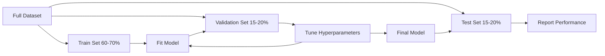

# 模型评估

> 衡量模型的方法，决定了你能多准确地认识它的好坏。

**Type:** Build
**Languages:** Python
**Prerequisites:** 阶段 1（概率与分布、机器学习统计基础），阶段 2 第 1-8 课
**Time:** ~90 分钟

## 学习目标

- 从零实现 K折交叉验证（K-fold cross-validation）和分层K折交叉验证（stratified K-fold cross-validation），并解释分层为何对不平衡数据很重要
- 从零计算精确率（precision）、召回率（recall）、F1、AUC-ROC，以及回归指标（MSE、RMSE、MAE、R平方）
- 解读学习曲线（learning curves），诊断模型是否存在高偏差（bias）或高方差（variance）问题
- 识别常见评估错误，包括数据泄漏（data leakage）、指标选择不当和测试集污染（test set contamination）

## 要解决的问题

你训练了一个模型，在你的数据上准确率（accuracy）达到 95%。它好吗？

也许好，也许不好。如果数据中 95% 的样本属于同一类别，那么始终预测该类别的模型也能获得 95% 的准确率，却完全没有用处。如果你用训练模型的同一批数据来评估，95% 这个数字就没有意义，因为模型只是记住了答案。如果数据集带有时间因素，而你在划分前随机打乱了数据，那么模型可能正在用未来的数据预测过去。

模型评估（model evaluation）是多数机器学习项目出问题的环节。错误的指标会让坏模型看起来很好，错误的划分会让模型作弊，错误的比较会让你选择较差的模型。做好评估不是可有可无的：它决定了模型能在生产环境中工作，还是一见到真实数据就失效。

## 核心概念

### 训练集、验证集与测试集



三种划分，各有用途：

- **训练集（training set）**：模型从这些数据中学习，在训练期间会见到这些样本。
- **验证集（validation set）**：用于调整超参数和选择模型。模型从不在这些数据上训练，但你的决策会受到它们的影响。
- **测试集（test set）**：只在最后使用一次，用来报告最终表现。如果你看了测试表现后又回头修改模型，它就不再是测试集，而是第二个验证集。

测试集作为留出（hold-out）数据，保证报告的表现能够反映模型在真正未见数据上的表现。

### K折交叉验证

对于小数据集，单次训练/验证划分既浪费数据，也会产生噪声较大的估计。K折交叉验证让全部数据都能用于训练和验证：

```mermaid
flowchart TB
    subgraph Fold1["Fold 1"]
        direction LR
        V1["Val"] --- T1a["Train"] --- T1b["Train"] --- T1c["Train"] --- T1d["Train"]
    end
    subgraph Fold2["Fold 2"]
        direction LR
        T2a["Train"] --- V2["Val"] --- T2b["Train"] --- T2c["Train"] --- T2d["Train"]
    end
    subgraph Fold3["Fold 3"]
        direction LR
        T3a["Train"] --- T3b["Train"] --- V3["Val"] --- T3c["Train"] --- T3d["Train"]
    end
    subgraph Fold4["Fold 4"]
        direction LR
        T4a["Train"] --- T4b["Train"] --- T4c["Train"] --- V4["Val"] --- T4d["Train"]
    end
    subgraph Fold5["Fold 5"]
        direction LR
        T5a["Train"] --- T5b["Train"] --- T5c["Train"] --- T5d["Train"] --- V5["Val"]
    end
    Fold1 --> R["Average scores"]
    Fold2 --> R
    Fold3 --> R
    Fold4 --> R
    Fold5 --> R
```



1. 将数据划分为 K 个大小相等的折
2. 对每一折，用 K-1 折训练，在剩余一折上验证
3. 对 K 个验证分数取平均值

K=5 或 K=10 是标准选择。每个数据点恰好被用作验证数据一次。相比任意一次单独划分，平均分数是更稳定的估计。

**分层K折：** 在每一折中保留类别分布。如果数据集包含 70% 的 A 类和 30% 的 B 类，那么每一折也会大致保持相同比例。这对不平衡数据集很重要，因为随机划分可能把所有少数类样本放进同一折。

### 分类指标

**混淆矩阵（confusion matrix）：** 它是基础。对于二分类：

|  | 预测为阳性 | 预测为阴性 |
|--|---|---|
| 实际为阳性 | 真阳性（TP） | 假阴性（FN） |
| 实际为阴性 | 假阳性（FP） | 真阴性（TN） |

其他所有指标都由这个矩阵推导而来：

- **准确率** = (TP + TN) / (TP + TN + FP + FN)。预测正确的比例。在类别不平衡时可能误导判断。
- **精确率** = TP / (TP + FP)。在所有预测为阳性的样本中，有多少实际为阳性？假阳性代价较高时使用（例如垃圾邮件过滤器把正常邮件标成垃圾邮件）。
- **召回率**（灵敏度，sensitivity）= TP / (TP + FN)。在所有实际阳性的样本中，我们找到了多少？假阴性代价较高时使用（例如癌症筛查漏掉肿瘤）。
- **F1分数** = 2 * precision * recall / (precision + recall)。精确率与召回率的调和平均值。当二者没有明显的优先次序时，用它兼顾两者。
- **AUC-ROC**：ROC（Receiver Operating Characteristic）曲线下面积。ROC 曲线绘制不同分类阈值下的真阳性率与假阳性率。AUC = 0.5 表示随机猜测，AUC = 1.0 表示完美分离。它不依赖阈值：衡量模型将阳性样本排在阴性样本之前的能力，不取决于你选用哪个分界值。

### 回归指标

- **MSE**（均方误差，Mean Squared Error）= mean((y_true - y_pred)^2)。按平方惩罚大误差，对离群点敏感。
- **RMSE**（均方根误差，Root Mean Squared Error）= sqrt(MSE)。与目标变量具有相同单位，比 MSE 更容易解释。
- **MAE**（平均绝对误差，Mean Absolute Error）= mean(|y_true - y_pred|)。对所有误差作线性处理，比 MSE 对离群点更稳健。
- **R平方（R-squared）** = 1 - SS_res / SS_tot，其中 SS_res = sum((y_true - y_pred)^2)，SS_tot = sum((y_true - y_mean)^2)。它表示模型解释的方差比例。R^2 = 1.0 表示完美，R^2 = 0.0 表示模型不比始终预测均值更好。如果模型比均值预测还差，R^2 可以为负。

### 学习曲线

绘制训练分数和验证分数随训练集大小变化的曲线：

- **高偏差（欠拟合，underfitting）**：两条曲线都收敛到较低分数。增加数据无济于事，需要更复杂的模型。
- **高方差（过拟合，overfitting）**：训练分数很高，验证分数却低得多，两者差距很大。增加数据应当会有帮助。

### 验证曲线（Validation Curves）

绘制训练分数和验证分数随某个超参数变化的曲线：

- 复杂度较低时：两个分数都较低（欠拟合）
- 复杂度适当时：两个分数都较高，且彼此接近
- 复杂度较高时：训练分数仍然很高，验证分数却下降（过拟合）

最优的超参数取值，就是验证分数达到峰值的位置。

### 常见评估错误

**数据泄漏：** 测试集信息泄漏到训练过程中。例如：在划分前用整个数据集拟合缩放器，在时间序列预测中使用未来数据，或者使用由目标变量推导出的特征。始终先划分，再预处理。

**类别不平衡（class imbalance）：** 99% 的交易是正常交易，1% 是欺诈交易。始终预测“正常”的模型可以得到 99% 的准确率。应改用精确率、召回率、F1 或 AUC-ROC。

**指标选择错误：** 本该优化召回率时却优化准确率（如医疗诊断），或者数据中有严重离群点时仍优化 RMSE（应改用 MAE）。

**没有使用分层划分（stratified split）：** 在不平衡数据中，随机划分可能只把很少的少数类样本放入验证折，导致估计不稳定。

**测试过于频繁：** 每次查看测试表现并据此调整模型，都是在对测试集过拟合。测试集只使用一次。

```figure
precision-recall-threshold
```

## 动手实现

### 步骤 1：划分训练集/验证集/测试集

```python
import random
import math


def train_val_test_split(X, y, train_ratio=0.6, val_ratio=0.2, seed=42):
    random.seed(seed)
    n = len(X)
    indices = list(range(n))
    random.shuffle(indices)

    train_end = int(n * train_ratio)
    val_end = int(n * (train_ratio + val_ratio))

    train_idx = indices[:train_end]
    val_idx = indices[train_end:val_end]
    test_idx = indices[val_end:]

    X_train = [X[i] for i in train_idx]
    y_train = [y[i] for i in train_idx]
    X_val = [X[i] for i in val_idx]
    y_val = [y[i] for i in val_idx]
    X_test = [X[i] for i in test_idx]
    y_test = [y[i] for i in test_idx]

    return X_train, y_train, X_val, y_val, X_test, y_test
```

### 步骤 2：K折与分层K折交叉验证

```python
def kfold_split(n, k=5, seed=42):
    random.seed(seed)
    indices = list(range(n))
    random.shuffle(indices)

    fold_size = n // k
    folds = []

    for i in range(k):
        start = i * fold_size
        end = start + fold_size if i < k - 1 else n
        val_idx = indices[start:end]
        train_idx = indices[:start] + indices[end:]
        folds.append((train_idx, val_idx))

    return folds


def stratified_kfold_split(y, k=5, seed=42):
    random.seed(seed)

    class_indices = {}
    for i, label in enumerate(y):
        class_indices.setdefault(label, []).append(i)

    for label in class_indices:
        random.shuffle(class_indices[label])

    folds = [{"train": [], "val": []} for _ in range(k)]

    for label, indices in class_indices.items():
        fold_size = len(indices) // k
        for i in range(k):
            start = i * fold_size
            end = start + fold_size if i < k - 1 else len(indices)
            val_part = indices[start:end]
            train_part = indices[:start] + indices[end:]
            folds[i]["val"].extend(val_part)
            folds[i]["train"].extend(train_part)

    return [(f["train"], f["val"]) for f in folds]


def cross_validate(X, y, model_fn, k=5, metric_fn=None, stratified=False):
    n = len(X)

    if stratified:
        folds = stratified_kfold_split(y, k)
    else:
        folds = kfold_split(n, k)

    scores = []
    for train_idx, val_idx in folds:
        X_train = [X[i] for i in train_idx]
        y_train = [y[i] for i in train_idx]
        X_val = [X[i] for i in val_idx]
        y_val = [y[i] for i in val_idx]

        model = model_fn()
        model.fit(X_train, y_train)
        predictions = [model.predict(x) for x in X_val]

        if metric_fn:
            score = metric_fn(y_val, predictions)
        else:
            score = sum(1 for yt, yp in zip(y_val, predictions) if yt == yp) / len(y_val)
        scores.append(score)

    return scores
```

### 步骤 3：混淆矩阵与分类指标

```python
def confusion_matrix(y_true, y_pred):
    tp = sum(1 for yt, yp in zip(y_true, y_pred) if yt == 1 and yp == 1)
    tn = sum(1 for yt, yp in zip(y_true, y_pred) if yt == 0 and yp == 0)
    fp = sum(1 for yt, yp in zip(y_true, y_pred) if yt == 0 and yp == 1)
    fn = sum(1 for yt, yp in zip(y_true, y_pred) if yt == 1 and yp == 0)
    return tp, tn, fp, fn


def accuracy(y_true, y_pred):
    tp, tn, fp, fn = confusion_matrix(y_true, y_pred)
    total = tp + tn + fp + fn
    return (tp + tn) / total if total > 0 else 0.0


def precision(y_true, y_pred):
    tp, tn, fp, fn = confusion_matrix(y_true, y_pred)
    return tp / (tp + fp) if (tp + fp) > 0 else 0.0


def recall(y_true, y_pred):
    tp, tn, fp, fn = confusion_matrix(y_true, y_pred)
    return tp / (tp + fn) if (tp + fn) > 0 else 0.0


def f1_score(y_true, y_pred):
    p = precision(y_true, y_pred)
    r = recall(y_true, y_pred)
    return 2 * p * r / (p + r) if (p + r) > 0 else 0.0


def roc_curve(y_true, y_scores):
    thresholds = sorted(set(y_scores), reverse=True)
    tpr_list = []
    fpr_list = []

    total_positives = sum(y_true)
    total_negatives = len(y_true) - total_positives

    for threshold in thresholds:
        y_pred = [1 if s >= threshold else 0 for s in y_scores]
        tp = sum(1 for yt, yp in zip(y_true, y_pred) if yt == 1 and yp == 1)
        fp = sum(1 for yt, yp in zip(y_true, y_pred) if yt == 0 and yp == 1)

        tpr = tp / total_positives if total_positives > 0 else 0.0
        fpr = fp / total_negatives if total_negatives > 0 else 0.0

        tpr_list.append(tpr)
        fpr_list.append(fpr)

    return fpr_list, tpr_list, thresholds


def auc_roc(y_true, y_scores):
    fpr_list, tpr_list, _ = roc_curve(y_true, y_scores)

    pairs = sorted(zip(fpr_list, tpr_list))
    fpr_sorted = [p[0] for p in pairs]
    tpr_sorted = [p[1] for p in pairs]

    area = 0.0
    for i in range(1, len(fpr_sorted)):
        width = fpr_sorted[i] - fpr_sorted[i - 1]
        height = (tpr_sorted[i] + tpr_sorted[i - 1]) / 2
        area += width * height

    return area
```

### 步骤 4：回归指标

```python
def mse(y_true, y_pred):
    n = len(y_true)
    return sum((yt - yp) ** 2 for yt, yp in zip(y_true, y_pred)) / n


def rmse(y_true, y_pred):
    return math.sqrt(mse(y_true, y_pred))


def mae(y_true, y_pred):
    n = len(y_true)
    return sum(abs(yt - yp) for yt, yp in zip(y_true, y_pred)) / n


def r_squared(y_true, y_pred):
    mean_y = sum(y_true) / len(y_true)
    ss_res = sum((yt - yp) ** 2 for yt, yp in zip(y_true, y_pred))
    ss_tot = sum((yt - mean_y) ** 2 for yt in y_true)
    if ss_tot == 0:
        return 0.0
    return 1.0 - ss_res / ss_tot
```

### 步骤 5：学习曲线

```python
def learning_curve(X, y, model_fn, metric_fn, train_sizes=None, val_ratio=0.2, seed=42):
    random.seed(seed)
    n = len(X)
    indices = list(range(n))
    random.shuffle(indices)

    val_size = int(n * val_ratio)
    val_idx = indices[:val_size]
    pool_idx = indices[val_size:]

    X_val = [X[i] for i in val_idx]
    y_val = [y[i] for i in val_idx]

    if train_sizes is None:
        train_sizes = [int(len(pool_idx) * r) for r in [0.1, 0.2, 0.4, 0.6, 0.8, 1.0]]

    train_scores = []
    val_scores = []

    for size in train_sizes:
        subset = pool_idx[:size]
        X_train = [X[i] for i in subset]
        y_train = [y[i] for i in subset]

        model = model_fn()
        model.fit(X_train, y_train)

        train_pred = [model.predict(x) for x in X_train]
        val_pred = [model.predict(x) for x in X_val]

        train_scores.append(metric_fn(y_train, train_pred))
        val_scores.append(metric_fn(y_val, val_pred))

    return train_sizes, train_scores, val_scores
```

### 步骤 6：用于测试的简单分类器与完整演示

```python
class SimpleLogistic:
    def __init__(self, lr=0.1, epochs=100):
        self.lr = lr
        self.epochs = epochs
        self.weights = None
        self.bias = 0.0

    def sigmoid(self, z):
        z = max(-500, min(500, z))
        return 1.0 / (1.0 + math.exp(-z))

    def fit(self, X, y):
        n_features = len(X[0])
        self.weights = [0.0] * n_features
        self.bias = 0.0

        for _ in range(self.epochs):
            for xi, yi in zip(X, y):
                z = sum(w * x for w, x in zip(self.weights, xi)) + self.bias
                pred = self.sigmoid(z)
                error = yi - pred
                for j in range(n_features):
                    self.weights[j] += self.lr * error * xi[j]
                self.bias += self.lr * error

    def predict_proba(self, x):
        z = sum(w * xi for w, xi in zip(self.weights, x)) + self.bias
        return self.sigmoid(z)

    def predict(self, x):
        return 1 if self.predict_proba(x) >= 0.5 else 0


class SimpleLinearRegression:
    def __init__(self, lr=0.001, epochs=200):
        self.lr = lr
        self.epochs = epochs
        self.weights = None
        self.bias = 0.0

    def fit(self, X, y):
        n_features = len(X[0])
        self.weights = [0.0] * n_features
        self.bias = 0.0
        n = len(X)

        for _ in range(self.epochs):
            for xi, yi in zip(X, y):
                pred = sum(w * x for w, x in zip(self.weights, xi)) + self.bias
                error = yi - pred
                for j in range(n_features):
                    self.weights[j] += self.lr * error * xi[j] / n
                self.bias += self.lr * error / n

    def predict(self, x):
        return sum(w * xi for w, xi in zip(self.weights, x)) + self.bias


def standardize(values):
    n = len(values)
    mean = sum(values) / n
    var = sum((v - mean) ** 2 for v in values) / n
    std = math.sqrt(var) if var > 0 else 1.0
    return [(v - mean) / std for v in values], mean, std


def make_classification_data(n=300, seed=42):
    random.seed(seed)
    X = []
    y = []
    for _ in range(n):
        x1 = random.gauss(0, 1)
        x2 = random.gauss(0, 1)
        label = 1 if (x1 + x2 + random.gauss(0, 0.5)) > 0 else 0
        X.append([x1, x2])
        y.append(label)
    return X, y


def make_regression_data(n=200, seed=42):
    random.seed(seed)
    X = []
    y = []
    for _ in range(n):
        x1 = random.uniform(0, 10)
        x2 = random.uniform(0, 5)
        target = 3 * x1 + 2 * x2 + random.gauss(0, 2)
        X.append([x1, x2])
        y.append(target)
    return X, y


def make_imbalanced_data(n=300, minority_ratio=0.05, seed=42):
    random.seed(seed)
    X = []
    y = []
    for _ in range(n):
        if random.random() < minority_ratio:
            x1 = random.gauss(3, 0.5)
            x2 = random.gauss(3, 0.5)
            label = 1
        else:
            x1 = random.gauss(0, 1)
            x2 = random.gauss(0, 1)
            label = 0
        X.append([x1, x2])
        y.append(label)
    return X, y


if __name__ == "__main__":
    X_clf, y_clf = make_classification_data(300)

    print("=== Train/Validation/Test Split ===")
    X_train, y_train, X_val, y_val, X_test, y_test = train_val_test_split(X_clf, y_clf)
    print(f"  Train: {len(X_train)}, Val: {len(X_val)}, Test: {len(X_test)}")
    print(f"  Train class distribution: {sum(y_train)}/{len(y_train)} positive")
    print(f"  Val class distribution: {sum(y_val)}/{len(y_val)} positive")

    model = SimpleLogistic(lr=0.1, epochs=200)
    model.fit(X_train, y_train)

    print("\n=== Classification Metrics ===")
    y_pred = [model.predict(x) for x in X_test]
    tp, tn, fp, fn = confusion_matrix(y_test, y_pred)
    print(f"  Confusion matrix: TP={tp}, TN={tn}, FP={fp}, FN={fn}")
    print(f"  Accuracy:  {accuracy(y_test, y_pred):.4f}")
    print(f"  Precision: {precision(y_test, y_pred):.4f}")
    print(f"  Recall:    {recall(y_test, y_pred):.4f}")
    print(f"  F1 Score:  {f1_score(y_test, y_pred):.4f}")

    y_scores = [model.predict_proba(x) for x in X_test]
    auc = auc_roc(y_test, y_scores)
    print(f"  AUC-ROC:   {auc:.4f}")

    print("\n=== K-Fold Cross-Validation (K=5) ===")
    cv_scores = cross_validate(
        X_clf, y_clf,
        model_fn=lambda: SimpleLogistic(lr=0.1, epochs=200),
        k=5,
        metric_fn=accuracy,
    )
    mean_cv = sum(cv_scores) / len(cv_scores)
    std_cv = math.sqrt(sum((s - mean_cv) ** 2 for s in cv_scores) / len(cv_scores))
    print(f"  Fold scores: {[round(s, 4) for s in cv_scores]}")
    print(f"  Mean: {mean_cv:.4f} (+/- {std_cv:.4f})")

    print("\n=== Stratified K-Fold Cross-Validation (K=5) ===")
    strat_scores = cross_validate(
        X_clf, y_clf,
        model_fn=lambda: SimpleLogistic(lr=0.1, epochs=200),
        k=5,
        metric_fn=accuracy,
        stratified=True,
    )
    strat_mean = sum(strat_scores) / len(strat_scores)
    strat_std = math.sqrt(sum((s - strat_mean) ** 2 for s in strat_scores) / len(strat_scores))
    print(f"  Fold scores: {[round(s, 4) for s in strat_scores]}")
    print(f"  Mean: {strat_mean:.4f} (+/- {strat_std:.4f})")

    print("\n=== Imbalanced Data: Why Accuracy Lies ===")
    X_imb, y_imb = make_imbalanced_data(300, minority_ratio=0.05)
    positives = sum(y_imb)
    print(f"  Class distribution: {positives} positive, {len(y_imb) - positives} negative ({positives/len(y_imb)*100:.1f}% positive)")

    always_negative = [0] * len(y_imb)
    print(f"  Always-negative baseline:")
    print(f"    Accuracy:  {accuracy(y_imb, always_negative):.4f}")
    print(f"    Precision: {precision(y_imb, always_negative):.4f}")
    print(f"    Recall:    {recall(y_imb, always_negative):.4f}")
    print(f"    F1 Score:  {f1_score(y_imb, always_negative):.4f}")

    X_tr_i, y_tr_i, X_v_i, y_v_i, X_te_i, y_te_i = train_val_test_split(X_imb, y_imb)
    model_imb = SimpleLogistic(lr=0.5, epochs=500)
    model_imb.fit(X_tr_i, y_tr_i)
    y_pred_imb = [model_imb.predict(x) for x in X_te_i]
    print(f"\n  Trained model on imbalanced data:")
    print(f"    Accuracy:  {accuracy(y_te_i, y_pred_imb):.4f}")
    print(f"    Precision: {precision(y_te_i, y_pred_imb):.4f}")
    print(f"    Recall:    {recall(y_te_i, y_pred_imb):.4f}")
    print(f"    F1 Score:  {f1_score(y_te_i, y_pred_imb):.4f}")

    print("\n=== Regression Metrics ===")
    X_reg, y_reg = make_regression_data(200)

    col0 = [x[0] for x in X_reg]
    col1 = [x[1] for x in X_reg]
    col0_s, m0, s0 = standardize(col0)
    col1_s, m1, s1 = standardize(col1)
    X_reg_scaled = [[col0_s[i], col1_s[i]] for i in range(len(X_reg))]

    X_tr_r, y_tr_r, X_v_r, y_v_r, X_te_r, y_te_r = train_val_test_split(X_reg_scaled, y_reg)
    reg_model = SimpleLinearRegression(lr=0.01, epochs=500)
    reg_model.fit(X_tr_r, y_tr_r)
    y_pred_r = [reg_model.predict(x) for x in X_te_r]

    print(f"  MSE:       {mse(y_te_r, y_pred_r):.4f}")
    print(f"  RMSE:      {rmse(y_te_r, y_pred_r):.4f}")
    print(f"  MAE:       {mae(y_te_r, y_pred_r):.4f}")
    print(f"  R-squared: {r_squared(y_te_r, y_pred_r):.4f}")

    mean_baseline = [sum(y_tr_r) / len(y_tr_r)] * len(y_te_r)
    print(f"\n  Mean baseline:")
    print(f"    MSE:       {mse(y_te_r, mean_baseline):.4f}")
    print(f"    R-squared: {r_squared(y_te_r, mean_baseline):.4f}")

    print("\n=== Learning Curve ===")
    sizes, train_sc, val_sc = learning_curve(
        X_clf, y_clf,
        model_fn=lambda: SimpleLogistic(lr=0.1, epochs=200),
        metric_fn=accuracy,
    )
    print(f"  {'Size':>6} {'Train':>8} {'Val':>8}")
    for s, tr, va in zip(sizes, train_sc, val_sc):
        print(f"  {s:>6} {tr:>8.4f} {va:>8.4f}")

    print("\n=== Statistical Model Comparison ===")
    model_a_scores = cross_validate(
        X_clf, y_clf,
        model_fn=lambda: SimpleLogistic(lr=0.1, epochs=100),
        k=5, metric_fn=accuracy,
    )
    model_b_scores = cross_validate(
        X_clf, y_clf,
        model_fn=lambda: SimpleLogistic(lr=0.1, epochs=500),
        k=5, metric_fn=accuracy,
    )
    diffs = [a - b for a, b in zip(model_a_scores, model_b_scores)]
    mean_diff = sum(diffs) / len(diffs)
    std_diff = math.sqrt(sum((d - mean_diff) ** 2 for d in diffs) / len(diffs))
    t_stat = mean_diff / (std_diff / math.sqrt(len(diffs))) if std_diff > 0 else 0.0
    print(f"  Model A (100 epochs) mean: {sum(model_a_scores)/len(model_a_scores):.4f}")
    print(f"  Model B (500 epochs) mean: {sum(model_b_scores)/len(model_b_scores):.4f}")
    print(f"  Mean difference: {mean_diff:.4f}")
    print(f"  Paired t-statistic: {t_stat:.4f}")
    print(f"  (|t| > 2.78 for significance at p<0.05 with df=4)")
```

## 实际使用

使用 scikit-learn，评估已经集成在工作流程中：

```python
from sklearn.model_selection import cross_val_score, StratifiedKFold, learning_curve
from sklearn.metrics import (
    accuracy_score, precision_score, recall_score, f1_score,
    roc_auc_score, confusion_matrix, mean_squared_error, r2_score,
)
from sklearn.linear_model import LogisticRegression

model = LogisticRegression()
scores = cross_val_score(model, X, y, cv=StratifiedKFold(5), scoring="f1")
```

从零实现的版本清楚展示了交叉验证在做什么（没有魔法，只有 for 循环和索引跟踪）、每种指标如何计算（只是统计 TP/FP/TN/FN），以及分层为什么重要（在每折中保留类别比例）。库版本增加了并行处理、更多评分选项以及与流水线的集成。

## 交付成果

本课产出：
- `outputs/skill-evaluation.md` - 涵盖分类和回归模型评估策略的技能（skill）

## 练习

1. 实现精确率-召回率曲线：绘制不同阈值下的精确率与召回率。计算平均精确率（average precision，即 PR 曲线下面积）。在不平衡数据集上比较 PR 曲线与 ROC 曲线，并解释它们各自在什么情况下提供更多信息。
2. 构建嵌套交叉验证（nested cross-validation）循环：外层评估模型表现，内层调整超参数。用它公平比较两个模型，避免验证数据泄漏到评估中。
3. 实现用于模型比较的置换检验（permutation test）：打乱标签，重新训练，并衡量模型表现。重复 100 次，构建零假设分布（null distribution）。相对于这个分布，计算观察到的模型表现所对应的 p值（p-value）。

## 关键术语

| 术语 | 常见说法 | 实际含义 |
|------|----------------|----------------------|
| 过拟合 | “记住训练数据” | 模型捕捉到训练数据中的噪声，在训练数据上表现良好，却在未见数据上表现不佳 |
| 交叉验证 | “在不同子集上测试” | 系统地轮换用作验证的数据部分，并对各轮结果取平均值 |
| 精确率 | “预测为阳性的样本有多少是正确的” | TP / (TP + FP)：阳性预测中实际阳性的比例 |
| 召回率 | “找到了多少实际阳性” | TP / (TP + FN)：实际阳性中被正确识别的比例 |
| AUC-ROC | “模型区分类别的能力” | 遍历全部阈值所得的真阳性率对假阳性率曲线下面积，从 0.5（随机）到 1.0（完美） |
| R平方 | “解释了多少方差” | 1 -（残差平方和 / 总平方和）：模型捕捉到的目标方差比例 |
| 数据泄漏 | “模型作弊了” | 训练时使用预测时无法获得的信息，导致评估过于乐观 |
| 学习曲线 | “增加数据后表现如何变化” | 绘制训练分数与验证分数随训练集大小变化的曲线，揭示欠拟合或过拟合 |
| 分层划分 | “保持类别比例均衡” | 划分数据，使每个子集中的各类别比例与整个数据集相同 |

## 延伸阅读

- [scikit-learn 模型选择指南](https://scikit-learn.org/stable/model_selection.html) - 关于交叉验证、指标及超参数调优的综合参考
- [Beyond Accuracy: Precision and Recall（Google ML Crash Course）](https://developers.google.com/machine-learning/crash-course/classification/precision-and-recall) - 配有交互示例的清晰讲解
- [A Survey of Cross-Validation Procedures（Arlot 与 Celisse，2010）](https://projecteuclid.org/journals/statistics-surveys/volume-4/issue-none/A-survey-of-cross-validation-procedures-for-model-selection/10.1214/09-SS054.full) - 严谨讨论不同交叉验证策略在何时及为何有效
