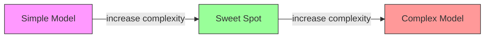
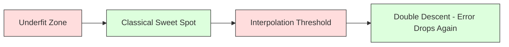
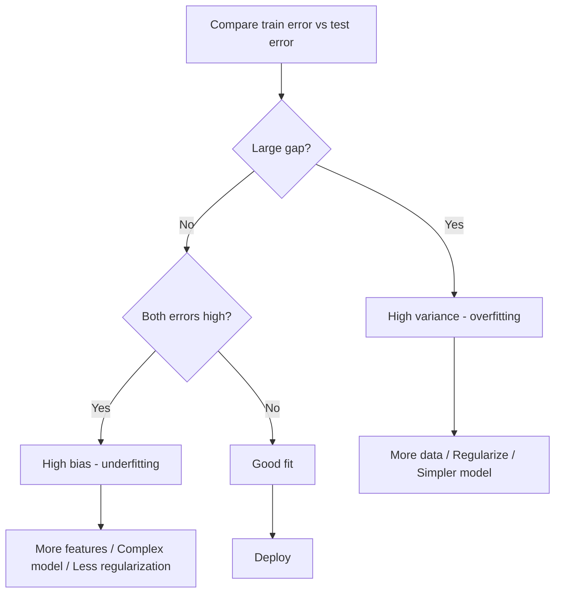
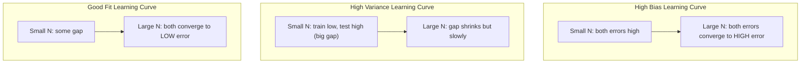
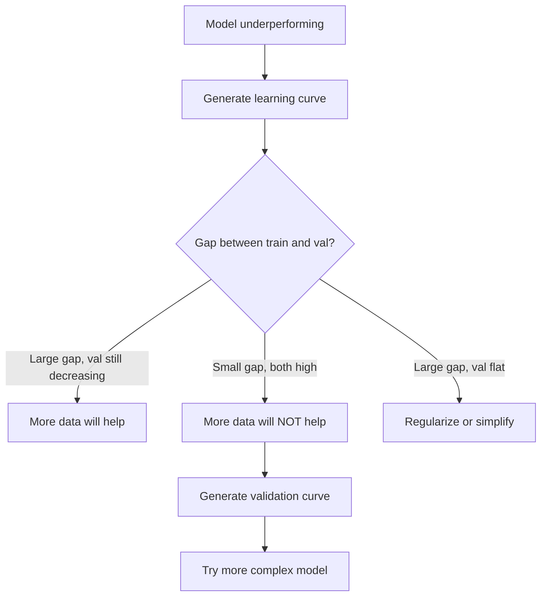

# 偏差与方差的权衡

> 模型的每项误差都来自三个来源之一：偏差、方差或噪声。你只能控制前两个。

**Type:** Learn
**Language:** Python
**Prerequisites:** 阶段 2，课程 01-09（机器学习基础、回归、分类、评估）
**Time:** ~75 分钟

## 学习目标

- 推导期望预测误差的偏差—方差分解，并解释不可约噪声的作用
- 根据训练误差与测试误差的模式，诊断模型存在高偏差还是高方差
- 解释正则化技术（L1、L2、dropout〔随机失活〕、早停）如何以偏差换取方差的降低
- 实现实验，直观展示模型复杂度逐步增加时偏差与方差的权衡

## 要解决的问题

你训练了一个模型，它在测试数据上有一定误差。这些误差从何而来？

如果模型过于简单（例如对呈曲线关系的数据集使用线性回归），它就会始终偏离真实模式。这就是偏差。如果模型过于复杂（例如用 20 次多项式拟合 15 个数据点），它会完美拟合训练数据，却在新数据上给出差异极大的预测。这就是方差。

在模型容量固定时，你无法同时把两者降到最低。压低偏差，方差就会上升；压低方差，偏差就会上升。理解这种权衡，是机器学习中最有用的一项诊断技能。它告诉你应该提高还是降低模型复杂度，应该获取更多数据还是构造更好的特征，以及应该加强还是减弱正则化。

## 核心概念

### 偏差：系统性误差

偏差（bias）衡量模型的平均预测偏离真实值的程度。如果在从同一分布抽取的许多不同训练集上训练同一种模型，再对预测取平均，那么这个平均值与真值之间的差距就是偏差。

高偏差意味着模型过于僵化，无法捕捉真实模式。用直线拟合抛物线，无论给它多少数据，都会偏离曲线。这就是欠拟合。

```text
High bias (underfitting):
  Model always predicts roughly the same wrong thing.
  Training error: HIGH
  Test error: HIGH
  Gap between them: SMALL
```

### 方差：对训练数据的敏感程度

方差（variance）衡量在不同数据子集上训练时，预测会发生多大变化。如果训练集的微小变化导致模型产生很大变化，方差就很高。

高方差意味着模型拟合的是训练数据中的噪声，而非背后的信号。20 次多项式会穿过每个训练点，却在点与点之间剧烈振荡。这就是过拟合。

```text
High variance (overfitting):
  Model fits training data perfectly but fails on new data.
  Training error: LOW
  Test error: HIGH
  Gap between them: LARGE
```

### 误差分解

对于任意点 x，平方损失下的期望预测误差可精确分解为：

```text
Expected Error = Bias^2 + Variance + Irreducible Noise

where:
  Bias^2   = (E[f_hat(x)] - f(x))^2
  Variance = E[(f_hat(x) - E[f_hat(x)])^2]
  Noise    = E[(y - f(x))^2]             (sigma^2)
```

- `f(x)` 是真实函数
- `f_hat(x)` 是模型的预测
- `E[...]` 是对不同训练集取期望
- `y` 是观测标签（真实函数加上噪声）

噪声项是不可约的。在含噪数据上，任何模型的误差都不可能低于 sigma^2。你的任务是在 bias^2 与 variance 之间找到适当的平衡。

### 模型复杂度与误差



经典的 U 形曲线：

| 复杂度 | 偏差 | 方差 | 总误差 |
|-----------|------|----------|-------------|
| 过低 | 高 | 低 | 高（欠拟合） |
| 恰当 | 中等 | 中等 | 最低 |
| 过高 | 低 | 高 | 高（过拟合） |

### 通过正则化控制偏差与方差

正则化有意增加偏差，以降低方差。它约束模型，使模型无法追逐噪声。

- **L2（Ridge，岭回归）：** 将所有权重向零收缩。保留全部特征，但减小它们的影响。
- **L1（Lasso）：** 将部分权重直接压到零，从而执行特征选择。
- **Dropout（随机失活）：** 在训练期间随机停用神经元，迫使模型形成冗余表示。
- **早停（early stopping）：** 在模型完全拟合训练数据之前停止训练。

正则化强度（lambda、dropout 率、训练轮数）直接决定你在偏差—方差曲线上的位置。更强的正则化意味着更高的偏差和更低的方差。

### 双下降：现代视角

经典理论认为：越过最佳平衡点之后，复杂度越高，表现总会越差。但自 2019 年以来，研究发现了一个出人意料的现象。如果持续提高模型容量，使其远远超过插值阈值（此时模型已拥有足够多的参数，可以完美拟合训练数据），测试误差可能会再次下降。



这种“双下降”（double descent）现象解释了为什么大幅过参数化的神经网络（参数数目远多于训练样本数）仍然能够很好地泛化。经典的偏差—方差权衡并没有错，只是对于现代情形而言还不完整。

关于双下降的重要观察：
- 它会出现在线性模型、决策树和神经网络中
- 在插值区域，更多数据实际上可能有害（随样本数变化的双下降）
- 更多训练轮次也可能引发这一现象（随训练轮次变化的双下降）
- 正则化会使峰值变平缓，但不会将其消除

为什么会这样？在插值阈值处，模型的容量刚好足以拟合所有训练点。它被迫采用一种非常特定的解，穿过每个数据点；数据的微小扰动就会造成拟合结果的大幅变化。方差在这里达到峰值。超过这一阈值后，模型有许多能够完美拟合数据的解。学习算法（例如带有隐式正则化的梯度下降）倾向于从中选择最简单的解。这种偏向简单解的隐式偏好，正是过参数化模型能够泛化的原因。

| 区域 | 参数数与样本数 | 表现 |
|--------|----------------------|----------|
| 欠参数化 | p << n | 经典权衡适用 |
| 插值阈值 | p ~ n | 方差达到峰值，测试误差陡增 |
| 过参数化 | p >> n | 隐式正则化开始发挥作用，测试误差下降 |

从实践角度看：如果使用神经网络或大型树集成，不要停在插值阈值处。要么保持在远低于阈值的位置（配合显式正则化），要么远远超过阈值。恰好位于阈值处是最糟糕的情况。

### 诊断模型



| 症状 | 诊断 | 应对方法 |
|---------|-----------|-----|
| 训练误差高，测试误差高 | 偏差 | 增加特征、采用更复杂的模型、减弱正则化 |
| 训练误差低，测试误差高 | 方差 | 增加数据、正则化、简化模型、dropout |
| 训练误差低，测试误差低 | 拟合良好 | 交付 |
| 训练误差下降，测试误差上升 | 正在过拟合 | 早停 |

### 实用策略

**当问题出在偏差时：**
- 添加多项式特征或交互特征
- 使用更灵活的模型（以树集成替代线性模型）
- 降低正则化强度
- 延长训练时间（如果尚未收敛）

**当问题出在方差时：**
- 获取更多训练数据
- 使用 Bagging（自助聚合，例如随机森林）
- 加强正则化（更大的 lambda、更高的 dropout 率）
- 进行特征选择（移除噪声特征）
- 利用交叉验证尽早发现问题

### 集成方法与方差降低

集成方法是对抗方差最实用的工具。

**Bagging（自助聚合，Bootstrap Aggregating）** 在训练数据的不同 bootstrap 样本（自助抽样样本）上训练多个模型，然后对它们的预测取平均。每个单独模型的方差都很高，但平均结果的方差低得多。随机森林就是将 Bagging 应用于决策树。

其数学原理是：如果对 N 个相互独立、方差均为 sigma^2 的预测取平均，平均值的方差就是 sigma^2 / N。这些模型并非真正独立（它们看到的数据都很相似），因此降低程度不及 1/N，但仍然很可观。

**Boosting（提升法）** 通过顺序构建模型来降低偏差，每个新模型都着重处理当前集成的错误。梯度提升和 AdaBoost 是主要例子。如果添加过多模型，Boosting 可能过拟合，因此需要早停或正则化。

| 方法 | 主要效果 | 偏差变化 | 方差变化 |
|--------|---------------|-------------|-----------------|
| Bagging | 降低方差 | 不变 | 降低 |
| Boosting | 降低偏差 | 降低 | 可能增加 |
| Stacking（堆叠集成） | 两者都降低 | 取决于元学习器 | 取决于基模型 |
| Dropout | 隐式 Bagging | 略有增加 | 降低 |

**实用规则：** 如果基模型的方差很高（如深树、高次多项式），就使用 Bagging。如果基模型的偏差很高（如浅树桩、简单线性模型），就使用 Boosting。

### 学习曲线

学习曲线以训练集大小为横轴，绘制训练误差与验证误差。它是你最实用的诊断工具。与单次训练／测试对比不同，学习曲线展示模型的变化轨迹，并告诉你增加数据是否有帮助。



如何阅读这些曲线：

| 情形 | 训练误差 | 验证误差 | 差距 | 含义 | 应对方法 |
|----------|---------------|-----------------|-----|---------------|------------|
| 高偏差 | 高 | 高 | 小 | 模型无法捕捉模式 | 增加特征、采用更复杂的模型、减弱正则化 |
| 高方差 | 低 | 高 | 大 | 模型记住了训练数据 | 增加数据、正则化、简化模型 |
| 拟合良好 | 中等 | 中等 | 小 | 模型泛化良好 | 交付 |
| 高方差，正在改善 | 低 | 随数据增加而下降 | 缩小 | 数据能够解决的方差问题 | 收集更多数据 |
| 高偏差，曲线平坦 | 高 | 高且平坦 | 小且不变 | 更多数据不会有帮助 | 更换模型架构 |

关键判断是：如果两条曲线都进入了平台期，差距很小，但两种误差都很高，那么增加数据没有用。你需要更好的模型。如果差距很大并且仍在缩小，更多数据就会有帮助。

### 如何生成学习曲线

有两种方法：

**方法 1：改变训练集大小，固定模型。** 保持模型与超参数不变。在越来越大的训练数据子集上训练，测量每种数据规模下的训练误差与验证误差。这就是标准的学习曲线。

**方法 2：改变模型复杂度，固定数据。** 保持数据不变，遍历一个复杂度参数（多项式次数、树深、层数）的取值，测量各复杂度下的训练误差与验证误差。这是验证曲线，直接展示偏差与方差的权衡。

两种方法相互补充。前者告诉你增加数据是否有帮助，后者告诉你更换模型是否有帮助。在决定下一步之前，两种都应运行。



```figure
bias-variance
```

## 动手实现

`code/bias_variance.py` 中的代码运行完整的偏差—方差分解实验。下面逐步说明实现方法。

### 步骤 1：根据已知函数生成合成数据

我们使用 `f(x) = sin(1.5x) + 0.5x`，并加入 Gaussian（高斯）噪声。已知真实函数，就能计算精确的偏差和方差。

```python
def true_function(x):
    return np.sin(1.5 * x) + 0.5 * x

def generate_data(n_samples=30, noise_std=0.5, x_range=(-3, 3), seed=None):
    rng = np.random.RandomState(seed)
    x = rng.uniform(x_range[0], x_range[1], n_samples)
    y = true_function(x) + rng.normal(0, noise_std, n_samples)
    return x, y
```

### 步骤 2：bootstrap 抽样与多项式拟合

对每个多项式次数，抽取许多个 bootstrap 训练集，拟合多项式，并记录模型在固定测试网格上的预测。这样便可得到每个测试点上的预测分布。

```python
def fit_polynomial(x_train, y_train, degree, lam=0.0):
    X = np.column_stack([x_train ** d for d in range(degree + 1)])
    if lam > 0:
        penalty = lam * np.eye(X.shape[1])
        penalty[0, 0] = 0
        w = np.linalg.solve(X.T @ X + penalty, X.T @ y_train)
    else:
        w = np.linalg.lstsq(X, y_train, rcond=None)[0]
    return w
```

我们在 200 个不同的 bootstrap 样本上进行拟合。每个 bootstrap 样本都从同一个底层分布抽取，但包含不同的数据点。

### 步骤 3：计算 Bias^2 与方差分解

每个测试点都有 200 组预测，可直接根据定义计算分解：

```python
mean_pred = predictions.mean(axis=0)
bias_sq = np.mean((mean_pred - y_true) ** 2)
variance = np.mean(predictions.var(axis=0))
total_error = np.mean(np.mean((predictions - y_true) ** 2, axis=1))
```

- `mean_pred` 是根据 bootstrap 样本估计的 E[f_hat(x)]
- `bias_sq` 是平均预测与真值之间差距的平方
- `variance` 是预测在各 bootstrap 样本间离散程度的平均值
- `total_error` 应近似等于 bias^2 + variance + noise

### 步骤 4：学习曲线

学习曲线在模型复杂度固定时遍历训练集大小，展示模型受限于数据还是容量。

```python
def demo_learning_curves():
    sizes = [10, 15, 20, 30, 50, 75, 100, 150, 200, 300]
    degree = 5

    for n in sizes:
        train_errors = []
        test_errors = []
        for seed in range(50):
            x_train, y_train = generate_data(n_samples=n, seed=seed * 100)
            w = fit_polynomial(x_train, y_train, degree)
            train_pred = predict_polynomial(x_train, w)
            train_mse = np.mean((train_pred - y_train) ** 2)
            test_pred = predict_polynomial(x_test, w)
            test_mse = np.mean((test_pred - y_test) ** 2)
            train_errors.append(train_mse)
            test_errors.append(test_mse)
        # Average over runs gives the learning curve point
```

对于高方差模型（数据较少时的 5 次多项式），你会看到：
- 训练误差起初很低，随后随着更多数据让记忆训练集变得更难而上升
- 测试误差起初很高，随后随着模型获得更多信号而下降
- 差距随着数据增加而缩小

对于高偏差模型（1 次多项式），两种误差会迅速收敛到同一个较高值，更多数据也无济于事。

### 步骤 5：遍历正则化强度

代码还包含 `demo_regularization_sweep()`：固定一个高次多项式（15 次），将 Ridge 正则化强度从 0.001 遍历到 100。这从另一个角度展示偏差—方差权衡：不改变模型复杂度，而是改变约束强度。

```python
def demo_regularization_sweep():
    alphas = [0.001, 0.005, 0.01, 0.05, 0.1, 0.5, 1.0, 5.0, 10.0, 50.0, 100.0]
    for alpha in alphas:
        results = bias_variance_decomposition([15], lam=alpha)
        r = results[15]
        print(f"alpha={alpha:.3f}  bias={r['bias_sq']:.4f}  var={r['variance']:.4f}")
```

在 alpha 较小时，15 次多项式几乎不受约束。模型追逐每个 bootstrap 样本中的噪声，因此方差占主导。在 alpha 较大时，惩罚很强，模型实际上变成了近似常数函数，偏差占主导。最佳 alpha 位于这两个极端之间。

这与改变多项式次数时得到的 U 形曲线相同，只不过控制它的是连续参数，而非离散参数。实践中，正则化是控制这种权衡的首选方式，因为它不需要改变特征集合，就能进行细粒度调节。

## 实际使用

sklearn 提供 `learning_curve` 和 `validation_curve`，无需编写 bootstrap 循环即可自动完成这些诊断。

### 验证曲线：遍历模型复杂度

```python
from sklearn.model_selection import validation_curve
from sklearn.pipeline import make_pipeline
from sklearn.preprocessing import PolynomialFeatures
from sklearn.linear_model import Ridge

degrees = list(range(1, 16))
train_scores_all = []
val_scores_all = []

for d in degrees:
    pipe = make_pipeline(PolynomialFeatures(d), Ridge(alpha=0.01))
    train_scores, val_scores = validation_curve(
        pipe, X, y, param_name="polynomialfeatures__degree",
        param_range=[d], cv=5, scoring="neg_mean_squared_error"
    )
    train_scores_all.append(-train_scores.mean())
    val_scores_all.append(-val_scores.mean())
```

这会直接给出偏差—方差权衡曲线。验证得分相对于训练得分最差的位置，方差占主导；两者都差时，偏差占主导。

### 学习曲线：遍历训练集大小

```python
from sklearn.model_selection import learning_curve

pipe = make_pipeline(PolynomialFeatures(5), Ridge(alpha=0.01))
train_sizes, train_scores, val_scores = learning_curve(
    pipe, X, y, train_sizes=np.linspace(0.1, 1.0, 10),
    cv=5, scoring="neg_mean_squared_error"
)
train_mse = -train_scores.mean(axis=1)
val_mse = -val_scores.mean(axis=1)
```

以 `train_sizes` 为横轴绘制 `train_mse` 与 `val_mse`。曲线形状会告诉你关于模型的一切。

### 配合正则化强度遍历进行交叉验证

```python
from sklearn.model_selection import cross_val_score

alphas = [0.001, 0.01, 0.1, 1.0, 10.0, 100.0]
for alpha in alphas:
    pipe = make_pipeline(PolynomialFeatures(10), Ridge(alpha=alpha))
    scores = cross_val_score(pipe, X, y, cv=5, scoring="neg_mean_squared_error")
    print(f"alpha={alpha:>7.3f}  MSE={-scores.mean():.4f} +/- {scores.std():.4f}")
```

这里在模型复杂度固定时遍历正则化强度。你会看到同样的偏差—方差权衡：alpha 小意味着方差高，alpha 大意味着偏差高。

### 汇总：完整的诊断流程

实践中，按以下顺序运行诊断：

1. 训练模型，计算训练误差与测试误差。
2. 如果两者都很高：存在偏差问题，跳到步骤 4。
3. 如果训练误差低而测试误差高：存在方差问题。生成学习曲线，判断更多数据是否有帮助；如果没有，就进行正则化。
4. 生成验证曲线，遍历主要复杂度参数，找到最佳平衡点。
5. 在最佳平衡点处生成学习曲线。如果差距仍然很大，就需要更多数据或正则化。
6. 使用 `cross_val_score`，尝试不同 alpha 值下的 Ridge/Lasso，选择交叉验证误差最低的 alpha。

对于大多数表格数据集，这需要 10-15 分钟计算时间，却能省去数小时的猜测。

## 交付成果

本课产出：`outputs/prompt-model-diagnostics.md`

## 练习

1. 使用 `noise_std=0`（无噪声）运行分解。不可约误差项会发生什么变化？最佳复杂度会改变吗？

2. 将训练集大小从 30 增至 300。这会如何影响方差分量？最佳多项式次数会变化吗？

3. 在实验中加入 L2 正则化（Ridge 回归）。对于固定的高次多项式（15 次），将 lambda 从 0 遍历到 100，绘制 bias^2 和 variance 随 lambda 变化的曲线。

4. 将真实函数从多项式改为 `sin(x)`。偏差—方差分解会如何变化？是否仍有明确的最佳次数？

5. 实现一个简单的 bootstrap aggregating（Bagging，自助聚合）封装器：在 bootstrap 样本上训练 10 个模型，再对预测取平均。展示它如何在不大幅增加偏差的情况下降低方差。

## 关键术语

| 术语 | 常见说法 | 实际含义 |
|------|----------------|----------------------|
| 偏差 | “模型太简单” | 错误假设导致的系统性误差，即模型平均预测与真值之间的差距。 |
| 方差 | “模型过拟合了” | 对训练数据敏感导致的误差，即不同训练集之间预测的变化程度。 |
| 不可约误差 | “数据中的噪声” | 真实数据生成过程中的随机性造成的误差，任何模型都无法消除。 |
| 欠拟合 | “学得不够” | 模型偏差高，即使在训练数据上也无法捕捉真实模式。 |
| 过拟合 | “记住了数据” | 模型方差高，拟合了训练数据中无法泛化的噪声。 |
| 正则化 | “约束模型” | 加入惩罚以降低模型复杂度，用偏差换取更低的方差。 |
| 双下降 | “更多参数可能有帮助” | 模型容量远远超过插值阈值时，测试误差再次下降。 |
| 模型复杂度 | “模型有多灵活” | 模型拟合任意模式的能力，由架构、特征或正则化控制。 |

## 延伸阅读

- [Hastie, Tibshirani, Friedman: Elements of Statistical Learning, Ch. 7](https://hastie.su.domains/ElemStatLearn/) -- 偏差—方差分解的权威论述
- [Belkin et al., Reconciling modern machine learning practice and the bias-variance trade-off (2019)](https://arxiv.org/abs/1812.11118) -- 双下降论文
- [Nakkiran et al., Deep Double Descent (2019)](https://arxiv.org/abs/1912.02292) -- 随训练轮次和样本数变化的双下降
- [Scott Fortmann-Roe: Understanding the Bias-Variance Tradeoff](http://scott.fortmann-roe.com/docs/BiasVariance.html) -- 清晰的图示解释
