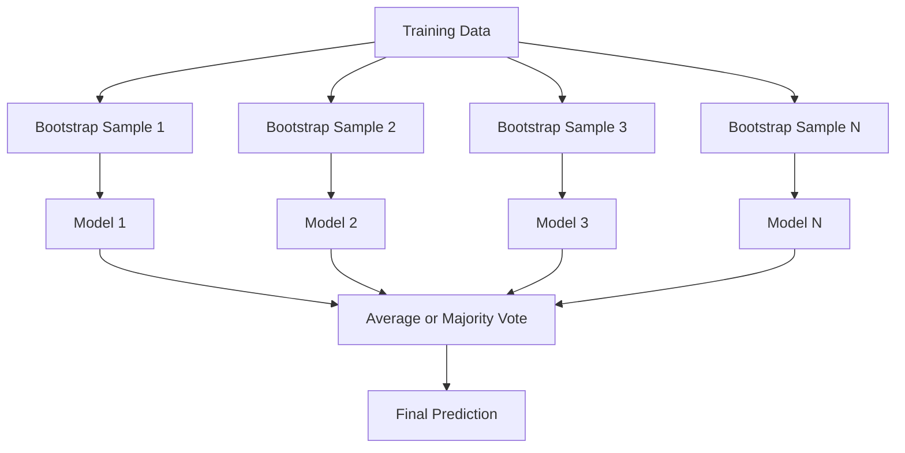
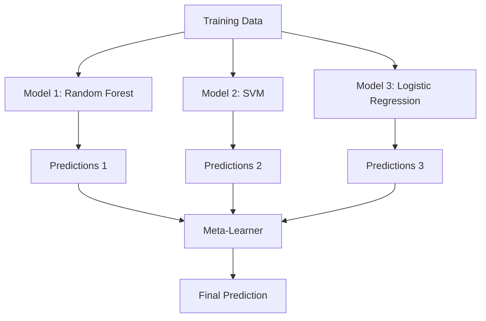

# 集成方法

> 一组弱学习器经过正确组合，就会成为一个强学习器。这不是比喻，而是一个定理。

**Type:** Build
**Language:** Python
**Prerequisites:** 阶段 2，课程 10（偏差与方差的权衡）
**Time:** ~120 分钟

## 学习目标

- 从零实现 AdaBoost 和梯度提升，并解释提升法如何逐步降低偏差
- 构建 Bagging（自助聚合）集成，展示对去相关模型取平均如何在不增加偏差的情况下降低方差
- 比较 Bagging、Boosting（提升法）和 Stacking（堆叠集成）各自针对哪一类误差分量
- 评估集成的多样性，并解释为何相互独立的弱学习器越多，多数投票的准确率就越高

## 要解决的问题

单棵决策树训练快、容易解释，却会过拟合。单个线性模型面对复杂边界时则会欠拟合。你可以花上好几天设计完美的模型架构，也可以把一批不完美的模型组合起来，得到比其中任何一个单独模型都更好的结果。

集成方法做的正是这件事。它们是赢得 Kaggle 表格数据竞赛最可靠的技术，支撑着大多数生产环境中的机器学习系统，也直观展现了偏差与方差的权衡。Bagging 降低方差，Boosting 降低偏差，Stacking 则学习面对哪些输入时该信任哪些模型。

## 核心概念

### 集成为何有效

假设有 N 个相互独立的分类器，每个的准确率都是 p > 0.5。多数投票的准确率为：

```text
P(majority correct) = sum over k > N/2 of C(N,k) * p^k * (1-p)^(N-k)
```

对于 21 个准确率均为 60% 的分类器，多数投票的准确率约为 74%。当分类器数量增加到 101 个时，准确率会上升到 84%。当模型犯的错误不同时，错误会相互抵消。

关键要求是 **多样性**。如果所有模型都犯同样的错误，组合起来毫无帮助。集成之所以有效，是因为它通过以下方式产生多样化的模型：

- 使用不同的训练子集（Bagging）
- 使用不同的特征子集（随机森林）
- 顺序纠正错误（Boosting）
- 使用不同模型家族（Stacking）

### Bagging（自助聚合，Bootstrap Aggregating）

Bagging 让每个模型在训练数据的不同 bootstrap 样本（自助抽样样本）上训练，从而创造多样性。



bootstrap 样本由原数据有放回抽取，大小与原数据相同。每次 bootstrap 抽样大约会包含原数据中 63.2% 的不同样本。剩余的 36.8%（袋外样本）可以充当无需额外划分的验证集。

Bagging 在不大幅增加偏差的情况下降低方差。每棵树都会对自己的 bootstrap 样本过拟合，但各棵树的过拟合方式不同，因此取平均会抵消噪声。

**随机森林（Random Forests）** 在 Bagging 的基础上多做了一件事：每次分裂时，只考虑一个随机特征子集。这进一步增强了树之间的多样性。典型的候选特征数在分类任务中为 `sqrt(n_features)`，在回归任务中为 `n_features / 3`。

### Boosting（顺序纠正错误）

Boosting 按顺序训练模型。每个新模型都着重处理之前的模型判断错误的样本。


Boosting 降低偏差。每个新模型都会纠正当前集成的系统性错误。最终预测是所有模型的加权和，表现更好的模型获得更高权重。

代价是：Boosting 如果运行过多轮，可能会过拟合，因为它会不断拟合更难的样本，而其中一些可能是噪声。

### AdaBoost

AdaBoost（自适应提升，Adaptive Boosting）是第一个实用的提升算法。它可以使用任何基学习器，通常采用决策树桩（深度为 1 的树）。

算法如下：

```text
1. Initialize sample weights: w_i = 1/N for all i

2. For t = 1 to T:
   a. Train weak learner h_t on weighted data
   b. Compute weighted error:
      err_t = sum(w_i * I(h_t(x_i) != y_i)) / sum(w_i)
   c. Compute model weight:
      alpha_t = 0.5 * ln((1 - err_t) / err_t)
   d. Update sample weights:
      w_i = w_i * exp(-alpha_t * y_i * h_t(x_i))
   e. Normalize weights to sum to 1

3. Final prediction: H(x) = sign(sum(alpha_t * h_t(x)))
```

误差较低的模型会得到更大的 alpha。误分类样本会获得更高权重，使下一个模型着重处理它们。

### 梯度提升

梯度提升将提升法推广到任意损失函数。它不重新调整样本权重，而是让每个新模型拟合当前集成的残差（损失的负梯度）。

```text
1. Initialize: F_0(x) = argmin_c sum(L(y_i, c))

2. For t = 1 to T:
   a. Compute pseudo-residuals:
      r_i = -dL(y_i, F_{t-1}(x_i)) / dF_{t-1}(x_i)
   b. Fit a tree h_t to the residuals r_i
   c. Find optimal step size:
      gamma_t = argmin_gamma sum(L(y_i, F_{t-1}(x_i) + gamma * h_t(x_i)))
   d. Update:
      F_t(x) = F_{t-1}(x) + learning_rate * gamma_t * h_t(x)

3. Final prediction: F_T(x)
```

对于平方误差损失，伪残差就是实际残差：`r_i = y_i - F_{t-1}(x_i)`。每棵树拟合的正是之前集成的错误。

学习率（收缩系数，shrinkage）控制每棵树的贡献。较小的学习率需要更多树，但泛化更好。典型取值为 0.01 到 0.3。

### XGBoost：为何主导表格数据任务

XGBoost（eXtreme Gradient Boosting）在梯度提升的基础上加入工程优化，使其速度快、准确率高，并且能够抵抗过拟合：

- **正则化目标：** 对叶节点权重施加 L1 和 L2 惩罚，防止单棵树过于自信
- **二阶近似：** 同时使用损失的一阶与二阶导数，作出更好的分裂决策
- **稀疏感知分裂：** 在每次分裂时学习缺失数据的最佳去向，从而原生处理缺失值
- **列子采样：** 与随机森林类似，每次分裂时对特征进行抽样以增加多样性
- **加权分位数摘要（weighted quantile sketch）：** 在分布式数据上高效寻找连续特征的分裂点
- **缓存感知块结构：** 针对 CPU 缓存行优化内存布局

对于表格数据，XGBoost（及其后继者 LightGBM）始终优于神经网络。这种情况短期内不会改变。如果数据可以放进有行有列的表格，就从梯度提升开始。

### Stacking（元学习）

Stacking 把多个基模型的预测作为元学习器的输入特征。



元学习器会学习在面对哪些输入时应该信任哪个基模型。如果随机森林在某些区域表现更好，而 SVM 在另一些区域更好，元学习器就会学会相应地选择模型。

为避免数据泄漏，基模型的预测必须通过在训练集上进行交叉验证来生成。绝不能在同一份数据上既训练基模型，又生成元特征。

### 投票

这是最简单的集成方式，直接组合预测即可。

- **硬投票：** 对类别标签进行多数投票。
- **软投票：** 对预测概率取平均，选择平均概率最高的类别。由于利用了置信度信息，通常效果更好。

```figure
f3-ensemble-average
```

## 动手实现

### 步骤 1：决策树桩（基学习器）

`code/ensembles.py` 中的代码从零实现了全部内容。我们先从决策树桩开始：它是一棵只有一次分裂的树。

```python
class DecisionStump:
    def __init__(self):
        self.feature_idx = None
        self.threshold = None
        self.polarity = 1
        self.alpha = None

    def fit(self, X, y, weights):
        n_samples, n_features = X.shape
        best_error = float("inf")

        for f in range(n_features):
            thresholds = np.unique(X[:, f])
            for thresh in thresholds:
                for polarity in [1, -1]:
                    pred = np.ones(n_samples)
                    pred[polarity * X[:, f] < polarity * thresh] = -1
                    error = np.sum(weights[pred != y])
                    if error < best_error:
                        best_error = error
                        self.feature_idx = f
                        self.threshold = thresh
                        self.polarity = polarity

    def predict(self, X):
        n = X.shape[0]
        pred = np.ones(n)
        idx = self.polarity * X[:, self.feature_idx] < self.polarity * self.threshold
        pred[idx] = -1
        return pred
```

### 步骤 2：从零实现 AdaBoost

```python
class AdaBoostScratch:
    def __init__(self, n_estimators=50):
        self.n_estimators = n_estimators
        self.stumps = []
        self.alphas = []

    def fit(self, X, y):
        n = X.shape[0]
        weights = np.full(n, 1 / n)

        for _ in range(self.n_estimators):
            stump = DecisionStump()
            stump.fit(X, y, weights)
            pred = stump.predict(X)

            err = np.sum(weights[pred != y])
            err = np.clip(err, 1e-10, 1 - 1e-10)

            alpha = 0.5 * np.log((1 - err) / err)
            weights *= np.exp(-alpha * y * pred)
            weights /= weights.sum()

            stump.alpha = alpha
            self.stumps.append(stump)
            self.alphas.append(alpha)

    def predict(self, X):
        total = sum(a * s.predict(X) for a, s in zip(self.alphas, self.stumps))
        return np.sign(total)
```

### 步骤 3：从零实现梯度提升

```python
class GradientBoostingScratch:
    def __init__(self, n_estimators=100, learning_rate=0.1, max_depth=3):
        self.n_estimators = n_estimators
        self.lr = learning_rate
        self.max_depth = max_depth
        self.trees = []
        self.initial_pred = None

    def fit(self, X, y):
        self.initial_pred = np.mean(y)
        current_pred = np.full(len(y), self.initial_pred)

        for _ in range(self.n_estimators):
            residuals = y - current_pred
            tree = SimpleRegressionTree(max_depth=self.max_depth)
            tree.fit(X, residuals)
            update = tree.predict(X)
            current_pred += self.lr * update
            self.trees.append(tree)

    def predict(self, X):
        pred = np.full(X.shape[0], self.initial_pred)
        for tree in self.trees:
            pred += self.lr * tree.predict(X)
        return pred
```

### 步骤 4：与 sklearn 对比

代码验证从零实现的模型与 sklearn 的 `AdaBoostClassifier` 和 `GradientBoostingClassifier` 能达到相近准确率，并将所有方法并列比较。

## 实际使用

### 各种方法分别适用于何时

| 方法 | 降低什么 | 最适合 | 注意事项 |
|--------|---------|----------|---------------|
| Bagging / 随机森林 | 方差 | 噪声数据、特征较多 | 对偏差无帮助 |
| AdaBoost | 偏差 | 干净数据、简单基学习器 | 对离群点和噪声敏感 |
| 梯度提升 | 偏差 | 表格数据、竞赛 | 训练慢，不调参容易过拟合 |
| XGBoost / LightGBM | 两者 | 生产环境中的表格数据机器学习 | 超参数多 |
| Stacking | 两者 | 争取最后 1-2% 的准确率 | 复杂，元学习器有过拟合风险 |
| 投票 | 方差 | 快速组合多样化模型 | 只有模型具有多样性时才有帮助 |

### 表格数据的生产技术栈

对于大多数表格数据预测问题，可按以下顺序尝试：

1. 使用默认参数的 **LightGBM 或 XGBoost**
2. 调整 n_estimators、learning_rate、max_depth、min_child_weight
3. 如果需要最后 0.5% 的提升，用 3-5 个具有多样性的模型构建 Stacking 集成
4. 全程使用交叉验证

尽管研究不断尝试，神经网络在表格数据上的表现几乎总是不如梯度提升。TabNet、NODE 等架构偶尔能够追平，但很少能超越经过充分调参的 XGBoost。

## 交付成果

本课产出 `outputs/prompt-ensemble-selector.md`，这是一个帮助你为给定数据集选择合适集成方法的提示词。描述你的数据（大小、特征类型、噪声水平、类别平衡情况）及所要解决的问题。该提示词会逐项检查决策清单，推荐方法，建议初始超参数，并提示该方法的常见错误。还会产出包含完整选择指南的 `outputs/skill-ensemble-builder.md`。

## 练习

1. 修改 AdaBoost 实现，记录每轮结束后的训练准确率。绘制准确率随估计器数量变化的曲线。它何时收敛？

2. 给回归树加入随机特征子采样，从零实现随机森林。使用 `max_features=sqrt(n_features)` 训练 100 棵树并对预测取平均，与单棵树比较方差降低的程度。

3. 在梯度提升实现中加入早停：记录每轮结束后的验证损失，当连续 10 轮没有改善时停止。它实际需要多少棵树？

4. 用三个基模型（逻辑回归、决策树、K 近邻）和一个逻辑回归元学习器构建 Stacking 集成。使用 5 折交叉验证生成元特征，与每个单独基模型比较。

5. 在同一数据集上用默认参数运行 XGBoost，将其准确率与自己从零实现的梯度提升比较。测量两者耗时，速度差异有多大？

## 关键术语

| 术语 | 常见说法 | 实际含义 |
|------|----------------|----------------------|
| Bagging | “在随机子集上训练” | 自助聚合：在 bootstrap 样本上训练模型，对预测取平均以降低方差 |
| Boosting | “重点处理困难样本” | 按顺序训练模型，每个模型纠正当前集成的错误，以降低偏差 |
| AdaBoost | “重新调整数据权重” | 通过更新样本权重进行提升；误分类点在下一个学习器中得到更高权重 |
| 梯度提升 | “拟合残差” | 让每个新模型拟合损失函数的负梯度，以此进行提升 |
| XGBoost | “Kaggle 利器” | 加入正则化、二阶优化与系统级加速技巧的梯度提升 |
| Stacking | “模型上再叠模型” | 把基模型的预测作为元学习器的输入特征 |
| 随机森林 | “很多随机化的树” | 使用决策树的 Bagging，并在每次分裂时加入随机特征子采样以增加多样性 |
| 集成多样性 | “犯不同的错误” | 各模型的错误必须不相关，集成才能优于单独模型 |
| 袋外误差 | “无需额外划分的验证” | 未被某次 bootstrap 抽样选中的样本（~36.8%）可充当验证集，无需另留出数据 |

## 延伸阅读

- [Schapire & Freund: Boosting: Foundations and Algorithms](https://mitpress.mit.edu/9780262526036/) -- AdaBoost 创造者撰写的著作
- [Friedman: Greedy Function Approximation: A Gradient Boosting Machine (2001)](https://doi.org/10.1214/aos/1013203451) -- 梯度提升的原始论文
- [Chen & Guestrin: XGBoost (2016)](https://arxiv.org/abs/1603.02754) -- XGBoost 论文
- [Wolpert: Stacked Generalization (1992)](https://www.sciencedirect.com/science/article/abs/pii/S0893608005800231) -- Stacking 的原始论文
- [scikit-learn Ensemble Methods](https://scikit-learn.org/stable/modules/ensemble.html) -- 实践参考
