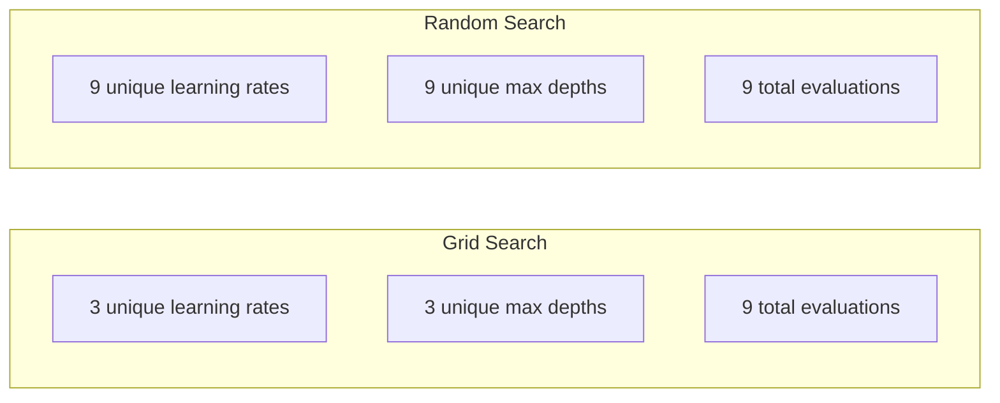
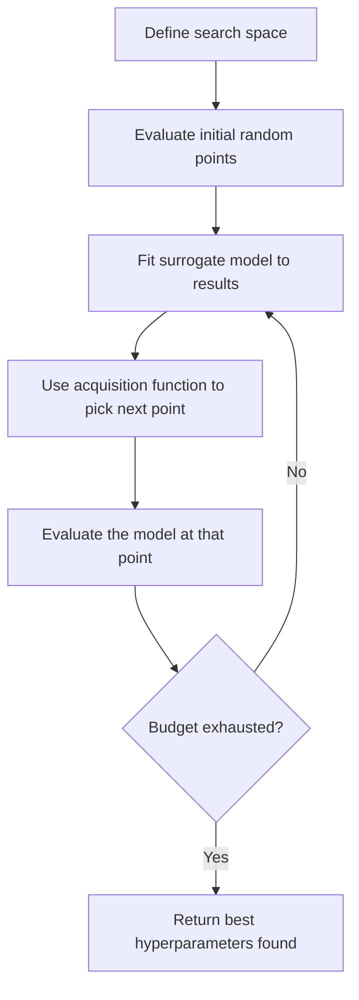
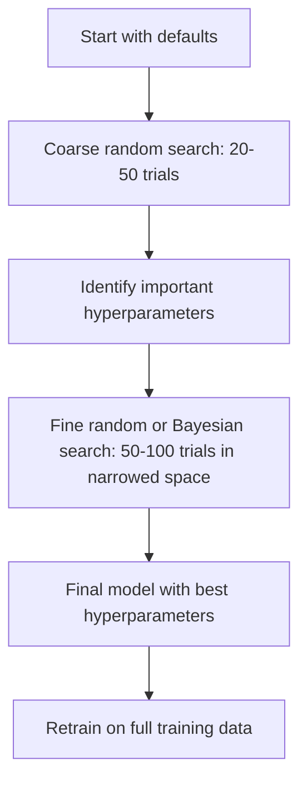
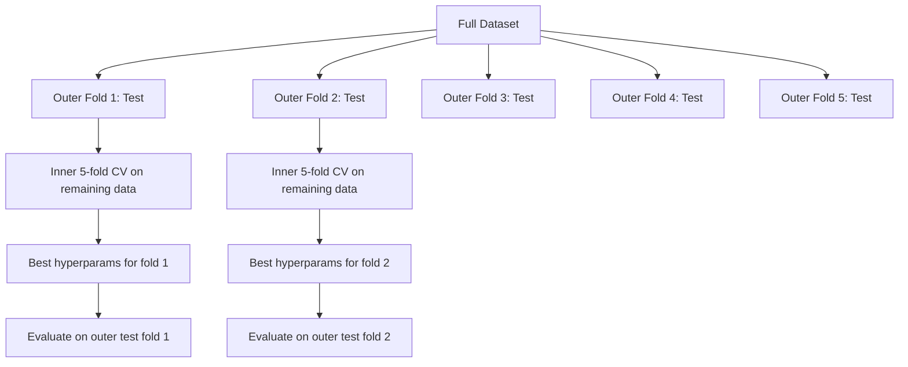

# 超参数调优

> 超参数是在训练开始前调节的旋钮。调得好不好，决定了模型是平庸还是出色。

**Type:** Build
**Language:** Python
**Prerequisites:** 阶段 2，课程 11（集成方法）
**Time:** ~90 分钟

## 学习目标

- 从零实现网格搜索、随机搜索和贝叶斯优化，并比较它们的样本效率
- 解释为何在大多数超参数的有效维度较低时，随机搜索优于网格搜索
- 构建贝叶斯优化循环，使用代理模型和采集函数引导搜索
- 设计超参数调优策略，通过适当的交叉验证避免对验证集过拟合

## 要解决的问题

你的梯度提升模型有学习率、树的数量、最大深度、叶节点最少样本数、样本子采样比例和列采样比例，共六个超参数。如果每个都有 5 个合理取值，网格就包含 5^6 = 15,625 种组合。每次训练耗时 10 秒，全部尝试一遍就需要 43 小时的计算时间。

网格搜索是最直观的方法，但在大规模搜索时也是最差的方法。随机搜索用更少的计算取得更好的效果。贝叶斯优化通过学习以往的评估结果，表现又更好。知道该用哪种策略，以及哪些超参数真正重要，可以省下好几天原本会浪费的 GPU 时间。

## 核心概念

### 参数与超参数

参数是在训练过程中学到的，例如权重、偏置和分裂阈值。超参数在训练开始前设定，控制学习过程如何进行。

| 超参数 | 控制什么 | 典型范围 |
|---------------|-----------------|---------------|
| 学习率 | 每次更新的步长 | 0.001 到 1.0 |
| 树的数量/训练轮数 | 训练多久 | 10 到 10,000 |
| 最大深度 | 模型复杂性 | 1 到 30 |
| 正则化（lambda） | 防止过拟合 | 0.0001 到 100 |
| 批量大小 | 梯度估计的噪声 | 16 到 512 |
| Dropout 比率 | 随机失活的神经元比例 | 0.0 到 0.5 |

### 网格搜索

网格搜索会评估指定取值的每一种组合。它是穷举式搜索，容易理解，但计算规模随超参数数量呈指数增长。

```text
Grid for 2 hyperparameters:

  learning_rate: [0.01, 0.1, 1.0]
  max_depth:     [3, 5, 7]

  Evaluations: 3 x 3 = 9 combinations

  (0.01, 3)  (0.01, 5)  (0.01, 7)
  (0.1,  3)  (0.1,  5)  (0.1,  7)
  (1.0,  3)  (1.0,  5)  (1.0,  7)
```

网格搜索有一个根本缺陷：如果一个超参数重要，另一个不重要，大多数评估就浪费了。做了 9 次评估，重要参数却只有 3 个不同取值。

### 随机搜索

随机搜索从分布中抽取超参数，而不是从网格中选取。同样做 9 次评估，每个超参数都能得到 9 个不同取值。



随机搜索为何胜过网格搜索（Bergstra & Bengio，2012）：

- 大多数超参数的有效维度较低。对于给定问题，6 个超参数中通常只有 1-2 个真正重要。
- 网格搜索把评估浪费在不重要的维度上。
- 在相同预算下，随机搜索能更密集地覆盖重要维度。
- 进行 60 次随机试验后，你有 95% 的概率找到一个与最优值相差不超过 5% 的点（如果搜索空间中存在这样的点）。

### 贝叶斯优化

随机搜索忽略了结果。它不会学到高学习率会导致发散，也不会学到深度为 3 始终优于深度为 10。贝叶斯优化利用以往的评估结果，决定下一步搜索哪里。



两个关键组成部分：

**代理模型（surrogate model）：** 一个评估成本低的模型（通常是高斯过程），用于近似计算成本高的目标函数。它能在搜索空间的任意一点同时给出预测和不确定性估计。

**采集函数（acquisition function）：** 在利用（在已知的优质点附近搜索）和探索（在不确定性较高的地方搜索）之间取得平衡，决定下一步评估哪里。常见选择包括：

- **期望改进（Expected Improvement，EI）：** 在这个点上，我们预期能比当前最佳结果改善多少？
- **置信上界（Upper Confidence Bound，UCB）：** 预测值加上不确定性的某个倍数。UCB 越高，意味着该点越有潜力，或者越少被探索。
- **改进概率（Probability of Improvement，PI）：** 这个点胜过当前最佳结果的概率是多少？

贝叶斯优化通常只需随机搜索所需评估次数的一半到五分之一（2-5x fewer），就能找到更好的超参数。与训练实际模型相比，拟合代理模型的开销可以忽略不计。

### 早停

并不是每次训练都需要跑完。如果某个配置在 10 个 epoch 后明显表现不佳，就停止它，继续尝试其他配置。这就是超参数搜索语境中的早停。

策略包括：
- **基于耐心窗口：** 如果验证损失连续 N 个 epoch 没有改善，就停止
- **中位数剪枝（median pruning）：** 如果某次试验的中间结果差于已完成试验在相同步骤的中位数，就停止
- **Hyperband：** 给许多配置分配较小预算，再逐步增加表现最好那些配置的预算

Hyperband 特别有效。它先启动 81 个配置，每个训练 1 个 epoch，保留排名前三分之一的配置，给它们 3 个 epoch，再保留前三分之一，以此类推。与让所有配置都用满预算相比，这样找到好配置的速度快 10-50x。

### 学习率调度器

学习率几乎总是最重要的超参数。调度器会在训练过程中调整学习率，而不是让它保持固定。

| 调度器 | 公式 | 适用场景 |
|-----------|---------|-------------|
| 阶梯衰减 | 每 N 个 epoch 乘以 0.1 | 经典 CNN 训练 |
| 余弦退火 | lr * 0.5 * (1 + cos(pi * t / T)) | 当今的默认选择 |
| 预热 + 衰减 | 先线性增加，再余弦衰减 | Transformer |
| 单周期 | 在一个周期内先升后降 | 快速收敛 |
| 平台期降低学习率 | 指标停滞时按因子降低 | 稳妥的默认选择 |

### 超参数重要性

并非所有超参数都同样重要。关于随机森林（Probst 等，2019）和梯度提升的研究呈现出一致的规律：

**高重要性：**
- 学习率（总是优先调它）
- 估计器数量/训练轮数（用早停代替调优）
- 正则化强度

**中等重要性：**
- 最大深度/层数
- 叶节点最少样本数/权重衰减
- 样本子采样比例

**低重要性：**
- 最大特征数（针对随机森林）
- 具体激活函数的选择
- 批量大小（在合理范围内）

先调重要的超参数，其余保持默认值。

### 实用策略



具体流程如下：

1. **从库的默认值开始。** 这些默认值由经验丰富的实践者选定，通常已经完成了 80% 的工作。
2. **粗粒度随机搜索。** 范围要宽，做 20-50 次试验，用早停尽快终止差的运行。
3. **分析结果。** 哪些超参数与性能相关？据此缩小搜索空间。
4. **精细搜索。** 在缩小后的空间中进行贝叶斯优化，或有针对性的随机搜索，做 50-100 次试验。
5. 用找到的最佳超参数**在全部训练数据上重新训练**。

### 与交叉验证结合

只在一个验证集划分上调超参数有风险。最佳超参数可能会对这一特定验证折过拟合。嵌套交叉验证通过两层循环解决这个问题：

- **外层循环**（评估）：将数据划分为训练+验证部分和测试部分，报告无偏的性能。
- **内层循环**（调优）：将训练+验证部分再划分为训练部分和验证部分，寻找最佳超参数。



每个外层折都会独立找到自己的最佳超参数。外层得分是泛化性能的无偏估计。

使用 sklearn：

```python
from sklearn.model_selection import cross_val_score, GridSearchCV
from sklearn.ensemble import GradientBoostingRegressor

inner_cv = GridSearchCV(
    GradientBoostingRegressor(),
    param_grid={
        "learning_rate": [0.01, 0.05, 0.1],
        "max_depth": [2, 3, 5],
        "n_estimators": [50, 100, 200],
    },
    cv=5,
    scoring="neg_mean_squared_error",
)

outer_scores = cross_val_score(
    inner_cv, X, y, cv=5, scoring="neg_mean_squared_error"
)

print(f"Nested CV MSE: {-outer_scores.mean():.4f} +/- {outer_scores.std():.4f}")
```

这很昂贵（5 个外层折 x 5 个内层折 x 27 个网格点 = 675 次模型拟合），但能给出可信的性能估计。在论文中报告最终结果，或决策影响重大时，可以使用这种方法。

### 实用建议

**从学习率开始。** 对于基于梯度的方法，它始终是最重要的超参数。学习率不合适，其他一切都无济于事。将其他超参数固定为默认值，先遍历学习率。

**对学习率和正则化使用对数均匀分布。** 0.001 与 0.01 之间的差异，与 0.1 和 1.0 之间的差异同样重要。线性搜索会把预算浪费在较大取值的一端。

**用早停代替调节 n_estimators。** 对于提升法和神经网络，把 n_estimators 或 epoch 数设得较大，让早停决定何时停止。这样就从搜索中去掉了一个超参数。

**预算分配。** 将 60% 的调优预算用于最重要的前 2 个超参数，剩余 40% 用于其他所有超参数。前 2 个超参数解释了大多数性能变化。

**尺度很重要。** 绝不要按对数尺度搜索批量大小（16、32、64 是可以的）。学习率则始终按对数尺度搜索。搜索分布要与超参数影响模型的方式相匹配。

| 模型类型 | 最重要的超参数 | 推荐搜索方法 | 预算 |
|-----------|--------------------|--------------------|--------|
| 随机森林 | n_estimators, max_depth, min_samples_leaf | 随机搜索，50 次试验 | 低（训练快） |
| 梯度提升 | learning_rate, n_estimators, max_depth | 贝叶斯优化，100 次试验 + 早停 | 中等 |
| 神经网络 | learning_rate, weight_decay, batch_size | 贝叶斯优化或随机搜索，100+ 次试验 | 高（训练慢） |
| SVM | C, gamma（RBF 核） | 对数尺度上的网格搜索，25-50 次试验 | 低（2 个参数） |
| Lasso/Ridge | alpha | 对数尺度上的 1D 搜索，20 次试验 | 很低 |
| XGBoost | learning_rate, max_depth, subsample, colsample | 贝叶斯优化，100-200 次试验 + 早停 | 中等 |

**拿不准时：** 做随机搜索，试验次数取超参数数量的 2x（例如，6 个超参数 = 至少 12+ 次试验）。你会惊讶地发现，做 50 次试验的随机搜索常常能胜过精心设计的网格搜索。

```figure
k-fold-cv
```

## 动手实现

### 步骤 1：从零实现网格搜索

`code/tuning.py` 中的代码从零实现了网格搜索、随机搜索和一个简单的贝叶斯优化器。

```python
def grid_search(model_fn, param_grid, X_train, y_train, X_val, y_val):
    keys = list(param_grid.keys())
    values = list(param_grid.values())
    best_score = -float("inf")
    best_params = None
    n_evals = 0

    for combo in itertools.product(*values):
        params = dict(zip(keys, combo))
        model = model_fn(**params)
        model.fit(X_train, y_train)
        score = evaluate(model, X_val, y_val)
        n_evals += 1

        if score > best_score:
            best_score = score
            best_params = params

    return best_params, best_score, n_evals
```

### 步骤 2：从零实现随机搜索

```python
def random_search(model_fn, param_distributions, X_train, y_train,
                  X_val, y_val, n_iter=50, seed=42):
    rng = np.random.RandomState(seed)
    best_score = -float("inf")
    best_params = None

    for _ in range(n_iter):
        params = {k: sample(v, rng) for k, v in param_distributions.items()}
        model = model_fn(**params)
        model.fit(X_train, y_train)
        score = evaluate(model, X_val, y_val)

        if score > best_score:
            best_score = score
            best_params = params

    return best_params, best_score, n_iter
```

### 步骤 3：贝叶斯优化（简化版）

核心思路是：对已观察到的（超参数、得分）对拟合高斯过程，然后用采集函数决定下一步搜索哪里。

```python
class SimpleBayesianOptimizer:
    def __init__(self, search_space, n_initial=5):
        self.search_space = search_space
        self.n_initial = n_initial
        self.X_observed = []
        self.y_observed = []

    def _kernel(self, x1, x2, length_scale=1.0):
        dists = np.sum((x1[:, None, :] - x2[None, :, :]) ** 2, axis=2)
        return np.exp(-0.5 * dists / length_scale ** 2)

    def _fit_gp(self, X_new):
        X_obs = np.array(self.X_observed)
        y_obs = np.array(self.y_observed)
        y_mean = y_obs.mean()
        y_centered = y_obs - y_mean

        K = self._kernel(X_obs, X_obs) + 1e-4 * np.eye(len(X_obs))
        K_star = self._kernel(X_new, X_obs)

        L = np.linalg.cholesky(K)
        alpha = np.linalg.solve(L.T, np.linalg.solve(L, y_centered))
        mu = K_star @ alpha + y_mean

        v = np.linalg.solve(L, K_star.T)
        var = 1.0 - np.sum(v ** 2, axis=0)
        var = np.maximum(var, 1e-6)

        return mu, var

    def _expected_improvement(self, mu, var, best_y):
        sigma = np.sqrt(var)
        z = (mu - best_y) / (sigma + 1e-10)
        ei = sigma * (z * norm_cdf(z) + norm_pdf(z))
        return ei

    def suggest(self):
        if len(self.X_observed) < self.n_initial:
            return sample_random(self.search_space)

        candidates = [sample_random(self.search_space) for _ in range(500)]
        X_cand = np.array([to_vector(c) for c in candidates])
        mu, var = self._fit_gp(X_cand)
        ei = self._expected_improvement(mu, var, max(self.y_observed))
        return candidates[np.argmax(ei)]

    def observe(self, params, score):
        self.X_observed.append(to_vector(params))
        self.y_observed.append(score)
```

高斯过程（GP）代理模型会在每个候选点给出两样东西：预测得分（mu）和不确定性（var）。期望改进在两者之间取得平衡：它偏好模型预测得分高的点，或不确定性高的点。早期大多数点的不确定性都很高，因此优化器会探索；后期则集中在最有潜力的区域。

### 步骤 4：比较所有方法

让三种方法在同一个合成目标函数上运行并比较。这里使用一个简化的包装层，通过直接传入目标函数调用各优化器（不训练模型），所以 API 与上面基于模型的实现不同：

```python
def synthetic_objective(params):
    lr = params["learning_rate"]
    depth = params["max_depth"]
    return -(np.log10(lr) + 2) ** 2 - (depth - 4) ** 2 + 10

param_grid = {
    "learning_rate": [0.001, 0.01, 0.1, 1.0],
    "max_depth": [2, 3, 4, 5, 6, 7, 8],
}

grid_best = None
grid_score = -float("inf")
grid_history = []
for combo in itertools.product(*param_grid.values()):
    params = dict(zip(param_grid.keys(), combo))
    score = synthetic_objective(params)
    grid_history.append((params, score))
    if score > grid_score:
        grid_score = score
        grid_best = params

param_dist = {
    "learning_rate": ("log_float", 0.001, 1.0),
    "max_depth": ("int", 2, 8),
}

rand_best = None
rand_score = -float("inf")
rand_history = []
rng = np.random.RandomState(42)
for _ in range(28):
    params = {k: sample(v, rng) for k, v in param_dist.items()}
    score = synthetic_objective(params)
    rand_history.append((params, score))
    if score > rand_score:
        rand_score = score
        rand_best = params

optimizer = SimpleBayesianOptimizer(param_dist, n_initial=5)
bayes_history = []
for _ in range(28):
    params = optimizer.suggest()
    score = synthetic_objective(params)
    optimizer.observe(params, score)
    bayes_history.append((params, score))
bayes_score = max(s for _, s in bayes_history)

print(f"{'Method':<20} {'Best Score':>12} {'Evaluations':>12}")
print("-" * 50)
print(f"{'Grid Search':<20} {grid_score:>12.4f} {len(grid_history):>12}")
print(f"{'Random Search':<20} {rand_score:>12.4f} {len(rand_history):>12}")
print(f"{'Bayesian Opt':<20} {bayes_score:>12.4f} {len(bayes_history):>12}")
```

在相同预算下，贝叶斯优化通常最快找到最高得分，因为它不会在明显差的区域浪费评估。随机搜索比网格搜索覆盖的范围更广。只有超参数很少、又能负担穷举成本时，网格搜索才会胜出。

## 实际使用

### Optuna 实践

对于需要认真开展的超参数调优，推荐使用 Optuna。它开箱即用地支持剪枝、分布式搜索和可视化。

```python
import optuna

def objective(trial):
    lr = trial.suggest_float("learning_rate", 1e-4, 1e-1, log=True)
    n_est = trial.suggest_int("n_estimators", 50, 500)
    max_depth = trial.suggest_int("max_depth", 2, 10)

    model = GradientBoostingRegressor(
        learning_rate=lr,
        n_estimators=n_est,
        max_depth=max_depth,
    )
    model.fit(X_train, y_train)
    return mean_squared_error(y_val, model.predict(X_val))

study = optuna.create_study(direction="minimize")
study.optimize(objective, n_trials=100)

print(f"Best params: {study.best_params}")
print(f"Best MSE: {study.best_value:.4f}")
```

Optuna 的关键功能：
- `suggest_float(..., log=True)` 用于最好按对数尺度搜索的参数（学习率、正则化）
- `suggest_int` 用于整数参数
- `suggest_categorical` 用于离散选项
- 内置 MedianPruner，用于提前终止表现差的试验
- `study.trials_dataframe()` 用于分析

### 在 Optuna 中使用剪枝

剪枝会提前停止没有前景的试验，节省大量计算。其使用模式如下：

```python
import optuna
from sklearn.model_selection import cross_val_score

def objective(trial):
    params = {
        "learning_rate": trial.suggest_float("lr", 1e-4, 0.5, log=True),
        "max_depth": trial.suggest_int("max_depth", 2, 10),
        "n_estimators": trial.suggest_int("n_estimators", 50, 500),
        "subsample": trial.suggest_float("subsample", 0.5, 1.0),
    }

    model = GradientBoostingRegressor(**params)
    scores = cross_val_score(model, X_train, y_train, cv=3,
                             scoring="neg_mean_squared_error")
    mean_score = -scores.mean()

    trial.report(mean_score, step=0)
    if trial.should_prune():
        raise optuna.TrialPruned()

    return mean_score

pruner = optuna.pruners.MedianPruner(n_startup_trials=10, n_warmup_steps=5)
study = optuna.create_study(direction="minimize", pruner=pruner)
study.optimize(objective, n_trials=200)
```

如果某次试验的中间值差于所有已完成试验在相同步骤的中位数，`MedianPruner` 就会停止该试验。剪枝需要调用 `trial.report()` 报告中间指标，再调用 `trial.should_prune()` 检查是否应停止。`n_startup_trials=10` 确保至少有 10 次试验完整完成后才开始剪枝。这通常能节省 40-60% 的总计算量。

### sklearn 内置调优器

对于快速实验，sklearn 提供了 `GridSearchCV`、`RandomizedSearchCV` 和 `HalvingRandomSearchCV`：

```python
from sklearn.model_selection import RandomizedSearchCV
from scipy.stats import loguniform, randint

param_dist = {
    "learning_rate": loguniform(1e-4, 0.5),
    "max_depth": randint(2, 10),
    "n_estimators": randint(50, 500),
}

search = RandomizedSearchCV(
    GradientBoostingRegressor(),
    param_dist,
    n_iter=100,
    cv=5,
    scoring="neg_mean_squared_error",
    random_state=42,
    n_jobs=-1,
)
search.fit(X_train, y_train)
print(f"Best params: {search.best_params_}")
print(f"Best CV MSE: {-search.best_score_:.4f}")
```

学习率和正则化使用 scipy 的 `loguniform`，整数超参数使用 `randint`。`n_jobs=-1` 标志会在所有 CPU 核心上并行运行。

### 超参数调优中的常见错误

**通过预处理造成数据泄漏。** 如果在交叉验证前用完整数据集拟合缩放器，验证折的信息就会泄漏到训练中。始终把预处理放进 `Pipeline`，使它只在训练折上拟合。

**对验证集过拟合。** 运行数千次试验，实际上相当于在验证集上训练。最终性能估计要用嵌套交叉验证，或单独留出一个调优期间从不触碰的测试集。

**搜索范围太窄。** 如果最佳值处于搜索空间的边界，就说明搜索范围还不够宽。最优值可能在范围之外。始终检查最佳参数是否落在边缘。

**忽略交互效应。** 在提升法中，学习率和估计器数量之间有很强的交互作用。较低学习率需要更多估计器，分别调优的效果不如同时调优。

**对迭代模型不使用早停。** 对于梯度提升和神经网络，把 n_estimators 或 epoch 数设得较大，再使用早停。这严格优于把迭代次数当作超参数来调优。

## 练习

1. 用相同总预算（例如，50 次评估）运行网格搜索和随机搜索，比较找到的最佳得分。用不同随机种子重复实验 10 次，随机搜索有多少次胜出？

2. 从零实现 Hyperband。从 81 个配置开始，每个训练 1 个 epoch，每轮保留前 1/3，并将其预算增加到三倍。将总计算量（所有配置的全部 epoch 数之和）与让 81 个配置都用满预算的做法比较。

3. 给课程 11 的梯度提升实现加入学习率调度器（余弦退火）。与固定学习率相比，它有帮助吗？

4. 使用 Optuna，在真实数据集（例如 sklearn 的乳腺癌数据集）上调优 RandomForestClassifier。用 `optuna.visualization.plot_param_importances(study)` 查看哪些超参数最重要，是否符合本课的重要性排序？

5. 实现一个简单的采集函数（期望改进），展示探索与利用的区别。绘制代理模型的均值和不确定性，并标出 EI 选择下一次评估的位置。

## 关键术语

| 术语 | 常见说法 | 实际含义 |
|------|----------------|----------------------|
| 超参数 | “你选择的一项设置” | 在训练前设定、控制学习过程的值，不是从数据中学到的 |
| 网格搜索 | “尝试每种组合” | 在指定参数网格上进行穷举搜索，成本呈指数增长 |
| 随机搜索 | “随机抽取就好” | 从分布中抽取超参数，比网格搜索更好地覆盖重要维度 |
| 贝叶斯优化 | “智能搜索” | 利用目标函数的代理模型，平衡探索与利用，决定下一步在哪里评估 |
| 代理模型 | “低成本近似” | 一个模型（通常是高斯过程），利用已观察到的评估结果近似计算成本高的目标函数 |
| 采集函数 | “下一步搜索哪里” | 通过平衡期望改进和不确定性为候选点打分，EI 和 UCB 是常见选择 |
| 早停 | “不再浪费时间” | 验证性能停止改善时，提前终止训练 |
| Hyperband | “配置的淘汰赛对阵表” | 自适应资源分配：先给许多配置较小预算，保留最佳配置并增加其预算 |
| 学习率调度器 | “训练中改变 lr” | 在训练过程中调整学习率、以获得更好收敛效果的函数 |

## 延伸阅读

- [Bergstra & Bengio: Random Search for Hyper-Parameter Optimization (2012)](https://jmlr.org/papers/v13/bergstra12a.html) -- 展示随机搜索胜过网格搜索的论文
- [Snoek et al., Practical Bayesian Optimization of Machine Learning Algorithms (2012)](https://arxiv.org/abs/1206.2944) -- 面向机器学习的贝叶斯优化
- [Li et al., Hyperband: A Novel Bandit-Based Approach (2018)](https://jmlr.org/papers/v18/16-558.html) -- Hyperband 论文
- [Optuna: A Next-generation Hyperparameter Optimization Framework](https://arxiv.org/abs/1907.10902) -- Optuna 论文
- [Probst et al., Tunability: Importance of Hyperparameters (2019)](https://jmlr.org/papers/v20/18-444.html) -- 哪些超参数重要
