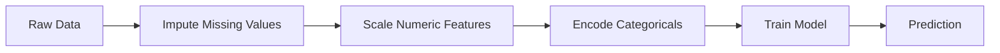
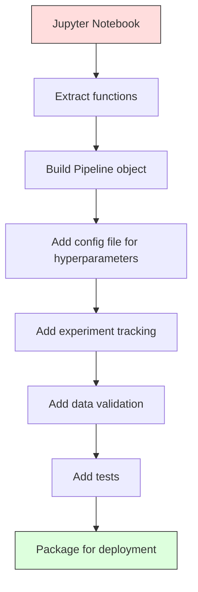

# 机器学习管线

> 模型本身不是产品，管线才是。管线涵盖从原始数据到部署后的预测的整个过程，每一步都必须可复现。

**Type:** Build
**Language:** Python
**Prerequisites:** 阶段 2，第 12 课（超参数调优）
**Time:** ~120 分钟

## 学习目标

- 从零构建机器学习管线（ML pipeline），将填补、缩放、编码和模型训练串联成一个可复现的对象
- 识别数据泄漏场景，解释管线如何通过仅在训练数据上拟合转换器来防止泄漏
- 构建 ColumnTransformer，对数值特征和类别特征应用不同的预处理
- 实现管线序列化，并展示同一个已拟合管线在训练和生产环境中产生完全相同的结果

## 要解决的问题

你有一个 notebook，用来加载数据、以中位数填补缺失值、缩放特征、训练模型，然后打印准确率。它能运行，于是你把它交付了。

一个月后，有人重新训练模型，却得到了不同的结果。原来中位数是在包含测试数据的完整数据集上计算的，这就是数据泄漏（data leakage）。缩放参数没有保存，推理时便使用了不同的统计量。特征工程代码在训练端与服务端之间复制粘贴，两份代码逐渐出现差异。某个类别列在生产环境中出现了编码器从未见过的新取值。

这些并非假设情景，而是机器学习系统在生产环境中失败的最常见原因。管线把每个转换步骤打包成一个有序、可复现的对象，从而解决所有这些问题。

## 核心概念

### 什么是管线

管线是一系列有序的数据转换，最后接一个模型。每一步都将上一步的输出作为输入。整个管线在训练数据上统一拟合一次。推理时，同一个已拟合管线会转换新数据并生成预测。



管线保证：
- 转换器只在训练数据上拟合，不发生泄漏
- 推理时应用相同的转换
- 整个对象可以序列化，并作为单一产物部署
- 交叉验证在每一折上应用管线，防止隐蔽的泄漏

### 数据泄漏：无声的杀手

当测试集或未来数据的信息混入训练过程时，就会发生数据泄漏。管线可以防止最常见的几类泄漏。

**存在泄漏（错误）：**
```python
X = df.drop("target", axis=1)
y = df["target"]

scaler = StandardScaler()
X_scaled = scaler.fit_transform(X)

X_train, X_test = X_scaled[:800], X_scaled[800:]
y_train, y_test = y[:800], y[800:]
```

缩放器看到了测试数据。均值和标准差包含了测试样本的信息，这会使准确率估计虚高。

**正确做法：**
```python
X_train, X_test = X[:800], X[800:]

scaler = StandardScaler()
X_train_scaled = scaler.fit_transform(X_train)
X_test_scaled = scaler.transform(X_test)
```

使用管线后，你无须再操心这件事，管线会自动处理。

### sklearn Pipeline

sklearn 的 `Pipeline` 将转换器（transformer）和估计器（estimator）串联起来。它提供 `.fit()`、`.predict()` 和 `.score()`，按顺序执行所有步骤。

```python
from sklearn.pipeline import Pipeline
from sklearn.preprocessing import StandardScaler
from sklearn.linear_model import LogisticRegression

pipe = Pipeline([
    ("scaler", StandardScaler()),
    ("model", LogisticRegression()),
])

pipe.fit(X_train, y_train)
predictions = pipe.predict(X_test)
```

调用 `pipe.fit(X_train, y_train)` 时：
1. 缩放器对 X_train 调用 `fit_transform`
2. 模型对缩放后的 X_train 调用 `fit`

调用 `pipe.predict(X_test)` 时：
1. 缩放器对 X_test 调用 `transform`，而不是 fit_transform
2. 模型对缩放后的 X_test 调用 `predict`

缩放器在拟合过程中从未看到测试数据。这正是关键所在。

### ColumnTransformer：不同列使用不同管线

真实数据集包含数值列和类别列，两者需要不同的预处理。`ColumnTransformer` 可以处理这种情况。

```python
from sklearn.compose import ColumnTransformer
from sklearn.preprocessing import StandardScaler, OneHotEncoder
from sklearn.impute import SimpleImputer

numeric_pipe = Pipeline([
    ("impute", SimpleImputer(strategy="median")),
    ("scale", StandardScaler()),
])

categorical_pipe = Pipeline([
    ("impute", SimpleImputer(strategy="most_frequent")),
    ("encode", OneHotEncoder(handle_unknown="ignore")),
])

preprocessor = ColumnTransformer([
    ("num", numeric_pipe, ["age", "income", "score"]),
    ("cat", categorical_pipe, ["city", "gender", "plan"]),
])

full_pipeline = Pipeline([
    ("preprocess", preprocessor),
    ("model", GradientBoostingClassifier()),
])
```

OneHotEncoder 中的 `handle_unknown="ignore"` 对生产环境至关重要。当出现新类别，例如模型从未见过的一座城市时，它会生成零向量，而不是使程序崩溃。

### 实验跟踪

管线让训练可复现，但你还需要跟踪各次实验发生了什么：使用了哪些超参数、哪个数据集版本，指标是多少，以及运行的是哪份代码。

**MLflow** 是最常见的开源解决方案：

```python
import mlflow

with mlflow.start_run():
    mlflow.log_param("max_depth", 5)
    mlflow.log_param("n_estimators", 100)
    mlflow.log_param("learning_rate", 0.1)

    pipe.fit(X_train, y_train)
    accuracy = pipe.score(X_test, y_test)

    mlflow.log_metric("accuracy", accuracy)
    mlflow.sklearn.log_model(pipe, "model")
```

每次运行都会记录参数、指标、产物和完整模型。你可以比较不同运行，复现任意实验，并部署任意模型版本。

**Weights & Biases (wandb)** 通过托管仪表板提供相同的功能：

```python
import wandb

wandb.init(project="my-pipeline")
wandb.config.update({"max_depth": 5, "n_estimators": 100})

pipe.fit(X_train, y_train)
accuracy = pipe.score(X_test, y_test)

wandb.log({"accuracy": accuracy})
```

### 模型版本管理

有了实验跟踪，你还需要管理模型版本。哪个模型正在生产环境中运行？哪个处于预发布阶段？上周用的是哪个？

MLflow 的模型注册表（Model Registry）提供：
- **版本跟踪：** 每个保存的模型都有版本号
- **阶段转换：** “Staging”（预发布）、“Production”（生产）、“Archived”（已归档）
- **审批流程：** 模型必须经过明确的晋级操作才能进入生产环境
- **回滚：** 立即切换回之前的版本

### 使用 DVC 管理数据版本

代码使用 git 管理版本，数据也应该有版本管理，但 git 无法处理大型文件。DVC（Data Version Control，数据版本控制）解决了这个问题。

```text
dvc init
dvc add data/training.csv
git add data/training.csv.dvc data/.gitignore
git commit -m "Track training data"
dvc push
```

DVC 将实际数据存储在远端存储中（S3、GCS、Azure），并在 git 中保留一个记录哈希值的小型 `.dvc` 文件。当你检出某个 git 提交时，`dvc checkout` 会恢复当时使用的那一份数据。

这意味着每个 git 提交都同时锁定了代码和数据，实现完整的可复现性。

### 可复现的实验

可复现的实验需要四项条件：

1. **固定随机种子：** 为 numpy、random 和所用框架（torch、sklearn）设置种子
2. **锁定依赖：** 使用写明精确版本的 requirements.txt 或 poetry.lock
3. **数据版本管理：** 使用 DVC 或类似工具
4. **配置文件：** 所有超参数都放在配置中，而不是硬编码

```python
import numpy as np
import random

def set_seed(seed=42):
    random.seed(seed)
    np.random.seed(seed)
    try:
        import torch
        torch.manual_seed(seed)
        torch.cuda.manual_seed_all(seed)
        torch.backends.cudnn.deterministic = True
    except ImportError:
        pass
```

### 从 Notebook 到生产管线



典型的推进步骤如下：

1. **Notebook 探索：** 快速实验、可视化、尝试特征思路
2. **提取函数：** 将预处理、特征工程和评估移入模块
3. **构建管线：** 在 sklearn Pipeline 或自定义类中串联转换
4. **配置管理：** 将所有超参数移入 YAML/JSON 配置
5. **实验跟踪：** 添加 MLflow 或 wandb 日志
6. **数据验证：** 在训练前检查 schema（结构定义）、分布和缺失值模式
7. **测试：** 为转换器编写单元测试，为完整管线编写集成测试
8. **部署：** 将管线序列化，封装到 API（应用程序编程接口，使用 FastAPI、Flask）中，再容器化

### 常见管线错误

| 错误 | 危害 | 解决办法 |
|---------|-------------|-----|
| 划分数据前先在完整数据上拟合 | 数据泄漏 | 将 Pipeline 与 cross_val_score 配合使用 |
| 在管线外进行特征工程 | 训练端与服务端使用不同的转换 | 将所有转换放入 Pipeline |
| 不处理未知类别 | 出现新取值时生产系统崩溃 | OneHotEncoder(handle_unknown="ignore") |
| 硬编码列名 | schema 变化时失效 | 从配置中读取列名列表 |
| 缺少数据验证 | 对异常数据悄悄给出错误预测 | 预测前增加 schema 检查 |
| 训练与服务偏差 | 模型在生产环境中看到不同的特征 | 两端使用同一个 Pipeline 对象 |

```figure
f3-pipeline-flow
```

## 动手实现

`code/pipeline.py` 中的代码从零构建了一个完整的机器学习管线：

### 第 1 步：自定义转换器

```python
class CustomTransformer:
    def __init__(self):
        self.means = None
        self.stds = None

    def fit(self, X):
        self.means = np.mean(X, axis=0)
        self.stds = np.std(X, axis=0)
        self.stds[self.stds == 0] = 1.0
        return self

    def transform(self, X):
        return (X - self.means) / self.stds

    def fit_transform(self, X):
        return self.fit(X).transform(X)
```

### 第 2 步：从零构建管线

```python
class PipelineFromScratch:
    def __init__(self, steps):
        self.steps = steps

    def fit(self, X, y=None):
        X_current = X.copy()
        for name, step in self.steps[:-1]:
            X_current = step.fit_transform(X_current)
        name, model = self.steps[-1]
        model.fit(X_current, y)
        return self

    def predict(self, X):
        X_current = X.copy()
        for name, step in self.steps[:-1]:
            X_current = step.transform(X_current)
        name, model = self.steps[-1]
        return model.predict(X_current)
```

### 第 3 步：使用管线进行交叉验证

代码展示了管线如何在交叉验证中防止数据泄漏：每一折都会在该折的训练数据上单独拟合缩放器。

### 第 4 步：使用 sklearn 构建完整生产管线

构建一个包含 `ColumnTransformer`、多条预处理路径和模型的完整管线，并在训练时正确使用交叉验证和实验日志。

## 交付成果

本课产出：
- `outputs/prompt-ml-pipeline.md` -- 用于构建和调试机器学习管线的技能
- `code/pipeline.py` -- 从零实现到使用 sklearn 的完整管线

## 练习

1. 构建管线，处理包含 3 个数值列和 2 个类别列的数据集。使用 `ColumnTransformer` 对数值列进行中位数填补 + 缩放，对类别列进行众数填补 + one-hot（独热）编码。使用 5 折交叉验证训练。

2. 刻意引入数据泄漏：划分数据之前，在完整数据集上拟合缩放器。比较这种存在泄漏的交叉验证得分与使用管线、不发生泄漏的交叉验证得分。两者相差多少？

3. 使用 `joblib.dump` 序列化管线。在独立脚本中加载它并运行预测，验证预测结果完全相同。

4. 向管线添加一个自定义转换器，为最重要的两个数值列生成多项式特征（次数为 2）。它应该放在管线的哪个位置？

5. 为管线设置 MLflow 跟踪。使用不同超参数运行 5 次实验，通过 MLflow UI（`mlflow ui`）比较运行结果并选出最佳模型。

## 关键术语

| 术语 | 通常的说法 | 实际含义 |
|------|----------------|----------------------|
| 管线（Pipeline） | “一串转换 + 模型” | 已拟合转换器与模型的有序序列，作为一个整体应用，以防止泄漏 |
| 数据泄漏 | “测试信息进入了训练” | 使用训练集之外的信息构建模型，使性能估计虚高 |
| ColumnTransformer | “按列进行不同预处理” | 对不同列子集应用不同管线，再合并结果 |
| 实验跟踪 | “记录运行过程” | 记录每次训练运行的参数、指标、产物和代码版本 |
| MLflow | “跟踪和部署模型” | 用于实验跟踪、模型注册表和部署的开源平台 |
| DVC | “数据的 Git” | 面向大型数据文件的版本控制系统，将哈希值保存在 git 中，将数据保存在远端存储中 |
| 模型注册表 | “模型版本目录” | 通过阶段标签（预发布、生产、已归档）跟踪模型版本的系统 |
| 训练与服务偏差 | “在 notebook 里明明能用” | 训练与推理的数据处理方式不同，导致不易察觉的错误 |
| 可复现性 | “相同代码，相同结果” | 用相同代码、数据和配置得到完全相同结果的能力 |

## 延伸阅读

- [scikit-learn Pipeline 文档](https://scikit-learn.org/stable/modules/compose.html) -- 官方管线参考文档
- [MLflow 文档](https://mlflow.org/docs/latest/index.html) -- 实验跟踪与模型注册表
- [DVC 文档](https://dvc.org/doc) -- 数据版本管理
- [Sculley 等，Hidden Technical Debt in Machine Learning Systems（2015）](https://papers.nips.cc/paper/2015/hash/86df7dcfd896fcaf2674f757a2463eba-Abstract.html) -- 关于机器学习系统复杂性的奠基论文
- [Google 机器学习最佳实践：Rules of ML](https://developers.google.com/machine-learning/guides/rules-of-ml) -- 实用的生产机器学习建议
