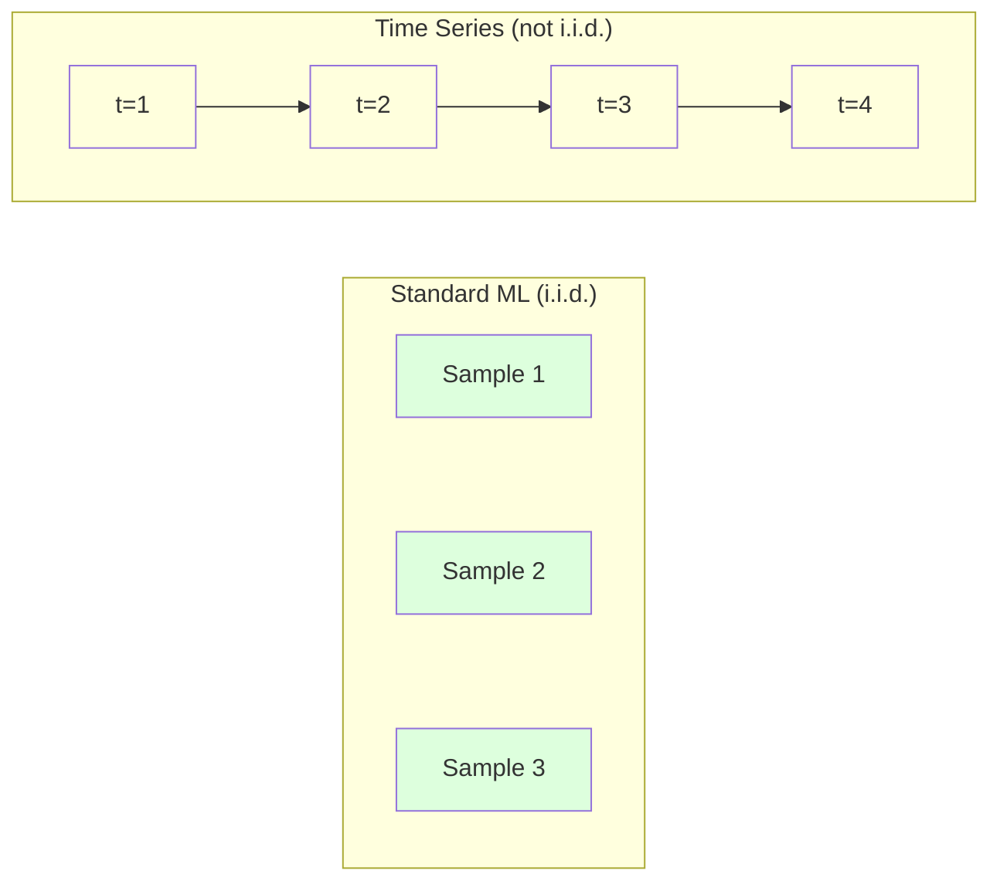
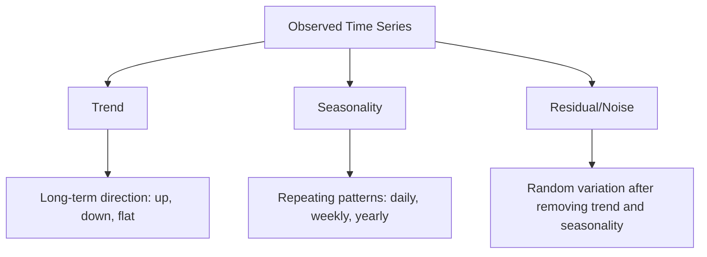
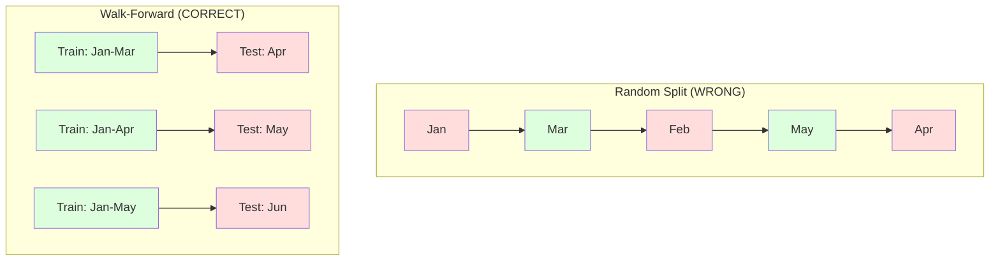

# 时间序列基础

> 过去的表现确实能预测未来的结果 -- 前提是先检查平稳性。

**Type:** Build
**Language:** Python
**Prerequisites:** 阶段 2，第 01-09 课
**Time:** ~90 分钟

## 学习目标

- 将时间序列分解为趋势、季节性和残差分量，并检验平稳性
- 实现滞后特征和滚动统计量，将时间序列转化为监督学习问题
- 构建滚动前向验证框架，防止未来数据泄漏到训练过程
- 解释随机训练/测试划分为何不适用于时间序列，并展示它与正确时间划分之间的性能差距

## 要解决的问题

你有一组按时间排序的数据：每日销售额、每小时气温、每分钟 CPU 使用率、每周股价。你希望预测下一个值、下一周或下一季度。

你拿出惯用的机器学习工具：随机划分训练集和测试集、交叉验证，输入特征矩阵，输出预测。每一步都错了。

时间序列打破了标准机器学习赖以成立的假设。样本并不独立 -- 今天的气温取决于昨天的气温。随机划分会让未来信息泄漏到过去。回测中看似出色的特征，到了生产环境却失效了，因为它们依赖的模式会随时间变化。

一个在随机交叉验证中准确率达到 95% 的模型，在正确的时间顺序评估中可能只有 55%。这不是无关紧要的技术细节，而是纸面上有效的模型与生产环境中有效的模型之间的区别。

本课介绍基础知识：时间数据有何不同，如何诚实评估模型，以及怎样将时间序列转化为标准机器学习模型能够使用的特征。

## 核心概念

### 时间序列有何不同

标准机器学习假设数据独立同分布（i.i.d.）：每个样本都从同一分布中抽取，而且独立于其他样本。时间序列同时违反这两点：

- **不独立。** 今天的股价取决于昨天的股价，本周销售额与上周销售额相关。
- **不同分布。** 分布随时间变化，十二月的销售额与三月不同。

这些假设的违反不是小事。它们会改变特征的构建方式、模型的评估方式，以及哪些算法能够奏效。



在标准机器学习中，样本可以互换，打乱顺序不会改变什么。但对时间序列而言，顺序至关重要，打乱它就会破坏信号。

### 时间序列的组成

每个时间序列都是以下分量的组合：



- **趋势（trend）**：长期方向。例如收入每年增长 10%，或全球气温上升。
- **季节性（seasonality）**：按固定间隔重复的模式。例如零售销售额在十二月激增，空调用量在七月达到峰值。
- **残差（residual）**：去除趋势和季节性后剩下的部分。如果残差看起来像白噪声，说明分解已经捕捉到了信号。

### 平稳性

如果时间序列的统计性质，包括均值、方差和自相关，不随时间变化，它就是平稳的。大多数预测方法都假设序列具有平稳性（stationarity）。

**为什么重要：** 非平稳序列的均值会漂移。用一月数据训练的模型，学到的均值与二月将出现的均值不同，因此会产生系统性错误。

**如何检查：** 按窗口计算滚动均值和滚动标准差。如果它们发生漂移，序列就是非平稳的。

**如何处理：** 使用差分（differencing）。不直接对原始值建模，而是对相邻值之间的变化建模：

```text
diff[t] = value[t] - value[t-1]
```

如果做一轮差分后序列仍不平稳，就再做一次，也就是二阶差分。现实中的大多数序列最多需要两轮。

**示例：**

原始序列：[100, 102, 106, 112, 120]
一阶差分：[2, 4, 6, 8]（仍呈上升趋势）
二阶差分：[2, 2, 2]（为常量 -- 平稳）

原始序列具有二次趋势，一阶差分将其变成线性趋势，二阶差分使其变平。在实践中，很少需要做两轮以上的差分。

**正式检验：** 增广 Dickey-Fuller（ADF）检验是检验平稳性的标准统计方法。原假设为“序列非平稳”。p 值低于 0.05 时，可以拒绝原假设并认定序列平稳。本课不从零实现 ADF，因为它需要渐近分布表；不过，代码中的滚动统计方法提供了实用的可视检查。

### 自相关

自相关（autocorrelation）衡量时刻 t 的值与时刻 t-k 的值，也就是过去 k 步的值，有多大相关性。自相关函数（ACF）绘出每个滞后 k 对应的相关性。

**ACF 能告诉你：**
- 序列能记住多久以前的信息。如果 ACF 在滞后 5 之后降为零，超过 5 步以前的值就无关紧要了。
- 是否存在季节性。如果月度数据的 ACF 在滞后 12 处出现峰值，就存在年度季节性。
- 应创建多少滞后特征。一直使用到 ACF 变得可以忽略的位置。

**偏自相关函数（PACF）** 去除间接相关。如果今天与 3 天前相关，只是因为两者都与昨天相关，那么滞后 3 处的 PACF 将为零，而滞后 3 处的 ACF 不为零。

### 滞后特征：将时间序列转化为监督学习

标准机器学习模型需要特征矩阵 X 和目标 y，而时间序列提供的是一列数值。连接两者的桥梁就是滞后特征（lag features）。

以序列 [10, 12, 14, 13, 15] 为例，创建 lag-1 和 lag-2 特征：

| lag_2 | lag_1 | target（目标） |
|-------|-------|--------|
| 10    | 12    | 14     |
| 12    | 14    | 13     |
| 14    | 13    | 15     |

现在问题就变成了标准回归。任何机器学习模型，例如线性回归、随机森林或梯度提升，都可以从滞后值预测目标。

还可以构造以下特征：
- **滚动统计量：** 最近 k 个值的均值、标准差、最小值和最大值
- **日历特征：** 星期几、月份、is_holiday、is_weekend
- **差分值：** 相对前一步的变化
- **扩展窗口统计量：** 累计均值、累计和
- **比率特征：** 当前值 / 滚动均值，即偏离近期平均值的程度
- **交互特征：** lag_1 * day_of_week，即星期对动量的影响

**需要多少个滞后？** 使用自相关函数来判断。如果 ACF 到滞后 10 都显著，就至少使用 10 个滞后。如果存在每周季节性，加入滞后 7，也可能需要 14。更多滞后为模型提供了更多历史，同时也增加了需要拟合的特征，带来更大的过拟合风险。

**目标对齐陷阱。** 构建滞后特征时，目标必须是时刻 t 的值，所有特征则必须来自时刻 t-1 或更早。如果不小心把时刻 t 的值放进特征，就得到了一个完美的预测变量，却也得到了一个完全无用的模型。这是时间序列特征工程中最常见的错误。

### 滚动前向验证

这是本课最重要的概念。标准 k 折交叉验证会随机将样本分入训练集和测试集。对时间序列来说，这会泄漏未来信息。



滚动前向验证（walk-forward validation）：
1. 用截至时刻 t 的数据训练
2. 预测时刻 t+1，或在多步预测中预测 t+1 到 t+k
3. 将窗口向前滑动
4. 重复以上过程

每个测试折只包含全部训练数据之后的数据，不存在未来信息泄漏，因此能诚实估计模型部署后的表现。

**扩展窗口（expanding window）** 使用全部历史数据训练，窗口会增长。**滑动窗口（sliding window）** 使用固定长度的训练窗口，并将窗口向前移动。如果你认为较早的数据仍然相关，就用扩展窗口；如果世界在变化，旧数据反而有害，就用滑动窗口。

### 直观理解 ARIMA

ARIMA 是经典的时间序列模型，由三个部分组成：

- **AR（Autoregressive，自回归）：** 根据过去的值预测。AR(p) 使用最近 p 个值。
- **I（Integrated，差分）：** 通过差分实现平稳性。I(d) 做 d 轮差分。
- **MA（Moving Average，移动平均）：** 根据过去的预测误差预测。MA(q) 使用最近 q 个误差。

ARIMA(p, d, q) 将三者结合起来。你可以根据 ACF/PACF 分析或自动搜索（auto-ARIMA）选择 p、d、q。

本课不从零实现 ARIMA，因为它需要超出本课范围的数值优化。关键在于理解每个分量的作用，从而能够解释 ARIMA 的结果，并知道何时使用它。

### 不同方法何时适用

| 方法 | 最适合 | 是否处理季节性 | 是否处理外部特征 |
|----------|---------|-------------------|------------------------|
| 滞后特征 + 机器学习 | 带有大量外部特征的表格数据 | 通过日历特征处理 | 是 |
| ARIMA | 单一的一元序列、短期预测 | 使用 SARIMA 变体 | 否，ARIMAX 可有限支持 |
| 指数平滑 | 简单趋势 + 季节性 | 是，使用 Holt-Winters | 否 |
| Prophet | 业务预测、节假日 | 是，使用傅里叶项 | 有限支持 |
| 神经网络（LSTM、Transformer） | 长序列、多序列 | 通过学习获得 | 是 |

对于大多数实际问题，滞后特征 + 梯度提升是最强的起点。它能自然处理外部特征，不要求平稳性，也易于调试。

### 预测步长与策略

单步预测向前预测一个时间步，多步预测则预测多个时间步。有三种策略：

**递归（迭代）策略：** 向前预测一步，再将预测值作为下一步的输入。方法简单，但误差会累积：每次预测都使用上一次的预测值，因此错误会不断叠加。

**直接策略：** 为每个预测步长分别训练一个模型。Model-1 预测 t+1，Model-5 预测 t+5。没有误差累积，但每个模型的训练样本更少，而且模型之间不共享信息。

**多输出策略：** 训练一个模型，同时输出所有预测步长的结果。不同步长之间能共享信息，但需要支持多输出的模型，或自定义损失函数。

对于大多数实际问题，短预测步长（1-5 步）先尝试递归策略，较长步长则使用直接策略。

### 时间序列中的常见错误

| 错误 | 原因 | 解决办法 |
|---------|---------------|-----------|
| 随机划分训练集/测试集 | 沿用标准机器学习的习惯 | 使用滚动前向验证或时间划分 |
| 使用未来特征 | 误将时刻 t 的特征放入输入 | 审核每个特征的时间对齐 |
| 对季节性过拟合 | 模型记住了日历模式 | 在测试集中留出完整的季节周期 |
| 忽略尺度变化 | 收入翻倍，但模式不变 | 对百分比变化建模，而不是绝对值 |
| 滞后特征过多 | “历史越多越好” | 用 ACF 确定相关滞后 |
| 不做差分 | “模型会自己学会” | 树模型能处理趋势，线性模型需要平稳性 |

```figure
f3-series-decompose
```

## 动手实现

`code/time_series.py` 中的代码从零实现了核心组件。

### 滞后特征生成器

```python
def make_lag_features(series, n_lags):
    n = len(series)
    X = np.full((n, n_lags), np.nan)
    for lag in range(1, n_lags + 1):
        X[lag:, lag - 1] = series[:-lag]
    valid = ~np.isnan(X).any(axis=1)
    return X[valid], series[valid]
```

它将 1D 序列转换为特征矩阵，每一行以最近 `n_lags` 个值为特征，以当前值为目标。

### 滚动前向交叉验证

```python
def walk_forward_split(n_samples, n_splits=5, min_train=50):
    assert min_train < n_samples, "min_train must be less than n_samples"
    step = max(1, (n_samples - min_train) // n_splits)
    for i in range(n_splits):
        train_end = min_train + i * step
        test_end = min(train_end + step, n_samples)
        if train_end >= n_samples:
            break
        yield slice(0, train_end), slice(train_end, test_end)
```

每次划分都确保训练数据在时间上严格早于测试数据，训练窗口随每一折扩展。

### 简单自回归模型

纯 AR 模型就是对滞后特征做线性回归：

```python
class SimpleAR:
    def __init__(self, n_lags=5):
        self.n_lags = n_lags
        self.weights = None
        self.bias = None

    def fit(self, series):
        X, y = make_lag_features(series, self.n_lags)
        # Solve via normal equations
        X_b = np.column_stack([np.ones(len(X)), X])
        theta = np.linalg.lstsq(X_b, y, rcond=None)[0]
        self.bias = theta[0]
        self.weights = theta[1:]
        return self
```

它在概念上与第 02 课的线性回归完全相同，只是应用在同一变量的时间滞后版本上。

### 平稳性检查

代码计算滚动统计量，从视觉和数值两方面评估平稳性：

```python
def check_stationarity(series, window=50):
    rolling_mean = np.array([
        series[max(0, i - window):i].mean()
        for i in range(1, len(series) + 1)
    ])
    rolling_std = np.array([
        series[max(0, i - window):i].std()
        for i in range(1, len(series) + 1)
    ])
    return rolling_mean, rolling_std
```

如果滚动均值发生漂移，或者滚动标准差变化，序列就是非平稳的。做差分后再检查一次。

代码还会比较序列前半段与后半段来检查平稳性。如果均值之差超过半个标准差，或者方差之比超过 2x（倍），就将序列标记为非平稳。

### 自相关

```python
def autocorrelation(series, max_lag=20):
    n = len(series)
    mean = series.mean()
    var = series.var()
    acf = np.zeros(max_lag + 1)
    for k in range(max_lag + 1):
        cov = np.mean((series[:n-k] - mean) * (series[k:] - mean))
        acf[k] = cov / var if var > 0 else 0
    return acf
```

## 实际使用

使用 sklearn 时，可以直接把滞后特征交给任何回归器：

```python
from sklearn.linear_model import Ridge
from sklearn.ensemble import GradientBoostingRegressor

X, y = make_lag_features(series, n_lags=10)

for train_idx, test_idx in walk_forward_split(len(X)):
    model = Ridge(alpha=1.0)
    model.fit(X[train_idx], y[train_idx])
    predictions = model.predict(X[test_idx])
```

使用 statsmodels 实现 ARIMA：

```python
from statsmodels.tsa.arima.model import ARIMA

model = ARIMA(train_series, order=(5, 1, 2))
fitted = model.fit()
forecast = fitted.forecast(steps=30)
```

`time_series.py` 中的代码演示了这两种方法，并通过滚动前向验证比较它们。

### sklearn TimeSeriesSplit

sklearn 提供了 `TimeSeriesSplit`，用来实现滚动前向验证：

```python
from sklearn.model_selection import TimeSeriesSplit

tscv = TimeSeriesSplit(n_splits=5)
for train_index, test_index in tscv.split(X):
    X_train, X_test = X[train_index], X[test_index]
    y_train, y_test = y[train_index], y[test_index]
    model.fit(X_train, y_train)
    score = model.score(X_test, y_test)
```

它与我们从零实现的 `walk_forward_split` 等价，但集成在 sklearn 的交叉验证框架中。可以把它与 `cross_val_score` 配合使用：

```python
from sklearn.model_selection import cross_val_score

scores = cross_val_score(model, X, y, cv=TimeSeriesSplit(n_splits=5))
print(f"Mean score: {scores.mean():.4f} +/- {scores.std():.4f}")
```

### 评估指标

时间序列预测使用回归指标，但需要结合时间背景理解：

- **MAE（平均绝对误差）：** |y_true - y_pred| 的平均值。可以用原始单位轻松解释，例如“预测平均偏差为 3.2 度”。
- **RMSE（均方根误差）：** 均方误差的平方根。与 MAE 相比，它对大误差的惩罚更重。如果少量大误差比大量小误差更糟，就使用它。
- **MAPE（平均绝对百分比误差）：** |error / true_value| * 100 的平均值。它不依赖尺度，适合比较不同序列，但真实值为零时没有定义。
- **与朴素基线比较：** 始终与简单基线比较。季节性朴素基线预测为前一个周期的值，例如昨天或上周的值。如果模型无法胜过朴素法，就说明出了问题。

### 滚动特征

代码演示了如何向滞后特征添加滚动统计量：使用 7 天和 14 天窗口计算均值、标准差、最小值和最大值。它们为模型提供了近期趋势和波动的信息，而仅靠滞后特征无法捕捉这些信息。

例如，滚动均值上升意味着可能存在上升趋势，滚动标准差增大则意味着波动性可能在增长。这些模式是树模型能够学习，而线性模型无法学习的。

## 交付成果

本课产出：
- `outputs/prompt-time-series-advisor.md` -- 用于界定时间序列问题的提示词（prompt）
- `code/time_series.py` -- 滞后特征、滚动前向验证、AR 模型和平稳性检查

### 必须胜过的基线

构建任何模型之前，先建立基线：

1. **最近值（持续性）。** 预测明天与今天相同。对于许多序列，这个基线比想象中更难超越。
2. **季节性朴素法。** 预测今天与上周同一天或去年对应日期相同。如果模型无法超越它，说明模型没有学到季节性之外的任何有用模式。
3. **移动平均。** 预测为最近 k 个值的平均值。它能平滑噪声，但无法捕捉突然变化。

如果复杂的机器学习模型输给了季节性朴素基线，就说明存在错误。最常见的原因是特征中泄漏了未来信息、评估方法错误，或者序列确实是随机且不可预测的。

### 实用建议

1. **先画图。** 建模之前先绘制原始序列，观察趋势、季节性、离群值和结构突变，也就是行为突然变化。一次 30 秒的可视检查，往往比一小时的自动分析更有信息量。

2. **先差分，再建模。** 如果序列趋势明显，在创建滞后特征前先做差分。树模型能处理趋势，但线性模型不能，而且差分从来不会有害。

3. **至少留出一个完整的季节周期。** 如果具有每周季节性，测试集至少需要包含完整一周；如果是月度季节性，则至少包含完整一个月。否则就无法评估模型是否捕捉到了季节模式。

4. **在生产环境中监控。** 世界不断变化，时间序列模型会随时间退化。持续以滚动方式跟踪预测误差；误差开始增大时，用近期数据重新训练模型。

5. **注意状态转变。** 用疫情前的数据训练的模型，无法预测疫情后的行为。可以把已知状态转变的指示变量加入特征，或者使用会遗忘旧数据的滑动窗口。

6. **对偏斜序列取对数。** 收入、价格和计数往往右偏。取对数可以稳定方差，将乘性模式转化为线性模型能够处理的加性模式。在对数空间中预测，再取指数回到原始单位。

## 练习

1. **平稳性实验。** 生成一个具有线性趋势的序列，用滚动统计量检查平稳性。做一阶差分，再检查一次。对于二次趋势，需要做几轮差分？

2. **选择滞后。** 对季节性序列（period=7）计算 ACF。哪些滞后的自相关最高？仅用这些滞后创建特征，而不是使用连续滞后。与使用滞后 1 到 7 相比，准确性是否提高？

3. **滚动前向验证与随机划分。** 基于滞后特征训练 Ridge 回归，分别使用随机 80/20 划分和滚动前向验证评估。随机划分高估了多少性能？

4. **特征工程。** 向滞后特征添加滚动均值（window=7）、滚动标准差（window=7）和星期特征。用滚动前向验证比较加入与不加入这些额外特征时的准确性。

5. **多步预测。** 修改 AR 模型，将向前预测 1 步改为 5 步。比较两种策略：(a) 先预测一步，再把预测结果作为下一步的输入，也就是递归策略；(b) 为每个预测步长分别训练模型，也就是直接策略。哪种更准确？

## 关键术语

| 术语 | 通常的说法 | 实际含义 |
|------|----------------|----------------------|
| 平稳性 | “统计量不随时间变化” | 均值、方差和自相关结构不随时间变化的序列 |
| 差分 | “相邻值相减” | 计算 y[t] - y[t-1]，以去除趋势并实现平稳性 |
| 自相关（ACF） | “序列与自身有多相关” | 时间序列与其滞后副本之间的相关性，是滞后的函数 |
| 偏自相关（PACF） | “只看直接相关” | 去除所有较短滞后的影响后，滞后 k 处的自相关 |
| 滞后特征 | “把过去的值作为输入” | 使用 y[t-1]、y[t-2]、...、y[t-k] 作为特征，预测 y[t] |
| 滚动前向验证 | “尊重时间顺序的交叉验证” | 训练数据在时间顺序上始终早于测试数据的评估方法 |
| ARIMA | “经典时间序列模型” | 自回归差分移动平均：结合过去的值（AR）、差分（I）和过去的误差（MA） |
| 季节性 | “重复的日历模式” | 与日历周期相关的规律、可预测的时间序列循环，例如日、周、年 |
| 趋势 | “长期方向” | 序列水平随时间持续上升或下降 |
| 扩展窗口 | “使用全部历史” | 训练集随每一折增大的滚动前向验证 |
| 滑动窗口 | “固定长度的历史” | 训练集为固定长度窗口，并不断向前移动的滚动前向验证 |

## 延伸阅读

- [Hyndman 和 Athanasopoulos，Forecasting: Principles and Practice（第 3 版）](https://otexts.com/fpp3/) -- 关于时间序列预测的最佳免费教材
- [scikit-learn Time Series Split](https://scikit-learn.org/stable/modules/generated/sklearn.model_selection.TimeSeriesSplit.html) -- sklearn 的滚动前向划分器
- [statsmodels ARIMA 文档](https://www.statsmodels.org/stable/generated/statsmodels.tsa.arima.model.ARIMA.html) -- 带有诊断功能的 ARIMA 实现
- [Makridakis 等，The M5 Competition（2022）](https://www.sciencedirect.com/science/article/pii/S0169207021001874) -- 展示机器学习方法与统计方法对比的大规模预测竞赛
