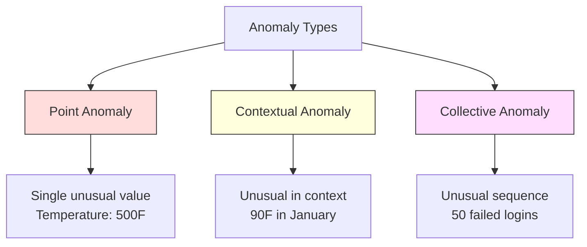
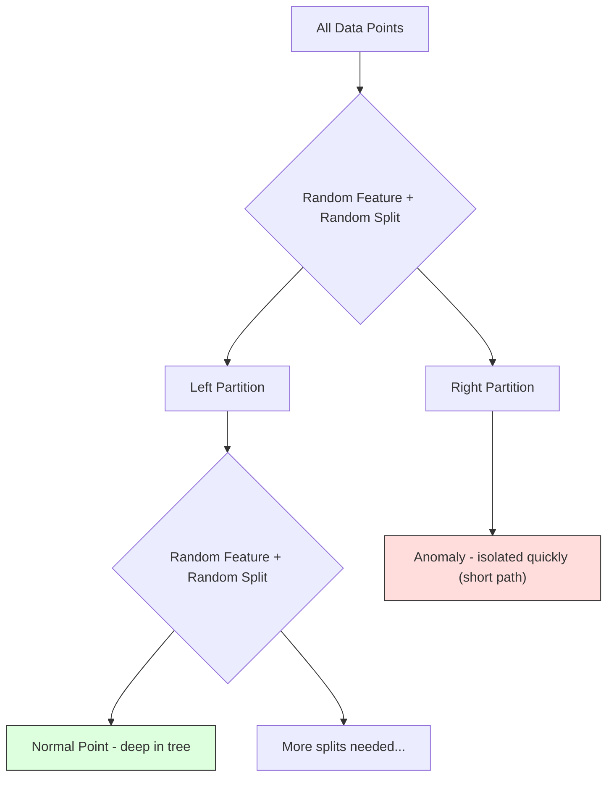
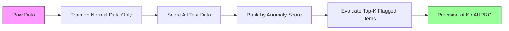

# 异常检测

> 正常很容易定义。不符合正常情况的，就是异常。

**Type:** Build
**Language:** Python
**Prerequisites:** 阶段 2，第 01-09 课
**Time:** ~75 分钟

## 学习目标

- 从零实现 Z-score（标准分数）、四分位距（IQR）和孤立森林（Isolation Forest）异常检测方法
- 区分点异常、上下文异常和集体异常，并为每种异常选择合适的检测方法
- 解释为什么异常检测被表述为对正常数据建模，而不是对异常进行分类
- 比较无监督异常检测与有监督分类，评估新型异常覆盖范围与精确率之间的取舍

## 要解决的问题

一张信用卡在纽约于下午 2 点使用，随后又在东京于下午 2:05 使用。工厂传感器的正常范围是 80-120 度，读数却达到 150 度。一台服务器每秒发送 50,000 个请求，而日常平均值是 200。

这些都是异常。发现它们至关重要。欺诈造成数十亿的损失。设备故障导致停机。网络入侵造成数据损失。

难点在于：你很少拥有带标签的异常样本。欺诈只占交易的 0.1%。设备故障一年只发生几次。你无法训练标准分类器，因为“异常”类别中几乎没有可供学习的样本。即使有一些标签，你见过的异常也不是未来会遇到的全部类型。明天的欺诈手法与今天的不同。

异常检测把问题反了过来。不去学习什么是异常，而是学习什么是正常。任何偏离正常的情况都值得怀疑。这种方法无需标签，能适应新型异常，也能扩展到海量数据集。

## 核心概念

### 异常的类型

异常并不都一样：

- **点异常。** 无论处于什么上下文都显得异常的单个数据点。例如温度读数为 500 度，或一个平时消费 $50 的账户发生一笔 $50,000 的交易。
- **上下文异常。** 在给定上下文中显得异常的数据点。90 度的气温在夏季很正常，在冬季却是异常。数值相同，上下文不同。
- **集体异常。** 一串数据点作为整体显得异常，尽管每个点单独看可能正常。五次登录失败很正常。连续五十次就是暴力破解攻击。

大多数方法检测的是点异常。上下文异常需要时间或位置特征。集体异常需要能考虑序列的方法。



### 无监督问题表述

标准分类中，两个类别都有标签。异常检测通常面对以下三种情况之一：

1. **完全无监督。** 完全没有标签。你在全部数据上拟合检测器，并希望异常足够稀少，不至于破坏“正常”模型。
2. **半监督。** 你拥有一个只包含正常数据的干净数据集。在这个干净集合上拟合，再为其余数据评分。如果条件允许，这是最有利的设置。
3. **弱监督。** 你拥有少量带标签的异常。用它们评估，而不是训练。先进行无监督训练，再在带标签的子集上衡量精确率/召回率。

关键认识是：异常检测与分类有本质区别。你在建模的是正常数据的分布，而不是两个类别之间的决策边界。

### 有监督与无监督：如何取舍

如果你确实拥有带标签的异常，该用它们训练（有监督分类），还是仅用于评估（无监督检测）？

**有监督（作为分类处理）：**
- 能捕获你之前见过的那些具体异常类型
- 对已知异常类型具有更高的精确率
- 会完全漏掉新型异常
- 出现新型异常时需要重新训练
- 需要足够多的异常样本（实际往往太少）

**无监督（建模正常情况，标记偏离）：**
- 能捕获任何偏离正常的情况，包括新型异常
- 不需要带标签的异常
- 假阳性率更高（并非所有不寻常的情况都有害）
- 对分布偏移更稳健

实践中，最好的系统会结合两者：用无监督检测实现广泛覆盖，用有监督模型识别已知的高优先级异常类型，并让人工复核含糊不清的情况。

### Z-score 方法

这是最简单的方法。计算每个特征的均值和标准差。把与均值相距超过 k 个标准差的点标记出来。

```text
z_score = (x - mean) / std
anomaly if |z_score| > threshold
```

默认阈值是 3.0（对于高斯分布，99.7% 的正常数据落在距均值 3 个标准差以内）。

**优点：** 简单、快速、可解释（“这个值偏离正常值 4.5 个标准差”）。

**缺点：** 假设数据服从正态分布。对训练数据中的离群点敏感（离群点会使均值偏移并增大标准差，反而更难被检测到）。对多峰分布无效。

**适用情况：** 数据大致呈钟形分布的单特征监控。例如服务器响应时间、制造公差，以及基线稳定的传感器读数。

**失效情况：** 多簇数据（两个办公地点具有不同的基准温度）、偏态数据（交易金额 $1000 很少见，但并非异常），以及训练集中存在离群点的数据。

### IQR 方法

它比 Z-score 更稳健，使用四分位距代替均值和标准差。

```text
Q1 = 25th percentile
Q3 = 75th percentile
IQR = Q3 - Q1
lower_bound = Q1 - factor * IQR
upper_bound = Q3 + factor * IQR
anomaly if x < lower_bound or x > upper_bound
```

默认倍数是 1.5。

**优点：** 对离群点稳健（百分位数不受极端值影响）。适用于偏态分布。不假设正态性。

**缺点：** 仅适用于单变量（对每个特征独立应用）。无法检测只有综合考虑多个特征才显得异常的情况（一个点在每个特征上单独看可能正常，在联合空间中却是异常）。

**实践提示：** IQR 中的 1.5 倍对应箱线图的须。须外的点是潜在离群点。使用 3.0 而不是 1.5 会让检测器更保守（标记更少，假阳性更少）。合适的倍数取决于你对误报的容忍程度。

### 孤立森林

关键认识是：异常既少见，又与众不同。随机划分数据时，异常更容易被孤立出来，也就是只需更少的随机切分就能与其余数据分开。



**工作原理：**
1. 构建许多随机树（组成孤立森林）
2. 在每个节点，随机选择一个特征，再在该特征的最小值与最大值之间随机选取切分值
3. 持续切分，直到每个点都被孤立出来（独占一个叶节点）
4. 异常在所有树上的平均路径长度更短

**为什么有效：** 正常点位于密集区域。要把其中一个点与邻居分开，需要许多次随机切分。异常位于稀疏区域。只需一两次随机切分就足以将它们孤立出来。

异常分数基于所有树上的平均路径长度，并用随机二叉搜索树的期望路径长度进行归一化：

```text
score(x) = 2^(-average_path_length(x) / c(n))
```

其中，`c(n)` 是 n 个样本对应的期望路径长度。分数接近 1 表示异常，接近 0.5 表示正常，接近 0 表示非常正常（位于密集簇的深处）。

**优点：** 不假设数据分布。适用于高维数据。扩展性好（相对于样本量呈次线性增长，因为每棵树只使用一个子样本）。能处理混合特征类型。

**缺点：** 难以处理密集区域中的异常（掩蔽效应）。当许多特征与任务无关时，随机切分的效果会下降。

**关键超参数：**
- `n_estimators`：树的数量。100 棵通常足够。树越多，分数越稳定，但计算越慢。
- `max_samples`：每棵树的样本数。原论文中的默认值为 256。更小的值会降低单棵树的准确性，但增加多样性。子采样正是孤立森林速度快的原因：每棵树只看到数据的一小部分。
- `contamination`：预期的异常比例。仅用于设置阈值，不影响分数本身。

### 局部离群因子（LOF）

局部离群因子（LOF）将一个点周围的局部密度与其邻居周围的密度比较。一个处于稀疏区域、周围却被密集区域包围的点是异常。

**工作原理：**
1. 为每个点找到 k 个最近邻
2. 计算局部可达密度（邻域有多密集）
3. 将每个点的密度与其邻居的密度比较
4. 如果某个点的密度远低于其邻居，它就是离群点

**LOF 分数：**
- LOF 接近 1.0，表示密度与邻居相近（正常）
- LOF 大于 1.0，表示密度低于邻居（可能异常）
- LOF 远大于 1.0（例如 2.0+），表示密度明显更低（很可能异常）

“局部”是关键。考虑一个包含两个簇的数据集：一个有 1000 个点的密集簇，以及一个有 50 个点的稀疏簇。稀疏簇边缘的点从全局看并不异常，因为它有 50 个邻居。但如果紧邻它的点比它更密集，它在局部就是异常。LOF 能捕捉到全局方法忽略的这种细微差别。

**优点：** 能检测局部异常（在自身邻域内显得异常、但从全局看不一定异常的点）。适用于密度不同的簇。

**缺点：** 在大型数据集上较慢（朴素实现为 O(n^2)）。对 k 的选择敏感。在很高的维度下效果不佳（维度灾难会影响距离计算）。

### 方法对比

| 方法 | 假设 | 速度 | 能否处理高维数据 | 能否检测局部异常 |
|--------|------------|-------|-------------------|------------------------|
| Z-score | 正态分布 | 非常快 | 能（逐特征） | 不能 |
| IQR | 无（逐特征） | 非常快 | 能（逐特征） | 不能 |
| 孤立森林 | 无 | 快 | 能 | 部分能 |
| LOF | 距离具有意义 | 慢 | 效果较差 | 能 |

### 评估的挑战

评估异常检测器比评估分类器更难：

- **极端的类别不平衡。** 异常占 0.1% 时，把所有样本都预测为“正常”就能获得 99.9% 的准确率。准确率没有用。
- **AUROC 会造成误导。** 在严重不平衡的情况下，即使模型在实际阈值下漏掉了大多数异常，ROC 曲线下面积（AUROC）仍可能显得很好。
- **更好的指标：** Precision@k（标记出的前 k 个样本中，真正异常的比例）、AUPRC（精确率-召回率曲线下面积），以及固定假阳性率下的召回率。



### 异常检测管线

实践中，异常检测遵循以下流程：

1. **收集基线数据。** 理想情况下，选择你确定没有异常（或异常很少）的一段时期。
2. **特征工程。** 使用原始特征和派生特征（滚动统计量、时间特征、比值）。
3. **训练检测器。** 在基线数据上拟合。模型学习“正常”是什么样。
4. **为新数据评分。** 每个新观测值都会获得一个异常分数。
5. **选择阈值。** 选择分数的截断值。这是业务决策：阈值越高，误报越少，但漏掉的异常越多。
6. **告警并调查。** 将标记出的点交给人工复核或自动响应。
7. **收集反馈。** 记录被标记的样本究竟是真正的异常还是误报。随着时间推移，用这些数据评估检测器并调整阈值。

这条管线永远不会“完成”。数据分布会偏移，新型异常会出现，阈值也需要调整。应把异常检测视为持续演进的系统，而不是一次性模型。

```figure
f3-anomaly-fence
```

## 动手实现

`code/anomaly_detection.py` 中的代码从零实现了 Z-score、IQR 和孤立森林。

### Z-score 检测器

```python
def zscore_detect(X, threshold=3.0):
    mean = X.mean(axis=0)
    std = X.std(axis=0)
    std[std == 0] = 1.0
    z = np.abs((X - mean) / std)
    return z.max(axis=1) > threshold
```

简单且采用向量化实现。只要任意一个特征超过阈值，就标记该点。

### IQR 检测器

```python
def iqr_detect(X, factor=1.5):
    q1 = np.percentile(X, 25, axis=0)
    q3 = np.percentile(X, 75, axis=0)
    iqr = q3 - q1
    iqr[iqr == 0] = 1.0
    lower = q1 - factor * iqr
    upper = q3 + factor * iqr
    outside = (X < lower) | (X > upper)
    return outside.any(axis=1)
```

### 从零实现孤立森林

从零实现时，我们构建随机划分特征空间的孤立树：

```python
class IsolationTree:
    def __init__(self, max_depth):
        self.max_depth = max_depth

    def fit(self, X, depth=0):
        n, p = X.shape
        if depth >= self.max_depth or n <= 1:
            self.is_leaf = True
            self.size = n
            return self
        self.is_leaf = False
        self.feature = np.random.randint(p)
        x_min = X[:, self.feature].min()
        x_max = X[:, self.feature].max()
        if x_min == x_max:
            self.is_leaf = True
            self.size = n
            return self
        self.threshold = np.random.uniform(x_min, x_max)
        left_mask = X[:, self.feature] < self.threshold
        self.left = IsolationTree(self.max_depth).fit(X[left_mask], depth + 1)
        self.right = IsolationTree(self.max_depth).fit(X[~left_mask], depth + 1)
        return self
```

将一个点孤立出来所需的路径长度决定了它的异常分数。路径越短，异常程度越高。

`IsolationForest` 类封装了多棵树：

```python
class IsolationForest:
    def __init__(self, n_estimators=100, max_samples=256, seed=42):
        self.n_estimators = n_estimators
        self.max_samples = max_samples

    def fit(self, X):
        sample_size = min(self.max_samples, X.shape[0])
        max_depth = int(np.ceil(np.log2(sample_size)))
        for _ in range(self.n_estimators):
            idx = rng.choice(X.shape[0], size=sample_size, replace=False)
            tree = IsolationTree(max_depth=max_depth)
            tree.fit(X[idx])
            self.trees.append(tree)

    def anomaly_score(self, X):
        avg_path = average path length across all trees
        scores = 2.0 ** (-avg_path / c(max_samples))
        return scores
```

归一化因子 `c(n)` 是在具有 n 个元素的二叉搜索树中进行一次失败查找时的期望路径长度。它等于 `2 * H(n-1) - 2*(n-1)/n`，其中 `H` 是调和数。这种归一化确保不同规模数据集的分数具有可比性。

### 演示场景

代码生成了多个测试场景：

1. **带离群点的单簇。** 一个 2D 高斯簇，在远离中心处注入异常。所有方法在这里都应该有效。
2. **多峰数据。** 三个大小和密度不同的簇。簇之间的点是异常。Z-score 表现吃力，因为各特征的取值范围很宽。
3. **高维数据。** 共 50 个特征，但异常只在其中 5 个特征上有所不同。测试方法能否在特征子集中发现异常。

每个演示都使用精确率、召回率、F1 和 Precision@k 比较所有方法。

## 实际使用

使用 sklearn（使用库实现，而非从零实现）：

```python
from sklearn.ensemble import IsolationForest
from sklearn.neighbors import LocalOutlierFactor

iso = IsolationForest(n_estimators=100, contamination=0.05, random_state=42)
iso.fit(X_train)
predictions = iso.predict(X_test)

lof = LocalOutlierFactor(n_neighbors=20, contamination=0.05, novelty=True)
lof.fit(X_train)
predictions = lof.predict(X_test)
```

注意，`contamination` 设置的是预期异常比例。正确设置很重要：过低会漏掉异常，过高会造成误报。

`anomaly_detection.py` 中的代码在相同数据上比较从零实现与 sklearn 实现。

### sklearn 的 Contamination 参数

sklearn 中的 `contamination` 参数决定将连续异常分数转换为二元预测的阈值。它不会改变底层分数。

```python
iso_5 = IsolationForest(contamination=0.05)
iso_10 = IsolationForest(contamination=0.10)
```

两者会产生相同的异常分数。但 `iso_5` 标记前 5%，而 `iso_10` 标记前 10%。如果不知道真实异常率（你通常并不知道），就将 contamination 设为 "auto"，直接使用原始分数。根据假阳性与假阴性之间的成本取舍，自行设置阈值。

### 单类 SVM

这是另一种值得了解的无监督异常检测器。单类 SVM（One-Class SVM）在高维特征空间中围绕正常数据拟合边界（使用核技巧）。

```python
from sklearn.svm import OneClassSVM

oc_svm = OneClassSVM(kernel="rbf", gamma="auto", nu=0.05)
oc_svm.fit(X_train)
predictions = oc_svm.predict(X_test)
```

`nu` 参数近似表示异常比例。单类 SVM 适用于中小型数据集，但无法扩展到非常大的数据（核矩阵按平方规模增长）。

### 自编码器方法（预览）

自编码器（autoencoder）是学习压缩并重构数据的神经网络。用正常数据训练。在测试时，异常会具有较高的重构误差，因为网络只学会了重构正常模式。

阶段 3（深度学习）会介绍这种方法，但原理相同：建模正常情况，标记偏离。

### 集成异常检测

正如集成方法能改善分类效果（第 11 课），组合多个异常检测器也能改善检测效果。最简单的方法是：

1. 运行多个检测器（Z-score、IQR、孤立森林、LOF）
2. 将各检测器的分数归一化到 [0, 1]
3. 对归一化分数取平均
4. 标记平均分数超过阈值的点

这会减少假阳性，因为不同方法有不同的失效模式。被全部四种方法标记的点几乎肯定是异常。只被一种方法标记的点，可能只是该方法特性造成的结果。

更复杂的集成会按照每个检测器估计出的可靠性为其加权（如果有包含已知异常的验证集，就在该验证集上衡量可靠性）。

### 生产环境注意事项

1. **阈值漂移。** 数据分布变化时，固定阈值会过时。监控异常分数的分布，并定期调整。
2. **告警疲劳。** 误报太多，运维人员就不再关注。先使用较高阈值（告警较少，但更可靠），建立信任后再降低。
3. **集成方法。** 在生产环境中组合多个检测器。仅当多种方法都认为某点异常时才标记它。这能显著减少假阳性。
4. **特征工程。** 仅靠原始特征很少足够。加入滚动统计量、比值、距上次事件的时间，以及领域特有的特征。好的特征集比选择哪种检测器更重要。
5. **反馈闭环。** 运维人员调查被标记的样本并确认或排除异常后，将结果反馈到系统中。逐步积累带标签的数据，用于评估和改进检测器。

## 交付成果

本课产出：
- `outputs/skill-anomaly-detector.md`：用于选择合适检测器的决策技能
- `code/anomaly_detection.py`：从零实现 Z-score、IQR 和孤立森林，并与 sklearn 比较

### 选择阈值

异常分数是连续的。要做出二元决策，就需要阈值。这是业务决策，而不是技术决策。

考虑两个场景：
- **欺诈检测。** 漏掉欺诈的代价很高（拒付、客户信任）。一次误报需要人工分析员花 5 分钟调查。降低阈值，以捕获更多欺诈，同时接受更多误报。
- **设备维护。** 一次误报意味着不必要的停机，成本为 $50,000。漏掉一次故障意味着 $500,000 的维修费用。设置阈值以平衡这些成本。

这两种情况下，最优阈值都取决于假阳性与假阴性的成本比。绘制不同阈值下的精确率和召回率，叠加成本函数，选取成本最低的点。

### 扩展到生产环境

在生产环境中进行实时异常检测时：

1. **批量训练，在线评分。** 定期（每天、每周）使用近期正常数据训练模型。每个新观测值到来时立即评分。
2. **特征计算必须一致。** 如果训练时使用了 30 天的滚动统计量，就需要 30 天的历史记录，才能为新观测值计算特征。缓存所需历史记录。
3. **监控分数分布。** 持续跟踪异常分数分布。如果分数中位数向上漂移，说明数据在变化，或者模型已经过时。
4. **可解释性。** 标记异常时，要说明原因。Z-score：“特征 X 高于正常值 4.2 个标准差。”孤立森林：“这个点平均经过 3.1 次切分就被孤立出来（正常点需要 8.5 次）。”

## 练习

1. **阈值调优。** 将 Z-score 检测器的阈值从 1.0 到 5.0 以 0.5 为步长运行。绘制每个阈值下的精确率和召回率。你的数据在哪个位置能取得最佳平衡？

2. **多变量异常。** 创建 2D 数据，让每个特征单独看都正常，组合起来却异常（例如远离主簇对角线的点）。展示逐特征 Z-score 会漏掉这些点，而孤立森林能捕获它们。

3. **从零实现 LOF。** 使用 k 近邻实现局部离群因子。在相同数据上与 sklearn 的 LocalOutlierFactor 比较。分别使用 k=10 和 k=50，看看 k 的选择如何影响结果。

4. **流式异常检测。** 修改 Z-score 检测器，使其能用于流式场景：新数据点到来时，更新在线均值和方差（Welford 在线算法）。在相同数据上与批量 Z-score 比较。

5. **真实数据评估。** 选取一个具有已知异常的数据集（例如 Kaggle 的信用卡欺诈数据）。使用 precision@100、precision@500 和 AUPRC 评估全部四种方法。哪种方法效果最好？为什么？

## 关键术语

| 术语 | 常见说法 | 实际含义 |
|------|----------------|----------------------|
| 异常 | “离群点、不寻常的点” | 明显偏离正常数据预期模式的数据点 |
| 点异常 | “单个奇怪的值” | 无论处于什么上下文都显得异常的单个观测值 |
| 上下文异常 | “值正常，上下文不对” | 在给定上下文（时间、位置等）中显得异常，但换一个上下文可能正常的观测值 |
| 孤立森林 | “通过随机切分寻找离群点” | 随机树的集成，孤立异常所需的切分次数比正常点少 |
| 局部离群因子 | “与邻居比较密度” | 标记局部密度远低于邻居密度的点的方法 |
| Z-score | “距均值几个标准差” | (x - mean) / std，以标准差为单位衡量一个点与中心的距离 |
| IQR | “四分位距” | Q3 - Q1，衡量中间 50% 数据的分布跨度，用于稳健的离群点检测 |
| 异常比例 | “预期的异常占比” | 告诉检测器应将数据中的多大比例标记为异常的超参数 |
| Precision@k | “前 k 个标记中有多少是真的” | 仅在最可疑的 k 个点上计算的精确率，适合不平衡的异常检测 |
| AUPRC | “精确率-召回率曲线下面积” | 汇总所有阈值下精确率-召回率表现的指标，对于不平衡数据优于 AUROC |

## 延伸阅读

- [Liu 等，Isolation Forest (2008)](https://cs.nju.edu.cn/zhouzh/zhouzh.files/publication/icdm08b.pdf)：孤立森林原始论文
- [Breunig 等，LOF: Identifying Density-Based Local Outliers (2000)](https://dl.acm.org/doi/10.1145/342009.335388)：LOF 原始论文
- [scikit-learn 离群点检测文档](https://scikit-learn.org/stable/modules/outlier_detection.html)：sklearn 所有异常检测器的概览
- [Chandola 等，Anomaly Detection: A Survey (2009)](https://dl.acm.org/doi/10.1145/1541880.1541882)：异常检测方法的全面综述
- [Goldstein 和 Uchida，A Comparative Evaluation of Unsupervised Anomaly Detection Algorithms (2016)](https://journals.plos.org/plosone/article?id=10.1371/journal.pone.0152173)：在真实数据集上对 10 种方法进行的实证比较
