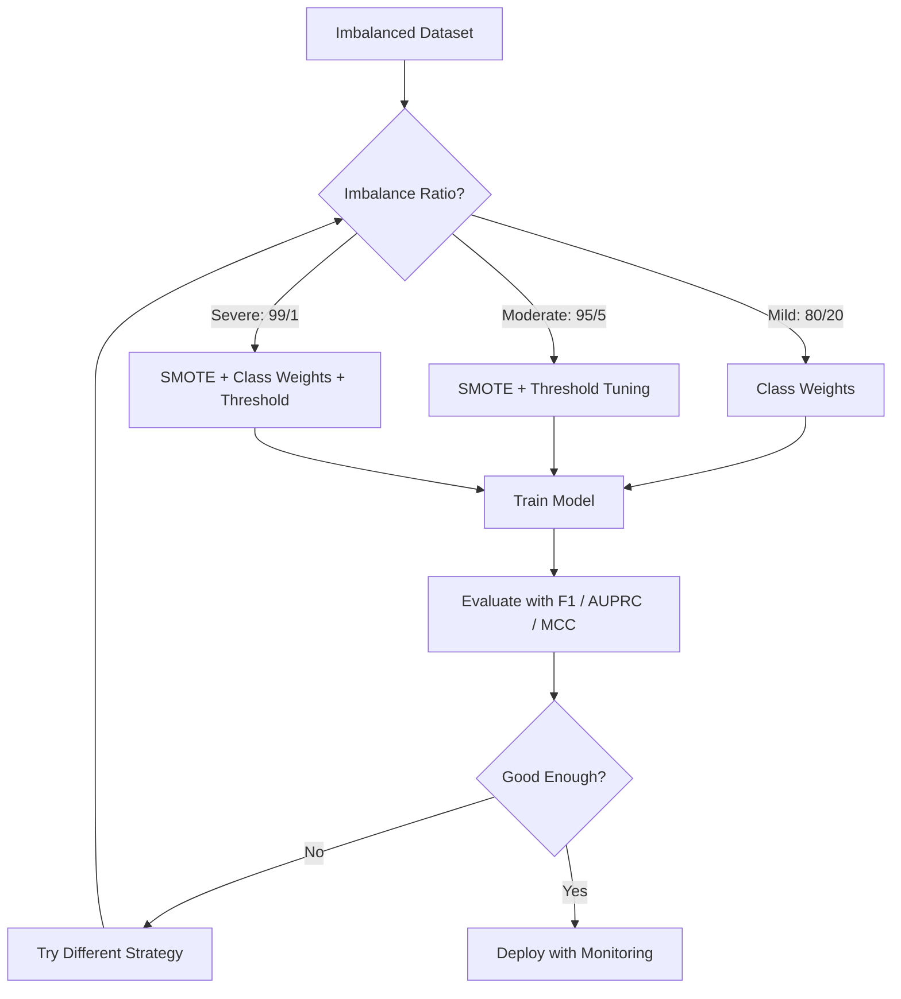
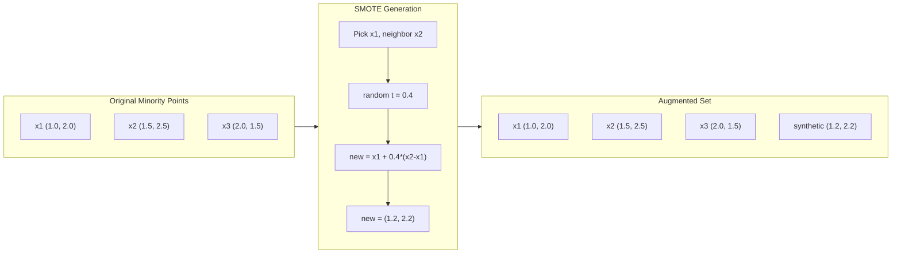
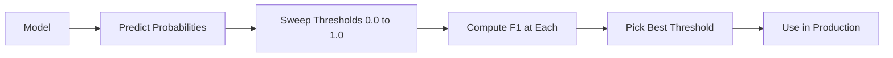
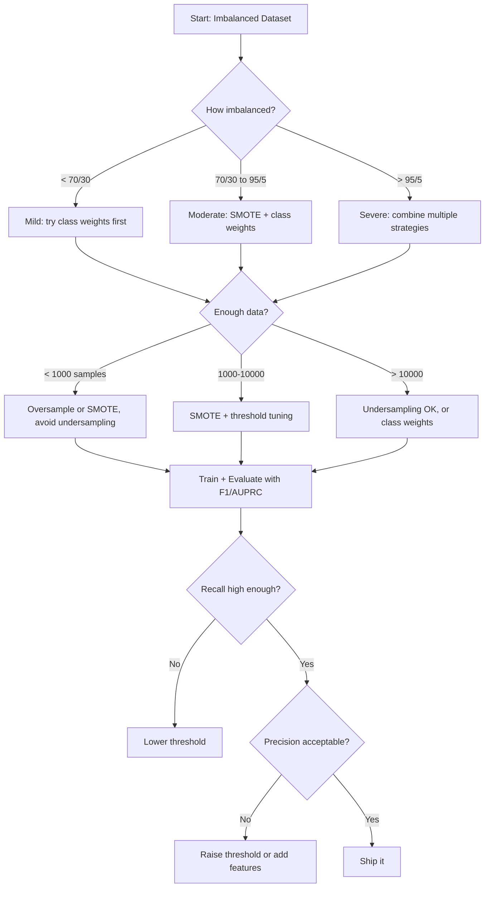

# 不平衡数据处理

> 当你的数据中有 99% 都是“正常”时，准确率就成了谎言。

**Type:** Build
**Language:** Python
**Prerequisites:** 第 2 阶段，第 01-09 课（尤其是评估指标）
**Time:** ~90 分钟

## 学习目标

- 从零实现 SMOTE（合成少数类过采样技术），并解释合成过采样与随机复制有何不同
- 使用 F1、AUPRC 和 Matthews 相关系数，而非准确率，评估不平衡分类器
- 比较类别加权、阈值调优和重采样策略，并为给定的不平衡比例选择合适的方法
- 构建完整的不平衡数据管线，结合 SMOTE、类别权重和阈值优化

## 要解决的问题

你构建了一个欺诈检测模型，准确率达到 99.9%。你欢呼庆祝，随后却发现，它把每一笔交易都预测为“非欺诈”。

这不是程序错误。当欺诈交易仅占 0.1% 时，这样做很合理。模型学到的是：始终猜测多数类能使总体错误最少。从技术上看没错，却完全没有用。

凡是真正需要分类的地方，都会遇到这种情况。疾病诊断：阳性率为 1%。网络入侵：攻击占 0.01%。制造缺陷：不良品占 0.5%。垃圾邮件过滤：垃圾邮件占 20%。客户流失预测：流失客户占 5%。少数类越是事关重大，往往就越稀少。

准确率失效，是因为它对所有正确预测一视同仁。正确标记一笔合法交易和正确识别一笔欺诈交易，都只给准确率贡献一次正确计数。但识别欺诈才是这个模型存在的全部意义。我们需要指标、技术和训练策略，迫使模型关注那个稀少却重要的类别。

## 核心概念

### 为什么准确率会失效

考虑一个包含 1000 个样本的数据集：990 个负类样本，10 个正类样本。对于一个始终预测为负类的模型：

|  | 预测为正类 | 预测为负类 |
|--|---|---|
| 实际为正类 | 0 (TP) | 10 (FN) |
| 实际为负类 | 0 (FP) | 990 (TN) |

准确率 = (0 + 990) / 1000 = 99.0%

模型没有识别出任何欺诈、任何疾病、任何缺陷。但准确率却显示为 99%。这就是准确率对不平衡问题具有误导危险的原因。

### 更好的指标

**精确率（Precision）** = TP / (TP + FP)。在所有被标记为正类的样本中，有多少确实是正类？精确率高意味着误报少。

**召回率（Recall）** = TP / (TP + FN)。在所有实际为正类的样本中，我们识别出了多少？召回率高意味着漏掉的正类样本少。

**F1 分数** = 2 * precision * recall / (precision + recall)。这是调和平均值。与算术平均值相比，它对精确率与召回率之间的极端不平衡惩罚更重。

**F-beta 分数** = (1 + beta^2) * precision * recall / (beta^2 * precision + recall)。当 beta > 1 时，召回率更重要；当 beta < 1 时，精确率更重要。F2 常用于欺诈检测（漏掉欺诈比误报更糟）。

**AUPRC** （精确率-召回率曲线下面积）。它类似于 AUC-ROC，但对不平衡数据更有参考价值。随机分类器的 AUPRC 等于正类比例（不像 ROC 那样为 0.5）。这使改进更容易看出来。

**Matthews 相关系数** = (TP * TN - FP * FN) / sqrt((TP+FP)(TP+FN)(TN+FP)(TN+FN))。取值范围为 -1 到 +1。只有模型在两个类别上都表现良好时才会得到高分。即使类别规模相差很大，它也能兼顾两者。

对于上面“始终预测为负类”的模型：precision = 0/0（未定义，通常设为 0），recall = 0/10 = 0，F1 = 0，MCC = 0。这些指标正确地指出了模型毫无用处。

### 不平衡数据管线



### SMOTE：合成少数类过采样技术

随机过采样会复制现有的少数类样本。这种做法有效，但有过拟合风险，因为模型会反复看到完全相同的数据点。

SMOTE 创建合理的新合成少数类样本，而不是副本。算法如下：

1. 对每个少数类样本 x，在其他少数类样本中找到它的 k 个最近邻
2. 随机选择一个近邻
3. 在 x 与该近邻之间的线段上创建一个新样本

公式：`new_sample = x + random(0, 1) * (neighbor - x)`

这会在真实的少数类数据点之间插值，在特征空间的同一区域创建样本，而不只是复制现有数据。



### 采样策略对比

**随机过采样**: 复制少数类样本，使其数量与多数类一致。
- 优点：简单，没有信息损失
- 缺点：完全相同的副本会导致过拟合，并增加训练时间

**随机欠采样**: 移除多数类样本，使其数量与少数类一致。
- 优点：训练快，简单
- 缺点：丢弃可能有用的多数类数据，方差更大

**SMOTE**: 通过插值创建合成少数类样本。
- 优点：生成新的数据点，相比随机过采样可减少过拟合
- 缺点：可能在决策边界附近创建噪声样本，没有考虑多数类的分布

| 策略 | 数据变化 | 风险 | 适用场景 |
|----------|-------------|------|-------------|
| 过采样 | 复制少数类 | 过拟合 | 小数据集，中度不平衡 |
| 欠采样 | 移除多数类 | 信息损失 | 大数据集，希望快速训练 |
| SMOTE | 添加合成少数类样本 | 边界噪声 | 中度不平衡，少数类样本足够用于 k-NN |

### 类别权重

不改变数据，而是改变模型对待错误的方式。为少数类的误分类赋予更高的权重。

对于一个包含 950 个负类样本和 50 个正类样本的二分类问题：
- 负类权重 = n_samples / (2 * n_negative) = 1000 / (2 * 950) = 0.526
- 正类权重 = n_samples / (2 * n_positive) = 1000 / (2 * 50) = 10.0

正类获得的权重是负类的 19 倍。误分类一个正类样本的代价，与误分类 19 个负类样本一样。模型被迫关注少数类。

在逻辑回归中，这会修改损失函数：

```text
weighted_loss = -sum(w_i * [y_i * log(p_i) + (1-y_i) * log(1-p_i)])
```

其中，w_i 取决于样本 i 所属的类别。

从期望上看，类别权重在数学上等价于过采样，但不需要创建新的数据点。因此，它更快，也避免了重复样本带来的过拟合风险。

### 阈值调优

大多数分类器输出概率。默认阈值为 0.5：若 P(positive) >= 0.5，就预测为正类。但 0.5 是任意选定的。当类别不平衡时，最优阈值通常会低得多。

流程如下：
1. 训练模型
2. 获取验证集上的预测概率
3. 扫描从 0.0 到 1.0 的阈值
4. 在每个阈值处计算 F1（或你选定的指标）
5. 选择使指标最大的阈值



模型可能对一笔欺诈交易输出 P(fraud) = 0.15。阈值为 0.5 时，它被分类为非欺诈；阈值为 0.10 时，它就会被正确识别。概率校准的重要性低于排序 -- 只要欺诈交易的概率高于非欺诈交易，就存在一个能将它们分开的阈值。

### 代价敏感学习

这是类别权重的推广。不再使用统一的代价，而是指定具体的误分类代价：

| | 预测为正类 | 预测为负类 |
|--|---|---|
| 实际为正类 | 0（正确） | C_FN = 100 |
| 实际为负类 | C_FP = 1 | 0（正确） |

漏掉一笔欺诈交易（FN）的代价是一次误报（FP）的 100 倍。模型优化的是总代价，而不是总错误次数。

当你能够估计现实世界的代价时，这是最有理论依据的方法。漏诊癌症的代价与一次导致额外活检的误报大不相同。明确这些代价，会促使我们做出恰当的权衡。

### 决策流程图



```figure
class-imbalance
```

## 动手实现

### 第 1 步：生成不平衡数据集

```python
import numpy as np


def make_imbalanced_data(n_majority=950, n_minority=50, seed=42):
    rng = np.random.RandomState(seed)

    X_maj = rng.randn(n_majority, 2) * 1.0 + np.array([0.0, 0.0])
    X_min = rng.randn(n_minority, 2) * 0.8 + np.array([2.5, 2.5])

    X = np.vstack([X_maj, X_min])
    y = np.concatenate([np.zeros(n_majority), np.ones(n_minority)])

    shuffle_idx = rng.permutation(len(y))
    return X[shuffle_idx], y[shuffle_idx]
```

### 第 2 步：从零实现 SMOTE

```python
def euclidean_distance(a, b):
    return np.sqrt(np.sum((a - b) ** 2))


def find_k_neighbors(X, idx, k):
    distances = []
    for i in range(len(X)):
        if i == idx:
            continue
        d = euclidean_distance(X[idx], X[i])
        distances.append((i, d))
    distances.sort(key=lambda x: x[1])
    return [d[0] for d in distances[:k]]


def smote(X_minority, k=5, n_synthetic=100, seed=42):
    rng = np.random.RandomState(seed)
    n_samples = len(X_minority)
    k = min(k, n_samples - 1)
    synthetic = []

    for _ in range(n_synthetic):
        idx = rng.randint(0, n_samples)
        neighbors = find_k_neighbors(X_minority, idx, k)
        neighbor_idx = neighbors[rng.randint(0, len(neighbors))]
        t = rng.random()
        new_point = X_minority[idx] + t * (X_minority[neighbor_idx] - X_minority[idx])
        synthetic.append(new_point)

    return np.array(synthetic)
```

### 第 3 步：随机过采样与欠采样

```python
def random_oversample(X, y, seed=42):
    rng = np.random.RandomState(seed)
    classes, counts = np.unique(y, return_counts=True)
    max_count = counts.max()

    X_resampled = list(X)
    y_resampled = list(y)

    for cls, count in zip(classes, counts):
        if count < max_count:
            cls_indices = np.where(y == cls)[0]
            n_needed = max_count - count
            chosen = rng.choice(cls_indices, size=n_needed, replace=True)
            X_resampled.extend(X[chosen])
            y_resampled.extend(y[chosen])

    X_out = np.array(X_resampled)
    y_out = np.array(y_resampled)
    shuffle = rng.permutation(len(y_out))
    return X_out[shuffle], y_out[shuffle]


def random_undersample(X, y, seed=42):
    rng = np.random.RandomState(seed)
    classes, counts = np.unique(y, return_counts=True)
    min_count = counts.min()

    X_resampled = []
    y_resampled = []

    for cls in classes:
        cls_indices = np.where(y == cls)[0]
        chosen = rng.choice(cls_indices, size=min_count, replace=False)
        X_resampled.extend(X[chosen])
        y_resampled.extend(y[chosen])

    X_out = np.array(X_resampled)
    y_out = np.array(y_resampled)
    shuffle = rng.permutation(len(y_out))
    return X_out[shuffle], y_out[shuffle]
```

### 第 4 步：带类别权重的逻辑回归

```python
def sigmoid(z):
    return 1.0 / (1.0 + np.exp(-np.clip(z, -500, 500)))


def logistic_regression_weighted(X, y, weights, lr=0.01, epochs=200):
    n_samples, n_features = X.shape
    w = np.zeros(n_features)
    b = 0.0

    for _ in range(epochs):
        z = X @ w + b
        pred = sigmoid(z)
        error = pred - y
        weighted_error = error * weights

        gradient_w = (X.T @ weighted_error) / n_samples
        gradient_b = np.mean(weighted_error)

        w -= lr * gradient_w
        b -= lr * gradient_b

    return w, b


def compute_class_weights(y):
    classes, counts = np.unique(y, return_counts=True)
    n_samples = len(y)
    n_classes = len(classes)
    weight_map = {}
    for cls, count in zip(classes, counts):
        weight_map[cls] = n_samples / (n_classes * count)
    return np.array([weight_map[yi] for yi in y])
```

### 第 5 步：阈值调优

```python
def find_optimal_threshold(y_true, y_probs, metric="f1"):
    best_threshold = 0.5
    best_score = -1.0

    for threshold in np.arange(0.05, 0.96, 0.01):
        y_pred = (y_probs >= threshold).astype(int)
        tp = np.sum((y_pred == 1) & (y_true == 1))
        fp = np.sum((y_pred == 1) & (y_true == 0))
        fn = np.sum((y_pred == 0) & (y_true == 1))

        if metric == "f1":
            precision = tp / (tp + fp) if (tp + fp) > 0 else 0.0
            recall = tp / (tp + fn) if (tp + fn) > 0 else 0.0
            score = 2 * precision * recall / (precision + recall) if (precision + recall) > 0 else 0.0
        elif metric == "recall":
            score = tp / (tp + fn) if (tp + fn) > 0 else 0.0
        elif metric == "precision":
            score = tp / (tp + fp) if (tp + fp) > 0 else 0.0

        if score > best_score:
            best_score = score
            best_threshold = threshold

    return best_threshold, best_score
```

### 第 6 步：评估函数

```python
def confusion_matrix_values(y_true, y_pred):
    tp = np.sum((y_pred == 1) & (y_true == 1))
    tn = np.sum((y_pred == 0) & (y_true == 0))
    fp = np.sum((y_pred == 1) & (y_true == 0))
    fn = np.sum((y_pred == 0) & (y_true == 1))
    return tp, tn, fp, fn


def compute_metrics(y_true, y_pred):
    tp, tn, fp, fn = confusion_matrix_values(y_true, y_pred)
    accuracy = (tp + tn) / (tp + tn + fp + fn)
    precision = tp / (tp + fp) if (tp + fp) > 0 else 0.0
    recall = tp / (tp + fn) if (tp + fn) > 0 else 0.0
    f1 = 2 * precision * recall / (precision + recall) if (precision + recall) > 0 else 0.0

    denom = np.sqrt(float((tp + fp) * (tp + fn) * (tn + fp) * (tn + fn)))
    mcc = (tp * tn - fp * fn) / denom if denom > 0 else 0.0

    return {
        "accuracy": accuracy,
        "precision": precision,
        "recall": recall,
        "f1": f1,
        "mcc": mcc,
    }
```

### 第 7 步：比较所有方法

```python
X, y = make_imbalanced_data(950, 50, seed=42)
split = int(0.8 * len(y))
X_train, X_test = X[:split], X[split:]
y_train, y_test = y[:split], y[split:]

# Baseline: no treatment
w_base, b_base = logistic_regression_weighted(
    X_train, y_train, np.ones(len(y_train)), lr=0.1, epochs=300
)
probs_base = sigmoid(X_test @ w_base + b_base)
preds_base = (probs_base >= 0.5).astype(int)

# Oversampled
X_over, y_over = random_oversample(X_train, y_train)
w_over, b_over = logistic_regression_weighted(
    X_over, y_over, np.ones(len(y_over)), lr=0.1, epochs=300
)
preds_over = (sigmoid(X_test @ w_over + b_over) >= 0.5).astype(int)

# SMOTE
minority_mask = y_train == 1
X_minority = X_train[minority_mask]
synthetic = smote(X_minority, k=5, n_synthetic=len(y_train) - 2 * int(minority_mask.sum()))
X_smote = np.vstack([X_train, synthetic])
y_smote = np.concatenate([y_train, np.ones(len(synthetic))])
w_sm, b_sm = logistic_regression_weighted(
    X_smote, y_smote, np.ones(len(y_smote)), lr=0.1, epochs=300
)
preds_smote = (sigmoid(X_test @ w_sm + b_sm) >= 0.5).astype(int)

# Class weights
sample_weights = compute_class_weights(y_train)
w_cw, b_cw = logistic_regression_weighted(
    X_train, y_train, sample_weights, lr=0.1, epochs=300
)
probs_cw = sigmoid(X_test @ w_cw + b_cw)
preds_cw = (probs_cw >= 0.5).astype(int)

# Threshold tuning (tune on held-out validation set, not test set)
probs_val = sigmoid(X_val @ w_cw + b_cw)
best_thresh, best_f1 = find_optimal_threshold(y_val, probs_val, metric="f1")
preds_thresh = (probs_cw >= best_thresh).astype(int)
```

代码文件在一个脚本中运行上述全部内容，并打印结果。

## 实际使用

使用 scikit-learn 和 imbalanced-learn，这些技术都能通过一行调用实现：

```python
from sklearn.linear_model import LogisticRegression
from sklearn.metrics import classification_report, f1_score
from sklearn.model_selection import train_test_split
from imblearn.over_sampling import SMOTE
from imblearn.under_sampling import RandomUnderSampler
from imblearn.pipeline import Pipeline

X_train, X_test, y_train, y_test = train_test_split(X, y, stratify=y)

model_weighted = LogisticRegression(class_weight="balanced")
model_weighted.fit(X_train, y_train)
print(classification_report(y_test, model_weighted.predict(X_test)))

smote = SMOTE(random_state=42)
X_resampled, y_resampled = smote.fit_resample(X_train, y_train)
model_smote = LogisticRegression()
model_smote.fit(X_resampled, y_resampled)
print(classification_report(y_test, model_smote.predict(X_test)))

pipeline = Pipeline([
    ("smote", SMOTE()),
    ("model", LogisticRegression(class_weight="balanced")),
])
pipeline.fit(X_train, y_train)
print(classification_report(y_test, pipeline.predict(X_test)))
```

从零实现能准确展示每种技术的作用。SMOTE 就是在少数类上进行 k-NN 插值。类别权重对损失进行加权。阈值调优就是遍历截断值的 for 循环。没有什么魔法。

## 交付成果

本课产出：
- `outputs/skill-imbalanced-data.md` -- 用于处理不平衡分类问题的决策检查清单

## 练习

1. **Borderline-SMOTE**: 修改 SMOTE 实现，只为靠近决策边界的少数类数据点（其 k 个最近邻中包含多数类样本的点）生成合成样本。在类别重叠的数据集上，与标准 SMOTE 比较结果。

2. **代价矩阵优化**: 实现代价敏感学习，将代价矩阵作为参数。创建一个接收代价矩阵并返回最优预测的函数，使期望代价最小。用不同的代价比例（1:10、1:100、1:1000）进行测试，并绘图展示精确率-召回率权衡如何变化。

3. **阈值校准**: 实现 Platt 缩放（在模型的原始输出上拟合逻辑回归，以生成校准后的概率）。比较校准前后的精确率-召回率曲线。展示校准不会改变排序（AUC 保持不变），但能让概率更有意义。

4. **平衡 Bagging 集成**: 训练多个模型，每个模型使用一个平衡的 bootstrap 样本（自助抽样样本，包含全部少数类 + 多数类的随机子集）。对它们的预测取平均。将这种方法与使用 SMOTE 的单个模型进行比较。测量性能以及多次运行之间的方差。

5. **不平衡比例实验**: 取一个平衡数据集，逐步增大不平衡比例（50/50、70/30、90/10、95/5、99/1）。在每个比例下，分别使用和不使用 SMOTE 进行训练。为这两种方法绘制 F1 随不平衡比例变化的曲线。SMOTE 从什么比例开始带来有意义的改善？

## 关键术语

| 术语 | 常见说法 | 实际含义 |
|------|----------------|----------------------|
| 类别不平衡 | “某一类的样本多得多” | 数据集中的类别分布明显偏斜，导致模型偏向多数类 |
| SMOTE | “合成过采样” | 在现有少数类样本与其 k 个最近的少数类近邻之间插值，创建新的少数类样本 |
| 类别权重 | “让稀有类别上的错误更昂贵” | 将损失函数乘以类别专属的权重，让模型对少数类误分类施加更重的惩罚 |
| 阈值调优 | “移动决策边界” | 将分类的概率截断值从默认的 0.5 改为能优化目标指标的值 |
| 精确率-召回率权衡 | “鱼与熊掌不可兼得” | 降低阈值会识别出更多正类（召回率更高），但也会产生更多假阳性（精确率更低），反之亦然 |
| AUPRC | “PR 曲线下面积” | 将精确率-召回率曲线概括为一个数值；类别严重不平衡时，比 AUC-ROC 更有参考价值 |
| Matthews 相关系数 | “兼顾两类的指标” | 预测标签与实际标签之间的相关性，只有模型在两个类别上都表现良好时才会得到高分 |
| 代价敏感学习 | “不同错误的代价不同” | 将现实中的误分类代价纳入训练目标，让模型优化总代价，而不是错误次数 |
| 随机过采样 | “复制少数类” | 重复少数类样本，以平衡类别数量；简单，但有对重复数据点过拟合的风险 |

## 延伸阅读

- [SMOTE: Synthetic Minority Over-sampling Technique (Chawla et al., 2002)](https://arxiv.org/abs/1106.1813) -- SMOTE 的原始论文，仍是不平衡学习领域被引用最多的工作
- [Learning from Imbalanced Data (He & Garcia, 2009)](https://ieeexplore.ieee.org/document/5128907) -- 全面综述，涵盖采样、代价敏感和算法层面的方法
- [imbalanced-learn 文档](https://imbalanced-learn.org/stable/) -- 提供 SMOTE 变体、欠采样策略和管线集成的 Python 库
- [The Precision-Recall Plot Is More Informative than the ROC Plot (Saito & Rehmsmeier, 2015)](https://journals.plos.org/plosone/article?id=10.1371/journal.pone.0118432) -- 在不平衡问题中，何时以及为何应优先采用 PR 曲线而不是 ROC 曲线
