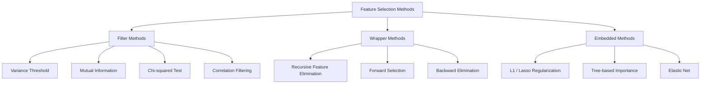
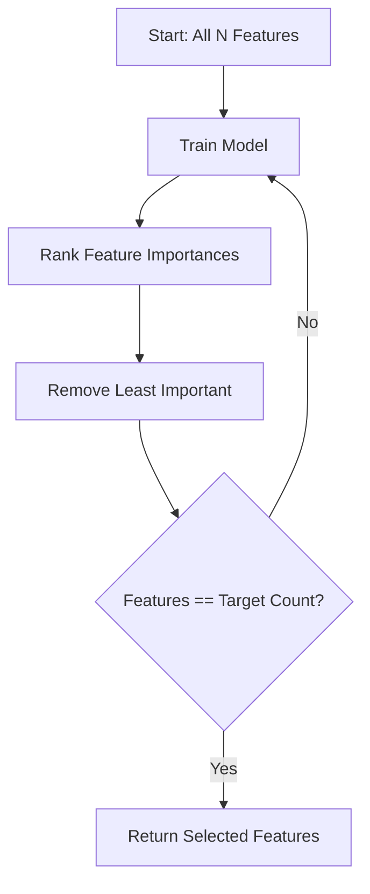
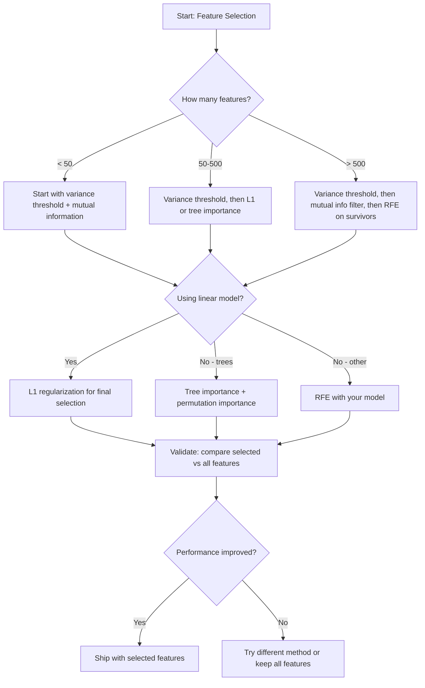

# 特征选择

> 特征并非越多越好，选对特征才更好。

**Type:** Build
**Language:** Python
**Prerequisites:** 阶段 2，第 01-09、08 课（特征工程）
**Time:** ~75 分钟

## 学习目标

- 从零实现过滤法（filter method，如方差阈值、互信息、卡方检验）和包裹法（wrapper method，如 RFE、前向选择）
- 解释为什么互信息能够捕捉相关性所遗漏的特征与目标之间的非线性关系
- 比较 L1 正则化（嵌入式选择）与 RFE（包裹式选择），评估它们在计算成本上的取舍
- 构建结合多种方法的特征选择（feature selection）流水线，并在留出数据上展示泛化能力的提升

## 要解决的问题

你有 500 个特征。模型训练缓慢，经常过拟合，也没人能解释它学到了什么。你希望通过增加更多特征来改善性能，结果却更糟。

这就是维度灾难在起作用。随着特征数量增加，特征空间的体积急剧膨胀，数据点变得稀疏，点与点之间的距离趋于接近。模型需要多得多的数据，且所需数据量呈指数增长，才能找到真正的模式。噪声特征淹没了信号特征，过拟合成为常态。

特征选择（feature selection）就是解药。剥离噪声，去除冗余，保留真正携带目标相关信息的特征。结果是训练更快、泛化更好，而且模型真正可以解释。

目标不是利用所有可用信息，而是利用正确的信息。

## 核心概念

### 特征选择的三大类别

每种特征选择方法都属于以下三类之一：



**过滤法**使用统计度量，独立地为每个特征评分。它们不使用模型。速度快，但会遗漏特征之间的交互作用。

**包裹法**通过训练模型来评估特征子集，使用模型性能作为评分依据。结果更好，但由于需要多次重新训练模型，成本较高。

**嵌入法（embedded method）**将特征选择作为模型训练的一部分。L1 正则化使权重变为零，决策树依据最有用的特征进行划分。选择发生在拟合过程中，而不是作为独立步骤进行。

### 方差阈值

这是最简单的过滤方法。如果一个特征在不同样本间几乎不变，它就几乎不携带信息。

假设一个特征在 1000 个样本中的 999 个上都为 0.0，那么它的方差接近零。任何模型都无法利用它区分类别。把它删除。

```text
variance(x) = mean((x - mean(x))^2)
```

设定一个阈值（例如 0.01），删除所有方差低于阈值的特征。这样完全不需要查看目标变量，就能移除常量或近似常量特征。

适用时机：在其他方法之前，作为预处理步骤使用。它能以接近零的成本筛出明显无用的特征。

局限：一个特征即使方差很高，也仍然可能是纯噪声。方差阈值是必要条件，但不是充分条件。

### 互信息

互信息（mutual information）衡量：知道特征 X 的值，能在多大程度上减少目标 Y 的不确定性。

```text
I(X; Y) = sum_x sum_y p(x, y) * log(p(x, y) / (p(x) * p(y)))
```

如果 X 与 Y 相互独立，则 p(x, y) = p(x) * p(y)，因此对数项为零，且 I(X; Y) = 0。X 提供的 Y 相关信息越多，互信息就越高。

相对于相关性的关键优势在于：互信息可以捕捉非线性关系。某个特征与目标的相关性可能为零，但互信息很高，因为它们之间可能存在二次关系或周期关系。

对于连续特征，先通过分箱将其离散化（基于直方图的估计）。箱数会影响估计结果：箱数太少会丢失信息，太多则会引入噪声。常见选择是使用 sqrt(n) 个箱，或采用 Sturges 规则 (1 + log2(n))。


### 递归特征消除（RFE）

RFE 是一种包裹法。它利用模型自身的特征重要性，迭代地删减特征：

1. 使用所有特征训练模型
2. 按重要性对特征排序（线性模型使用系数，树模型使用不纯度下降量）
3. 删除最不重要的一个或多个特征
4. 重复这一过程，直到剩余特征达到所需数量



RFE 会考虑特征之间的交互作用，因为模型会同时看到所有剩余特征。删除一个特征会改变其他特征的重要性。这使它比过滤法更全面。

代价是：需要训练模型 N - target 次。对于 500 个特征，若目标是保留 10 个，就需要训练 490 次。对于计算成本高的模型，这会很慢。你可以在每一步删除多个特征来加速，例如每轮删除重要性最低的 10%。

### L1（Lasso）正则化

L1 正则化将权重的绝对值加入损失函数：

```text
loss = prediction_error + alpha * sum(|w_i|)
```

alpha 参数控制特征删减的强度。alpha 越高，就有越多权重会恰好变为零。

为什么会恰好为零？L1 惩罚在权重空间中形成菱形约束区域。最优解往往落在这个菱形的顶点，其中一个或多个权重为零。L2 正则化（岭正则化）形成圆形约束，权重会缩小，但很少恰好变为零。

这就是嵌入式特征选择：模型在训练过程中学习应该忽略哪些特征。权重为零的特征实际上就被移除了。

优点：只需训练一次，能够处理相关特征（选取一个，将其他特征的权重归零），并且已内置于大多数线性模型实现中。

局限：只适用于线性模型，无法捕捉非线性的特征重要性。

### 基于树的特征重要性

决策树及其集成方法（随机森林、梯度提升）天然能够对特征排序。每次划分都会降低不纯度（分类任务使用 Gini 不纯度或熵，回归任务使用方差）。带来更大不纯度下降的特征更重要。

对于一个包含 T 棵树的随机森林：

```text
importance(feature_j) = (1/T) * sum over all trees of
    sum over all nodes splitting on feature_j of
        (n_samples * impurity_decrease)
```

这样就能得到每个特征归一化后的重要性分数。它能自动处理非线性关系和特征交互。

注意：基于树的重要性偏向具有大量不同取值的特征，即高基数特征。随机 ID 列会显得很重要，因为它能完美地将每个样本区分开。使用置换重要性进行合理性检查。

### 置换重要性

这是一种与模型类型无关的方法：

1. 训练模型，并记录其在验证数据上的基准性能
2. 对每个特征，随机打乱其值，并测量性能下降幅度
3. 下降幅度越大，该特征越重要

如果打乱某个特征不会损害性能，说明模型不依赖它。如果性能大幅下滑，则该特征至关重要。

置换重要性避免了基于树的重要性所具有的基数偏差。但它很慢：每个特征都需要一次完整评估，并且为了稳定性还要重复多次。

### 方法对比表

| 方法 | 类型 | 速度 | 非线性 | 特征交互 |
|--------|------|-------|-----------|---------------------|
| 方差阈值 | 过滤法 | 很快 | 否 | 否 |
| 互信息 | 过滤法 | 快 | 是 | 否 |
| 相关性过滤 | 过滤法 | 快 | 否 | 否 |
| RFE | 包裹法 | 慢 | 取决于模型 | 是 |
| L1 / Lasso | 嵌入法 | 快 | 否（线性） | 否 |
| 树重要性 | 嵌入法 | 中等 | 是 | 是 |
| 置换重要性 | 与模型类型无关 | 慢 | 是 | 是 |

### 决策流程图



```figure
f3-feature-prune
```

## 动手实现

### 步骤 1：生成特征结构已知的合成数据

```python
import numpy as np


def make_feature_selection_data(n_samples=500, seed=42):
    rng = np.random.RandomState(seed)

    x1 = rng.randn(n_samples)
    x2 = rng.randn(n_samples)
    x3 = rng.randn(n_samples)
    x4 = x1 + 0.1 * rng.randn(n_samples)
    x5 = x2 + 0.1 * rng.randn(n_samples)

    informative = np.column_stack([x1, x2, x3, x4, x5])

    correlated = np.column_stack([
        x1 * 0.9 + 0.1 * rng.randn(n_samples),
        x2 * 0.8 + 0.2 * rng.randn(n_samples),
        x3 * 0.7 + 0.3 * rng.randn(n_samples),
        x1 * 0.5 + x2 * 0.5 + 0.1 * rng.randn(n_samples),
        x2 * 0.6 + x3 * 0.4 + 0.1 * rng.randn(n_samples),
    ])

    noise = rng.randn(n_samples, 10) * 0.5

    X = np.hstack([informative, correlated, noise])
    y = (2 * x1 - 1.5 * x2 + x3 + 0.5 * rng.randn(n_samples) > 0).astype(int)

    feature_names = (
        [f"info_{i}" for i in range(5)]
        + [f"corr_{i}" for i in range(5)]
        + [f"noise_{i}" for i in range(10)]
    )

    return X, y, feature_names
```

我们知道真实情况：特征 0-4 含有信息（其中 3 和 4 还是 0 和 1 的相关副本），特征 5-9 与信息特征相关，特征 10-19 是纯噪声。好的选择方法应将 0-4 排在最前面，将 10-19 排在最后面。

### 步骤 2：方差阈值

```python
def variance_threshold(X, threshold=0.01):
    variances = np.var(X, axis=0)
    mask = variances > threshold
    return mask, variances
```

### 步骤 3：互信息（离散）

```python
def discretize(x, n_bins=10):
    min_val, max_val = x.min(), x.max()
    if max_val == min_val:
        return np.zeros_like(x, dtype=int)
    bin_edges = np.linspace(min_val, max_val, n_bins + 1)
    binned = np.digitize(x, bin_edges[1:-1])
    return binned


def mutual_information(X, y, n_bins=10):
    n_samples, n_features = X.shape
    mi_scores = np.zeros(n_features)

    y_vals, y_counts = np.unique(y, return_counts=True)
    p_y = y_counts / n_samples

    for f in range(n_features):
        x_binned = discretize(X[:, f], n_bins)
        x_vals, x_counts = np.unique(x_binned, return_counts=True)
        p_x = dict(zip(x_vals, x_counts / n_samples))

        mi = 0.0
        for xv in x_vals:
            for yi, yv in enumerate(y_vals):
                joint_mask = (x_binned == xv) & (y == yv)
                p_xy = np.sum(joint_mask) / n_samples
                if p_xy > 0:
                    mi += p_xy * np.log(p_xy / (p_x[xv] * p_y[yi]))
        mi_scores[f] = mi

    return mi_scores
```

### 步骤 4：递归特征消除

```python
def simple_logistic_importance(X, y, lr=0.1, epochs=100):
    n_samples, n_features = X.shape
    w = np.zeros(n_features)
    b = 0.0

    for _ in range(epochs):
        z = X @ w + b
        pred = 1.0 / (1.0 + np.exp(-np.clip(z, -500, 500)))
        error = pred - y
        w -= lr * (X.T @ error) / n_samples
        b -= lr * np.mean(error)

    return w, b


def rfe(X, y, n_features_to_select=5, lr=0.1, epochs=100):
    n_total = X.shape[1]
    remaining = list(range(n_total))
    rankings = np.ones(n_total, dtype=int)
    rank = n_total

    while len(remaining) > n_features_to_select:
        X_subset = X[:, remaining]
        w, _ = simple_logistic_importance(X_subset, y, lr, epochs)
        importances = np.abs(w)

        least_idx = np.argmin(importances)
        original_idx = remaining[least_idx]
        rankings[original_idx] = rank
        rank -= 1
        remaining.pop(least_idx)

    for idx in remaining:
        rankings[idx] = 1

    selected_mask = rankings == 1
    return selected_mask, rankings
```

### 步骤 5：L1 特征选择

```python
def soft_threshold(w, alpha):
    return np.sign(w) * np.maximum(np.abs(w) - alpha, 0)


def l1_feature_selection(X, y, alpha=0.1, lr=0.01, epochs=500):
    n_samples, n_features = X.shape
    w = np.zeros(n_features)
    b = 0.0

    for _ in range(epochs):
        z = X @ w + b
        pred = 1.0 / (1.0 + np.exp(-np.clip(z, -500, 500)))
        error = pred - y

        gradient_w = (X.T @ error) / n_samples
        gradient_b = np.mean(error)

        w -= lr * gradient_w
        w = soft_threshold(w, lr * alpha)
        b -= lr * gradient_b

    selected_mask = np.abs(w) > 1e-6
    return selected_mask, w
```

### 步骤 6：基于树的重要性（简单决策树）

```python
def gini_impurity(y):
    if len(y) == 0:
        return 0.0
    classes, counts = np.unique(y, return_counts=True)
    probs = counts / len(y)
    return 1.0 - np.sum(probs ** 2)


def best_split(X, y, feature_idx):
    values = np.unique(X[:, feature_idx])
    if len(values) <= 1:
        return None, -1.0

    best_threshold = None
    best_gain = -1.0
    parent_gini = gini_impurity(y)
    n = len(y)

    for i in range(len(values) - 1):
        threshold = (values[i] + values[i + 1]) / 2.0
        left_mask = X[:, feature_idx] <= threshold
        right_mask = ~left_mask

        n_left = np.sum(left_mask)
        n_right = np.sum(right_mask)

        if n_left == 0 or n_right == 0:
            continue

        gain = parent_gini - (n_left / n) * gini_impurity(y[left_mask]) - (n_right / n) * gini_impurity(y[right_mask])

        if gain > best_gain:
            best_gain = gain
            best_threshold = threshold

    return best_threshold, best_gain


def tree_importance(X, y, n_trees=50, max_depth=5, seed=42):
    rng = np.random.RandomState(seed)
    n_samples, n_features = X.shape
    importances = np.zeros(n_features)

    for _ in range(n_trees):
        sample_idx = rng.choice(n_samples, size=n_samples, replace=True)
        feature_subset = rng.choice(n_features, size=max(1, int(np.sqrt(n_features))), replace=False)

        X_boot = X[sample_idx]
        y_boot = y[sample_idx]

        tree_imp = _build_tree_importance(X_boot, y_boot, feature_subset, max_depth)
        importances += tree_imp

    total = importances.sum()
    if total > 0:
        importances /= total

    return importances


def _build_tree_importance(X, y, feature_subset, max_depth, depth=0):
    n_features = X.shape[1]
    importances = np.zeros(n_features)

    if depth >= max_depth or len(np.unique(y)) <= 1 or len(y) < 4:
        return importances

    best_feature = None
    best_threshold = None
    best_gain = -1.0

    for f in feature_subset:
        threshold, gain = best_split(X, y, f)
        if gain > best_gain:
            best_gain = gain
            best_feature = f
            best_threshold = threshold

    if best_feature is None or best_gain <= 0:
        return importances

    importances[best_feature] += best_gain * len(y)

    left_mask = X[:, best_feature] <= best_threshold
    right_mask = ~left_mask

    importances += _build_tree_importance(X[left_mask], y[left_mask], feature_subset, max_depth, depth + 1)
    importances += _build_tree_importance(X[right_mask], y[right_mask], feature_subset, max_depth, depth + 1)

    return importances
```

### 步骤 7：运行所有方法并比较

代码文件会在同一个合成数据集上运行全部五种方法，并打印对比表，展示每种方法选中了哪些特征。

## 实际使用

在 scikit-learn 中，特征选择内置于流水线中：

```python
from sklearn.feature_selection import (
    VarianceThreshold,
    mutual_info_classif,
    RFE,
    SelectFromModel,
)
from sklearn.linear_model import Lasso, LogisticRegression
from sklearn.ensemble import RandomForestClassifier

vt = VarianceThreshold(threshold=0.01)
X_filtered = vt.fit_transform(X)

mi_scores = mutual_info_classif(X, y)
top_k = np.argsort(mi_scores)[-10:]

rfe_selector = RFE(LogisticRegression(), n_features_to_select=10)
rfe_selector.fit(X, y)
X_rfe = rfe_selector.transform(X)

lasso_selector = SelectFromModel(Lasso(alpha=0.01))
lasso_selector.fit(X, y)
X_lasso = lasso_selector.transform(X)

rf = RandomForestClassifier(n_estimators=100)
rf.fit(X, y)
importances = rf.feature_importances_
```

从零实现能清楚展示每种方法内部发生的事情。方差阈值不过是计算 `var(X, axis=0)`，然后应用掩码。互信息是在列联表中统计联合频数与边缘频数。RFE 是训练、排序、删减的循环。L1 是带有软阈值步骤的梯度下降。树重要性累计各次划分带来的不纯度下降量。没有魔法，只有统计和循环。

sklearn 版本增加了稳健性（例如 mutual_info_classif 使用 k-NN 密度估计，而不是分箱）、速度（C 实现）以及与流水线的集成。

## 交付成果

本课会生成：
- `outputs/skill-feature-selector.md` - 用于选择合适特征选择方法的速查决策树

## 练习

1. **前向选择**：实现与 RFE 相反的过程。从零个特征开始，每一步加入最能提升模型性能的特征。增加特征不再带来帮助时停止。将选出的特征与 RFE 的结果比较。哪一种更快？哪一种效果更好？

2. **稳定性选择**：运行 50 次 L1 特征选择，每次随机抽取 80% 的数据作为子样本，并使用略有不同的 alpha 值。统计每个特征被选中的次数。被选中的运行占比 > 80% 的特征被视为“稳定”。将这些稳定特征与单次 L1 选择的结果比较。哪一种更可靠？

3. **多重共线性检测**：计算所有特征的相关矩阵。实现一个函数，在给定相关性阈值（例如 0.9）后，从每对高度相关的特征中删除一个，保留与目标互信息更高的那个。在合成数据集上测试，并验证它会移除冗余的相关特征。

4. **特征选择流水线**：将方差阈值、互信息过滤和 RFE 串成一条流水线。先移除方差接近零的特征，再保留互信息最高的 50%，最后对剩余特征运行 RFE。将这条流水线与直接对全部特征运行 RFE 进行比较。流水线是否更快？准确性是否相同？

5. **从零实现置换重要性**：实现置换重要性。对每个特征，将其值打乱 10 次，测量 F1 分数的平均下降幅度。将得到的排序与基于树的重要性排序比较。找出两者不一致的情况，并解释原因（提示：相关特征）。

## 关键术语

| 术语 | 常见说法 | 实际含义 |
|------|----------------|----------------------|
| 过滤法 | “独立地为特征评分” | 一种不训练模型、使用统计度量为特征排序的特征选择方法，单独评估每个特征 |
| 包裹法 | “用模型挑选特征” | 一种通过训练模型评估特征子集，并以模型性能作为选择标准的特征选择方法 |
| 嵌入法 | “模型在训练过程中选择特征” | 作为模型拟合的一部分进行的特征选择，例如 L1 正则化使权重变为零 |
| 互信息 | “一个变量能提供多少关于另一个变量的信息” | 衡量已知 X 后 Y 的不确定性减少了多少，能够捕捉线性和非线性依赖关系 |
| 递归特征消除 | “训练、排序、删减、重复” | 一种迭代式包裹法：训练模型，删除最不重要的一个或多个特征，重复直到达到目标数量 |
| L1 / Lasso 正则化 | “使特征失效的惩罚项” | 将权重绝对值之和加入损失函数，使不重要特征的权重恰好变为零 |
| 方差阈值 | “移除常量特征” | 删除样本间方差低于指定阈值的特征，过滤掉不携带信息的特征 |
| 特征重要性 | “哪些特征最重要” | 表示每个特征对模型预测贡献程度的分数，由划分增益（树模型）或系数绝对值（线性模型）计算得到 |
| 置换重要性 | “打乱后测量损害” | 随机打乱每个特征的值，并测量由此导致的模型性能下降，以评估特征重要性 |
| 维度灾难 | “特征太多，数据太少” | 增加特征使特征空间体积呈指数增长，导致数据稀疏、距离失去意义的现象 |

## 延伸阅读

- [变量与特征选择入门（Guyon & Elisseeff，2003）](https://jmlr.org/papers/v3/guyon03a.html) - 关于特征选择方法的奠基性综述，至今仍被广泛引用
- [scikit-learn 特征选择指南](https://scikit-learn.org/stable/modules/feature_selection.html) - 过滤法、包裹法和嵌入法的实用参考，附代码示例
- [稳定性选择（Meinshausen & Buhlmann，2010）](https://arxiv.org/abs/0809.2932) - 将子采样与特征选择结合，获得稳健、可复现的结果
- [警惕默认的随机森林重要性（Strobl 等，2007）](https://bmcbioinformatics.biomedcentral.com/articles/10.1186/1471-2105-8-25) - 展示基于树的重要性中的基数偏差，并提出条件重要性作为替代方法
