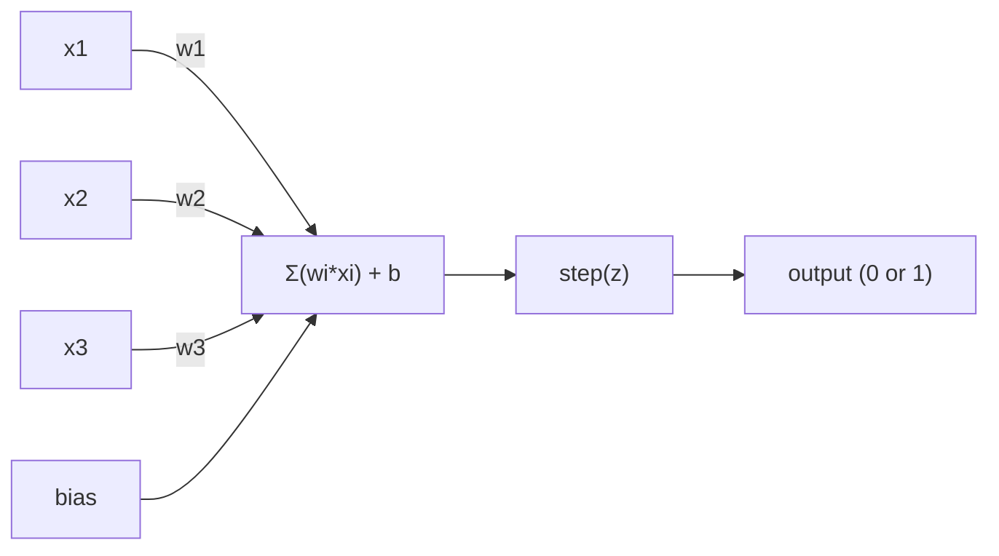
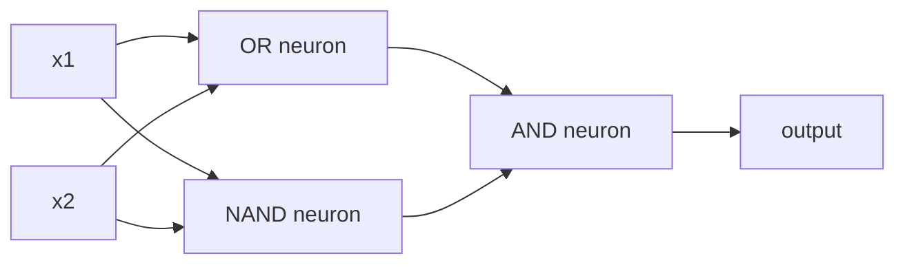

# 感知机

> 感知机（perceptron）是神经网络的原子。拆开它，你会看到权重、偏置和一次决策。

**Type:** Build
**Languages:** Python
**Prerequisites:** 阶段 1（线性代数直觉）
**Time:** ~60 分钟

## 学习目标

- 用 Python 从零实现感知机，包括权重更新规则和阶跃激活函数
- 解释为什么单个感知机只能解决线性可分问题，并演示它在 XOR（异或）上的失败情况
- 组合 OR（或门）、NAND（与非门）和 AND（与门），构建多层感知机来解决 XOR
- 使用 sigmoid 激活函数和反向传播训练双层网络，让它自动学会 XOR

## 要解决的问题

你已经了解向量和点积，也知道矩阵能将输入变换为输出。但机器究竟如何*学会*该使用哪种变换？

感知机回答了这个问题。它是最简单的学习机器：接收一些输入，乘以权重，加上偏置，再做出二元决策。然后进行调整，仅此而已。迄今为止构建的每个神经网络，都是将这个想法一层层堆叠起来。

理解感知机，就是理解代码中的“学习”究竟意味着什么：不断调整数值，直到输出与现实相符。

## 核心概念

### 一个神经元，一次决策

感知机接收 n 个输入，将每个输入乘以一个权重，求和后加上偏置（bias），再把结果送入激活函数（activation function）。



阶跃函数（step function）十分直接：如果加权和加上偏置后 >= 0，就输出 1；否则输出 0。

```text
step(z) = 1  if z >= 0
           0  if z < 0
```

这是一种线性分类器。权重和偏置定义了一条直线（在更高维空间中则是超平面），将输入空间分成两个区域。

### 决策边界

对于两个输入，感知机会在 2D（二维）空间中画出一条直线：

```text
  x2
  ┤
  │  Class 1        /
  │    (0)          /
  │                /
  │               / w1·x1 + w2·x2 + b = 0
  │              /
  │             /     Class 2
  │            /        (1)
  ┼───────────/──────────── x1
```

直线一侧的所有点都输出 0，另一侧的所有点都输出 1。训练会移动这条直线，直到它能正确分开各个类别。

### 学习规则

感知机的学习规则很简单：

```text
For each training example (x, y_true):
    y_pred = predict(x)
    error = y_true - y_pred

    For each weight:
        w_i = w_i + learning_rate * error * x_i
    bias = bias + learning_rate * error
```

如果预测正确，error = 0，就不做任何改变。如果预测为 0，而正确结果应为 1，权重就增大。如果预测为 1，而正确结果应为 0，权重就减小。学习率控制着每次调整的幅度。

### XOR 问题

问题出在这里。看看这些逻辑门：

```text
AND gate:           OR gate:            XOR gate:
x1  x2  out         x1  x2  out         x1  x2  out
0   0   0           0   0   0           0   0   0
0   1   0           0   1   1           0   1   1
1   0   0           1   0   1           1   0   1
1   1   1           1   1   1           1   1   0
```

AND 和 OR 是线性可分（linearly separable）的：用一条直线就能将输出为 0 的点与输出为 1 的点分开。XOR 则不行，没有任何一条直线能将 [0,1] 和 [1,0] 与 [0,0] 和 [1,1] 分开。

```text
AND (separable):        XOR (not separable):

  x2                      x2
  1 ┤  0     1            1 ┤  1     0
    │     /                 │
  0 ┤  0 / 0              0 ┤  0     1
    ┼──/──────── x1         ┼──────────── x1
       line works!          no single line works!
```

这是一个根本限制。单个感知机只能解决线性可分问题。Minsky 和 Papert 在 1969 年证明了这一点，这几乎让神经网络研究沉寂了十年。

解决办法是把感知机堆叠成多层。多层感知机（multi-layer perceptron）可以将两个线性决策组合成一个非线性决策，从而解决 XOR。

```figure
perceptron-boundary
```

## 动手实现

### 第 1 步：Perceptron 类

```python
class Perceptron:
    def __init__(self, n_inputs, learning_rate=0.1):
        self.weights = [0.0] * n_inputs
        self.bias = 0.0
        self.lr = learning_rate

    def predict(self, inputs):
        total = sum(w * x for w, x in zip(self.weights, inputs))
        total += self.bias
        return 1 if total >= 0 else 0

    def train(self, training_data, epochs=100):
        for epoch in range(epochs):
            errors = 0
            for inputs, target in training_data:
                prediction = self.predict(inputs)
                error = target - prediction
                if error != 0:
                    errors += 1
                    for i in range(len(self.weights)):
                        self.weights[i] += self.lr * error * inputs[i]
                    self.bias += self.lr * error
            if errors == 0:
                print(f"Converged at epoch {epoch + 1}")
                return
        print(f"Did not converge after {epochs} epochs")
```

### 第 2 步：学习逻辑门

```python
and_data = [
    ([0, 0], 0),
    ([0, 1], 0),
    ([1, 0], 0),
    ([1, 1], 1),
]

or_data = [
    ([0, 0], 0),
    ([0, 1], 1),
    ([1, 0], 1),
    ([1, 1], 1),
]

not_data = [
    ([0], 1),
    ([1], 0),
]

print("=== AND Gate ===")
p_and = Perceptron(2)
p_and.train(and_data)
for inputs, _ in and_data:
    print(f"  {inputs} -> {p_and.predict(inputs)}")

print("\n=== OR Gate ===")
p_or = Perceptron(2)
p_or.train(or_data)
for inputs, _ in or_data:
    print(f"  {inputs} -> {p_or.predict(inputs)}")

print("\n=== NOT Gate ===")
p_not = Perceptron(1)
p_not.train(not_data)
for inputs, _ in not_data:
    print(f"  {inputs} -> {p_not.predict(inputs)}")
```

### 第 3 步：观察 XOR 失败

```python
xor_data = [
    ([0, 0], 0),
    ([0, 1], 1),
    ([1, 0], 1),
    ([1, 1], 0),
]

print("\n=== XOR Gate (single perceptron) ===")
p_xor = Perceptron(2)
p_xor.train(xor_data, epochs=1000)
for inputs, expected in xor_data:
    result = p_xor.predict(inputs)
    status = "OK" if result == expected else "WRONG"
    print(f"  {inputs} -> {result} (expected {expected}) {status}")
```

它永远不会收敛。这就是单个感知机无法学会 XOR 的确凿证明。

### 第 4 步：用两层解决 XOR

诀窍在于：XOR = (x1 OR x2) AND NOT (x1 AND x2)。其中 NOT 表示非运算。将三个感知机组合起来：



```python
def xor_network(x1, x2):
    or_neuron = Perceptron(2)
    or_neuron.weights = [1.0, 1.0]
    or_neuron.bias = -0.5

    nand_neuron = Perceptron(2)
    nand_neuron.weights = [-1.0, -1.0]
    nand_neuron.bias = 1.5

    and_neuron = Perceptron(2)
    and_neuron.weights = [1.0, 1.0]
    and_neuron.bias = -1.5

    hidden1 = or_neuron.predict([x1, x2])
    hidden2 = nand_neuron.predict([x1, x2])
    output = and_neuron.predict([hidden1, hidden2])
    return output


print("\n=== XOR Gate (multi-layer network) ===")
for inputs, expected in xor_data:
    result = xor_network(inputs[0], inputs[1])
    print(f"  {inputs} -> {result} (expected {expected})")
```

四种情况全部正确。把感知机堆叠成多层，就能形成任何单个感知机都无法产生的决策边界。

### 第 5 步：训练双层网络

第 4 步是手动设置权重。对于 XOR 这样做有效，但对那些事先不知道正确权重的实际问题就不适用了。解决办法是用 sigmoid 替换阶跃函数，通过反向传播（backpropagation）自动学习权重。

```python
class TwoLayerNetwork:
    def __init__(self, learning_rate=0.5):
        import random
        random.seed(0)
        self.w_hidden = [[random.uniform(-1, 1), random.uniform(-1, 1)] for _ in range(2)]
        self.b_hidden = [random.uniform(-1, 1), random.uniform(-1, 1)]
        self.w_output = [random.uniform(-1, 1), random.uniform(-1, 1)]
        self.b_output = random.uniform(-1, 1)
        self.lr = learning_rate

    def sigmoid(self, x):
        import math
        x = max(-500, min(500, x))
        return 1.0 / (1.0 + math.exp(-x))

    def forward(self, inputs):
        self.inputs = inputs
        self.hidden_outputs = []
        for i in range(2):
            z = sum(w * x for w, x in zip(self.w_hidden[i], inputs)) + self.b_hidden[i]
            self.hidden_outputs.append(self.sigmoid(z))
        z_out = sum(w * h for w, h in zip(self.w_output, self.hidden_outputs)) + self.b_output
        self.output = self.sigmoid(z_out)
        return self.output

    def train(self, training_data, epochs=10000):
        for epoch in range(epochs):
            total_error = 0
            for inputs, target in training_data:
                output = self.forward(inputs)
                error = target - output
                total_error += error ** 2

                d_output = error * output * (1 - output)

                saved_w_output = self.w_output[:]
                hidden_deltas = []
                for i in range(2):
                    h = self.hidden_outputs[i]
                    hd = d_output * saved_w_output[i] * h * (1 - h)
                    hidden_deltas.append(hd)

                for i in range(2):
                    self.w_output[i] += self.lr * d_output * self.hidden_outputs[i]
                self.b_output += self.lr * d_output

                for i in range(2):
                    for j in range(len(inputs)):
                        self.w_hidden[i][j] += self.lr * hidden_deltas[i] * inputs[j]
                    self.b_hidden[i] += self.lr * hidden_deltas[i]
```

```python
net = TwoLayerNetwork(learning_rate=2.0)
net.train(xor_data, epochs=10000)
for inputs, expected in xor_data:
    result = net.forward(inputs)
    predicted = 1 if result >= 0.5 else 0
    print(f"  {inputs} -> {result:.4f} (rounded: {predicted}, expected {expected})")
```

这与第 4 步有两个关键区别。首先，用 sigmoid 替换阶跃函数：sigmoid 是光滑的，因此存在梯度。其次，`train` 方法将误差从输出层反向传播到隐藏层，按每个权重对误差的贡献成比例地调整它。这就是用 20 行代码实现的反向传播。

这也衔接了第 03 课。`d_output` 和 `hidden_deltas` 背后的数学原理，就是把链式法则应用于网络计算图。我们会在那里正式推导。

## 实际使用

你刚才从零构建的一切，只需一次导入就能用上：

```python
from sklearn.linear_model import Perceptron as SkPerceptron
import numpy as np

X = np.array([[0,0],[0,1],[1,0],[1,1]])
y = np.array([0, 0, 0, 1])

clf = SkPerceptron(max_iter=100, tol=1e-3)
clf.fit(X, y)
print([clf.predict([x])[0] for x in X])
```

只需五行。你写的 30 行 `Perceptron` 类做的也是同一件事。sklearn 版本增加了收敛检查、多种损失函数和稀疏输入支持，但核心循环完全相同：加权求和、阶跃函数、发生错误时更新权重。

真正的差距在规模扩大时才显现出来。生产环境中的网络会有这些变化：

- 阶跃函数换成 sigmoid、ReLU 或其他光滑激活函数
- 通过反向传播自动学习权重（第 03 课）
- 网络层数变得更多：3、10、100+ 层
- 原理仍然相同：每一层都根据前一层的输出构造新特征

单个感知机只能画直线。将它们堆叠起来，就能画出任意形状。

## 交付成果

本课产出：
- `outputs/skill-perceptron.md` - 一份讲解何时需要单层或多层架构的技能文件

## 练习

1. 训练感知机来学习 NAND 门（通用逻辑门，任何逻辑电路都能由 NAND 构建）。验证它的权重和偏置构成了有效的决策边界。
2. 修改 Perceptron 类，记录每个训练轮次（epoch）的决策边界（w1\*x1 + w2\*x2 + b = 0）。打印学习 AND 门时这条直线如何移动。
3. 构建一个有 3 个输入的感知机，仅当 3 个输入中至少有 2 个为 1 时才输出 1（即多数投票函数）。这是线性可分的吗？为什么？

## 关键术语

| 术语 | 通常的说法 | 实际含义 |
|------|----------------|----------------------|
| 感知机 | “一个仿造的神经元” | 线性分类器：输入与权重做点积，加上偏置，再通过阶跃函数 |
| 权重 | “一个输入有多重要” | 一个乘数，用来缩放每个输入对决策的贡献 |
| 偏置 | “阈值” | 移动决策边界的常数，让感知机即使在输入为零时也能激活 |
| 激活函数 | “把数值压缩一下的东西” | 加权求和之后应用的函数；感知机使用阶跃函数，现代网络使用 sigmoid/ReLU |
| 线性可分 | “能在它们之间画一条直线” | 只用一个超平面就能完美分开各个类别的数据集 |
| XOR 问题 | “感知机做不了的事” | 证明单层网络无法学习线性不可分函数 |
| 决策边界 | “分类器改变判断的位置” | 将输入空间划分为两个类别的超平面 w*x + b = 0 |
| 多层感知机 | “真正的神经网络” | 将感知机堆叠成多层，每一层的输出作为下一层的输入 |

## 延伸阅读

- Frank Rosenblatt，《The Perceptron: A Probabilistic Model for Information Storage and Organization in the Brain》（1958）-- 开创这一切的原始论文
- Minsky & Papert，《Perceptrons》（1969）-- 证明单层网络无法解决 XOR，并让感知机研究沉寂了十年的著作
- Michael Nielsen，《Neural Networks and Deep Learning》，第 1 章 (http://neuralnetworksanddeeplearning.com/) -- 可免费在线阅读，对感知机如何组合成网络提供了最佳的直观解释
