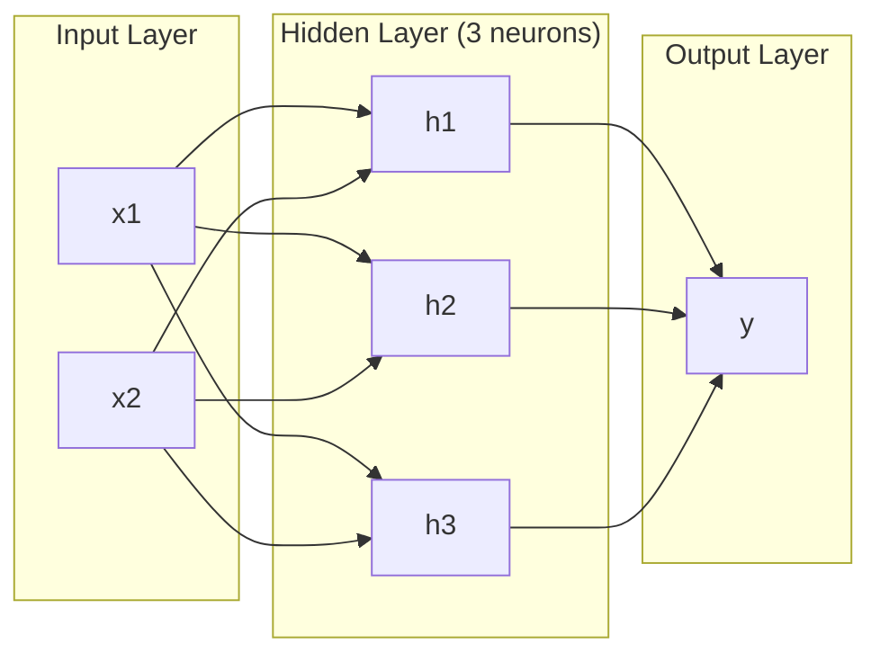
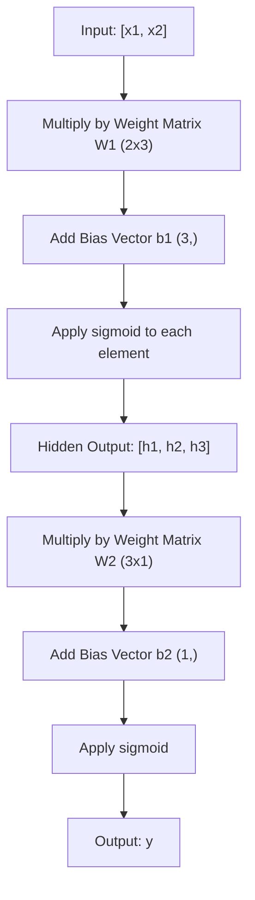
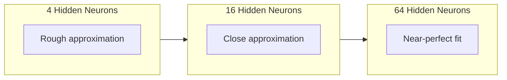

# 多层网络与前向传播

> 一个神经元能画一条直线。将它们堆叠起来，就能画出任何东西。

**Type:** Build
**Languages:** Python
**Prerequisites:** 阶段 01（数学基础）、课程 03.01（感知机）
**Time:** ~90 分钟

## 学习目标

- 从零构建多层网络，让 Layer 和 Network 类完成一次完整的前向传播
- 追踪网络各层的矩阵维度，识别形状不匹配的问题
- 解释堆叠非线性激活函数如何让网络学会弯曲的决策边界
- 使用 2-2-1 架构和手动调节的 sigmoid 权重解决 XOR（异或）问题

## 要解决的问题

单个神经元只能画直线，仅此而已：在数据中画出一条直线。AI 中每个实际问题，无论是图像识别、语言理解还是下围棋，都需要曲线。将神经元堆叠成多层，就能得到曲线。

1969 年，Minsky 和 Papert 证明了这个限制是致命的：单层网络无法学会 XOR。不是“很难学会”，而是在数学上不可能。XOR 真值表将 [0,1] 和 [1,0] 归到一侧，将 [0,0] 和 [1,1] 归到另一侧，没有一条直线能将它们分开。

这使神经网络研究的资金支持中断了十多年。事后看来，解决方法很明显：不要只用一层。将神经元堆叠成多层，让第一层从输入空间中划分出新的特征，再让第二层组合这些特征，做出任何单条直线都无法完成的决策。

这样堆叠起来的结构就是多层网络（multi-layer network），它是如今每个投入生产使用的深度学习模型的基础。前向传播（forward pass）是数据从输入经过隐藏层流向输出的过程。要让其他部分运转起来，首先就得把它实现好。

## 核心概念

### 层：输入层、隐藏层与输出层

多层网络有三种类型的层：

**输入层（input layer）**：严格说来，它不算真正的层，而是存放原始数据的地方。两个特征对应两个输入节点，这里不进行计算。

**隐藏层（hidden layers）**：实际进行计算的地方。每个神经元接收上一层的所有输出，施加权重和偏置，再将结果送入激活函数。之所以称为“隐藏”，是因为在训练数据中无法直接看到这些值。

**输出层（output layer）**：给出最终答案。二分类使用一个带 sigmoid 的神经元；多分类则为每个类别设置一个神经元。



这是一个 2-3-1 网络：两个输入、三个隐藏神经元、一个输出。每条连接都有一个权重，每个神经元（输入节点除外）都有一个偏置。

每一层都会产生一个数值向量，称为隐藏状态（hidden state）。对于文本，隐藏状态会增加维数，将一个词编码为 768 个数值，以捕捉语义。对于图像，隐藏状态会降低维数，将 millions（数百万）个像素压缩成便于处理的表示。隐藏状态就是学习发生的地方。

### 神经元与激活函数

每个神经元做三件事：

1. 将每个输入乘以对应的权重
2. 将所有乘积相加，再加上偏置
3. 将这个和送入激活函数

目前使用的激活函数是 sigmoid：

```text
sigmoid(z) = 1 / (1 + e^(-z))
```

sigmoid 将任意数值压缩到 (0, 1) 范围内。较大的正输入让输出趋近于 1，较大的负输入让输出趋近于 0，零则映射为 0.5。正是这条光滑曲线让学习成为可能：与感知机的硬阶跃不同，sigmoid 处处都有梯度。

### 前向传播：数据如何流动

前向传播将输入数据逐层送过网络，直到到达输出。前向传播期间不发生学习，它只是计算：相乘、相加、激活，然后重复。



每一层都依次执行三项操作：

```text
z = W * input + b       (linear transformation)
a = sigmoid(z)           (activation)
```

一层的输出成为下一层的输入。这就是完整的前向传播。

### 矩阵维度

追踪维度是深度学习中最重要的调试技能。来看这个 2-3-1 网络：

| 步骤 | 运算 | 维度 | 结果形状 |
|------|-----------|------------|-------------|
| 输入 | x | -- | (2,) |
| 隐藏层线性运算 | W1 * x + b1 | W1: (3, 2), b1: (3,) | (3,) |
| 隐藏层激活 | sigmoid(z1) | -- | (3,) |
| 输出层线性运算 | W2 * h + b2 | W2: (1, 3), b2: (1,) | (1,) |
| 输出层激活 | sigmoid(z2) | -- | (1,) |

规则是：第 k 层的权重矩阵 W 的形状为 (neurons_in_layer_k, neurons_in_layer_k_minus_1)。行对应当前层，列对应上一层。如果形状对不上，就有 bug。

### 通用逼近定理

1989 年，George Cybenko 证明了一个了不起的结论：只要神经元足够多，只有一个隐藏层的神经网络就能以任意指定的精度逼近任意连续函数。这就是通用逼近定理（universal approximation theorem）。

这并不意味着一个隐藏层始终是最佳选择，而是说这种架构在理论上具备相应的表达能力。在实践中，更深的网络（层数更多、每层神经元更少）能用远少于浅而宽的网络的总参数量，学会同样的函数。这就是深度学习奏效的原因。

直观地说，隐藏层中的每个神经元都会学到一个“隆起”或特征。在合适的位置放上足够多的隆起，就能逼近任意光滑曲线。神经元越多，隆起越多，逼近也就越好。



### 可组合性

神经网络具有可组合性（composability）。你可以堆叠它们、将它们依次连接，也可以并行运行。Whisper 模型使用一个编码器（encoder）网络处理音频，再用一个单独的解码器（decoder）网络生成文本。现代大语言模型（LLM）采用纯解码器架构，BERT 采用纯编码器架构，T5 则采用编码器—解码器架构。架构选择决定了模型能做什么。

```figure
mlp-forward
```

## 动手实现

纯 Python，不用 numpy。每项矩阵运算都从零实现。

### 步骤 1：sigmoid 激活函数

```python
import math

def sigmoid(x):
    x = max(-500.0, min(500.0, x))
    return 1.0 / (1.0 + math.exp(-x))
```

将输入限制在 [-500, 500] 内可以防止溢出。`math.exp(500)` 很大，但仍是有限值；`math.exp(1000)` 则是无穷大。

### 步骤 2：Layer 类

矩阵乘法是整个深度学习中最重要的运算。每一层、每个注意力头、每次前向传播，底层都是矩阵乘法。线性层接收一个输入向量，将它乘以权重矩阵，再加上偏置向量：y = Wx + b。仅这一条公式就占据了神经网络中 90% 的计算量。

每层保存一个权重矩阵和一个偏置向量。它的 forward 方法接收输入向量，返回激活后的输出。

```python
class Layer:
    def __init__(self, n_inputs, n_neurons, weights=None, biases=None):
        if weights is not None:
            self.weights = weights
        else:
            import random
            self.weights = [
                [random.uniform(-1, 1) for _ in range(n_inputs)]
                for _ in range(n_neurons)
            ]
        if biases is not None:
            self.biases = biases
        else:
            self.biases = [0.0] * n_neurons

    def forward(self, inputs):
        self.last_input = inputs
        self.last_output = []
        for neuron_idx in range(len(self.weights)):
            z = sum(
                w * x for w, x in zip(self.weights[neuron_idx], inputs)
            )
            z += self.biases[neuron_idx]
            self.last_output.append(sigmoid(z))
        return self.last_output
```

权重矩阵的形状为 (n_neurons, n_inputs)。每一行都是某个神经元对应所有输入的权重。forward 方法遍历神经元，计算加权和并加上偏置，应用 sigmoid，再收集结果。

### 步骤 3：Network 类

网络就是一个由层组成的列表。前向传播将它们依次连接：第 k 层的输出送入第 k+1 层。

```python
class Network:
    def __init__(self, layers):
        self.layers = layers

    def forward(self, inputs):
        current = inputs
        for layer in self.layers:
            current = layer.forward(current)
        return current
```

这就是完整的前向传播，只有四行逻辑。数据进入网络，流经每一层，再从另一端输出。

### 步骤 4：用手动调节的权重解决 XOR

在课程 01 中，我们通过组合 OR、NAND 和 AND 感知机解决了 XOR。现在，用 Layer 和 Network 类完成同样的事情。2-2-1 架构包含两个输入、两个隐藏神经元和一个输出。

```python
hidden = Layer(
    n_inputs=2,
    n_neurons=2,
    weights=[[20.0, 20.0], [-20.0, -20.0]],
    biases=[-10.0, 30.0],
)

output = Layer(
    n_inputs=2,
    n_neurons=1,
    weights=[[20.0, 20.0]],
    biases=[-30.0],
)

xor_net = Network([hidden, output])

xor_data = [
    ([0, 0], 0),
    ([0, 1], 1),
    ([1, 0], 1),
    ([1, 1], 0),
]

for inputs, expected in xor_data:
    result = xor_net.forward(inputs)
    predicted = 1 if result[0] >= 0.5 else 0
    print(f"  {inputs} -> {result[0]:.6f} (rounded: {predicted}, expected: {expected})")
```

较大的权重（20、-20）让 sigmoid 的表现接近阶跃函数。第一个隐藏神经元近似实现 OR，第二个近似实现 NAND。输出神经元通过 AND 将两者组合起来，结果就是 XOR。

### 步骤 5：圆形区域分类

来看一个更难的问题：判断 2D 数据点位于以原点为圆心、半径为 0.5 的圆内还是圆外。这需要弯曲的决策边界，单个感知机无法做到。

```python
import random
import math

random.seed(42)

data = []
for _ in range(200):
    x = random.uniform(-1, 1)
    y = random.uniform(-1, 1)
    label = 1 if (x * x + y * y) < 0.25 else 0
    data.append(([x, y], label))

circle_net = Network([
    Layer(n_inputs=2, n_neurons=8),
    Layer(n_inputs=8, n_neurons=1),
])
```

使用随机权重时，网络的分类效果不会很好，但前向传播依然可以运行。关键就在这里：前向传播只是计算。学习正确权重靠的是反向传播，我们将在课程 03 中介绍。

```python
correct = 0
for inputs, expected in data:
    result = circle_net.forward(inputs)
    predicted = 1 if result[0] >= 0.5 else 0
    if predicted == expected:
        correct += 1

print(f"Accuracy with random weights: {correct}/{len(data)} ({100*correct/len(data):.1f}%)")
```

随机权重的准确率很差，往往还不如直接猜多数类。训练之后（课程 03），这个同样包含 8 个隐藏神经元的架构就会画出一条曲线边界，将圆内和圆外分开。

## 实际使用

PyTorch 只用四行就能完成上面的所有工作：

```python
import torch
import torch.nn as nn

model = nn.Sequential(
    nn.Linear(2, 8),
    nn.Sigmoid(),
    nn.Linear(8, 1),
    nn.Sigmoid(),
)

x = torch.tensor([[0.0, 0.0], [0.0, 1.0], [1.0, 0.0], [1.0, 1.0]])
output = model(x)
print(output)
```

`nn.Linear(2, 8)` 对应你写的 Layer 类：权重矩阵形状为 (8, 2)，偏置向量形状为 (8,)；`nn.Sigmoid()` 对应逐元素应用的 sigmoid 函数；`nn.Sequential` 对应你的 Network 类，按顺序连接各层。

区别在于速度和规模。PyTorch 能在 GPU 上运行，处理包含 millions（数百万）个样本的批次，并自动计算反向传播所需的梯度。但前向传播的逻辑与你刚才从零实现的内容完全相同。

## 交付成果

本课产出一份用于设计网络架构的可复用提示词（prompt）：

- `outputs/prompt-network-architect.md`

针对具体问题，需要决定层数、每层神经元数量以及激活函数时，就可以使用它。

## 练习

1. 构建一个 2-4-2-1 网络（两个隐藏层），用随机权重对 XOR 数据进行前向传播。打印中间隐藏层的输出，观察表示在每一层如何变换。

2. 将圆形区域分类器的隐藏层大小从 8 改为 2，再改为 32。每次都使用随机权重进行前向传播。隐藏神经元的数量会改变输出的范围或分布吗？为什么？

3. 为 Network 类实现一个 `count_parameters` 方法，返回可训练权重与偏置的总数。在 784-256-128-10 网络（经典 MNIST 架构）上测试它。它有多少个参数？

4. 为一个 3-4-4-2 网络实现前向传播。输入 RGB 颜色值（归一化到 0-1），观察两个输出。这是一个具有两个类别的简单颜色分类器的架构。

5. 将 sigmoid 替换为“leaky step”（带泄漏的阶跃）函数：z < 0 时返回 0.01 * z，否则返回 1.0。使用第 4 步中相同的手动调节权重，对 XOR 执行前向传播。它还能工作吗？为什么相比硬截断，更倾向于使用光滑的 sigmoid？

## 关键术语

| 术语 | 通常的说法 | 实际含义 |
|------|----------------|----------------------|
| 前向传播 | “运行模型” | 将输入送过每一层：乘以权重、加上偏置、应用激活函数，从而产生输出 |
| 隐藏层 | “中间部分” | 输入与输出之间的任意层，其取值无法在数据中直接观察到 |
| 多层网络 | “深度神经网络” | 将神经元组成的层按顺序堆叠起来，每层的输出作为下一层的输入 |
| 激活函数 | “非线性部分” | 在线性变换之后应用的函数，使决策边界出现弯曲 |
| Sigmoid | “S 形曲线” | sigma(z) = 1/(1+e^(-z))，将任意实数压缩到 (0,1)，处处光滑且可微 |
| 权重矩阵 | “参数” | 形状为 (current_layer_neurons, previous_layer_neurons) 的矩阵 W，包含可学习的连接强度 |
| 偏置向量 | “偏移量” | 在矩阵乘法之后相加的向量，使神经元即使在所有输入均为零时也能激活 |
| 通用逼近 | “神经网络什么都能学” | 一个隐藏层只要有足够多的神经元，就能逼近任意连续函数，但“足够多”可能意味着 billions（数十亿） |
| 线性变换 | “矩阵相乘这一步” | z = W * x + b，即激活之前的计算，将输入映射到新空间 |
| 决策边界 | “分类器改变判断的位置” | 输入空间中，网络输出跨过分类阈值处的曲面 |

## 延伸阅读

- Michael Nielsen，《Neural Networks and Deep Learning》，第 1-2 章 (http://neuralnetworksanddeeplearning.com/) -- 对前向传播和网络结构最清晰的免费讲解，并配有交互式可视化
- Cybenko，《Approximation by Superpositions of a Sigmoidal Function》（1989）-- 通用逼近定理的原始论文，意外地好读
- 3Blue1Brown，《But what is a neural network?》 (https://www.youtube.com/watch?v=aircAruvnKk) -- 用 20 分钟直观讲解层、权重和前向传播，帮助建立正确的理解
- Goodfellow、Bengio、Courville，《Deep Learning》，第 6 章 (https://www.deeplearningbook.org/) -- 多层网络的标准参考书，可免费在线阅读
