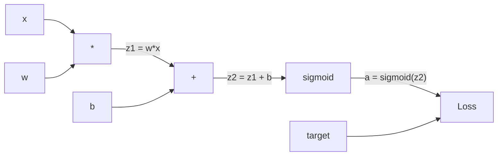
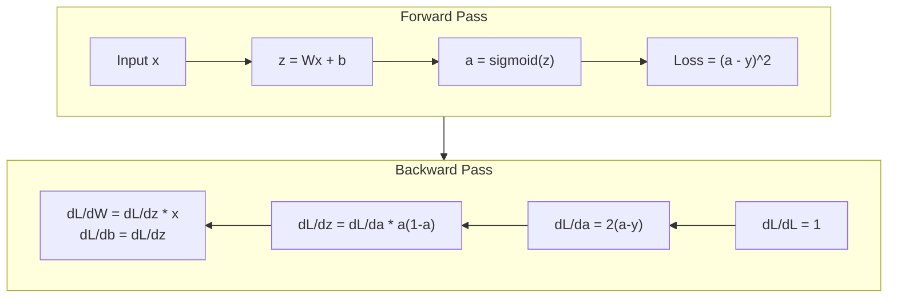
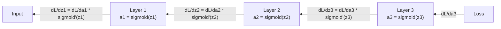

# 从零实现反向传播

> 反向传播（backpropagation）是让学习成为可能的算法。没有它，神经网络就只是昂贵的随机数生成器。

**Type:** Build
**Languages:** Python
**Prerequisites:** 课程 03.02（多层网络）
**Time:** ~120 分钟

## 学习目标

- 实现一个基于 Value 的自动微分引擎（autograd engine），构建计算图并通过拓扑排序计算梯度
- 使用链式法则推导加法、乘法和 sigmoid 的反向传播
- 仅使用自己从零实现的反向传播引擎，训练多层网络完成 XOR（异或）和圆形区域分类
- 识别深层 sigmoid 网络中的梯度消失问题，并解释梯度为何呈指数级缩小

## 要解决的问题

你的网络只有一个隐藏层，输入数为 768，输出数为 3072。这意味着有 2,359,296 个权重。现在它作出了错误预测，究竟是哪些权重造成了误差？逐一测试每个权重，需要执行 2.3 million（百万）次前向传播。反向传播只需一次反向计算，就能求出全部 2.3 million（百万）个梯度。这不只是优化，而是能否训练的区别。

最朴素的方法是：选一个权重，将它微调一点，再运行一次前向传播，观察损失是上升还是下降。这样就得到了该权重的梯度。接着对网络中的每个权重都这样做，再乘上数千个训练步骤和 millions（数百万）个数据点。要训练出有用的模型，恐怕得耗上地质年代般漫长的时间。

反向传播解决了这个问题。一次前向传播、一次反向传播，就能计算出所有梯度。诀窍就是把微积分中的链式法则系统地应用于计算图。这项算法让深度学习变得实用；没有它，我们还会困在玩具问题上。

## 核心概念

### 将链式法则应用于网络

你已在阶段 01 的课程 05 中见过链式法则。简单回顾一下：若 y = f(g(x))，则 dy/dx = f'(g(x)) * g'(x)。沿着这条链将导数相乘即可。

在神经网络中，这条“链”就是从输入到损失的一系列运算。每一层施加权重、加上偏置，再经过激活函数。损失函数将最终输出与目标值比较。反向传播沿着这条链逆向追踪，计算各项运算对误差的贡献。

### 计算图

每次前向传播都会构建一张计算图（computational graph）。每个节点代表一种运算，例如乘法、加法或 sigmoid。每条边向前传递数值，向后传递梯度。



前向传播：数值从左向右流动。x 和 w 产生 z1 = w*x，加上 b 得到 z2，sigmoid 给出激活值 a，再通过损失函数将 a 与目标值 y 比较。

反向传播：梯度从右向左流动。从 dL/da 开始，它表示损失如何随激活值变化。乘以 da/dz2（sigmoid 的导数），便得到 dL/dz2。再分成 dL/db（由于 z2 = z1 + b，它等于 dL/dz2）和 dL/dz1。随后得到 dL/dw = dL/dz1 * x 和 dL/dx = dL/dz1 * w。

反向传播时，图中每个节点都只需做一件事：接收从上游传来的梯度，将它乘以自身的局部导数，再向下传递。

### 前向传播与反向传播



前向传播会保存每一个中间值：z、a，以及各层的输入。反向传播需要这些已保存的值来计算梯度。这正是反向传播中内存与计算的核心权衡：用内存（保存激活值）换取速度（一次传播，而不是 millions，即数百万次）。

### 梯度如何流经网络

对于一个 3 层网络，梯度会沿着每一层逐级传递：



在每一层，梯度都会乘以 sigmoid 的导数。sigmoid 的导数是 a * (1 - a)，其最大值为 0.25（当 a = 0.5 时取得）。经过三层，梯度最多乘以 0.25^3 = 0.0156。经过十层则是：0.25^10 = 0.000001。

### 梯度消失

这就是梯度消失（vanishing gradient）问题。sigmoid 将输出压缩到 0 与 1 之间，其导数始终小于 0.25。堆叠足够多的 sigmoid 层后，梯度就会缩小到几乎没有。靠前的层接收到的梯度接近零，因此几乎无法学习。

```text
sigmoid(z):     Output range [0, 1]
sigmoid'(z):    Max value 0.25 (at z = 0)

After 5 layers:   gradient * 0.25^5 = 0.001x original
After 10 layers:  gradient * 0.25^10 = 0.000001x original
```

这就是深层 sigmoid 网络几乎无法训练的原因。解决办法是 ReLU 及其变体，这也是课程 04 的主题。现在先理解一点：反向传播本身运作得很好，问题在于它要穿过怎样的运算。

### 推导 2 层网络的梯度

来看具体的数学推导：网络的输入为 x，隐藏层和输出层都使用 sigmoid，损失采用均方误差（MSE）。

前向传播：
```text
z1 = W1 * x + b1
a1 = sigmoid(z1)
z2 = W2 * a1 + b2
a2 = sigmoid(z2)
L = (a2 - y)^2
```

反向传播（逐步应用链式法则）：
```text
dL/da2 = 2(a2 - y)
da2/dz2 = a2 * (1 - a2)
dL/dz2 = dL/da2 * da2/dz2 = 2(a2 - y) * a2 * (1 - a2)

dL/dW2 = dL/dz2 * a1
dL/db2 = dL/dz2

dL/da1 = dL/dz2 * W2
da1/dz1 = a1 * (1 - a1)
dL/dz1 = dL/da1 * da1/dz1

dL/dW1 = dL/dz1 * x
dL/db1 = dL/dz1
```

每个梯度都是从损失逆向追踪得到的局部导数之积。反向传播就是这么回事。

```figure
backprop-vanishing
```

## 动手实现

### 步骤 1：Value 节点

计算中的每个数都变成一个 Value。它保存自己的数据、梯度，以及自身是如何产生的，从而知道怎样反向计算梯度。

```python
class Value:
    def __init__(self, data, children=(), op=''):
        self.data = data
        self.grad = 0.0
        self._backward = lambda: None
        self._children = set(children)
        self._op = op

    def __repr__(self):
        return f"Value(data={self.data:.4f}, grad={self.grad:.4f})"
```

此时还没有梯度（0.0），也没有反向函数（只有空操作）。`_children` 记录了哪些 Value 产生当前这个值，方便我们随后对图进行拓扑排序（topological sort）。

### 步骤 2：为运算添加反向函数

每项运算都会创建一个新的 Value，并定义梯度如何反向流经它。

```python
def __add__(self, other):
    other = other if isinstance(other, Value) else Value(other)
    out = Value(self.data + other.data, (self, other), '+')

    def _backward():
        self.grad += out.grad
        other.grad += out.grad

    out._backward = _backward
    return out

def __mul__(self, other):
    other = other if isinstance(other, Value) else Value(other)
    out = Value(self.data * other.data, (self, other), '*')

    def _backward():
        self.grad += other.data * out.grad
        other.grad += self.data * out.grad

    out._backward = _backward
    return out
```

对于加法：d(a+b)/da = 1，d(a+b)/db = 1。因此，两个输入都直接得到输出的梯度。

对于乘法：d(a\*b)/da = b，d(a\*b)/db = a。每个输入得到的都是另一个输入的值乘以输出梯度。

`+=` 至关重要。一个 Value 可能会用于多项运算，它的梯度是所有路径贡献的梯度之和。

### 步骤 3：sigmoid 与损失

```python
import math

def sigmoid(self):
    x = self.data
    x = max(-500, min(500, x))
    s = 1.0 / (1.0 + math.exp(-x))
    out = Value(s, (self,), 'sigmoid')

    def _backward():
        self.grad += (s * (1 - s)) * out.grad

    out._backward = _backward
    return out
```

sigmoid 的导数为 sigmoid(x) * (1 - sigmoid(x))。在前向传播时，我们已经算出 sigmoid(x) = s，直接复用即可，无需额外计算。

```python
def mse_loss(predicted, target):
    diff = predicted + Value(-target)
    return diff * diff
```

单个输出的 MSE 为 (predicted - target)^2。我们用加上一个取负后的 Value 来表示减法。

### 步骤 4：反向传播

拓扑排序保证我们按正确顺序处理节点：在通过某个节点继续传播之前，该节点的梯度已经累积完整。

```python
def backward(self):
    topo = []
    visited = set()

    def build_topo(v):
        if v not in visited:
            visited.add(v)
            for child in v._children:
                build_topo(child)
            topo.append(v)

    build_topo(self)
    self.grad = 1.0
    for v in reversed(topo):
        v._backward()
```

从损失开始（gradient = 1.0，因为 dL/dL = 1）。沿排序后的图逆向遍历，每个节点的 `_backward` 都将梯度传给它的子节点。

### 步骤 5：层与网络

```python
import random

class Neuron:
    def __init__(self, n_inputs):
        scale = (2.0 / n_inputs) ** 0.5
        self.weights = [Value(random.uniform(-scale, scale)) for _ in range(n_inputs)]
        self.bias = Value(0.0)

    def __call__(self, x):
        act = sum((wi * xi for wi, xi in zip(self.weights, x)), self.bias)
        return act.sigmoid()

    def parameters(self):
        return self.weights + [self.bias]


class Layer:
    def __init__(self, n_inputs, n_outputs):
        self.neurons = [Neuron(n_inputs) for _ in range(n_outputs)]

    def __call__(self, x):
        out = [n(x) for n in self.neurons]
        return out[0] if len(out) == 1 else out

    def parameters(self):
        params = []
        for n in self.neurons:
            params.extend(n.parameters())
        return params


class Network:
    def __init__(self, sizes):
        self.layers = []
        for i in range(len(sizes) - 1):
            self.layers.append(Layer(sizes[i], sizes[i + 1]))

    def __call__(self, x):
        for layer in self.layers:
            x = layer(x)
            if not isinstance(x, list):
                x = [x]
        return x[0] if len(x) == 1 else x

    def parameters(self):
        params = []
        for layer in self.layers:
            params.extend(layer.parameters())
        return params

    def zero_grad(self):
        for p in self.parameters():
            p.grad = 0.0
```

Neuron 接收输入，计算加权和加上偏置，再应用 sigmoid。权重初始化按 sqrt(2/n_inputs) 缩放，以防止更深网络中的 sigmoid 饱和。Layer 是一个由 Neuron 组成的列表，Network 是一个由 Layer 组成的列表。`parameters()` 方法收集所有可学习的 Value，以便我们更新它们。

### 步骤 6：训练 XOR

```python
random.seed(42)
net = Network([2, 4, 1])

xor_data = [
    ([0.0, 0.0], 0.0),
    ([0.0, 1.0], 1.0),
    ([1.0, 0.0], 1.0),
    ([1.0, 1.0], 0.0),
]

learning_rate = 1.0

for epoch in range(1000):
    total_loss = Value(0.0)
    for inputs, target in xor_data:
        x = [Value(i) for i in inputs]
        pred = net(x)
        loss = mse_loss(pred, target)
        total_loss = total_loss + loss

    net.zero_grad()
    total_loss.backward()

    for p in net.parameters():
        p.data -= learning_rate * p.grad

    if epoch % 100 == 0:
        print(f"Epoch {epoch:4d} | Loss: {total_loss.data:.6f}")

print("\nXOR Results:")
for inputs, target in xor_data:
    x = [Value(i) for i in inputs]
    pred = net(x)
    print(f"  {inputs} -> {pred.data:.4f} (expected {target})")
```

观察损失如何下降。从随机预测到正确的 XOR 输出，整个过程完全由反向传播计算梯度、推动权重向正确方向微调来驱动。

### 步骤 7：圆形区域分类

在课程 02 中，你为圆形区域分类手动调节了权重。现在，让网络自己学习这些权重。

```python
random.seed(7)

def generate_circle_data(n=100):
    data = []
    for _ in range(n):
        x1 = random.uniform(-1.5, 1.5)
        x2 = random.uniform(-1.5, 1.5)
        label = 1.0 if x1 * x1 + x2 * x2 < 1.0 else 0.0
        data.append(([x1, x2], label))
    return data

circle_data = generate_circle_data(80)

circle_net = Network([2, 8, 1])
learning_rate = 0.5

for epoch in range(2000):
    random.shuffle(circle_data)
    total_loss_val = 0.0
    for inputs, target in circle_data:
        x = [Value(i) for i in inputs]
        pred = circle_net(x)
        loss = mse_loss(pred, target)
        circle_net.zero_grad()
        loss.backward()
        for p in circle_net.parameters():
            p.data -= learning_rate * p.grad
        total_loss_val += loss.data

    if epoch % 200 == 0:
        correct = 0
        for inputs, target in circle_data:
            x = [Value(i) for i in inputs]
            pred = circle_net(x)
            predicted_class = 1.0 if pred.data > 0.5 else 0.0
            if predicted_class == target:
                correct += 1
        accuracy = correct / len(circle_data) * 100
        print(f"Epoch {epoch:4d} | Loss: {total_loss_val:.4f} | Accuracy: {accuracy:.1f}%")
```

这里使用在线随机梯度下降（online SGD）：每处理一个样本就更新权重，而不是先累积整个批次。这能更快地打破对称性，并避免 sigmoid 在完整损失曲面上饱和。每个训练轮次打乱数据，可以防止网络记住数据顺序。

无需手动调节，网络会自行发现圆形决策边界。这就是反向传播的力量：你定义架构、损失函数和数据，算法来确定权重。

## 实际使用

PyTorch 用几行代码就能完成上面的所有工作。核心思想完全相同：autograd 在前向传播时构建计算图，再逆向追踪该图来计算梯度。

```python
import torch
import torch.nn as nn

model = nn.Sequential(
    nn.Linear(2, 4),
    nn.Sigmoid(),
    nn.Linear(4, 1),
    nn.Sigmoid(),
)
optimizer = torch.optim.SGD(model.parameters(), lr=1.0)
criterion = nn.MSELoss()

X = torch.tensor([[0,0],[0,1],[1,0],[1,1]], dtype=torch.float32)
y = torch.tensor([[0],[1],[1],[0]], dtype=torch.float32)

for epoch in range(1000):
    pred = model(X)
    loss = criterion(pred, y)
    optimizer.zero_grad()
    loss.backward()
    optimizer.step()

print("PyTorch XOR Results:")
with torch.no_grad():
    for i in range(4):
        pred = model(X[i])
        print(f"  {X[i].tolist()} -> {pred.item():.4f} (expected {y[i].item()})")
```

`loss.backward()` 就是你写的 `total_loss.backward()`；`optimizer.step()` 对应手动执行的 `p.data -= lr * p.grad`；`optimizer.zero_grad()` 对应你写的 `net.zero_grad()`。算法相同，这里采用的是工业级实现。PyTorch 支持 GPU 加速、混合精度、梯度检查点（gradient checkpointing）和数百种层类型。但反向传播仍然是在同一张计算图上应用同样的链式法则。

训练先执行前向传播，再执行反向传播，然后更新权重。推理（inference）只执行前向传播，不计算梯度，也不更新参数。这一区别很重要，因为生产环境执行的是推理。调用 Claude 或 GPT 这样的 API（应用程序编程接口）时，你运行的就是推理：提示词（prompt）沿网络向前流动，另一端输出 token（词元），权重不会改变。理解反向传播很重要，因为网络中的每个权重都是它塑造的。

## 交付成果

本课产出：
- `outputs/prompt-gradient-debugger.md` -- 一份可复用提示词，用于诊断任意神经网络中的梯度问题，包括梯度消失、梯度爆炸和 NaN（非数）

## 练习

1. 为 Value 类添加 `__sub__` 方法（a - b = a + (-1 * b)），再实现 `__neg__` 方法。对于 (a - b)^2 这样简单的表达式，将结果与手工计算对照，验证梯度是否正确。

2. 为 Value 添加 `relu` 方法（输出为 max(0, x)，当 x > 0 时导数为 1，否则为 0）。将隐藏层中的 sigmoid 替换为 relu，再次训练 XOR。比较收敛速度，你应该会看到训练更快，这也是课程 04 的预览。

3. 为 Value 实现支持整数幂的 `__pow__` 方法，用它将 `mse_loss` 替换为规范的 `(predicted - target) ** 2` 表达式。验证梯度与原实现一致。

4. 在训练循环中加入梯度裁剪：调用 `backward()` 后，将所有梯度裁剪到 [-1, 1]。训练一个更深的网络（4+ 层，使用 sigmoid），比较有裁剪和无裁剪时的损失曲线。这是抵御梯度爆炸的第一道防线。

5. 构建一个可视化：训练 XOR 后，打印网络中每个参数的梯度，找出哪一层的梯度最小。这展示了你在核心概念部分读到的梯度消失问题。

## 关键术语

| 术语 | 通常的说法 | 实际含义 |
|------|----------------|----------------------|
| 反向传播 | “网络在学习” | 沿计算图反向应用链式法则，为每个权重计算 dL/dw 的算法 |
| 计算图 | “网络结构” | 有向无环图，节点表示运算，边传递数值（前向）与梯度（反向） |
| 链式法则 | “把导数相乘” | 若 y = f(g(x))，则 dy/dx = f'(g(x)) * g'(x)，这是反向传播的数学基础 |
| 梯度 | “最陡上升的方向” | 损失对某个参数的偏导数，告诉你怎样改变该参数以降低损失 |
| 梯度消失 | “深层网络学不动” | 梯度流经 sigmoid 等饱和激活函数所在的层时，呈指数级缩小 |
| 前向传播 | “运行网络” | 从输入开始，依次应用各层运算并保存中间值，计算出输出 |
| 反向传播 | “计算梯度” | 逆向遍历计算图，使用链式法则在每个节点累积梯度 |
| 学习率 | “学得多快” | 控制权重更新步长的标量：w_new = w_old - lr * gradient |
| 拓扑排序 | “正确的顺序” | 图节点的一种排序，每个节点都位于其依赖的所有节点之后，确保梯度在传播前已经累积完整 |
| Autograd | “自动微分” | 在前向计算时构建计算图并自动计算梯度的系统，也就是 PyTorch 引擎所做的事 |

## 延伸阅读

- Rumelhart、Hinton 与 Williams，《Learning representations by back-propagating errors》（1986）-- 使反向传播走向主流，并让多层网络训练成为可能的论文
- 3Blue1Brown，《Neural Networks》系列 (https://www.youtube.com/playlist?list=PLZHQObOWTQDNU6R1_67000Dx_ZCJB-3pi) -- 对反向传播与网络梯度流最好的可视化讲解
