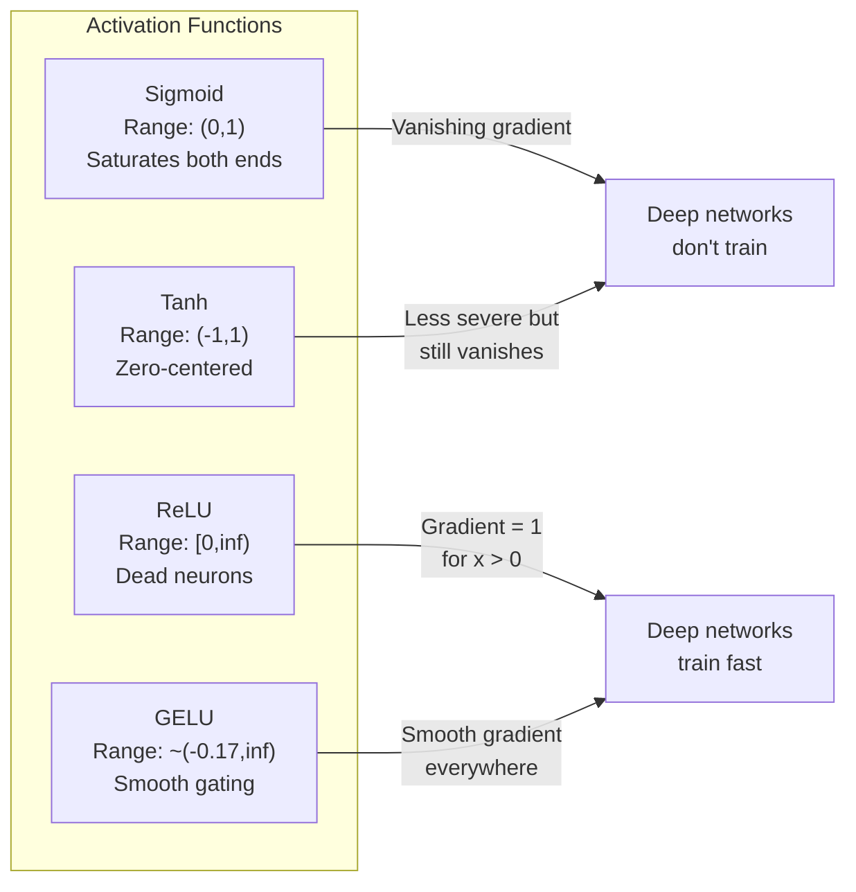
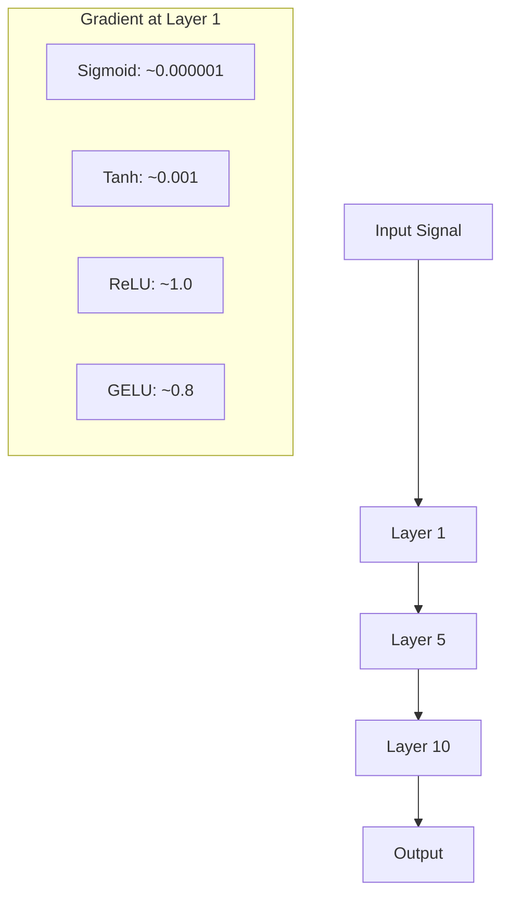
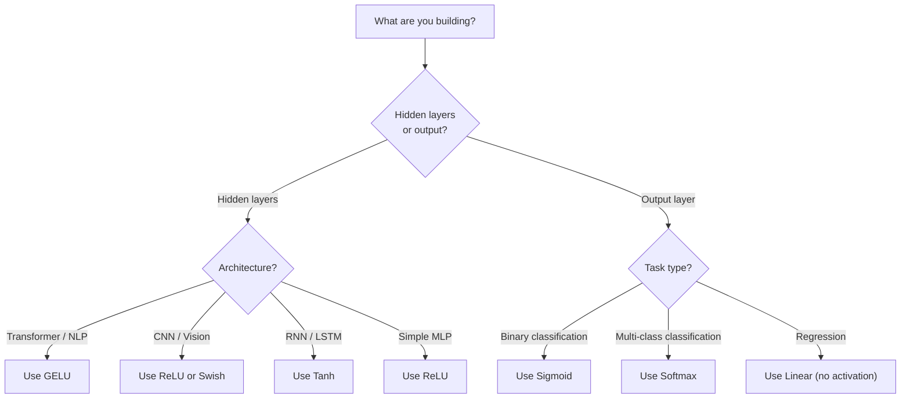

# 激活函数

> 没有非线性，100 层网络也不过是一次花哨的矩阵乘法。激活函数就像门，让神经网络能够用曲线来思考。

**Type:** Build
**Languages:** Python
**Prerequisites:** 课程 03.03（反向传播）
**Time:** ~75 分钟

## 学习目标

- 从零实现 sigmoid、tanh、ReLU、Leaky ReLU、GELU、Swish 和 softmax 及其导数
- 测量信号通过 10+ 层、使用不同激活函数时的激活值幅度，诊断梯度消失问题
- 检测 ReLU 网络中的失活神经元，并解释 GELU 为何能够避免这种失效模式
- 为给定架构（Transformer、卷积神经网络 CNN、循环神经网络 RNN、输出层）选择正确的激活函数

## 要解决的问题

将两个线性变换叠加：y = W2(W1x + b1) + b2。展开得到 y = W2W1x + W2b1 + b2。这其实就是 y = Ax + c，即单个线性变换。不管叠加多少个线性层，结果都能化为一次矩阵乘法。你的 100 层网络与单层网络具有相同的表达能力。

这不只是理论上有趣的现象。它意味着深层线性网络确实无法学会 XOR（异或）、无法对螺旋数据集分类，也无法识别人脸。没有激活函数，深度就只是假象。

激活函数打破了线性。它们通过非线性函数改变每层的输出，让网络能够弯曲决策边界、逼近任意函数，并真正学会东西。但如果选错激活函数，梯度可能消失到零（深层网络中的 sigmoid），可能爆炸到无穷大（未经仔细初始化的无界激活函数），也可能让神经元永久失活（具有较大负偏置的 ReLU）。激活函数的选择直接决定了网络究竟能否学习。

## 核心概念

### 为什么需要非线性

矩阵乘法可以组合。先将向量乘以矩阵 A，再乘以矩阵 B，等同于乘以 AB。这意味着，堆叠十个线性层，在数学上等价于一个使用大矩阵的线性层。那些参数和深度全都浪费了。你需要某种机制来打破这条链，激活函数正是为此而来。

证明如下。线性层计算 f(x) = Wx + b。堆叠两层：

```text
Layer 1: h = W1 * x + b1
Layer 2: y = W2 * h + b2
```

代入后得到：

```text
y = W2 * (W1 * x + b1) + b2
y = (W2 * W1) * x + (W2 * b1 + b2)
y = A * x + c
```

结果只有一层。现在，在两层之间插入非线性激活函数 g()：

```text
h = g(W1 * x + b1)
y = W2 * h + b2
```

这时，代入就无法再这样化简了。W2 * g(W1 * x + b1) + b2 不能化为单个线性变换，网络因而能够表示非线性函数。每多一层带激活函数的层，都会增加表达能力。

### Sigmoid

神经网络最早使用的激活函数。

```text
sigmoid(x) = 1 / (1 + e^(-x))
```

输出范围为 (0, 1)。它光滑、可微，能将任意实数映射为类似概率的值。

其导数为：

```text
sigmoid'(x) = sigmoid(x) * (1 - sigmoid(x))
```

这个导数的最大值为 0.25，在 x = 0 处取得。反向传播时，梯度逐层相乘。十层 sigmoid 意味着梯度要连续十次乘以一个至多为 0.25 的数：

```text
0.25^10 = 0.000000953674
```

结果还不到原始信号的百万分之一。这就是梯度消失（vanishing gradient）问题。靠前各层的梯度变得极小，权重几乎不更新。网络看起来仍在学习，靠后各层的损失在下降，但前面的层已经冻结。深层 sigmoid 网络根本训练不起来。

另一个问题是：sigmoid 的输出始终为正（0 到 1），这意味着权重梯度的符号始终相同，导致梯度下降沿之字形前进。

### Tanh

以零为中心的 sigmoid 版本。

```text
tanh(x) = (e^x - e^(-x)) / (e^x + e^(-x))
```

输出范围为 (-1, 1)。它以零为中心，消除了之字形前进的问题。

其导数为：

```text
tanh'(x) = 1 - tanh(x)^2
```

最大导数为 1.0，在 x = 0 处取得，是 sigmoid 的四倍。但梯度消失问题依然存在：当输入是较大的正数或负数时，导数趋近于零。十层网络仍然会大幅压缩梯度，只是程度稍轻。

### ReLU：突破

ReLU 是整流线性单元（Rectified Linear Unit）。Nair 和 Hinton 在 2010 年将其推广到深度学习中（函数本身可追溯到 Fukushima 在 1969 年的工作），它改变了一切。

```text
relu(x) = max(0, x)
```

输出范围为 [0, infinity)。它的导数非常简单：

```text
relu'(x) = 1  if x > 0
            0  if x <= 0
```

对于正输入，不会发生梯度消失。梯度恰好为 1，可以直接传过去。这就是深层网络能够训练的原因：ReLU 在各层之间保持梯度幅度。

但它有一种失效模式：神经元失活问题。如果某个神经元的加权输入始终为负，例如偏置是较大的负值，或权重初始化不走运，那么它的输出始终为零，梯度也始终为零，再也不会更新。它永久失活了。在实践中，ReLU 网络中有 10-40% 的神经元可能在训练期间失活。

### Leaky ReLU

解决神经元失活最简单的办法。

```text
leaky_relu(x) = x        if x > 0
                alpha * x if x <= 0
```

其中 alpha 是一个小常数，通常为 0.01。负数一侧具有一个较小的斜率，而不是零，因此失活的神经元仍能收到梯度信号，有机会恢复。

### GELU：现代默认选择

GELU 是高斯误差线性单元（Gaussian Error Linear Unit），由 Hendrycks 和 Gimpel 于 2016 年提出。它是 BERT、GPT 和大多数现代 Transformer 的默认激活函数。

```text
gelu(x) = x * Phi(x)
```

其中 Phi(x) 是标准正态分布的累积分布函数（CDF）。实践中使用的近似式为：

```text
gelu(x) ~= 0.5 * x * (1 + tanh(sqrt(2/pi) * (x + 0.044715 * x^3)))
```

GELU 处处光滑，允许取较小的负值（不像 ReLU 会直接截断为零），并且可以从概率角度解释：它根据每个输入在高斯分布下为正的可能性，对该输入加权。这种平滑门控在 Transformer 架构中优于 ReLU，因为它提供了更好的梯度流，并完全避免了神经元失活问题。

### Swish / SiLU

Ramachandran 等人于 2017 年通过自动搜索发现的自门控（self-gated）激活函数。

```text
swish(x) = x * sigmoid(x)
```

Swish 的形式定义为 x * sigmoid(x)。Google 通过在激活函数空间中自动搜索发现了它，相当于让神经网络设计神经网络的组成部分。

和 GELU 一样，它光滑、非单调，并允许较小的负值。两者的区别很细微：Swish 用 sigmoid 做门控，GELU 则使用高斯分布的 CDF。在实践中，两者性能几乎相同。Swish 用于 EfficientNet 和一些视觉模型，而 GELU 在语言模型中占主导地位。

### Softmax：输出激活函数

它不用于隐藏层。softmax 将原始分数（logits）组成的向量转换为概率分布。

```text
softmax(x_i) = e^(x_i) / sum(e^(x_j) for all j)
```

每个输出都在 0 和 1 之间，所有输出之和为 1，因此它成为多分类任务标准的最终激活函数。最大的 logit 会得到最高概率，但与 argmax 不同，softmax 可微，并保留相对置信程度的信息。

### 形状对比



### 梯度流对比



### 何时使用哪种激活函数



```figure
softmax-temperature
```

## 动手实现

### 步骤 1：实现所有激活函数及其导数

每个函数接收一个浮点数并返回一个浮点数。每个导数函数接收相同的输入，返回梯度。

```python
import math

def sigmoid(x):
    x = max(-500, min(500, x))
    return 1.0 / (1.0 + math.exp(-x))

def sigmoid_derivative(x):
    s = sigmoid(x)
    return s * (1 - s)

def tanh_act(x):
    return math.tanh(x)

def tanh_derivative(x):
    t = math.tanh(x)
    return 1 - t * t

def relu(x):
    return max(0.0, x)

def relu_derivative(x):
    return 1.0 if x > 0 else 0.0

def leaky_relu(x, alpha=0.01):
    return x if x > 0 else alpha * x

def leaky_relu_derivative(x, alpha=0.01):
    return 1.0 if x > 0 else alpha

def gelu(x):
    return 0.5 * x * (1 + math.tanh(math.sqrt(2 / math.pi) * (x + 0.044715 * x ** 3)))

def gelu_derivative(x):
    phi = 0.5 * (1 + math.erf(x / math.sqrt(2)))
    pdf = math.exp(-0.5 * x * x) / math.sqrt(2 * math.pi)
    return phi + x * pdf

def swish(x):
    return x * sigmoid(x)

def swish_derivative(x):
    s = sigmoid(x)
    return s + x * s * (1 - s)

def softmax(xs):
    max_x = max(xs)
    exps = [math.exp(x - max_x) for x in xs]
    total = sum(exps)
    return [e / total for e in exps]
```

### 步骤 2：可视化梯度在哪里消失

在 -5 到 5 之间的 100 个等距点上计算梯度。打印文本直方图，显示各个激活函数的梯度在哪里接近零。

```python
def gradient_scan(name, derivative_fn, start=-5, end=5, n=100):
    step = (end - start) / n
    near_zero = 0
    healthy = 0
    for i in range(n):
        x = start + i * step
        g = derivative_fn(x)
        if abs(g) < 0.01:
            near_zero += 1
        else:
            healthy += 1
    pct_dead = near_zero / n * 100
    print(f"{name:15s}: {healthy:3d} healthy, {near_zero:3d} near-zero ({pct_dead:.0f}% dead zone)")

gradient_scan("Sigmoid", sigmoid_derivative)
gradient_scan("Tanh", tanh_derivative)
gradient_scan("ReLU", relu_derivative)
gradient_scan("Leaky ReLU", leaky_relu_derivative)
gradient_scan("GELU", gelu_derivative)
gradient_scan("Swish", swish_derivative)
```

### 步骤 3：梯度消失实验

让信号分别使用 sigmoid 和 ReLU，通过 N 层执行前向传播，测量激活值幅度如何变化。

```python
import random

def vanishing_gradient_experiment(activation_fn, name, n_layers=10, n_inputs=5):
    random.seed(42)
    values = [random.gauss(0, 1) for _ in range(n_inputs)]

    print(f"\n{name} through {n_layers} layers:")
    for layer in range(n_layers):
        weights = [random.gauss(0, 1) for _ in range(n_inputs)]
        z = sum(w * v for w, v in zip(weights, values))
        activated = activation_fn(z)
        magnitude = abs(activated)
        bar = "#" * int(magnitude * 20)
        print(f"  Layer {layer+1:2d}: magnitude = {magnitude:.6f} {bar}")
        values = [activated] * n_inputs

vanishing_gradient_experiment(sigmoid, "Sigmoid")
vanishing_gradient_experiment(relu, "ReLU")
vanishing_gradient_experiment(gelu, "GELU")
```

### 步骤 4：失活神经元检测器

创建一个 ReLU 网络，让随机输入通过它，统计有多少个神经元从未激活。

```python
def dead_neuron_detector(n_inputs=5, hidden_size=20, n_samples=1000):
    random.seed(0)
    weights = [[random.gauss(0, 1) for _ in range(n_inputs)] for _ in range(hidden_size)]
    biases = [random.gauss(0, 1) for _ in range(hidden_size)]

    fire_counts = [0] * hidden_size

    for _ in range(n_samples):
        inputs = [random.gauss(0, 1) for _ in range(n_inputs)]
        for neuron_idx in range(hidden_size):
            z = sum(w * x for w, x in zip(weights[neuron_idx], inputs)) + biases[neuron_idx]
            if relu(z) > 0:
                fire_counts[neuron_idx] += 1

    dead = sum(1 for c in fire_counts if c == 0)
    rarely_fire = sum(1 for c in fire_counts if 0 < c < n_samples * 0.05)
    healthy = hidden_size - dead - rarely_fire

    print(f"\nDead Neuron Report ({hidden_size} neurons, {n_samples} samples):")
    print(f"  Dead (never fired):     {dead}")
    print(f"  Barely alive (<5%):     {rarely_fire}")
    print(f"  Healthy:                {healthy}")
    print(f"  Dead neuron rate:       {dead/hidden_size*100:.1f}%")

    for i, c in enumerate(fire_counts):
        status = "DEAD" if c == 0 else "WEAK" if c < n_samples * 0.05 else "OK"
        bar = "#" * (c * 40 // n_samples)
        print(f"  Neuron {i:2d}: {c:4d}/{n_samples} fires [{status:4s}] {bar}")

dead_neuron_detector()
```

### 步骤 5：训练对比：Sigmoid、ReLU 与 GELU

使用三种不同的激活函数，在圆形数据集上训练同一个两层网络（圆内的点为类别 1，圆外为类别 0），比较收敛速度。

```python
def make_circle_data(n=200, seed=42):
    random.seed(seed)
    data = []
    for _ in range(n):
        x = random.uniform(-2, 2)
        y = random.uniform(-2, 2)
        label = 1.0 if x * x + y * y < 1.5 else 0.0
        data.append(([x, y], label))
    return data


class ActivationNetwork:
    def __init__(self, activation_fn, activation_deriv, hidden_size=8, lr=0.1):
        random.seed(0)
        self.act = activation_fn
        self.act_d = activation_deriv
        self.lr = lr
        self.hidden_size = hidden_size

        self.w1 = [[random.gauss(0, 0.5) for _ in range(2)] for _ in range(hidden_size)]
        self.b1 = [0.0] * hidden_size
        self.w2 = [random.gauss(0, 0.5) for _ in range(hidden_size)]
        self.b2 = 0.0

    def forward(self, x):
        self.x = x
        self.z1 = []
        self.h = []
        for i in range(self.hidden_size):
            z = self.w1[i][0] * x[0] + self.w1[i][1] * x[1] + self.b1[i]
            self.z1.append(z)
            self.h.append(self.act(z))

        self.z2 = sum(self.w2[i] * self.h[i] for i in range(self.hidden_size)) + self.b2
        self.out = sigmoid(self.z2)
        return self.out

    def backward(self, target):
        error = self.out - target
        d_out = error * self.out * (1 - self.out)

        for i in range(self.hidden_size):
            d_h = d_out * self.w2[i] * self.act_d(self.z1[i])
            self.w2[i] -= self.lr * d_out * self.h[i]
            for j in range(2):
                self.w1[i][j] -= self.lr * d_h * self.x[j]
            self.b1[i] -= self.lr * d_h
        self.b2 -= self.lr * d_out

    def train(self, data, epochs=200):
        losses = []
        for epoch in range(epochs):
            total_loss = 0
            correct = 0
            for x, y in data:
                pred = self.forward(x)
                self.backward(y)
                total_loss += (pred - y) ** 2
                if (pred >= 0.5) == (y >= 0.5):
                    correct += 1
            avg_loss = total_loss / len(data)
            accuracy = correct / len(data) * 100
            losses.append(avg_loss)
            if epoch % 50 == 0 or epoch == epochs - 1:
                print(f"    Epoch {epoch:3d}: loss={avg_loss:.4f}, accuracy={accuracy:.1f}%")
        return losses


data = make_circle_data()

configs = [
    ("Sigmoid", sigmoid, sigmoid_derivative),
    ("ReLU", relu, relu_derivative),
    ("GELU", gelu, gelu_derivative),
]

results = {}
for name, act_fn, act_d_fn in configs:
    print(f"\n=== Training with {name} ===")
    net = ActivationNetwork(act_fn, act_d_fn, hidden_size=8, lr=0.1)
    losses = net.train(data, epochs=200)
    results[name] = losses

print("\n=== Final Loss Comparison ===")
for name, losses in results.items():
    print(f"  {name:10s}: start={losses[0]:.4f} -> end={losses[-1]:.4f} (improvement: {(1 - losses[-1]/losses[0])*100:.1f}%)")
```

## 实际使用

PyTorch 同时以函数和模块形式提供这些激活函数：

```python
import torch
import torch.nn as nn
import torch.nn.functional as F

x = torch.randn(4, 10)

relu_out = F.relu(x)
gelu_out = F.gelu(x)
sigmoid_out = torch.sigmoid(x)
swish_out = F.silu(x)

logits = torch.randn(4, 5)
probs = F.softmax(logits, dim=1)

model = nn.Sequential(
    nn.Linear(10, 64),
    nn.GELU(),
    nn.Linear(64, 32),
    nn.GELU(),
    nn.Linear(32, 5),
)
```

Transformer 的隐藏层使用 GELU，CNN 的隐藏层使用 ReLU；分类输出层使用 softmax，回归输出层不使用激活函数（线性），概率输出层使用 sigmoid。就这么简单。先采用这些默认选择，只有在有证据时才更换。

RNN 和 LSTM 的隐藏状态使用 tanh，门使用 sigmoid。不过，如果你现在从零构建模型，多半不会采用 RNN。如果 ReLU 网络中的神经元正在失活，就换成 GELU。除非有具体原因，否则不要急着使用 Leaky ReLU：GELU 能解决神经元失活问题，并提供更好的梯度流。

## 交付成果

本课产出：
- `outputs/prompt-activation-selector.md` -- 一份可复用提示词（prompt），帮助你为任意架构选择合适的激活函数

## 练习

1. 实现参数化 ReLU（Parametric ReLU，PReLU），让负侧斜率 alpha 成为可学习参数。在圆形数据集上训练，并与固定斜率的 Leaky ReLU 比较。

2. 将梯度消失实验的层数从 10 改为 50。绘制 sigmoid、tanh、ReLU 和 GELU 在每层的幅度。各激活函数的信号在哪一层实际上降到了零？

3. 实现 ELU（指数线性单元，Exponential Linear Unit）：elu(x) = x if x > 0, alpha * (e^x - 1) if x <= 0。在相同网络上比较它与 ReLU 的神经元失活率。

4. 构建一个训练期间运行的“梯度健康监测器”：每个训练轮次计算各层的平均梯度幅度。当任意一层的梯度低于 0.001 或超过 100 时，打印警告。

5. 修改训练对比，用课程 01 中的 XOR 数据集替换圆形数据集。哪种激活函数在 XOR 上收敛最快？为什么这与圆形数据集的结果不同？

## 关键术语

| 术语 | 通常的说法 | 实际含义 |
|------|----------------|----------------------|
| 激活函数 | “非线性部分” | 应用于每个神经元输出、用来打破线性的函数，使网络能够学习非线性映射 |
| 梯度消失 | “深层网络中的梯度消失了” | 当激活函数的导数小于 1 时，梯度在经过各层时呈指数级缩小，使靠前的层无法训练 |
| 梯度爆炸 | “梯度暴涨” | 当有效乘数超过 1 时，梯度在经过各层时呈指数级增长，导致训练不稳定 |
| 失活神经元 | “停止学习的神经元” | 输入永久为负的 ReLU 神经元，输出和梯度都为零 |
| Sigmoid | “把数值压到 0-1” | logistic 函数 1/(1+e^-x)，历史上很重要，但在深层网络中会造成梯度消失 |
| ReLU | “把负数截断为零” | max(0, x)，通过保持梯度幅度，使深度学习变得实用的激活函数 |
| GELU | “Transformer 的激活函数” | 高斯误差线性单元，是一种根据输入为正的概率对输入加权的光滑激活函数 |
| Swish/SiLU | “自门控 ReLU” | x * sigmoid(x)，通过自动搜索发现，用于 EfficientNet |
| Softmax | “把分数变成概率” | 将 logits 向量归一化为概率分布，其中所有值都在 (0,1) 内，且和为 1 |
| Leaky ReLU | “不会失活的 ReLU” | max(alpha*x, x)，其中 alpha 很小（0.01），通过允许较小的负梯度来防止神经元失活 |
| 饱和 | “sigmoid 平坦的部分” | 激活函数导数趋近于零的区域，会阻断梯度流 |
| Logit | “softmax 之前的原始分数” | 在应用 softmax 或 sigmoid 之前，最后一层未经归一化的输出 |

## 延伸阅读

- Nair 与 Hinton，《Rectified Linear Units Improve Restricted Boltzmann Machines》（2010）-- 提出 ReLU 并使深层网络训练成为可能的论文
- Hendrycks 与 Gimpel，《Gaussian Error Linear Units (GELUs)》（2016）-- 提出了后来成为 Transformer 默认选择的激活函数
- Ramachandran 等人，《Searching for Activation Functions》（2017）-- 通过自动搜索发现 Swish，表明激活函数设计可以自动化
- Glorot 与 Bengio，《Understanding the difficulty of training deep feedforward neural networks》（2010）-- 诊断梯度消失和爆炸，并提出 Xavier 初始化的论文
- Goodfellow、Bengio 与 Courville，《Deep Learning》第 6.3 章 (https://www.deeplearningbook.org/) -- 对隐藏单元和激活函数的严谨论述
