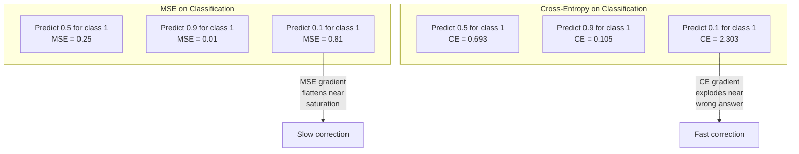
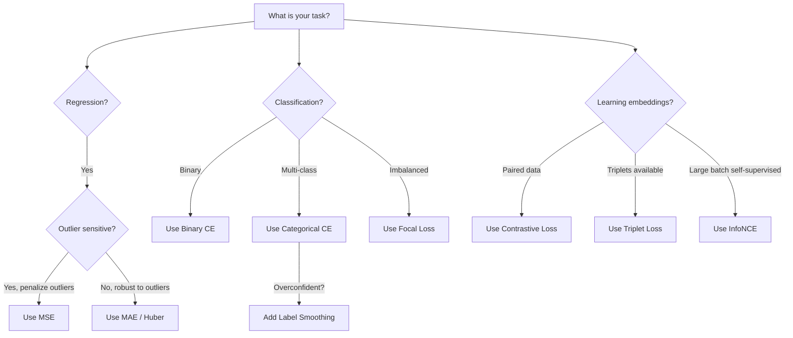
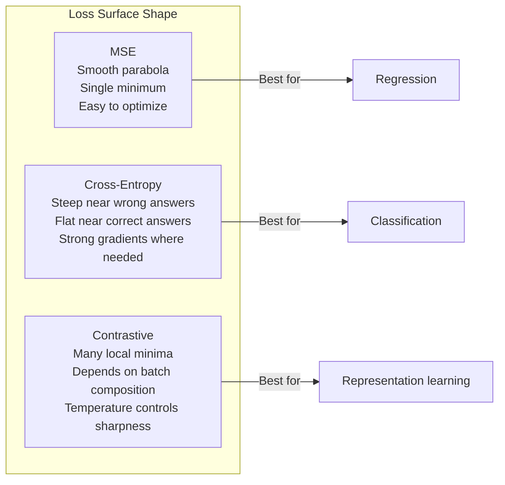

# 损失函数

> 网络给出了一个预测，真实值却与之不同。预测错得有多严重？衡量它的那个数就是损失。选错损失函数，模型就会完全朝着错误的目标优化。

**Type:** Build
**Languages:** Python
**Prerequisites:** 第 03.04 课（激活函数）
**Time:** ~75 分钟

## 学习目标

- 从零实现均方误差（MSE）、二元交叉熵（binary cross-entropy）、类别交叉熵（categorical cross-entropy）与对比损失（contrastive loss，InfoNCE），以及它们的梯度
- 演示“对所有输入都预测 0.5”的失败模式，解释为什么 MSE 不适用于分类
- 将标签平滑（label smoothing）应用于交叉熵，并说明它如何防止预测过度自信
- 为回归、二分类、多分类和嵌入（embedding）学习任务选择正确的损失函数

## 要解决的问题

在分类问题上最小化 MSE 的模型，会自信地对所有输入都预测 0.5。它确实在最小化损失，却也毫无用处。

损失函数是模型实际优化的唯一对象。不是准确率，不是 F1 分数，也不是你向经理汇报的任何指标。优化器获取损失函数的梯度，调整权重，让这个数变小。如果损失函数没有体现你关心的事情，模型就会找出在数学上代价最低的满足方式，而这种方式几乎从来都不是你想要的。

看一个具体例子：你有一个二分类任务，两个类别按 50/50 划分。你使用 MSE 作为损失，模型对每一个输入都预测 0.5。平均 MSE 为 0.25，这是在没有真正学到任何东西的情况下能达到的最小值。模型毫无判别能力，但从技术上说，它已经最小化了你的损失函数。换成交叉熵后，同一个模型就不得不把预测推向 0 或 1，因为 -log(0.5) = 0.693 是一个很差的损失，而 -log(0.99) = 0.01 会奖励自信且正确的预测。选用什么损失函数，决定了模型是在学习，还是在钻指标的空子。

情况还可能更糟。在自监督学习中，你甚至没有标签。对比损失完全定义了学习信号：什么算相似，什么算不同，以及模型应该多用力地把它们拉开。对比损失设计错了，嵌入就会坍缩到一个点：每个输入都映射到同一个向量。从技术上说，损失为零；实际上，毫无价值。

## 核心概念

### 均方误差（MSE）

这是回归任务的默认选择。计算预测值与目标值之差的平方，再对所有样本取平均。

```text
MSE = (1/n) * sum((y_pred - y_true)^2)
```

平方为什么重要：它会按二次关系惩罚大误差。误差为 2 的代价是误差为 1 的 4 倍，误差为 10 的代价则是 100 倍。这使 MSE 对离群值很敏感：单个错得离谱的预测就能主导损失。

看具体数字：假设模型预测房价，对大多数房屋的预测误差为 $10,000，但对一栋豪宅的预测误差为 $200,000。MSE 会极力纠正那一栋豪宅的预测，可能因此损害对另外 99 栋房屋的预测表现。

MSE 对某个预测值的梯度为：

```text
dMSE/dy_pred = (2/n) * (y_pred - y_true)
```

它与误差呈线性关系。误差越大，梯度越大。这在回归中是优点（大误差需要大幅修正），在分类中却是缺陷（你希望以指数而非线性的方式惩罚自信但错误的答案）。

### 交叉熵损失

这是用于分类的损失函数。它源于信息论，衡量预测概率分布与真实分布之间的散度。

**二元交叉熵（BCE）：**

```text
BCE = -(y * log(p) + (1 - y) * log(1 - p))
```

其中，y 是真实标签（0 或 1），p 是预测概率。

-log(p) 为什么有效：当真实标签为 1，预测 p = 0.99 时，损失为 -log(0.99) = 0.01；当预测 p = 0.01 时，损失为 -log(0.01) = 4.6。这 460 倍的差异就是交叉熵奏效的原因。它严厉惩罚自信但错误的预测，却几乎不惩罚自信且正确的预测。

梯度也反映了同样的道理：

```text
dBCE/dp = -(y/p) + (1-y)/(1-p)
```

当 y = 1 且 p 接近零时，梯度为 -1/p，趋近负无穷。模型会收到一个巨大的信号，去纠正错误。当 p 接近 1 时，梯度很小。既然已经正确，就不需要修正。

**类别交叉熵：**

用于目标采用 one-hot（独热）编码的多分类问题。

```text
CCE = -sum(y_i * log(p_i))
```

只有真实类别对损失有贡献，因为其余所有 y_i 都为零。如果有 10 个类别，正确类别获得的概率为 0.1（随机猜测），损失就是 -log(0.1) = 2.3；如果正确类别的概率为 0.9，损失就是 -log(0.9) = 0.105。模型会学着把概率质量集中到正确答案上。

### 为什么 MSE 不适用于分类



当预测接近 0 或 1 时，MSE 梯度会因 sigmoid 饱和而趋于平缓。交叉熵梯度能够弥补这一点：-log 抵消了 sigmoid 的平坦区域，恰好在最需要梯度的地方提供强梯度。

### 标签平滑

标准 one-hot 标签表示：“这 100% 属于类别 3，属于其他所有类别的概率都是 0%。”这是一种很强的断言。标签平滑会让它缓和一些：

```text
smooth_label = (1 - alpha) * one_hot + alpha / num_classes
```

当 alpha = 0.1 且有 10 个类别时，目标从 [0, 0, 1, 0, ...] 变为 [0.01, 0.01, 0.91, 0.01, ...]。模型以 0.91 而不是 1.0 为目标。

这为什么有效：模型若想通过 softmax 输出恰好 1.0，就需要把 logits（未归一化分数）推向无穷。这会导致过度自信、损害泛化能力，并让模型难以应对分布偏移。标签平滑把目标上限设为 0.9（当 alpha=0.1 时），让 logits 保持在合理范围内。GPT 和大多数现代模型都使用标签平滑或等效方法。

### 对比损失

没有标签，没有类别，只有成对的输入，以及一个问题：它们相似还是不同？

**SimCLR 风格的对比损失（NT-Xent / InfoNCE）：**

取一张图像，为它生成两个增强视图，例如裁剪、旋转或颜色抖动。它们构成“正样本对”（positive pair），应当有相似的嵌入。批次中的其他每张图像都会构成“负样本对”（negative pair），应当有不同的嵌入。

```text
L = -log(exp(sim(z_i, z_j) / tau) / sum(exp(sim(z_i, z_k) / tau)))
```

其中，sim() 是余弦相似度，z_i 和 z_j 构成正样本对，求和覆盖所有负样本，而 tau（温度）控制分布的尖锐程度。温度越低 = 负样本越困难 = 分离越强。

看具体数字：批次大小为 256，意味着每个正样本对有 255 个负样本。温度 tau = 0.07（SimCLR 的默认值）。这个损失看起来就像对相似度做 softmax：它希望正样本对的相似度在全部 256 个选项中最高。

**三元组损失（triplet loss）：**

接受三个输入：锚样本（anchor）、正样本（同一类别）和负样本（不同类别）。

```text
L = max(0, d(anchor, positive) - d(anchor, negative) + margin)
```

间隔（margin，通常为 0.2-1.0）规定了正样本距离与负样本距离之间的最小差距。如果负样本已经足够远，损失就是零：没有梯度，也没有更新。这让训练更高效，但需要仔细挖掘三元组，也就是选择靠近锚样本的困难负样本（hard negatives）。

### 焦点损失

用于类别不平衡的数据集。标准交叉熵对所有正确分类的样本一视同仁。焦点损失（focal loss）会降低容易样本的权重：

```text
FL = -alpha * (1 - p_t)^gamma * log(p_t)
```

其中，p_t 是真实类别的预测概率，gamma 控制聚焦程度。当 gamma = 0 时，这就是标准交叉熵。当 gamma = 2（默认值）时：

- 容易样本（p_t = 0.9）：weight = (0.1)^2 = 0.01，实际上几乎被忽略。
- 困难样本（p_t = 0.1）：weight = (0.9)^2 = 0.81，保留完整的梯度信号。

Lin 等人为目标检测引入了焦点损失。在目标检测中，99% 的候选区域都是背景，也就是容易的负样本。没有焦点损失，模型就会淹没在容易的背景样本中，始终学不会检测物体；有了它，模型就能把能力集中在那些重要、困难且模糊的样本上。

### 损失函数选择树



### 损失曲面



```figure
cross-entropy-loss
```

## 动手实现

### 第 1 步：MSE 及其梯度

```python
def mse(predictions, targets):
    n = len(predictions)
    total = 0.0
    for p, t in zip(predictions, targets):
        total += (p - t) ** 2
    return total / n

def mse_gradient(predictions, targets):
    n = len(predictions)
    grads = []
    for p, t in zip(predictions, targets):
        grads.append(2.0 * (p - t) / n)
    return grads
```

### 第 2 步：二元交叉熵

log(0) 问题确实存在。如果模型对正样本恰好预测为 0，那么 log(0) = 负无穷。裁剪可以避免这个问题。

```python
import math

def binary_cross_entropy(predictions, targets, eps=1e-15):
    n = len(predictions)
    total = 0.0
    for p, t in zip(predictions, targets):
        p_clipped = max(eps, min(1 - eps, p))
        total += -(t * math.log(p_clipped) + (1 - t) * math.log(1 - p_clipped))
    return total / n

def bce_gradient(predictions, targets, eps=1e-15):
    grads = []
    for p, t in zip(predictions, targets):
        p_clipped = max(eps, min(1 - eps, p))
        grads.append(-(t / p_clipped) + (1 - t) / (1 - p_clipped))
    return grads
```

### 第 3 步：结合 softmax 的类别交叉熵

softmax 将原始 logits 转换为概率。随后，我们针对 one-hot 目标计算交叉熵。

```python
def softmax(logits):
    max_val = max(logits)
    exps = [math.exp(x - max_val) for x in logits]
    total = sum(exps)
    return [e / total for e in exps]

def categorical_cross_entropy(logits, target_index, eps=1e-15):
    probs = softmax(logits)
    p = max(eps, probs[target_index])
    return -math.log(p)

def cce_gradient(logits, target_index):
    probs = softmax(logits)
    grads = list(probs)
    grads[target_index] -= 1.0
    return grads
```

softmax + 交叉熵的梯度能化简成非常简洁的形式：对真实类别，它就是（预测概率 - 1）；对其他所有类别，它就是（预测概率）。这种简洁的化简并非巧合，也正是 softmax 与交叉熵搭配使用的原因。

### 第 4 步：标签平滑

```python
def label_smoothed_cce(logits, target_index, num_classes, alpha=0.1, eps=1e-15):
    probs = softmax(logits)
    loss = 0.0
    for i in range(num_classes):
        if i == target_index:
            smooth_target = 1.0 - alpha + alpha / num_classes
        else:
            smooth_target = alpha / num_classes
        p = max(eps, probs[i])
        loss += -smooth_target * math.log(p)
    return loss
```

### 第 5 步：对比损失（简化版 InfoNCE）

```python
def cosine_similarity(a, b):
    dot = sum(x * y for x, y in zip(a, b))
    norm_a = math.sqrt(sum(x * x for x in a))
    norm_b = math.sqrt(sum(x * x for x in b))
    if norm_a < 1e-10 or norm_b < 1e-10:
        return 0.0
    return dot / (norm_a * norm_b)

def contrastive_loss(anchor, positive, negatives, temperature=0.07):
    sim_pos = cosine_similarity(anchor, positive) / temperature
    sim_negs = [cosine_similarity(anchor, neg) / temperature for neg in negatives]

    max_sim = max(sim_pos, max(sim_negs)) if sim_negs else sim_pos
    exp_pos = math.exp(sim_pos - max_sim)
    exp_negs = [math.exp(s - max_sim) for s in sim_negs]
    total_exp = exp_pos + sum(exp_negs)

    return -math.log(max(1e-15, exp_pos / total_exp))
```

### 第 6 步：分类中的 MSE 与交叉熵对比

用这两种损失函数训练第 04 课中的同一个网络（圆形数据集），观察交叉熵更快地收敛。

```python
import random

def sigmoid(x):
    x = max(-500, min(500, x))
    return 1.0 / (1.0 + math.exp(-x))

def make_circle_data(n=200, seed=42):
    random.seed(seed)
    data = []
    for _ in range(n):
        x = random.uniform(-2, 2)
        y = random.uniform(-2, 2)
        label = 1.0 if x * x + y * y < 1.5 else 0.0
        data.append(([x, y], label))
    return data


class LossComparisonNetwork:
    def __init__(self, loss_type="bce", hidden_size=8, lr=0.1):
        random.seed(0)
        self.loss_type = loss_type
        self.lr = lr
        self.hidden_size = hidden_size

        self.w1 = [[random.gauss(0, 0.5) for _ in range(2)] for _ in range(hidden_size)]
        self.b1 = [0.0] * hidden_size
        self.w2 = [random.gauss(0, 0.5) for _ in range(hidden_size)]
        self.b2 = 0.0

    def forward(self, x):
        self.x = x
        self.z1 = []
        self.h = []
        for i in range(self.hidden_size):
            z = self.w1[i][0] * x[0] + self.w1[i][1] * x[1] + self.b1[i]
            self.z1.append(z)
            self.h.append(max(0.0, z))

        self.z2 = sum(self.w2[i] * self.h[i] for i in range(self.hidden_size)) + self.b2
        self.out = sigmoid(self.z2)
        return self.out

    def backward(self, target):
        if self.loss_type == "mse":
            d_loss = 2.0 * (self.out - target)
        else:
            eps = 1e-15
            p = max(eps, min(1 - eps, self.out))
            d_loss = -(target / p) + (1 - target) / (1 - p)

        d_sigmoid = self.out * (1 - self.out)
        d_out = d_loss * d_sigmoid

        for i in range(self.hidden_size):
            d_relu = 1.0 if self.z1[i] > 0 else 0.0
            d_h = d_out * self.w2[i] * d_relu
            self.w2[i] -= self.lr * d_out * self.h[i]
            for j in range(2):
                self.w1[i][j] -= self.lr * d_h * self.x[j]
            self.b1[i] -= self.lr * d_h
        self.b2 -= self.lr * d_out

    def compute_loss(self, pred, target):
        if self.loss_type == "mse":
            return (pred - target) ** 2
        else:
            eps = 1e-15
            p = max(eps, min(1 - eps, pred))
            return -(target * math.log(p) + (1 - target) * math.log(1 - p))

    def train(self, data, epochs=200):
        losses = []
        for epoch in range(epochs):
            total_loss = 0.0
            correct = 0
            for x, y in data:
                pred = self.forward(x)
                self.backward(y)
                total_loss += self.compute_loss(pred, y)
                if (pred >= 0.5) == (y >= 0.5):
                    correct += 1
            avg_loss = total_loss / len(data)
            accuracy = correct / len(data) * 100
            losses.append((avg_loss, accuracy))
            if epoch % 50 == 0 or epoch == epochs - 1:
                print(f"    Epoch {epoch:3d}: loss={avg_loss:.4f}, accuracy={accuracy:.1f}%")
        return losses
```

## 实际使用

PyTorch 提供了所有标准损失函数，并内置了数值稳定性处理：

```python
import torch
import torch.nn as nn
import torch.nn.functional as F

predictions = torch.tensor([0.9, 0.1, 0.7], requires_grad=True)
targets = torch.tensor([1.0, 0.0, 1.0])

mse_loss = F.mse_loss(predictions, targets)
bce_loss = F.binary_cross_entropy(predictions, targets)

logits = torch.randn(4, 10)
labels = torch.tensor([3, 7, 1, 9])
ce_loss = F.cross_entropy(logits, labels)
ce_smooth = F.cross_entropy(logits, labels, label_smoothing=0.1)
```

使用 `F.cross_entropy`，而不是 `F.nll_loss` 加手动 softmax。它把 log-softmax 和负对数似然结合为一次数值稳定的运算。先单独应用 softmax 再取对数，数值稳定性较差：大指数值相减时会损失精度。

在对比学习中，大多数团队使用自定义实现，或 `lightly`、`pytorch-metric-learning` 之类的库。核心流程始终相同：计算成对相似度，对正负样本做 softmax，然后反向传播。

## 交付成果

本课产出：
- `outputs/prompt-loss-function-selector.md`：用于选择合适损失函数的可复用提示词
- `outputs/prompt-loss-debugger.md`：用于诊断损失曲线异常的提示词

## 练习

1. 实现 Huber 损失（平滑 L1 损失），它在误差较小时是 MSE，在误差较大时是平均绝对误差（MAE）。在 5% 的训练目标中加入随机噪声（离群值），分别用 MSE 和 Huber 训练一个预测 y = sin(x) 的回归网络。比较最终测试误差。

2. 将焦点损失加入二分类训练循环。创建一个不平衡数据集（90% 属于类别 0，10% 属于类别 1）。训练 200 轮后，比较标准 BCE 与焦点损失（gamma=2）在少数类别上的召回率。

3. 实现带半困难负样本挖掘（semi-hard negative mining）的三元组损失。为 5 个类别生成 2D 嵌入数据。对每个锚样本，找出仍比正样本更远的最困难负样本（半困难）。将其收敛情况与随机选择三元组比较。

4. 运行 MSE 与交叉熵的对比，但要在训练中跟踪每一层的梯度幅度。绘制每轮的平均梯度范数。验证在模型最不确定的训练早期，交叉熵会产生更大的梯度。

5. 实现 KL 散度损失，验证当真实分布为 one-hot 时，最小化 KL(true || predicted) 得到的梯度与交叉熵相同。然后尝试软目标，例如知识蒸馏（knowledge distillation）：此时“真实”分布来自教师模型的 softmax 输出。

## 关键术语

| 术语 | 常见说法 | 实际含义 |
|------|----------------|----------------------|
| 损失函数 | “模型错得有多严重” | 将预测值与目标值映射为一个标量的可微函数，优化器会最小化这个标量 |
| MSE | “平均平方误差” | 预测值与目标值之差的平方的均值；按二次关系惩罚大误差 |
| 交叉熵 | “分类损失” | 用 -log(p) 衡量预测概率分布与真实分布之间的散度 |
| 二元交叉熵 | “BCE” | 用于两个类别的交叉熵：-(y*log(p) + (1-y)*log(1-p)) |
| 标签平滑 | “软化目标” | 用软值（例如 0.1/0.9）替换硬性的 0/1 目标，以防止过度自信并改善泛化 |
| 对比损失 | “拉近，推远” | 通过让相似样本对在嵌入空间中靠近、不同样本对远离来学习表示的损失 |
| InfoNCE | “CLIP/SimCLR 的损失” | 在相似度分数上计算归一化的温度缩放交叉熵；将对比学习视为分类 |
| 焦点损失 | “解决数据不平衡” | 用 (1-p_t)^gamma 加权的交叉熵，降低容易样本的权重，聚焦困难样本 |
| 三元组损失 | “锚样本—正样本—负样本” | 在嵌入空间中，使锚样本到正样本的距离比到负样本的距离至少小一个间隔 |
| 温度 | “尖锐程度旋钮” | logits/相似度的标量除数，控制所得分布的尖锐程度；越低 = 越尖锐 |

## 延伸阅读

- Lin 等人，"Focal Loss for Dense Object Detection"（2017）：引入焦点损失，以应对目标检测（RetinaNet）中的极端类别不平衡
- Chen 等人，"A Simple Framework for Contrastive Learning of Visual Representations"（SimCLR，2020）：确立了使用 NT-Xent 损失的现代对比学习流程
- Szegedy 等人，"Rethinking the Inception Architecture"（2016）：将标签平滑作为一种正则化技术引入，如今它已是大多数大型模型中的标准做法
- Hinton 等人，"Distilling the Knowledge in a Neural Network"（2015）：通过软目标和 KL 散度进行知识蒸馏，是模型压缩的基础
