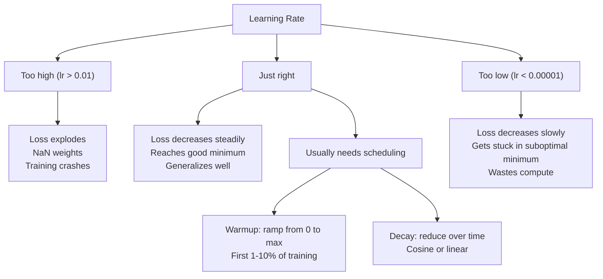
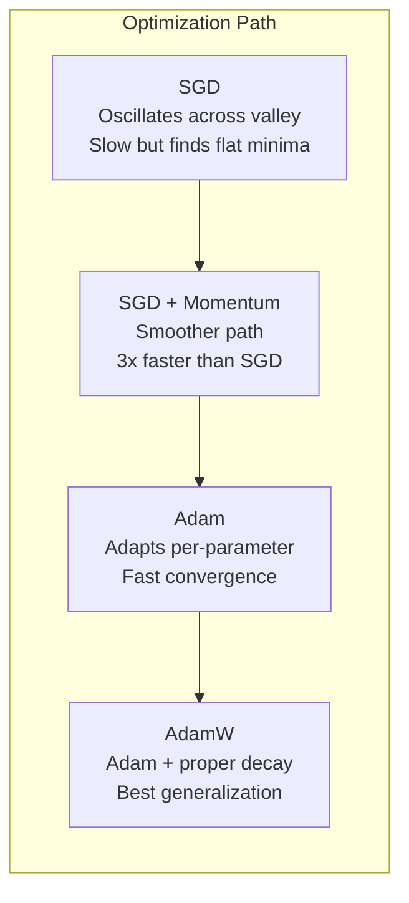
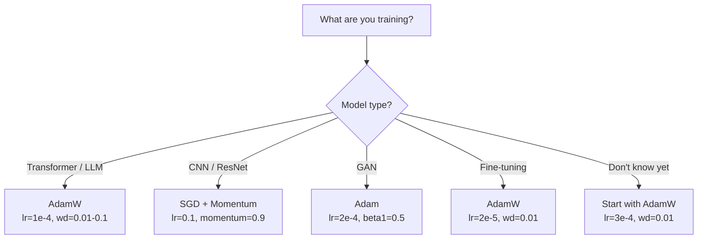

# 优化器

> 梯度下降告诉你往哪个方向走，却没有告诉你该走多远、走多快。随机梯度下降（SGD）像指南针，Adam（自适应矩估计，Adaptive Moment Estimation）则像带有实时路况数据的 GPS。

**Type:** Build
**Languages:** Python
**Prerequisites:** 第 03.05 课（损失函数）
**Time:** ~75 分钟

## 学习目标

- 用 Python 从零实现 SGD、带动量（momentum）的 SGD、Adam 和 AdamW 优化器
- 解释 Adam 的偏差校正（bias correction）如何补偿训练初期矩估计零初始化带来的偏差
- 演示为什么在同一任务上，AdamW 比带 L2 正则化的 Adam 有更好的泛化表现
- 为 Transformer、卷积神经网络（CNN）、生成对抗网络（GAN）和微调（fine-tuning）选择合适的优化器及默认超参数

## 要解决的问题

你已经算出了梯度，知道要降低损失，就应该让权重 #4,721 减少 0.003。但这个 0.003 的单位是什么？应该乘上什么缩放系数？第 1 步和第 1,000 步的更新幅度应该相同吗？

基础梯度下降（vanilla gradient descent）在每一步都对所有参数使用相同的学习率：w = w - lr * gradient。这会带来三个问题，让神经网络训练在实践中变得棘手。

首先是振荡。损失曲面（loss landscape）很少像一个光滑的碗，更像一条狭长的山谷。梯度指向横穿山谷的陡峭方向，而非沿着山谷的平缓方向。梯度下降在狭窄方向上来回摆动，在真正有用的方向上却只推进一点。你一定见过这种情况：损失迅速下降，随后进入平台期，原因并不是模型已经收敛，而是它在振荡。

其次，所有参数共用一个学习率并不合适。有些权重需要大幅更新，因为它们还处于欠拟合的早期阶段；另一些权重则需要微小更新，因为它们已经接近最优值。适合前者的学习率会破坏后者，反过来也一样。

第三个问题是鞍点（saddle point）。在高维空间中，损失曲面存在大片梯度接近零的平坦区域。基础 SGD 以梯度所决定的速度缓慢穿过这些区域，而这个速度实际上接近零。模型看起来像是卡住了。其实它并没有卡住，只是处在一片平坦区域，另一侧还有有用的下降方向。但 SGD 没有帮助它穿过这片区域的机制。

Adam 解决了这三个问题。它为每个参数维护两个移动平均值：梯度的均值，即用于处理振荡的动量；以及梯度平方的均值，用于自适应调整学习率、处理不同尺度。再结合训练前几步的偏差校正，这个优化器仅靠默认超参数就能适用于 80% 的问题。本课将从零实现它，让你准确理解它在另外 20% 的问题上何时、为何会失效。

## 核心概念

### 随机梯度下降（SGD）

这是最简单的优化器。在一个小批量（mini-batch）上计算梯度，然后沿相反方向迈出一步。

```text
w = w - lr * gradient
```

“随机”是指用数据的一个随机子集，也就是小批量，来估计梯度，而不是使用完整数据集。这种噪声其实有用：它有助于逃离尖锐的局部极小值。但噪声也会造成振荡。

学习率是唯一可调的旋钮。太高，损失就会发散；太低，训练就会遥遥无期。最优取值取决于网络架构、数据、批量大小以及当前训练阶段。对于现代网络中的基础 SGD，典型取值范围是 0.01 到 0.1。但即便在同一次训练中，理想学习率也会变化。

### 动量

小球滚下山坡的比喻虽然用得太多，却很贴切。你不再只按当前梯度迈步，而是维护一个累积过去梯度的速度（velocity）。

```text
m_t = beta * m_{t-1} + gradient
w = w - lr * m_t
```

Beta（通常为 0.9）控制保留多少历史信息。当 beta = 0.9 时，动量大致相当于最近 10 个梯度的平均值（1 / (1 - 0.9) = 10）。

它为什么能解决振荡？同向梯度会累积，方向相反的梯度则会相互抵消。在那条狭窄山谷中，“横穿”方向的分量每一步都会变号，因此受到抑制；“沿谷”方向的分量保持一致，因此得到增强。结果就是在有用的方向上平稳加速。

用实际数字来看：在病态的损失曲面上，单用 SGD 可能需要 10,000 步；带动量的 SGD（beta=0.9）解决同一问题通常只需 3,000-5,000 步。这种加速相当显著。

### RMSProp

这是第一个真正奏效的逐参数自适应学习率方法，由 Hinton 在 Coursera 的一节课上提出，从未正式发表。

```text
s_t = beta * s_{t-1} + (1 - beta) * gradient^2
w = w - lr * gradient / (sqrt(s_t) + epsilon)
```

s_t 跟踪梯度平方的移动平均值。梯度持续较大的参数会除以一个较大的数，从而获得更小的有效学习率；梯度较小的参数则会除以一个较小的数，从而获得更大的有效学习率。

这解决了“所有参数共用一个学习率”的问题。一直得到大幅更新的权重可能已经接近目标，应该慢下来；一直只得到微小更新的权重可能训练不足，应该加快更新。

Epsilon（通常为 1e-8）用于防止某个参数尚未更新时出现除零。

### Adam：动量 + RMSProp

Adam 结合了这两种思路，为每个参数维护两个指数移动平均（exponential moving average）：

```text
m_t = beta1 * m_{t-1} + (1 - beta1) * gradient        (first moment: mean)
v_t = beta2 * v_{t-1} + (1 - beta2) * gradient^2       (second moment: variance)
```

**偏差校正**是多数讲解会略过的关键细节。在第 1 步，m_1 = (1 - beta1) * gradient。当 beta1 = 0.9 时，这就是 0.1 * gradient，只有应有值的十分之一。移动平均还没有完成预热，偏差校正用于补偿这一点：

```text
m_hat = m_t / (1 - beta1^t)
v_hat = v_t / (1 - beta2^t)
```

在第 1 步，当 beta1 = 0.9 时：m_hat = m_1 / (1 - 0.9) = m_1 / 0.1 = 实际梯度。在第 100 步，(1 - 0.9^100) 约为 1.0，因此校正作用消失。偏差校正在最初的 ~10 步很重要，~50 步之后就无关紧要了。

更新公式：

```text
w = w - lr * m_hat / (sqrt(v_hat) + epsilon)
```

Adam 的默认值为：lr = 0.001、beta1 = 0.9、beta2 = 0.999、epsilon = 1e-8。这些默认值适用于 80% 的问题。如果不奏效，先调 lr，再调 beta2，几乎不需要改 beta1 或 epsilon。

### AdamW：正确处理权重衰减

L2 正则化会在损失中加入 lambda * w^2。对于基础 SGD，这等价于权重衰减（weight decay），也就是每一步从权重中减去 lambda * w。但在 Adam 中，这种等价关系不再成立。

Loshchilov & Hutter 的关键发现是：当你把 L2 项加入损失，再让 Adam 处理梯度时，自适应学习率也会缩放正则化项。梯度方差较大的参数受到的正则化较弱，方差较小的参数受到的正则化较强。这并不是你想要的；你希望无论梯度统计量如何，正则化都保持一致。

AdamW 在 Adam 更新之后直接对权重施加权重衰减，从而解决这个问题：

```text
w = w - lr * m_hat / (sqrt(v_hat) + epsilon) - lr * lambda * w
```

权重衰减项 (lr * lambda * w) 不受 Adam 自适应因子的缩放。每个参数都会按同一比例缩小。

这看起来像个小细节，实际影响却很大。几乎在所有任务上，AdamW 都比 Adam + L2 正则化收敛到更好的解。在 PyTorch 中训练 Transformer、扩散模型和大多数现代架构时，它都是默认优化器。BERT、GPT、LLaMA、Stable Diffusion 都使用 AdamW 训练。

### 学习率：最重要的超参数



如果只调一个超参数，就调学习率。学习率变化 10 倍，比你做出的任何架构选择都更重要。常见默认值如下：

- SGD：lr = 0.01 到 0.1
- Adam/AdamW：lr = 1e-4 到 3e-4
- 微调预训练模型：lr = 1e-5 到 5e-5
- 学习率预热（warmup）：在最初 1-10% 的步数内线性增加

### 优化器对比



### 各种优化器何时更有优势



```figure
optimizer-trajectory
```

## 动手实现

### 第 1 步：基础 SGD

```python
class SGD:
    def __init__(self, lr=0.01):
        self.lr = lr

    def step(self, params, grads):
        for i in range(len(params)):
            params[i] -= self.lr * grads[i]
```

### 第 2 步：带动量的 SGD

```python
class SGDMomentum:
    def __init__(self, lr=0.01, beta=0.9):
        self.lr = lr
        self.beta = beta
        self.velocities = None

    def step(self, params, grads):
        if self.velocities is None:
            self.velocities = [0.0] * len(params)
        for i in range(len(params)):
            self.velocities[i] = self.beta * self.velocities[i] + grads[i]
            params[i] -= self.lr * self.velocities[i]
```

### 第 3 步：Adam

```python
import math

class Adam:
    def __init__(self, lr=0.001, beta1=0.9, beta2=0.999, epsilon=1e-8):
        self.lr = lr
        self.beta1 = beta1
        self.beta2 = beta2
        self.epsilon = epsilon
        self.m = None
        self.v = None
        self.t = 0

    def step(self, params, grads):
        if self.m is None:
            self.m = [0.0] * len(params)
            self.v = [0.0] * len(params)

        self.t += 1

        for i in range(len(params)):
            self.m[i] = self.beta1 * self.m[i] + (1 - self.beta1) * grads[i]
            self.v[i] = self.beta2 * self.v[i] + (1 - self.beta2) * grads[i] ** 2

            m_hat = self.m[i] / (1 - self.beta1 ** self.t)
            v_hat = self.v[i] / (1 - self.beta2 ** self.t)

            params[i] -= self.lr * m_hat / (math.sqrt(v_hat) + self.epsilon)
```

### 第 4 步：AdamW

```python
class AdamW:
    def __init__(self, lr=0.001, beta1=0.9, beta2=0.999, epsilon=1e-8, weight_decay=0.01):
        self.lr = lr
        self.beta1 = beta1
        self.beta2 = beta2
        self.epsilon = epsilon
        self.weight_decay = weight_decay
        self.m = None
        self.v = None
        self.t = 0

    def step(self, params, grads):
        if self.m is None:
            self.m = [0.0] * len(params)
            self.v = [0.0] * len(params)

        self.t += 1

        for i in range(len(params)):
            self.m[i] = self.beta1 * self.m[i] + (1 - self.beta1) * grads[i]
            self.v[i] = self.beta2 * self.v[i] + (1 - self.beta2) * grads[i] ** 2

            m_hat = self.m[i] / (1 - self.beta1 ** self.t)
            v_hat = self.v[i] / (1 - self.beta2 ** self.t)

            params[i] -= self.lr * m_hat / (math.sqrt(v_hat) + self.epsilon)
            params[i] -= self.lr * self.weight_decay * params[i]
```

### 第 5 步：训练对比

在第 05 课的圆形分类数据集上，用全部四种优化器分别训练同一个两层网络，并比较收敛情况。

```python
import random

def sigmoid(x):
    x = max(-500, min(500, x))
    return 1.0 / (1.0 + math.exp(-x))

def make_circle_data(n=200, seed=42):
    random.seed(seed)
    data = []
    for _ in range(n):
        x = random.uniform(-2, 2)
        y = random.uniform(-2, 2)
        label = 1.0 if x * x + y * y < 1.5 else 0.0
        data.append(([x, y], label))
    return data


class OptimizerTestNetwork:
    def __init__(self, optimizer, hidden_size=8):
        random.seed(0)
        self.hidden_size = hidden_size
        self.optimizer = optimizer

        self.w1 = [[random.gauss(0, 0.5) for _ in range(2)] for _ in range(hidden_size)]
        self.b1 = [0.0] * hidden_size
        self.w2 = [random.gauss(0, 0.5) for _ in range(hidden_size)]
        self.b2 = 0.0

    def get_params(self):
        params = []
        for row in self.w1:
            params.extend(row)
        params.extend(self.b1)
        params.extend(self.w2)
        params.append(self.b2)
        return params

    def set_params(self, params):
        idx = 0
        for i in range(self.hidden_size):
            for j in range(2):
                self.w1[i][j] = params[idx]
                idx += 1
        for i in range(self.hidden_size):
            self.b1[i] = params[idx]
            idx += 1
        for i in range(self.hidden_size):
            self.w2[i] = params[idx]
            idx += 1
        self.b2 = params[idx]

    def forward(self, x):
        self.x = x
        self.z1 = []
        self.h = []
        for i in range(self.hidden_size):
            z = self.w1[i][0] * x[0] + self.w1[i][1] * x[1] + self.b1[i]
            self.z1.append(z)
            self.h.append(max(0.0, z))

        self.z2 = sum(self.w2[i] * self.h[i] for i in range(self.hidden_size)) + self.b2
        self.out = sigmoid(self.z2)
        return self.out

    def compute_grads(self, target):
        eps = 1e-15
        p = max(eps, min(1 - eps, self.out))
        d_loss = -(target / p) + (1 - target) / (1 - p)
        d_sigmoid = self.out * (1 - self.out)
        d_out = d_loss * d_sigmoid

        grads = [0.0] * (self.hidden_size * 2 + self.hidden_size + self.hidden_size + 1)
        idx = 0
        for i in range(self.hidden_size):
            d_relu = 1.0 if self.z1[i] > 0 else 0.0
            d_h = d_out * self.w2[i] * d_relu
            grads[idx] = d_h * self.x[0]
            grads[idx + 1] = d_h * self.x[1]
            idx += 2

        for i in range(self.hidden_size):
            d_relu = 1.0 if self.z1[i] > 0 else 0.0
            grads[idx] = d_out * self.w2[i] * d_relu
            idx += 1

        for i in range(self.hidden_size):
            grads[idx] = d_out * self.h[i]
            idx += 1

        grads[idx] = d_out
        return grads

    def train(self, data, epochs=300):
        losses = []
        for epoch in range(epochs):
            total_loss = 0.0
            correct = 0
            for x, y in data:
                pred = self.forward(x)
                grads = self.compute_grads(y)
                params = self.get_params()
                self.optimizer.step(params, grads)
                self.set_params(params)

                eps = 1e-15
                p = max(eps, min(1 - eps, pred))
                total_loss += -(y * math.log(p) + (1 - y) * math.log(1 - p))
                if (pred >= 0.5) == (y >= 0.5):
                    correct += 1
            avg_loss = total_loss / len(data)
            accuracy = correct / len(data) * 100
            losses.append((avg_loss, accuracy))
            if epoch % 75 == 0 or epoch == epochs - 1:
                print(f"    Epoch {epoch:3d}: loss={avg_loss:.4f}, accuracy={accuracy:.1f}%")
        return losses
```

## 实际使用

PyTorch 优化器可以处理参数组（parameter group）、梯度裁剪（gradient clipping）和学习率调度（learning rate schedule）：

```python
import torch
import torch.optim as optim

model = torch.nn.Sequential(
    torch.nn.Linear(784, 256),
    torch.nn.ReLU(),
    torch.nn.Linear(256, 10),
)

optimizer = optim.AdamW(model.parameters(), lr=3e-4, weight_decay=0.01)

scheduler = optim.lr_scheduler.CosineAnnealingLR(optimizer, T_max=100)

for epoch in range(100):
    optimizer.zero_grad()
    output = model(torch.randn(32, 784))
    loss = torch.nn.functional.cross_entropy(output, torch.randint(0, 10, (32,)))
    loss.backward()
    torch.nn.utils.clip_grad_norm_(model.parameters(), max_norm=1.0)
    optimizer.step()
    scheduler.step()
```

调用顺序始终是：zero_grad、forward、loss、backward、(clip)、step、(schedule)。记住这个顺序。弄错顺序，比如在 optimizer.step() 之前调用 scheduler.step()，是产生隐蔽错误的常见原因。

对于 CNN，许多实践者仍然偏好 SGD + 动量（lr=0.1、momentum=0.9、weight_decay=1e-4），并配合阶梯调度或余弦调度。SGD 会找到更平坦的极小值，而这样的解通常有更好的泛化表现。对于 Transformer 和大语言模型（LLM），AdamW 配合预热 + 余弦衰减是普遍采用的默认方案。没有实测依据，就不要轻易偏离这一共识。

## 交付成果

本课产出：
- `outputs/prompt-optimizer-selector.md`：一个决策提示词（prompt），用于为任意架构选择合适的优化器和学习率

## 练习

1. 实现 Nesterov 动量：在“前瞻”位置（lookahead position）(w - lr * beta * v) 而非当前位置计算梯度。在圆形分类数据集上，将其收敛情况与标准动量进行比较。

2. 实现一个学习率预热调度：在最初 10% 的训练步数内，从 0 线性增加到 max_lr，然后按余弦曲线衰减到 0。分别使用带预热和不带预热的 Adam 训练，测量在圆形分类数据集上达到 90% 准确率需要多少轮（epoch）。

3. 在 Adam 训练过程中跟踪每个参数的有效学习率。有效学习率为 lr * m_hat / (sqrt(v_hat) + eps)。绘制第 10、50 和 200 步后有效学习率的分布。所有参数的更新速度都相同吗？

4. 实现梯度裁剪，按全局范数（global norm）进行裁剪，将最大梯度范数设为 1.0。使用较高学习率（Adam 的 lr=0.01），分别进行裁剪和不裁剪的训练。在 10 个随机种子下，统计两种设置各有多少次训练发散，即损失变成 NaN。

5. 在权重较大的网络上比较 Adam 和 AdamW。将所有权重初始化为 [-5, 5] 范围内的随机值，远大于正常值。设 weight_decay=0.1，训练 200 轮。绘制两个优化器在训练过程中的权重 L2 范数。AdamW 应该表现出更快的权重收缩。

## 关键术语

| 术语 | 常见说法 | 实际含义 |
|------|----------------|----------------------|
| 学习率 | “步长” | 梯度更新的标量乘数；训练中影响最大的超参数 |
| SGD | “基础梯度下降” | 随机梯度下降：用小批量计算梯度，再从权重中减去 lr * gradient 来更新权重 |
| 动量 | “滚动小球的比喻” | 过去梯度的指数移动平均；抑制振荡，并在方向一致时加速 |
| RMSProp | “自适应学习率” | 将每个参数的梯度除以其近期梯度的移动均方根（RMS），使学习率均衡 |
| Adam | “默认优化器” | 结合动量（一阶矩）与 RMSProp（二阶矩），并在初始步骤进行偏差校正 |
| AdamW | “正确实现的 Adam” | 带解耦权重衰减的 Adam；直接对权重施加正则化，而非通过梯度施加 |
| 偏差校正 | “移动平均的预热” | 除以 (1 - beta^t)，补偿 Adam 矩估计零初始化的影响 |
| 权重衰减 | “缩小权重” | 每一步减去权重值的一部分；一种惩罚大权重的正则化方法 |
| 学习率调度 | “随时间改变 lr” | 在训练过程中调整学习率的函数；预热 + 余弦衰减是现代默认方案 |
| 梯度裁剪 | “限制梯度范数” | 当梯度向量的范数超过阈值时，将其缩小；防止梯度更新量爆炸 |

## 延伸阅读

- Kingma & Ba，“Adam: A Method for Stochastic Optimization”（2014）：Adam 原始论文，包含收敛分析与偏差校正推导
- Loshchilov & Hutter，“Decoupled Weight Decay Regularization”（2017）：证明 L2 正则化与权重衰减在 Adam 中并不等价，并提出 AdamW
- Smith，“Cyclical Learning Rates for Training Neural Networks”（2017）：介绍了 LR 范围测试及周期性调度，从而无需调节固定学习率
- Ruder，“An Overview of Gradient Descent Optimization Algorithms”（2016）：涵盖所有优化器变体的最佳单篇综述，比较清晰，直觉解释易懂
