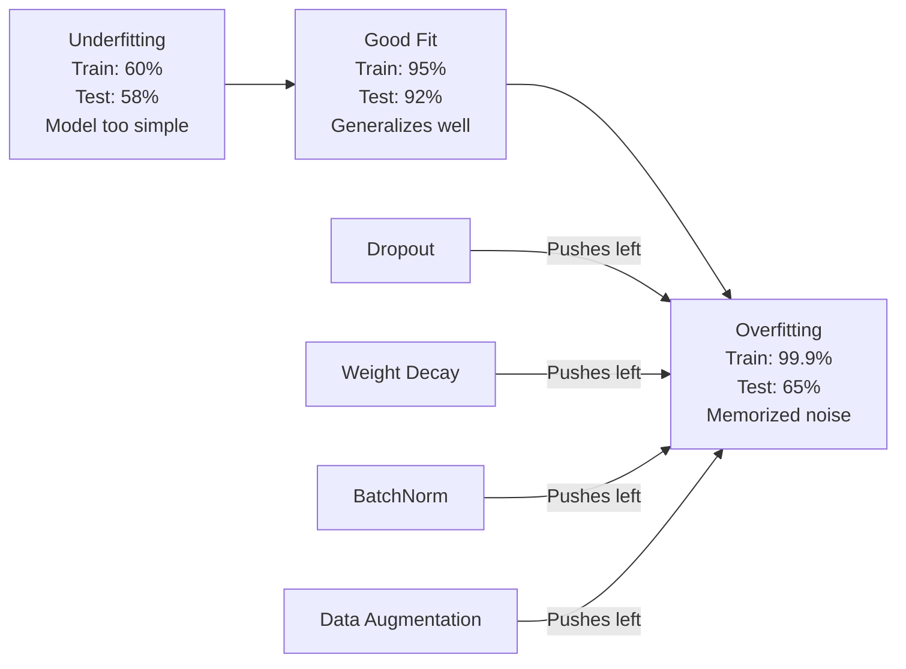
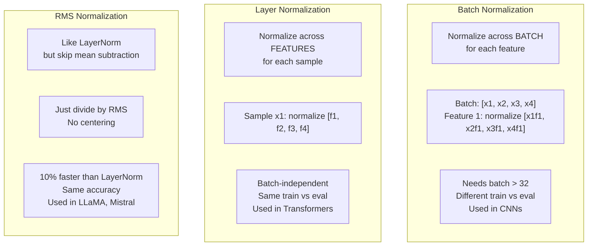
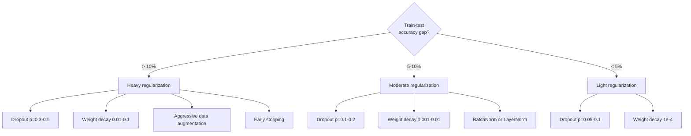

# 正则化

> 你的模型在训练数据上达到 99%，在测试数据上却只有 60%。它做的是记忆，而不是学习。正则化（regularization）就像给复杂性征税，迫使模型具备泛化能力。

**Type:** Build
**Languages:** Python
**Prerequisites:** 第 03.06 课（优化器）
**Time:** ~75 分钟

## 学习目标

- 从零实现带反向缩放的 Dropout（随机失活）、L2 权重衰减（weight decay）、批量归一化（batch normalization）、层归一化（layer normalization）和 RMSNorm（均方根归一化）
- 测量训练与测试准确率之间的差距，并通过正则化实验诊断过拟合（overfitting）
- 解释为什么 Transformer 使用 LayerNorm 而非 BatchNorm，以及为什么现代大语言模型（LLM）更偏好 RMSNorm
- 根据过拟合的严重程度，应用恰当的正则化技术组合

## 要解决的问题

参数足够多的神经网络可以记住任何数据集。这并非假设：Zhang 等人（2017）用带有随机标签的 ImageNet 训练标准网络，证明了这一点。在标签分配完全随机的情况下，网络仍然达到了接近零的训练损失。它们记住了一百万个随机输入—输出对，尽管其中没有可供学习的模式。训练损失表现完美，测试准确率却为零。

这就是过拟合问题，而且模型越大，问题越严重。GPT-3 有 175 billion（一千七百五十亿）个参数，训练集大约有 500 billion（五千亿）个 token（词元）。如此多的参数，让模型有足够的容量逐字记住训练数据中的大量内容。如果没有正则化，它就只会复述训练样本，而不是学习可以泛化的模式。

训练表现与测试表现之间的差距，就是过拟合差距。本课中的每项技术都从不同角度缩小这一差距。Dropout 迫使网络不依赖任何单个神经元。权重衰减防止任何单个权重变得过大。批量归一化让损失曲面更加平滑，使优化器能找到更平坦、泛化能力更强的极小值。层归一化起到同样的作用，但能适用于批量归一化失效的情况，例如小批量和变长序列。RMSNorm 省去均值计算，将这一过程加快 10%。每项技术都很简单，而它们结合起来，就能让模型从只会记忆走向能够泛化。

## 核心概念

### 从欠拟合到过拟合

每个模型都处在从欠拟合（underfitting，过于简单，无法捕捉模式）到过拟合（过于复杂，连噪声也捕捉下来）之间的某个位置。最佳平衡点位于两者之间，而正则化会把模型从过拟合的一侧推向这个平衡点。



### Dropout

这是一种最简单的正则化技术，也有一种最优雅的解释。训练期间，以概率 p 随机将每个神经元的输出置零。

```text
output = activation(z) * mask    where mask[i] ~ Bernoulli(1 - p)
```

当 p = 0.5 时，每次前向传播都会将一半神经元置零。网络无法预知哪些神经元可用，因此必须学习冗余表示。这就能防止协同适应（co-adaptation），也就是神经元学会依赖某些特定的其他神经元始终存在。

从集成（ensemble）的角度看：一个含有 N 个神经元并采用 Dropout 的网络，会产生 2^N 种可能的子网络，涵盖神经元开启或关闭的所有组合。使用 Dropout 训练，近似于同时训练全部 2^N 个子网络，每个子网络使用不同的小批量数据。测试时，使用所有神经元，也就是不使用 Dropout，并将输出乘以 (1 - p)，使其与训练期间的期望值相匹配。这相当于对 2^N 个子网络的预测取平均：一个模型就能形成规模庞大的集成。

实际使用时，会在训练阶段而非测试阶段进行缩放，这称为倒置 Dropout（inverted dropout），也就是在训练时除以保留概率来进行反向缩放：

```text
During training:  output = activation(z) * mask / (1 - p)
During testing:   output = activation(z)   (no change needed)
```

这样更简洁，因为测试代码完全不需要知道 Dropout 的存在。

默认失活率：Transformer 使用 p = 0.1，多层感知机（MLP）使用 p = 0.5，卷积神经网络（CNN）使用 p = 0.2-0.3。Dropout 越强 = 正则化越强 = 欠拟合风险越高。

### 权重衰减（L2 正则化）

将所有权重的平方和加到损失中：

```text
total_loss = task_loss + (lambda / 2) * sum(w_i^2)
```

正则化项的梯度为 lambda * w。这意味着每一步都会让各个权重向零收缩，收缩量与其幅度成正比。大权重受到的惩罚更大，模型因此被推向没有任何单个权重占主导的解。

这为什么有助于泛化？过拟合模型往往具有较大的权重，会放大训练数据中的噪声。权重衰减让权重保持较小，从而限制模型的有效容量，迫使它依赖稳健、可泛化的特征，而不是记住的偶然细节。

超参数 lambda 控制正则化强度。典型取值如下：

- Transformer 使用 AdamW 时取 0.01
- CNN 使用随机梯度下降（SGD）时取 1e-4
- 严重过拟合的模型取 0.1

如第 06 课所述，权重衰减与 L2 正则化在 SGD 中等价，但在 Adam 中并不等价。使用 Adam 训练时，始终应使用 AdamW，即解耦权重衰减（decoupled weight decay）。

### 批量归一化

在把每层输出传给下一层之前，先跨小批量对这些输出做归一化。

对于某一层的一小批激活值：

```text
mu = (1/B) * sum(x_i)           (batch mean)
sigma^2 = (1/B) * sum((x_i - mu)^2)   (batch variance)
x_hat = (x_i - mu) / sqrt(sigma^2 + eps)   (normalize)
y = gamma * x_hat + beta        (scale and shift)
```

Gamma 和 beta 是可学习参数；如果撤销归一化能得到最优结果，网络就可以通过它们做到这一点。没有这两个参数，就等于强制每一层的输出都具有零均值和单位方差，而这未必符合网络的需要。

**训练与推理的区别：** 训练期间，mu 和 sigma 来自当前小批量。推理期间，则使用训练过程中累积的运行平均值（running average），也就是 momentum = 0.1 的指数移动平均，含义为 90% 旧值 + 10% 新值。

BatchNorm 为什么有效，至今仍有争论。原始论文声称，它能减少“内部协变量偏移”（internal covariate shift），也就是较早层更新时，后续层输入的分布随之发生变化。Santurkar 等人（2018）表明，这一解释是错误的。真正的原因在于：BatchNorm 让损失曲面更加平滑，梯度更能预测损失的变化，Lipschitz 常数更小，优化器因而可以安全地迈出更大的步子。这就是 BatchNorm 能让你使用更高学习率、更快收敛的原因。

BatchNorm 有一个根本限制：它依赖批量统计量。当批量大小为 1 时，均值和方差没有意义。当批量较小（< 32）时，统计量噪声较大，会损害模型表现。这会影响目标检测等任务，因为内存限制了批量大小；也会影响语言建模，因为序列长度各不相同。

### 层归一化

跨特征做归一化，而不是跨批量。对于单个样本：

```text
mu = (1/D) * sum(x_j)           (feature mean)
sigma^2 = (1/D) * sum((x_j - mu)^2)   (feature variance)
x_hat = (x_j - mu) / sqrt(sigma^2 + eps)
y = gamma * x_hat + beta
```

D 是特征维度。每个样本独立归一化，不依赖批量大小。这就是 Transformer 使用 LayerNorm 而非 BatchNorm 的原因。序列长度各不相同，批量往往较小，生成时甚至为 1，而且训练与推理期间的计算完全相同。

Transformer 中的 LayerNorm 可以放在每个自注意力块和每个前馈块之后，称为 Post-LN（后置层归一化）；也可以放在它们之前，称为 Pre-LN（前置层归一化），后者的训练更加稳定。

### RMSNorm

RMSNorm 就是不减去均值的 LayerNorm，由 Zhang 和 Sennrich（2019）提出。

```text
rms = sqrt((1/D) * sum(x_j^2))
y = gamma * x / rms
```

就是这样：不计算均值，也没有 beta 参数。其依据是，LayerNorm 中的重新中心化，也就是减去均值，对模型表现的贡献很小，却要消耗计算资源。移除这一步，可以在保持相同准确率的同时，将开销减少约 10%。

LLaMA、LLaMA 2、LLaMA 3、Mistral 以及大多数现代 LLM 都使用 RMSNorm 代替 LayerNorm。在数十亿参数、数万亿 token 的规模下，这 10% 的节省非常可观。

### 归一化方法对比



### 将数据增强用于正则化

这种方法改变的是数据，而不是模型。它在保持标签不变的前提下，变换训练输入，这就是数据增强（data augmentation）：

- 图像：随机裁剪、翻转、旋转、颜色抖动、局部遮挡
- 文本：同义词替换、回译、随机删除
- 音频：时间拉伸、音高偏移、添加噪声

它的效果与正则化相同：增加训练集的有效规模，让模型更难记住具体样本。如果模型只以原始形式看过每张图像一次，它就能记住这些图像。如果模型看到每张图像的 50 个增强版本，就必须学习其中的不变结构。

### 早停

最简单的正则化方法，就是在验证损失开始上升时停止训练，称为早停（early stopping）。此时，模型还没有过拟合。实践中，每轮跟踪验证损失，保存最优模型，然后在一个“耐心窗口”（patience）内继续训练，通常为 5-20 轮。如果验证损失在这个窗口内没有改善，就停止训练并加载已保存的最优模型。

### 何时使用哪种方法



```figure
l2-regularization
```

## 动手实现

### 步骤 1：Dropout（训练与评估模式）

```python
import random
import math


class Dropout:
    def __init__(self, p=0.5):
        self.p = p
        self.training = True
        self.mask = None

    def forward(self, x):
        if not self.training:
            return list(x)
        self.mask = []
        output = []
        for val in x:
            if random.random() < self.p:
                self.mask.append(0)
                output.append(0.0)
            else:
                self.mask.append(1)
                output.append(val / (1 - self.p))
        return output

    def backward(self, grad_output):
        grads = []
        for g, m in zip(grad_output, self.mask):
            if m == 0:
                grads.append(0.0)
            else:
                grads.append(g / (1 - self.p))
        return grads
```

### 步骤 2：L2 权重衰减

```python
def l2_regularization(weights, lambda_reg):
    penalty = 0.0
    for w in weights:
        penalty += w * w
    return lambda_reg * 0.5 * penalty

def l2_gradient(weights, lambda_reg):
    return [lambda_reg * w for w in weights]
```

### 步骤 3：批量归一化

```python
class BatchNorm:
    def __init__(self, num_features, momentum=0.1, eps=1e-5):
        self.gamma = [1.0] * num_features
        self.beta = [0.0] * num_features
        self.eps = eps
        self.momentum = momentum
        self.running_mean = [0.0] * num_features
        self.running_var = [1.0] * num_features
        self.training = True
        self.num_features = num_features

    def forward(self, batch):
        batch_size = len(batch)
        if self.training:
            mean = [0.0] * self.num_features
            for sample in batch:
                for j in range(self.num_features):
                    mean[j] += sample[j]
            mean = [m / batch_size for m in mean]

            var = [0.0] * self.num_features
            for sample in batch:
                for j in range(self.num_features):
                    var[j] += (sample[j] - mean[j]) ** 2
            var = [v / batch_size for v in var]

            for j in range(self.num_features):
                self.running_mean[j] = (1 - self.momentum) * self.running_mean[j] + self.momentum * mean[j]
                self.running_var[j] = (1 - self.momentum) * self.running_var[j] + self.momentum * var[j]
        else:
            mean = list(self.running_mean)
            var = list(self.running_var)

        self.x_hat = []
        output = []
        for sample in batch:
            normalized = []
            out_sample = []
            for j in range(self.num_features):
                x_h = (sample[j] - mean[j]) / math.sqrt(var[j] + self.eps)
                normalized.append(x_h)
                out_sample.append(self.gamma[j] * x_h + self.beta[j])
            self.x_hat.append(normalized)
            output.append(out_sample)
        return output
```

### 步骤 4：层归一化

```python
class LayerNorm:
    def __init__(self, num_features, eps=1e-5):
        self.gamma = [1.0] * num_features
        self.beta = [0.0] * num_features
        self.eps = eps
        self.num_features = num_features

    def forward(self, x):
        mean = sum(x) / len(x)
        var = sum((xi - mean) ** 2 for xi in x) / len(x)

        self.x_hat = []
        output = []
        for j in range(self.num_features):
            x_h = (x[j] - mean) / math.sqrt(var + self.eps)
            self.x_hat.append(x_h)
            output.append(self.gamma[j] * x_h + self.beta[j])
        return output
```

### 步骤 5：RMSNorm

```python
class RMSNorm:
    def __init__(self, num_features, eps=1e-6):
        self.gamma = [1.0] * num_features
        self.eps = eps
        self.num_features = num_features

    def forward(self, x):
        rms = math.sqrt(sum(xi * xi for xi in x) / len(x) + self.eps)
        output = []
        for j in range(self.num_features):
            output.append(self.gamma[j] * x[j] / rms)
        return output
```

### 步骤 6：对比使用与不使用正则化的训练

```python
def sigmoid(x):
    x = max(-500, min(500, x))
    return 1.0 / (1.0 + math.exp(-x))


def make_circle_data(n=200, seed=42):
    random.seed(seed)
    data = []
    for _ in range(n):
        x = random.uniform(-2, 2)
        y = random.uniform(-2, 2)
        label = 1.0 if x * x + y * y < 1.5 else 0.0
        data.append(([x, y], label))
    return data


class RegularizedNetwork:
    def __init__(self, hidden_size=16, lr=0.05, dropout_p=0.0, weight_decay=0.0):
        random.seed(0)
        self.hidden_size = hidden_size
        self.lr = lr
        self.dropout_p = dropout_p
        self.weight_decay = weight_decay
        self.dropout = Dropout(p=dropout_p) if dropout_p > 0 else None

        self.w1 = [[random.gauss(0, 0.5) for _ in range(2)] for _ in range(hidden_size)]
        self.b1 = [0.0] * hidden_size
        self.w2 = [random.gauss(0, 0.5) for _ in range(hidden_size)]
        self.b2 = 0.0

    def forward(self, x, training=True):
        self.x = x
        self.z1 = []
        self.h = []
        for i in range(self.hidden_size):
            z = self.w1[i][0] * x[0] + self.w1[i][1] * x[1] + self.b1[i]
            self.z1.append(z)
            self.h.append(max(0.0, z))

        if self.dropout and training:
            self.dropout.training = True
            self.h = self.dropout.forward(self.h)
        elif self.dropout:
            self.dropout.training = False
            self.h = self.dropout.forward(self.h)

        self.z2 = sum(self.w2[i] * self.h[i] for i in range(self.hidden_size)) + self.b2
        self.out = sigmoid(self.z2)
        return self.out

    def backward(self, target):
        eps = 1e-15
        p = max(eps, min(1 - eps, self.out))
        d_loss = -(target / p) + (1 - target) / (1 - p)
        d_sigmoid = self.out * (1 - self.out)
        d_out = d_loss * d_sigmoid

        for i in range(self.hidden_size):
            d_relu = 1.0 if self.z1[i] > 0 else 0.0
            d_h = d_out * self.w2[i] * d_relu
            self.w2[i] -= self.lr * (d_out * self.h[i] + self.weight_decay * self.w2[i])
            for j in range(2):
                self.w1[i][j] -= self.lr * (d_h * self.x[j] + self.weight_decay * self.w1[i][j])
            self.b1[i] -= self.lr * d_h
        self.b2 -= self.lr * d_out

    def evaluate(self, data):
        correct = 0
        total_loss = 0.0
        for x, y in data:
            pred = self.forward(x, training=False)
            eps = 1e-15
            p = max(eps, min(1 - eps, pred))
            total_loss += -(y * math.log(p) + (1 - y) * math.log(1 - p))
            if (pred >= 0.5) == (y >= 0.5):
                correct += 1
        return total_loss / len(data), correct / len(data) * 100

    def train_model(self, train_data, test_data, epochs=300):
        history = []
        for epoch in range(epochs):
            total_loss = 0.0
            correct = 0
            for x, y in train_data:
                pred = self.forward(x, training=True)
                self.backward(y)
                eps = 1e-15
                p = max(eps, min(1 - eps, pred))
                total_loss += -(y * math.log(p) + (1 - y) * math.log(1 - p))
                if (pred >= 0.5) == (y >= 0.5):
                    correct += 1
            train_loss = total_loss / len(train_data)
            train_acc = correct / len(train_data) * 100
            test_loss, test_acc = self.evaluate(test_data)
            history.append((train_loss, train_acc, test_loss, test_acc))
            if epoch % 75 == 0 or epoch == epochs - 1:
                gap = train_acc - test_acc
                print(f"    Epoch {epoch:3d}: train_acc={train_acc:.1f}%, test_acc={test_acc:.1f}%, gap={gap:.1f}%")
        return history
```

## 实际使用

PyTorch 将所有这些归一化和正则化方法都提供为模块：

```python
import torch
import torch.nn as nn

model = nn.Sequential(
    nn.Linear(784, 256),
    nn.BatchNorm1d(256),
    nn.ReLU(),
    nn.Dropout(0.3),
    nn.Linear(256, 128),
    nn.BatchNorm1d(128),
    nn.ReLU(),
    nn.Dropout(0.3),
    nn.Linear(128, 10),
)

model.train()
out_train = model(torch.randn(32, 784))

model.eval()
out_test = model(torch.randn(1, 784))
```

`model.train()` / `model.eval()` 这一切换至关重要。它会开启或关闭 Dropout，并告诉 BatchNorm 使用批量统计量还是运行统计量。推理前忘记调用 `model.eval()`，是深度学习中最常见的错误之一。由于 Dropout 仍处于启用状态，而且 BatchNorm 使用的是小批量统计量，测试准确率会随机波动。

对于 Transformer，使用方式有所不同：

```python
class TransformerBlock(nn.Module):
    def __init__(self, d_model=512, nhead=8, dropout=0.1):
        super().__init__()
        self.attention = nn.MultiheadAttention(d_model, nhead, dropout=dropout)
        self.norm1 = nn.LayerNorm(d_model)
        self.ff = nn.Sequential(
            nn.Linear(d_model, d_model * 4),
            nn.GELU(),
            nn.Linear(d_model * 4, d_model),
            nn.Dropout(dropout),
        )
        self.norm2 = nn.LayerNorm(d_model)
        self.dropout = nn.Dropout(dropout)

    def forward(self, x):
        attended, _ = self.attention(x, x, x)
        x = self.norm1(x + self.dropout(attended))
        x = self.norm2(x + self.ff(x))
        return x
```

使用 LayerNorm，而非 BatchNorm；Dropout 取 p=0.1，而非 p=0.5。这些是 Transformer 的默认设置。

## 交付成果

本课产出：
- `outputs/prompt-regularization-advisor.md`：一个用于诊断过拟合并推荐恰当正则化策略的提示词（prompt）

## 练习

1. 为 2D 数据实现空间 Dropout（spatial dropout）：丢弃整个特征通道，而不是单个神经元。可以把若干连续特征视为一个通道，整组丢弃，以此模拟这种方法。在圆形数据集上设 hidden_size=32，比较它与标准 Dropout 的训练与测试差距。

2. 将第 05 课的标签平滑（label smoothing）与本课的 Dropout 结合起来。用四种配置训练：两者都不用、仅用 Dropout、仅用标签平滑、两者同时使用。测量每种配置最终的训练与测试准确率差距。哪种组合的差距最小？

3. 在圆形数据集网络的隐藏层与激活之间添加一个 BatchNorm 层。分别在使用与不使用 BatchNorm 的情况下，以 0.01、0.05 和 0.1 的学习率训练。BatchNorm 应该能在基础网络会发散的较高学习率下，让训练保持稳定。

4. 实现早停：每轮跟踪测试损失，保存最优权重，如果测试损失连续 20 轮没有改善，就停止训练。让带正则化的网络运行 1000 轮。报告测试准确率最高的是哪一轮，以及节省了多少轮计算。

5. 在一个 4 层网络上比较 LayerNorm 与 RMSNorm，而不只是使用 2 层网络。用相同的权重初始化两者。训练 200 轮，比较最终准确率、训练速度（每轮耗时）以及第一层的梯度幅度。验证 RMSNorm 能在保持相同准确率的同时运行得更快。

## 关键术语

| 术语 | 常见说法 | 实际含义 |
|------|----------------|----------------------|
| 过拟合 | “模型记住了数据” | 模型的训练表现显著优于测试表现，说明它学到了噪声，而不是信号 |
| 正则化 | “防止过拟合” | 通过约束模型复杂性来改善泛化的任何技术，包括 Dropout、权重衰减、归一化和数据增强 |
| Dropout | “随机删除神经元” | 训练期间以概率 p 随机将神经元置零，迫使模型学习冗余表示；等价于训练一个集成 |
| 权重衰减 | “L2 惩罚” | 每一步减去 lambda * w，让所有权重向零收缩；通过权重幅度惩罚复杂性 |
| 批量归一化 | “按批量归一化” | 沿批量维度归一化各层输出；训练时使用批量统计量，推理时使用运行平均值 |
| 层归一化 | “按样本归一化” | 在每个样本内部跨特征归一化，不依赖批量；用于批量大小会变化的 Transformer |
| RMSNorm | “不减均值的 LayerNorm” | 均方根归一化；移除 LayerNorm 的减均值步骤，在保持相同准确率的同时加快 10% |
| 早停 | “在过拟合前停止” | 验证损失不再改善时停止训练；这是最简单的正则化方法，常与其他方法同时使用 |
| 数据增强 | “用较少数据得到更多数据” | 变换训练输入，例如翻转、裁剪、加噪声，以增加有效数据集规模，并迫使模型学习不变性 |
| 泛化差距 | “训练—测试划分” | 训练表现与测试表现之间的差异；正则化旨在将这一差距最小化 |

## 延伸阅读

- Srivastava 等人，"Dropout: A Simple Way to Prevent Neural Networks from Overfitting"（2014）：最初的 Dropout 论文，给出了集成解释和大量实验
- Ioffe 和 Szegedy，"Batch Normalization: Accelerating Deep Network Training by Reducing Internal Covariate Shift"（2015）：提出了 BatchNorm 及其训练流程，是被引用最多的深度学习论文之一
- Zhang 和 Sennrich，"Root Mean Square Layer Normalization"（2019）：表明 RMSNorm 能以更少的计算达到与 LayerNorm 相同的准确率；该方法已被 LLaMA 和 Mistral 采用
- Zhang 等人，"Understanding Deep Learning Requires Rethinking Generalization"（2017）：这篇具有里程碑意义的论文表明，神经网络可以记住随机标签，挑战了传统的泛化观点
