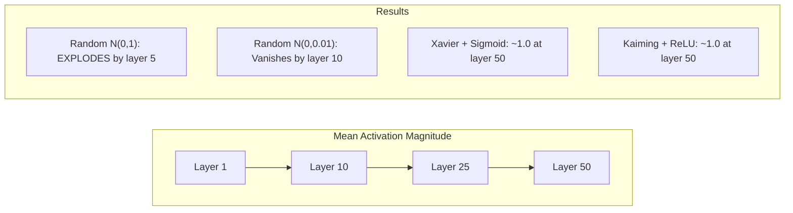
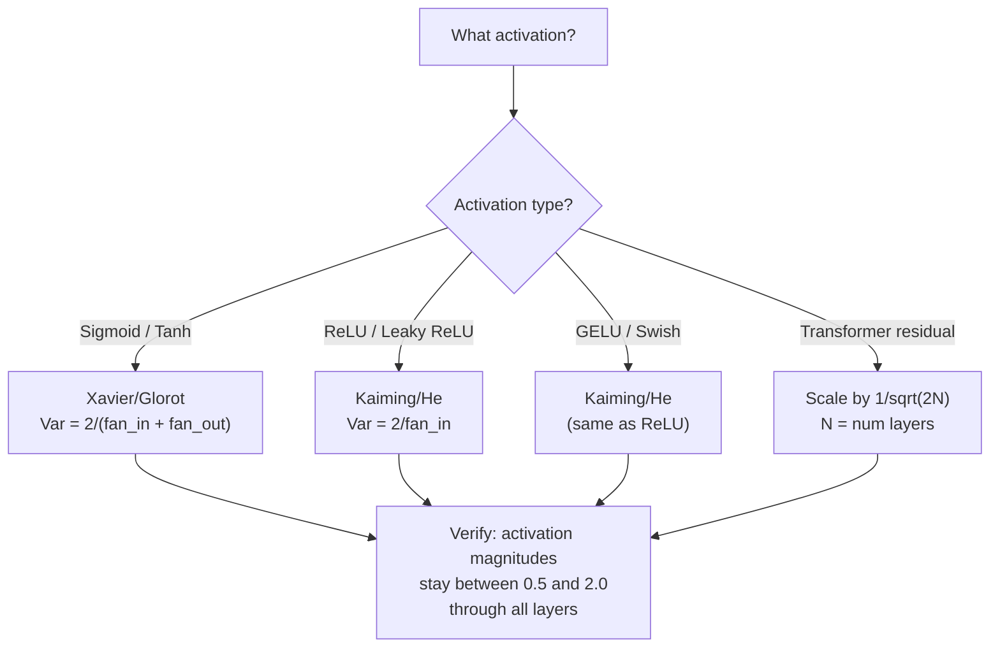

# 权重初始化与训练稳定性

> 初始化不当，训练就无从开始；初始化得当，50 层也能像 3 层一样顺畅地训练。

**Type:** Build
**Languages:** Python
**Prerequisites:** 第 03.04 课（激活函数）、第 03.07 课（正则化）
**Time:** ~90 分钟

## 学习目标

- 实现零初始化、随机初始化、Xavier/Glorot 初始化和 Kaiming/He 初始化策略，并测量它们对信号经过 50 层时激活值幅度的影响
- 推导 Xavier 初始化为何使用 Var(w) = 2/(fan_in + fan_out)，而 Kaiming 初始化使用 Var(w) = 2/fan_in
- 演示零初始化的对称性问题，并解释为什么仅有随机初始化的尺度还不够
- 为激活函数匹配正确的初始化策略：sigmoid/tanh 使用 Xavier，ReLU/GELU 使用 Kaiming

## 要解决的问题

把所有权重初始化为零，网络就学不到东西。每个神经元计算相同的函数，接收相同的梯度，进行相同的更新。经过 10,000 个训练轮后，包含 512 个神经元的隐藏层仍然只是同一个神经元的 512 份副本。你付出了 512 个参数的代价，却只得到了 1 个参数的效果。

把权重初始化得过大，激活值就会在网络中爆炸。到第 10 层，数值达到 1e15；到第 20 层，就会溢出为无穷大。梯度会沿相反方向经历同样的变化。

从标准正态分布中随机初始化权重，在 3 层网络中可行。到了 50 层，只要随机初始化的尺度稍小或稍大，信号就会分别坍缩至零或爆炸至无穷大。“可用”与“失效”之间的界限极其狭窄。

权重初始化是深度学习中最被低估的决策。架构会成为论文主题，优化器会成为博客文章主题，初始化却往往只占一个脚注。但初始化一旦出错，其他一切都无济于事，因为网络在训练开始前就已失效。

## 核心概念

### 对称性问题

同一层的每个神经元都有相同的结构：输入乘以权重，加上偏置，再应用激活函数。如果所有权重都从同一个值开始（零是极端情况），每个神经元就会计算出相同的输出。在反向传播过程中，每个神经元接收相同的梯度；在更新步骤中，每个神经元的改变量也相同。

这样就陷入了僵局。网络虽然有数百个参数，但它们始终同步变化。这称为对称性（symmetry），随机初始化则是打破对称性的直接办法。每个神经元从权重空间（weight space）中的不同位置出发，因此会学到不同的特征。

但仅有“随机”还不够。随机性的 *尺度* 决定了网络能否训练。

### 方差在各层间的传播

考虑一个有 fan_in 个输入的单层，其中 fan_in 表示输入连接数（fan-in）：

```text
z = w1*x1 + w2*x2 + ... + w_n*x_n
```

如果每个权重 wi 都从方差为 Var(w) 的分布中抽取，且每个输入 xi 的方差为 Var(x)，那么输出方差为：

```text
Var(z) = fan_in * Var(w) * Var(x)
```

如果 Var(w) = 1 且 fan_in = 512，输出方差就是输入方差的 512 倍。经过 10 层后：512^10 = 1.2e27。信号已经爆炸。

如果 Var(w) = 0.001，输出方差每经过一层就按 0.001 * 512 = 0.512 的比例缩小。经过 10 层后：0.512^10 = 0.00013。信号已经消失。

目标是选择合适的 Var(w)，使 Var(z) = Var(x)，让信号幅度在各层间保持不变。

### Xavier/Glorot 初始化

Glorot 和 Bengio（2010）针对 sigmoid 和 tanh 激活函数推导了解法。为了让方差在前向和反向传播中都保持不变：

```text
Var(w) = 2 / (fan_in + fan_out)
```

实际使用时，从以下分布中抽取权重：

```text
w ~ Uniform(-limit, limit)  where limit = sqrt(6 / (fan_in + fan_out))
```

或：

```text
w ~ Normal(0, sqrt(2 / (fan_in + fan_out)))
```

这种方法之所以有效，是因为 sigmoid 和 tanh 在零附近大致呈线性，而恰当初始化后的激活值就位于这一区域。方差经过数十层后仍保持稳定。

### Kaiming/He 初始化

ReLU 会将一半输出置零（所有负值都变为零）。由于平均有一半输入被置零，有效 fan_in 也随之减半。Xavier 初始化没有考虑这一点，因此低估了所需的方差。

He 等人（2015）调整了公式：

```text
Var(w) = 2 / fan_in
```

权重从以下分布中抽取：

```text
w ~ Normal(0, sqrt(2 / fan_in))
```

系数 2 用来补偿 ReLU 将一半激活值置零的影响。没有它，信号每经过一层就会缩小到约 0.5 倍。经过 50 层后：0.5^50 = 8.8e-16。Kaiming 初始化可以避免这种情况。

### Transformer 初始化

GPT-2 引入了另一种模式。残差连接（residual connection）将每个子层的输出加到其输入上：

```text
x = x + sublayer(x)
```

每次相加都会增大方差。对于 N 个残差层，方差会随 N 成比例增长。GPT-2 将残差层的权重乘以 1/sqrt(2N)，其中 N 是层数。这种残差缩放（residual scaling）使累积的信号幅度保持稳定。

Llama 3（405B 个参数，126 层）采用类似方案。如果没有这种缩放，残差流（residual stream）在经过 126 层注意力块和前馈块时就会无界增长。

```mermaid
flowchart TD
    subgraph "Zero Init"
        Z1["Layer 1<br/>All weights = 0"] --> Z2["Layer 2<br/>All neurons identical"]
        Z2 --> Z3["Layer 3<br/>Still identical"]
        Z3 --> ZR["Result: 1 effective neuron<br/>regardless of width"]
    end

    subgraph "Xavier Init"
        X1["Layer 1<br/>Var = 2/(fan_in+fan_out)"] --> X2["Layer 2<br/>Signal stable"]
        X2 --> X3["Layer 50<br/>Signal stable"]
        X3 --> XR["Result: Trains with<br/>sigmoid/tanh"]
    end

    subgraph "Kaiming Init"
        K1["Layer 1<br/>Var = 2/fan_in"] --> K2["Layer 2<br/>Signal stable"]
        K2 --> K3["Layer 50<br/>Signal stable"]
        K3 --> KR["Result: Trains with<br/>ReLU/GELU"]
    end
```



### 信号经过 50 层时的激活值幅度



### 选择合适的初始化策略



```figure
weight-init-variance
```

## 动手实现

### 步骤 1：初始化策略

下面是初始化权重矩阵的四种方法。每种方法都返回一个列表的列表（2D 矩阵），包含 fan_in 列、fan_out 行，其中 fan_out 表示输出连接数（fan-out）。

```python
import math
import random


def zero_init(fan_in, fan_out):
    return [[0.0 for _ in range(fan_in)] for _ in range(fan_out)]


def random_init(fan_in, fan_out, scale=1.0):
    return [[random.gauss(0, scale) for _ in range(fan_in)] for _ in range(fan_out)]


def xavier_init(fan_in, fan_out):
    std = math.sqrt(2.0 / (fan_in + fan_out))
    return [[random.gauss(0, std) for _ in range(fan_in)] for _ in range(fan_out)]


def kaiming_init(fan_in, fan_out):
    std = math.sqrt(2.0 / fan_in)
    return [[random.gauss(0, std) for _ in range(fan_in)] for _ in range(fan_out)]
```

### 步骤 2：激活函数

我们需要 sigmoid、tanh 和 ReLU，以便用各初始化策略所对应的激活函数进行测试。

```python
def sigmoid(x):
    x = max(-500, min(500, x))
    return 1.0 / (1.0 + math.exp(-x))


def tanh_act(x):
    return math.tanh(x)


def relu(x):
    return max(0.0, x)
```

### 步骤 3：经过 50 层的前向传播

让随机数据通过一个深层网络，并测量每层激活值幅度的平均值。

```python
def forward_deep(init_fn, activation_fn, n_layers=50, width=64, n_samples=100):
    random.seed(42)
    layer_magnitudes = []

    inputs = [[random.gauss(0, 1) for _ in range(width)] for _ in range(n_samples)]

    for layer_idx in range(n_layers):
        weights = init_fn(width, width)
        biases = [0.0] * width

        new_inputs = []
        for sample in inputs:
            output = []
            for neuron_idx in range(width):
                z = sum(weights[neuron_idx][j] * sample[j] for j in range(width)) + biases[neuron_idx]
                output.append(activation_fn(z))
            new_inputs.append(output)
        inputs = new_inputs

        magnitudes = []
        for sample in inputs:
            magnitudes.append(sum(abs(v) for v in sample) / width)
        mean_mag = sum(magnitudes) / len(magnitudes)
        layer_magnitudes.append(mean_mag)

    return layer_magnitudes
```

### 步骤 4：实验

运行所有组合：零初始化、随机 N(0,1)、随机 N(0,0.01)、Xavier 配 sigmoid、Xavier 配 tanh、Kaiming 配 ReLU。打印关键层的幅度。

```python
def run_experiment():
    configs = [
        ("Zero init + Sigmoid", lambda fi, fo: zero_init(fi, fo), sigmoid),
        ("Random N(0,1) + ReLU", lambda fi, fo: random_init(fi, fo, 1.0), relu),
        ("Random N(0,0.01) + ReLU", lambda fi, fo: random_init(fi, fo, 0.01), relu),
        ("Xavier + Sigmoid", xavier_init, sigmoid),
        ("Xavier + Tanh", xavier_init, tanh_act),
        ("Kaiming + ReLU", kaiming_init, relu),
    ]

    print(f"{'Strategy':<30} {'L1':>10} {'L5':>10} {'L10':>10} {'L25':>10} {'L50':>10}")
    print("-" * 80)

    for name, init_fn, act_fn in configs:
        mags = forward_deep(init_fn, act_fn)
        row = f"{name:<30}"
        for idx in [0, 4, 9, 24, 49]:
            val = mags[idx]
            if val > 1e6:
                row += f" {'EXPLODED':>10}"
            elif val < 1e-6:
                row += f" {'VANISHED':>10}"
            else:
                row += f" {val:>10.4f}"
        print(row)
```

### 步骤 5：对称性演示

展示零初始化如何产生相同的神经元。

```python
def symmetry_demo():
    random.seed(42)
    weights = zero_init(2, 4)
    biases = [0.0] * 4

    inputs = [0.5, -0.3]
    outputs = []
    for neuron_idx in range(4):
        z = sum(weights[neuron_idx][j] * inputs[j] for j in range(2)) + biases[neuron_idx]
        outputs.append(sigmoid(z))

    print("\nSymmetry Demo (4 neurons, zero init):")
    for i, out in enumerate(outputs):
        print(f"  Neuron {i}: output = {out:.6f}")
    all_same = all(abs(outputs[i] - outputs[0]) < 1e-10 for i in range(len(outputs)))
    print(f"  All identical: {all_same}")
    print(f"  Effective parameters: 1 (not {len(weights) * len(weights[0])})")
```

### 步骤 6：逐层幅度报告

打印直观的条形图，展示激活值经过 50 层时的幅度。

```python
def magnitude_report(name, magnitudes):
    print(f"\n{name}:")
    for i, mag in enumerate(magnitudes):
        if i % 5 == 0 or i == len(magnitudes) - 1:
            if mag > 1e6:
                bar = "X" * 50 + " EXPLODED"
            elif mag < 1e-6:
                bar = "." + " VANISHED"
            else:
                bar_len = min(50, max(1, int(mag * 10)))
                bar = "#" * bar_len
            print(f"  Layer {i+1:3d}: {bar} ({mag:.6f})")
```

## 实际使用

PyTorch 提供了对应的内置函数：

```python
import torch
import torch.nn as nn

layer = nn.Linear(512, 256)

nn.init.xavier_uniform_(layer.weight)
nn.init.xavier_normal_(layer.weight)

nn.init.kaiming_uniform_(layer.weight, nonlinearity='relu')
nn.init.kaiming_normal_(layer.weight, nonlinearity='relu')

nn.init.zeros_(layer.bias)
```

调用 `nn.Linear(512, 256)` 时，PyTorch 默认使用 Kaiming 均匀初始化。这就是大多数简单网络“直接就能用”的原因：PyTorch 已经替你作出了正确选择。但在构建自定义架构或深度超过 20 层时，你需要理解其中的机制，并可能需要覆盖默认设置。

对于 Transformer，HuggingFace 模型通常在 `_init_weights` 方法中处理初始化。GPT-2 的实现会将残差投影乘以 1/sqrt(N)。如果从零构建 Transformer，你需要自行添加这一处理。

## 交付成果

本课产出：
- `outputs/prompt-init-strategy.md`：一份提示词（prompt），用于诊断权重初始化问题并推荐合适的策略

## 练习

1. 添加 LeCun 初始化（Var = 1/fan_in，针对 SELU，即缩放指数线性单元激活函数设计）。使用 LeCun 初始化 + tanh 运行 50 层实验，并与 Xavier + tanh 比较。

2. 实现 GPT-2 的残差缩放：在将每层输出加到残差流之前，先乘以 1/sqrt(2*N)。分别在使用和不使用缩放的情况下运行 50 层，测量残差幅度增长的速度。

3. 创建一个“初始化健康检查”函数，接收网络各层的维度和激活函数类型，然后推荐正确的初始化策略，并在当前初始化可能引发问题时发出警告。

4. 分别使用 fan_in = 16 和 fan_in = 1024 运行实验。Xavier 和 Kaiming 会适应 fan_in，随机初始化则不会。展示随着层宽增大，“可用”与“失效”之间的差距如何扩大。

5. 实现正交初始化（orthogonal initialization）：生成随机矩阵，计算其奇异值分解（SVD），使用正交矩阵 U。在 50 层 ReLU 网络中，将其与 Kaiming 比较。

## 关键术语

| 术语 | 常见说法 | 实际含义 |
|------|----------------|----------------------|
| 权重初始化 | “随机设置初始权重” | 选择初始权重值的策略，决定网络能否训练 |
| 打破对称性 | “让神经元彼此不同” | 利用随机初始化确保神经元学到不同的特征，而不是计算相同的函数 |
| 输入连接数（fan-in） | “一个神经元的输入数量” | 传入连接的数量，决定输入方差如何在加权求和中累积 |
| 输出连接数（fan-out） | “一个神经元的输出数量” | 传出连接的数量，与反向传播中维持梯度方差有关 |
| Xavier/Glorot 初始化 | “sigmoid 的初始化方法” | Var(w) = 2/(fan_in + fan_out)，旨在让方差经过 sigmoid 和 tanh 激活函数后保持不变 |
| Kaiming/He 初始化 | “ReLU 的初始化方法” | Var(w) = 2/fan_in，考虑了 ReLU 将一半激活值置零的影响 |
| 方差传播（variance propagation） | “信号在各层间如何增大或缩小” | 根据权重尺度，对激活值方差的逐层变化所做的数学分析 |
| 残差缩放 | “GPT-2 的初始化技巧” | 将残差连接权重乘以 1/sqrt(2N)，以防止方差在 N 个 Transformer 层中逐步增长 |
| 失效的网络 | “什么都训练不了” | 初始化不当导致所有梯度为零或所有激活值饱和的网络 |
| 激活值爆炸 | “数值趋向无穷大” | 权重方差过大，导致激活值幅度在各层间呈指数增长 |

## 延伸阅读

- Glorot & Bengio，"Understanding the difficulty of training deep feedforward neural networks"（2010）：提出 Xavier 初始化的原始论文，包含方差分析
- He 等人，"Delving Deep into Rectifiers"（2015）：提出用于 ReLU 网络的 Kaiming 初始化
- Radford 等人，"Language Models are Unsupervised Multitask Learners"（2019）：介绍残差缩放初始化的 GPT-2 论文
- Mishkin & Matas，"All You Need is a Good Init"（2016）：逐层单位方差初始化，是解析公式之外的一种经验性方法
