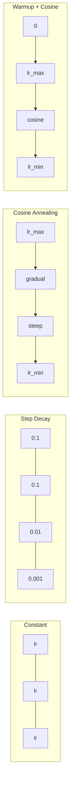
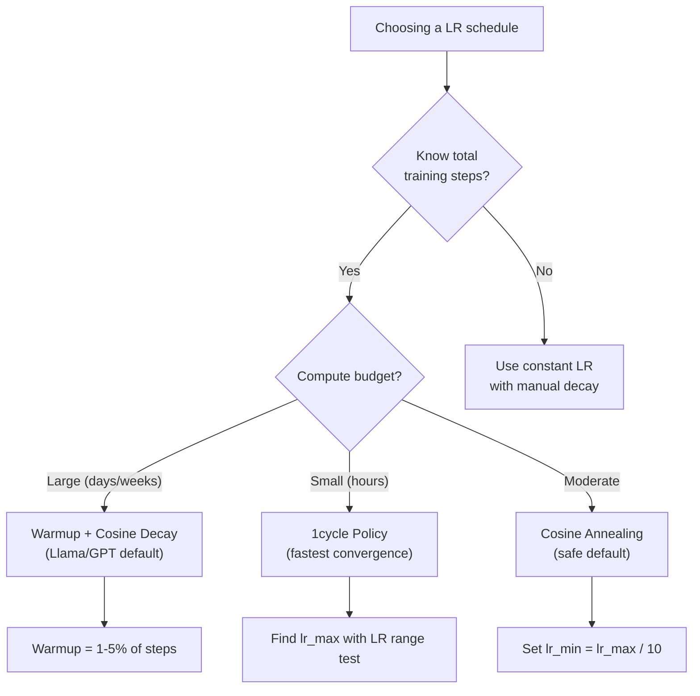
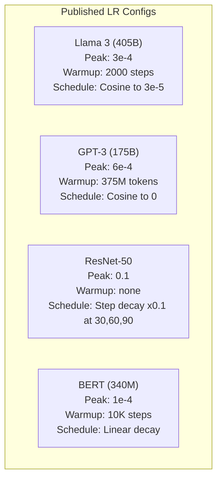

# 学习率调度与预热

> 学习率（learning rate）是最重要的超参数。不是架构，不是数据集大小，也不是激活函数，而是学习率。如果其他参数都不调，也一定要调它。

**Type:** Build
**Languages:** Python
**Prerequisites:** 第 03.06 课（优化器），第 03.08 课（权重初始化）
**Time:** ~90 分钟

## 学习目标

- 从零实现恒定学习率、阶梯衰减（step decay）、余弦退火（cosine annealing）、预热（warmup）+ 余弦及 1cycle 学习率调度（schedule）
- 演示学习率选择的三种失败模式：发散（过高）、停滞（过低）和振荡（不衰减）
- 解释为什么基于 Adam 的优化器需要预热，以及预热如何稳定训练初期
- 在同一任务上比较全部五种调度的收敛速度，并根据给定训练预算选择合适的方案

## 要解决的问题

把学习率设为 0.1，训练就会发散：损失在 3 步内跃升至无穷大。设为 0.0001，训练则慢如蜗牛：经过 100 轮（epoch），模型仍几乎停留在随机状态。设为 0.01，训练能顺利进行 50 轮，随后损失就会在一个始终无法到达的极小值附近振荡，因为步子太大了。

最优学习率不是常数，而是会随训练改变。训练初期，你希望迈大步，快速推进；训练后期，你希望迈小步，稳定在一个尖锐极小值上。准确率为 90% 和 95% 的模型之间，差别往往只在调度方案。

过去三年发布的每个主要模型都使用学习率调度。Llama 3 的峰值 lr=3e-4，预热 2000 步，再通过余弦衰减降至 3e-5。GPT-3 使用 lr=6e-4，在 375 million（百万）个 token（词元）上进行预热。这些选择并非随意做出，而是耗资数百万美元的大规模超参数搜索的结果。

你需要理解调度，因为默认配置无法适合你的问题。微调（fine-tuning）预训练模型时，合适的调度与从零训练不同。增大批量大小时，预热时长也需要改变。当训练在第 10,000 步出问题时，你需要知道是调度导致的，还是另有原因。

## 核心概念

### 恒定学习率

最简单的方法：选一个数，每一步都用它。

```text
lr(t) = lr_0
```

这很少是最优选择。它要么在训练后期过高（在极小值附近振荡），要么在训练初期过低（把算力浪费在微小的步长上）。对小模型和调试来说还不错，但对于任何训练超过一小时的任务，都是糟糕的选择。

### 阶梯衰减

这是 ResNet 时代的老派方法。在固定轮次将学习率按一个因子降低（通常降低 10x）。

```text
lr(t) = lr_0 * gamma^(floor(epoch / step_size))
```

其中，gamma = 0.1 且 step_size = 30 表示：每 30 轮将 lr 降低 10x。ResNet-50 就用了这种方法：lr=0.1，在第 30、60 和 90 轮各降低 10x。

问题在于，最优衰减时点取决于数据集和架构。换一个问题，你就需要重新调整何时降低学习率。这种切换很突兀：学习率突然变化时，损失可能猛增。

### 余弦退火

沿着余弦曲线，从最大学习率平滑衰减至最小值：

```text
lr(t) = lr_min + 0.5 * (lr_max - lr_min) * (1 + cos(pi * t / T))
```

其中，t 是当前步，T 是总步数。

在 t=0 时，余弦项为 1，因此 lr = lr_max。在 t=T 时，余弦项为 -1，因此 lr = lr_min。衰减起初较缓，中间加速，接近结束时又趋于平缓。

这是大多数现代训练运行的默认方案。除了 lr_max 和 lr_min，没有其他超参数需要调节。余弦形状符合这样一个经验观察：大部分学习发生在训练中期，因此在这段关键时期，你需要合理的步长。

### 预热：为什么要从小学习率开始

Adam 和其他自适应优化器持续估计梯度的均值和方差。在第 0 步，这些估计值都初始化为零。最初几次梯度更新依据的是不可靠的统计量。如果这期间学习率很大，模型就会迈出巨大且方向不佳的步子。

预热可以解决这个问题。从很小的学习率开始（通常是 lr_max / warmup_steps，甚至为零），在前 N 步线性增大到 lr_max。等达到完整学习率时，Adam 的统计量已经稳定下来。

```text
lr(t) = lr_max * (t / warmup_steps)     for t < warmup_steps
```

典型预热时长为总训练步数的 1-5%。Llama 3 使用 ~1.8 trillion（万亿）个 token 进行训练，预热 2000 步。GPT-3 在 375 million（百万）个 token 上进行预热。

### 线性预热 + 余弦衰减

现代默认方案：先线性上升，再按余弦衰减：

```text
if t < warmup_steps:
    lr(t) = lr_max * (t / warmup_steps)
else:
    progress = (t - warmup_steps) / (total_steps - warmup_steps)
    lr(t) = lr_min + 0.5 * (lr_max - lr_min) * (1 + cos(pi * progress))
```

Llama、GPT、PaLM 以及大多数现代 Transformer 都使用这种方案。预热防止训练初期不稳定，余弦衰减则让模型稳定在一个良好的极小值上。

### 1cycle 策略

Leslie Smith 的发现（2018）：在训练前半段，将学习率从低值增大到高值，再在后半段降下来。这有些反直觉：为什么要在训练途中 *增大* 学习率？

其理论是：高学习率向优化轨迹注入噪声，从而起到正则化作用。在学习率上升阶段，模型探索更广的损失曲面，找到更好的吸引域；在下降阶段，则在已找到的最佳吸引域内进一步细化。

```text
Phase 1 (0 to T/2):    lr ramps from lr_max/25 to lr_max
Phase 2 (T/2 to T):    lr ramps from lr_max to lr_max/10000
```

在固定算力预算下，1cycle 的训练通常比余弦退火更快。代价是：必须预先知道总步数。

### 调度曲线形状



### 决策流程图



### 已发表模型的实际配置数值



```figure
lr-schedule
```

## 动手实现

### 步骤 1：调度函数

每个函数接收当前步数，并返回该步的学习率。

```python
import math


def constant_schedule(step, lr=0.01, **kwargs):
    return lr


def step_decay_schedule(step, lr=0.1, step_size=100, gamma=0.1, **kwargs):
    return lr * (gamma ** (step // step_size))


def cosine_schedule(step, lr=0.01, total_steps=1000, lr_min=1e-5, **kwargs):
    if step >= total_steps:
        return lr_min
    return lr_min + 0.5 * (lr - lr_min) * (1 + math.cos(math.pi * step / total_steps))


def warmup_cosine_schedule(step, lr=0.01, total_steps=1000, warmup_steps=100, lr_min=1e-5, **kwargs):
    if total_steps <= warmup_steps:
        return lr * (step / max(warmup_steps, 1))
    if step < warmup_steps:
        return lr * step / warmup_steps
    progress = (step - warmup_steps) / (total_steps - warmup_steps)
    return lr_min + 0.5 * (lr - lr_min) * (1 + math.cos(math.pi * progress))


def one_cycle_schedule(step, lr=0.01, total_steps=1000, **kwargs):
    mid = max(total_steps // 2, 1)
    if step < mid:
        return (lr / 25) + (lr - lr / 25) * step / mid
    else:
        progress = (step - mid) / max(total_steps - mid, 1)
        return lr * (1 - progress) + (lr / 10000) * progress
```

### 步骤 2：可视化所有调度

打印基于文本的图，展示每种调度在训练过程中的变化。

```python
def visualize_schedule(name, schedule_fn, total_steps=500, **kwargs):
    steps = list(range(0, total_steps, total_steps // 20))
    if total_steps - 1 not in steps:
        steps.append(total_steps - 1)

    lrs = [schedule_fn(s, total_steps=total_steps, **kwargs) for s in steps]
    max_lr = max(lrs) if max(lrs) > 0 else 1.0

    print(f"\n{name}:")
    for s, lr_val in zip(steps, lrs):
        bar_len = int(lr_val / max_lr * 40)
        bar = "#" * bar_len
        print(f"  Step {s:4d}: lr={lr_val:.6f} {bar}")
```

### 步骤 3：训练网络

沿用前几课在圆形数据集上的简单两层网络，但这次要改变调度方案。

```python
import random


def sigmoid(x):
    x = max(-500, min(500, x))
    return 1.0 / (1.0 + math.exp(-x))


def relu(x):
    return max(0.0, x)


def relu_deriv(x):
    return 1.0 if x > 0 else 0.0


def make_circle_data(n=200, seed=42):
    random.seed(seed)
    data = []
    for _ in range(n):
        x = random.uniform(-2, 2)
        y = random.uniform(-2, 2)
        label = 1.0 if x * x + y * y < 1.5 else 0.0
        data.append(([x, y], label))
    return data


def train_with_schedule(schedule_fn, schedule_name, data, epochs=300, base_lr=0.05, **kwargs):
    random.seed(0)
    hidden_size = 8
    total_steps = epochs * len(data)

    std = math.sqrt(2.0 / 2)
    w1 = [[random.gauss(0, std) for _ in range(2)] for _ in range(hidden_size)]
    b1 = [0.0] * hidden_size
    w2 = [random.gauss(0, std) for _ in range(hidden_size)]
    b2 = 0.0

    step = 0
    epoch_losses = []

    for epoch in range(epochs):
        total_loss = 0
        correct = 0

        for x, target in data:
            lr = schedule_fn(step, lr=base_lr, total_steps=total_steps, **kwargs)

            z1 = []
            h = []
            for i in range(hidden_size):
                z = w1[i][0] * x[0] + w1[i][1] * x[1] + b1[i]
                z1.append(z)
                h.append(relu(z))

            z2 = sum(w2[i] * h[i] for i in range(hidden_size)) + b2
            out = sigmoid(z2)

            error = out - target
            d_out = error * out * (1 - out)

            for i in range(hidden_size):
                d_h = d_out * w2[i] * relu_deriv(z1[i])
                w2[i] -= lr * d_out * h[i]
                for j in range(2):
                    w1[i][j] -= lr * d_h * x[j]
                b1[i] -= lr * d_h
            b2 -= lr * d_out

            total_loss += (out - target) ** 2
            if (out >= 0.5) == (target >= 0.5):
                correct += 1
            step += 1

        avg_loss = total_loss / len(data)
        accuracy = correct / len(data) * 100
        epoch_losses.append(avg_loss)

    return epoch_losses
```

### 步骤 4：比较所有调度

使用每种调度训练同一个网络，并比较最终损失和收敛行为。

```python
def compare_schedules(data):
    configs = [
        ("Constant", constant_schedule, {}),
        ("Step Decay", step_decay_schedule, {"step_size": 15000, "gamma": 0.1}),
        ("Cosine", cosine_schedule, {"lr_min": 1e-5}),
        ("Warmup+Cosine", warmup_cosine_schedule, {"warmup_steps": 3000, "lr_min": 1e-5}),
        ("1cycle", one_cycle_schedule, {}),
    ]

    print(f"\n{'Schedule':<20} {'Start Loss':>12} {'Mid Loss':>12} {'End Loss':>12} {'Best Loss':>12}")
    print("-" * 70)

    for name, schedule_fn, extra_kwargs in configs:
        losses = train_with_schedule(schedule_fn, name, data, epochs=300, base_lr=0.05, **extra_kwargs)
        mid_idx = len(losses) // 2
        best = min(losses)
        print(f"{name:<20} {losses[0]:>12.6f} {losses[mid_idx]:>12.6f} {losses[-1]:>12.6f} {best:>12.6f}")
```

### 步骤 5：LR 过高与过低

演示三种失败模式：过高（发散）、过低（进展缓慢），以及恰到好处。

```python
def lr_sensitivity(data):
    learning_rates = [1.0, 0.1, 0.01, 0.001, 0.0001]

    print("\nLR Sensitivity (constant schedule, 100 epochs):")
    print(f"  {'LR':>10} {'Start Loss':>12} {'End Loss':>12} {'Status':>15}")
    print("  " + "-" * 52)

    for lr in learning_rates:
        losses = train_with_schedule(constant_schedule, f"lr={lr}", data, epochs=100, base_lr=lr)
        start = losses[0]
        end = losses[-1]

        if end > start or math.isnan(end) or end > 1.0:
            status = "DIVERGED"
        elif end > start * 0.9:
            status = "BARELY MOVED"
        elif end < 0.15:
            status = "CONVERGED"
        else:
            status = "LEARNING"

        end_str = f"{end:.6f}" if not math.isnan(end) else "NaN"
        print(f"  {lr:>10.4f} {start:>12.6f} {end_str:>12} {status:>15}")
```

## 实际使用

PyTorch 在 `torch.optim.lr_scheduler` 中提供调度器：

```python
import torch
import torch.optim as optim
from torch.optim.lr_scheduler import CosineAnnealingLR, OneCycleLR, StepLR

model = nn.Sequential(nn.Linear(10, 64), nn.ReLU(), nn.Linear(64, 1))
optimizer = optim.Adam(model.parameters(), lr=3e-4)

scheduler = CosineAnnealingLR(optimizer, T_max=1000, eta_min=1e-5)

for step in range(1000):
    loss = train_step(model, optimizer)
    scheduler.step()
```

对于预热 + 余弦，可以使用 lambda 调度器，或 HuggingFace 的 `get_cosine_schedule_with_warmup`：

```python
from transformers import get_cosine_schedule_with_warmup

scheduler = get_cosine_schedule_with_warmup(
    optimizer,
    num_warmup_steps=2000,
    num_training_steps=100000,
)
```

大多数 Llama 和 GPT 微调脚本都使用这个 HuggingFace 函数。拿不准时，就用预热 + 余弦，并将预热设为总步数的 3-5%。它几乎适用于所有情况。

## 交付成果

本课产出：
- `outputs/prompt-lr-schedule-advisor.md`：一个提示词（prompt），根据你的训练配置推荐合适的学习率调度和超参数

## 练习

1. 实现指数衰减：lr(t) = lr_0 * gamma^t，其中 gamma = 0.999。在圆形数据集上与余弦退火比较。

2. 实现学习率范围测试（LR range test，Leslie Smith）：训练几百步，同时将 LR 从 1e-7 指数增大至 1。绘制损失与 LR 的关系图。最优的最大 LR 位于损失开始上升之前。

3. 使用预热 + 余弦训练，但改变预热长度：分别设为总步数的 0%、1%、5%、10%、20%。找到训练最稳定的最佳点。

4. 实现带热重启（warm restarts）的余弦退火（SGDR）：每隔 T 步将学习率重设为 lr_max，然后再次衰减。在较长的训练运行中与标准余弦方案比较。

5. 构建一个“调度外科医生”：监测训练损失，损失稳定时自动从预热切换到余弦；如果损失在平台期停留过久，则降低 lr。

## 关键术语

| 术语 | 常见说法 | 实际含义 |
|------|----------------|----------------------|
| 学习率 | “模型学得有多快” | 与梯度相乘、决定参数更新幅度的标量 |
| 调度 | “随时间改变 LR” | 将训练步映射为学习率、旨在优化收敛的函数 |
| 预热 | “从小 LR 开始” | 在前 N 步将 LR 从接近零线性增大到目标值，以稳定优化器统计量 |
| 余弦退火 | “平滑的 LR 衰减” | 在训练过程中沿余弦曲线将 LR 从 lr_max 降至 lr_min |
| 阶梯衰减 | “在里程碑处降低 LR” | 每隔固定轮数将 LR 乘以一个因子（通常为 0.1） |
| 1cycle 策略 | “先升后降” | Leslie Smith 提出的在单个周期内让 LR 先升后降、以加快收敛的方法 |
| 学习率范围测试 | “找到最佳学习率” | 进行短时间训练并增大 LR，找到损失开始发散时的值 |
| 带热重启的余弦调度 | “重设后重复” | 周期性地将 LR 重设为 lr_max，再次衰减（SGDR） |
| Eta min（学习率下限） | “LR 的下限” | 调度最终衰减到的最小学习率 |
| 峰值学习率 | “最大的 LR” | 训练过程中达到的最高 LR，通常出现在预热之后 |

## 延伸阅读

- Loshchilov & Hutter，"SGDR: Stochastic Gradient Descent with Warm Restarts"（2017）：提出余弦退火和热重启
- Smith，"Super-Convergence: Very Fast Training of Neural Networks Using Large Learning Rates"（2018）：提出 1cycle 策略的论文
- Touvron et al.，"Llama 2: Open Foundation and Fine-Tuned Chat Models"（2023）：记录大规模训练所用的预热 + 余弦调度
- Goyal et al.，"Accurate, Large Minibatch SGD: Training ImageNet in 1 Hour"（2017）：大批量训练的线性缩放规则和预热
