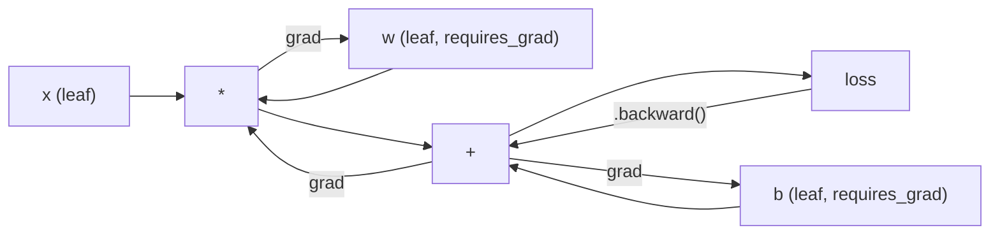
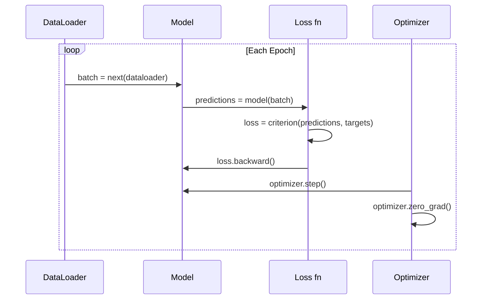

# PyTorch 入门

> 你已经用活塞和曲轴组装出了引擎。现在，来学学大家真正拿来驱动车辆的那一款。

**Type:** Build
**Languages:** Python
**Prerequisites:** 第 03.10 课（构建你自己的迷你框架）
**Time:** ~75 分钟

## 学习目标

- 使用 PyTorch 的 nn.Module、nn.Sequential 和 autograd（自动求导）构建并训练神经网络
- 使用 PyTorch 张量（tensor）、GPU 加速和标准训练循环（zero_grad、forward、loss、backward、step）
- 将从零实现的迷你框架组件转换为对应的 PyTorch 组件
- 对纯 Python 框架与 PyTorch 在同一任务上的训练速度进行性能分析和比较

## 要解决的问题

你已经有了一个能运行的迷你框架。线性层、ReLU、Dropout（随机失活）、批量归一化、Adam、DataLoader（数据加载器）和训练循环，一应俱全。它用纯 Python 在圆形区域分类问题上训练一个 4 层网络。

不过，在同一个问题上，它的运行耗时也是 PyTorch 的 500 倍。

你的迷你框架用嵌套的 Python 循环，每次处理一个样本。PyTorch 则将相同的运算交给经过优化、在 GPU 上运行的 C++/CUDA 计算内核。在单张 NVIDIA A100 上，PyTorch 用 ImageNet（1.28M 张图像）训练 ResNet-50（25.6M 个参数）大约需要 6 小时。你的框架执行同一任务大约需要 3,000 小时，前提是它没有先耗尽内存。

速度并非唯一的差距。你的框架不支持 GPU，也没有自动微分：每个模块的 backward() 都是你手写的。它没有序列化、分布式训练或混合精度支持。除了 print 语句，你也没有别的办法调试梯度流。

PyTorch 补齐了所有这些短板，同时完整保留了你已经建立的思维模型：Module、forward()、parameters()、backward()、optimizer.step()。概念一一对应，语法几乎一样。区别在于，PyTorch 把十年的系统工程积累封装在了与你从零设计的接口相同的接口背后。

## 核心概念

### PyTorch 为什么胜出

2015 年，TensorFlow 要求你先定义静态计算图，才能运行任何运算。你先构建图、编译图，再把数据送入图中。调试意味着盯着计算图的可视化结果。改变架构则意味着从头重建计算图。

PyTorch 于 2017 年推出，采用了另一种理念：即时执行（eager execution）。你写下 Python，它就立即运行。`y = model(x)` 会当场计算 y，而不是“向图中添加一个稍后才会计算 y 的节点”。这意味着标准 Python 调试工具都能使用。print() 能用，pdb 能用，前向传播中的 if/else 也能用。

到 2020 年，市场已经给出了答案。PyTorch 在机器学习研究论文中的使用占比从 7%（2017 年）升至超过 75%（2022 年）。Meta、Google DeepMind、OpenAI、Anthropic 和 Hugging Face 都以 PyTorch 为主要框架。TensorFlow 2.x 随后也采用了即时执行，这相当于默认 PyTorch 的设计是正确的。

这带来的启示是：开发者体验会产生复利效应。一个运行速度慢 10%、但调试速度快 50% 的框架，总能胜出。

### 张量

张量是一个多维数组，具有三个关键属性：形状（shape）、数据类型（dtype）和设备（device）。

```python
import torch

x = torch.zeros(3, 4)           # shape: (3, 4), dtype: float32, device: cpu
x = torch.randn(2, 3, 224, 224) # batch of 2 RGB images, 224x224
x = torch.tensor([1, 2, 3])     # from a Python list
```

**形状** 表示维度信息。标量的形状是 ()，向量是 (n,)，矩阵是 (m, n)，一批图像是 (batch, channels, height, width)。

**数据类型** 控制精度和内存占用。

| dtype | 位数 | 范围 | 使用场景 |
|-------|------|-------|----------|
| float32 | 32 | ~7 位十进制有效数字 | 默认训练 |
| float16 | 16 | ~3.3 位十进制有效数字 | 混合精度 |
| bfloat16 | 16 | 范围与 float32 相同，精度更低 | 大语言模型（LLM）训练 |
| int8 | 8 | -128 到 127 | 量化推理 |

**设备** 决定计算在哪里进行。

```python
device = torch.device("cuda" if torch.cuda.is_available() else "cpu")
x = torch.randn(3, 4, device=device)
x = x.to("cuda")
x = x.cpu()
```

每次运算都要求所有张量位于同一设备上。在初学者遇到的 PyTorch 错误中，它排第 1：`RuntimeError: Expected all tensors to be on the same device`。解决办法是在计算前把所有张量移到同一设备。

**重塑形状** 的时间复杂度是常数级，因为它改变的是元数据，而不是数据。

```python
x = torch.randn(2, 3, 4)
x.view(2, 12)      # reshape to (2, 12) -- must be contiguous
x.reshape(6, 4)    # reshape to (6, 4) -- works always
x.permute(2, 0, 1) # reorder dimensions
x.unsqueeze(0)     # add dimension: (1, 2, 3, 4)
x.squeeze()        # remove size-1 dimensions
```

### Autograd

你的迷你框架要求你为每个模块实现 backward()，PyTorch 则不需要。它将张量上的每次运算记录到一个有向无环图（计算图）中，再逆向遍历这个图，自动计算梯度。



与你的框架相比，关键区别在于：PyTorch 使用基于操作记录带的自动微分。前向传播中的每次运算都会追加到一条“记录带”上。调用 `.backward()` 就会逆序回放这条记录带。

```python
x = torch.randn(3, requires_grad=True)
y = x ** 2 + 3 * x
z = y.sum()
z.backward()
print(x.grad)  # dz/dx = 2x + 3
```

autograd 的三条规则：

1. 只有设置了 `requires_grad=True` 的叶张量才会累积梯度
2. 梯度默认会累积，因此每次反向传播前都要调用 `optimizer.zero_grad()`
3. `torch.no_grad()` 会禁用梯度跟踪，应在评估时使用

### nn.Module

`nn.Module` 是 PyTorch 中所有神经网络组件的基类。你在第 10 课已经构建过这种抽象。PyTorch 的版本增加了自动参数注册、递归模块发现、设备管理和状态字典序列化。

```python
import torch.nn as nn

class MLP(nn.Module):
    def __init__(self, input_dim, hidden_dim, output_dim):
        super().__init__()
        self.layer1 = nn.Linear(input_dim, hidden_dim)
        self.relu = nn.ReLU()
        self.layer2 = nn.Linear(hidden_dim, output_dim)

    def forward(self, x):
        x = self.layer1(x)
        x = self.relu(x)
        x = self.layer2(x)
        return x
```

在 `__init__` 中，将一个 `nn.Module` 或 `nn.Parameter` 赋给属性时，PyTorch 会自动注册它。`model.parameters()` 会递归收集每一个已注册的参数。因此，你再也不必像使用迷你框架时那样手动收集权重。

主要的构建模块：

| 模块 | 功能 | 参数量 |
|--------|-------------|------------|
| nn.Linear(in, out) | Wx + b | in*out + out |
| nn.Conv2d(in_ch, out_ch, k) | 2D 卷积 | in_ch*out_ch*k*k + out_ch |
| nn.BatchNorm1d(features) | 对激活值进行归一化 | 2 * features |
| nn.Dropout(p) | 随机置零 | 0 |
| nn.ReLU() | max(0, x) | 0 |
| nn.GELU() | 高斯误差线性函数 | 0 |
| nn.Embedding(vocab, dim) | 查找表 | vocab * dim |
| nn.LayerNorm(dim) | 逐样本归一化 | 2 * dim |

### 损失函数与优化器

你构建过的所有组件，PyTorch 都提供了可用于生产环境的版本。

**损失函数** （来自 `torch.nn`）：

| 损失函数 | 任务 | 输入 |
|------|------|-------|
| nn.MSELoss() | 回归 | 任意形状 |
| nn.CrossEntropyLoss() | 多分类 | Logits（未经归一化的分数，而非 softmax） |
| nn.BCEWithLogitsLoss() | 二分类 | Logits（而非 sigmoid） |
| nn.L1Loss() | 回归（稳健） | 任意形状 |
| nn.CTCLoss() | 序列对齐 | 对数概率 |

注意：`CrossEntropyLoss` 内部组合了 `LogSoftmax` + `NLLLoss`。应传入原始 logits，而不是 softmax 的输出。传错输入是一种常见错误，会悄无声息地产生错误的梯度。

**优化器** （来自 `torch.optim`）：

| 优化器 | 适用场景 | 典型学习率（LR） |
|-----------|-------------|-----------|
| SGD(params, lr, momentum) | 卷积神经网络（CNN）、调优充分的管线 | 0.01--0.1 |
| Adam(params, lr) | 默认起点 | 1e-3 |
| AdamW(params, lr, weight_decay) | Transformer、微调 | 1e-4--1e-3 |
| LBFGS(params) | 小规模、二阶优化 | 1.0 |

### 训练循环

每个 PyTorch 训练循环都遵循同样的 5 步模式。你在第 10 课已经学过了。



标准模式如下：

```python
for epoch in range(num_epochs):
    model.train()
    for inputs, targets in train_loader:
        inputs, targets = inputs.to(device), targets.to(device)
        optimizer.zero_grad()
        outputs = model(inputs)
        loss = criterion(outputs, targets)
        loss.backward()
        optimizer.step()
```

批次循环中的五行代码。正是这五行代码训练了 GPT-4、Stable Diffusion 和 LLaMA。架构会变，数据会变，这五行代码不变。

### Dataset 与 DataLoader

PyTorch 的 `Dataset`（数据集）是一个抽象类，具有两个方法：`__len__` 和 `__getitem__`。`DataLoader` 在其外层提供分批、打乱顺序和多进程数据加载功能。

```python
from torch.utils.data import Dataset, DataLoader

class MNISTDataset(Dataset):
    def __init__(self, images, labels):
        self.images = images
        self.labels = labels

    def __len__(self):
        return len(self.labels)

    def __getitem__(self, idx):
        return self.images[idx], self.labels[idx]

loader = DataLoader(dataset, batch_size=64, shuffle=True, num_workers=4)
```

`num_workers=4` 会启动 4 个进程，在 GPU 训练当前批次时并行加载数据。对于受磁盘限制的工作负载（大型图像、音频），仅这一项就能让训练速度翻倍。

### GPU 训练

将模型移到 GPU：

```python
device = torch.device("cuda" if torch.cuda.is_available() else "cpu")
model = model.to(device)
```

这会递归地将每个参数和缓冲区移到 GPU。随后在训练过程中移动每个批次：

```python
inputs, targets = inputs.to(device), targets.to(device)
```

**混合精度** 在现代 GPU（A100、H100、RTX 4090）上通过使用 float16 执行前向/反向传播、同时以 float32 保留主权重，使内存用量减半、吞吐量翻倍：

```python
from torch.amp import autocast, GradScaler

scaler = GradScaler()
for inputs, targets in loader:
    with autocast(device_type="cuda"):
        outputs = model(inputs)
        loss = criterion(outputs, targets)
    scaler.scale(loss).backward()
    scaler.step(optimizer)
    scaler.update()
    optimizer.zero_grad()
```

### 对比：迷你框架、PyTorch 与 JAX

| 特性 | 迷你框架（L10） | PyTorch | JAX |
|---------|---------------------|---------|-----|
| 自动微分 | 手动编写 backward() | 基于操作记录带的 autograd | 函数式变换 |
| 执行方式 | 即时执行（Python 循环） | 即时执行（C++ 计算内核） | 跟踪 + JIT 编译 |
| GPU 支持 | 无 | 有（CUDA、ROCm、MPS） | 有（CUDA、TPU） |
| 速度（MNIST 多层感知机，MLP） | ~300s/epoch | ~0.5s/epoch | ~0.3s/epoch |
| 模块系统 | 自定义 Module 类 | nn.Module | 无状态函数（Flax/Equinox） |
| 调试 | print() | print(), pdb, breakpoint() | 更困难（JIT 跟踪会使 print 失效） |
| 生态系统 | 无 | Hugging Face, Lightning, timm | Flax, Optax, Orbax |
| 学习曲线 | 由你亲手构建 | 中等 | 陡峭（函数式范式） |
| 生产应用 | 玩具问题 | Meta, OpenAI, Anthropic, HF | Google DeepMind, Midjourney |

```figure
dropout-mask
```

## 动手实现

仅使用 PyTorch 基本组件，在 MNIST 上训练一个 3 层 MLP。不使用高层封装，也不用 `torchvision.datasets`。我们自己下载并解析原始数据。

### 步骤 1：从原始文件加载 MNIST

MNIST 以 4 个 gzip 压缩文件提供：训练图像（60,000 x 28 x 28）、训练标签、测试图像（10,000 x 28 x 28）和测试标签。我们将下载这些文件并解析其二进制格式。

```python
import torch
import torch.nn as nn
import struct
import gzip
import urllib.request
import os

def download_mnist(path="./mnist_data"):
    base_url = "https://storage.googleapis.com/cvdf-datasets/mnist/"
    files = [
        "train-images-idx3-ubyte.gz",
        "train-labels-idx1-ubyte.gz",
        "t10k-images-idx3-ubyte.gz",
        "t10k-labels-idx1-ubyte.gz",
    ]
    os.makedirs(path, exist_ok=True)
    for f in files:
        filepath = os.path.join(path, f)
        if not os.path.exists(filepath):
            urllib.request.urlretrieve(base_url + f, filepath)

def load_images(filepath):
    with gzip.open(filepath, "rb") as f:
        magic, num, rows, cols = struct.unpack(">IIII", f.read(16))
        data = f.read()
        images = torch.frombuffer(bytearray(data), dtype=torch.uint8)
        images = images.reshape(num, rows * cols).float() / 255.0
    return images

def load_labels(filepath):
    with gzip.open(filepath, "rb") as f:
        magic, num = struct.unpack(">II", f.read(8))
        data = f.read()
        labels = torch.frombuffer(bytearray(data), dtype=torch.uint8).long()
    return labels
```

### 步骤 2：定义模型

一个 3 层 MLP：784 -> 256 -> 128 -> 10。使用 ReLU 激活函数和 Dropout 正则化。为了保持简单，不使用批量归一化。

```python
class MNISTModel(nn.Module):
    def __init__(self):
        super().__init__()
        self.net = nn.Sequential(
            nn.Linear(784, 256),
            nn.ReLU(),
            nn.Dropout(0.2),
            nn.Linear(256, 128),
            nn.ReLU(),
            nn.Dropout(0.2),
            nn.Linear(128, 10),
        )

    def forward(self, x):
        return self.net(x)
```

输出层产生 10 个原始 logits，每个数字对应一个。不使用 softmax，因为 `CrossEntropyLoss` 会在内部处理它。

参数量：784*256 + 256 + 256*128 + 128 + 128*10 + 10 = 235,146。按现代标准来看，这非常小。GPT-2 small 有 124M 个参数。这个模型几秒钟就能训练完成。

### 步骤 3：训练循环

标准的前向传播、计算损失、反向传播、参数更新模式。

```python
def train_one_epoch(model, loader, criterion, optimizer, device):
    model.train()
    total_loss = 0
    correct = 0
    total = 0
    for images, labels in loader:
        images, labels = images.to(device), labels.to(device)
        optimizer.zero_grad()
        outputs = model(images)
        loss = criterion(outputs, labels)
        loss.backward()
        optimizer.step()
        total_loss += loss.item() * images.size(0)
        _, predicted = outputs.max(1)
        correct += predicted.eq(labels).sum().item()
        total += labels.size(0)
    return total_loss / total, correct / total


def evaluate(model, loader, criterion, device):
    model.eval()
    total_loss = 0
    correct = 0
    total = 0
    with torch.no_grad():
        for images, labels in loader:
            images, labels = images.to(device), labels.to(device)
            outputs = model(images)
            loss = criterion(outputs, labels)
            total_loss += loss.item() * images.size(0)
            _, predicted = outputs.max(1)
            correct += predicted.eq(labels).sum().item()
            total += labels.size(0)
    return total_loss / total, correct / total
```

注意评估时使用的 `torch.no_grad()`。它会禁用 autograd，减少内存占用并加快推理速度。没有它，PyTorch 就会构建一个你根本不会用到的计算图。

### 步骤 4：将所有部分连接起来

```python
def main():
    device = torch.device("cuda" if torch.cuda.is_available() else "cpu")

    download_mnist()
    train_images = load_images("./mnist_data/train-images-idx3-ubyte.gz")
    train_labels = load_labels("./mnist_data/train-labels-idx1-ubyte.gz")
    test_images = load_images("./mnist_data/t10k-images-idx3-ubyte.gz")
    test_labels = load_labels("./mnist_data/t10k-labels-idx1-ubyte.gz")

    train_dataset = torch.utils.data.TensorDataset(train_images, train_labels)
    test_dataset = torch.utils.data.TensorDataset(test_images, test_labels)
    train_loader = torch.utils.data.DataLoader(
        train_dataset, batch_size=64, shuffle=True
    )
    test_loader = torch.utils.data.DataLoader(
        test_dataset, batch_size=256, shuffle=False
    )

    model = MNISTModel().to(device)
    criterion = nn.CrossEntropyLoss()
    optimizer = torch.optim.Adam(model.parameters(), lr=1e-3)

    num_params = sum(p.numel() for p in model.parameters())
    print(f"Device: {device}")
    print(f"Parameters: {num_params:,}")
    print(f"Train samples: {len(train_dataset):,}")
    print(f"Test samples: {len(test_dataset):,}")
    print()

    for epoch in range(10):
        train_loss, train_acc = train_one_epoch(
            model, train_loader, criterion, optimizer, device
        )
        test_loss, test_acc = evaluate(
            model, test_loader, criterion, device
        )
        print(
            f"Epoch {epoch+1:2d} | "
            f"Train Loss: {train_loss:.4f} | Train Acc: {train_acc:.4f} | "
            f"Test Loss: {test_loss:.4f} | Test Acc: {test_acc:.4f}"
        )

    torch.save(model.state_dict(), "mnist_mlp.pt")
    print(f"\nModel saved to mnist_mlp.pt")
    print(f"Final test accuracy: {test_acc:.4f}")
```

训练 10 轮后的预期输出：测试准确率为 ~97.8%。CPU 训练时间为 ~30 秒，GPU 上为 ~5 秒。在你的迷你框架上使用同样的架构则需要 ~45 分钟。

## 实际使用

### 快速对比：迷你框架与 PyTorch

| 迷你框架（第 10 课） | PyTorch |
|---------------------------|---------|
| `model = Sequential(Linear(784, 256), ReLU(), ...)` | `model = nn.Sequential(nn.Linear(784, 256), nn.ReLU(), ...)` |
| `pred = model.forward(x)` | `pred = model(x)` |
| `optimizer.zero_grad()` | `optimizer.zero_grad()` |
| 先 `grad = criterion.backward()`，再 `model.backward(grad)` | `loss.backward()` |
| `optimizer.step()` | `optimizer.step()` |
| 不支持 GPU | `model.to("cuda")` |
| 手动为每个模块编写反向传播 | Autograd 处理一切 |

接口几乎完全一样，区别全在底层实现。

### 保存与加载模型

```python
torch.save(model.state_dict(), "model.pt")

model = MNISTModel()
model.load_state_dict(torch.load("model.pt", weights_only=True))
model.eval()
```

始终保存 `state_dict()`（参数字典），而不是模型对象。保存模型对象会使用 pickle，在你重构代码后就会失效。状态字典则具有可移植性。

### 学习率调度

```python
scheduler = torch.optim.lr_scheduler.CosineAnnealingLR(
    optimizer, T_max=10
)
for epoch in range(10):
    train_one_epoch(model, train_loader, criterion, optimizer, device)
    scheduler.step()
```

PyTorch 提供 15+ 种调度器：StepLR、ExponentialLR、CosineAnnealingLR、OneCycleLR、ReduceLROnPlateau。它们都接入相同的优化器接口。

## 交付成果

本课产出两项成果：

- `outputs/prompt-pytorch-debugger.md`：用于诊断常见 PyTorch 训练故障的提示词
- `outputs/skill-pytorch-patterns.md`：PyTorch 训练模式的技能参考

## 练习

1. **添加批量归一化。** 在每个线性层之后、激活函数之前插入 `nn.BatchNorm1d`。与仅使用 Dropout 的版本比较测试准确率和训练速度。批量归一化应该能用更少的轮次达到 98%+。

2. **实现学习率查找器。** 用指数增长的学习率（从 1e-7 到 1.0）训练一轮。绘制损失随 LR 变化的曲线。最佳 LR 位于损失开始上升之前。用它为 MNIST 模型选择更好的 LR。

3. **迁移到 GPU 并使用混合精度。** 在训练循环中加入 `torch.amp.autocast` 和 `GradScaler`。测量 GPU 上使用与不使用混合精度时的吞吐量（样本/秒）。在 A100 上，预期加速 ~2 倍。

4. **构建自定义 Dataset。** 下载 Fashion-MNIST（格式与 MNIST 相同，但内容为服装物品）。实现一个 `FashionMNISTDataset(Dataset)` 类，包含 `__getitem__` 和 `__len__`。训练同样的 MLP 并比较准确率。Fashion-MNIST 更难，预期准确率为 ~88%，而 MNIST 为 ~98%。

5. **用 SGD + 动量替换 Adam。** 使用 `SGD(params, lr=0.01, momentum=0.9)` 训练。比较收敛曲线。然后添加 `CosineAnnealingLR` 调度器，看看 SGD 能否在第 10 轮时追上 Adam。

## 关键术语

| 术语 | 常见说法 | 实际含义 |
|------|----------------|----------------------|
| 张量 | “多维数组” | 带有数据类型、感知设备的数组，每个运算都内置自动微分支持 |
| Autograd | “自动反向传播” | 基于操作记录带的系统，在前向传播时记录运算，然后逆序回放以计算精确梯度 |
| nn.Module | “一层” | 任何可微计算块的基类，负责注册参数、支持嵌套、处理 train/eval 模式 |
| state_dict | “模型权重” | 将参数名映射到张量的 OrderedDict，是已训练模型可移植、可序列化的表示 |
| .backward() | “计算梯度” | 逆向遍历计算图，为每个 requires_grad=True 的叶张量计算并累积梯度 |
| .to(device) | “移到 GPU” | 将所有参数和缓冲区递归传输到指定设备（CPU、CUDA、MPS） |
| DataLoader | “数据管线” | 一个迭代器，对 Dataset 中的数据进行分批、打乱顺序，并可选择并行加载 |
| 混合精度 | “使用 float16” | 训练时用 float16 执行前向/反向传播以提升速度，同时保留 float32 主权重以保持数值稳定性 |
| 即时执行 | “现在就运行” | 调用运算时立即执行，不推迟到后续编译步骤，这是 PyTorch 区别于 TF 1.x 的核心设计选择 |
| zero_grad | “重置梯度” | 在下一次反向传播前将所有参数的梯度设为零，因为 PyTorch 默认会累积梯度 |

## 延伸阅读

- Paszke 等人，"PyTorch: An Imperative Style, High-Performance Deep Learning Library" (2019)：解释 PyTorch 设计权衡的原始论文
- PyTorch Tutorials: "Learning PyTorch with Examples" (https://pytorch.org/tutorials/beginner/pytorch_with_examples.html) ：从张量到 nn.Module 的官方学习路径
- PyTorch Performance Tuning Guide (https://pytorch.org/tutorials/recipes/recipes/tuning_guide.html) ：混合精度、DataLoader 工作进程、锁页内存及其他生产优化
- Horace He，"Making Deep Learning Go Brrrr" (https://horace.io/brrr_intro.html) ：GPU 训练为什么快，以及 PyTorch 专用的优化策略
