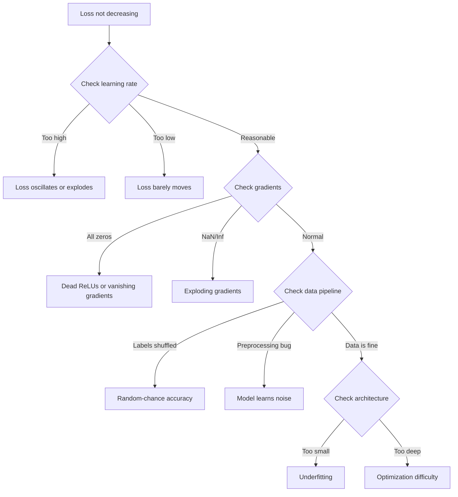
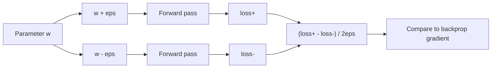
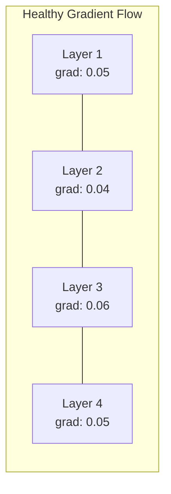
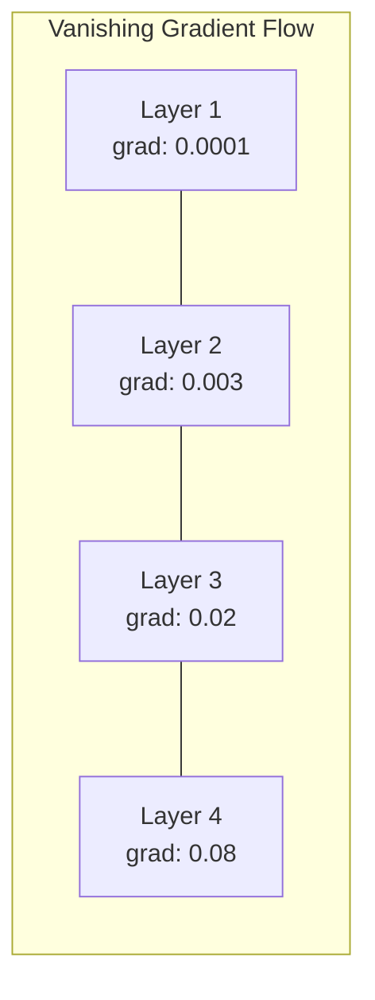
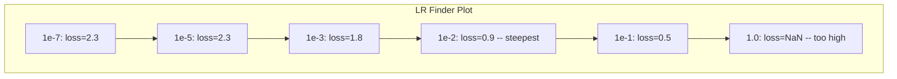

# 神经网络调试

> 你的网络编译通过了，运行了，也输出了一个数字。数字是错的，但没有任何东西崩溃。欢迎来到最难的调试场景：连一条错误信息都没有。

**Type:** Build
**Languages:** Python, PyTorch
**Prerequisites:** 阶段 03 第 01-10 课（尤其是反向传播、损失函数和优化器）
**Time:** ~90 分钟

## 学习目标

- 运用系统化调试策略，诊断常见的神经网络故障（NaN 损失、平坦的损失曲线、过拟合、振荡）
- 运用“单批次过拟合”（overfit one batch）技术，验证模型架构和训练循环是否正确
- 检查梯度幅度、激活值分布和权重范数，识别梯度消失或梯度爆炸问题
- 构建调试检查清单，覆盖数据管线、模型架构、损失函数、优化器和学习率问题

## 要解决的问题

传统软件出故障时会崩溃。空指针会抛出异常，类型不匹配会在编译时失败，差一位错误会产生明显不对的输出。

神经网络可不会给你这样的便利。

一个有缺陷的神经网络会一直运行到结束，打印损失值并输出预测。损失可能下降，预测看起来也可能合情合理。但模型却在悄无声息地犯错：学习捷径、记忆噪声，或收敛到毫无用处的局部极小值。Google 研究人员估计，机器学习（ML）调试时间中有 60-70% 用于处理“静默”缺陷（silent bug）：它们不会报错，却会降低模型质量。

正常模型与故障模型之间的区别，往往只是一行放错位置的代码：漏掉一个 `zero_grad()`、转置了一个维度，或学习率差了 10x。经典的 "Recipe for Training Neural Networks" (2019) 开篇就写道：“最常见的神经网络错误，是那些不会让程序崩溃的缺陷。”

本课教你找出这些缺陷。

## 核心概念

### 调试思路

别再打印几行日志就祈祷一切正常了。神经网络调试需要系统化的方法，因为反馈周期很长（每次训练需要几分钟到几小时），而症状又很模糊（损失异常可能对应 20 种不同问题）。

黄金法则：**从简单方案开始，每次只增加一部分复杂度，并独立验证每一部分。**



### 症状 1：损失不下降

这是最常见的抱怨。训练循环在运行，一轮轮训练不断过去，损失却始终平坦，或剧烈振荡。

**学习率不对。** 过高时，损失会振荡或突然变成 NaN；过低时，损失下降得太慢，看起来像没有变化。Adam 从 1e-3 开始，随机梯度下降（SGD）从 1e-1 或 1e-2 开始。在断定其他地方出错之前，务必先尝试相邻值相差 10x 的 3 个学习率（例如 1e-2、1e-3、1e-4）。

**ReLU 失活。** 如果一个 ReLU 神经元接收到很大的负输入，它的输出为 0，梯度也为 0，之后就再也不会激活。如果足够多的神经元失活，网络就无法学习。检查方法：打印每个 ReLU 层之后恰好为 0 的激活值比例。如果 >50% 已失活，就改用 LeakyReLU 或降低学习率。

**梯度消失。** 在使用 sigmoid 或 tanh 激活函数的深层网络中，梯度在反向传播时会呈指数级缩小。到达第一层时，梯度已接近 ~0，前几层便停止学习。解决方法：使用 ReLU/GELU、添加残差连接，或使用批量归一化。

**梯度爆炸。** 这是相反的问题：梯度呈指数级增长，常见于循环神经网络（RNN）和非常深的网络。损失会突然变成 NaN。解决方法：梯度裁剪（`torch.nn.utils.clip_grad_norm_`）、降低学习率，或添加归一化。

### 症状 2：损失下降，但模型表现很差

损失在下降，训练准确率达到 99%，测试准确率却只有 55%。或者，模型在真实数据上给出毫无意义的输出。

**过拟合。** 模型记住了训练数据，而不是学到规律。训练损失与验证损失之间的差距随时间扩大。解决方法：更多数据、Dropout（随机失活）、权重衰减、早停和数据增强。

**数据泄漏。** 测试数据泄漏进了训练过程，准确率高得令人怀疑。常见原因包括：划分前就打乱数据、使用整个数据集的统计量做预处理，以及不同划分之间存在重复样本。解决方法：先划分，再预处理，并检查重复样本。

**标签错误。** 大多数真实数据集有 5-10% 的标签是错的（Northcutt 等人，2021，"Pervasive Label Errors in Test Sets"）。模型会学到这些噪声。解决方法：使用置信学习（confident learning）找出并修正错误标签，或使用损失截断来忽略高损失样本。

### 症状 3：损失中出现 NaN 或 Inf

损失值变成了 `nan` 或 `inf`，训练也就失效了。

**学习率过高。** 梯度更新越过目标太远，导致权重爆炸。解决方法：将学习率缩小 10x。

**log(0) 或 log(negative)。** 交叉熵损失会计算 `log(p)`。如果模型输出恰好为 0 或为负的概率，对数就会出问题。解决方法：将预测值钳制到 `[eps, 1-eps]`，其中 `eps=1e-7`。

**除以零。** 批量归一化会除以标准差。取值恒定的批次有 std=0。解决方法：在分母中加入 epsilon（PyTorch 默认会这样做，但自定义实现未必会）。

**数值溢出。** 很大的激活值传入 `exp()` 会产生 Inf，softmax 尤其容易出现这种问题。解决方法：取指数前先减去最大值（log-sum-exp 技巧）。

### 技术 1：梯度检查

将解析梯度（来自反向传播）与数值梯度（来自有限差分）进行比较。如果两者不一致，说明反向传播存在缺陷。

参数 `w` 的数值梯度：

```text
grad_numerical = (loss(w + eps) - loss(w - eps)) / (2 * eps)
```

一致性指标（相对差异）：

```text
rel_diff = |grad_analytical - grad_numerical| / max(|grad_analytical|, |grad_numerical|, 1e-8)
```

如果 `rel_diff < 1e-5`，则正确；如果 `rel_diff > 1e-3`，则几乎可以确定存在缺陷。



### 技术 2：激活值统计量

训练时，监测每一层之后激活值的均值和标准差。健康网络会让激活值保持均值接近 0、标准差接近 1（归一化之后），或者至少保持有界。

| 健康指标 | 均值 | 标准差 | 诊断 |
|-----------------|------|-----|-----------|
| 健康 | ~0 | ~1 | 网络正在正常学习 |
| 饱和 | >>0 或 <<0 | ~0 | 激活值停留在极端值 |
| 失活 | 0 | 0 | 神经元已失活（全为零） |
| 爆炸 | >>10 | >>10 | 激活值无界增长 |

### 技术 3：梯度流可视化

绘制每一层的平均梯度幅度。在健康网络中，各层梯度幅度应大致相似。如果前几层的梯度比后几层小 1000x，就存在梯度消失。





### 技术 4：单批次过拟合测试

这是深度学习中最重要的一项调试技术。

取一个小批次（8-32 个样本），在它上面训练 100+ 次迭代。损失应接近零，训练准确率应达到 100%。如果没有达到，说明模型或训练循环存在根本性缺陷，此时不要继续完整训练。

这项测试能够发现：
- 有缺陷的损失函数
- 有缺陷的反向传播
- 太小而无法表示数据的架构
- 没有连接到模型参数的优化器
- 未对齐的数据与标签

运行它只需 30 秒，却能省下数小时调试完整训练的时间。

### 技术 5：学习率查找器

Leslie Smith (2017) 提出，在一轮训练中将学习率从很小（1e-7）扫描到很大（10），同时记录损失。绘制损失随学习率变化的曲线。最佳学习率大约比损失开始下降最快处的学习率小 10x。



本例中的最佳学习率（LR）：~1e-3（比最陡位置低一个数量级）。

### 常见 PyTorch 缺陷

以下缺陷消耗了 PyTorch 社区最多的累计时间：

| 缺陷 | 症状 | 解决方法 |
|-----|---------|-----|
| 忘记 `optimizer.zero_grad()` | 梯度跨批次累积，损失振荡 | 在 `loss.backward()` 前添加 `optimizer.zero_grad()` |
| 测试时忘记 `model.eval()` | Dropout 和批量归一化的行为不同，多次运行的测试准确率不一致 | 添加 `model.eval()` 和 `torch.no_grad()` |
| 张量形状错误 | 静默广播产生错误结果，却不报错 | 调试时在每次运算后打印形状 |
| CPU/GPU 不匹配 | `RuntimeError: expected CUDA tensor` | 对模型和数据都使用 `.to(device)` |
| 未分离张量 | 计算图不断增长，内存耗尽（OOM） | 使用 `.detach()` 或 `with torch.no_grad()` |
| 原地操作破坏 autograd | `RuntimeError: modified by in-place operation` | 将 `x += 1` 替换为 `x = x + 1` |
| 数据未归一化 | 损失停留在随机猜测水平 | 将输入归一化到 mean=0、std=1 |
| 标签的数据类型错误 | 交叉熵需要 `Long`，却收到 `Float` | 转换标签类型：`labels.long()` |

### 调试总表

| 症状 | 可能原因 | 首先尝试 |
|---------|-------------|-------------------|
| 损失停在 -log(1/num_classes) | 模型预测均匀分布 | 检查数据管线，确认标签与输入对应 |
| 几步之后损失变为 NaN | 学习率过高 | 将 LR 缩小 10x |
| 损失立即变为 NaN | log(0) 或除以零 | 在对数或除法运算中添加 epsilon |
| 损失剧烈振荡 | LR 过高或批次太小 | 降低 LR，增大批次 |
| 损失下降后进入平台期 | LR 对微调阶段而言过高 | 添加 LR 调度（余弦或阶梯衰减） |
| 训练准确率高，测试准确率低 | 过拟合 | 添加 Dropout、权重衰减，增加数据 |
| 训练准确率 = 测试准确率 = 随机猜测水平 | 模型没有学到任何东西 | 运行单批次过拟合测试 |
| 训练准确率 = 测试准确率，但两者都低 | 欠拟合 | 更大的模型、更多层、更多特征 |
| 梯度全为零 | ReLU 失活或计算图被分离 | 换用 LeakyReLU，检查 `.requires_grad` |
| 训练时内存耗尽 | 批次太大或计算图未释放 | 减小批次，评估时使用 `torch.no_grad()` |

```figure
learning-curves
```

## 动手实现

一个监测激活值、梯度和损失曲线的诊断工具包。你将有意破坏网络，再用工具包诊断每个问题。

### 步骤 1：NetworkDebugger 类

通过钩子（hook）接入 PyTorch 模型，记录每层的激活值和梯度统计量。

```python
import torch
import torch.nn as nn
import math


class NetworkDebugger:
    def __init__(self, model):
        self.model = model
        self.activation_stats = {}
        self.gradient_stats = {}
        self.loss_history = []
        self.lr_losses = []
        self.hooks = []
        self._register_hooks()

    def _register_hooks(self):
        for name, module in self.model.named_modules():
            if isinstance(module, (nn.Linear, nn.Conv2d, nn.ReLU, nn.LeakyReLU)):
                hook = module.register_forward_hook(self._make_activation_hook(name))
                self.hooks.append(hook)
                hook = module.register_full_backward_hook(self._make_gradient_hook(name))
                self.hooks.append(hook)

    def _make_activation_hook(self, name):
        def hook(module, input, output):
            with torch.no_grad():
                out = output.detach().float()
                self.activation_stats[name] = {
                    "mean": out.mean().item(),
                    "std": out.std().item(),
                    "fraction_zero": (out == 0).float().mean().item(),
                    "min": out.min().item(),
                    "max": out.max().item(),
                }
        return hook

    def _make_gradient_hook(self, name):
        def hook(module, grad_input, grad_output):
            if grad_output[0] is not None:
                with torch.no_grad():
                    grad = grad_output[0].detach().float()
                    self.gradient_stats[name] = {
                        "mean": grad.mean().item(),
                        "std": grad.std().item(),
                        "abs_mean": grad.abs().mean().item(),
                        "max": grad.abs().max().item(),
                    }
        return hook

    def record_loss(self, loss_value):
        self.loss_history.append(loss_value)

    def check_loss_health(self):
        if len(self.loss_history) < 2:
            return "NOT_ENOUGH_DATA"
        recent = self.loss_history[-10:]
        if any(math.isnan(v) or math.isinf(v) for v in recent):
            return "NAN_OR_INF"
        if len(self.loss_history) >= 20:
            first_half = sum(self.loss_history[:10]) / 10
            second_half = sum(self.loss_history[-10:]) / 10
            if second_half >= first_half * 0.99:
                return "NOT_DECREASING"
        if len(recent) >= 5:
            diffs = [recent[i+1] - recent[i] for i in range(len(recent)-1)]
            if max(diffs) - min(diffs) > 2 * abs(sum(diffs) / len(diffs)):
                return "OSCILLATING"
        return "HEALTHY"

    def check_activations(self):
        issues = []
        for name, stats in self.activation_stats.items():
            if stats["fraction_zero"] > 0.5:
                issues.append(f"DEAD_NEURONS: {name} has {stats['fraction_zero']:.0%} zero activations")
            if abs(stats["mean"]) > 10:
                issues.append(f"EXPLODING_ACTIVATIONS: {name} mean={stats['mean']:.2f}")
            if stats["std"] < 1e-6:
                issues.append(f"COLLAPSED_ACTIVATIONS: {name} std={stats['std']:.2e}")
        return issues if issues else ["HEALTHY"]

    def check_gradients(self):
        issues = []
        grad_magnitudes = []
        for name, stats in self.gradient_stats.items():
            grad_magnitudes.append((name, stats["abs_mean"]))
            if stats["abs_mean"] < 1e-7:
                issues.append(f"VANISHING_GRADIENT: {name} abs_mean={stats['abs_mean']:.2e}")
            if stats["abs_mean"] > 100:
                issues.append(f"EXPLODING_GRADIENT: {name} abs_mean={stats['abs_mean']:.2e}")
        if len(grad_magnitudes) >= 2:
            first_mag = grad_magnitudes[0][1]
            last_mag = grad_magnitudes[-1][1]
            if last_mag > 0 and first_mag / last_mag > 100:
                issues.append(f"GRADIENT_RATIO: first/last = {first_mag/last_mag:.0f}x (vanishing)")
        return issues if issues else ["HEALTHY"]

    def print_report(self):
        print("\n=== NETWORK DEBUGGER REPORT ===")
        print(f"\nLoss health: {self.check_loss_health()}")
        if self.loss_history:
            print(f"  Last 5 losses: {[f'{v:.4f}' for v in self.loss_history[-5:]]}")
        print("\nActivation diagnostics:")
        for item in self.check_activations():
            print(f"  {item}")
        print("\nGradient diagnostics:")
        for item in self.check_gradients():
            print(f"  {item}")
        print("\nPer-layer activation stats:")
        for name, stats in self.activation_stats.items():
            print(f"  {name}: mean={stats['mean']:.4f} std={stats['std']:.4f} zero={stats['fraction_zero']:.1%}")
        print("\nPer-layer gradient stats:")
        for name, stats in self.gradient_stats.items():
            print(f"  {name}: abs_mean={stats['abs_mean']:.2e} max={stats['max']:.2e}")

    def remove_hooks(self):
        for hook in self.hooks:
            hook.remove()
        self.hooks.clear()
```

### 步骤 2：单批次过拟合测试

```python
def overfit_one_batch(model, x_batch, y_batch, criterion, lr=0.01, steps=200):
    optimizer = torch.optim.Adam(model.parameters(), lr=lr)
    model.train()
    print("\n=== OVERFIT ONE BATCH TEST ===")
    print(f"Batch size: {x_batch.shape[0]}, Steps: {steps}")

    for step in range(steps):
        optimizer.zero_grad()
        output = model(x_batch)
        loss = criterion(output, y_batch)
        loss.backward()
        optimizer.step()

        if step % 50 == 0 or step == steps - 1:
            with torch.no_grad():
                preds = (output > 0).float() if output.shape[-1] == 1 else output.argmax(dim=1)
                targets = y_batch if y_batch.dim() == 1 else y_batch.squeeze()
                acc = (preds.squeeze() == targets).float().mean().item()
            print(f"  Step {step:3d} | Loss: {loss.item():.6f} | Accuracy: {acc:.1%}")

    final_loss = loss.item()
    if final_loss > 0.1:
        print(f"\n  FAIL: Loss did not converge ({final_loss:.4f}). Model or training loop is broken.")
        return False
    print(f"\n  PASS: Loss converged to {final_loss:.6f}")
    return True
```

### 步骤 3：学习率查找器

```python
def find_learning_rate(model, x_data, y_data, criterion, start_lr=1e-7, end_lr=10, steps=100):
    import copy
    original_state = copy.deepcopy(model.state_dict())
    optimizer = torch.optim.SGD(model.parameters(), lr=start_lr)
    lr_mult = (end_lr / start_lr) ** (1 / steps)

    model.train()
    results = []
    best_loss = float("inf")
    current_lr = start_lr

    print("\n=== LEARNING RATE FINDER ===")

    for step in range(steps):
        optimizer.zero_grad()
        output = model(x_data)
        loss = criterion(output, y_data)

        if math.isnan(loss.item()) or loss.item() > best_loss * 10:
            break

        best_loss = min(best_loss, loss.item())
        results.append((current_lr, loss.item()))

        loss.backward()
        optimizer.step()

        current_lr *= lr_mult
        for param_group in optimizer.param_groups:
            param_group["lr"] = current_lr

    model.load_state_dict(original_state)

    if len(results) < 10:
        print("  Could not complete LR sweep -- loss diverged too quickly")
        return results

    min_loss_idx = min(range(len(results)), key=lambda i: results[i][1])
    suggested_lr = results[max(0, min_loss_idx - 10)][0]

    print(f"  Swept {len(results)} steps from {start_lr:.0e} to {results[-1][0]:.0e}")
    print(f"  Minimum loss {results[min_loss_idx][1]:.4f} at lr={results[min_loss_idx][0]:.2e}")
    print(f"  Suggested learning rate: {suggested_lr:.2e}")

    return results
```

### 步骤 4：梯度检查器

```python
def _flat_to_multi_index(flat_idx, shape):
    multi_idx = []
    remaining = flat_idx
    for dim in reversed(shape):
        multi_idx.insert(0, remaining % dim)
        remaining //= dim
    return tuple(multi_idx)


def gradient_check(model, x, y, criterion, eps=1e-4):
    model.train()
    x_double = x.double()
    y_double = y.double()
    model_double = model.double()

    print("\n=== GRADIENT CHECK ===")
    overall_max_diff = 0
    checked = 0

    for name, param in model_double.named_parameters():
        if not param.requires_grad:
            continue

        layer_max_diff = 0

        model_double.zero_grad()
        output = model_double(x_double)
        loss = criterion(output, y_double)
        loss.backward()
        analytical_grad = param.grad.clone()

        num_checks = min(5, param.numel())
        for i in range(num_checks):
            idx = _flat_to_multi_index(i, param.shape)
            original = param.data[idx].item()

            param.data[idx] = original + eps
            with torch.no_grad():
                loss_plus = criterion(model_double(x_double), y_double).item()

            param.data[idx] = original - eps
            with torch.no_grad():
                loss_minus = criterion(model_double(x_double), y_double).item()

            param.data[idx] = original

            numerical = (loss_plus - loss_minus) / (2 * eps)
            analytical = analytical_grad[idx].item()

            denom = max(abs(numerical), abs(analytical), 1e-8)
            rel_diff = abs(numerical - analytical) / denom

            layer_max_diff = max(layer_max_diff, rel_diff)
            checked += 1

        overall_max_diff = max(overall_max_diff, layer_max_diff)
        status = "OK" if layer_max_diff < 1e-5 else "MISMATCH"
        print(f"  {name}: max_rel_diff={layer_max_diff:.2e} [{status}]")

    model.float()

    print(f"\n  Checked {checked} parameters")
    if overall_max_diff < 1e-5:
        print("  PASS: Gradients match (rel_diff < 1e-5)")
    elif overall_max_diff < 1e-3:
        print("  WARN: Small differences (1e-5 < rel_diff < 1e-3)")
    else:
        print("  FAIL: Gradient mismatch detected (rel_diff > 1e-3)")
    return overall_max_diff
```

### 步骤 5：有意构造的故障网络

现在，将工具包用于故障网络，逐个诊断。

```python
def demo_broken_networks():
    torch.manual_seed(42)
    x = torch.randn(64, 10)
    y = (x[:, 0] > 0).long()

    print("\n" + "=" * 60)
    print("BUG 1: Learning rate too high (lr=10)")
    print("=" * 60)
    model1 = nn.Sequential(nn.Linear(10, 32), nn.ReLU(), nn.Linear(32, 2))
    debugger1 = NetworkDebugger(model1)
    optimizer1 = torch.optim.SGD(model1.parameters(), lr=10.0)
    criterion = nn.CrossEntropyLoss()
    for step in range(20):
        optimizer1.zero_grad()
        out = model1(x)
        loss = criterion(out, y)
        debugger1.record_loss(loss.item())
        loss.backward()
        optimizer1.step()
    debugger1.print_report()
    debugger1.remove_hooks()

    print("\n" + "=" * 60)
    print("BUG 2: Dead ReLUs from bad initialization")
    print("=" * 60)
    model2 = nn.Sequential(nn.Linear(10, 32), nn.ReLU(), nn.Linear(32, 32), nn.ReLU(), nn.Linear(32, 2))
    with torch.no_grad():
        for m in model2.modules():
            if isinstance(m, nn.Linear):
                m.weight.fill_(-1.0)
                m.bias.fill_(-5.0)
    debugger2 = NetworkDebugger(model2)
    optimizer2 = torch.optim.Adam(model2.parameters(), lr=1e-3)
    for step in range(50):
        optimizer2.zero_grad()
        out = model2(x)
        loss = criterion(out, y)
        debugger2.record_loss(loss.item())
        loss.backward()
        optimizer2.step()
    debugger2.print_report()
    debugger2.remove_hooks()

    print("\n" + "=" * 60)
    print("BUG 3: Missing zero_grad (gradients accumulate)")
    print("=" * 60)
    model3 = nn.Sequential(nn.Linear(10, 32), nn.ReLU(), nn.Linear(32, 2))
    debugger3 = NetworkDebugger(model3)
    optimizer3 = torch.optim.SGD(model3.parameters(), lr=0.01)
    for step in range(50):
        out = model3(x)
        loss = criterion(out, y)
        debugger3.record_loss(loss.item())
        loss.backward()
        optimizer3.step()
    debugger3.print_report()
    debugger3.remove_hooks()

    print("\n" + "=" * 60)
    print("HEALTHY NETWORK: Correct setup for comparison")
    print("=" * 60)
    model_good = nn.Sequential(nn.Linear(10, 32), nn.ReLU(), nn.Linear(32, 2))
    debugger_good = NetworkDebugger(model_good)
    optimizer_good = torch.optim.Adam(model_good.parameters(), lr=1e-3)
    for step in range(50):
        optimizer_good.zero_grad()
        out = model_good(x)
        loss = criterion(out, y)
        debugger_good.record_loss(loss.item())
        loss.backward()
        optimizer_good.step()
    debugger_good.print_report()
    debugger_good.remove_hooks()

    print("\n" + "=" * 60)
    print("OVERFIT-ONE-BATCH TEST (healthy model)")
    print("=" * 60)
    model_test = nn.Sequential(nn.Linear(10, 32), nn.ReLU(), nn.Linear(32, 2))
    overfit_one_batch(model_test, x[:8], y[:8], criterion)

    print("\n" + "=" * 60)
    print("LEARNING RATE FINDER")
    print("=" * 60)
    model_lr = nn.Sequential(nn.Linear(10, 32), nn.ReLU(), nn.Linear(32, 2))
    find_learning_rate(model_lr, x, y, criterion)

    print("\n" + "=" * 60)
    print("GRADIENT CHECK")
    print("=" * 60)
    model_grad = nn.Sequential(nn.Linear(10, 8), nn.ReLU(), nn.Linear(8, 2))
    gradient_check(model_grad, x[:4], y[:4], criterion)
```

## 实际使用

### PyTorch 内置工具

```python
import torch
import torch.nn as nn

model = nn.Sequential(
    nn.Linear(768, 256),
    nn.ReLU(),
    nn.Linear(256, 10),
)

with torch.autograd.detect_anomaly():
    output = model(input_tensor)
    loss = criterion(output, target)
    loss.backward()

for name, param in model.named_parameters():
    if param.grad is not None:
        print(f"{name}: grad_mean={param.grad.abs().mean():.2e}")
```

### 集成 Weights & Biases

```python
import wandb

wandb.init(project="debug-training")

for epoch in range(100):
    loss = train_one_epoch()
    wandb.log({
        "loss": loss,
        "lr": optimizer.param_groups[0]["lr"],
        "grad_norm": torch.nn.utils.clip_grad_norm_(model.parameters(), float("inf")),
    })

    for name, param in model.named_parameters():
        if param.grad is not None:
            wandb.log({f"grad/{name}": wandb.Histogram(param.grad.cpu().numpy())})
```

### TensorBoard

```python
from torch.utils.tensorboard import SummaryWriter

writer = SummaryWriter("runs/debug_experiment")

for epoch in range(100):
    loss = train_one_epoch()
    writer.add_scalar("Loss/train", loss, epoch)

    for name, param in model.named_parameters():
        writer.add_histogram(f"weights/{name}", param, epoch)
        if param.grad is not None:
            writer.add_histogram(f"gradients/{name}", param.grad, epoch)
```

### 调试检查清单（完整训练之前）

1. 运行单批次过拟合测试。如果失败，就停止。
2. 打印模型概览，验证参数量是否合理。
3. 用随机数据执行一次前向传播，检查输出形状。
4. 训练 5 轮，验证损失是否下降。
5. 检查激活值统计量，确保没有失活层或爆炸现象。
6. 检查梯度流，确保没有梯度消失或爆炸。
7. 验证数据管线，打印 5 个带标签的随机样本。

## 交付成果

本课产出：
- `outputs/prompt-nn-debugger.md`：用于诊断神经网络训练故障的提示词
- `outputs/skill-debug-checklist.md`：用于调试训练问题的决策树检查清单

调试的关键部署模式：
- 在生产训练脚本中添加监测钩子
- 每 N 步将激活值和梯度统计量记录到 W&B 或 TensorBoard
- 为 NaN 损失、失活神经元（>80% 为零）或梯度爆炸实现自动告警
- 改变架构或数据管线时，始终运行单批次过拟合测试

## 练习

1. **添加梯度爆炸检测器。** 修改 `NetworkDebugger`，检测梯度何时超过阈值，并自动建议梯度裁剪值。在一个没有归一化的 20 层网络上测试。

2. **构建失活神经元恢复器。** 编写函数，识别失活的 ReLU 神经元（始终输出 0），并用 Kaiming 初始化重新初始化它们的输入权重。展示它能恢复一个 >70% 神经元已失活的网络。

3. **实现带绘图功能的学习率查找器。** 扩展 `find_learning_rate`，将结果保存为 CSV，再编写单独的脚本读取 CSV，并使用 matplotlib 显示 LR 与损失曲线。找出 ResNet-18 在 CIFAR-10 上的最佳 LR。

4. **创建数据管线验证器。** 编写函数，检查训练集与测试集之间的重复样本、标签分布不平衡（比例 >10:1）、输入归一化（均值接近 0、标准差接近 1），以及数据中的 NaN/Inf 值。在有意损坏的数据集上运行它。

5. **调试一次真实故障。** 使用第 10 课的迷你框架，引入一个隐蔽的缺陷（例如，在反向传播中转置权重矩阵），再通过梯度检查准确定位哪个参数的梯度不正确。记录调试过程。

## 关键术语

| 术语 | 常见说法 | 实际含义 |
|------|----------------|----------------------|
| 静默缺陷 | “能运行，但结果很差” | 不报错却降低模型质量的缺陷，是 ML 中占主导的故障模式 |
| 失活的 ReLU | “神经元死了” | 输入始终为负的 ReLU 神经元，因此它永久输出 0，并接收 0 梯度 |
| 梯度消失 | “前几层停止学习” | 梯度经过各层时呈指数级缩小，使前几层权重实际上被冻结 |
| 梯度爆炸 | “损失变成了 NaN” | 梯度经过各层时呈指数级增长，导致权重更新大到溢出 |
| 梯度检查 | “验证反向传播是否正确” | 比较反向传播的解析梯度与有限差分的数值梯度 |
| 单批次过拟合 | “最重要的调试测试” | 在单个小批次上训练，验证模型确实能够学习；如果不能，就存在根本性问题 |
| LR 查找器 | “扫描以找到合适的学习率” | 在一轮训练中以指数方式增加学习率，并选择损失即将发散之前的学习率 |
| 数据泄漏 | “测试数据泄漏进训练” | 测试集的信息污染训练过程，导致准确率虚高 |
| 激活值统计量 | “监测层的健康状况” | 跟踪每层输出的均值、标准差和零值比例，检测失活、饱和或爆炸的神经元 |
| 梯度裁剪 | “限制梯度幅度” | 当梯度范数超过阈值时将其缩小，防止梯度更新爆炸 |

## 延伸阅读

- Smith，"Cyclical Learning Rates for Training Neural Networks" (2017)：介绍学习率范围测试（LR 查找器）的论文
- Northcutt 等人，"Pervasive Label Errors in Test Sets Destabilize Machine Learning Benchmarks" (2021)：说明 ImageNet、CIFAR-10 及其他主要基准中有 3-6% 的标签错误
- Zhang 等人，"Understanding Deep Learning Requires Rethinking Generalization" (2017)：说明神经网络能记忆随机标签的论文，这也是单批次过拟合测试有效的原因
- PyTorch 关于 `torch.autograd.detect_anomaly` 和 `torch.autograd.set_detect_anomaly` 的文档，介绍内置 NaN/Inf 检测
