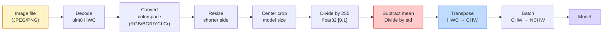
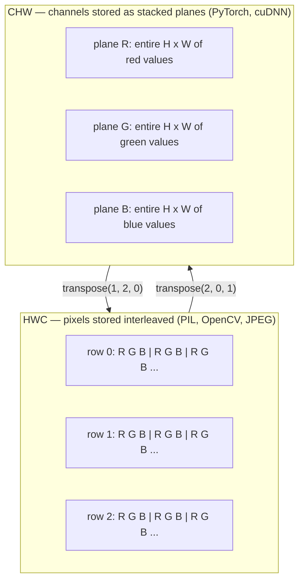

# 图像基础：像素、通道与色彩空间

> 图像是由光的采样值构成的张量（tensor）。你会用到的每一个视觉模型，都从这一事实出发。

**Type:** Build
**Languages:** Python
**Prerequisites:** 阶段 1 第 12 课（张量操作）、阶段 3 第 11 课（PyTorch 入门）
**Time:** ~45 分钟

## 学习目标

- 解释连续场景如何离散成像素（pixel），以及为什么采样和量化的选择决定了所有下游模型的能力上限
- 将图像作为 NumPy 数组读取、切片和检查，并熟练切换 HWC（高度、宽度、通道）与 CHW（通道、高度、宽度）布局
- 在 RGB（红绿蓝）、灰度、HSV（色相、饱和度、明度）和 YCbCr 之间转换，并说明每种色彩空间存在的理由
- 严格按照预训练 PyTorch 视觉模型的要求，应用像素级预处理：归一化、标准化、缩放和通道优先布局

## 要解决的问题

你会读到的每篇论文、下载的每组预训练权重、调用的每个视觉 API（应用程序编程接口），都对输入的编码方式有特定假设。模型需要 `float32`，你却传入 `uint8` 图像，它仍会运行，却悄无声息地产生毫无用处的结果。把 BGR 输入给用 RGB 训练的网络，准确率就会骤降十个点。模型要求通道优先输入，你却给它通道后置输入，第一层卷积就会把高度当成特征通道。这些情况都不会报错，只会毁掉你的指标，让你花上一周排查一个藏在文件加载方式里的错误。

只要知道卷积在什么东西上滑动，它就不难理解。难点在于，对相机、JPEG 解码器、PIL、OpenCV、torchvision 和 CUDA 计算内核来说，“图像”的含义各不相同。每套技术栈都有自己的轴顺序、字节取值范围和通道约定。视觉工程师如果分不清这些差异，交付的管线（pipeline）就会出问题。

本课将打牢基础，让本阶段的后续内容有据可依。学完后，你会知道像素是什么、为什么每个像素有三个数而不是一个、“用 ImageNet 统计量归一化”究竟做了什么，以及如何在本阶段其他课程默认使用的两三种布局之间转换。

## 核心概念

### 预处理全管线一览

每个生产环境中的视觉系统，都采用同样的一系列可逆变换。任何一步出错，模型看到的输入就会与训练时不同。



红色和蓝色这两个框，是 80% 无声故障的源头：缺少标准化，以及布局错误。

### 像素是采样值，不是方块

相机传感器会统计落在微型探测器网格上的光子。每个探测器在不到一秒的时间内对光进行积分，并输出与入射光子数量成正比的电压。随后，传感器将这个电压离散成一个整数。一个探测器就对应一个像素。

```text
Continuous scene                 Sensor grid                     Digital image
(infinite detail)                (H x W detectors)               (H x W integers)

    ~~~~~                        +--+--+--+--+--+                 210 198 180 155 120
   ~   ~   ~                     |  |  |  |  |  |                 205 195 178 152 118
  ~ light ~      ---->           +--+--+--+--+--+     ---->       200 190 175 150 115
   ~~~~~                         |  |  |  |  |  |                 195 185 170 148 112
                                 +--+--+--+--+--+                 188 180 165 145 108
```

这一步要做出两个选择，它们决定了所有下游处理的上限：

- **空间采样（spatial sampling）** 决定场景每度视角内有多少个探测器。太少，边缘就会出现锯齿，也就是混叠（aliasing）；太多，存储和计算需求就会急剧增长。
- **强度量化（intensity quantization）** 决定电压分档有多细。8 bits 可提供 256 个级别，是显示的标准。10、12、16 bits 能呈现更平滑的渐变，对医学成像、高动态范围（HDR）和传感器原始数据管线很重要。

像素不是一个有面积的彩色方块，而是一次测量的结果。缩放或旋转图像时，你是在对这个测量网格进行重采样。

### 为什么有三个通道

一个探测器统计整个可见光谱范围内的光子，得到的就是灰度。为了获取颜色，传感器会用红、绿、蓝滤镜构成的马赛克阵列覆盖网格。经过去马赛克（demosaicing）处理，每个空间位置都有三个整数：附近红色、绿色和蓝色滤镜下的探测器响应。这三个整数构成一个像素的 RGB 三元组。

```text
One pixel in memory:

    (R, G, B) = (210, 140, 30)   <- reddish-orange

An H x W RGB image:

    shape (H, W, 3)     stored as   H rows of W pixels of 3 values
                                    each in [0, 255] for uint8
```

三并不是一个神奇的数字。深度相机会增加 Z 通道，卫星会增加红外和紫外波段，医学扫描通常有一个通道（X-ray、CT）或多个通道（高光谱）。通道数位于最后一个轴；卷积层会学习如何在这个轴上混合信息。

### 两种布局约定：HWC 和 CHW

同一个张量，两种排列顺序。每个库都会选用其中一种。

```text
HWC (height, width, channels)           CHW (channels, height, width)

   W ->                                    H ->
  +-----+-----+-----+                     +-----+-----+
H |R G B|R G B|R G B|                   C |R R R R R R|
| +-----+-----+-----+                   | +-----+-----+
v |R G B|R G B|R G B|                   v |G G G G G G|
  +-----+-----+-----+                     +-----+-----+
                                          |B B B B B B|
                                          +-----+-----+

   PIL, OpenCV, matplotlib,              PyTorch, most deep learning
   almost every image file on disk       frameworks, cuDNN kernels
```

之所以有 CHW，是因为卷积核沿 H 和 W 滑动。将通道轴放在最前面，意味着每个卷积核在每个通道上看到的都是一个连续的 2D 平面，便于向量化。磁盘格式采用 HWC，因为这与传感器输出扫描行的方式一致。

下面这行转换代码，你将会敲上千遍：

```text
img_chw = img_hwc.transpose(2, 0, 1)      # NumPy
img_chw = img_hwc.permute(2, 0, 1)        # PyTorch tensor
```

内存布局的可视化：



### 字节取值范围与数据类型（dtype）

主要有三种约定：

| 约定 | dtype | 范围 | 常见场景 |
|------------|-------|-------|------------------|
| 原始值 | `uint8` | [0, 255] | 磁盘文件、PIL 和 OpenCV 的输出 |
| 归一化后 | `float32` | [0.0, 1.0] | 执行 `img.astype('float32') / 255` 之后 |
| 标准化后 | `float32` | 大致为 [-2, +2] | 减去均值并除以标准差之后 |

卷积网络是在标准化输入上训练的。ImageNet 统计量 `mean=[0.485, 0.456, 0.406]`、`std=[0.229, 0.224, 0.225]` 是在整个 ImageNet 训练集上，基于归一化到 [0, 1] 的像素计算出的三个通道的算术平均值和标准差。将原始 `uint8` 输入给要求标准化浮点数的模型，是视觉应用中最常见的无声故障。

### 色彩空间及其存在的理由

RGB 是图像采集格式，但它并不总是对模型最有用的表示。

```text
 RGB               HSV                       YCbCr / YUV

 R red             H hue (angle 0-360)       Y luminance (brightness)
 G green           S saturation (0-1)        Cb chroma blue-yellow
 B blue            V value/brightness (0-1)  Cr chroma red-green

 Linear to         Separates color from      Separates brightness from
 sensor output     brightness. Useful for    color. JPEG and most video
                   color thresholding, UI    codecs compress the chroma
                   sliders, simple filters   channels harder because the
                                             human eye is less sensitive
                                             to chroma detail than to Y.
```

对于大多数现代卷积神经网络（CNN），你输入的是 RGB。在以下场景中，你会遇到其他色彩空间：

- **HSV** — 传统计算机视觉（CV）代码、基于颜色的分割、白平衡。
- **YCbCr** — 读取 JPEG 内部数据、视频管线，以及仅在 Y 上工作的超分辨率模型。
- **灰度** — 光学字符识别（OCR）、文档模型，以及颜色是干扰变量而非有效信号的各种情况。

从 RGB 转换到灰度用的是加权和，而不是平均值，因为人眼对绿色比对红色或蓝色更敏感：

```text
Y = 0.299 R + 0.587 G + 0.114 B       (ITU-R BT.601, the classic weights)
```

### 宽高比、缩放与插值

每个模型都有固定的输入尺寸：大多数 ImageNet 分类器是 224x224，现代检测器是 384x384 或 512x512。你的图像很少刚好匹配。主要有三种缩放选择：

- **缩放短边，再做中心裁剪** — 标准的 ImageNet 处理方案。保留宽高比，丢弃边缘的一条像素区域。
- **缩放并填充** — 保留宽高比和所有像素，添加黑边。这是检测和 OCR 的标准做法。
- **直接缩放到目标尺寸** — 拉伸图像。成本低，会扭曲几何形状，但对许多分类任务仍然适用。

当新网格与旧网格不对齐时，插值方法决定如何计算中间像素：

```text
Nearest neighbour     fastest, blocky, only choice for masks/labels
Bilinear              fast, smooth, default for most image resizing
Bicubic               slower, sharper on upscaling
Lanczos               slowest, best quality, used for final display
```

经验法则：训练用双线性插值，要观看的图像素材用双三次或 Lanczos 插值，包含整数类别 ID 的内容用最近邻插值。

```figure
conv-output-size
```

## 动手实现

### 步骤 1：构建图像张量并检查其形状

先使用一张确定性的合成图像，这样第一个实验只依赖 NumPy 就能离线运行。文件解码是独立的一环：只要 JPEG 或 PNG 解码器返回了 RGB 字节，下面的每项张量操作就都一样。

```python
import numpy as np

def synthetic_rgb(h=128, w=192, seed=0):
    rng = np.random.default_rng(seed)
    yy, xx = np.meshgrid(np.linspace(0, 1, h), np.linspace(0, 1, w), indexing="ij")
    r = (np.sin(xx * 6) * 0.5 + 0.5) * 255
    g = yy * 255
    b = (1 - yy) * xx * 255
    rgb = np.stack([r, g, b], axis=-1) + rng.normal(0, 6, (h, w, 3))
    return np.clip(rgb, 0, 255).astype(np.uint8)

arr = synthetic_rgb()

print(f"type:   {type(arr).__name__}")
print(f"dtype:  {arr.dtype}")
print(f"shape:  {arr.shape}     # (H, W, C)")
print(f"min:    {arr.min()}")
print(f"max:    {arr.max()}")
print(f"pixel at (0, 0): {arr[0, 0]}")
```

预期输出为 `shape: (H, W, 3)`、`dtype: uint8`，范围是 `[0, 255]`。无论字节来自相机、图像解码器，还是这个合成生成器，这都是标准的解码后表示。

### 步骤 2：拆分通道并重新排列布局

分别取出 R、G、B，然后为 PyTorch 将 HWC 转换为 CHW。

```python
R = arr[:, :, 0]
G = arr[:, :, 1]
B = arr[:, :, 2]
print(f"R shape: {R.shape}, mean: {R.mean():.1f}")
print(f"G shape: {G.shape}, mean: {G.mean():.1f}")
print(f"B shape: {B.shape}, mean: {B.mean():.1f}")

arr_chw = arr.transpose(2, 0, 1)
print(f"\nHWC shape: {arr.shape}")
print(f"CHW shape: {arr_chw.shape}")
```

三个灰度平面，每个通道一个。CHW 只是重新排列轴；只要内存布局允许，就不一定需要复制数据。

### 步骤 3：灰度与 HSV 转换

先通过加权和得到灰度，再手动实现 RGB 到 HSV 的转换。

```python
def rgb_to_grayscale(rgb):
    weights = np.array([0.299, 0.587, 0.114], dtype=np.float32)
    return (rgb.astype(np.float32) @ weights).astype(np.uint8)

def rgb_to_hsv(rgb):
    rgb_f = rgb.astype(np.float32) / 255.0
    r, g, b = rgb_f[..., 0], rgb_f[..., 1], rgb_f[..., 2]
    cmax = np.max(rgb_f, axis=-1)
    cmin = np.min(rgb_f, axis=-1)
    delta = cmax - cmin

    h = np.zeros_like(cmax)
    mask = delta > 0
    argmax = np.argmax(rgb_f, axis=-1)
    rmax = mask & (argmax == 0)
    gmax = mask & (argmax == 1)
    bmax = mask & (argmax == 2)
    h[rmax] = ((g[rmax] - b[rmax]) / delta[rmax]) % 6
    h[gmax] = ((b[gmax] - r[gmax]) / delta[gmax]) + 2
    h[bmax] = ((r[bmax] - g[bmax]) / delta[bmax]) + 4
    h = h * 60.0

    s = np.divide(delta, cmax, out=np.zeros_like(delta), where=cmax > 0)
    v = cmax
    return np.stack([h, s, v], axis=-1)

gray = rgb_to_grayscale(arr)
hsv = rgb_to_hsv(arr)
print(f"gray shape: {gray.shape}, range: [{gray.min()}, {gray.max()}]")
print(f"hsv   shape: {hsv.shape}")
print(f"hue range: [{hsv[..., 0].min():.1f}, {hsv[..., 0].max():.1f}] degrees")
print(f"sat range: [{hsv[..., 1].min():.2f}, {hsv[..., 1].max():.2f}]")
print(f"val range: [{hsv[..., 2].min():.2f}, {hsv[..., 2].max():.2f}]")
```

输出的色相以度为单位，饱和度和明度位于 [0, 1]。这与 OpenCV 的 `hsv_full` 约定一致。

### 步骤 4：归一化、标准化及其逆变换

将原始字节转换为预训练 ImageNet 模型所要求的确切张量，再转换回来。

```python
mean = np.array([0.485, 0.456, 0.406], dtype=np.float32)
std = np.array([0.229, 0.224, 0.225], dtype=np.float32)

def preprocess_imagenet(rgb_uint8):
    x = rgb_uint8.astype(np.float32) / 255.0
    x = (x - mean) / std
    x = x.transpose(2, 0, 1)
    return x

def deprocess_imagenet(chw_float32):
    x = chw_float32.transpose(1, 2, 0)
    x = x * std + mean
    x = np.clip(x * 255.0, 0, 255).astype(np.uint8)
    return x

x = preprocess_imagenet(arr)
print(f"preprocessed shape: {x.shape}     # (C, H, W)")
print(f"preprocessed dtype: {x.dtype}")
print(f"preprocessed mean per channel:  {x.mean(axis=(1, 2)).round(3)}")
print(f"preprocessed std  per channel:  {x.std(axis=(1, 2)).round(3)}")

roundtrip = deprocess_imagenet(x)
max_diff = np.abs(roundtrip.astype(int) - arr.astype(int)).max()
print(f"roundtrip max pixel diff: {max_diff}    # should be 0 or 1")
```

每个通道的均值应接近零，标准差应接近一。这对预处理与逆预处理操作，正是每次调用 torchvision 的 `transforms.Normalize` 时在底层执行的操作。

### 步骤 5：从零实现缩放

最近邻插值将每个输出坐标舍入到一个源像素。双线性插值找到周围四个像素，按距离混合它们。下面两种实现都采用端点对齐坐标，因此第一个和最后一个源像素保持固定。

```python
def resize_coordinates(source_length, target_length):
    if target_length == 1:
        return np.zeros(1, dtype=np.float32)
    return np.linspace(0, source_length - 1, target_length, dtype=np.float32)

def nearest_resize(image, target_height, target_width):
    y = np.rint(resize_coordinates(image.shape[0], target_height)).astype(int)
    x = np.rint(resize_coordinates(image.shape[1], target_width)).astype(int)
    return image[y[:, None], x[None, :]]

def bilinear_resize(image, target_height, target_width):
    y = resize_coordinates(image.shape[0], target_height)
    x = resize_coordinates(image.shape[1], target_width)
    y0 = np.floor(y).astype(int)
    x0 = np.floor(x).astype(int)
    y1 = np.minimum(y0 + 1, image.shape[0] - 1)
    x1 = np.minimum(x0 + 1, image.shape[1] - 1)
    wy = (y - y0)[:, None, None]
    wx = (x - x0)[None, :, None]

    source = image.astype(np.float32)
    top = source[y0[:, None], x0[None, :]] * (1 - wx)
    top += source[y0[:, None], x1[None, :]] * wx
    bottom = source[y1[:, None], x0[None, :]] * (1 - wx)
    bottom += source[y1[:, None], x1[None, :]] * wx
    result = top * (1 - wy) + bottom * wy
    return np.clip(np.rint(result), 0, 255).astype(image.dtype)

target_height = arr.shape[0] * 3
target_width = arr.shape[1] * 3
nearest = nearest_resize(arr, target_height, target_width)
bilinear = bilinear_resize(arr, target_height, target_width)

def local_roughness(x):
    gy = np.diff(x.astype(float), axis=0)
    gx = np.diff(x.astype(float), axis=1)
    return float(np.abs(gy).mean() + np.abs(gx).mean())

for name, out in [("nearest", nearest), ("bilinear", bilinear)]:
    print(f"{name:>8}  shape={out.shape}  roughness={local_roughness(out):6.2f}")
```

最近邻保留了硬边缘，因此粗糙度得分最高。双线性插值更平滑，因为每个新像素都会混合每个轴上两个位置的值。可运行的配套程序使用 Catmull-Rom 三次核，将同样的可分离思路扩展为每个轴上四个邻近点，然后不依赖图像库就打印出全部三种结果。

## 实际使用

PyTorch 在支持批处理且能够感知设备的张量上执行同样的操作。下面的代码会缩放短边、进行中心裁剪、逐通道标准化，最终生成预训练模型所需的 NCHW 张量。

```python
import torch
import torch.nn.functional as F

image_hwc = torch.from_numpy(synthetic_rgb(256, 320))
batch = image_hwc.permute(2, 0, 1).unsqueeze(0).float() / 255.0

height, width = batch.shape[-2:]
scale = 256 / min(height, width)
resized_height = round(height * scale)
resized_width = round(width * scale)
batch = F.interpolate(
    batch,
    size=(resized_height, resized_width),
    mode="bilinear",
    align_corners=False,
    antialias=True,
)

top = (resized_height - 224) // 2
left = (resized_width - 224) // 2
batch = batch[:, :, top:top + 224, left:left + 224]

mean = torch.tensor([0.485, 0.456, 0.406]).view(1, 3, 1, 1)
std = torch.tensor([0.229, 0.224, 0.225]).view(1, 3, 1, 1)
batch = (batch - mean) / std

print(f"tensor dtype: {batch.dtype}")
print(f"batched shape: {tuple(batch.shape)}")
print(f"per-channel mean: {batch.mean(dim=(0, 2, 3)).tolist()}")
print(f"per-channel std:  {batch.std(dim=(0, 2, 3)).tolist()}")
```

共四步，必须严格按此顺序执行：将字节转换为浮点数，并将 HWC 转换为 NCHW；将短边缩放到 256；做一次 224x224 中心裁剪；最后减去 ImageNet 均值并除以其标准差。颠倒这个顺序，会在不报错的情况下改变模型最终收到的输入。

## 交付成果

本课产出：

- `outputs/prompt-vision-preprocessing-audit.md` — 一个提示词（prompt），可将任意模型卡或数据集卡转换为团队必须遵守的精确预处理不变条件检查清单。
- `outputs/skill-image-tensor-inspector.md` — 一项技能，接收任意具有图像形状的张量或数组，报告其数据类型、布局、取值范围，以及它看起来属于原始值、归一化值还是标准化值。

## 练习

1. **（简单）** 创建一个 2x2 RGB `uint8` 数组，包含四种不同颜色。将 HWC 转成 CHW，再转回来，打印两种形状，并证明往返变换保留了每一个值。
2. **（中等）** 编写 `standardize(img, mean, std)` 及其逆函数，使两者配合后，能在任意 uint8 图像上通过 `roundtrip_max_diff <= 1` 测试。相同的调用方式必须同时适用于单张 HWC 图像和 NCHW 批次。
3. **（困难）** 取一个经过 ImageNet 标准化的 3 通道张量，将其送入一个 1x1 卷积，通过学习 RGB 的加权混合得到单个灰度通道。将权重初始化为 `[0.299, 0.587, 0.114]` 并冻结，验证输出与手写的 `rgb_to_grayscale` 之间的差异不超过浮点误差。还有哪些经典色彩空间变换可以写成 1x1 卷积？

## 关键术语

| 术语 | 常见说法 | 实际含义 |
|------|----------------|----------------------|
| 像素 | “一个彩色方块” | 网格某个位置的一次光强采样；彩色用三个数，灰度用一个数 |
| 通道 | “颜色” | 堆叠成图像张量的多个并列空间网格之一；在 HWC 中是最后一个轴，在 CHW 中是第一个轴 |
| HWC / CHW | “形状” | 图像张量的轴排列顺序；磁盘和 PIL 使用 HWC，PyTorch 和 cuDNN 使用 CHW |
| 归一化 | “缩放图像数值” | 除以 255，使像素落在 [0, 1] 中；必要但还不够 |
| 标准化 | “以零为中心” | 逐通道减去均值并除以标准差，使输入分布与模型训练时一致 |
| 灰度转换 | “对各通道取平均” | 系数为 0.299/0.587/0.114 的加权和，与人眼对亮度的感知相符 |
| 插值 | “缩放时如何选像素” | 当新网格与旧网格不对齐时决定输出值的规则；标签用最近邻，训练用双线性，显示用双三次 |
| 宽高比 | “宽除以高” | 区分“缩放并填充”与“缩放并拉伸”的比例 |

## 延伸阅读

- [Charles Poynton — A Guided Tour of Color Space](https://web.archive.org/web/20251220000525/https://poynton.ca/PDFs/Guided_tour.pdf) — 最清晰的技术讲解，说明为何有这么多色彩空间，以及它们各自在何时发挥作用
- [PyTorch Vision Transforms Docs](https://pytorch.org/vision/stable/transforms.html) — 你在生产环境中实际会组合使用的完整变换管线
- [How JPEG Works (Colt McAnlis)](https://www.youtube.com/watch?v=F1kYBnY6mwg) — 直观而精炼地介绍色度子采样、离散余弦变换（DCT），以及 JPEG 为何编码 YCbCr 而不是 RGB
- [ImageNet Preprocessing Conventions (torchvision models)](https://pytorch.org/vision/stable/models.html) — `mean=[0.485, 0.456, 0.406]` 的权威来源，并解释为何模型库中的每个模型都要求使用它
