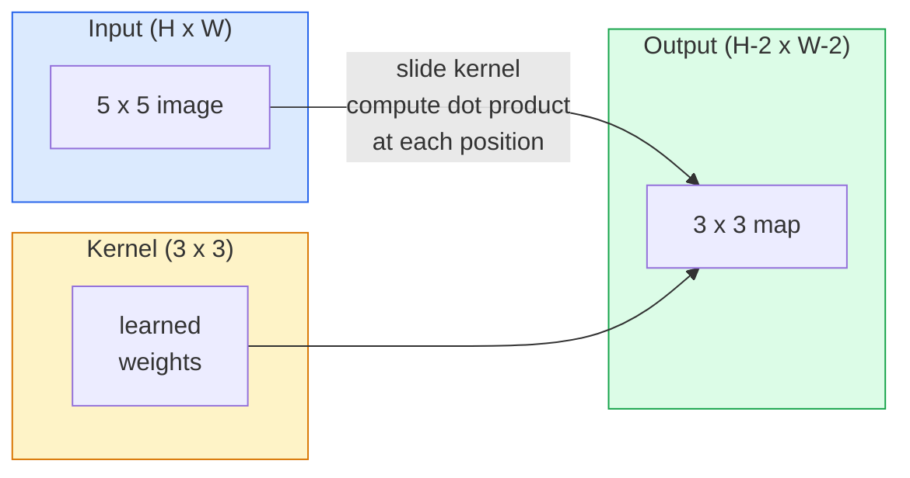
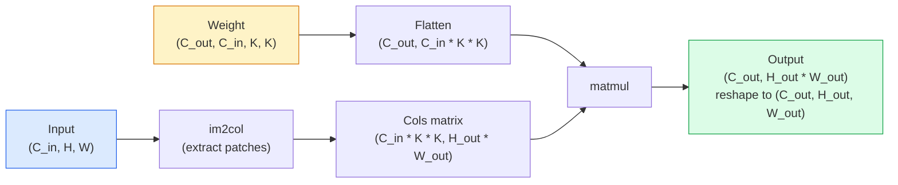

# 从零实现卷积

> 卷积（convolution）就像一个在图像上滑动的小型全连接层（dense layer），在每个位置共享同一组权重。

**Type:** Build
**Languages:** Python
**Prerequisites:** 阶段 3（深度学习核心），阶段 4 第 01 课（图像基础）
**Time:** ~75 分钟

## 学习目标

- 仅使用 NumPy 从零实现 2D（二维）卷积，包括嵌套循环版本和向量化的 `im2col` 版本
- 针对输入尺寸、卷积核尺寸、填充和步幅的任意组合，计算输出的空间尺寸，并说明 `(H - K + 2P) / S + 1` 公式的依据
- 手工设计卷积核（边缘、模糊、锐化、Sobel），并解释各个卷积核为什么会产生相应的激活值模式
- 将卷积堆叠成特征提取器，理解堆叠深度与感受野大小之间的联系

## 要解决的问题

对一幅 224x224 的 RGB（红绿蓝）图像使用全连接层，每个神经元就需要 224 * 224 * 3 = 150,528 个输入权重。仅一个包含 1,000 个单元的隐藏层，就已经有 150 million（一亿五千万）个参数，而此时模型还没有学到任何有用的东西。更糟的是，这一层并不知道左上角的一只狗和右下角的一只狗属于同一种模式。它把每个像素位置都视为独立的，这对图像而言恰恰不对：把一只猫平移三个像素，不应该迫使网络重新学习这个概念。

图像模型需要两种性质：**平移等变性（translation equivariance）** （输入平移时，输出也随之平移）和 **参数共享（parameter sharing）** （同一个特征检测器在所有位置运行）。全连接层两者都不具备，而卷积天然就具备这两种性质。

卷积并不是为深度学习发明的。JPEG 压缩、Photoshop 中的 Gaussian 模糊（高斯模糊）、工业视觉中的边缘检测，以及所有已经投入使用的音频滤波器，背后用的都是同一种运算。卷积神经网络（CNN）之所以在 2012 至 2020 年间主导 ImageNet，是因为对于邻近数值相互关联、同一种模式可能出现在任意位置的数据，卷积提供了恰当的先验。

## 核心概念

### 一个不断滑动的卷积核

2D 卷积使用一个称为卷积核（kernel，也称滤波器 filter）的小型权重矩阵，让它在输入上滑动，并在每个位置计算逐元素乘积之和。这个和就成为一个输出像素。



下面是在 5x5 输入上使用 3x3 卷积核的具体例子（不填充，步幅为 1）：

```text
Input X (5 x 5):                Kernel W (3 x 3):

  1  2  0  1  2                   1  0 -1
  0  1  3  1  0                   2  0 -2
  2  1  0  2  1                   1  0 -1
  1  0  2  1  3
  2  1  1  0  1

The kernel slides across every valid 3 x 3 window. Output Y is 3 x 3:

 Y[0,0] = sum( W * X[0:3, 0:3] )
 Y[0,1] = sum( W * X[0:3, 1:4] )
 Y[0,2] = sum( W * X[0:3, 2:5] )
 Y[1,0] = sum( W * X[1:4, 0:3] )
 ... and so on
```

这一套计算方式的全部要点就是：**共享权重、局部性、滑动窗口** 。其他部分都只是细节管理。

### 输出尺寸公式

给定输入空间尺寸 `H`、卷积核尺寸 `K`、填充量 `P` 和步幅 `S`：

```text
H_out = floor( (H - K + 2P) / S ) + 1
```

记住这个公式。设计每个网络架构时，你都会用它计算几十次。

| 场景 | H | K | P | S | H_out |
|----------|---|---|---|---|-------|
| valid 卷积，不填充 | 32 | 3 | 0 | 1 | 30 |
| same 卷积（保持尺寸） | 32 | 3 | 1 | 1 | 32 |
| 降采样 2 倍 | 32 | 3 | 1 | 2 | 16 |
| 2x2 池化 | 32 | 2 | 0 | 2 | 16 |
| 大感受野 | 32 | 7 | 3 | 2 | 16 |

“same 填充”是指选取 P，使得当 S == 1 时有 H_out == H。对于奇数 K，所需填充量为 P = (K - 1) / 2。这也是 3x3 卷积核占据主流的原因：它们是仍然具有中心位置的最小奇数尺寸卷积核。

### 填充

如果不做填充（padding），每次卷积都会缩小特征图。堆叠 20 层这样的卷积，224x224 图像就会变成 184x184。这既浪费了边界上的计算，也会让需要形状匹配的残差连接变得复杂。

```text
Zero padding (P = 1) on a 5 x 5 input:

  0  0  0  0  0  0  0
  0  1  2  0  1  2  0
  0  0  1  3  1  0  0
  0  2  1  0  2  1  0       Now the kernel can centre on pixel
  0  1  0  2  1  3  0       (0, 0) and still have three rows and
  0  2  1  1  0  1  0       three columns of values to multiply.
  0  0  0  0  0  0  0
```

实际中会遇到的模式包括：`zero`（零填充，最常用）、`reflect`（沿边缘镜像反射，在生成模型中避免生硬的边界）、`replicate`（复制边缘）和 `circular`（首尾回绕，用于环面问题）。

### 步幅

步幅（stride）就是每次滑动的距离。默认值为 `stride=1`。`stride=2` 会将空间尺寸减半，也是 CNN 内部不借助单独池化层进行降采样的经典方法。每种现代架构（ResNet、ConvNeXt、MobileNet）都会在某些位置使用带步幅的卷积来代替最大池化。

```text
Stride 1 on a 5 x 5 input, 3 x 3 kernel:

  starts: (0,0) (0,1) (0,2)        -> output row 0
          (1,0) (1,1) (1,2)        -> output row 1
          (2,0) (2,1) (2,2)        -> output row 2

  Output: 3 x 3

Stride 2 on the same input:

  starts: (0,0) (0,2)              -> output row 0
          (2,0) (2,2)              -> output row 1

  Output: 2 x 2
```

### 多个输入通道

真实图像有三个通道。作用于 RGB 输入的 3x3 卷积实际上是一个 3x3x3 的立体结构：每个输入通道对应一个 3x3 切片。在每个空间位置，对全部三个切片进行相乘求和，再加上一个偏置。

```text
Input:   (C_in,  H,  W)        3 x 5 x 5
Kernel:  (C_in,  K,  K)        3 x 3 x 3 (one kernel)
Output:  (1,     H', W')       2D map

For a layer that produces C_out output channels, you stack C_out kernels:

Weight:  (C_out, C_in, K, K)   e.g. 64 x 3 x 3 x 3
Output:  (C_out, H', W')       64 x 3 x 3

Parameter count: C_out * C_in * K * K + C_out   (the + C_out is biases)
```

规划模型时，你会用到最后一行的计算。输入为 3 个通道、输出为 64 个通道的 3x3 卷积有 `64 * 3 * 3 * 3 + 64 = 1,792` 个参数，开销很小。

### im2col 技巧

嵌套循环容易阅读，却很慢。GPU 更适合大规模矩阵乘法。这里的技巧是：把输入中每个感受野窗口展平成一个大矩阵的一列，再把卷积核展平成一行。这样，整个卷积就变成了一次矩阵乘法（matmul）。



每种生产级卷积实现，都是这种方法的某种变体，再配合缓存分块技巧（直接卷积、Winograd、大卷积核所用的 FFT 卷积）。理解 im2col，就理解了其中的核心。

### 感受野

单个 3x3 卷积能看到 9 个输入像素。堆叠两个 3x3 卷积后，第二层的一个神经元能看到 5x5 个输入像素。三个 3x3 卷积则得到 7x7 的范围。一般来说：

```text
RF after L stacked K x K convs (stride 1) = 1 + L * (K - 1)

With strides:   RF grows multiplicatively with stride along each layer.
```

“从头到尾都用 3x3”之所以有效（VGG、ResNet、ConvNeXt），根本原因在于：两个 3x3 卷积所能看到的输入区域，与一个 5x5 卷积相同，但参数更少，而且中间还多了一次非线性变换。

```figure
convolution-kernel
```

## 动手实现

### 步骤 1：给数组添加填充

从最小的基础操作开始：编写一个函数，在 H x W 数组周围填充零。

```python
import numpy as np

def pad2d(x, p):
    if p == 0:
        return x
    h, w = x.shape[-2:]
    out = np.zeros(x.shape[:-2] + (h + 2 * p, w + 2 * p), dtype=x.dtype)
    out[..., p:p + h, p:p + w] = x
    return out

x = np.arange(9).reshape(3, 3)
print(x)
print()
print(pad2d(x, 1))
```

`x.shape[:-2]` 这个处理末尾轴的技巧，让同一个函数无需修改就能处理 `(H, W)`、`(C, H, W)` 或 `(N, C, H, W)`。

### 步骤 2：用嵌套循环实现 2D 卷积

参考实现虽然慢，但含义明确。从原理上说，`torch.nn.functional.conv2d` 做的就是这个运算。

```python
def conv2d_naive(x, w, b=None, stride=1, padding=0):
    c_in, h, w_in = x.shape
    c_out, c_in_w, kh, kw = w.shape
    assert c_in == c_in_w

    x_pad = pad2d(x, padding)
    h_out = (h + 2 * padding - kh) // stride + 1
    w_out = (w_in + 2 * padding - kw) // stride + 1

    out = np.zeros((c_out, h_out, w_out), dtype=np.float32)
    for oc in range(c_out):
        for i in range(h_out):
            for j in range(w_out):
                hs = i * stride
                ws = j * stride
                patch = x_pad[:, hs:hs + kh, ws:ws + kw]
                out[oc, i, j] = np.sum(patch * w[oc])
        if b is not None:
            out[oc] += b[oc]
    return out
```

四重嵌套循环：输出通道、行、列，再加上对 C_in、kh、kw 的隐式求和。这就是你用来核对每一种更快实现的基准结果。

### 步骤 3：用手工设计的卷积核验证

构造一个纵向 Sobel 卷积核，将它应用于合成的阶跃图像，观察纵向边缘被突出显示。

```python
def synthetic_step_image():
    img = np.zeros((1, 16, 16), dtype=np.float32)
    img[:, :, 8:] = 1.0
    return img

sobel_x = np.array([
    [[-1, 0, 1],
     [-2, 0, 2],
     [-1, 0, 1]]
], dtype=np.float32)[None]

x = synthetic_step_image()
y = conv2d_naive(x, sobel_x, padding=1)
print(y[0].round(1))
```

预期第 7 列会出现较大的正值（亮度从左向右增加），其他位置都为零。这一次打印就是检查数学运算是否正确的基本合理性检查。

### 步骤 4：im2col

将输入中每个与卷积核同样大小的窗口转换成矩阵的一列。对于 `C_in=3, K=3`，每列包含 27 个数。

```python
def im2col(x, kh, kw, stride=1, padding=0):
    c_in, h, w = x.shape
    x_pad = pad2d(x, padding)
    h_out = (h + 2 * padding - kh) // stride + 1
    w_out = (w + 2 * padding - kw) // stride + 1

    cols = np.zeros((c_in * kh * kw, h_out * w_out), dtype=x.dtype)
    col = 0
    for i in range(h_out):
        for j in range(w_out):
            hs = i * stride
            ws = j * stride
            patch = x_pad[:, hs:hs + kh, ws:ws + kw]
            cols[:, col] = patch.reshape(-1)
            col += 1
    return cols, h_out, w_out
```

这里仍然有 Python 循环，但接下来的主要计算会交给一次向量化矩阵乘法。

### 步骤 5：通过 im2col + matmul 实现快速卷积

用一次矩阵乘法替换四重循环。

```python
def conv2d_im2col(x, w, b=None, stride=1, padding=0):
    c_out, c_in, kh, kw = w.shape
    cols, h_out, w_out = im2col(x, kh, kw, stride, padding)
    w_flat = w.reshape(c_out, -1)
    out = w_flat @ cols
    if b is not None:
        out += b[:, None]
    return out.reshape(c_out, h_out, w_out)
```

正确性检查：运行两种实现并比较结果。

```python
rng = np.random.default_rng(0)
x = rng.normal(0, 1, (3, 16, 16)).astype(np.float32)
w = rng.normal(0, 1, (8, 3, 3, 3)).astype(np.float32)
b = rng.normal(0, 1, (8,)).astype(np.float32)

y_naive = conv2d_naive(x, w, b, padding=1)
y_im2col = conv2d_im2col(x, w, b, padding=1)

print(f"max abs diff: {np.max(np.abs(y_naive - y_im2col)):.2e}")
```

`max abs diff` 应在 `1e-5` 左右。这个差异来自浮点累加顺序，并不是程序缺陷。

### 步骤 6：一组手工设计的卷积核

这五个滤波器展示了单个卷积层在尚未经过任何训练时，就能表达哪些模式。

```python
KERNELS = {
    "identity": np.array([[0, 0, 0], [0, 1, 0], [0, 0, 0]], dtype=np.float32),
    "blur_3x3": np.ones((3, 3), dtype=np.float32) / 9.0,
    "sharpen": np.array([[0, -1, 0], [-1, 5, -1], [0, -1, 0]], dtype=np.float32),
    "sobel_x": np.array([[-1, 0, 1], [-2, 0, 2], [-1, 0, 1]], dtype=np.float32),
    "sobel_y": np.array([[-1, -2, -1], [0, 0, 0], [1, 2, 1]], dtype=np.float32),
}

def apply_kernel(img2d, kernel):
    x = img2d[None].astype(np.float32)
    w = kernel[None, None]
    return conv2d_im2col(x, w, padding=1)[0]
```

把它们应用于任意灰度图像，模糊核会让图像变柔和，锐化核会让边缘更清晰，Sobel-x 会突出纵向边缘，Sobel-y 会突出横向边缘。这些恰好就是 AlexNet 和 VGG 的 *第一层* 卷积在训练后最终学到的模式，因为无论后续任务是什么，好的图像模型都需要边缘和斑点检测器。

## 实际使用

PyTorch 的 `nn.Conv2d` 对相同的运算进行了封装，并提供 autograd（自动求导）、CUDA 计算内核和 cuDNN 优化。形状语义完全相同。

```python
import torch
import torch.nn as nn

conv = nn.Conv2d(in_channels=3, out_channels=64, kernel_size=3, stride=1, padding=1)
print(conv)
print(f"weight shape: {tuple(conv.weight.shape)}   # (C_out, C_in, K, K)")
print(f"bias shape:   {tuple(conv.bias.shape)}")
print(f"param count:  {sum(p.numel() for p in conv.parameters())}")

x = torch.randn(8, 3, 224, 224)
y = conv(x)
print(f"\ninput  shape: {tuple(x.shape)}")
print(f"output shape: {tuple(y.shape)}")
```

将 `padding=1` 换成 `padding=0`，输出会缩小为 222x222。将 `stride=1` 换成 `stride=2`，则会缩小为 112x112。用的还是前面记住的同一个公式。

## 交付成果

本课产出：

- `outputs/prompt-cnn-architect.md`：一个提示词（prompt），根据输入尺寸、参数预算和目标感受野，设计一组堆叠的 `Conv2d` 层，并为每一步选取合适的 K/S/P。
- `outputs/skill-conv-shape-calculator.md`：一个技能（skill），逐层检查网络规格，返回每个模块的输出形状、感受野和参数数量。

## 练习

1. **（简单）** 给定 128x128 灰度输入，以及 `[Conv3x3(s=1,p=1), Conv3x3(s=2,p=1), Conv3x3(s=1,p=1), Conv3x3(s=2,p=1)]` 这样的卷积堆叠，手算每一层的输出空间尺寸和感受野。用由测试用卷积层组成的 PyTorch `nn.Sequential` 验证。
2. **（中等）** 扩展 `conv2d_naive` 和 `conv2d_im2col`，让它们接受 `groups` 参数。证明 `groups=C_in=C_out` 能实现逐通道卷积（depthwise convolution），其参数数量为 `C * K * K`，而不是 `C * C * K * K`。
3. **（困难）** 手工实现 `conv2d_im2col` 的反向传播：给定输出的梯度，计算 `x` 和 `w` 的梯度。使用相同的输入和权重，与 `torch.autograd.grad` 的结果核对。技巧在于：im2col 的梯度运算是 `col2im`，它必须累加重叠窗口的贡献。

## 关键术语

| 术语 | 常见说法 | 实际含义 |
|------|----------------|----------------------|
| 卷积 | “滑动一个滤波器” | 在每个空间位置应用共享权重的可学习点积；数学上是互相关（cross-correlation），但大家都称其为卷积 |
| 卷积核 / 滤波器 | “特征检测器” | 一个形状为 (C_in, K, K) 的小型权重张量，与输入窗口的点积会产生一个输出像素 |
| 步幅 | “每次跳多远” | 连续两次放置卷积核之间的步长；步幅 2 会将每个空间维度减半 |
| 填充 | “在边缘加零” | 在输入周围添加额外数值，使卷积核能够以边界像素为中心；`same` 填充使输出尺寸与输入尺寸相等 |
| 感受野（receptive field） | “神经元能看到多大范围” | 某个输出激活值所依赖的原始输入区域，随深度和步幅增长 |
| im2col | “GEMM 技巧” | 将每个感受野窗口重新排列成列，使卷积变成一次大规模矩阵乘法；GEMM（通用矩阵乘法）技巧是每个快速卷积计算内核的核心 |
| 逐通道卷积 | “每个通道一个卷积核” | `groups == C_in` 的卷积，每个输出通道只由与之对应的输入通道计算得到；它是 MobileNet 和 ConvNeXt 的核心构件 |
| 平移等变性 | “输入平移，输出也平移” | 输入平移 k 个像素时，输出也平移 k 个像素的性质；共享权重天然带来这一性质 |

## 延伸阅读

- [A guide to convolution arithmetic for deep learning (Dumoulin & Visin, 2016)](https://arxiv.org/abs/1603.07285)：关于填充、步幅和膨胀的权威图解，各门课程都在悄悄借用
- [CS231n: Convolutional Neural Networks for Visual Recognition](https://cs231n.github.io/convolutional-networks/)：经典讲义，包含最初对 im2col 的解释
- [The Annotated ConvNet (fast.ai)](https://nbviewer.org/github/fastai/fastbook/blob/master/13_convolutions.ipynb)：从手工卷积一步步讲到训练数字分类器的笔记本
- [Receptive Field Arithmetic for CNNs (Dang Ha The Hien)](https://distill.pub/2019/computing-receptive-fields/)：以论文水准交互式讲解感受野计算
