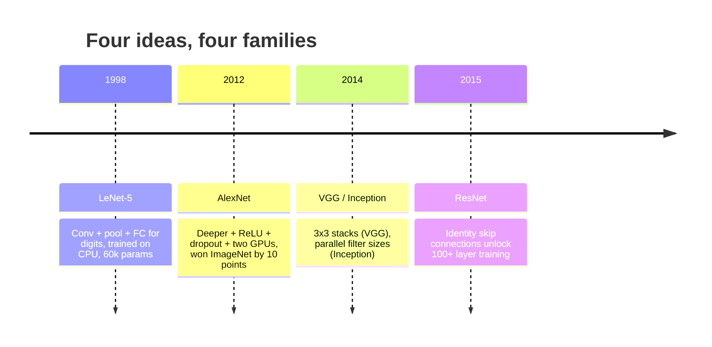
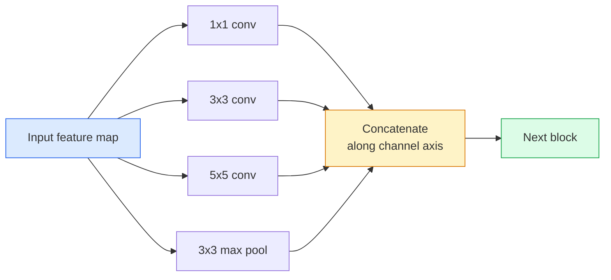
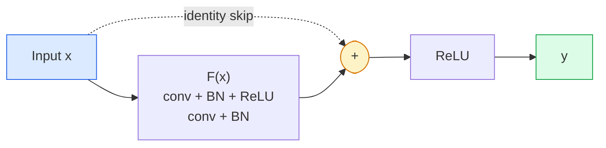

# 卷积神经网络：从 LeNet 到 ResNet

> 过去三十年里，每一种重要的卷积神经网络（CNN）都沿用了“卷积（convolution）—非线性—降采样”这套基本结构，再加上一个新想法。我们按顺序来理解这些想法。

**Type:** Learn + Build
**Languages:** Python
**Prerequisites:** 阶段 3 第 11 课（PyTorch）、阶段 4 第 01 课（图像基础）、阶段 4 第 02 课（从零实现卷积）
**Time:** ~75 分钟

## 学习目标

- 梳理 LeNet-5 -> AlexNet -> VGG -> Inception -> ResNet 的架构演进脉络，并说出每个家族贡献的那一个新想法
- 用 PyTorch 实现 LeNet-5、VGG 风格的块和 ResNet 的 BasicBlock（基本残差块），每种实现都少于 40 行
- 解释为什么残差连接（residual connection）能让一个原本无法训练的 1,000 层网络达到最先进水平
- 阅读现代主干网络（backbone），如 ResNet-18、ResNet-50，在查看源码前预测其输出形状（shape）、感受野（receptive field）和参数数量

## 要解决的问题

2011 年，最好的 ImageNet 分类器的 top-5 准确率约为 74%。2012 年，AlexNet 达到了 85%。2015 年，ResNet 达到了 96%。没有新数据，也没有新一代 GPU。这些进步来自架构上的新想法。视觉工程师在实际工作中必须知道各个想法出自哪篇论文，因为你在 2026 年部署到生产环境的每一个主干网络，都是对这些相同组件的重新组合。而且，这些想法还在不断迁移到其他领域：分组卷积从 CNN 走进了 Transformer，残差连接从 ResNet 走进了每一个大语言模型（LLM），批量归一化（BN）也用在了扩散模型中。

按顺序研究这些网络，还能帮助你避开一个常见错误：明明 LeNet 规模的网络就能解决问题，却去选现成模型中最大的那个。MNIST 不需要 ResNet。了解每个家族随规模变化的表现曲线，才能知道该选曲线上的哪个位置。

## 核心概念

### 改变计算机视觉的四个想法



在经典计算机视觉领域，没有什么比这四次飞跃更加重要。

### LeNet-5（1998）

这是 Yann LeCun 的数字识别器，拥有 60,000 个参数，由两个卷积—池化块、两个全连接层（dense / fully connected layer）组成，采用 tanh 激活函数。它确立了所有 CNN 都沿用的模板：

```text
input (1, 32, 32)
  conv 5x5 -> (6, 28, 28)
  avg pool 2x2 -> (6, 14, 14)
  conv 5x5 -> (16, 10, 10)
  avg pool 2x2 -> (16, 5, 5)
  flatten -> 400
  dense -> 120
  dense -> 84
  dense -> 10
```

今天我们所说的 CNN，都是交替进行卷积和降采样，再接上一个小型分类头（classifier head）。它们本质上就是层数更多、通道（channel）更多、激活函数更好的 LeNet。

### AlexNet（2012）

三项改变共同让 ImageNet 上的表现取得了突破：

1. 用 **ReLU** 代替 tanh。梯度不再消失，训练速度提升到原来的六倍。
2. 在全连接分类头中使用 **Dropout（随机失活）**。正则化成了网络中的一层，而不只是一个技巧。
3. **深度与宽度**。五个卷积层、三个全连接层、60M 个参数，将模型拆分到两块 GPU 上训练。

论文的 Figure 2 中仍能看到分配给两块 GPU 的两条并行分支。这种并行方式是应对硬件限制的变通办法，而不是架构上的洞见。但上面三个想法，至今仍存在于你使用的每个模型中。

### VGG（2014）

VGG 提出了一个问题：如果只使用 3x3 卷积，并不断加深网络，会怎样？

```text
stack:   conv 3x3 -> conv 3x3 -> pool 2x2
repeat:  16 or 19 conv layers
```

两个 3x3 卷积所覆盖的输入区域，与一个 5x5 卷积相同，都是 5x5，但参数更少（2*9*C^2 = 18C^2 vs 25*C^2），中间还多了一个 ReLU。VGG 把这一观察发展成了完整的架构。它的简单之处在于反复使用同一种块，也正因如此，它成了后续架构的参照。

代价是：138M 个参数，训练慢，推理开销大。

### Inception（同样是 2014 年）

对于“该用多大的卷积核（kernel）”这个问题，Google 的回答是：所有尺寸都用，并行运行。



每条分支各有所长：1x1 负责通道混合，3x3 负责局部纹理，5x5 负责更大尺度的模式，池化负责提取平移不变的特征。将它们拼接起来，下一层就能选择有用的分支。Inception v1 在每条分支内部使用 1x1 卷积作为瓶颈结构，以控制参数数量。

### 退化问题

到了 2015 年，VGG-19 能正常工作，VGG-32 却不行。增加深度本应有帮助，但超过 ~20 层后，训练损失和测试损失都会变差。这不是过拟合，而是优化器找不到有用的权重，因为梯度在逐层传播时会以连乘的方式缩小。

```text
Plain deep network:
  y = f_L( f_{L-1}( ... f_1(x) ... ) )

Gradient wrt early layer:
  dL/dW_1 = dL/dy * df_L/df_{L-1} * ... * df_2/df_1 * df_1/dW_1

Each multiplicative term has magnitude roughly (weight magnitude) * (activation gain).
Stack 100 of them with gains < 1 and the gradient is effectively zero.
```

VGG 在 19 层时能够正常工作，是因为同期发表的批量归一化让激活值保持在合适的尺度。但即使使用批量归一化，也无法挽救深度超过 30 层左右的网络。

### ResNet（2015）

He、Zhang、Ren、Sun 提出了一项改变，解决了所有这些问题：

```text
standard block:   y = F(x)
residual block:   y = F(x) + x
```

`+ x` 意味着，只要把 `F(x)` 变为零，这一层就始终可以选择不做任何改变。这样，一个 1,000 层的 ResNet 最差也不会差于一个 1 层网络，因为每个新增的块都有一个极其简单的退路。有了这一保证，优化器就愿意让每个块都发挥 *一点* 作用。而这点作用叠加 100 次，就能达到最先进水平。



这个块有两种随处可见的变体：

- **BasicBlock**（ResNet-18、ResNet-34）：两个 3x3 卷积，跳跃连接（skip connection）跨过这两个卷积。
- **Bottleneck（瓶颈块）**（ResNet-50、-101、-152）：先用 1x1 压缩通道，中间是 3x3，再用 1x1 扩展通道，跳跃连接跨过这三层。通道数较大时，这样开销更低。

当跳跃连接需要跨过降采样操作（stride=2）时，就用一个 1x1、stride=2 的卷积替换恒等路径，使两条路径的形状匹配。

### 为什么残差连接的意义不止于视觉

这个想法真正针对的并不只是图像分类，而是要让深度网络从“只能祈祷梯度能传下来”，变成可靠、可扩展的工程工具。下一阶段你将学到的每一种 Transformer，都在每个块中使用完全相同的跳跃连接。没有 ResNet，就没有 GPT。

```figure
pooling
```

## 动手实现

### Step 1：LeNet-5

下面是一个精简而忠实的 LeNet 实现，采用 tanh 激活函数和平均池化。唯一向现代做法作出的让步，是在后续使用 `nn.CrossEntropyLoss`，替代原来的 Gaussian 连接。

```python
import torch
import torch.nn as nn
import torch.nn.functional as F

class LeNet5(nn.Module):
    def __init__(self, num_classes=10):
        super().__init__()
        self.conv1 = nn.Conv2d(1, 6, kernel_size=5)
        self.conv2 = nn.Conv2d(6, 16, kernel_size=5)
        self.pool = nn.AvgPool2d(2)
        self.fc1 = nn.Linear(16 * 5 * 5, 120)
        self.fc2 = nn.Linear(120, 84)
        self.fc3 = nn.Linear(84, num_classes)

    def forward(self, x):
        x = self.pool(torch.tanh(self.conv1(x)))
        x = self.pool(torch.tanh(self.conv2(x)))
        x = torch.flatten(x, 1)
        x = torch.tanh(self.fc1(x))
        x = torch.tanh(self.fc2(x))
        return self.fc3(x)

net = LeNet5()
x = torch.randn(1, 1, 32, 32)
print(f"output: {net(x).shape}")
print(f"params: {sum(p.numel() for p in net.parameters()):,}")
```

预期输出为 `output: torch.Size([1, 10])`、`params: 61,706`。这就是开启现代计算机视觉的完整数字分类器。

### Step 2：一个 VGG 块

一个可复用的块包含两个 3x3 卷积，以及 ReLU、批量归一化和最大池化。

```python
class VGGBlock(nn.Module):
    def __init__(self, in_c, out_c):
        super().__init__()
        self.conv1 = nn.Conv2d(in_c, out_c, kernel_size=3, padding=1)
        self.bn1 = nn.BatchNorm2d(out_c)
        self.conv2 = nn.Conv2d(out_c, out_c, kernel_size=3, padding=1)
        self.bn2 = nn.BatchNorm2d(out_c)
        self.pool = nn.MaxPool2d(2)

    def forward(self, x):
        x = F.relu(self.bn1(self.conv1(x)))
        x = F.relu(self.bn2(self.conv2(x)))
        return self.pool(x)

class MiniVGG(nn.Module):
    def __init__(self, num_classes=10):
        super().__init__()
        self.stack = nn.Sequential(
            VGGBlock(3, 32),
            VGGBlock(32, 64),
            VGGBlock(64, 128),
        )
        self.head = nn.Sequential(
            nn.AdaptiveAvgPool2d(1),
            nn.Flatten(),
            nn.Linear(128, num_classes),
        )

    def forward(self, x):
        return self.head(self.stack(x))

net = MiniVGG()
x = torch.randn(1, 3, 32, 32)
print(f"output: {net(x).shape}")
print(f"params: {sum(p.numel() for p in net.parameters()):,}")
```

在 CIFAR 尺寸的输入上依次使用三个 VGG 块，再接一个自适应池化层和一个线性层，总共 ~290k 个参数，应付 CIFAR-10 绰绰有余。

### Step 3：一个 ResNet BasicBlock

这是 ResNet-18 和 ResNet-34 的核心构建块。

```python
class BasicBlock(nn.Module):
    def __init__(self, in_c, out_c, stride=1):
        super().__init__()
        self.conv1 = nn.Conv2d(in_c, out_c, kernel_size=3, stride=stride, padding=1, bias=False)
        self.bn1 = nn.BatchNorm2d(out_c)
        self.conv2 = nn.Conv2d(out_c, out_c, kernel_size=3, stride=1, padding=1, bias=False)
        self.bn2 = nn.BatchNorm2d(out_c)
        if stride != 1 or in_c != out_c:
            self.shortcut = nn.Sequential(
                nn.Conv2d(in_c, out_c, kernel_size=1, stride=stride, bias=False),
                nn.BatchNorm2d(out_c),
            )
        else:
            self.shortcut = nn.Identity()

    def forward(self, x):
        out = F.relu(self.bn1(self.conv1(x)))
        out = self.bn2(self.conv2(out))
        out = out + self.shortcut(x)
        return F.relu(out)
```

在卷积层上设置 `bias=False` 是使用批量归一化时的惯例：BN 的 beta 参数已经负责偏置，再保留卷积偏置就是浪费。只有步幅（stride）或通道数发生变化时，`shortcut` 才需要真正的卷积；否则，直接使用不做任何变换的恒等映射（identity mapping）。

### Step 4：一个小型 ResNet

把四组 BasicBlock 堆叠起来，就能得到一个适用于 CIFAR 尺寸输入的 ResNet。

```python
class TinyResNet(nn.Module):
    def __init__(self, num_classes=10):
        super().__init__()
        self.stem = nn.Sequential(
            nn.Conv2d(3, 32, kernel_size=3, stride=1, padding=1, bias=False),
            nn.BatchNorm2d(32),
            nn.ReLU(inplace=True),
        )
        self.layer1 = self._make_group(32, 32, num_blocks=2, stride=1)
        self.layer2 = self._make_group(32, 64, num_blocks=2, stride=2)
        self.layer3 = self._make_group(64, 128, num_blocks=2, stride=2)
        self.layer4 = self._make_group(128, 256, num_blocks=2, stride=2)
        self.head = nn.Sequential(
            nn.AdaptiveAvgPool2d(1),
            nn.Flatten(),
            nn.Linear(256, num_classes),
        )

    def _make_group(self, in_c, out_c, num_blocks, stride):
        blocks = [BasicBlock(in_c, out_c, stride=stride)]
        for _ in range(num_blocks - 1):
            blocks.append(BasicBlock(out_c, out_c, stride=1))
        return nn.Sequential(*blocks)

    def forward(self, x):
        x = self.stem(x)
        x = self.layer1(x)
        x = self.layer2(x)
        x = self.layer3(x)
        x = self.layer4(x)
        return self.head(x)

net = TinyResNet()
x = torch.randn(1, 3, 32, 32)
print(f"output: {net(x).shape}")
print(f"params: {sum(p.numel() for p in net.parameters()):,}")
```

四组，每组两个块。第 2、3、4 组开头的步幅都是 2。每次降采样，通道数都会翻倍。参数数量约为 2.8M。这就是能够顺畅扩展到 ResNet-152 的标准构建方式。

### Step 5：比较提取特征的参数效率

把相同输入送入这三个网络，比较它们的参数数量。

```python
def summary(name, net, x):
    y = net(x)
    params = sum(p.numel() for p in net.parameters())
    print(f"{name:12s}  input {tuple(x.shape)} -> output {tuple(y.shape)}  params {params:>10,}")

x = torch.randn(1, 3, 32, 32)
summary("LeNet5",     LeNet5(),       torch.randn(1, 1, 32, 32))
summary("MiniVGG",    MiniVGG(),      x)
summary("TinyResNet", TinyResNet(),   x)
```

三个模型，三个时代，参数数量横跨三个数量级。对于 CIFAR-10，训练几轮（epoch）后，准确率大致应为：LeNet 60%、MiniVGG 89%、TinyResNet 93%。

## 实际使用

`torchvision.models` 提供了上述所有架构的预训练版本。各家族的调用签名完全相同，这正是主干网络这一抽象的意义。

```python
from torchvision.models import resnet18, ResNet18_Weights, vgg16, VGG16_Weights

r18 = resnet18(weights=ResNet18_Weights.IMAGENET1K_V1)
r18.eval()

print(f"ResNet-18 params: {sum(p.numel() for p in r18.parameters()):,}")
print(r18.layer1[0])
print()

v16 = vgg16(weights=VGG16_Weights.IMAGENET1K_V1)
v16.eval()
print(f"VGG-16   params: {sum(p.numel() for p in v16.parameters()):,}")
```

ResNet-18 有 11.7M 个参数，VGG-16 有 138M 个参数，而两者在 ImageNet 上的 top-1 准确率相近（69.8% vs 71.6%）。残差连接带来了 12x 的参数效率优势。因此，从 2016 年到 ViT 于 2021 年出现之前，ResNet 的各种变体一直占据主导地位。时至今日，在计算资源受限的实际部署中，它们仍占主导地位。

迁移学习（transfer learning）的做法始终相同：加载预训练模型，冻结主干网络，再替换分类头。

```python
for p in r18.parameters():
    p.requires_grad = False
r18.fc = nn.Linear(r18.fc.in_features, 10)
```

三行代码。现在，你就有了一个 10 类 CIFAR 分类器，它继承了在 ImageNet 上投入训练所得的表征。

## 交付成果

本课产出：

- `outputs/prompt-backbone-selector.md`：一份提示词（prompt），根据任务、数据集大小和计算预算，选择合适的 CNN 家族（LeNet/VGG/ResNet/MobileNet/ConvNeXt）。
- `outputs/skill-residual-block-reviewer.md`：一项技能，读取 PyTorch 模块，标出跳跃连接中的错误，例如步幅改变时缺少捷径分支、捷径分支的激活顺序有误，以及 BN 相对于加法的位置不当。

## 练习

1. **（简单）** 逐层手算 `TinyResNet` 的参数数量，并与 `sum(p.numel() for p in net.parameters())` 比较。大部分参数预算花在了哪里：卷积层、BN，还是分类头？
2. **（中等）** 实现 Bottleneck 块（1x1 -> 3x3 -> 1x1，带跳跃连接），用它构建一个适用于 CIFAR 的 ResNet-50 风格网络，再与 `TinyResNet` 比较参数数量。
3. **（困难）** 从 `BasicBlock` 中移除跳跃连接，在 CIFAR-10 上分别训练一个包含 34 个块的“普通”网络和一个包含 34 个块的 ResNet，各训练 10 轮。为两者绘制训练损失随轮次变化的曲线。复现 He 等人的 Figure 1 所示结果：普通深层网络收敛后的损失，高于与之对应的较浅网络。

## 关键术语

| 术语 | 常见说法 | 实际含义 |
|------|----------------|----------------------|
| 主干网络 | “模型” | 由卷积块堆叠而成，生成供任务头使用的特征图 |
| 残差连接 | “跳跃连接” | `y = F(x) + x`；让优化器通过将 F 设为零来学习恒等映射，从而使任意深度的网络都能训练 |
| BasicBlock | “两个 3x3 卷积加一条跳跃连接” | ResNet-18/34 的构建块：conv-BN-ReLU-conv-BN-add-ReLU |
| Bottleneck | “1x1 压缩通道，3x3，1x1 扩展通道” | ResNet-50/101/152 的块；3x3 卷积在较少通道上运行，所以在通道数较大时开销较低 |
| 退化问题 | “越深越差” | 普通卷积层超过 ~20 层后，训练误差和测试误差都会增大；解决办法是残差连接，而不是增加数据 |
| 输入端特征提取层（stem） | “第一层” | 起始卷积，将 3 通道输入转换为具有基础通道数的特征；ImageNet 通常使用 7x7、步幅 2，CIFAR 通常使用 3x3、步幅 1 |
| 头部（head） | “分类器” | 最后一个主干块之后的各层：自适应池化、展平、一个或多个线性层 |
| 迁移学习 | “预训练权重” | 加载在 ImageNet 上训练好的主干网络，只针对自己的任务微调（fine-tuning）头部 |

## 延伸阅读

- [Deep Residual Learning for Image Recognition (He et al., 2015)](https://arxiv.org/abs/1512.03385)：ResNet 论文，每张图都值得研究
- [Very Deep Convolutional Networks (Simonyan & Zisserman, 2014)](https://arxiv.org/abs/1409.1556)：VGG 论文，至今仍是理解“为什么选 3x3”的最佳参考
- [ImageNet Classification with Deep CNNs (Krizhevsky et al., 2012)](https://papers.nips.cc/paper_files/paper/2012/hash/c399862d3b9d6b76c8436e924a68c45b-Abstract.html)：AlexNet，终结手工设计特征时代的论文
- [Going Deeper with Convolutions (Szegedy et al., 2014)](https://arxiv.org/abs/1409.4842)：Inception v1，视觉 Transformer 中至今仍可见并行滤波器这一想法
