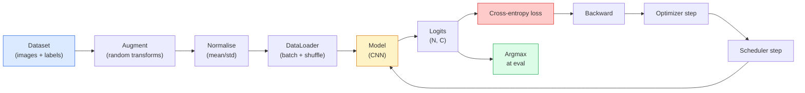

# 图像分类

> 分类器是一个将像素映射为各类别概率分布的函数。其余工作，都是把整条处理流程接起来。

**Type:** Build
**Languages:** Python
**Prerequisites:** 第 2 阶段第 09 课（模型评估）、第 3 阶段第 10 课（迷你框架）、第 4 阶段第 03 课（卷积神经网络）
**Time:** ~75 分钟

## 学习目标

- 在 CIFAR-10 上搭建端到端图像分类管线（pipeline）：数据集、数据增强、模型、训练循环和评估
- 解释各个组件（数据加载器、损失函数、优化器、学习率调度器、数据增强）的作用，并判断其中任意一个组件出错时，损失曲线会出现什么表现
- 从零实现 mixup（混合样本及标签）、cutout（随机遮挡）和标签平滑（label smoothing），并说明何时值得加入这些方法
- 通过混淆矩阵（confusion matrix）及各类别的精确率（precision）/召回率（recall）表，诊断总体准确率无法揭示的数据集和模型问题

## 要解决的问题

每一种实际交付的视觉任务，都在某种层面上归结为图像分类。目标检测对区域分类，图像分割对像素分类，检索则按与类别中心的相似度排序。把分类做好，也就是把数据集遍历、数据增强策略、损失函数和评估做好，这项能力可以迁移到本阶段的所有其他任务。

分类中的大多数 bug 并不在模型里，而在管线中：标准化出了错、训练集没有打乱、数据增强改变了标签含义、验证集混入了训练数据，或学习率在第 30 轮（epoch）后悄然导致训练发散。同一个卷积神经网络（CNN），配置正确时本可在 CIFAR-10 上达到 93% 的准确率，配置出错后却常常只有 70-75%，而损失曲线从头到尾看上去都还算正常。

本课将手动串起整条管线，让每个环节都可检查。你不会使用 `torchvision.datasets` 中任何可能掩盖 bug 的功能。

## 核心概念

### 分类管线



这个循环的每一行都可能藏着 bug。交叉熵（cross-entropy）接收的是原始 logits（未经归一化的分数），而不是 softmax 的输出，所以在计算损失前调用任何 `model(x).softmax()`，都会悄悄算出错误的梯度。数据增强只作用于输入，不改标签；mixup 是例外，它会同时混合两者。每一步都必须调用一次 `optimizer.zero_grad()`；跳过这一步会使梯度不断累积，表现得就像学习率极不稳定。这些 bug 都不会抛出错误，却会让学习曲线趋于平坦。

### 交叉熵、logits 和 softmax

分类器为每张图像输出 `C` 个数，称为 logits。对它们应用 softmax，就能得到一个概率分布：

```text
softmax(z)_i = exp(z_i) / sum_j exp(z_j)
```

交叉熵衡量的是正确类别的负对数概率：

```text
CE(z, y) = -log( softmax(z)_y )
        = -z_y + log( sum_j exp(z_j) )
```

等式右侧是数值稳定的写法，即 log-sum-exp。PyTorch 的 `nn.CrossEntropyLoss` 将 softmax + 负对数似然（NLL）融合为一次运算，直接接收原始 logits。如果先自行应用 softmax，几乎总是一个 bug：你算出的将是 log(softmax(softmax(z)))，一个没有意义的量。

### 数据增强为什么有效

CNN 通过权重共享，具备了针对平移的归纳偏置（inductive bias），却并不天然具备对裁剪、翻转、颜色扰动或遮挡的不变性。要教会它这些不变性，唯一的方法就是让它看到经过相应变化的像素。训练中的每一次随机变换，都相当于在告诉模型：“这两张图像的标签相同，请学习那些不受这种差异影响的特征。”

```text
Original crop:  "dog facing left"
Flip:           "dog facing right"       <- same label, different pixels
Rotate(+15):    "dog, slight tilt"
Colour jitter:  "dog in warmer light"
RandomErasing:  "dog with patch missing"
```

原则是：数据增强必须保持标签不变。对数字图像应用 Cutout 或旋转，可能会把“6”变成“9”；对于这类数据集，应缩小旋转角度范围，并选择符合数字自身不变性的数据增强方法。

### Mixup 和 cutmix

普通数据增强会变换像素，但仍保留one-hot（独热）标签。**Mixup** 和 **cutmix** 则打破了这一做法，同时对输入和标签进行插值。

```text
Mixup:
  lambda ~ Beta(a, a)
  x = lambda * x_i + (1 - lambda) * x_j
  y = lambda * y_i + (1 - lambda) * y_j

Cutmix:
  paste a random rectangle of x_j into x_i
  y = area-weighted mix of y_i and y_j
```

它们为何有效？模型不再死记那些尖锐的独热目标，而是学会在类别之间插值。训练损失会上升，测试准确率也会上升。对任何分类器而言，这都是提升鲁棒性最省成本的一项改进。

### 标签平滑

这是与 mixup 相近的一种方法。不再使用 `[0, 0, 1, 0, 0]` 作为训练目标，而改用 `[eps/C, eps/C, 1-eps, eps/C, eps/C]`，其中 `eps` 取 0.1 这样的小值。它可以阻止模型产生无限尖锐的 logits，几乎不增加成本就能改善校准（calibration）。从 PyTorch 1.10 起，`nn.CrossEntropyLoss(label_smoothing=0.1)` 已内置这一功能。

### 不只看准确率的评估

总体准确率会掩盖类别不平衡。对于类别比例为 90-10 的二分类问题，只要始终预测多数类，就能得到 90% 的准确率。要看清模型的实际表现，需要以下工具：

- **各类别准确率**：每个类别对应一个数，能立即暴露表现不佳的类别
- **混淆矩阵**：一个 C x C 网格，第 i 行第 j 列表示真实类别为 i、却被预测为 j 的样本数量；对角线对应正确预测，非对角线则揭示了模型的错误分布
- **Top-1 / Top-5**：正确类别是否位于预测排名前 1 或前 5 的结果中；Top-5 对 ImageNet 很重要，因为“Norwich terrier（诺里奇梗）”与“Norfolk terrier（诺福克梗）”这样的类别确实容易混淆
- **校准（ECE，期望校准误差）**：置信度为 0.8 的预测，是否有 80% 的时候是正确的？现代网络普遍过度自信，可以用温度缩放（temperature scaling）或标签平滑来修正

```figure
receptive-field
```

## 动手实现

### Step 1：确定性的合成数据集

CIFAR-10 数据存放在磁盘上。为了让本课快速运行且结果可复现，我们构建一个与 CIFAR 相似的合成数据集：图像为 32x32 RGB（红绿蓝）格式，各类别具有不同的结构，模型必须学会识别这些结构。同一条管线无需改动，就能用于真实的 CIFAR-10。

```python
import numpy as np
import torch
from torch.utils.data import Dataset


def synthetic_cifar(num_per_class=1000, num_classes=10, seed=0):
    rng = np.random.default_rng(seed)
    X = []
    Y = []
    for c in range(num_classes):
        centre = rng.uniform(0, 1, (3,))
        freq = 2 + c
        for _ in range(num_per_class):
            yy, xx = np.meshgrid(np.linspace(0, 1, 32), np.linspace(0, 1, 32), indexing="ij")
            r = np.sin(xx * freq) * 0.5 + centre[0]
            g = np.cos(yy * freq) * 0.5 + centre[1]
            b = (xx + yy) * 0.5 * centre[2]
            img = np.stack([r, g, b], axis=-1)
            img += rng.normal(0, 0.08, img.shape)
            img = np.clip(img, 0, 1)
            X.append(img.astype(np.float32))
            Y.append(c)
    X = np.stack(X)
    Y = np.array(Y)
    idx = rng.permutation(len(X))
    return X[idx], Y[idx]


class ArrayDataset(Dataset):
    def __init__(self, X, Y, transform=None):
        self.X = X
        self.Y = Y
        self.transform = transform

    def __len__(self):
        return len(self.X)

    def __getitem__(self, i):
        img = self.X[i]
        if self.transform is not None:
            img = self.transform(img)
        img = torch.from_numpy(img).permute(2, 0, 1)
        return img, int(self.Y[i])
```

每个类别都有自己的配色和频率模式，再叠加高斯噪声，迫使模型学习有效信号，而不是死记像素。共十个类别，每类一千张图像，顺序已打乱。

### Step 2：标准化与数据增强

这是每条视觉管线都会用到的两种变换。

```python
def standardize(mean, std):
    mean = np.array(mean, dtype=np.float32)
    std = np.array(std, dtype=np.float32)
    def _fn(img):
        return (img - mean) / std
    return _fn


def random_hflip(p=0.5):
    def _fn(img):
        if np.random.random() < p:
            return img[:, ::-1, :].copy()
        return img
    return _fn


def random_crop(pad=4):
    def _fn(img):
        h, w = img.shape[:2]
        padded = np.pad(img, ((pad, pad), (pad, pad), (0, 0)), mode="reflect")
        y = np.random.randint(0, 2 * pad)
        x = np.random.randint(0, 2 * pad)
        return padded[y:y + h, x:x + w, :]
    return _fn


def compose(*fns):
    def _fn(img):
        for fn in fns:
            img = fn(img)
        return img
    return _fn
```

裁剪前采用反射填充（reflect padding），而不是零填充，因为黑色边框会成为一种信号，模型虽然会学着忽略它，却无法从中学到有用的东西。

### Step 3：Mixup

在一个训练步骤内混合两张图像及其两个标签。将其实现为批次变换，使它紧邻前向传播执行，而不是放在数据集内部。

```python
def mixup_batch(x, y, num_classes, alpha=0.2):
    if alpha <= 0:
        return x, torch.nn.functional.one_hot(y, num_classes).float()
    lam = float(np.random.beta(alpha, alpha))
    idx = torch.randperm(x.size(0), device=x.device)
    x_mixed = lam * x + (1 - lam) * x[idx]
    y_onehot = torch.nn.functional.one_hot(y, num_classes).float()
    y_mixed = lam * y_onehot + (1 - lam) * y_onehot[idx]
    return x_mixed, y_mixed


def soft_cross_entropy(logits, soft_targets):
    log_probs = torch.log_softmax(logits, dim=-1)
    return -(soft_targets * log_probs).sum(dim=-1).mean()
```

`soft_cross_entropy` 计算的是针对软标签分布的交叉熵。当目标恰好是独热标签时，它就退化为通常的独热标签情形。

### Step 4：训练循环

完整做法是：遍历一遍数据，每个批次计算一次梯度，每轮推进一次学习率调度器。

```python
import torch
import torch.nn as nn
from torch.utils.data import DataLoader
from torch.optim import SGD
from torch.optim.lr_scheduler import CosineAnnealingLR

def train_one_epoch(model, loader, optimizer, device, num_classes, use_mixup=True):
    model.train()
    total, correct, loss_sum = 0, 0, 0.0
    for x, y in loader:
        x, y = x.to(device), y.to(device)
        if use_mixup:
            x_m, y_soft = mixup_batch(x, y, num_classes)
            logits = model(x_m)
            loss = soft_cross_entropy(logits, y_soft)
        else:
            logits = model(x)
            loss = nn.functional.cross_entropy(logits, y, label_smoothing=0.1)
        optimizer.zero_grad()
        loss.backward()
        optimizer.step()
        loss_sum += loss.item() * x.size(0)
        total += x.size(0)
        # Training accuracy vs the un-mixed labels `y` is only an approximation
        # when mixup is on (the model saw soft targets, not y). Treat it as a
        # rough progress signal; rely on val accuracy for real performance.
        with torch.no_grad():
            pred = logits.argmax(dim=-1)
            correct += (pred == y).sum().item()
    return loss_sum / total, correct / total


@torch.no_grad()
def evaluate(model, loader, device, num_classes):
    model.eval()
    total, correct = 0, 0
    loss_sum = 0.0
    cm = torch.zeros(num_classes, num_classes, dtype=torch.long)
    for x, y in loader:
        x, y = x.to(device), y.to(device)
        logits = model(x)
        loss = nn.functional.cross_entropy(logits, y)
        pred = logits.argmax(dim=-1)
        for t, p in zip(y.cpu(), pred.cpu()):
            cm[t, p] += 1
        loss_sum += loss.item() * x.size(0)
        total += x.size(0)
        correct += (pred == y).sum().item()
    return loss_sum / total, correct / total, cm
```

每次编写训练循环，都要检查以下五条不变条件：

1. 训练前调用 `model.train()`，评估前调用 `model.eval()`，以切换 Dropout（随机失活）和批量归一化（BN）的行为
2. 调用 `.zero_grad()`，然后再调用 `.backward()`
3. 累积指标时调用 `.item()`，避免继续持有计算图
4. 评估时使用 `@torch.no_grad()`，节省内存和时间，也能避免不易察觉的意外
5. 对原始 logits 求 Argmax（最大值对应的索引），无需先算 softmax；结果相同，还能少做一次运算

### Step 5：组装完整管线

使用上一课的 `TinyResNet`，训练几轮后进行评估。

```python
from main import synthetic_cifar, ArrayDataset
from main import standardize, random_hflip, random_crop, compose
from main import mixup_batch, soft_cross_entropy
from main import train_one_epoch, evaluate
# TinyResNet comes from the previous lesson (03-cnns-lenet-to-resnet).
# Adjust the import path to wherever you stored the previous lesson's code.
from cnns_lenet_to_resnet import TinyResNet  # example placeholder

X, Y = synthetic_cifar(num_per_class=500)
split = int(0.9 * len(X))
X_train, Y_train = X[:split], Y[:split]
X_val, Y_val = X[split:], Y[split:]

mean = [0.5, 0.5, 0.5]
std = [0.25, 0.25, 0.25]
train_tf = compose(random_hflip(), random_crop(pad=4), standardize(mean, std))
eval_tf = standardize(mean, std)

train_ds = ArrayDataset(X_train, Y_train, transform=train_tf)
val_ds = ArrayDataset(X_val, Y_val, transform=eval_tf)

train_loader = DataLoader(train_ds, batch_size=128, shuffle=True, num_workers=0)
val_loader = DataLoader(val_ds, batch_size=256, shuffle=False, num_workers=0)

device = "cuda" if torch.cuda.is_available() else "cpu"
model = TinyResNet(num_classes=10).to(device)
optimizer = SGD(model.parameters(), lr=0.1, momentum=0.9, weight_decay=5e-4, nesterov=True)
scheduler = CosineAnnealingLR(optimizer, T_max=10)

for epoch in range(10):
    tr_loss, tr_acc = train_one_epoch(model, train_loader, optimizer, device, 10, use_mixup=True)
    va_loss, va_acc, _ = evaluate(model, val_loader, device, 10)
    scheduler.step()
    print(f"epoch {epoch:2d}  lr {scheduler.get_last_lr()[0]:.4f}  "
          f"train {tr_loss:.3f}/{tr_acc:.3f}  val {va_loss:.3f}/{va_acc:.3f}")
```

在合成数据集上，这套流程五轮内就能使验证准确率接近满分。这正是我们要确认的：管线正确，模型也能学会那些可学习的模式。将数据集换成真实的 CIFAR-10，无需更改，同一个循环就能训练到 ~90% 的准确率。

### Step 6：解读混淆矩阵

只看准确率，永远无法知道模型到底在哪些地方出错。混淆矩阵能告诉你。

```python
def print_confusion(cm, labels=None):
    c = cm.shape[0]
    labels = labels or [str(i) for i in range(c)]
    print(f"{'':>6}" + "".join(f"{l:>5}" for l in labels))
    for i in range(c):
        row = cm[i].tolist()
        print(f"{labels[i]:>6}" + "".join(f"{v:>5}" for v in row))
    print()
    tp = cm.diag().float()
    fp = cm.sum(dim=0).float() - tp
    fn = cm.sum(dim=1).float() - tp
    prec = tp / (tp + fp).clamp_min(1)
    rec = tp / (tp + fn).clamp_min(1)
    f1 = 2 * prec * rec / (prec + rec).clamp_min(1e-9)
    for i in range(c):
        print(f"{labels[i]:>6}  prec {prec[i]:.3f}  rec {rec[i]:.3f}  f1 {f1[i]:.3f}")

_, _, cm = evaluate(model, val_loader, device, 10)
print_confusion(cm)
```

行表示真实类别，列表示预测类别。如果类别 3 和类别 5 之间的非对角线单元格出现了大量计数，就说明模型容易混淆这两个类别。你可以从这里入手，有针对性地收集数据，或设计适用于特定类别的数据增强。

## 实际使用

`torchvision` 将上述功能封装成了符合框架习惯的组件。对于真实的 CIFAR-10，四行代码加一个训练循环，就能组成完整管线。

```python
from torchvision.datasets import CIFAR10
from torchvision.transforms import Compose, RandomCrop, RandomHorizontalFlip, ToTensor, Normalize

mean = (0.4914, 0.4822, 0.4465)
std = (0.2470, 0.2435, 0.2616)
train_tf = Compose([
    RandomCrop(32, padding=4, padding_mode="reflect"),
    RandomHorizontalFlip(),
    ToTensor(),
    Normalize(mean, std),
])
eval_tf = Compose([ToTensor(), Normalize(mean, std)])

train_ds = CIFAR10(root="./data", train=True,  download=True, transform=train_tf)
val_ds   = CIFAR10(root="./data", train=False, download=True, transform=eval_tf)
```

需要注意两点：均值和标准差是**数据集特定的统计量**，应由 CIFAR-10 训练集计算得到，而不是沿用 ImageNet 的统计量；反射填充则是社区默认的裁剪策略。直接把 ImageNet 的统计量复制到这里，会造成 ~1% 的准确率损失，而这类问题往往要等到有人仔细分析模型时才会被发现。

## 交付成果

本课产出以下成果：

- `outputs/prompt-classifier-pipeline-auditor.md`：一份提示词（prompt），按照上述五条不变条件审查训练脚本，并指出第一个违规之处
- `outputs/skill-classification-diagnostics.md`：一项技能，根据混淆矩阵和类别名称列表，总结各类别的失败情况，并提出影响最大的一项修复措施

## 练习

1. **（简单）** 在合成数据集上，分别启用和禁用 mixup，用同一个模型训练五轮。绘制两种设置下的训练损失和验证损失曲线。解释为什么使用 mixup 时训练损失更高，验证准确率却相近或更好
2. **（中等）** 实现 Cutout，将每张训练图像中一个随机的 8x8 正方形区域置零；进行消融实验（ablation），比较不做数据增强、hflip+crop、hflip+crop+cutout、hflip+crop+mixup 这四种设置。报告各自的验证准确率
3. **（困难）** 搭建 CIFAR-100 管线（100 个类别，输入尺寸相同），复现一次 ResNet-34 训练，使准确率与已发表结果相差不超过 1%。附加任务：遍历三种学习率和两种权重衰减值，将结果记录到本地 CSV，并根据最终混淆矩阵生成最易混淆类别的汇总表

## 关键术语

| 术语 | 常见说法 | 实际含义 |
|------|----------------|----------------------|
| Logits | “原始输出” | 每张图像对应一个含 C 个数的向量，尚未经过 softmax；交叉熵需要的是这些值，而不是 softmax 的结果 |
| 交叉熵 | “损失函数” | 正确类别的负对数概率；把 log-softmax 和 NLL 融合成一次数值稳定的运算 |
| DataLoader（数据加载器） | “组批工具” | 为数据集提供打乱、组批和可选的多工作进程加载功能；训练 bug 有一半会被归咎于它 |
| 数据增强 | “随机变换” | 训练时对像素进行的任何保持标签不变的变换；让 CNN 学会它原本不具备的不变性 |
| Mixup / Cutmix | “混合两张图像” | 同时混合输入和标签，让分类器学习平滑插值，而不是硬性边界 |
| 标签平滑 | “更柔和的目标” | 用 (1-eps, eps/(C-1), ...) 取代独热标签；改善校准，并小幅提升准确率 |
| Top-k 准确率 | “Top-5” | 正确类别位于预测概率最高的 k 个类别中；用于类别确实容易混淆的数据集 |
| 混淆矩阵 | “错误集中在哪里” | 一个 C x C 表，其中 (i, j) 项统计真实类别为 i、被预测为 j 的图像数量；对角线是正确预测，非对角线告诉你该修复哪些问题 |

## 延伸阅读

- [CS231n: Training Neural Networks](https://cs231n.github.io/neural-networks-3/)：至今仍是单页讲清训练管线最清晰的材料
- [Bag of Tricks for Image Classification (He et al., 2019)](https://arxiv.org/abs/1812.01187)：将这些小技巧组合起来，可使 ResNet 在 ImageNet 上的准确率提升 3-4%
- [mixup: Beyond Empirical Risk Minimization (Zhang et al., 2017)](https://arxiv.org/abs/1710.09412)：mixup 的原始论文，用三页篇幅介绍理论，再辅以有说服力的实验
- [Why temperature scaling matters (Guo et al., 2017)](https://arxiv.org/abs/1706.04599)：这篇论文证明现代网络存在校准不佳的问题，并用一个标量参数加以修正
