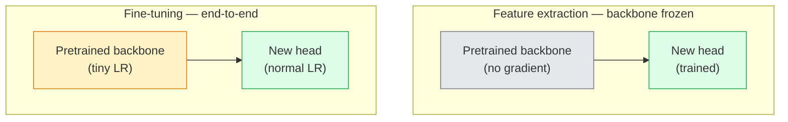

# 迁移学习与微调

> 别人已经花了一百万 GPU 小时，教会网络识别边缘、纹理和物体部件。在训练自己的网络之前，你应该先借用这些特征。

**Type:** Build
**Languages:** Python
**Prerequisites:** 阶段 4 第 03 课（CNNs）、阶段 4 第 04 课（图像分类）
**Time:** ~75 分钟

## 学习目标

- 区分特征提取（feature extraction）与微调（fine-tuning），并根据数据集大小、领域差异（domain distance）和计算预算选择合适的方法
- 加载预训练的主干网络（backbone），替换其分类头（classifier head），用不到 20 行代码只训练分类头，得到可用的基线
- 使用差异化学习率（discriminative learning rates）逐步解冻（progressive unfreezing）各层，让早期的通用特征获得比后期任务特定特征更小的更新
- 诊断三种常见故障：解冻块上的学习率（LR）过高造成的特征漂移（feature drift）、极小数据集上的批量归一化（BN）统计量崩溃，以及灾难性遗忘（catastrophic forgetting）

## 要解决的问题

在 ImageNet 上训练一个 ResNet-50，大约需要 2,000 GPU-hours。很少有团队能为交付的每个任务都投入这样的预算。实际上，几乎所有团队交付的都是预训练主干网络，加上用几百或几千张任务专用图像训练的新分类头。

这并不是走捷径。任何在 ImageNet 上训练的卷积神经网络（CNN），其第一个卷积块学到的都是边缘和类似 Gabor 的滤波器。接下来的几个块学习纹理和简单图案，中间的块学习物体部件，最后的块则学习一些组合，逐渐接近 ImageNet 的 1,000 个类别。这套特征层级的前 90% 几乎无需变化，就能迁移到医学成像、工业检测、卫星数据以及其他所有视觉任务，因为自然界的边缘和纹理种类是有限的。你实际要训练的是最后的 10%。

要把迁移学习（transfer learning）做好，得避开三个问题：学习率过高，破坏预训练特征；冻结过多，让模型无法充分学习任务信息；还有 BatchNorm 的运行统计量向极小的数据集漂移，而网络的其余部分从未在该数据集上学习过。本课会有意逐一走过这些问题。

## 核心概念

### 特征提取与微调

这两种训练方式如何选择，取决于你对预训练特征的信任程度，以及手头的数据量。



经验法则如下（k 表示千）：

| 数据集大小 | 领域差异 | 训练方案 |
|--------------|-----------------|--------|
| < 1k 张图像 | 接近 ImageNet | 冻结主干网络，只训练分类头 |
| 1k-10k | 接近 | 冻结前 2-3 个阶段，微调其余部分 |
| 10k-100k | 任意 | 使用差异化学习率进行端到端微调 |
| 100k+ | 较远 | 微调全部参数；如果领域差异足够大，可考虑从零训练 |

“接近 ImageNet”大致是指以物体为内容的自然 RGB 照片。医学 CT 扫描、俯视卫星影像和显微图像都属于差异较大的领域。预训练特征仍然有用，但你需要让更多层适应新任务。

### 为什么冻结也能奏效

CNN 在 ImageNet 上学到的特征，并非专门针对那 1,000 个类别，而是针对自然图像的统计特性：特定方向的边缘、纹理、对比度模式和基本形状。在人们能想到的几乎所有视觉领域中，这些统计特性都很稳定。正因如此，在 ImageNet 上训练的模型，只换上一个新的线性分类头、不微调主干网络，在 CIFAR-10 上进行零样本（zero-shot）评估时，也能达到 80%+ 的准确率。分类头学习的是：针对当前任务，应该为哪些已有特征赋予更高权重。

### 差异化学习率

解冻时，早期层的更新应该比后期层更慢。早期层编码的是你希望保留的通用特征；后期层编码的是任务特定结构，需要进行较大的调整。

```text
Typical recipe:

  stage 0 (stem + first group): lr = base_lr / 100    (mostly fixed)
  stage 1:                       lr = base_lr / 10
  stage 2:                       lr = base_lr / 3
  stage 3 (last backbone group): lr = base_lr
  head:                          lr = base_lr  (or slightly higher)
```

在 PyTorch 中，只需把一个参数组列表传给优化器即可。一个模型，五个学习率，无需额外代码。

### BatchNorm 的问题

BN 层保存着在 ImageNet 上计算得到的 `running_mean` 和 `running_var` 缓冲区。如果当前任务的像素分布不同，例如光照、传感器或色彩空间不同，这些缓冲区中的统计量就不适用了。以下三种处理方式按推荐顺序排列：

1. **让 BN 保持训练模式进行微调。** 让 BN 的运行统计量随其他部分一起更新。当任务数据集规模中等（>= 5k 个样本）时，这是默认选择。
2. **将 BN 冻结在评估模式。** 保留 ImageNet 的统计量，只训练权重。当数据集很小、BN 的移动平均会有较大噪声时，这种做法是合适的。
3. **用 GroupNorm（组归一化）替换 BN。** 这样就完全消除了移动平均带来的问题。目标检测和图像分割的主干网络常采用这种做法，因为它们在每个 GPU 上的批量大小很小。

这部分处理不当，会在没有明显报错的情况下让准确率下降 5-15%。

### 分类头设计

分类头由 1-3 个线性层组成，也可以加入 Dropout（随机失活）。每个 torchvision 主干网络都带有一个默认分类头，你需要将它替换掉：

```text
backbone.fc = nn.Linear(backbone.fc.in_features, num_classes)          # ResNet
backbone.classifier[1] = nn.Linear(..., num_classes)                    # EfficientNet, MobileNet
backbone.heads.head = nn.Linear(..., num_classes)                       # torchvision ViT
```

对小数据集来说，一个线性层通常就够了。当任务分布与主干网络的训练分布相差较大时，增加一个隐藏层（Linear -> ReLU -> Dropout -> Linear）会有所帮助。

### 逐层学习率衰减

逐层学习率衰减（layer-wise LR decay）是差异化学习率的一种更平滑的形式，常用于现代微调方法，例如 BEiT、DINOv2 和 ViT-B 的微调。它不把网络层按阶段分组，而是让每一层的学习率都比它上面一层略小：

```text
lr_layer_k = base_lr * decay^(L - k)
```

当 decay = 0.75，且 L = 12 个 Transformer 块时，第一个块的学习率是分类头学习率的 `0.75^11 ≈ 0.04x`。与 CNN 相比，这种做法对 Transformer 微调更重要；CNN 通常按阶段分组设置学习率就够了。

### 评估什么

迁移学习需要跟踪两个从零训练时不会跟踪的指标：

- **仅使用预训练特征时的准确率**：冻结主干网络时分类头的准确率。这是效果的下限。
- **微调后的准确率**：同一模型经过端到端训练后的准确率。这是效果的上限。

如果微调后的准确率低于仅使用预训练特征时的准确率，说明学习率或 BN 处理存在问题。始终把两个指标都打印出来。

```figure
transfer-learning
```

## 动手实现

### 步骤 1：加载并检查预训练主干网络

```python
import torch
import torch.nn as nn
from torchvision.models import resnet18, ResNet18_Weights

backbone = resnet18(weights=ResNet18_Weights.IMAGENET1K_V1)
print(backbone)
print()
print("classifier head:", backbone.fc)
print("feature dim:", backbone.fc.in_features)
```

`ResNet18` 包含四个阶段（`layer1..layer4`），以及输入端特征提取层（stem）和一个 `fc` 分类头。torchvision 中的每个分类主干网络都有类似的结构。

### 步骤 2：特征提取，冻结全部参数后替换分类头

```python
def make_feature_extractor(num_classes=10):
    model = resnet18(weights=ResNet18_Weights.IMAGENET1K_V1)
    for p in model.parameters():
        p.requires_grad = False
    model.fc = nn.Linear(model.fc.in_features, num_classes)
    return model

model = make_feature_extractor(num_classes=10)
trainable = sum(p.numel() for p in model.parameters() if p.requires_grad)
frozen = sum(p.numel() for p in model.parameters() if not p.requires_grad)
print(f"trainable: {trainable:>10,}")
print(f"frozen:    {frozen:>10,}")
```

只有 `model.fc` 可训练。主干网络是一个冻结的特征提取器。

### 步骤 3：差异化学习率微调

下面的工具函数会为不同阶段创建参数组，并分别设置学习率。

```python
def discriminative_param_groups(model, base_lr=1e-3, decay=0.3):
    stages = [
        ["conv1", "bn1"],
        ["layer1"],
        ["layer2"],
        ["layer3"],
        ["layer4"],
        ["fc"],
    ]
    groups = []
    for i, names in enumerate(stages):
        lr = base_lr * (decay ** (len(stages) - 1 - i))
        params = [p for n, p in model.named_parameters()
                  if any(n.startswith(k) for k in names)]
        if params:
            groups.append({"params": params, "lr": lr, "name": "_".join(names)})
    return groups

model = resnet18(weights=ResNet18_Weights.IMAGENET1K_V1)
model.fc = nn.Linear(model.fc.in_features, 10)
for p in model.parameters():
    p.requires_grad = True

groups = discriminative_param_groups(model)
for g in groups:
    print(f"{g['name']:>10s}  lr={g['lr']:.2e}  params={sum(p.numel() for p in g['params']):>8,}")
```

`decay=0.3` 表示每个阶段的学习率都是下一阶段的 30%。`fc` 使用 `base_lr`，`layer4` 使用 `0.3 * base_lr`，`conv1` 使用 `0.3^5 * base_lr ≈ 0.00243 * base_lr`。听起来很极端，但经验表明它确实有效。

### 步骤 4：处理 BatchNorm

下面的辅助函数用于冻结 BN 的运行统计量，同时不冻结其权重。

```python
def freeze_bn_stats(model):
    for m in model.modules():
        if isinstance(m, (nn.BatchNorm1d, nn.BatchNorm2d, nn.BatchNorm3d)):
            m.eval()
            for p in m.parameters():
                p.requires_grad = False
    return model
```

在每轮（epoch）训练开始时，先设置 `model.train()`，再调用这个函数。`model.train()` 会把所有模块切换到训练模式；这个函数则只把 BN 层切回评估模式。

### 步骤 5：最小端到端微调循环

```python
from torch.optim import SGD
from torch.utils.data import DataLoader
from torch.optim.lr_scheduler import CosineAnnealingLR
import torch.nn.functional as F

def fine_tune(model, train_loader, val_loader, device, epochs=5, base_lr=1e-3, freeze_bn=False):
    model = model.to(device)
    groups = discriminative_param_groups(model, base_lr=base_lr)
    optimizer = SGD(groups, momentum=0.9, weight_decay=1e-4, nesterov=True)
    scheduler = CosineAnnealingLR(optimizer, T_max=epochs)

    for epoch in range(epochs):
        model.train()
        if freeze_bn:
            freeze_bn_stats(model)
        tr_loss, tr_correct, tr_total = 0.0, 0, 0
        for x, y in train_loader:
            x, y = x.to(device), y.to(device)
            logits = model(x)
            loss = F.cross_entropy(logits, y, label_smoothing=0.1)
            optimizer.zero_grad()
            loss.backward()
            optimizer.step()
            tr_loss += loss.item() * x.size(0)
            tr_total += x.size(0)
            tr_correct += (logits.argmax(-1) == y).sum().item()
        scheduler.step()

        model.eval()
        va_total, va_correct = 0, 0
        with torch.no_grad():
            for x, y in val_loader:
                x, y = x.to(device), y.to(device)
                pred = model(x).argmax(-1)
                va_total += x.size(0)
                va_correct += (pred == y).sum().item()
        print(f"epoch {epoch}  train {tr_loss/tr_total:.3f}/{tr_correct/tr_total:.3f}  "
              f"val {va_correct/va_total:.3f}")
    return model
```

在 CIFAR-10 上按上述方案训练五轮，可以让 `ResNet18-IMAGENET1K_V1` 从 ~70% 的零样本线性探测（linear probe）准确率，提升到 ~93% 的微调准确率。如果完全不调整主干网络、只训练分类头，准确率会在 86% 左右进入平台期。

### 步骤 6：逐步解冻

这套调度方案从后往前，每轮解冻一个阶段。它能缓解特征漂移，代价是多训练几轮。

```python
def progressive_unfreeze_schedule(model):
    stages = ["layer4", "layer3", "layer2", "layer1"]
    yielded = set()

    def start():
        for p in model.parameters():
            p.requires_grad = False
        for p in model.fc.parameters():
            p.requires_grad = True

    def unfreeze(epoch):
        if epoch < len(stages):
            name = stages[epoch]
            yielded.add(name)
            for n, p in model.named_parameters():
                if n.startswith(name):
                    p.requires_grad = True
            return name
        return None

    return start, unfreeze
```

第一轮训练前调用一次 `start()`。每轮开始时调用 `unfreeze(epoch)`。只要可训练参数的集合发生变化，就重新创建优化器；否则，冻结参数中保留的缓存的矩估计会干扰优化器。

## 实际使用

对大多数实际任务来说，`torchvision.models` 加上三行代码就够了。只有遇到库的默认设置无法解决的问题时，前面那些更复杂的机制才显得重要。

```python
from torchvision.models import resnet50, ResNet50_Weights

model = resnet50(weights=ResNet50_Weights.IMAGENET1K_V2)
model.fc = nn.Linear(model.fc.in_features, num_classes)
optimizer = torch.optim.AdamW(model.parameters(), lr=1e-4, weight_decay=1e-4)
```

还有两种可用于生产环境的默认选择：

- `timm` 提供 ~800 个预训练视觉主干网络，使用统一的 API（应用程序编程接口）：`timm.create_model("resnet50", pretrained=True, num_classes=10)`。如果微调需求超出了 torchvision 的模型库，它就是标准选择。
- 对 Transformer，`transformers.AutoModelForImageClassification.from_pretrained(name, num_labels=N)` 可以加载 ViT / BEiT / DeiT，加载语义与文本模型相同。

## 交付成果

本课会产出：

- `outputs/prompt-fine-tune-planner.md`：一个提示词（prompt），根据数据集大小、领域差异和计算预算，在特征提取、逐步解冻微调和端到端微调之间作出选择。
- `outputs/skill-freeze-inspector.md`：一个技能，接收 PyTorch 模型后，报告哪些参数可训练、哪些 BatchNorm 层处于评估模式，以及优化器是否确实接收了可训练参数。

## 练习

1. **（简单）** 在同一个 synthetic-CIFAR 数据集上，分别对 `ResNet18` 进行线性探测训练（冻结主干网络）和全量微调。并列报告两个准确率，说明什么样的差距表示特征迁移效果好，什么样的差距表示效果不好。
2. **（中等）** 有意引入一个错误：把 `base_lr = 1e-1` 设置在主干网络的阶段上，而不是分类头上。展示训练损失如何剧增，再通过 `discriminative_param_groups` 辅助函数恢复训练。记录每个阶段开始发散时的 LR。
3. **（困难）** 选取一个医学成像数据集，例如 CheXpert-small、PatchCamelyon 或 HAM10000，比较三种训练方式：(a) 冻结 ImageNet 预训练主干网络，只训练线性分类头；(b) 对 ImageNet 预训练模型进行端到端微调；(c) 从零训练。报告每种方式的准确率和计算成本。数据集达到多大时，从零训练才有竞争力？

## 关键术语

| 术语 | 常见说法 | 实际含义 |
|------|----------------|----------------------|
| 特征提取 | “冻结后训练分类头” | 主干网络参数被冻结，只有新的分类头接收梯度 |
| 微调 | “端到端重新训练” | 所有参数都可训练，学习率通常比从零训练小得多 |
| 差异化学习率 | “早期层用更小的 LR” | 为优化器设置参数组，使早期阶段的 LR 是后期阶段 LR 的一个比例 |
| 逐层学习率衰减 | “平滑变化的 LR 梯度” | 每层的 LR 乘以 decay^(L - k)；常见于 Transformer 微调 |
| 灾难性遗忘 | “模型忘掉了 ImageNet” | LR 过高，在学到新任务信号之前就覆盖了预训练特征 |
| BN 统计量漂移 | “运行均值不对” | BatchNorm 的 running_mean/var 是在与当前任务不同的分布上计算的，因而悄然损害准确率 |
| 线性探测 | “冻结的主干网络 + 线性分类头” | 评估预训练特征，即在冻结表示上训练出的最佳线性分类器的准确率 |
| 灾难性崩溃（catastrophic collapse） | “所有输入都预测成同一类” | 微调时 LR 太高，在分类头的梯度稳定下来之前就破坏了特征 |

## 延伸阅读

- [How transferable are features in deep neural networks? (Yosinski et al., 2014)](https://arxiv.org/abs/1411.1792)：量化不同层之间特征可迁移性的论文
- [Universal Language Model Fine-tuning (ULMFiT, Howard & Ruder, 2018)](https://arxiv.org/abs/1801.06146)：差异化学习率与逐步解冻方案的最初来源；这些思路可以直接迁移到视觉任务
- [timm documentation](https://huggingface.co/docs/timm)：现代视觉主干网络的参考文档，以及训练这些网络时使用的具体微调默认设置
- [A Simple Framework for Linear-Probe Evaluation (Kornblith et al., 2019)](https://arxiv.org/abs/1805.08974)：线性探测准确率为何重要，以及如何正确报告它
