# 目标检测：从零实现 YOLO

> 目标检测（object detection）是在特征图（feature map）的每个位置同时做分类与回归，再用非极大值抑制（non-maximum suppression，NMS）清除重复预测。

**Type:** Build
**Languages:** Python
**Prerequisites:** 阶段 4 第 03 课（CNNs）、阶段 4 第 04 课（图像分类）、阶段 4 第 05 课（迁移学习）
**Time:** ~75 分钟

## 学习目标

- 解释网格与锚框（anchor）的设计如何把目标检测转化为密集预测（dense prediction）问题，并说明输出张量（tensor）中每个数值的含义
- 计算框之间的交并比（Intersection-over-Union，IoU），并从零实现非极大值抑制
- 在预训练主干网络（backbone）上构建一个最简 YOLO 风格检测头，包括分类损失、目标存在性（objectness）损失和边界框回归损失
- 读懂一行检测指标：precision@0.5（精确率）、recall（召回率）、mAP@0.5 和 mAP@0.5:0.95（mAP 即平均精确率均值），并选择下一步要调整的参数

## 要解决的问题

分类会说：“这张图是一只狗。”目标检测会说：“像素坐标 (112, 40, 280, 210) 处有一只狗，(400, 180, 560, 310) 处有一只猫，画面里没有其他目标。”结构上只有这一处变化：不再为每张图预测一个标签，而是预测数量不定、带有标签的边界框。每一种自主系统、监控产品、文档版面解析器和工厂视觉产线都依赖这项变化。

目标检测也让计算机视觉中的各种工程取舍同时摆在眼前。你既希望框的位置准确（回归头），也希望每个框的类别正确（分类头，classifier head）；还希望模型知道什么时候没有目标可检测（目标存在性分数），并且每个真实目标恰好只对应一个预测（非极大值抑制）。任何一环缺失，管线（pipeline）就可能漏掉目标、报出并不存在的框，或者在略有差异的位置把同一个目标预测十五次。

YOLO（You Only Look Once，Redmon 等，2016）通过卷积网络的一次前向传播，就能实时完成所有这些工作。同样的结构设计至今仍是现代检测器（YOLOv8、YOLOv9、YOLO-NAS、RT-DETR）的基础。掌握核心之后，每种变体都只是把相同的组件重新组合。

## 核心概念

### 将目标检测视为密集预测

分类器为每张图输出 C 个数值。YOLO 风格的检测器为每张图输出 `(S x S x (5 + C))` 个数值，其中 S 是空间网格的大小。

```mermaid
flowchart LR
    IMG["Input 416x416 RGB"] --> BB["Backbone<br/>(ResNet, DarkNet, ...)"]
    BB --> FM["Feature map<br/>(C_feat, 13, 13)"]
    FM --> HEAD["Detection head<br/>(1x1 convs)"]
    HEAD --> OUT["Output tensor<br/>(13, 13, B * (5 + C))"]
    OUT --> DEC["Decode<br/>(grid + sigmoid + exp)"]
    DEC --> NMS["Non-max suppression"]
    NMS --> RESULT["Final boxes"]

    style IMG fill:#dbeafe,stroke:#2563eb
    style HEAD fill:#fef3c7,stroke:#d97706
    style NMS fill:#fecaca,stroke:#dc2626
    style RESULT fill:#dcfce7,stroke:#16a34a
```



`S * S` 个网格单元中的每一个都预测 `B` 个框。对每个框而言：

- 4 个数值描述几何信息：`tx, ty, tw, th`。
- 1 个数值是目标存在性分数，回答“是否有一个目标的中心位于这个单元中？”
- C 个数值是各类别的概率。

每个单元合计输出 `B * (5 + C)` 个数值。对于 VOC，若 `S=13, B=2, C=20`，每个单元就输出 50 个数值。

### 为什么需要网格与锚框

直接回归会为每个目标预测绝对坐标形式的 `(x, y, w, h)`。这对卷积网络来说很难，因为平移图像不应让所有预测都平移相同距离：每个目标都有各自的空间锚定位置。网格的解决办法是把每个真实框（ground-truth box）分配给其中心所在的网格单元，只有这个单元负责该目标。

锚框解决的是另一个问题。一个 3x3 卷积很难从感受野（receptive field）只有 16 像素的特征单元中，回归出一个宽 500 像素的框。为此，我们预先在每个单元中定义 `B` 种先验框形状，也就是锚框，再预测相对每个锚框的小幅偏移。模型学的是选对锚框并微调它，而不是从无到有地回归整个框。

```text
Anchor box priors (example for 416x416 input):

  small:   (30,  60)
  medium:  (75,  170)
  large:   (200, 380)

At each grid cell, every anchor emits (tx, ty, tw, th, obj, c_1, ..., c_C).
```

现代检测器经常使用特征金字塔网络（FPN），在不同分辨率上配置不同的锚框集合：浅层的高分辨率特征图使用小锚框，深层的低分辨率特征图使用大锚框。思路相同，只是覆盖了更多尺度。

### 解码预测结果

原始的 `tx, ty, tw, th` 并不是框坐标，而是回归目标，需要经过变换才能画成框：

```text
centre x  = (sigmoid(tx) + cell_x) * stride
centre y  = (sigmoid(ty) + cell_y) * stride
width     = anchor_w * exp(tw)
height    = anchor_h * exp(th)
```

`sigmoid` 把中心偏移限制在单元内部。`exp` 允许框宽在锚框宽度的基础上自由缩放，同时不改变符号。`stride` 是步幅，用来把网格坐标缩放回像素坐标。从 v2 开始，YOLO 的每个版本都使用相同的解码步骤。

### 交并比（IoU）

这是目标检测中通用的两框相似度指标：

```text
IoU(A, B) = area(A intersect B) / area(A union B)
```

IoU = 1 表示两个框完全相同；IoU = 0 表示没有重叠。预测框与真实框之间的 IoU 决定一个预测是否算作真阳性（true positive），通常要求 IoU >= 0.5。两个预测框之间的 IoU 则用于 NMS 去重。

### 非极大值抑制

在相邻锚框上训练的卷积网络，经常会为同一个目标预测出彼此重叠的框。NMS 保留置信度最高的预测，并删除与它的 IoU 超过阈值的其他预测。

```text
NMS(boxes, scores, iou_threshold):
    sort boxes by score descending
    keep = []
    while boxes not empty:
        pick the top-scoring box, add to keep
        remove every box with IoU > iou_threshold to the picked box
    return keep
```

目标检测中的典型阈值是 0.45。较新的检测器用 `soft-NMS`、`DIoU-NMS` 替代标准 NMS，或者直接学习如何抑制重复预测（RT-DETR），但它们在整体结构中承担的作用相同。

### 损失函数

YOLO 的损失由三类损失加权相加得到：

```text
L = lambda_coord * L_box(pred, target, where obj=1)
  + lambda_obj   * L_obj(pred, 1,     where obj=1)
  + lambda_noobj * L_obj(pred, 0,     where obj=0)
  + lambda_cls   * L_cls(pred, target, where obj=1)
```

只有包含目标的单元才参与边界框回归损失和分类损失的计算。没有目标的单元只贡献目标存在性损失，让模型学会在这些位置不报目标。`lambda_noobj` 通常较小（~0.5），因为绝大多数单元都是空的；否则，这些单元会主导总损失。

现代变体用 CIoU / DIoU 替代均方误差（MSE）框损失，以直接优化 IoU；用焦点损失（focal loss）处理类别不平衡；再用质量焦点损失（quality focal loss）平衡目标存在性这一项。三类损失的结构没有改变。

### 检测指标

准确率不适合直接用于目标检测。适用的是下面四项指标：

- **Precision@IoU=0.5**：精确率（precision），即被计为正例的预测中，有多少是正确的。
- **Recall@IoU=0.5**：召回率（recall），即真实目标中，有多少被找到了。
- **AP@0.5**：IoU 阈值为 0.5 时精确率-召回率曲线下的面积，每个类别对应一个数值，即平均精确率（AP）。
- **mAP@0.5:0.95**：在 IoU 阈值为 0.5、0.55、...、0.95 时对 AP 取平均。这是 COCO 指标，最严格，也最能反映检测表现。

四项指标都要报告。检测器的 mAP@0.5 较高而 mAP@0.5:0.95 较低，说明定位大致正确，但框不够贴合目标；可以用更好的边界框回归损失来改善。精确率高、召回率低，则说明检测器过于保守；可以降低置信度阈值，或提高目标存在性损失的权重。

```figure
object-detection-nms
```

## 动手实现

### 步骤 1：IoU

IoU 是整节课的基础。这个函数处理两个框数组，框都采用 `(x1, y1, x2, y2)` 格式。

```python
import numpy as np

def box_iou(boxes_a, boxes_b):
    ax1, ay1, ax2, ay2 = boxes_a[:, 0], boxes_a[:, 1], boxes_a[:, 2], boxes_a[:, 3]
    bx1, by1, bx2, by2 = boxes_b[:, 0], boxes_b[:, 1], boxes_b[:, 2], boxes_b[:, 3]

    inter_x1 = np.maximum(ax1[:, None], bx1[None, :])
    inter_y1 = np.maximum(ay1[:, None], by1[None, :])
    inter_x2 = np.minimum(ax2[:, None], bx2[None, :])
    inter_y2 = np.minimum(ay2[:, None], by2[None, :])

    inter_w = np.clip(inter_x2 - inter_x1, 0, None)
    inter_h = np.clip(inter_y2 - inter_y1, 0, None)
    inter = inter_w * inter_h

    area_a = (ax2 - ax1) * (ay2 - ay1)
    area_b = (bx2 - bx1) * (by2 - by1)
    union = area_a[:, None] + area_b[None, :] - inter
    return inter / np.clip(union, 1e-8, None)
```

函数返回一个 `(N_a, N_b)` 矩阵，存放两组框两两之间的 IoU。如果要与单个真实框比较，把其中一个数组的形状设为 `(1, 4)` 即可。

### 步骤 2：非极大值抑制

```python
def nms(boxes, scores, iou_threshold=0.45):
    order = np.argsort(-scores)
    keep = []
    while len(order) > 0:
        i = order[0]
        keep.append(i)
        if len(order) == 1:
            break
        rest = order[1:]
        ious = box_iou(boxes[[i]], boxes[rest])[0]
        order = rest[ious <= iou_threshold]
    return np.array(keep, dtype=np.int64)
```

这个实现具有确定性，排序带来的复杂度为 `O(N log N)`，在输入相同时，其行为与 `torchvision.ops.nms` 一致。

### 步骤 3：边界框编码与解码

在像素坐标与网络实际回归的目标 `(tx, ty, tw, th)` 之间进行转换。

```python
def encode(box_xyxy, cell_x, cell_y, stride, anchor_wh):
    x1, y1, x2, y2 = box_xyxy
    cx = 0.5 * (x1 + x2)
    cy = 0.5 * (y1 + y2)
    w = x2 - x1
    h = y2 - y1
    tx = cx / stride - cell_x
    ty = cy / stride - cell_y
    tw = np.log(w / anchor_wh[0] + 1e-8)
    th = np.log(h / anchor_wh[1] + 1e-8)
    return np.array([tx, ty, tw, th])


def decode(tx_ty_tw_th, cell_x, cell_y, stride, anchor_wh):
    tx, ty, tw, th = tx_ty_tw_th
    cx = (sigmoid(tx) + cell_x) * stride
    cy = (sigmoid(ty) + cell_y) * stride
    w = anchor_wh[0] * np.exp(tw)
    h = anchor_wh[1] * np.exp(th)
    return np.array([cx - w / 2, cy - h / 2, cx + w / 2, cy + h / 2])


def sigmoid(x):
    return 1.0 / (1.0 + np.exp(-x))
```

测试方法：先编码一个框，再将它解码，结果应该与原框非常接近；不过，当 `tx` 不在 sigmoid 输出范围内时，sigmoid 逆变换不能完全还原，因而会有一定偏差。

### 步骤 4：一个最简 YOLO 检测头

在特征图上做一次 1x1 卷积，再将输出形状调整为 `(B, S, S, num_anchors, 5 + C)`。

```python
import torch
import torch.nn as nn

class YOLOHead(nn.Module):
    def __init__(self, in_c, num_anchors, num_classes):
        super().__init__()
        self.num_anchors = num_anchors
        self.num_classes = num_classes
        self.conv = nn.Conv2d(in_c, num_anchors * (5 + num_classes), kernel_size=1)

    def forward(self, x):
        n, _, h, w = x.shape
        y = self.conv(x)
        y = y.view(n, self.num_anchors, 5 + self.num_classes, h, w)
        y = y.permute(0, 3, 4, 1, 2).contiguous()
        return y
```

输出形状为 `(N, H, W, num_anchors, 5 + C)`。最后一个维度存放 `[tx, ty, tw, th, obj, cls_0, ..., cls_{C-1}]`。

### 步骤 5：分配真实框

为每个真实框确定负责它的 `(cell, anchor)` 组合。

```python
def assign_targets(boxes_xyxy, classes, anchors, stride, grid_size, num_classes):
    num_anchors = len(anchors)
    target = np.zeros((grid_size, grid_size, num_anchors, 5 + num_classes), dtype=np.float32)
    has_obj = np.zeros((grid_size, grid_size, num_anchors), dtype=bool)

    for box, cls in zip(boxes_xyxy, classes):
        x1, y1, x2, y2 = box
        cx, cy = 0.5 * (x1 + x2), 0.5 * (y1 + y2)
        gx, gy = int(cx / stride), int(cy / stride)
        bw, bh = x2 - x1, y2 - y1

        ious = np.array([
            (min(bw, aw) * min(bh, ah)) / (bw * bh + aw * ah - min(bw, aw) * min(bh, ah))
            for aw, ah in anchors
        ])
        best = int(np.argmax(ious))
        aw, ah = anchors[best]

        target[gy, gx, best, 0] = cx / stride - gx
        target[gy, gx, best, 1] = cy / stride - gy
        target[gy, gx, best, 2] = np.log(bw / aw + 1e-8)
        target[gy, gx, best, 3] = np.log(bh / ah + 1e-8)
        target[gy, gx, best, 4] = 1.0
        target[gy, gx, best, 5 + cls] = 1.0
        has_obj[gy, gx, best] = True
    return target, has_obj
```

选择锚框的依据是“与真实框的形状 IoU 最高”。这是一个计算开销很小的近似指标，与 YOLOv2/v3 的分配方法一致。v5 及后续版本使用更复杂的策略，如任务对齐匹配（task-aligned matching）和 dynamic k，在同一思路上继续改进。

### 步骤 6：三类损失

```python
def yolo_loss(pred, target, has_obj, lambda_coord=5.0, lambda_obj=1.0, lambda_noobj=0.5, lambda_cls=1.0):
    has_obj_t = torch.from_numpy(has_obj).bool()
    target_t = torch.from_numpy(target).float()

    # box-regression loss: only on cells with objects
    box_pred = pred[..., :4][has_obj_t]
    box_true = target_t[..., :4][has_obj_t]
    loss_box = torch.nn.functional.mse_loss(box_pred, box_true, reduction="sum")

    # objectness loss
    obj_pred = pred[..., 4]
    obj_true = target_t[..., 4]
    loss_obj_pos = torch.nn.functional.binary_cross_entropy_with_logits(
        obj_pred[has_obj_t], obj_true[has_obj_t], reduction="sum")
    loss_obj_neg = torch.nn.functional.binary_cross_entropy_with_logits(
        obj_pred[~has_obj_t], obj_true[~has_obj_t], reduction="sum")

    # classification loss on cells with objects
    cls_pred = pred[..., 5:][has_obj_t]
    cls_true = target_t[..., 5:][has_obj_t]
    loss_cls = torch.nn.functional.binary_cross_entropy_with_logits(
        cls_pred, cls_true, reduction="sum")

    total = (lambda_coord * loss_box
             + lambda_obj * loss_obj_pos
             + lambda_noobj * loss_obj_neg
             + lambda_cls * loss_cls)
    return total, {"box": loss_box.item(), "obj_pos": loss_obj_pos.item(),
                   "obj_neg": loss_obj_neg.item(), "cls": loss_cls.item()}
```

每篇 YOLO 教程都会把这五个超参数固定下来，或遍历多个取值进行搜索。关键在于它们的相对比例：`lambda_coord=5, lambda_noobj=0.5` 沿用了最初 YOLOv1 论文的设置，至今仍是一组合适的默认值。

### 步骤 7：推理管线

解码检测头的原始输出，应用 sigmoid/exp，按目标存在性设置阈值进行筛选，然后执行 NMS。

```python
def postprocess(pred_tensor, anchors, stride, img_size, conf_threshold=0.25, iou_threshold=0.45):
    pred = pred_tensor.detach().cpu().numpy()
    grid_h, grid_w = pred.shape[1], pred.shape[2]
    num_anchors = len(anchors)

    boxes, scores, classes = [], [], []
    for gy in range(grid_h):
        for gx in range(grid_w):
            for a in range(num_anchors):
                tx, ty, tw, th, obj, *cls = pred[0, gy, gx, a]
                score = sigmoid(obj) * sigmoid(np.array(cls)).max()
                if score < conf_threshold:
                    continue
                cls_idx = int(np.argmax(cls))
                cx = (sigmoid(tx) + gx) * stride
                cy = (sigmoid(ty) + gy) * stride
                w = anchors[a][0] * np.exp(tw)
                h = anchors[a][1] * np.exp(th)
                boxes.append([cx - w / 2, cy - h / 2, cx + w / 2, cy + h / 2])
                scores.append(float(score))
                classes.append(cls_idx)

    if not boxes:
        return np.zeros((0, 4)), np.zeros((0,)), np.zeros((0,), dtype=int)
    boxes = np.array(boxes)
    scores = np.array(scores)
    classes = np.array(classes)
    keep = nms(boxes, scores, iou_threshold)
    return boxes[keep], scores[keep], classes[keep]
```

这就是完整的评估路径：检测头 -> 解码 -> 阈值筛选 -> NMS。

## 实际使用

`torchvision.models.detection` 提供了可用于生产环境的检测器，它们在概念上具有相同的结构。加载一个预训练模型只需三行代码。

```python
import torch
from torchvision.models.detection import fasterrcnn_resnet50_fpn_v2

model = fasterrcnn_resnet50_fpn_v2(weights="DEFAULT")
model.eval()
with torch.no_grad():
    predictions = model([torch.randn(3, 400, 600)])
print(predictions[0].keys())
print(f"boxes:  {predictions[0]['boxes'].shape}")
print(f"scores: {predictions[0]['scores'].shape}")
print(f"labels: {predictions[0]['labels'].shape}")
```

对于实时推理管线，`ultralytics`（YOLOv8/v9）是标准选择：`from ultralytics import YOLO; model = YOLO('yolov8n.pt'); model(img)`。模型内部会处理解码和 NMS，并返回与你在上面构建的相同的 `boxes / scores / labels` 三元组。

## 交付成果

本课产出：

- `outputs/prompt-detection-metric-reader.md`：一份提示词（prompt），将一行 `precision, recall, AP, mAP@0.5:0.95` 指标转成一句诊断，并给出一个最值得尝试的后续实验。
- `outputs/skill-anchor-designer.md`：一项技能，接收包含真实框的数据集，在 `(w, h)` 上运行 k-means，为各个 FPN 层返回锚框集合，并提供选择合适锚框数量所需的覆盖统计量。

## 练习

1. **（简单）** 实现 `box_iou`，在 1,000 对随机框上与 `torchvision.ops.box_iou` 对比。验证最大绝对差小于 `1e-6`。
2. **（中等）** 改写 `yolo_loss`，用 `CIoU` 框损失替代 MSE。在一个包含 100 张图像的合成数据集上，展示经过相同的训练轮数（epoch）后，CIoU 收敛得到的最终 mAP@0.5:0.95 优于 MSE。
3. **（困难）** 实现多尺度推理：把同一张图像分别以三种分辨率输入模型，合并所有预测框，最后执行一次 NMS。在留出集上测量它相对于单尺度推理带来的 mAP 提升。

## 关键术语

| 术语 | 常见说法 | 实际含义 |
|------|----------------|----------------------|
| 锚框（Anchor） | “框先验” | 在每个网格单元中预先定义一种框形状，网络以此为基准预测偏移量，而不是绝对坐标 |
| IoU | “重叠程度” | 两个框的交并比；目标检测中通用的相似度度量 |
| NMS | “去重” | 贪心算法，保留得分最高的预测，并去除与其重叠程度超过阈值的预测 |
| 目标存在性（Objectness） | “这里有没有东西” | 每个锚框、每个单元各自对应的一个标量，用于预测是否有目标的中心位于该单元中 |
| 网格步幅（Grid stride） | “降采样倍数” | 每个网格单元对应的像素数；输入为 416 像素、检测头网格大小为 13 时，步幅为 32 |
| mAP | “平均精确率均值” | 对精确率-召回率曲线下面积取平均，平均范围包括各个类别，以及 COCO 指标中的各个 IoU 阈值 |
| AP@0.5 | “PASCAL VOC AP” | IoU 阈值为 0.5 时的平均精确率；这是较宽松的版本 |
| mAP@0.5:0.95 | “COCO AP” | 在 0.5..0.95 范围内按 0.05 的步长选取 IoU 阈值并取平均；这是较严格的版本，也是当前社区标准 |

## 延伸阅读

- [YOLOv1: You Only Look Once (Redmon et al., 2016)](https://arxiv.org/abs/1506.02640)：奠基论文，此后的每个 YOLO 版本都在这一结构上改进
- [YOLOv3 (Redmon & Farhadi, 2018)](https://arxiv.org/abs/1804.02767)：引入了多尺度 FPN 风格检测头的论文，其中的图解至今仍最清晰
- [Ultralytics YOLOv8 docs](https://docs.ultralytics.com)：当前的生产实践参考，涵盖数据集格式、数据增强与训练方案
- [The Illustrated Guide to Object Detection (Jonathan Hui)](https://jonathan-hui.medium.com/object-detection-series-24d03a12f904)：用浅显英文全面介绍各种检测器；对于理解 DETR、RetinaNet、FCOS 与 YOLO 之间的关系很有价值
